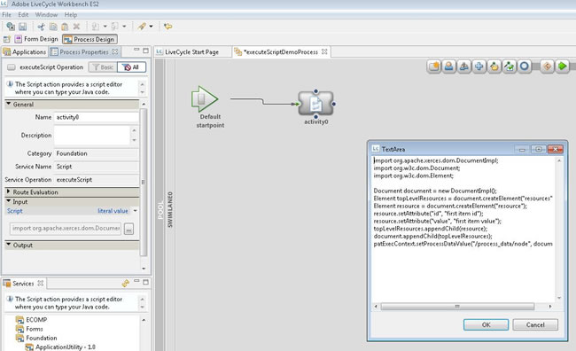

# Använda den körda skripttjänsten i AEM Forms på JEE Workbench för att skapa XML-data {#using-execute-script-service-forms-jee-workbench}

Det finns mycket XML i AEM Forms i arbetsflöden för JEE Process Management, till exempel: XML-information kan byggas in i en process och skickas till ett Flex-program i AEM Forms i JEE Workspace, användas för systeminställningar eller skicka information till och från formulär. Det finns många tillfällen då en AEM Forms on JEE-utvecklare behöver hantera XML, och många gånger kräver detta att XML hanteras via en AEM Forms on JEE-process.

När du hanterar enkla XML-inställningar kan du använda tjänsten `Set Value`, som är AEM Forms standardtjänst för JEE. Den här tjänsten anger värdet för ett eller flera dataobjekt i processdatamodellen. För enkla villkorsbaserade logik &quot;if this, then that&quot; kan den här tjänsten passa ändamålet.

I mer komplexa situationer är dock tjänsten Ange värde inte lika effektiv. I sådana fall måste man förlita sig på en mer robust uppsättning programmeringskommandon, t.ex. de som finns i ett programmeringsspråk som Java™. Det kan vara mycket enklare och tydligare att använda Java™ för att skapa komplex XML än att skapa ett XML-dokument av enkel text i tjänsten Ange värde. Dessutom är det enklare att inkludera villkorsstyrd programmering i Java™ än i en Set Value-tjänst.

## Använda Execute Script Service i en process {#using-execute-script-service-in-process}

Inom ramen för standarduppsättningen med AEM Forms på JEE-tjänster som är tillgängliga i AEM Forms på JEE Workbench är det `Execute Script`-tjänsten. Med den här tjänsten kan du köra skript i processer och utföra åtgärden `executeScript`.

### Skapa ett program och en process med tjänsten &quot;Execute Script&quot; definierad som en aktivitet {#create-an-application}

Den här självstudiekursen genererar inte alla program- och processgenereringar, men för instruktionens skull har ett program med namnet&quot;DemoApplication02&quot; skapats. Om ett program redan har skapats måste du skapa en process i det här programmet för att anropa executeScript-tjänsten. Så här lägger du till en process i programmet som innehåller tjänsten `Execute Script`:

1. Högerklicka på programmet och välj **[!UICONTROL New]**. Välj **[!UICONTROL Process]** på den utfällbara menyn **[!UICONTROL New]**. Namnge processen, lägg till en beskrivning om det behövs och välj den ikon som du vill ska representera processen. I den här självstudiekursen har vi skapat en process och gett den namnet `executeScriptDemoProcess`.
1. Definiera startpunkterna eller välj att lägga till startpunkterna senare.
1. Processen skapas nu och ska öppnas automatiskt i fönstret [!UICONTROL Process Design]. I det här fönstret klickar du på ikonen Aktivitetsväljaren högst upp i fönstret Processdesign och drar den nya aktiviteten till simbanan. Nu ska [!UICONTROL Define Activity Window] visas (se figur nedan).
   
1. Det går att hitta executeScript-tjänsten under `Foundation`-uppsättningen med tjänster. Tjänstnamnet listar objektet som `Execute Script – 1.0` med åtgärdsnamnet `executeScript`. Klicka för att markera det här objektet.
1. Den här processen bör nu skapas och som standard ska fönstret [!UICONTROL Process Properties] visas i rutan till vänster.

#### Lägg till ett skript i processen med tjänsten&quot;Execute Script&quot; {#add-script-to-process-with-execute-script}

När processen har skapats med aktiviteten Execute Script Service definierad kan du lägga till ett skript i processen. Så här lägger du till ett skript i den här processen:

1. Gå till paletten [!UICONTROL Process Properties]. Utöka avsnittet [!UICONTROL Input] på den här paletten och klicka på ikonen&quot;..&quot;.

1. Skriv skriptet i textrutan som visas. När skriptet har skrivits trycker du på OK (se figur nedan).
   

## Skapa XML med tjänsten Execute Script {#create-xml-execute-script-service}

När en process har skapats med skripttjänsten Execute, kan man sedan använda det här skriptet för att skapa XML. Du skulle skriva skripten som beskrivs nedan i textrutan som beskrivs i Lägg till ett skript i processen med tjänstavsnittet `Execute Script` ovan.

>[!NOTE]
>
> Om JAVA-skriptkoden överstiger 10 rader rekommenderar vi att du lägger till koden i anpassade DSC:er (Document Service Components) i stället för att skriva den direkt i processen. Anpassade DSC:er förbättrar underhållet, återanvändbarheten och prestandan genom att hålla arbetsflödena lätta. Genom att referera till de här komponenterna i arbetsflöden blir exekveringen effektivare och förhindrar eventuella flaskhalsar som orsakas av bearbetning av stora kodblock i arbetsflödet.

**Om tekniken i Execute Script Service**

För att veta vilka möjligheter och begränsningar som Execute Script-tjänsten har måste man känna till tjänstens tekniska grunder. I AEM Forms på JEE används parsern Apache Xerces Document Object Model (DOM) för att skapa och lagra XML-variabler i processer. Xerces är en Java™-implementering av W3C:s [Document Object Model-specifikation](https://dom.spec.whatwg.org/). DOM-specifikationen är ett standardsätt att hantera XML som har funnits sedan 1998. Java™-implementeringen av Xerces, Xerces-J, stöder DOM Level 2 version 1.0.

De Java™-klasser som används för att lagra XML-variabler är:

* org.apache.xerces.dom.NodeImpl och

* org.apache.xerces.dom.DocumentImpl

DocumentImpl är en underklass till NodeImpl, så det kan antas att alla XML-processvariabler är en NodeImpl-härledning. Mer information finns i dokumentationen för [NodeImpl](https://xerces.apache.org/xerces-j/apiDocs/org/apache/xerces/dom/NodeImpl.html).

**Ett exempel på hur du skapar XML med skripttjänsten**

Här är exemplet på hur du skapar XML i en Execute Script-tjänst. Processen har en variabelnod av typen XML. Resultatet av den här aktiviteten är ett XML-dokument. Vad det dokumentet gör, eller hur det används i den övergripande processen, är utanför omfånget för den här självstudiekursen; slutligen handlar det om vad XML-koden måste göra i det övergripande programmet. Som nämndes i inledningen kan XML användas för många syften i AEM Forms för JEE-formulär och -processer. Det här är bara en förklaring av hur du kodar Execute Script-aktiviteten för att skapa ett enkelt XML-dokument.

En enkel JavaScript som skapar XML ser ut ungefär så här:

```xml
import org.apache.xerces.dom.DocumentImpl;

import org.w3c.dom.Document;

import org.w3c.dom.Element;


Document document = new DocumentImpl();

Element topLevelResources = document.createElement("resources");

Element resource = document.createElement("resource");

resource.setAttribute("id", "first item id");

resource.setAttribute("value", "first item value");

topLevelResources.appendChild(resource);

document.appendChild(topLevelResources);

patExecContext.setProcessDataValue("/process_data/node", document);
```

>[!NOTE]
>
>Tidigare nämnda DOM-objekt måste importeras till skriptet.

Resultatet av det här enkla skriptet är ett nytt XML-dokument med en variabelnod som är inställd på:

```xml
<resources>

<resource id="first item id" value="first item value"/>

</resources>
```

**Använda en iterativ slinga för att lägga till noder i XML**

Noder kan också läggas till i en befintlig XML-variabel i processen. Variabeln, node, innehåller XML-objektet som skapades.

```xml
Document document = patExecContext.getProcessDataValue("/process_data/node");

NodeList childNodes = document.getChildNodes();

int numChildren = childNodes.getLength();

for (int i = 0; i < numChildren; i++)

{

Node currentChild = childNodes.item(i);

if (currentChild.getNodeType() == Node.ELEMENT_NODE)

{

// found the top-level node

Element newResource = document.createElement("resource");

newResource.setAttribute("id", "second item id");

newResource.setAttribute("value", "second item value");

currentChild.appendChild(newResource);

break;

}

}

patExecContext.setProcessDataValue("/process_data/node", document);
The variable node in the XML is now set to:

<resources> 

<resource id="first item id" value="first item value"/> 

<resource id="second item id" value="second item value"/> 

</resources>
```
