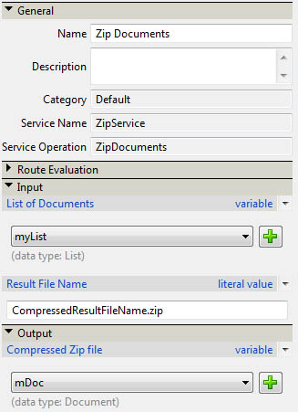

# Komprimera och dekomprimera filer med en AEM Forms på en anpassad JEE DSC {#compressing-decompressing-files}

## Nödvändig kunskap {#prerequisites}

Upplev AEM Forms i JEE Process Management, grundläggande Java-programmering och utveckling av anpassade komponenter.

**Ytterligare obligatoriska andra produkter**

Java-redigerare som [Eclipse](https://www.eclipse.org/) eller [Netbeans IDE](https://netbeans.apache.org/)

## Användarnivå {#user-level}

Mellanliggande

Med AEM Forms on JEE kan utvecklare skapa anpassade DSC (Document Service Container) för att skapa utökade funktioner. Det går att ansluta sådana komponenter till AEM Forms i JEE-miljön och det är avsett. I den här artikeln beskrivs hur du skapar en anpassad ZIP-tjänst som kan användas för att komprimera en lista med filer till en ZIP-fil och expandera en ZIP-fil till en lista med dokument.

## Skapa en anpassad DSC-komponent {#create-custom-dsc-component}

Skapa en anpassad DSC-komponent med två serviceåtgärder för att komprimera och expandera listan med dokument. Komponenten använder paketet java.util.zip för komprimering och dekomprimering. Följ stegen nedan för att skapa en anpassad komponent:

1. Lägg till filen adobe-livecycle-client.jar i biblioteket
1. Lägg till nödvändiga ikoner
1. Skapa en offentlig klass
1. Skapa två publika metoder som heter UnzipDocument och ZipDocuments
1. Skriv logiken för komprimering och dekomprimering

Koden finns här:

```java
/*
 * Custom DSC : ZIP Utility
 * Purpose: This is a LiveCycle ES2 custom component used to Compress & Decompress List of Documents
 * Author: Nithiyanandam Dharmadass
 * Organization: Ministry of Finance, Kingdom of Bahrain
 * Last modified Date: 18/Apr/2011
 */
package nith.lces2.dsc;

import java.util.zip.ZipEntry;
import java.util.zip.ZipInputStream;
import com.adobe.idp.Document;
import java.io.ByteArrayOutputStream;
import java.io.InputStream;
import java.util.ArrayList;
import java.util.List;
import java.util.zip.ZipOutputStream;

public class ZIPService {

    static final int BUFFER = 2048; // 2MB buffer size

    public java.util.List UnzipDocument(com.adobe.idp.Document zipDocument) throws Exception {
        ZipInputStream zis = new ZipInputStream(zipDocument.getInputStream());

        ZipEntry zipFile;

        List resultList = new ArrayList();

        while ((zipFile = zis.getNextEntry()) != null) {

            ByteArrayOutputStream byteArrayOutStream = new ByteArrayOutputStream();

            int count;  // an int variable to hold the number of bytes read from input stream
            byte data[] = new byte[BUFFER];
            while ((count = zis.read(data, 0, BUFFER)) != -1) {
                byteArrayOutStream.write(data, 0, count);   // write to byte array
            }

            com.adobe.idp.Document unzippedDoc = new Document(byteArrayOutStream.toByteArray());  // create an idp document
            unzippedDoc.setAttribute("file", zipFile.getName());
            unzippedDoc.setAttribute("wsfilename", zipFile.getName());  // update the wsfilename attribute
            resultList.add(unzippedDoc);
        }
        return resultList;  // List of uncompressed documents
    }

    public com.adobe.idp.Document ZipDocuments(java.util.List listOfDocuments,java.lang.String zipFileName) throws Exception {

        if (listOfDocuments == null || listOfDocuments.size() == 0) {
            return null;
        }

        ByteArrayOutputStream byteArrayOutStream = new ByteArrayOutputStream();
        ZipOutputStream zos = new ZipOutputStream(byteArrayOutStream);  // ZIP Output Stream

        for (int i = 0; i < listOfDocuments.size(); i++) {
            Document doc = (Document) listOfDocuments.get(i);
            InputStream docInputStream = doc.getInputStream();
            ZipEntry zipEntry = new ZipEntry(doc.getAttribute("file").toString());
            zos.putNextEntry(zipEntry);
            int count;
            byte data[] = new byte[BUFFER];
            while ((count = docInputStream.read(data, 0, BUFFER)) != -1) {
                zos.write(data, 0, count);  // Read document content and add to zip entry
            }
            zos.closeEntry();
        }
        zos.flush();
        zos.close();

        Document zippedDoc = new Document(byteArrayOutStream.toByteArray());
        if(zipFileName==null || zipFileName.equals(""))
        {
            zipFileName = "CompressedList.zip";
        }
        zippedDoc.setAttribute("file", zipFileName);
        return zippedDoc;
    }
}
```

## Skapa en Component.XML-fil {#create-component-xml-file}

En component.xml-fil måste skapas i rotmappen för det paket som definierade tjänståtgärderna och deras parametrar.

Filen component.xml visas här:

```xml
<?xml version="1.0" encoding="UTF-8"?>
<component xmlns="http://adobe.com/idp/dsc/component/document">
<!-- Unique id identifying this component -->
   <component-id>ZipService</component-id>

<!-- Version -->
   <version>1.0</version>

<!-- Start of the Service definition -->
   <services>
<!-- Unique name for service descriptor.
           The value is used as the default name for
           deployed services -->
      <service name="ZipService">
<!-- service implementation class definition -->
        <implementation-class>nith.lces2.dsc.ZIPService</implementation-class>

<!-- description -->
        <description>Compress or Decompress list of documents</description>

<!--  You can provide your own icons for a distinct look   -->
          <small-icon>icons/Zip_icon16.png</small-icon>
          <large-icon>icons/Zip_icon32.png</large-icon>


<!-- automatically deploys the service and starts it after installation -->
         <auto-deploy service-id="ZipService" />

         <operations>
<!-- method name in the interface setSmtpHost-->
            <operation name="UnzipDocument">
<!-- input parameters to the "send" method -->
              <input-parameter name="zipDocument" title="Input ZIP Document" type="com.adobe.idp.Document">
                    <hint>A ZIP File to be decompressed</hint>
                </input-parameter>
                <output-parameter name="resultList" title="Decompressed list of documents" type="java.util.List">
                    <hint>Decompressed ZIP list</hint>
                </output-parameter>
            </operation>
            <operation name="ZipDocuments">
<!-- input parameters to the "send" method -->
              <input-parameter name="listOfDocuments" title="List of Documents" type="java.util.List">
                    <hint>A list of documents to be Compressed</hint>
                </input-parameter>
                <input-parameter name="zipFileName" title="Result File Name" type="java.lang.String">
                    <hint>The name of compressed file (optional)</hint>
                </input-parameter>

                <output-parameter name="zippedDoc" title="Compressed Zip file" type="com.adobe.idp.Document">
                    <hint>Compressed ZIP File</hint>
                </output-parameter>
            </operation>
             </operations>
      </service>
   </services>
</component>
```

## Paketera och distribuera komponenten {#packaging-deploying-component}

1. Kompilera java-projektet och skapa en JAR-fil.
1. Distribuera komponenten (.JAR-fil) till AEM Forms på JEE-körning via Workbench.
1. Starta tjänsten från Workbench (se figur nedan).


## Använda ZIP-tjänsten i arbetsflöden {#using-zip-service-in-workflows}

UnzipDocument-åtgärden för den anpassade tjänsten kan nu acceptera en dokumentvariabel som indata och returnera en lista med dokumentvariabler som utdata.


På samma sätt kan zipDocuments-åtgärden för den anpassade komponenten acceptera en lista med dokument som indata, komprimera dem som en zip-fil och returnera det komprimerade dokumentet.



Följande arbetsflödessamordning visar hur du expanderar den angivna ZIP-filen, komprimerar dem till en annan ZIP-fil och returnerar utdata (se figur nedan).


## Exempel på användningsområden {#business-use-cases}

Du kan använda den här ZIP-tjänsten för följande användningsområden:

* Sök efter alla filer i en viss mapp och returnera filerna som ett komprimerat dokument.

* Ange en ZIP-fil som innehåller ett antal PDF-dokument som kan läsas upp när de har dekomprimerats. Detta kräver AEM Forms på JEE Reader Extensions-modulen.

* Ange en ZIP-fil som innehåller heterogena dokumenttyper som kan dekomprimeras och konverteras som PDF-dokument med hjälp av tjänsten Generera PDF.

* Skydda en lista med dokument och returnera som en ZIP-fil.

* Tillåt användare att hämta alla bilagor för en processinstans som en enskild ZIP-fil.


