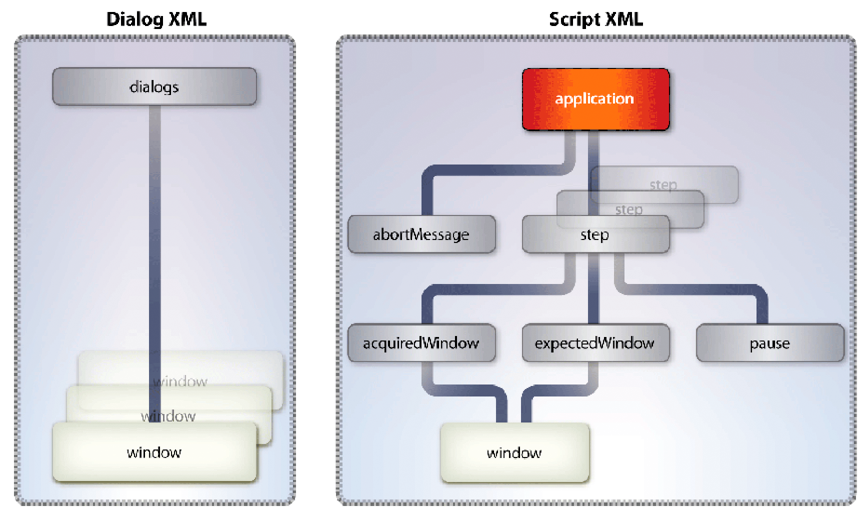

# Konvertera mellan filformat och PDF {#converting-between-file-formatsand-pdf}

**Om tjänsten Generera PDF**

Tjänsten Generate PDF konverterar filformaten till PDF. Den konverterar även PDF-filer till andra filformat och optimerar storleken på PDF-dokument.

Tjänsten Generate PDF använder inbyggda program för att konvertera följande filformat till PDF. Om inget annat anges stöds endast de tyska, franska, engelska och japanska versionerna av dessa program. *Endast* Windows har stöd för Windows Server® 2003 och Windows Server 2008.

* Microsoft Office 2003 och 2007 för att konvertera DOC, DOCX, RTF, TXT, XLS, XLSX, PPT, PPTX, VSD, MPP, MPPX, XPS och PUB (endast Windows)

   **Obs**: Acrobat® 9.2 eller senare krävs för att konvertera Microsoft XPS-format till PDF.*

* Autodesk AutoCAD 2005, 2006, 2007, 2008 och 2009 för att konvertera DWF, DWG och DXW (endast engelska)
* Corel WordPerfect 12 och X4 för att konvertera WPD, QPW, SHW (endast på engelska)
* OpenOffice 2.0, 2.4, 3.0.1 och 3.1 för konvertering av ODT, ODS, ODP, ODG, ODF, SXW, SXI, SXC, SXD, DOC, DOCX, RTF, TXT, XLS, XLSX, PPT, PPTX, VSD, MPP, MPPX och PUB

   ***Obs **: Tjänsten Generate PDF stöder inte 64-bitarsversionerna av OpenOffice.*

* Adobe Photoshop® CS2 för att konvertera PSD (endast Windows)

   ***Obs**! Photoshop CS3 och CS4 stöds inte eftersom de inte stöder Windows Server 2003 eller Windows Server 2008. *

* Adobe FrameMaker® 7.2 och 8 för att konvertera FM (endast Windows)
* Adobe PageMaker® 7.0 för konvertering av PMD, PM6, P65 och PM (endast Windows)
* Inbyggda format som stöds av tredjepartsprogram (kräver utveckling av installationsfiler som är specifika för programmet) (endast Windows)

Tjänsten Generate PDF konverterar följande standardbaserade filformat till PDF.

* Videoformat: SWF, FLV (endast Windows)
* Bildformat: JPEG, JPG, JP2, J2Kí, JPC, J2C, GIF, BMP, TIFF, TIF, PNG, JPF
* HTML (Windows, Sun™ Solaris™ och Linux®)

Tjänsten Generate PDF konverterar PDF till följande filformat (endast Windows):

* Encapsulated PostScript (EPS)
* HTML 3.2
* HTML 4.01 med CSS 1.0
* DOC (Microsoft Word-format)
* RTF
* Text (både tillgänglig och normal)
* XML
* PDF/A-1a som endast använder DeviceRGB-färgmodellen
* PDF/A-1b som endast använder DeviceRGB-färgmodellen

Tjänsten Generera PDF kräver att du utför följande administrativa uppgifter:

* Installera nödvändiga inbyggda program på datorn som är värd för AEM-formulär
* Installera Adobe Acrobat Professional eller Acrobat Pro Extended 9.2 på den dator där AEM Forms finns
* Utför konfigurationsuppgifter efter installation

Dessa åtgärder beskrivs i Installera och distribuera AEM-formulär med JBoss-tangenten.

Du kan utföra följande uppgifter med tjänsten Generera PDF:

* Konvertera från egna filformat till PDF.
* Konvertera HTML-dokument till PDF-dokument.
* Konvertera PDF-dokument till filformat.

>[!NOTE]
>
>Mer information om tjänsten Generera PDF finns i [Tjänstreferens för AEM-formulär](https://www.adobe.com/go/learn_aemforms_services_63).

## Konvertera Word-dokument till PDF-dokument {#converting-word-documents-to-pdf-documents}

I det här avsnittet beskrivs hur du kan använda Generate PDF API för att programmässigt konvertera ett Microsoft Word-dokument till ett PDF-dokument.

>[!NOTE]
>
>Mer information om ytterligare filformat finns i [Lägga till stöd för fler inbyggda filformat](converting-file-formats-pdf.md#adding-support-for-additional-native-file-formats).

>[!NOTE]
>
>Mer information om tjänsten Generera PDF finns i [Tjänstreferens för AEM-formulär](https://www.adobe.com/go/learn_aemforms_services_63).

### Sammanfattning av steg {#summary-of-steps}

Så här konverterar du ett Microsoft Word-dokument till ett PDF-dokument:

1. Inkludera projektfiler.
1. Skapa en Generate PDF-klient.
1. Hämta filen som ska konverteras till ett PDF-dokument.
1. Konvertera filen till ett PDF-dokument.
1. Hämta resultaten.

**Inkludera projektfiler**

Inkludera nödvändiga filer i utvecklingsprojektet. Om du skapar ett klientprogram med Java, inkluderar du de JAR-filer som behövs. Om du använder webbtjänster måste du inkludera proxyfilerna.

**Skapa en Generera PDF-klient**

Skapa en klient för Generera PDF innan du programmässigt utför en Generate PDF-åtgärd. Om du använder Java API skapar du ett `GeneratePdfServiceClient` objekt. Om du använder webbtjänstens API skapar du ett `GeneratePDFServiceService` objekt.

**Hämta filen som ska konverteras till ett PDF-dokument**

Hämta Microsoft Word-dokumentet som ska konverteras till ett PDF-dokument.

**Konvertera filen till ett PDF-dokument**

När du har skapat tjänstklienten Generate PDF kan du anropa `createPDF2` metoden. Den här metoden kräver information om dokumentet som ska konverteras, inklusive filtillägget.

**Hämta resultaten**

När filen har konverterats till ett PDF-dokument kan du hämta resultatet. När du till exempel har konverterat en Word-fil till ett PDF-dokument kan du hämta och spara PDF-dokumentet.

**Se även**

[Konvertera Word-dokument till PDF-dokument med Java API](converting-file-formats-pdf.md#convert-word-documents-to-pdf-documents-using-the-java-api)

[Konvertera Word-dokument till PDF-dokument med webbtjänstens API](converting-file-formats-pdf.md#convert-word-documents-to-pdf-documents-using-the-web-service-api)

[Inkludera AEM Forms Java-biblioteksfiler](/help/forms/developing/invoking-aem-forms-using-java.md#including-aem-forms-java-library-files)

[Ange anslutningsegenskaper](/help/forms/developing/invoking-aem-forms-using-java.md#setting-connection-properties)

[Skapa API-snabbstart för PDF-tjänst](/help/forms/developing/generate-pdf-service-java-api.md#generate-pdf-service-java-api-quick-start-soap)

### Konvertera Word-dokument till PDF-dokument med Java API {#convert-word-documents-to-pdf-documents-using-the-java-api}

Konvertera ett Microsoft Word-dokument till ett PDF-dokument med hjälp av Generera PDF API (Java):

1. Inkludera projektfiler.

   Inkludera JAR-klientfiler, t.ex. adobe-generatepdf-client.jar, i Java-projektets klassökväg.

1. Skapa en Generate PDF-klient.

   * Skapa ett `ServiceClientFactory` objekt som innehåller anslutningsegenskaper.
   * Skapa ett `GeneratePdfServiceClient` objekt med hjälp av dess konstruktor och skicka `ServiceClientFactory` objektet.

1. Hämta filen som ska konverteras till ett PDF-dokument.

   * Skapa ett `java.io.FileInputStream` objekt som representerar Word-filen som ska konverteras med hjälp av dess konstruktor. Skicka ett strängvärde som anger filens plats.
   * Skapa ett `com.adobe.idp.Document` objekt med hjälp av dess konstruktor och skicka `java.io.FileInputStream` objektet.

1. Konvertera filen till ett PDF-dokument.

   Konvertera filen till ett PDF-dokument genom att anropa `GeneratePdfServiceClient` objektets `createPDF2` metod och skicka följande värden:

   * Ett `com.adobe.idp.Document` objekt som representerar den fil som ska konverteras.
   * Ett `java.lang.String` objekt som innehåller filtillägget.
   * Ett `java.lang.String` objekt som innehåller de filtypsinställningar som ska användas vid konverteringen. Filtypsinställningarna innehåller konverteringsinställningar för olika filtyper, till exempel .doc eller .xls.
   * Ett `java.lang.String` objekt som innehåller namnet på PDF-inställningarna som ska användas. Du kan till exempel ange `Standard`.
   * Ett `java.lang.String` objekt som innehåller namnet på de skyddsinställningar som ska användas.
   * Ett valfritt `com.adobe.idp.Document` objekt som innehåller inställningar som ska användas när PDF-dokumentet genereras.
   * Ett valfritt `com.adobe.idp.Document` objekt som innehåller metadatainformation som ska användas i PDF-dokumentet.
   Metoden returnerar `createPDF2` ett `CreatePDFResult` objekt som innehåller det nya PDF-dokumentet och en logginformation. Loggfilen innehåller vanligen fel- eller varningsmeddelanden som genererats av konverteringsbegäran.

1. Hämta resultaten.

   Så här hämtar du PDF-dokumentet:

   * Anropa `CreatePDFResult` objektets `getCreatedDocument` metod som returnerar ett `com.adobe.idp.Document` objekt.
   * Anropa `com.adobe.idp.Document` objektets `copyToFile` metod för att extrahera PDF-dokumentet från objektet som skapades i föregående steg.
   Utför följande åtgärder om du använde metoden för att hämta loggdokumentet (gäller inte för HTML-konverteringar): `createPDF2`

   * Anropa `CreatePDFResult` objektets `getLogDocument` metod. Detta returnerar ett `com.adobe.idp.Document` objekt.
   * Anropa `com.adobe.idp.Document` objektets `copyToFile` metod för att extrahera loggdokumentet.


**Se även**

[Sammanfattning av steg](converting-file-formats-pdf.md#summary-of-steps)

[Snabbstart (SOAP-läge): Konvertera ett Microsoft Word-dokument till ett PDF-dokument med Java API](/help/forms/developing/generate-pdf-service-java-api.md#quick-start-soap-mode-converting-a-microsoft-word-document-to-a-pdf-document-using-the-java-api)

[Inkludera AEM Forms Java-biblioteksfiler](/help/forms/developing/invoking-aem-forms-using-java.md#including-aem-forms-java-library-files)

[Ange anslutningsegenskaper](/help/forms/developing/invoking-aem-forms-using-java.md#setting-connection-properties)

### Konvertera Word-dokument till PDF-dokument med webbtjänstens API {#convert-word-documents-to-pdf-documents-using-the-web-service-api}

Konvertera ett Microsoft Word-dokument till ett PDF-dokument med hjälp av Generate PDF API (webbtjänsten):

1. Inkludera projektfiler.

   Skapa ett Microsoft .NET-projekt som använder MTOM. Kontrollera att du använder följande WSDL-definition: `http://localhost:8080/soap/services/GeneratePDFService?WSDL&lc_version=9.0.1`.

   >[!NOTE]
   >
   >Ersätt `localhost` med IP-adressen för servern som är värd för AEM Forms.

1. Skapa en Generate PDF-klient.

   * Skapa ett `GeneratePDFServiceClient` objekt med hjälp av dess standardkonstruktor.
   * Skapa ett `GeneratePDFServiceClient.Endpoint.Address` objekt med hjälp av `System.ServiceModel.EndpointAddress` konstruktorn. Skicka ett strängvärde som anger WSDL till AEM Forms-tjänsten (till exempel `http://localhost:8080/soap/services/GeneratePDFService?blob=mtom`.). Du behöver inte använda attributet `lc_version` . Ange dock `?blob=mtom`.
   * Skapa ett `System.ServiceModel.BasicHttpBinding` objekt genom att hämta värdet för `GeneratePDFServiceClient.Endpoint.Binding` fältet. Sänd returvärdet till `BasicHttpBinding`.
   * Ställ in `System.ServiceModel.BasicHttpBinding` objektets `MessageEncoding` fält till `WSMessageEncoding.Mtom`. Detta värde garanterar att MTOM används.
   * Aktivera grundläggande HTTP-autentisering genom att utföra följande åtgärder:

      * Tilldela användarnamnet för AEM-formulär till fältet `GeneratePDFServiceClient.ClientCredentials.UserName.UserName`.
      * Tilldela motsvarande lösenordsvärde till fältet `GeneratePDFServiceClient.ClientCredentials.UserName.Password`.
      * Tilldela konstantvärdet `HttpClientCredentialType.Basic` till fältet `BasicHttpBindingSecurity.Transport.ClientCredentialType`.
      * Tilldela konstantvärdet `BasicHttpSecurityMode.TransportCredentialOnly` till fältet `BasicHttpBindingSecurity.Security.Mode`.

1. Hämta filen som ska konverteras till ett PDF-dokument.

   * Skapa ett `BLOB` objekt med hjälp av dess konstruktor. Objektet används `BLOB` för att lagra filen som du vill konvertera till ett PDF-dokument.
   * Skapa ett `System.IO.FileStream` objekt genom att anropa dess konstruktor. Skicka ett strängvärde som representerar filplatsen för filen som ska konverteras och läget som filen ska öppnas i.
   * Skapa en bytearray som lagrar innehållet i `System.IO.FileStream` objektet. Du kan bestämma storleken på bytearrayen genom att hämta `System.IO.FileStream` objektets `Length` egenskap.
   * Fyll bytearrayen med strömdata genom att anropa `System.IO.FileStream` objektets `Read` metod och skicka bytearrayen, startpositionen och den strömlängd som ska läsas.
   * Fylla i objektet genom att tilldela dess `BLOB` `MTOM` egenskap innehållet i bytearrayen.

1. Konvertera filen till ett PDF-dokument.

   Konvertera filen till ett PDF-dokument genom att anropa `GeneratePDFServiceService` objektets `CreatePDF2` metod och skicka följande värden:

   * Ett `BLOB` objekt som representerar filen som ska konverteras.
   * En sträng som innehåller filtillägget.
   * Ett `java.lang.String` objekt som innehåller de filtypsinställningar som ska användas vid konverteringen. Filtypsinställningarna innehåller konverteringsinställningar för olika filtyper, till exempel .doc eller .xls.
   * Ett strängobjekt som innehåller de PDF-inställningar som ska användas. Du kan ange `Standard`.
   * Ett strängobjekt som innehåller de skyddsinställningar som ska användas. Du kan ange `No Security`.
   * Ett valfritt `BLOB` objekt som innehåller inställningar som ska användas när PDF-dokumentet genereras.
   * Ett valfritt `BLOB` objekt som innehåller metadatainformation som ska användas i PDF-dokumentet.
   * En utdataparameter av typen `BLOB` som fylls i av `CreatePDF2` metoden. Metoden `CreatePDF2` fyller i det här objektet med det konverterade dokumentet. (Det här parametervärdet krävs bara för webbtjänstanrop).
   * En utdataparameter av typen `BLOB` som fylls i av `CreatePDF2` metoden. Metoden `CreatePDF2` fyller i det här objektet med loggdokumentet. (Det här parametervärdet krävs bara för webbtjänstanrop).

1. Hämta resultaten.

   * Hämta det konverterade PDF-dokumentet genom att tilldela `BLOB` objektets `MTOM` fält till en bytearray. Bytearrayen representerar det konverterade PDF-dokumentet. Se till att du använder det objekt `BLOB` som används som utdataparameter för `createPDF2` metoden.
   * Skapa ett `System.IO.FileStream` objekt genom att anropa dess konstruktor och skicka ett strängvärde som representerar filplatsen för det konverterade PDF-dokumentet.
   * Skapa ett `System.IO.BinaryWriter` objekt genom att anropa dess konstruktor och skicka `System.IO.FileStream` objektet.
   * Skriv bytearrayens innehåll till en PDF-fil genom att anropa `System.IO.BinaryWriter` objektets `Write` metod och skicka bytearrayen.

**Se även**

[Sammanfattning av steg](converting-file-formats-pdf.md#summary-of-steps)

[Anropa AEM-formulär med MTOM](/help/forms/developing/invoking-aem-forms-using-web.md#invoking-aem-forms-using-mtom)

[Anropa AEM-formulär med SwaRef](/help/forms/developing/invoking-aem-forms-using-web.md#invoking-aem-forms-using-swaref)

## Konvertera HTML-dokument till PDF-dokument {#converting-html-documents-to-pdf-documents}

I det här avsnittet beskrivs hur du kan använda Generate PDF API för att programmässigt konvertera HTML-dokument till PDF-dokument.

>[!NOTE]
>
>Mer information om tjänsten Generera PDF finns i [Tjänstreferens för AEM-formulär](https://www.adobe.com/go/learn_aemforms_services_63).

### Sammanfattning av steg {#summary_of_steps-1}

Så här konverterar du ett HTML-dokument till ett PDF-dokument:

1. Inkludera projektfiler.
1. Skapa en Generate PDF-klient.
1. Hämta HTML-innehållet som ska konverteras till ett PDF-dokument.
1. Konvertera HTML-innehållet till ett PDF-dokument.
1. Hämta resultaten.

**Inkludera projektfiler**

Inkludera nödvändiga filer i utvecklingsprojektet. Om du skapar ett klientprogram med Java, inkluderar du de JAR-filer som behövs. Om du använder webbtjänster måste du inkludera proxyfilerna.

**Skapa en Generera PDF-klient**

Innan du programmässigt kan utföra en generering av PDF-åtgärd måste du skapa en klient för generering av PDF-tjänst. Om du använder Java API skapar du ett `GeneratePdfServiceClient` objekt. Om du använder webbtjänstens API skapar du en `GeneratePDFServiceService`.

**Hämta HTML-innehåll som ska konverteras till ett PDF-dokument**

Referera till HTML-innehåll som du vill konvertera till ett PDF-dokument. Du kan referera till HTML-innehåll som en HTML-fil eller HTML-innehåll som är tillgängligt via en URL.

**Konvertera HTML-innehållet till ett PDF-dokument**

När du har skapat tjänstklienten kan du anropa lämplig åtgärd för att skapa PDF-filer. Den här åtgärden kräver information om dokumentet som ska konverteras, inklusive sökvägen till måldokumentet.

**Hämta resultaten**

När HTML-innehållet har konverterats till ett PDF-dokument kan du hämta resultatet och spara PDF-dokumentet.

**Se även**

[Konvertera HTML-innehåll till ett PDF-dokument med Java API](converting-file-formats-pdf.md#convert-html-content-to-a-pdf-document-using-the-java-api)

[Konvertera HTML-innehåll till ett PDF-dokument med webbtjänstens API](converting-file-formats-pdf.md#convert-html-content-to-a-pdf-document-using-the-web-service-api)

[Inkludera AEM Forms Java-biblioteksfiler](/help/forms/developing/invoking-aem-forms-using-java.md#including-aem-forms-java-library-files)

[Ange anslutningsegenskaper](/help/forms/developing/invoking-aem-forms-using-java.md#setting-connection-properties)

[Skapa API-snabbstart för PDF-tjänst](/help/forms/developing/generate-pdf-service-java-api.md#generate-pdf-service-java-api-quick-start-soap)

### Konvertera HTML-innehåll till ett PDF-dokument med Java API {#convert-html-content-to-a-pdf-document-using-the-java-api}

Konvertera ett HTML-dokument till ett PDF-dokument med hjälp av Generate PDF API (Java):

1. Inkludera projektfiler.

   Inkludera JAR-klientfiler, t.ex. adobe-generatepdf-client.jar, i Java-projektets klassökväg.

1. Skapa en Generate PDF-klient.

   Skapa ett `GeneratePdfServiceClient` objekt med hjälp av dess konstruktor och skicka ett `ServiceClientFactory` objekt som innehåller anslutningsegenskaper.

1. Hämta HTML-innehållet som ska konverteras till ett PDF-dokument.

   Hämta HTML-innehåll genom att skapa en strängvariabel och tilldela en URL som pekar på HTML-innehåll.

1. Konvertera HTML-innehållet till ett PDF-dokument.

   Anropa `GeneratePdfServiceClient` objektets `htmlToPDF2` metod och skicka följande värden:

   * Ett `java.lang.String` objekt som innehåller URL:en för HTML-filen som ska konverteras.
   * Ett `java.lang.String` objekt som innehåller de filtypsinställningar som ska användas vid konverteringen. Filtypsinställningarna kan innehålla spidernivåer.
   * Ett `java.lang.String` objekt som innehåller namnet på de skyddsinställningar som ska användas.
   * Ett valfritt `com.adobe.idp.Document` objekt som innehåller inställningar som ska användas när PDF-dokumentet genereras. Om den här informationen inte anges väljs inställningarna automatiskt baserat på de tre föregående parametrarna.
   * Ett valfritt `com.adobe.idp.Document` objekt som innehåller metadatainformation som ska användas i PDF-dokumentet.

1. Hämta resultaten.

   Metoden returnerar `htmlToPDF2` ett `HtmlToPdfResult` objekt som innehåller det nya PDF-dokumentet som skapades. Utför följande åtgärder för att hämta det nya PDF-dokumentet:

   * Anropa `HtmlToPdfResult` objektets `getCreatedDocument` metod. Detta returnerar ett `com.adobe.idp.Document` objekt.
   * Anropa `com.adobe.idp.Document` objektets `copyToFile` metod för att extrahera PDF-dokumentet från objektet som skapades i föregående steg.

**Se även**

[Konvertera HTML-dokument till PDF-dokument](converting-file-formats-pdf.md#converting-html-documents-to-pdf-documents)

[Snabbstart (SOAP-läge): Konvertera HTML-innehåll till ett PDF-dokument med Java API](/help/forms/developing/generate-pdf-service-java-api.md#quick-start-soap-mode-converting-html-content-to-a-pdf-document-using-the-java-api)

[Snabbstart (SOAP-läge): Konvertera HTML-innehåll till ett PDF-dokument med Java API](/help/forms/developing/generate-pdf-service-java-api.md#quick-start-soap-mode-converting-html-content-to-a-pdf-document-using-the-java-api)

[Inkludera AEM Forms Java-biblioteksfiler](/help/forms/developing/invoking-aem-forms-using-java.md#including-aem-forms-java-library-files)

[Ange anslutningsegenskaper](/help/forms/developing/invoking-aem-forms-using-java.md#setting-connection-properties)

### Konvertera HTML-innehåll till ett PDF-dokument med webbtjänstens API {#convert-html-content-to-a-pdf-document-using-the-web-service-api}

Konvertera HTML-innehåll till ett PDF-dokument med hjälp av Generate PDF API (webbtjänsten):

1. Inkludera projektfiler.

   Skapa ett Microsoft .NET-projekt som använder MTOM. Kontrollera att du använder följande WSDL-definition: `http://localhost:8080/soap/services/GeneratePDFService?WSDL&lc_version=9.0.1`.

   >[!NOTE]
   >
   >Ersätt `localhost` med IP-adressen för servern som är värd för AEM Forms.

1. Skapa en Generate PDF-klient.

   * Skapa ett `GeneratePDFServiceClient` objekt med hjälp av dess standardkonstruktor.
   * Skapa ett `GeneratePDFServiceClient.Endpoint.Address` objekt med hjälp av `System.ServiceModel.EndpointAddress` konstruktorn. Skicka ett strängvärde som anger WSDL till AEM Forms-tjänsten (till exempel `http://localhost:8080/soap/services/GeneratePDFService?blob=mtom`.). Du behöver inte använda attributet `lc_version` . Ange dock `?blob=mtom`.
   * Skapa ett `System.ServiceModel.BasicHttpBinding` objekt genom att hämta värdet för `GeneratePDFServiceClient.Endpoint.Binding` fältet. Sänd returvärdet till `BasicHttpBinding`.
   * Ställ in `System.ServiceModel.BasicHttpBinding` objektets `MessageEncoding` fält till `WSMessageEncoding.Mtom`. Detta värde garanterar att MTOM används.
   * Aktivera grundläggande HTTP-autentisering genom att utföra följande åtgärder:

      * Tilldela användarnamnet för AEM-formulär till fältet `GeneratePDFServiceClient.ClientCredentials.UserName.UserName`.
      * Tilldela motsvarande lösenordsvärde till fältet `GeneratePDFServiceClient.ClientCredentials.UserName.Password`.
      * Tilldela konstantvärdet `HttpClientCredentialType.Basic` till fältet `BasicHttpBindingSecurity.Transport.ClientCredentialType`.
      * Tilldela konstantvärdet `BasicHttpSecurityMode.TransportCredentialOnly` till fältet `BasicHttpBindingSecurity.Security.Mode`.

1. Hämta HTML-innehållet som ska konverteras till ett PDF-dokument.

   Hämta HTML-innehåll genom att skapa en strängvariabel och tilldela en URL som pekar på HTML-innehåll.

1. Konvertera HTML-innehållet till ett PDF-dokument.

   Konvertera HTML-innehållet till ett PDF-dokument genom att anropa `GeneratePDFServiceService` objektets `HtmlToPDF2` metod och skicka följande värden:

   * En sträng som innehåller det HTML-innehåll som ska konverteras.
   * Ett `java.lang.String` objekt som innehåller de filtypsinställningar som ska användas vid konverteringen.
   * Ett strängobjekt som innehåller de skyddsinställningar som ska användas.
   * Ett valfritt `BLOB` objekt som innehåller inställningar som ska användas när PDF-dokumentet genereras.
   * Ett valfritt `BLOB` objekt som innehåller metadatainformation som ska användas i PDF-dokumentet.
   * En utdataparameter av typen `BLOB` som fylls i av `CreatePDF2` metoden. Metoden `CreatePDF2` fyller i det här objektet med det konverterade dokumentet. (Det här parametervärdet krävs bara för webbtjänstanrop).

1. Hämta resultaten.

   * Hämta det konverterade PDF-dokumentet genom att tilldela `BLOB` objektets `MTOM` fält till en bytearray. Bytearrayen representerar det konverterade PDF-dokumentet. Se till att du använder det objekt `BLOB` som används som utdataparameter för `HtmlToPDF2` metoden.
   * Skapa ett `System.IO.FileStream` objekt genom att anropa dess konstruktor och skicka ett strängvärde som representerar filplatsen för det konverterade PDF-dokumentet.
   * Skapa ett `System.IO.BinaryWriter` objekt genom att anropa dess konstruktor och skicka `System.IO.FileStream` objektet.
   * Skriv bytearrayens innehåll till en PDF-fil genom att anropa `System.IO.BinaryWriter` objektets `Write` metod och skicka bytearrayen.

**Se även**

[Konvertera HTML-dokument till PDF-dokument](converting-file-formats-pdf.md#converting-html-documents-to-pdf-documents)

[Anropa AEM-formulär med MTOM](/help/forms/developing/invoking-aem-forms-using-web.md#invoking-aem-forms-using-mtom)

[Anropa AEM-formulär med SwaRef](/help/forms/developing/invoking-aem-forms-using-web.md#invoking-aem-forms-using-swaref)

## Konvertera PDF-dokument till andra format än bildformat {#converting-pdf-documents-to-non-image-formats}

I det här avsnittet beskrivs hur du kan använda Generate PDF Java API och webbtjänstens API för att programmässigt konvertera ett PDF-dokument till en RTF-fil, som är ett exempel på ett icke-bildformat. Andra format som inte är bildformat är HTML, text, DOC och EPS. När du konverterar ett PDF-dokument till RTF ska du kontrollera att PDF-dokumentet inte innehåller formulärelement, t.ex. en skicka-knapp. Formulärelement konverteras inte.

>[!NOTE]
>
>Mer information om tjänsten Generera PDF finns i [Tjänstreferens för AEM-formulär](https://www.adobe.com/go/learn_aemforms_services_63).

### Sammanfattning av steg {#summary_of_steps-2}

Så här konverterar du ett PDF-dokument till någon av de typer som stöds:

1. Inkludera projektfiler.
1. Skapa en Generate PDF-klient.
1. Hämta PDF-dokumentet som ska konverteras.
1. Konvertera PDF-dokumentet.
1. Spara den konverterade filen.

**Inkludera projektfiler**

Inkludera nödvändiga filer i utvecklingsprojektet. Om du skapar ett klientprogram med Java, inkluderar du de JAR-filer som behövs. Om du använder webbtjänster måste du inkludera proxyfilerna.

**Skapa en Generera PDF-klient**

Innan du programmässigt kan utföra en generering av PDF-åtgärd måste du skapa en klient för generering av PDF-tjänst. Om du använder Java API skapar du ett `GeneratePdfServiceClient` objekt. Om du använder webbtjänstens API skapar du ett `GeneratePDFServiceService` objekt.

**Hämta PDF-dokumentet som ska konverteras**

Hämta PDF-dokumentet som ska konverteras till ett format som inte är en bild.

**Konvertera PDF-dokumentet**

När du har skapat tjänstklienten kan du starta PDF-exporten. Den här åtgärden kräver information om dokumentet som ska konverteras, inklusive sökvägen till måldokumentet.

**Spara den konverterade filen**

Spara den konverterade filen. Om du till exempel konverterar ett PDF-dokument till en RTF-fil sparar du det konverterade dokumentet till en RTF-fil.

**Se även**

[Konvertera ett PDF-dokument till en RTF-fil med Java API](converting-file-formats-pdf.md#convert-a-pdf-document-to-a-rtf-file-using-the-java-api)

[Konvertera ett PDF-dokument till en RTF-fil med webbtjänstens API](converting-file-formats-pdf.md#convert-a-pdf-document-to-a-rtf-file-using-the-web-service-api)

[Inkludera AEM Forms Java-biblioteksfiler](/help/forms/developing/invoking-aem-forms-using-java.md#including-aem-forms-java-library-files)

[Ange anslutningsegenskaper](/help/forms/developing/invoking-aem-forms-using-java.md#setting-connection-properties)

[Skapa API-snabbstart för PDF-tjänst](/help/forms/developing/generate-pdf-service-java-api.md#generate-pdf-service-java-api-quick-start-soap)

### Konvertera ett PDF-dokument till en RTF-fil med Java API {#convert-a-pdf-document-to-a-rtf-file-using-the-java-api}

Konvertera ett PDF-dokument till en RTF-fil med hjälp av Generate PDF API (Java):

1. Inkludera projektfiler.

   Inkludera JAR-klientfiler, t.ex. adobe-generatepdf-client.jar, i Java-projektets klassökväg.

1. Skapa en Generate PDF-klient.

   Skapa ett `GeneratePdfServiceClient` objekt med hjälp av dess konstruktor och skicka ett `ServiceClientFactory` objekt som innehåller anslutningsegenskaper.

1. Hämta PDF-dokumentet som ska konverteras.

   * Skapa ett `java.io.FileInputStream` objekt som representerar PDF-dokumentet som ska konverteras med hjälp av dess konstruktor. Skicka ett strängvärde som anger platsen för PDF-dokumentet.
   * Skapa ett `com.adobe.idp.Document` objekt med hjälp av dess konstruktor och skicka `java.io.FileInputStream` objektet.

1. Konvertera PDF-dokumentet.

   Anropa `GeneratePdfServiceClient` objektets `exportPDF2` metod och skicka följande värden:

   * Ett `com.adobe.idp.Document` objekt som representerar den PDF-fil som ska konverteras.
   * Ett `java.lang.String` objekt som innehåller namnet på filen som ska konverteras.
   * Ett `java.lang.String` objekt som innehåller namnet på Adobe PDF-inställningarna.
   * Ett `ConvertPDFFormatType` objekt som anger målfiltypen för konverteringen.
   * Ett valfritt `com.adobe.idp.Document` objekt som innehåller inställningar som ska användas när PDF-dokumentet genereras.
   Metoden `exportPDF2` returnerar ett `ExportPDFResult` objekt som innehåller den konverterade filen.

1. Konvertera PDF-dokumentet.

   Utför följande åtgärder för att hämta den nya filen:

   * Anropa `ExportPDFResult` objektets `getConvertedDocument` metod. Detta returnerar ett `com.adobe.idp.Document` objekt.
   * Anropa `com.adobe.idp.Document` objektets `copyToFile` metod för att extrahera det nya dokumentet.

**Se även**

[Sammanfattning av steg](converting-file-formats-pdf.md#summary-of-steps)

[Snabbstart (SOAP-läge): Konvertera HTML-innehåll till ett PDF-dokument med Java API](/help/forms/developing/generate-pdf-service-java-api.md#quick-start-soap-mode-converting-html-content-to-a-pdf-document-using-the-java-api)

[Inkludera AEM Forms Java-biblioteksfiler](/help/forms/developing/invoking-aem-forms-using-java.md#including-aem-forms-java-library-files)

[Ange anslutningsegenskaper](/help/forms/developing/invoking-aem-forms-using-java.md#setting-connection-properties)

### Konvertera ett PDF-dokument till en RTF-fil med webbtjänstens API {#convert-a-pdf-document-to-a-rtf-file-using-the-web-service-api}

Konvertera ett PDF-dokument till en RTF-fil med hjälp av Generate PDF API (webbtjänsten):

1. Inkludera projektfiler.

   Skapa ett Microsoft .NET-projekt som använder MTOM. Kontrollera att du använder följande WSDL-definition: `http://localhost:8080/soap/services/GeneratePDFService?WSDL&lc_version=9.0.1`.

   >[!NOTE]
   >
   >Ersätt `localhost` med IP-adressen för servern som är värd för AEM Forms.

1. Skapa en Generate PDf-klient.

   * Skapa ett `GeneratePDFServiceClient` objekt med hjälp av dess standardkonstruktor.
   * Skapa ett `GeneratePDFServiceClient.Endpoint.Address` objekt med hjälp av `System.ServiceModel.EndpointAddress` konstruktorn. Skicka ett strängvärde som anger WSDL till AEM Forms-tjänsten (till exempel `http://localhost:8080/soap/services/GeneratePDFService?blob=mtom`.). Du behöver inte använda attributet `lc_version` . Ange dock `?blob=mtom`.
   * Skapa ett `System.ServiceModel.BasicHttpBinding` objekt genom att hämta värdet för `GeneratePDFServiceClient.Endpoint.Binding` fältet. Sänd returvärdet till `BasicHttpBinding`.
   * Ställ in `System.ServiceModel.BasicHttpBinding` objektets `MessageEncoding` fält till `WSMessageEncoding.Mtom`. Detta värde garanterar att MTOM används.
   * Aktivera grundläggande HTTP-autentisering genom att utföra följande åtgärder:

      * Tilldela användarnamnet för AEM-formulär till fältet `GeneratePDFServiceClient.ClientCredentials.UserName.UserName`.
      * Tilldela motsvarande lösenordsvärde till fältet `GeneratePDFServiceClient.ClientCredentials.UserName.Password`.
      * Tilldela konstantvärdet `HttpClientCredentialType.Basic` till fältet `BasicHttpBindingSecurity.Transport.ClientCredentialType`.
      * Tilldela konstantvärdet `BasicHttpSecurityMode.TransportCredentialOnly` till fältet `BasicHttpBindingSecurity.Security.Mode`.

1. Hämta PDF-dokumentet som ska konverteras.

   * Skapa ett `BLOB` objekt med hjälp av dess konstruktor. Objektet används `BLOB` för att lagra ett PDF-dokument som konverteras.
   * Skapa ett `System.IO.FileStream` objekt genom att anropa dess konstruktor och skicka ett strängvärde som representerar filplatsen för PDF-dokumentet och läget som filen ska öppnas i.
   * Skapa en bytearray som lagrar innehållet i `System.IO.FileStream` objektet. Du kan bestämma storleken på bytearrayen genom att hämta `System.IO.FileStream` objektets `Length` egenskap.
   * Fyll bytearrayen med strömdata genom att anropa `System.IO.FileStream` objektets `Read` metod och skicka bytearrayen, startpositionen och den strömlängd som ska läsas.
   * Fylla i objektet genom att tilldela dess `BLOB` `MTOM` egenskap innehållet i bytearrayen.

1. Konvertera PDF-dokumentet.

   Anropa `GeneratePDFServiceServiceWse` objektets `ExportPDF2` metod och skicka följande värden:

   * Ett `BLOB` objekt som representerar den PDF-fil som ska konverteras.
   * En sträng som innehåller sökvägen till filen som ska konverteras.
   * Ett `java.lang.String` objekt som anger filens plats.
   * Ett strängobjekt som anger målfiltypen för konverteringen. Ange `RTF`.
   * Ett valfritt `BLOB` objekt som innehåller inställningar som ska användas när PDF-dokumentet genereras.
   * En utdataparameter av typen `BLOB` som fylls i av `ExportPDF2` metoden. Metoden `ExportPDF2` fyller i det här objektet med det konverterade dokumentet. (Det här parametervärdet krävs bara för webbtjänstanrop).

1. Spara den konverterade filen.

   * Hämta det konverterade RTF-dokumentet genom att tilldela `BLOB` objektets `MTOM` fält till en bytearray. Bytearrayen representerar det konverterade RTF-dokumentet. Se till att du använder det objekt `BLOB` som används som utdataparameter för `ExportPDF2` metoden.
   * Skapa ett `System.IO.FileStream` objekt genom att anropa dess konstruktor. Skicka ett strängvärde som representerar platsen för RTF-filen.
   * Skapa ett `System.IO.BinaryWriter` objekt genom att anropa dess konstruktor och skicka `System.IO.FileStream` objektet.
   * Skriv bytearrayens innehåll till en RTF-fil genom att anropa `System.IO.BinaryWriter` objektets `Write` metod och skicka bytearrayen.

**Se även**

[Sammanfattning av steg](converting-file-formats-pdf.md#summary-of-steps)

[Anropa AEM-formulär med MTOM](/help/forms/developing/invoking-aem-forms-using-web.md#invoking-aem-forms-using-mtom)

[Anropa AEM-formulär med SwaRef](/help/forms/developing/invoking-aem-forms-using-web.md#invoking-aem-forms-using-swaref)

## Stöd för fler inbyggda filformat {#adding-support-for-additional-native-file-formats}

I det här avsnittet beskrivs hur du lägger till stöd för fler inbyggda filformat. Den ger en översikt över interaktionen mellan tjänsten Generate PDF och de program som tjänsten använder för att konvertera filformat till PDF.

I det här avsnittet förklaras även följande:

* Hur man ändrar det svar som tjänsten Generate PDF ger de program som programmet redan använder för att konvertera filformat till PDF
* Interaktionen mellan tjänsten Generera PDF, komponenten Generate PDF Service Application Monitor (AppMon) och inbyggda program som Microsoft Word
* Rollerna som XML-grammatiken spelar i dessa interaktioner

### Komponentinteraktioner {#component-interactions}

Tjänsten Generate PDF konverterar filformaten genom att anropa det program som är kopplat till filformatet och sedan interagera med programmet för att skriva ut dokumentet med standardskrivaren. Standardskrivaren måste ställas in som Adobe PDF-skrivare.

Den här bilden visar vilka komponenter och drivrutiner som har inbyggt programstöd. Där omnämns också XML-grammatiken som påverkar interaktionen.

Komponentinteraktioner för intern filkonvertering

I det här dokumentet används termen *ursprungsprogram* för att ange vilket program som används för att skapa ett internt filformat, t.ex. Microsoft Word.

*AppMon* är en företagskomponent som interagerar med ett systemspecifikt program på samma sätt som en användare navigerar genom de dialogrutor som visas i det programmet. Den XML-grammatik som används av AppMon för att instruera ett program, t.ex. Microsoft Word, att öppna och skriva ut en fil omfattar följande sekventiella uppgifter:

1. Öppna filen genom att välja Arkiv > Öppna
1. se till att dialogrutan Öppna visas, om inte, hantera felet
1. Ange filnamnet i fältet Filnamn och klicka sedan på knappen Öppna
1. Kontrollera att filen verkligen öppnas
1. Öppna dialogrutan Skriv ut genom att välja Arkiv > Skriv ut
1. Kontrollera att dialogrutan Skriv ut visas

AppMon använder Win32-API:er av standardtyp för att interagera med program från tredje part för att överföra gränssnittshändelser som tangenttryckningar och musklick, vilket är användbart för att styra dessa program för att skapa PDF-filer från dem.

På grund av en begränsning med dessa Win32 API:er kan AppMon inte skicka dessa UI-händelser till vissa specifika typer av fönster, till exempel flytande menyrader (som finns i vissa program som TextPad) och vissa typer av dialogrutor vars innehåll inte kan hämtas med Win32 API:er.

Det är lätt att se en flytande menyrad. Det kanske inte går att identifiera särskilda typer av dialogrutor enbart genom visuell kontroll. Du behöver ett tredjepartsprogram som Microsoft Spy++ (en del av Microsoft Visual C++-utvecklingsmiljön) eller motsvarande WinID (som kan laddas ned kostnadsfritt från [https://www.dennisbabkin.com/php/download.php?what=WinID](https://www.dennisbabkin.com/php/download.php?what=WinID)) för att undersöka en dialogruta för att avgöra om AppMon kan interagera med den med Win32-standardAPI:er.

Om WinID kan extrahera dialoginnehåll som text, underfönster, fönsterklass-ID och så vidare, kan AppMon också göra det.

I den här tabellen visas vilken typ av information som används vid utskrift av originalfilformat.

<table>
 <thead>
  <tr>
   <th><p>Informationstyp</p></th>
   <th><p>Beskrivning</p></th>
   <th><p>Ändra/skapa poster relaterade till originalfiler </p></th>
  </tr>
 </thead>
 <tbody>
  <tr>
   <td><p>Administrativa inställningar </p></td>
   <td><p>Inkluderar PDF-inställningar, skyddsinställningar och filtypsinställningar. </p><p>Filtypsinställningar associerar filnamnstillägg med motsvarande systemspecifika program. Filtypsinställningarna anger även inbyggda programinställningar som används för att skriva ut inbyggda filer. </p></td>
   <td><p>Om du vill ändra inställningarna för ett inbyggt program som redan stöds anger systemadministratören filtypsinställningarna i administrationskonsolen. </p><p>Om du vill lägga till stöd för ett nytt inbyggt filformat måste du redigera filen manuellt. (Se <a href="converting-file-formats-pdf.md#adding-or-modifying-support-for-a-native-file-format">Lägga till eller ändra stöd för ett internt filformat</a>.) </p></td>
  </tr>
  <tr>
   <td><p>Skript </p></td>
   <td><p>Anger interaktioner mellan tjänsten Generera PDF och ett systemspecifikt program. Sådana interaktioner dirigerar vanligtvis programmet till Adobe PDF-drivrutinen. </p><p>Skriptet innehåller instruktioner som instruerar det ursprungliga programmet att öppna specifika dialogrutor och som ger specifika svar på fält och knappar i dessa dialogrutor. </p></td>
   <td><p>Tjänsten Generate PDF innehåller skriptfiler för alla originalprogram som stöds. Du kan ändra dessa filer med ett XML-redigeringsprogram.</p><p>Om du vill lägga till stöd för ett nytt inbyggt program måste du skapa en ny skriptfil. (Se <a href="converting-file-formats-pdf.md#creating-or-modifying-an-additional-dialog-xml-file-for-a-native-application">Skapa eller ändra ytterligare en dialogrute-XML-fil för ett internt program</a>.) </p></td>
  </tr>
  <tr>
   <td><p>Allmänna instruktioner i dialogrutan </p></td>
   <td><p>Anger hur du ska svara på dialogrutor som är gemensamma för flera program. Sådana dialogrutor genereras av operativsystem, hjälpprogram (till exempel PDFMaker) och drivrutiner. </p><p>Filen som innehåller den här informationen är appmon.global.en_US.xml.</p></td>
   <td><p>Ändra inte den här filen. </p></td>
  </tr>
  <tr>
   <td><p>Programspecifika dialogruteinstruktioner</p></td>
   <td><p>Anger hur programspecifika dialogrutor ska besvaras. </p><p>Filen som innehåller den här informationen är giltig.<i>[appname]</i>.dialog.<i>[locale]</i>.xml (till exempel appmon.word.en_US.xml).</p></td>
   <td><p>Ändra inte den här filen. </p><p>Information om hur du lägger till dialogruteinstruktioner för ett nytt inbyggt program finns i <a href="converting-file-formats-pdf.md#creating_or_modifying_an_additional_dialog_xml_file_for_a_native_application">Skapa eller ändra ytterligare en dialogrute-XML-fil för ett inbyggt program</a>.</p></td>
  </tr>
  <tr>
   <td><p>Ytterligare programspecifika dialogruteinstruktioner </p></td>
   <td><p>Anger åsidosättningar och tillägg till programspecifika dialogruteinstruktioner. I avsnittet visas ett exempel på sådan information. </p><p>Filen som innehåller den här informationen är giltig.<i>[appname]</i>.addition.<i>[locale]</i>.xml. Ett exempel är appmon.addition.en_US.xml.</p></td>
   <td><p>Filer av den här typen kan skapas och ändras med ett XML-redigeringsprogram. (Se <a href="converting-file-formats-pdf.md#creating-or-modifying-an-additional-dialog-xml-file-for-a-native-application">Skapa eller ändra ytterligare en dialogrute-XML-fil för ett internt program</a>.) </p><p><strong>Viktigt</strong>: Du måste skapa ytterligare programspecifika dialogruteinstruktioner för varje systemspecifikt program som servern stöder. </p></td>
  </tr>
 </tbody>
</table>

### Om skript- och dialogrute-XML-filer {#about-the-script-and-dialog-xml-files}

Skript-XML-filer instruerar tjänsten Generera PDF att navigera i programdialogrutor på samma sätt som en användare navigerar i programdialogrutorna. Skript-XML-filer instruerar även tjänsten Generera PDF att svara på dialogrutor genom att utföra åtgärder som att trycka på knappar, markera eller avmarkera kryssrutor eller välja menyalternativ.

XML-filer i dialogrutor svarar däremot bara på dialogrutor med samma typ av åtgärder som används i XML-filer i skript.

#### Dialogruta och terminologi för fönsterelement {#dialog-box-and-window-element-terminology}

I det här avsnittet och i nästa avsnitt används olika terminologi för dialogrutor och de komponenter de innehåller, beroende på vilket perspektiv som beskrivs. Dialogrutekomponenter är objekt som knappar, fält och kombinationsrutor.

När det här avsnittet och nästa avsnitt beskriver dialogrutor och deras komponenter ur användarens perspektiv, används termer som *dialogruta*, *knapp*, *fält* och *kombinationsruta* .

När det här avsnittet och nästa avsnitt beskriver dialogrutor och deras komponenter utifrån deras interna representation används termen *fönsterelement* . Den interna representationen av fönsterelement är en hierarki, där varje fönsterelementinstans identifieras med etiketter. Fönsterelementinstansen beskriver också dess fysiska egenskaper och beteende.

Från användarens perspektiv visar dialogrutorna och deras komponenter olika beteenden, där vissa dialogruteelement är dolda tills de aktiveras. Från ett internt representationsperspektiv finns det ingen sådan beteendefråga. Den interna representationen av en dialogruta liknar till exempel komponenterna i den, med undantag för att komponenterna är kapslade i dialogrutan.

I det här avsnittet beskrivs XML-element som innehåller instruktioner för AppMon. Dessa element har namn som `dialog` elementet och `window` elementet. I det här dokumentet används ett teckensnitt med fast teckenbredd för att skilja på XML-element. Elementet `dialog` identifierar en dialogruta som en XML-skriptfil kan orsaka att den visas, antingen avsiktligt eller oavsiktligt. Elementet `window` identifierar ett fönsterelement (dialogruta eller komponenter i en dialogruta).

#### Hierarki {#hierarchy}

Bilden visar hierarkin för skript och dialogrute-XML. En skript-XML-fil överensstämmer med skriptet.xsd-schemat, som i XML-bemärkelse inkluderar window.xsd-schemat. På samma sätt överensstämmer en dialogrute-XML-fil med dialogs.xsd-schemat, som även innehåller window.xsd-schemat.



Hierarki för skript och dialogrute-XML

#### Skript-XML-filer {#script-xml-files}

En *skript-XML-fil* specificerar en serie steg som instruerar det inbyggda programmet att navigera till vissa fönsterelement och sedan ge svar på dessa element. De flesta svar är text eller tangenttryckningar som motsvarar de indata en användare skulle ge till ett fält, en kombinationsruta eller en knapp i motsvarande dialogruta.

Avsikten med Generate PDF-tjänstens stöd för skript-XML-filer är att instruera ett internt program att skriva ut en intern fil. Skript-XML-filer kan dock användas för att utföra alla uppgifter som en användare kan utföra när han eller hon interagerar med programmets dialogrutor.

Stegen i en skript-XML-fil körs i ordning, utan möjlighet till förgreningar. Det enda villkorstest som stöds är timeout/retry, vilket gör att ett skript avslutas om ett steg inte slutförs korrekt inom en viss tidsperiod och efter ett visst antal försök.

Förutom att steg är sekventiella utförs även instruktionerna i ett steg i ordning. Du måste se till att stegen och instruktionerna återspeglar den ordning i vilken användaren utför samma steg.

Varje steg i en skript-XML-fil identifierar det window-element som förväntas visas om instruktionerna för steget har utförts. Om en oväntad dialogruta visas när du kör ett skriptsteg söker tjänsten Generera PDF igenom XML-filer i dialogrutorna enligt beskrivningen i nästa avsnitt.

#### Dialog-XML-filer {#dialog-xml-files}

När du kör inbyggda program visas olika dialogrutor, som visas oavsett om de inbyggda programmen är i synligt eller osynligt läge. Dialogrutorna kan genereras av operativsystemet eller av själva programmet. När inbyggda program körs under kontroll av tjänsten Generate PDF visas dialogrutorna för system och inbyggda program i ett osynligt fönster.

En *dialogrute-XML-fil* anger hur tjänsten Generate PDF svarar på systemdialogrutor eller systemdialogrutor. Med hjälp av XML-filer i dialogrutor kan tjänsten Generera PDF svara på dialogrutor som inte visas på ett sätt som underlättar konverteringsprocessen.

När systemet eller det inbyggda programmet visar en dialogruta som inte hanteras av den XML-fil som för närvarande körs, söker tjänsten Generera PDF igenom XML-filer i dialogrutan i den här ordningen och stoppar när en matchning hittas:

* appmon.*[appname]*.additional.*[locale]*.xml
* appmon.*[appname].[locale]*.xml (Ändra inte den här filen.)
* appmon.global.*[locale]*.xml (Ändra inte den här filen.)

Om tjänsten Generera PDF hittar en matchning för dialogrutan stängs den av genom att den skickas med tangentbordet eller någon annan åtgärd som har angetts för dialogrutan. Om instruktionerna för dialogrutan anger ett avbrottsmeddelande avbryter tjänsten Generera PDF det jobb som körs och genererar ett felmeddelande. Ett sådant abort-meddelande skulle anges i elementet `abortMessage` i skriptets XML-grammatik.

Om tjänsten Generera PDF påträffar en dialogruta som inte beskrivs i någon av de tidigare listade filerna, kommer tjänsten Generera PDF att inkludera dialogrutans beskrivning i loggfilsposten. Tidsgränsen för det jobb som körs för närvarande har uppnåtts. Du kan sedan använda informationen i loggfilen för att skapa nya instruktioner i XML-filen för ytterligare dialogrutor för det ursprungliga programmet.

### Lägga till eller ändra stöd för ett ursprungligt filformat {#adding-or-modifying-support-for-a-native-file-format}

I det här avsnittet beskrivs de åtgärder du måste utföra för att stödja andra filformat eller för att ändra stödet för ett filformat som redan stöds.

Innan du kan lägga till eller ändra support måste du utföra följande åtgärder.

#### Välja ett verktyg för att identifiera fönsterelement {#choosing-a-tool-for-identifying-window-elements}

Dialogrutan och skriptets XML-filer kräver att du identifierar det fönsterelement (dialogruta, fält eller annan dialogrutekomponent) som dialogrutan eller skriptelementet svarar på. När ett skript till exempel anropar en meny för ett inbyggt program, måste skriptet identifiera det fönsterelement på den menyn som tangenttryckningar eller en åtgärd ska tillämpas på.

Du kan enkelt identifiera en dialogruta med den bildtext som visas i namnlisten. Du måste dock använda ett verktyg som Microsoft Spy++ för att identifiera fönsterelement på lägre nivå. Fönsterelementen på den lägre nivån kan identifieras med hjälp av en mängd olika attribut, som inte är uppenbara. Dessutom kan varje inbyggt program identifiera sitt fönsterelement på olika sätt. Det finns därför flera sätt att identifiera ett fönsterelement. Här är den föreslagna ordningen för att överväga identifiering av fönsterelement:

1. Själva bildtexten om den är unik
1. Kontroll-ID, som kan vara unikt för en viss dialogruta
1. Klassnamn, som kan vara unika

Alla eller en kombination av dessa tre attribut kan användas för att identifiera ett fönster.

Om attributen inte kan identifiera en bildtext kan du i stället identifiera ett fönsterelement genom att använda dess index i förhållande till dess överordnade element. Ett *index* anger fönsterelementets position i förhållande till dess element på samma nivå. Index är ofta det enda sättet att identifiera kombinationsrutor.

Tänk på följande:

* I Microsoft Spy++ visas bildtexter med ett et-tecken (&amp;) som identifierar bildtextens snabbtangent. Spy++ visar till exempel bildtexten för en utskriftsdialogruta som `Pri&nt`, vilket anger att snabbtangenten är *n*. Bildtexter i skript- och dialogrute-XML-filer måste utelämna et-tecken.
* Vissa bildtexter innehåller radbrytningar. tjänsten Generate PDF kan inte identifiera radbrytningar. Om en bildtext innehåller en radbrytning tar du med tillräckligt mycket av bildtexten för att skilja den från andra menyalternativ och använder sedan reguljära uttryck för den utelämnade delen. Ett exempel är ( `^Long caption title$`).]. (Se [Använda reguljära uttryck i bildtextattribut](converting-file-formats-pdf.md#using-regular-expressions-in-caption-attributes).)
* Använd teckenentiteter (kallas även escape-sekvenser) för reserverade XML-tecken. Du kan till exempel använda `&` för et-tecken `<` och `>` för mindre än och större än-symboler, `&apos;` för apostrofer och `&quot;` för citattecken.

Om du tänker arbeta med dialogruta- eller skript-XML-filer bör du installera programmet Microsoft Spy++.

#### Uppackning av dialogrute- och skriptfiler {#unpackaging-the-dialog-and-script-files}

Dialogrutan och skriptfilerna finns i filen appmondata.jar. Innan du kan ändra någon av dessa filer eller lägga till nya skript- eller dialogfiler måste du packa upp den här JAR-filen. Anta till exempel att du vill lägga till stöd för programmet EditPlus. Du skapar två XML-filer med namnen appmon.editplus.script.en_US.xml och appmon.editplus.script.addition.en_US.xml. Dessa XML-skript måste läggas till i filen adobe-appmondata.jar på två platser, enligt vad som anges nedan:

* adobe-livecycle-native-jboss-x86_win32.ear > adobe-Native2PDFSvc.war\WEB-INF\lib > adobe-native.jar > Native2PDFSvc-native.jar\bin > adobe-appmondata.jar\com\adobe\appmon. Filen adobe-livecycle-native-jboss-x86_win32.ear finns i exportmappen på `[AEM forms install directory]\configurationManager`. (Om AEM Forms distribueras på en annan J2EE-programserver ersätter du filen adobe-livecycle-native-jboss-x86_win32.ear med den EAR-fil som motsvarar J2EE-programservern.)
* adobe-generatepdf-dsc.jar > adobe-appmondata.jar\com\adobe\appmon (filen adobe-appmondata.jar finns i filen adobe-generatepdf-dsc.jar). Filen adobe-generatepdf-dsc.jar finns i installationskatalogen *[för]* AEM-formulär\installationsmappen.

När du har lagt till dessa XML-filer i filen adobe-appmondata.jar måste du distribuera om komponenten GeneratePDF. Så här lägger du till dialogrute- och skript-XML-filer i filen adobe-appmondata.jar:

1. Använd ett verktyg som WinZip eller WinRAR och öppna filen adobe-livecycle-native-jboss-x86_win32.earfile > adobe-Native2PDFSvc.war\WEB-INF\lib > adobe-native.jar > Native2PDFSvc-native.jar\bin > adobe-appmondata.jar.
1. Lägg till dialogruta- och skript-XML-filer i filen appmondata.jar eller ändra befintliga XML-filer i filen. (Se [Skapa eller ändra en skript-XML-fil för ett internt](converting-file-formats-pdf.md#creating-or-modifying-a-script-xml-file-for-a-native-application)program och [Skapa eller ändra ytterligare en dialogrute-XML-fil för ett program](converting-file-formats-pdf.md#creating-or-modifying-an-additional-dialog-xml-file-for-a-native-application).)
1. Öppna adobe-generatepdf-dsc.jar > adobe-appmondata.jar med ett verktyg som WinZip eller WinRAR.
1. Lägg till dialogruta- och skript-XML-filer i filen appmondata.jar eller ändra befintliga XML-filer i filen. (Se [Skapa eller ändra en skript-XML-fil för ett internt](converting-file-formats-pdf.md#creating-or-modifying-a-script-xml-file-for-a-native-application)program och [Skapa eller ändra ytterligare en dialogrute-XML-fil för ett program](converting-file-formats-pdf.md#creating-or-modifying-an-additional-dialog-xml-file-for-a-native-application).) När du har lagt till XML-filerna i filen adobe-appmondata.jar lägger du in den nya filen adobe-appmondata.jar i filen adobe-generatepdf-dsc.jar.
1. Om du har lagt till stöd för ytterligare ett inbyggt filformat skapar du en systemmiljövariabel som anger programmets sökväg (se [Skapa en systemvariabel för att hitta det inbyggda programmet](converting-file-formats-pdf.md#creating-an-environment-variable-to-locate-the-native-application).)

**Så här distribuerar du om komponenten GeneratePDF**

1. Logga in i Workbench.
1. Välj **Fönster** > **Visa vyer** > **Komponenter**. Den här åtgärden lägger till komponentvyn i Workbench.
1. Högerklicka på komponenten GeneratePDF och välj sedan **Stop Component**.
1. När komponenten har stoppats högerklickar du och väljer Avinstallera komponent för att ta bort den.
1. Högerklicka på ikonen **Komponenter** och välj **Installera komponent**.
1. Bläddra efter och välj den ändrade filen adobe-generatepdf-dsc.jar och klicka sedan på Öppna. Observera att en röd fyrkant visas bredvid komponenten GeneratePDF.
1. Expandera komponenten GeneratePDF, välj Tjänstbeskrivare och högerklicka sedan på GeneratePDFService och välj Aktivera tjänst.
1. Ange tillämpliga konfigurationsvärden i konfigurationsdialogrutan som visas. Om du lämnar dessa värden tomma används standardkonfigurationsvärdena.
1. Högerklicka på GeneratePDF och välj Start Component (Starta komponent).
1. Expandera Aktiva tjänster. En grön pil visas bredvid tjänstnamnet om det körs. Annars är tjänsten i stoppat läge.
1. Om tjänsten är stoppad högerklickar du på tjänstnamnet och väljer Starta tjänst.

### Skapa eller ändra en skript-XML-fil för ett internt program {#creating-or-modifying-a-script-xml-file-for-a-native-application}

Om du vill dirigera filer till ett nytt originalprogram måste du skapa en skript-XML-fil för det programmet. Om du vill ändra hur tjänsten Generera PDF interagerar med ett program som redan stöds måste du ändra skriptet för det programmet.

Skriptet innehåller instruktioner som navigerar genom det inbyggda programmets fönsterelement och som ger specifika svar på dessa element. Filen som innehåller den här informationen är giltig.*[appname]*.script.*[locale]*.xml. Ett exempel är appmon.notepad.script.en_US.xml.

#### Identifiera steg som skriptet måste köra {#identifying-steps-the-script-must-execute}

Använd det inbyggda programmet för att bestämma vilka fönsterelement du måste navigera i och vilka svar du måste utföra för att skriva ut dokumentet. Lägg märke till de dialogrutor som är resultatet av ett svar. Stegen ser ut ungefär så här:

1. Välj Arkiv > Öppna.
1. Ange sökvägen och klicka sedan på Öppna.
1. Välj Arkiv > Skriv ut på menyraden.
1. Ange de egenskaper som krävs för skrivaren.
1. Välj Skriv ut och vänta tills dialogrutan Spara som visas. Dialogrutan Spara som krävs för att tjänsten Generera PDF ska kunna ange PDF-filens mål.

#### Identifiera dialogrutorna som anges i bildtextattribut {#identifying-the-dialogs-specified-in-caption-attributes}

Använd Microsoft Spy++ för att hämta identiteterna för fönsterelementegenskaper i det ursprungliga programmet. Du måste ha dessa identiteter för att kunna skriva skript.

#### Använda reguljära uttryck i bildtextattribut {#using-regular-expressions-in-caption-attributes}

Du kan använda reguljära uttryck i beskrivningsspecifikationer. Tjänsten Generate PDF använder `java.util.regex.Matcher` klassen som stöd för reguljära uttryck. Verktyget stöder de reguljära uttryck som beskrivs i `java.util.regex.Pattern`. (Gå till Java-webbplatsen på [https://java.sun.com/j2se/1.4.2/docs/api/java/util/regex/Pattern.html](https://java.sun.com/j2se/1.4.2/docs/api/java/util/regex/Pattern.html).)

**Reguljärt uttryck som tar emot filnamnet som lagts till Anteckningar i banderollen Anteckningar**

```as3
 <!-- The regular expression ".*Notepad" means any number of non-terminating characters followed by Notepad. -->
 <step>
     <expectedWindow>
         <window caption=".*Notepad"/>
     </expectedWindow>
 </step>
```

**Reguljärt uttryck som skiljer Skriv ut från Utskriftsformat**

```as3
 <!-- This regular expression differentiates the Print dialog box from the Print Setup dialog box. The "^" specifies the beginning of the line, and the "$" specifies the end of the line. -->
 <windowList>
     <window controlID="0x01" caption="^Print$" action="press"/>
 </windowList>
```

#### Ordna elementen window och windowList {#ordering-the-window-and-windowlist-elements}

Du måste ordna `window` och `windowList` lägga till element enligt följande:

* När flera `window` element visas som underordnade element i ett `windowList` eller `dialog` element ordnas dessa `window` element i fallande ordning, med längden på `caption` namnen som anger positionen i ordningen.
* När flera `windowList` element visas i ett `window` element ordnar du dessa `windowList` element i fallande ordning, med längden på `caption` attributen för det första `indexes/`elementet som anger positionen i ordningen.

**Ordna fönsterelement i en dialogrutefil**

```as3
 <!-- The caption attribute in the following window element is 40 characters long. It is the longest caption in this example, so its parent window element appears before the others. -->
 <window caption="Unexpected Failure in DebugActiveProcess">
     <…>
 </window>

 <!-- Caption length is 33 characters. -->
 <window caption="Adobe Acrobat - License Agreement">
     <…>
 </window>

 <!-- Caption length is 33 characters. -->
 <window caption="Microsoft Visual.*Runtime Library">
     <…>
 </window>

 <!-- The caption attribute in the following window element is 28 characters long. It is the shortest caption in this example, so its parent window element appears after the others. -->
 <window caption="Adobe Acrobat - Registration">
     <…>
 </window>
```

**Ordna fönsterelement i ett windowList-element**

```as3
 <!-- The caption attribute in the following indexes element is 56 characters long. It is the longest caption in this example, so its parent window element appears before the others. -->
 <windowList>
     <window caption="Can&apos;t exit design mode because.* cannot be created"/>
     <window className="Button" caption="OK" action="press"/>
 </windowList>
 <windowList>
     <window caption="Do you want to continue loading the project?"/>
     <window className="Button" caption="No" action="press"/>
 </windowList>
 <windowList>
     <window caption="The macros in this project are disabled"/>
     <window className="Button" caption="OK" action="press"/>
 </windowList>
```

### Skapa eller ändra ytterligare en dialogrute-XML-fil för ett ursprungligt program {#creating-or-modifying-an-additional-dialog-xml-file-for-a-native-application}

Om du skapar ett skript för ett internt program som inte stöds tidigare, måste du också skapa ytterligare en dialogrute-XML-fil för det programmet. Alla inbyggda program som AppMon använder får bara ha en ytterligare dialogrute-XML-fil. Ytterligare dialogrute-XML-fil krävs även om inga oombedda dialogrutor förväntas. Den extra dialogrutan måste innehålla minst ett `window` element, även om det `window` elementet bara är en platshållare.

>[!NOTE]
>
>I detta sammanhang innebär termen ytterligare innehållet i appen.[applicationname].addition.[locale].xml. En sådan fil anger åsidosättningar och tillägg till XML-filen i dialogrutan.

Du kan också ändra XML-filen för ytterligare dialogrutor för ett internt program för följande syften:

* Så här åsidosätter du XML-filen i dialogrutor för ett program med ett annat svar
* Lägga till ett svar i en dialogruta som inte är adresserad i dialogrutans XML-fil för det programmet

Filnamnet som identifierar ytterligare en dialogXML-fil används.*[appname]*.addition.*[locale]*.xml. Ett exempel är appmon.excel.addition.en_US.xml.

Namnet på XML-filen för den extra dialogrutan måste ha formattillägget.*[applicationname]*.addition.*[locale]*.xml, där *programnamnet* exakt måste matcha programnamnet som används i XML-konfigurationsfilen och i skriptet.

>[!NOTE]
>
>Inget av de allmänna program som anges i konfigurationsfilen native2pdfconfig.xml har en primär dialogrute-XML-fil. Specifikationerna beskrivs i avsnittet [Lägga till eller ändra stöd för ett ursprungligt filformat](converting-file-formats-pdf.md#adding-or-modifying-support-for-a-native-file-format) .

Du måste ordna `windowList` element som visas som underordnade i ett `window` element. (Se [Ordna elementen](converting-file-formats-pdf.md#ordering-the-window-and-windowlist-elements)window och windowList.)

### Ändra den allmänna XML-filen i dialogrutan {#modifying-the-general-dialog-xml-file}

Du kan ändra den allmänna XML-filen i dialogrutan för att svara på dialogrutor som genereras av systemet eller för att svara på dialogrutor som är gemensamma för flera program.

#### Lägga till en filtypspost i XML-konfigurationsfilen {#adding-a-filetype-entry-in-the-xml-configuration-file}

I den här proceduren beskrivs hur du uppdaterar tjänstkonfigurationsfilen Generera PDF för att koppla filtyper till inbyggda program. Om du vill uppdatera den här konfigurationsfilen måste du använda administrationskonsolen för att exportera konfigurationsdata till en fil. Standardfilnamnet för konfigurationsdata är native2pdfconfig.xml.

**Uppdatera konfigurationsfilen för tjänsten Generera PDF**

1. Välj **Hem** > **Tjänster** > **Adobe PDF Generator** > **Konfigurationsfiler** och välj sedan **Exportera konfiguration**.
1. Ändra elementet `filetype-settings` i filen native2pdfconfig.xml efter behov.
1. Välj **Hem** > **Tjänster** > **Adobe PDF Generator** >**Konfigurationsfiler** och välj sedan **Importera konfiguration**. Konfigurationsdata importeras till tjänsten Generera PDF och ersätter tidigare inställningar.

>[!NOTE]
>
>Programmets namn anges som värdet på `GenericApp` elementets `name` attribut. Värdet måste exakt matcha motsvarande namn som anges i skriptet som du utvecklar för det programmet. På samma sätt ska `GenericApp` elementets `displayName` -attribut exakt matcha motsvarande skripts `expectedWindow` fönsterbeskrivning. Likheten utvärderas efter att eventuella reguljära uttryck som visas i attributen `displayName` eller `caption` har matchats.

I det här exemplet ändrades standardkonfigurationsdata som medföljde tjänsten Generera PDF för att ange att Anteckningar (inte Microsoft Word) ska användas för att bearbeta filer med filnamnstillägget .txt. Innan den här ändringen utfördes specificerades Microsoft Word som det ursprungliga program som ska bearbeta sådana filer.

**Modifieringar för att dirigera textfiler till Notepad (native2pdfconfig.xml)**

```as3
 <filetype-settings>

 <!-- Some native app file types were omitted for brevity. -->
 <!-- The following GenericApp element specifies Notepad as the native application that should be used to process files that have a txt file name extension. -->
             <GenericApp
                 extensions="txt"
                 name="Notepad" displayName=".*Notepad"/>
             <GenericApp
                 extensions="wpd"
                 name="WordPerfect" displayName="Corel WordPerfect"/>
             <GenericApp extensions="pmd,pm6,p65,pm"
                 name="PageMaker" displayName="Adobe PageMaker"/>
             <GenericApp extensions="fm"
                 name="FrameMaker" displayName="Adobe FrameMaker"/>
             <GenericApp extensions="psd"
                 name="Photoshop" displayName="Adobe Photoshop"/>
         </settings>
     </filetype-settings>
```

#### Skapa en miljövariabel för att hitta det inbyggda programmet {#creating-an-environment-variable-to-locate-the-native-application}

Skapa en miljövariabel som anger platsen för det interna programmets körbara fil. Variabeln måste använda formatet *[applicationName]*_PATH, där *programnamnet* exakt måste matcha programnamnet som används i XML-konfigurationsfilen och i skriptet, och där sökvägen till den körbara filen finns inom citattecken. Ett exempel på en sådan miljövariabel är `Photoshop_PATH`.

När du har skapat den nya systemvariabeln måste du starta om servern som tjänsten Generera PDF är distribuerad på.

**Skapa en systemvariabel i Windows XP-miljön**

1. Välj **Kontrollpanelen > System**.
1. I dialogrutan Systemegenskaper klickar du på fliken **Avancerat** och sedan på **Miljövariabler**.
1. Klicka på **Ny** under Systemvariabler i dialogrutan Miljövariabler.
1. I dialogrutan Ny systemvariabel skriver du ett namn med formatet **applicationName** _PATH i rutan *[Variabelnamn]*.
1. I rutan **Variabelvärde** skriver du den fullständiga sökvägen och filnamnet för programmets körbara fil och klickar sedan på **OK**. For example, type: `c:\windows\Notepad.exe`
1. Klicka på **OK** i dialogrutan Miljövariabler.

**Skapa en systemvariabel från kommandoraden**

1. I ett kommandoradsfönster skriver du variabeldefinitionen i det här formatet:

   ```as3
            [applicationname]_PATH=[Full path name]
   ```

   For example, type: `NotePad_PATH=C:\WINDOWS\NOTEPAD.EXE`

1. Starta en ny kommandoradsprompt så att systemvariabeln börjar gälla.

#### XML-filer {#xml-files}

AEM Forms innehåller XML-exempelfiler som gör att tjänsten Generera PDF använder Anteckningar för att bearbeta filer med filnamnstillägget .txt. Den här koden ingår i det här avsnittet. Dessutom måste du göra övriga ändringar som beskrivs i det här avsnittet.

#### XML-fil för ytterligare dialogrutor {#additional-dialog-xml-file}

Det här exemplet innehåller ytterligare dialogrutor för programmet Anteckningar. De här dialogrutorna kan läggas till de som anges av tjänsten Generera PDF.

**Anteckningsdialogrutor (appmon.notepad.addition.en_US.xml)**

```as3
 <dialogs app="Notepad" locale="en_US" version="7.0" xmlns:xsi="https://www.w3.org/2001/XMLSchema-instance" xsi:noNamespaceSchemaLocation="dialogs.xsd">
     <window caption="Caption Title">
         <windowList>
             <window className="Button" caption="OK" action="press"/>
         </windowList>
     </window>
 </dialogs>
```

#### Script XML-fil {#script-xml-file}

I det här exemplet anges hur tjänsten Generate PDF ska samverka med Anteckningar för att skriva ut filer med Adobe PDF-skrivaren.

**XML-fil för anteckningsskript (appmon.notepad.script.en_US.xml)**

```as3
<?xml version="1.0" encoding="UTF-8" standalone="yes"?>
<!--
*
* ADOBE CONFIDENTIAL
* ___________________
* Copyright 2004 - 2005 Adobe Systems Incorporated
* All Rights Reserved.
*
* NOTICE:  All information contained herein is, and remains
* the property of Adobe Systems Incorporated and its suppliers,
* if any.  The intellectual and technical concepts contained
* herein are proprietary to Adobe Systems Incorporated and its
* suppliers and may be covered by U.S. and Foreign Patents,
* patents in process, and are protected by trade secret or copyright law.
* Dissemination of this information or reproduction of this material
* is strictly forbidden unless prior written permission is obtained
* from Adobe Systems Incorporated.
*-->

<!-- This file automates printing of text files via notepad to Adobe PDF printer. In order to see the complete hierarchy we recommend using the Microsoft Spy++ which details the properties of windows necessary to write scripts. In this sample there are total of eight steps-->

<application name="Notepad" version="9.0" locale="en_US" xmlns:xsi="https://www.w3.org/2001/XMLSchema-instance" xsi:noNamespaceSchemaLocation="scripts.xsd">

    <!-- In this step we wait for the application window to appear -->
    <step>
        <expectedWindow>
            <window caption=".*Notepad"/>
        </expectedWindow>
    </step>

    <!-- In this step, we acquire the application window and send File->Open menu bar, menu item commands and the expectation is the windows Open dialog-->
    <step>
        <acquiredWindow>
            <window caption=".*Notepad">
                <virtualInput>
                    <menuBar>
                        <selection>
                            <name>File</name>
                        </selection>
                        <selection>
                            <name>Open...</name>
                        </selection>
                    </menuBar>
                </virtualInput>
            </window>
        </acquiredWindow>
        <expectedWindow>
            <window caption="Open"/>
        </expectedWindow>
    </step>

    <!-- In this step, we acquire the Open window and then select the 'Edit' widget and input the source path followed by clicking on the 'Open' button . The expectation of this 'action' is that the Open dialog will disappear -->
    <step>
        <acquiredWindow>
            <window caption="Open">
                <windowList>
                    <window className="ComboBoxEx32">
                        <windowList>
                            <window className="ComboBox">
                                <windowList>
                                <window className="Edit" action="inputSourcePath"/>
                                </windowList>
                            </window>
                        </windowList>
                    </window>
                </windowList>
                <windowList>
                    <window className="Button" caption="Open" action="press"/>
                </windowList>
            </window>
        </acquiredWindow>
        <expectedWindow>
            <window caption="Open" action="disappear"/>
        </expectedWindow>
        <pause value="30"/>
    </step>

    <!-- In this step, we acquire the application window and send File->Print menu bar, menu item commands and the expectation is the windows Print dialog-->
    <step>
        <acquiredWindow>
            <window caption=".*Notepad">
                <virtualInput>
                    <menuBar>
                        <selection>
                            <name>File</name>
                        </selection>
                        <selection>
                            <name>Print...</name>
                        </selection>
                    </menuBar>
                </virtualInput>
            </window>
        </acquiredWindow>
        <expectedWindow>
            <window caption="Print">
        </window>
        </expectedWindow>
    </step>

    <!-- In this step, we acquire the Print dialog and click on the 'Preferences' button and the expected window in this case is the dialog with the caption '"Printing Preferences' -->
    <step>
        <acquiredWindow>
            <window caption="Print">
                <windowList>
                    <window caption="General">
                        <windowList>
                            <window className="Button" caption="Preferences" action="press"/>
                        </windowList>
                    </window>
                </windowList>
            </window>
        </acquiredWindow>
        <expectedWindow>
            <window caption="Printing Preferences"/>
        </expectedWindow>
    </step>

    <!-- In this step, we acquire the dialog "Printing Preferences' and select the combo box which is the 10th child of window with caption '"Adobe PDF Settings' and select the first index. (Note: All indeces start with 0.) Besides this we uncheck the box which  has the caption '"View Adobe PDF results' and we click on the button OK. The expectation is that 'Printing Preferences' dialog disappears. -->
    <step>
        <acquiredWindow>
            <window caption="Printing Preferences">
                <windowList>
                    <window caption="Adobe PDF Settings">
                        <windowList>
                            <window className="Button" caption="View Adobe PDF results" action="uncheck"/>
                        </windowList>
                        <windowList>
                            <window className="Button" caption="Ask to Replace existing PDF file" action="uncheck"/>
                        </windowList>
                    </window>
                </windowList>
                <windowList>
                    <window className="Button" caption="OK" action="press"/>
                </windowList>
            </window>
        </acquiredWindow>
        <expectedWindow>
            <window caption="Printing Preferences" action="disappear"/>
        </expectedWindow>
    </step>

    <!-- In this step, we acquire the 'Print' dialog and click on the Print button. The expectation is that the dialog with caption 'Print' disappears. In this case we use the regular expression '^Print$' for specifying the caption given there could be multiple dialogs with caption that includes the word Print. -->
    <step>
        <acquiredWindow>
            <window caption="Print">
                <windowList>
                    <window caption="General"/>
                    <window className="Button" caption="^Print$" action="press"/>
                </windowList>
            </window>
        </acquiredWindow>
        <expectedWindow>
            <window caption="Print" action="disappear"/>
        </expectedWindow>
    </step>
    <step>
        <expectedWindow>
            <window caption="Save PDF File As"/>
        </expectedWindow>
    </step>
    <!-- Finally in this step, we acquire the dialog with caption "Save PDF File As" and in the Edit widget type the destination path for the output PDF file and click on the Save button. The expectation is that the dialog disappears-->
    <step>
        <acquiredWindow>
            <window caption="Save PDF File As">
                <windowList>
                    <window className="Edit" action="inputDestinationPath"/>
                </windowList>
                <windowList>
                    <window className="Button" caption="Save" action="press"/>
                </windowList>
            </window>
        </acquiredWindow>
        <expectedWindow>
            <window caption="Save PDF File As" action="disappear"/>
        </expectedWindow>
    </step>

    <!-- We can always set a retry count or a maximum time for a step. In case we surpass these limitations, PDF Generator generates this abort message and terminates processing. -->
    <abortMessage msg="15078"/>
</application>
```

