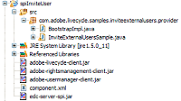

# Skapa en hanterare för att bjuda in externa användare {#create-invite-external-users-handler}

Du kan skapa en hanterare för att bjuda in externa användare för tjänsten Rights Management. Med en Bjud in extern användarhanterare kan Rights Management-tjänsten bjuda in externa användare att bli Rights Management-användare. När en användare har blivit Rights Management kan han/hon utföra uppgifter, t.ex. att öppna ett profilskyddat PDF-dokument. När hanteraren Bjud in externa användare har distribuerats till AEM Forms kan du använda administrationskonsolen för att interagera med den.

>[!NOTE]
>
>En Bjud in extern användarhanterare är en AEM Forms-komponent. Innan du skapar en hanterare för att bjuda in externa användare bör du känna till hur du skapar komponenter.

**Sammanfattning av steg**

Om du vill utveckla en hanterare för att bjuda in externa användare måste du utföra följande steg:

1. Konfigurera utvecklingsmiljön.
1. Definiera implementeringen av Bjud in extern användarhanterare.
1. Definiera komponentens XML-fil.
1. Distribuera hanteraren Bjud in externa användare.
1. Testa hanteraren Bjud in externa användare.

## Konfigurera utvecklingsmiljön {#setting-up-development-environment}

Om du vill konfigurera utvecklingsmiljön måste du skapa ett nytt Java-projekt, till exempel ett Eclipse-projekt. Den version av Eclipse som stöds är `3.2.1` eller senare.

Rights Management SPI kräver att `edc-server-spi.jar` filen anges i projektets klassökväg. Om du inte refererar till den här JAR-filen kan du inte använda Rights Management SPI i ditt Java-projekt. Den här JAR-filen installeras med AEM Forms SDK i `[install directory]\Adobe\Adobe_Experience_Manager_forms\sdk\spi` mappen.

Förutom att lägga till `edc-server-spi.jar` filen i projektets klasssökväg måste du också lägga till de JAR-filer som krävs för att använda API:t för tjänsten Rights Management. De här filerna behövs för att du ska kunna använda API:t för tjänsten Rights Management i hanteraren för att bjuda in externa användare.

## Definiera implementering av inbjuden extern användarhanterare {#define-invite-external-users-handler}

Om du vill utveckla en inbjudan till en extern användarhanterare måste du skapa en Java-klass som implementerar `com.adobe.edc.server.spi.ersp.InvitedUserProvider` gränssnittet. Den här klassen innehåller en metod med namnet `invitedUser`, som anropas av tjänsten Rights Management när e-postadresser skickas via sidan **Lägg till inbjudna användare** som är tillgänglig via administrationskonsolen.

Metoden accepterar `invitedUser` en `java.util.List` instans, som innehåller strängtypade e-postadresser som skickas från sidan **Lägg till inbjudna användare** . Metoden returnerar en array med `invitedUser` `InvitedUserProviderResult` objekt, vilket vanligtvis är en mappning av e-postadresser till användarobjekt (returnerar inte null).

>[!NOTE]
>
>Förutom att visa hur du skapar en extern användarhanterare för inbjudningar använder det här avsnittet även AEM Forms API.

Implementeringen av hanteraren för inbjudan av externa användare innehåller en användardefinierad metod med namnet `createLocalPrincipalAccount`. Den här metoden accepterar ett strängvärde som anger en e-postadress som ett parametervärde. Metoden förutsätter att det redan finns en lokal domän med namnet `createLocalPrincipalAccount` `EDC_EXTERNAL_REGISTERED`. Du kan konfigurera det här domännamnet så att det blir vad du vill; Men för ett produktionsprogram kanske du vill integrera med en företagsdomän.

Metoden itererar `createUsers` över alla e-postadresser och skapar ett motsvarande användarobjekt (en lokal användare i `EDC_EXTERNAL_REGISTERED` domänen). Slutligen anropas metoden `doEmails` . Den här metoden finns avsiktligt kvar som en stub i exemplet. I en produktionsimplementering skulle den innehålla programlogik för att skicka e-postmeddelanden med inbjudningar till nyskapade användare. Det lämnas i exemplet för att visa programmets logikflöde i ett verkligt program.

### Definiera implementering av inbjuden extern användarhanterare {#user-handler-implementation}

Följande inbjudan till implementering av extern användarhanterare accepterar e-postadresser som skickas från sidan Lägg till inbjudna användare som kan nås via administrationskonsolen.

```as3
package com.adobe.livecycle.samples.inviteexternalusers.provider; 
 
import com.adobe.edc.server.spi.ersp.*; 
import com.adobe.idp.dsc.clientsdk.ServiceClientFactory; 
import com.adobe.idp.um.api.*; 
import com.adobe.idp.um.api.infomodel.*; 
import com.adobe.idp.um.api.impl.UMBaseLibrary; 
import com.adobe.livecycle.usermanager.client.DirectoryManagerServiceClient; 
 
import java.util.ArrayList; 
import java.util.Iterator; 
import java.util.List; 
 
public class InviteExternalUsersSample implements InvitedUserProvider 
{ 
       private ServiceClientFactory _factory = null; 
 
       private User createLocalPrincipalAccount(String email_address) throws Exception 
       { 
    String ret = null; 
 
    //  Assume the local domain already exists! 
    String domain = "EDC_EXTERNAL_REGISTERED"; 
         
    List aliases = new ArrayList(); 
    aliases.add( email_address ); 
         
    User local_user = UMBaseLibrary.createUser( email_address, domain, email_address ); 
    local_user.setCommonName( email_address ); 
    local_user.setEmail( email_address ); 
    local_user.setEmailAliases( aliases ); 
         
    //  You may wish to disable the local user until, for example, his registration is processed by a confirmation link 
    //local_user.setDisabled( true ); 
 
    DirectoryManager directory_manager = new DirectoryManagerServiceClient( _factory ); 
    String ret_oid = directory_manager.createLocalUser( local_user, null ); 
     
    if( ret_oid == null ) 
    { 
        throw new Exception( "FAILED TO CREATE PRINCIPAL FOR EMAIL ADDRESS: " + email_address ); 
    } 
 
    return local_user; 
       } 
 
       protected User[] createUsers( List emails ) throws Exception 
       { 
    ArrayList ret_users = new ArrayList(); 
 
    _factory = ServiceClientFactory.createInstance(); 
 
    Iterator iter = emails.iterator(); 
 
    while( iter.hasNext() ) 
    { 
        String current_email = (String)iter.next(); 
 
        ret_users.add( createLocalPrincipalAccount( current_email ) ); 
    } 
 
    return (User[])ret_users.toArray( new User[0] ); 
       } 
 
       protected void doInvitations(List emails) 
       { 
    //  Here you may choose to send the users who were created an invitation email 
    //  This step is completely optional, depending on your requirements.   
       } 
 
       public InvitedUserProviderResult[] invitedUser(List emails) 
       { 
    //  This sample demonstrates the workflow for inviting a user via email 
 
    try 
    { 
 
        User[] principals = createUsers(emails); 
 
        InvitedUserProviderResult[] result = new InvitedUserProviderResult[principals.length]; 
        for( int i = 0; i < principals.length; i++ ) 
        { 
        result[i] = new InvitedUserProviderResult(); 
 
        result[i].setEmail( (String)emails.get( i ) ); 
        result[i].setUser( principals[i] ); 
        } 
 
        doInvitations(emails); 
 
        System.out.println( "SUCCESSFULLY INVITED " + result.length + " USERS" ); 
 
        return result; 
 
    } 
    catch( Exception e ) 
    { 
        System.out.println( "FAILED TO INVITE USERS FOR INVITE USERS SAMPLE" ); 
        e.printStackTrace(); 
 
        return new InvitedUserProviderResult[0]; 
    } 
       } 
}
 
```

>[!NOTE]
>
>Den här Java-klassen sparas som en JAVA-fil med namnet InviteExternalUsersSample.java.

## Definiera komponentens XML-fil för behörighetshanteraren {#define-component-xml-authorization-handler}

Du måste definiera en komponent-XML-fil för att kunna distribuera hanterarkomponenten för inbjudna externa användare. En komponent-XML-fil finns för varje komponent och innehåller metadata om komponenten.

Följande `component.xml` fil används för att bjuda in externa användarhanterare. Observera att tjänstnamnet är `InviteExternalUsersSample` och att åtgärden som den här tjänsten visar är namngiven `invitedUser`. Indataparametern är en `java.util.List` instans och utdatavärdet är en array med `com.adobe.edc.server.spi.esrp.InvitedUserProviderResult` instanser.

### Definiera komponentens XML-fil för hanteraren för att bjuda in externa användare {#component-xml-invite-external-users-handler}

```as3
<component xmlns="http://adobe.com/idp/dsc/component/document"> 
<component-id>com.adobe.livecycle.samples.inviteexternalusers</component-id> 
<version>1.0</version> 
<bootstrap-class>com.adobe.livecycle.samples.inviteexternalusers.provider.BootstrapImpl</bootstrap-class> 
<descriptor-class>com.adobe.idp.dsc.component.impl.DefaultPOJODescriptorImpl</descriptor-class> 
<services> 
<service name="InviteExternalUsersSample"> 
<specifications> 
<specification spec-id="com.adobe.edc.server.spi.ersp.InvitedUserProvider"/> 
</specifications> 
<specification-version>1.0</specification-version> 
<implementation-class>com.adobe.livecycle.samples.inviteexternalusers.provider.InviteExternalUsersSample</implementation-class> 
<auto-deploy category-id="Samples" service-id="InviteExternalUsersSample" major-version="1" minor-version="0"/> 
<operations> 
<operation name="invitedUser"> 
<input-parameter name="input" type="java.util.List" required="true"/> 
<output-parameter name="result" type="com.adobe.edc.server.spi.esrp.InvitedUserProviderResult[]"/> 
</operation> 
</operations> 
</service> 
</services> 
</component> 
```

## Paketera hanteraren för inbjudan till externa användare {#packaging-invite-external-users-handler}

Om du vill distribuera hanteraren för att bjuda in externa användare till AEM Forms måste du paketera ditt Java-projekt i en JAR-fil. Du måste se till att de externa JAR-filer som hanteraren för inbjudan till externa användare är beroende av, t.ex. `edc-server-spi.jar` - och `adobe-rightsmanagement-client.jar` -filer, också inkluderas i JAR-filen. Komponentens XML-fil måste också finnas. Filen och de externa JAR-filerna måste finnas i JAR-filens rot. `component.xml`

>[!NOTE]
>
>I bilden nedan visas en `BootstrapImpl` klass. I det här avsnittet beskrivs inte hur du skapar en `BootstrapImpl` klass.

Följande bild visar Java-projektets innehåll som paketeras i JAR-filen för den externa användarhanteraren.



S. Externa JAR-filer som krävs av komponent B. JAVA-fil

Du måste paketera hanteraren för att bjuda in externa användare i en JAR-fil. Observera att .JAVA-filer visas i listan i föregående diagram. När de paketerats i en JAR-fil måste även motsvarande CLASS-filer anges. Utan CLASS-filerna fungerar inte behörighetshanteraren.

>[!NOTE]
>
>När du har paketerat den externa behörighetshanteraren i en JAR-fil kan du distribuera komponenten till AEM Forms. Det går endast att distribuera en extern användarhanterare åt gången.

>[!NOTE]
>
>Du kan också distribuera en komponent programmatiskt.

## Testa hanteraren för att bjuda in externa användare {#testing-invite-external-users-handler}

Om du vill testa hanteraren för att bjuda in externa användare kan du lägga till externa användare som ska bjudas in med administrationskonsolen.

Så här lägger du till externa användare att bjuda in med administrationskonsolen:

1. Distribuera JAR-filen för den externa användarhanteraren med Workbench.
1. Starta om programservern.
1. Logga in på administrationskonsolen.
1. Klicka **[!UICONTROL Services]** > **[!UICONTROL Rights Management]** > **[!UICONTROL Configuration]** > Inbjuden **[!UICONTROL User Registration]**.
1. Aktivera registrering av inbjudna användare genom att markera **[!UICONTROL Enable invited user registration]** rutan. Under **[!UICONTROL Use Built-in registration system]**, klicka **[!UICONTROL No]**. Spara inställningarna.
1. På startsidan för administrationskonsolen klickar du på **[!UICONTROL Settings]** > **[!UICONTROL User Management]** > **[!UICONTROL Domain Management]**.
1. Klicka på **[!UICONTROL New Local Domain]**. På följande sida skapar du en domän med namnet och identifierarvärdet för `EDC_EXTERNAL_REGISTERED`. Spara ändringarna.
1. På startsidan för administrationskonsolen klickar du på **[!UICONTROL Services]** > **[!UICONTROL Rights Management]** > **[!UICONTROL Invited and Local Users]**. Sidan visas **[!UICONTROL Add Invited User]** .
1. Ange e-postadresser (eftersom den aktuella hanteraren för inbjudan till externa användare inte skickar e-postmeddelanden, behöver e-postadressen inte vara giltig). Klicka på **[!UICONTROL OK]**. Användarna bjuds in till systemet.
1. På startsidan för administrationskonsolen klickar du på **[!UICONTROL Settings]** > **[!UICONTROL User Management]** > **[!UICONTROL Users and Groups]**.
1. I **[!UICONTROL Find]** fältet anger du en e-postadress som du har angett. Klicka på **[!UICONTROL Find]**. Den inbjudna användaren visas som en användare i den lokala `EDC_EXTERNAL_REGISTERED` domänen.

>[!NOTE]
>
>Hanteraren för inbjudna externa användare misslyckas om komponenten stoppas eller avinstalleras.
