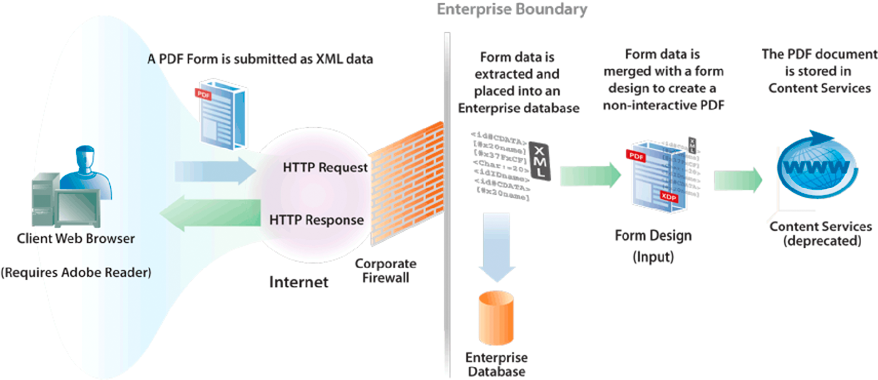

# Skapa PDF-dokument med inskickade XML-data {#creating-pdf-documents-with-submittedxml-data}

## Skapa PDF-dokument med inskickade XML-data {#creating-pdf-documents-with-submitted-xml-data}

Webbaserade tillämpningar där användarna kan fylla i interaktiva formulär kräver att data skickas tillbaka till servern. Med hjälp av Forms-tjänsten kan du hämta formulärdata som användaren har angett i ett interaktivt formulär. Sedan kan du skicka formulärdata till en annan AEM Forms-åtgärd och skapa ett PDF-dokument med hjälp av data.

>[!NOTE]
>
>Innan du läser det här innehållet bör du ha en god förståelse för hur skickade formulär hanteras. Begrepp som förhållandet mellan en formulärdesign och inlämnade XML-data behandlas i Hantera inskickade formulär.

Tänk på följande arbetsflöde som innefattar tre AEM Forms-tjänster:

* En användare skickar XML-data till Forms-tjänsten från ett webbaserat program.
* Tjänsten Forms används för att bearbeta skickade formulär och extrahera formulärfält. Formulärdata kan bearbetas. Data kan till exempel skickas till en företagsdatabas.
* Formulärdata skickas till utdatatjänsten för att skapa ett icke-interaktivt PDF-dokument.
* Det icke-interaktiva PDF-dokumentet lagras i Content Services (utgått).

I följande diagram visas arbetsflödet.

När användaren har skickat formuläret från klientens webbläsare lagras det icke-interaktiva PDF-dokumentet i Content Services (föråldrat). Följande bild visar ett PDF-dokument som lagras i Content Services (utgått).

### Sammanfattning av steg {#summary-of-steps}

Så här skapar du ett icke-interaktivt PDF-dokument med inskickade XML-data och sparar det i PDF-dokumentet i Content Services (borttaget):

1. Inkludera projektfiler.
1. Skapa objekt för formulär, utdata och dokumenthantering.
1. Hämta formulärdata med Forms-tjänsten.
1. Skapa ett icke-interaktivt PDF-dokument med hjälp av utdatatjänsten.
1. Lagra PDF-formuläret i Content Services (föråldrat) med hjälp av tjänsten Document Management.

**Inkludera projektfiler**

Inkludera nödvändiga filer i utvecklingsprojektet. Om du skapar ett klientprogram med Java, inkluderar du de JAR-filer som behövs. Om du använder webbtjänster måste du inkludera proxyfilerna.

**Skapa formulär-, utdata- och dokumenthanteringsobjekt**

Skapa ett API-objekt för Forms-klienten innan du programmässigt kan utföra en åtgärd i API:t för Forms-tjänsten. Eftersom arbetsflödet anropar utdata- och dokumenthanteringstjänsterna skapar du både ett Output Client API-objekt och ett Document Management Client API-objekt.

**Hämta formulärdata med Forms-tjänsten**

Hämta formulärdata som har skickats till Forms-tjänsten. Du kan bearbeta inskickade data så att de uppfyller dina affärskrav. Du kan till exempel lagra formulärdata i en företagsdatabas. Om du vill skapa ett icke-interaktivt PDF-dokument skickas formulärdata till utdatatjänsten.

**Skapa ett icke-interaktivt PDF-dokument med hjälp av utdatatjänsten.**

Använd utdatatjänsten för att skapa ett icke-interaktivt PDF-dokument som är baserat på en formulärdesign och XML-formulärdata. I arbetsflödet hämtas formulärdata från Forms-tjänsten.

**Lagra PDF-formuläret i Content Services (utgått) med tjänsten Document Management**

Använd API:t för dokumenthanteringstjänsten för att lagra ett PDF-dokument i innehållstjänster (borttaget).

**Se även**

[Inkludera AEM Forms Java-biblioteksfiler](/help/forms/developing/invoking-aem-forms-using-java.md#including-aem-forms-java-library-files)

[Ange anslutningsegenskaper](/help/forms/developing/invoking-aem-forms-using-java.md#setting-connection-properties)

[Snabbstart för Forms Service API](/help/forms/developing/forms-service-api-quick-starts.md#forms-service-api-quick-starts)

### Skapa ett PDF-dokument med inskickade XML-data med Java API {#create-a-pdf-document-with-submitted-xml-data-using-the-java-api}

Skapa ett PDF-dokument med inskickade XML-data med API:t för formulär, utdata och dokumenthantering (Java):

1. Inkludera projektfiler

   Inkludera JAR-klientfiler, t.ex. adobe-forms-client.jar, adobe-output-client.jar och adobe-contentservices-client.jar i Java-projektets klassökväg.

1. Skapa formulär-, utdata- och dokumenthanteringsobjekt

   * Skapa ett `ServiceClientFactory` objekt som innehåller anslutningsegenskaper.
   * Skapa ett `FormsServiceClient` objekt med hjälp av dess konstruktor och skicka `ServiceClientFactory` objektet.
   * Skapa ett `OutputClient` objekt med hjälp av dess konstruktor och skicka `ServiceClientFactory` objektet.
   * Skapa ett `DocumentManagementServiceClientImpl` objekt med hjälp av dess konstruktor och skicka `ServiceClientFactory` objektet.

1. Hämta formulärdata med Forms-tjänsten

   * Anropa `FormsServiceClient` objektets `processFormSubmission` metod och skicka följande värden:

      * Det `com.adobe.idp.Document` objekt som innehåller formulärdata.
      * Ett strängvärde som anger miljövariabler, inklusive alla relevanta HTTP-rubriker. Ange den innehållstyp som ska hanteras genom att ange ett eller flera värden för `CONTENT_TYPE` miljövariabeln. Om du till exempel vill hantera XML-data anger du följande strängvärde för den här parametern: `CONTENT_TYPE=text/xml`.
      * Ett strängvärde som anger `HTTP_USER_AGENT` rubrikvärdet, till exempel `Mozilla/4.0 (compatible; MSIE 6.0; Windows NT 5.1; SV1; .NET CLR 1.1.4322)`.
      * Ett `RenderOptionsSpec` objekt som lagrar körningsalternativ.
      Metoden returnerar `processFormSubmission` ett `FormsResult` objekt som innehåller resultaten av formuläröverföringen.

   * Avgör om Forms-tjänsten har slutfört bearbetningen av formulärdata genom att anropa `FormsResult` objektets `getAction` metod. Om den här metoden returnerar värdet `0`är data klara att bearbetas.
   * Hämta formulärdata genom att skapa ett `com.adobe.idp.Document` objekt genom att anropa `FormsResult` objektets `getOutputContent` metod. (Det här objektet innehåller formulärdata som kan skickas till utdatatjänsten.)
   * Skapa ett `java.io.InputStream` objekt genom att anropa `java.io.DataInputStream` konstruktorn och skicka `com.adobe.idp.Document` objektet.
   * Skapa ett `org.w3c.dom.DocumentBuilderFactory` objekt genom att anropa det statiska `org.w3c.dom.DocumentBuilderFactory` objektets `newInstance` metod.
   * Skapa ett `org.w3c.dom.DocumentBuilder` objekt genom att anropa `org.w3c.dom.DocumentBuilderFactory` objektets `newDocumentBuilder` metod.
   * Skapa ett `org.w3c.dom.Document` objekt genom att anropa `org.w3c.dom.DocumentBuilder` objektets `parse` metod och skicka `java.io.InputStream` objektet.
   * Hämta värdet för varje nod i XML-dokumentet. Ett sätt att utföra den här uppgiften är att skapa en anpassad metod som accepterar två parametrar: objektet och namnet på den nod vars värde du vill hämta `org.w3c.dom.Document` . Den här metoden returnerar ett strängvärde som representerar nodens värde. I kodexemplet som följer den här processen anropas den här anpassade metoden `getNodeText`. Innehållet i den här metoden visas.

1. Skapa ett icke-interaktivt PDF-dokument med hjälp av utdatatjänsten.

   Skapa ett PDF-dokument genom att anropa `OutputClient` objektets `generatePDFOutput` metod och skicka följande värden:

   * Ett `TransformationFormat` uppräkningsvärde. Om du vill generera ett PDF-dokument anger du `TransformationFormat.PDF`.
   * Ett strängvärde som anger formulärdesignens namn. Kontrollera att formulärdesignen är kompatibel med formulärdata som hämtas från Forms-tjänsten.
   * Ett strängvärde som anger innehållsroten där formulärdesignen finns.
   * Ett `PDFOutputOptionsSpec` objekt som innehåller alternativ för PDF-körning.
   * Ett `RenderOptionsSpec` objekt som innehåller alternativ för återgivning vid körning.
   * Det objekt `com.adobe.idp.Document` som innehåller XML-datakällan som innehåller data som ska sammanfogas med formulärdesignen. Kontrollera att objektet returnerades av `FormsResult` objektets `getOutputContent` metod.
   * Metoden returnerar `generatePDFOutput` ett `OutputResult` objekt som innehåller resultatet av åtgärden.
   * Hämta det icke-interaktiva PDF-dokumentet genom att anropa `OutputResult` objektets `getGeneratedDoc` metod. Den här metoden returnerar en `com.adobe.idp.Document` instans som representerar det icke-interaktiva PDF-dokumentet.

1. Lagra PDF-formuläret i Content Services (utgått) med tjänsten Document Management

   Lägg till innehållet genom att anropa `DocumentManagementServiceClientImpl` objektets `storeContent` metod och skicka följande värden:

   * Ett strängvärde som anger den lagringsplats där innehållet läggs till. Standardbutiken är `SpacesStore`. Detta värde är en obligatorisk parameter.
   * Ett strängvärde som anger den fullständiga sökvägen för det utrymme där innehållet läggs till (till exempel `/Company Home/Test Directory`). Detta värde är en obligatorisk parameter.
   * Nodnamnet som representerar det nya innehållet (till exempel `MortgageForm.pdf`). Detta värde är en obligatorisk parameter.
   * Ett strängvärde som anger nodtypen. Om du vill lägga till nytt innehåll, t.ex. en PDF-fil, anger du `{https://www.alfresco.org/model/content/1.0}content`. Detta värde är en obligatorisk parameter.
   * Ett `com.adobe.idp.Document` objekt som representerar innehållet. Detta värde är en obligatorisk parameter.
   * Ett strängvärde som anger kodningsvärdet (till exempel `UTF-8`). Detta värde är en obligatorisk parameter.
   * Ett `UpdateVersionType` uppräkningsvärde som anger hur versionsinformation ska hanteras (t.ex. för `UpdateVersionType.INCREMENT_MAJOR_VERSION` att öka innehållsversionen. ) Det här värdet är en obligatorisk parameter.
   * En `java.util.List` instans som anger aspekter som är relaterade till innehållet. Det här värdet är en valfri parameter som du kan ange `null`.
   * Ett `java.util.Map` objekt som lagrar innehållsattribut.
   Metoden `storeContent` returnerar ett `CRCResult` objekt som beskriver innehållet. Om du använder ett `CRCResult` objekt kan du till exempel få innehållets unika identifierarvärde. Om du vill utföra den här åtgärden anropar du `CRCResult` objektets `getNodeUuid` metod.

**Se även**

[Inkludera AEM Forms Java-biblioteksfiler](/help/forms/developing/invoking-aem-forms-using-java.md#including-aem-forms-java-library-files)

[Ange anslutningsegenskaper](/help/forms/developing/invoking-aem-forms-using-java.md#setting-connection-properties)
