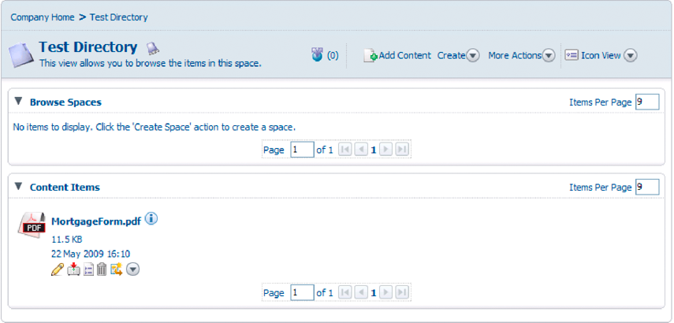

# Skapa PDF-dokument med inskickade XML-data {#creating-pdf-documents-with-submittedxml-data}

**Exempel och exempel i det här dokumentet gäller endast för AEM Forms i JEE-miljö.**

## Skapa PDF-dokument med inskickade XML-data {#creating-pdf-documents-with-submitted-xml-data}

Webbaserade tillämpningar där användarna kan fylla i interaktiva formulär kräver att data skickas tillbaka till servern. Med tjänsten Forms kan du hämta formulärdata som användaren har angett i ett interaktivt formulär. Sedan kan du skicka formulärdata till en annan AEM Forms-tjänståtgärd och skapa ett PDF-dokument med hjälp av data.

>[!NOTE]
>
>Innan du läser det här innehållet bör du ha en god förståelse för hur skickade formulär hanteras. Begrepp som förhållandet mellan en formulärdesign och inlämnade XML-data behandlas i Hantera inlämnade Forms.

Tänk på följande arbetsflöde som innefattar tre AEM Forms-tjänster:

* En användare skickar XML-data till Forms-tjänsten från ett webbaserat program.
* Forms-tjänsten används för att bearbeta skickade formulär och extrahera formulärfält. Formulärdata kan bearbetas. Data kan till exempel skickas till en företagsdatabas.
* Formulärdata skickas till utdatatjänsten för att skapa ett icke-interaktivt PDF-dokument.
* Det icke-interaktiva PDF-dokumentet lagras i Content Services (utgått).

I följande diagram visas arbetsflödet.

När användaren har skickat formuläret från klientens webbläsare lagras det icke-interaktiva PDF-dokumentet i Content Services (utgått). Följande bild visar ett PDF-dokument som lagras i Content Services (utgått).

### Sammanfattning av steg {#summary-of-steps}

Gör så här om du vill skapa ett icke-interaktivt PDF-dokument med inskickade XML-data och lagra i PDF-dokumentet i Content Services (utgått):

1. Inkludera projektfiler.
1. Skapa Forms-, Output- och Document Management-objekt.
1. Hämta formulärdata med hjälp av tjänsten Forms.
1. Skapa ett icke-interaktivt PDF-dokument med hjälp av utdatatjänsten.
1. Lagra PDF-formuläret i innehållstjänster (borttaget) med hjälp av dokumenthanteringstjänsten.

**Inkludera projektfiler**

Inkludera nödvändiga filer i utvecklingsprojektet. Om du skapar ett klientprogram med Java, inkluderar du de JAR-filer som behövs. Om du använder webbtjänster måste du inkludera proxyfilerna.

**Skapa Forms-, Output- och Document Management-objekt**

Skapa ett Forms Client API-objekt innan du programmässigt utför en API-åtgärd för Forms-tjänster. Eftersom arbetsflödet anropar utdata- och dokumenthanteringstjänsterna skapar du både ett Output Client API-objekt och ett Document Management Client API-objekt.

**Hämta formulärdata med Forms-tjänsten**

Hämta formulärdata som skickats till Forms-tjänsten. Du kan bearbeta inskickade data så att de uppfyller dina affärskrav. Du kan till exempel lagra formulärdata i en företagsdatabas. Om du vill skapa ett icke-interaktivt PDF-dokument skickas formulärdata till utdatatjänsten.

**Skapa ett icke-interaktivt PDF-dokument med hjälp av utdatatjänsten.**

Använd utdatatjänsten för att skapa ett icke-interaktivt PDF-dokument som är baserat på en formulärdesign och XML-formulärdata. I arbetsflödet hämtas formulärdata från Forms-tjänsten.

**Lagra PDF-formuläret i innehållstjänster (borttaget) med hjälp av dokumenthanteringstjänsten**

Använd API:t för dokumenthanteringstjänsten för att lagra ett PDF-dokument i innehållstjänster (borttaget).

**Se även**

[Inkludera AEM Forms Java-biblioteksfiler](/help/forms/developing/invoking-aem-forms-using-java.md#including-aem-forms-java-library-files)

[Ange anslutningsegenskaper](/help/forms/developing/invoking-aem-forms-using-java.md#setting-connection-properties)

[Snabbstart för Forms Service API](/help/forms/developing/forms-service-api-quick-starts.md#forms-service-api-quick-starts)

### Skapa ett PDF-dokument med skickade XML-data med Java API {#create-a-pdf-document-with-submitted-xml-data-using-the-java-api}

Skapa ett PDF-dokument med inskickade XML-data med hjälp av Forms, Output och Document Management API (Java):

1. Inkludera projektfiler

   Inkludera JAR-klientfiler, t.ex. adobe-forms-client.jar, adobe-output-client.jar och adobe-contentservices-client.jar i Java-projektets klassökväg.

1. Skapa Forms-, Output- och Document Management-objekt

   * Skapa ett `ServiceClientFactory`-objekt som innehåller anslutningsegenskaper.
   * Skapa ett `FormsServiceClient`-objekt med hjälp av dess konstruktor och skicka `ServiceClientFactory`-objektet.
   * Skapa ett `OutputClient`-objekt med hjälp av dess konstruktor och skicka `ServiceClientFactory`-objektet.
   * Skapa ett `DocumentManagementServiceClientImpl`-objekt med hjälp av dess konstruktor och skicka `ServiceClientFactory`-objektet.

1. Hämta formulärdata med tjänsten Forms

   * Anropa `FormsServiceClient`-objektets `processFormSubmission`-metod och skicka följande värden:

      * Objektet `com.adobe.idp.Document` som innehåller formulärdata.
      * Ett strängvärde som anger miljövariabler, inklusive alla relevanta HTTP-rubriker. Ange den innehållstyp som ska hanteras genom att ange ett eller flera värden för miljövariabeln `CONTENT_TYPE`. Om du till exempel vill hantera XML-data anger du följande strängvärde för parametern: `CONTENT_TYPE=text/xml`.
      * Ett strängvärde som anger rubrikvärdet `HTTP_USER_AGENT`, till exempel `Mozilla/4.0 (compatible; MSIE 6.0; Windows NT 5.1; SV1; .NET CLR 1.1.4322)`.
      * Ett `RenderOptionsSpec`-objekt som lagrar körningsalternativ.

     Metoden `processFormSubmission` returnerar ett `FormsResult`-objekt som innehåller resultaten av formuläröverföringen.

   * Avgör om Forms-tjänsten har slutfört bearbetningen av formulärdata genom att anropa `FormsResult`-objektets `getAction`-metod. Om den här metoden returnerar värdet `0` är data klara att bearbetas.
   * Hämta formulärdata genom att skapa ett `com.adobe.idp.Document`-objekt genom att anropa `FormsResult`-objektets `getOutputContent`-metod. (Det här objektet innehåller formulärdata som kan skickas till utdatatjänsten.)
   * Skapa ett `java.io.InputStream`-objekt genom att anropa konstruktorn `java.io.DataInputStream` och skicka objektet `com.adobe.idp.Document`.
   * Skapa ett `org.w3c.dom.DocumentBuilderFactory`-objekt genom att anropa det statiska `org.w3c.dom.DocumentBuilderFactory`-objektets `newInstance`-metod.
   * Skapa ett `org.w3c.dom.DocumentBuilder`-objekt genom att anropa `org.w3c.dom.DocumentBuilderFactory`-objektets `newDocumentBuilder`-metod.
   * Skapa ett `org.w3c.dom.Document`-objekt genom att anropa `org.w3c.dom.DocumentBuilder`-objektets `parse`-metod och skicka `java.io.InputStream`-objektet.
   * Hämta värdet för varje nod i XML-dokumentet. Ett sätt att utföra den här uppgiften är att skapa en anpassad metod som accepterar två parametrar: objektet `org.w3c.dom.Document` och namnet på noden vars värde du vill hämta. Den här metoden returnerar ett strängvärde som representerar nodens värde. I kodexemplet som följer den här processen kallas den här anpassade metoden `getNodeText`. Innehållet i den här metoden visas.

1. Skapa ett icke-interaktivt PDF-dokument med hjälp av utdatatjänsten.

   Skapa ett PDF-dokument genom att anropa `OutputClient`-objektets `generatePDFOutput`-metod och skicka följande värden:

   * Ett enum-värde på `TransformationFormat`. Ange `TransformationFormat.PDF` om du vill generera ett PDF-dokument.
   * Ett strängvärde som anger formulärdesignens namn. Kontrollera att formulärdesignen är kompatibel med formulärdata som hämtas från Forms-tjänsten.
   * Ett strängvärde som anger innehållsroten där formulärdesignen finns.
   * Ett `PDFOutputOptionsSpec`-objekt som innehåller körningsalternativ för PDF.
   * Ett `RenderOptionsSpec`-objekt som innehåller alternativ för återgivning vid körning.
   * Objektet `com.adobe.idp.Document` som innehåller XML-datakällan som innehåller data som ska sammanfogas med formulärdesignen. Kontrollera att det här objektet returnerades av `FormsResult`-objektets `getOutputContent`-metod.
   * Metoden `generatePDFOutput` returnerar ett `OutputResult`-objekt som innehåller resultatet av åtgärden.
   * Hämta det icke-interaktiva PDF-dokumentet genom att anropa `OutputResult`-objektets `getGeneratedDoc`-metod. Den här metoden returnerar en `com.adobe.idp.Document`-instans som representerar det icke-interaktiva PDF-dokumentet.

1. Lagra PDF-formuläret i Content Services (utgått) med hjälp av tjänsten Document Management

   Lägg till innehållet genom att anropa `DocumentManagementServiceClientImpl`-objektets `storeContent`-metod och skicka följande värden:

   * Ett strängvärde som anger den lagringsplats där innehållet läggs till. Standardarkivet är `SpacesStore`. Detta värde är en obligatorisk parameter.
   * Ett strängvärde som anger den fullständigt kvalificerade sökvägen för det utrymme där innehållet läggs till (till exempel `/Company Home/Test Directory`). Detta värde är en obligatorisk parameter.
   * Nodnamnet som representerar det nya innehållet (till exempel `MortgageForm.pdf`). Detta värde är en obligatorisk parameter.
   * Ett strängvärde som anger nodtypen. Ange `{https://www.alfresco.org/model/content/1.0}content` om du vill lägga till nytt innehåll, till exempel en PDF-fil. Detta värde är en obligatorisk parameter.
   * Ett `com.adobe.idp.Document`-objekt som representerar innehållet. Detta värde är en obligatorisk parameter.
   * Ett strängvärde som anger kodningsvärdet (till exempel `UTF-8`). Detta värde är en obligatorisk parameter.
   * Ett `UpdateVersionType`-uppräkningsvärde som anger hur versionsinformation ska hanteras (till exempel `UpdateVersionType.INCREMENT_MAJOR_VERSION`) för att öka innehållsversionen. ) Det här värdet är en obligatorisk parameter.
   * En `java.util.List`-instans som anger aspekter relaterade till innehållet. Det här värdet är en valfri parameter och du kan ange `null`.
   * Ett `java.util.Map`-objekt som lagrar innehållsattribut.

   Metoden `storeContent` returnerar ett `CRCResult`-objekt som beskriver innehållet. Om du använder ett `CRCResult`-objekt kan du till exempel hämta innehållets unika identifierarvärde. Anropa `CRCResult`-objektets `getNodeUuid`-metod om du vill utföra den här åtgärden.

**Se även**

[Inkludera AEM Forms Java-biblioteksfiler](/help/forms/developing/invoking-aem-forms-using-java.md#including-aem-forms-java-library-files)

[Ange anslutningsegenskaper](/help/forms/developing/invoking-aem-forms-using-java.md#setting-connection-properties)
