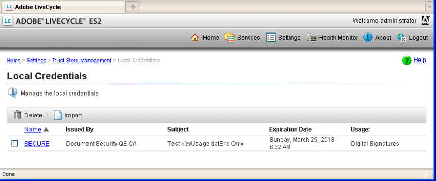

# Arbeta med autentiseringsuppgifter {#working-with-credentials}

**Exempel och exempel i det här dokumentet är bara för AEM Forms i JEE-miljö.**

**Om Autentiseringstjänsten**

En autentiseringsuppgift innehåller den privata nyckelinformation som behövs för att signera eller identifiera dokument. Ett certifikat är information om offentlig nyckel som du konfigurerar för förtroende. AEM Forms använder certifikat och autentiseringsuppgifter för flera syften:

* Acrobat Reader DC-tillägg använder en autentiseringsuppgift för att aktivera Adobe Reader användarrättigheter i PDF-dokument. (Se [Använda användningsbehörighet för PDF-dokument](/help/forms/developing/assigning-usage-rights.md#applying-usage-rights-to-pdf-documents).)
* Signaturtjänsten får åtkomst till certifikat och autentiseringsuppgifter när den utför åtgärder som att digitalt signera PDF-dokument. (Se [Signera PDF-dokument digitalt](/help/forms/developing/digitally-signing-certifying-documents.md#digitally-signing-pdf-documents).)

Du kan programmatiskt interagera med autentiseringsuppgiften med Trust Manager Java API. Du kan utföra följande uppgifter:

* [Importera autentiseringsuppgifter med Trust Manager API](credentials.md#importing-credentials-by-using-the-trust-manager-api)
* [Ta bort autentiseringsuppgifter med Trust Manager API](credentials.md#deleting-credentials-by-using-the-trust-manager-api)

>[!NOTE]
>
>Du kan också importera och ta bort certifikat med administrationskonsolen. (Se [administrationshjälp.](https://www.adobe.com/go/learn_aemforms_admin_63))

## Importera autentiseringsuppgifter med Trust Manager API {#importing-credentials-by-using-the-trust-manager-api}

Du kan programmässigt importera en autentiseringsuppgift till AEM Forms med hjälp av Trust Manager API. Du kan till exempel importera en autentiseringsuppgift som används för att signera ett PDF-dokument. (Se [Signera PDF-dokument digitalt](/help/forms/developing/digitally-signing-certifying-documents.md#digitally-signing-pdf-documents)).

När du importerar en autentiseringsuppgift anger du ett alias för autentiseringsuppgifterna. Aliaset används för att utföra en Forms-åtgärd som kräver en autentiseringsuppgift. När du har importerat en inloggningsinformation kan du visa den i administrationskonsolen, vilket visas på följande bild. Observera att aliaset för autentiseringsuppgiften är *Säker*.

>[!NOTE]
>
>Du kan inte importera autentiseringsuppgifter till AEM Forms med hjälp av webbtjänster.

### Sammanfattning av steg {#summary-of-steps}

Så här importerar du en autentiseringsuppgift till AEM Forms:

1. Inkludera projektfiler.
1. Skapa en autentiseringstjänstklient.
1. Referera autentiseringsuppgifterna.
1. Utför importåtgärden.

**Inkludera projektfiler**

Inkludera nödvändiga filer i utvecklingsprojektet. Om du skapar ett klientprogram med Java inkluderar du de JAR-filer som behövs. Om du använder webbtjänster måste du inkludera proxyfilerna.

Följande JAR-filer måste läggas till i projektets klassökväg:

* adobe-livecycle-client.jar
* adobe-usermanager-client.jar
* adobe-truststore-client.jar
* adobe-utilities.jar (krävs om AEM Forms används i JBoss)
* jbossall-client.jar (krävs om AEM Forms distribueras på JBoss)

Mer information om var dessa JAR-filer finns i [Inkludera AEM Forms Java-biblioteksfiler](/help/forms/developing/invoking-aem-forms-using-java.md#including-aem-forms-java-library-files).

**Skapa en autentiseringstjänstklient**

Skapa en autentiseringstjänstklient innan du programmässigt kan importera en referens till AEM Forms. Mer information finns i [Ange anslutningsegenskaper](/help/forms/developing/invoking-aem-forms-using-java.md#setting-connection-properties).

**Referera till autentiseringsuppgifterna**

Referera till en autentiseringsuppgift som du vill importera till AEM Forms. Den snabbstart som är associerad med det här avsnittet refererar till en P12-fil i filsystemet.

**Utför importåtgärden**

När du har refererat till inloggningsuppgifterna importerar du dem till AEM Forms. Om autentiseringsuppgifterna inte kan importeras genereras ett undantag. När du importerar en autentiseringsuppgift anger du ett alias för autentiseringsuppgifterna.

**Se även**

[Importera autentiseringsuppgifter med Java API](credentials.md#import-credentials-using-the-java-api)

[Inkludera AEM Forms Java-biblioteksfiler](/help/forms/developing/invoking-aem-forms-using-java.md#including-aem-forms-java-library-files)

[Ange anslutningsegenskaper](/help/forms/developing/invoking-aem-forms-using-java.md#setting-connection-properties)

[API-snabbstart för autentiseringsuppgifter](/help/forms/developing/credential-service-java-api-quick.md#credential-service-java-api-quick-start-soap)

[Ta bort autentiseringsuppgifter med Trust Manager API](credentials.md#deleting-credentials-by-using-the-trust-manager-api)

### Importera autentiseringsuppgifter med Java API {#import-credentials-using-the-java-api}

Importera en autentiseringsuppgift till AEM Forms med Trust Manager API (Java):

1. Inkludera projektfiler

   Inkludera JAR-klientfiler, som adobe-truststore-client.jar, i Java-projektets klassökväg.

1. Skapa en autentiseringstjänstklient

   * Skapa en `ServiceClientFactory` objekt som innehåller anslutningsegenskaper.
   * Skapa en `CredentialServiceClient` genom att använda konstruktorn och skicka `ServiceClientFactory` -objekt.

1. Referera till autentiseringsuppgifterna

   * Skapa en `java.io.FileInputStream` genom att använda dess konstruktor. Skicka ett strängvärde som anger platsen för autentiseringsuppgifterna.
   * Skapa en `com.adobe.idp.Document` objekt som lagrar autentiseringsuppgifterna med `com.adobe.idp.Document` konstruktor. Skicka `java.io.FileInputStream` objekt som innehåller autentiseringsuppgifter för konstruktorn.

1. Utför importåtgärden

   * Skapa en strängarray som innehåller ett element. Tilldela värdet `truststore.usage.type.sign` till elementet.
   * Anropa `CredentialServiceClient` objektets `importCredential` och skicka följande värden:

      * Ett strängvärde som anger aliasvärdet för autentiseringsuppgiften.
      * The `com.adobe.idp.Document` -instans som lagrar autentiseringsuppgifterna.
      * Ett strängvärde som anger lösenordet som är associerat med autentiseringsuppgifterna.
      * Den strängmatris som innehåller användningsvärdet. Du kan till exempel ange det här värdet `truststore.usage.type.sign`. Om du vill importera autentiseringsuppgifter för tillägget Reader anger du `truststore.usage.type.lcre`.

**Se även**

[Importera autentiseringsuppgifter med Trust Manager API](credentials.md#importing-credentials-by-using-the-trust-manager-api)

[Snabbstart (SOAP-läge): Importera autentiseringsuppgifter med Java API](/help/forms/developing/credential-service-java-api-quick.md#quick-start-soap-mode-importing-credentials-using-the-java-api)

[Inkludera AEM Forms Java-biblioteksfiler](/help/forms/developing/invoking-aem-forms-using-java.md#including-aem-forms-java-library-files)

[Ange anslutningsegenskaper](/help/forms/developing/invoking-aem-forms-using-java.md#setting-connection-properties)

## Ta bort autentiseringsuppgifter med Trust Manager API {#deleting-credentials-by-using-the-trust-manager-api}

Du kan ta bort en referens programmatiskt med hjälp av Trust Manager API. När du tar bort en autentiseringsuppgift anger du ett alias som motsvarar autentiseringsuppgifterna. När en åtgärd har tagits bort går det inte att använda en autentiseringsuppgift för att utföra den.

>[!NOTE]
>
>Du kan inte ta bort en autentiseringsuppgift i AEM Forms med hjälp av webbtjänster.

### Sammanfattning av steg {#summary_of_steps-1}

Så här tar du bort en autentiseringsuppgift:

1. Inkludera projektfiler.
1. Skapa en autentiseringstjänstklient.
1. Utför borttagningsåtgärden.

**Inkludera projektfiler**

Inkludera nödvändiga filer i utvecklingsprojektet. Om du skapar ett klientprogram med Java inkluderar du de JAR-filer som behövs. Följande JAR-filer måste läggas till i projektets klassökväg:

* adobe-livecycle-client.jar
* adobe-usermanager-client.jar
* adobe-truststore-client.jar
* adobe-utilities.jar (krävs om AEM Forms används i JBoss)
* jbossall-client.jar (krävs om AEM Forms distribueras på JBoss)

Mer information om var dessa JAR-filer finns i [Inkludera AEM Forms Java-biblioteksfiler](/help/forms/developing/invoking-aem-forms-using-java.md#including-aem-forms-java-library-files).

**Skapa en autentiseringstjänstklient**

Skapa en dataintegreringstjänstklient innan du kan ta bort en referens programmatiskt. När du skapar en tjänstklient definierar du de anslutningsinställningar som krävs för att anropa en tjänst. Mer information finns i [Ange anslutningsegenskaper](/help/forms/developing/invoking-aem-forms-using-java.md#setting-connection-properties).

**Utför borttagningsåtgärden**

Om du vill ta bort en autentiseringsuppgift anger du det alias som motsvarar autentiseringsuppgifterna. Om du anger ett alias som inte finns genereras ett undantag.

**Se även**

[Importera autentiseringsuppgifter med Java API](credentials.md#import-credentials-using-the-java-api)

[Inkludera AEM Forms Java-biblioteksfiler](/help/forms/developing/invoking-aem-forms-using-java.md#including-aem-forms-java-library-files)

[Ange anslutningsegenskaper](/help/forms/developing/invoking-aem-forms-using-java.md#setting-connection-properties)

[Importera autentiseringsuppgifter med Java API](credentials.md#import-credentials-using-the-java-api)

### Ta bort autentiseringsuppgifter med Java API {#deleting-credentials-using-the-java-api}

Ta bort en autentiseringsuppgift från AEM Forms med Trust Manager API (Java):

1. Inkludera projektfiler

   Inkludera JAR-klientfiler, som adobe-truststore-client.jar, i Java-projektets klassökväg.

1. Skapa en autentiseringstjänstklient

   * Skapa en `ServiceClientFactory` objekt som innehåller anslutningsegenskaper.
   * Skapa en `CredentialServiceClient` genom att använda konstruktorn och skicka `ServiceClientFactory` -objekt.

1. Utför borttagningsåtgärden

   Anropa `CredentialServiceClient` objektets `deleteCredential` och skicka ett strängvärde som anger aliasvärdet.

**Se även**

[Ta bort autentiseringsuppgifter med Trust Manager API](credentials.md#deleting-credentials-by-using-the-trust-manager-api)

[Snabbstart (SOAP-läge): Ta bort autentiseringsuppgifter med Java API](/help/forms/developing/credential-service-java-api-quick.md#quick-start-soap-mode-deleting-credentials-using-the-java-api)

[Inkludera AEM Forms Java-biblioteksfiler](/help/forms/developing/invoking-aem-forms-using-java.md#including-aem-forms-java-library-files)

[Ange anslutningsegenskaper](/help/forms/developing/invoking-aem-forms-using-java.md#setting-connection-properties)
