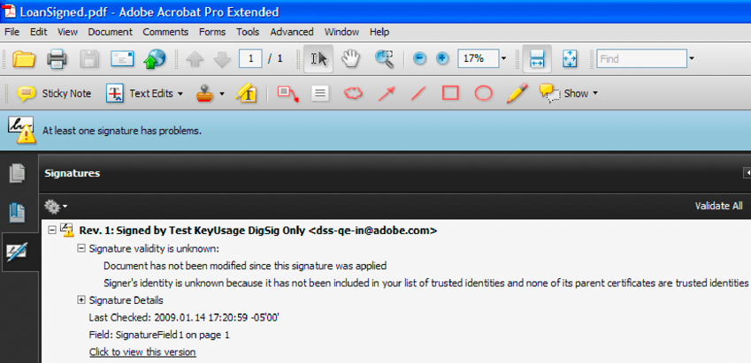

# Digitalt signera och certifiera dokument {#digitally-signing-and-certifying-documents}

**Om signaturtjänsten**

Med signaturtjänsten kan din organisation skydda säkerheten och sekretessen för Adobe PDF-dokument som den distribuerar och tar emot. Den här tjänsten använder digitala signaturer och certifiering för att säkerställa att endast avsedda mottagare kan ändra dokument. Eftersom säkerhetsfunktionerna tillämpas på själva dokumentet förblir dokumentet säkert och styrs under hela sin livscykel. Ett dokument förblir säkert även utanför brandväggen när det laddas ned offline och när det skickas tillbaka till organisationen.

>[!NOTE]
>
>Du kan skapa en anpassad underskriftshanterare för signaturtjänsten som anropas när vissa åtgärder anropas, till exempel signering av ett PDF-dokument.

**Namn på signaturfält**

Vissa åtgärder i Signature Service kräver att du anger namnet på det signaturfält där en åtgärd utförs. När du till exempel signerar ett PDF-dokument anger du namnet på signaturfältet som ska signeras. Anta att det fullständiga namnet för ett signaturfält är `form1[0].Form1[0].SignatureField1[0]`. Du kan ange `SignatureField1[0]` i stället för `form1[0].Form1[0].SignatureField1[0]`.

Ibland leder en konflikt till att signaturtjänsten signerar (eller utför en annan åtgärd som kräver signaturfältets namn) fel fält. Den här konflikten beror på att namnet `SignatureField1[0]` visas på två eller flera ställen i samma PDF-dokument. Ta till exempel ett PDF-dokument som innehåller två signaturfält med namnet `form1[0].Form1[0].SignatureField1[0]` och `form1[0].Form1[0].SubForm1[0].SignatureField1[0]` som du anger `SignatureField1[0]`. I det här fallet signerar signaturtjänsten det första signaturfältet som hittas samtidigt som alla signaturfält i dokumentet itereras.

Om det finns flera signaturfält i ett PDF-dokument rekommenderar vi att du anger signaturfältens fullständiga namn. Det vill säga, ange `form1[0].Form1[0].SignatureField1[0]`istället för `SignatureField1[0]`.

Du kan utföra följande uppgifter med hjälp av signaturtjänsten:

* Lägg till och ta bort fält för digitala signaturer i ett PDF-dokument. (Se [Lägga till signaturfält](digitally-signing-certifying-documents.md#adding-signature-fields).)
* Hämta namnen på signaturfälten som finns i ett PDF-dokument. (Se [Hämta namn på](digitally-signing-certifying-documents.md#retrieving-signature-field-names)signaturfält.)
* Ändra signaturfält. (Se [Ändra signaturfält](digitally-signing-certifying-documents.md#modifying-signature-fields).)
* Signera PDF-dokument digitalt. (Se [Signera PDF-dokument](digitally-signing-certifying-documents.md#digitally-signing-pdf-documents)digitalt.)
* Certifiera PDF-dokument. (Se [Certifiera PDF-dokument](digitally-signing-certifying-documents.md#certifying-pdf-documents).)
* Validera digitala signaturer i ett PDF-dokument. (Se [Verifiera digitala signaturer](digitally-signing-certifying-documents.md#verifying-digital-signatures).)
* Validera alla digitala signaturer som finns i ett PDF-dokument. (Se [Verifiera flera digitala signaturer](digitally-signing-certifying-documents.md#verifying-digital-signatures).)
* Ta bort en digital signatur från ett signaturfält. (Se [Ta bort digitala signaturer](digitally-signing-certifying-documents.md#removing-digital-signatures).)

   ***Obs **: Mer information om signaturtjänsten finns i[Tjänstreferens för AEM-formulär](https://www.adobe.com/go/learn_aemforms_services_63).*

## Lägga till signaturfält {#adding-signature-fields}

Digitala signaturer visas i signaturfält, som är formulärfält som innehåller en grafisk representation av signaturen. Signaturfält kan vara synliga eller osynliga. Signerare kan använda ett befintligt signaturfält eller ett signaturfält kan läggas till programmatiskt. I båda fallen måste signaturfältet finnas innan ett PDF-dokument kan signeras.

Du kan programmässigt lägga till ett signaturfält med hjälp av Java API:t för signaturtjänsten eller API:t för signaturwebbtjänsten. Du kan lägga till mer än ett signaturfält i ett PDF-dokument; Varje signaturfältsnamn måste dock vara unikt.

>[!NOTE]
>
>Vissa PDF-dokumenttyper tillåter inte att du programmässigt lägger till ett signaturfält. Mer information om signaturtjänsten och hur du lägger till signaturfält finns i [Tjänstreferens för AEM-formulär](https://www.adobe.com/go/learn_aemforms_services_63).

### Sammanfattning av steg {#summary-of-steps}

Gör så här om du vill lägga till ett signaturfält i ett PDF-dokument:

1. Inkludera projektfiler.
1. Skapa en signaturklient.
1. Hämta ett PDF-dokument som ett signaturfält läggs till i.
1. Lägg till ett signaturfält.
1. Spara PDF-dokumentet som en PDF-fil.

**Inkludera projektfiler**

Inkludera nödvändiga filer i utvecklingsprojektet. Om du skapar ett klientprogram med Java, inkluderar du de JAR-filer som behövs. Om du använder webbtjänster måste du inkludera proxyfilerna.

Följande JAR-filer måste läggas till i projektets klassökväg:

* adobe-livecycle-client.jar
* adobe-usermanager-client.jar
* adobe-signatures-client.jar
* adobe-utilities.jar (krävs om AEM Forms distribueras på JBoss)
* jbossall-client.jar (krävs om AEM Forms distribueras på JBoss)

**Skapa en signaturklient**

Innan du programmässigt kan utföra en signeringstjänståtgärd måste du skapa en signaturtjänstklient.

**Hämta ett PDF-dokument som ett signaturfält läggs till i**

Du måste skaffa ett PDF-dokument där ett signaturfält läggs till.

**Lägg till ett signaturfält**

Om du vill lägga till ett signaturfält i ett PDF-dokument anger du koordinatvärden som identifierar signaturfältets plats. (Om du lägger till ett osynligt signaturfält är dessa värden inte obligatoriska.) Du kan också ange vilka fält i PDF-dokumentet som ska låsas efter att en signatur har tillämpats på signaturfältet.

**Spara PDF-dokumentet som en PDF-fil**

När signaturtjänsten har lagt till ett signaturfält i PDF-dokumentet kan du spara dokumentet som en PDF-fil så att användarna kan öppna det i Acrobat eller Adobe Reader.

**Se även**

[Inkludera AEM Forms Java-biblioteksfiler](/help/forms/developing/invoking-aem-forms-using-java.md#including-aem-forms-java-library-files)

[Ange anslutningsegenskaper](/help/forms/developing/invoking-aem-forms-using-java.md#setting-connection-properties)

[Signera PDF-dokument digitalt](digitally-signing-certifying-documents.md#digitally-signing-pdf-documents)

### Lägga till signaturfält med Java API {#add-signature-fields-using-the-java-api}

Lägg till ett signaturfält med signatur-API (Java):

1. Inkludera projektfiler

   Inkludera JAR-klientfiler, t.ex. adobe-signatures-client.jar, i Java-projektets klassökväg.

1. Skapa en signaturklient

   * Skapa ett `ServiceClientFactory` objekt som innehåller anslutningsegenskaper.
   * Skapa ett `SignatureServiceClient` objekt med hjälp av dess konstruktor och skicka `ServiceClientFactory` objektet.

1. Hämta ett PDF-dokument som ett signaturfält läggs till i

   * Skapa ett `java.io.FileInputStream` objekt som representerar PDF-dokumentet som ett signaturfält läggs till i med hjälp av dess konstruktor och skicka ett strängvärde som anger PDF-dokumentets plats.
   * Skapa ett `com.adobe.idp.Document` objekt med hjälp av dess konstruktor och skicka `java.io.FileInputStream` objektet.

1. Lägg till ett signaturfält

   * Skapa ett `PositionRectangle` objekt som anger signaturfältets plats med hjälp av dess konstruktor. Ange koordinatvärden i konstruktorn.
   * Om du vill kan du skapa ett `FieldMDPOptions` objekt som anger de fält som är låsta när en digital signatur används i signaturfältet.
   * Lägg till ett signaturfält i ett PDF-dokument genom att anropa `SignatureServiceClient` objektets `addSignatureField` metod och skicka följande värden:

      * A `com.adobe.idp`. `Document` objekt som representerar PDF-dokumentet som ett signaturfält läggs till i.
      * Ett strängvärde som anger signaturfältets namn.
      * Ett `java.lang.Integer` värde som representerar sidnumret som ett signaturfält läggs till på.
      * Ett `PositionRectangle` objekt som anger signaturfältets plats.
      * Ett `FieldMDPOptions` objekt som anger fält i PDF-dokumentet som är låsta efter att en digital signatur har tillämpats på signaturfältet. Det här parametervärdet är valfritt och du kan skicka det `null`.
   * Ett `PDFSeedValueOptions` objekt som anger olika körningsvärden. Det här parametervärdet är valfritt och du kan skicka det `null`.

      Metoden `addSignatureField` returnerar en `com.adobe.idp`. `Document` objekt som representerar ett PDF-dokument som innehåller ett signaturfält.
   >[!NOTE]
   >
   >Du kan anropa `SignatureServiceClient` objektets `addInvisibleSignatureField` metod för att lägga till ett osynligt signaturfält.

1. Spara PDF-dokumentet som en PDF-fil

   * Skapa ett `java.io.File` objekt och kontrollera att filtillägget är .pdf.
   * Anropa `com.adobe.idp`. `Document` objektets `copyToFile` metod för att kopiera innehållet i `Document` objektet till filen. Kontrollera att du använder `com.adobe.idp`. `Document` objekt som returnerades av `addSignatureField` metoden.

**Se även**

[API-snabbstart för signaturtjänst](/help/forms/developing/signature-service-java-api-quick.md#signature-service-java-api-quick-start-soap)

### Lägga till signaturfält med webbtjänstens API {#add-signature-fields-using-the-web-service-api}

Så här lägger du till ett signaturfält med signatur-API:t (webbtjänsten):

1. Inkludera projektfiler

   Skapa ett Microsoft .NET-projekt som använder MTOM. Kontrollera att du använder följande WSDL-definition: `http://localhost:8080/soap/services/SignatureService?WSDL&lc_version=9.0.1`.

   >[!NOTE]
   >
   >Ersätt `localhost` med IP-adressen för servern som är värd för AEM Forms.

1. Skapa en signaturklient

   * Skapa ett `SignatureServiceClient` objekt med hjälp av dess standardkonstruktor.
   * Skapa ett `SignatureServiceClient.Endpoint.Address` objekt med hjälp av `System.ServiceModel.EndpointAddress` konstruktorn. Skicka ett strängvärde som anger WSDL till AEM Forms-tjänsten (till exempel `http://localhost:8080/soap/services/SignatureService?WSDL`). Du behöver inte använda attributet `lc_version` . Det här attributet används när du skapar en tjänstreferens.)
   * Skapa ett `System.ServiceModel.BasicHttpBinding` objekt genom att hämta värdet för `SignatureServiceClient.Endpoint.Binding` fältet. Sänd returvärdet till `BasicHttpBinding`.
   * Ställ in `System.ServiceModel.BasicHttpBinding` objektets `MessageEncoding` fält till `WSMessageEncoding.Mtom`. Detta värde garanterar att MTOM används.
   * Aktivera grundläggande HTTP-autentisering genom att utföra följande åtgärder:

      * Tilldela användarnamnet för AEM-formulär till fältet `SignatureServiceClient.ClientCredentials.UserName.UserName`.
      * Tilldela motsvarande lösenordsvärde till fältet `SignatureServiceClient.ClientCredentials.UserName.Password`.
      * Tilldela konstantvärdet `HttpClientCredentialType.Basic` till fältet `BasicHttpBindingSecurity.Transport.ClientCredentialType`.
      * Tilldela konstantvärdet `BasicHttpSecurityMode.TransportCredentialOnly` till fältet `BasicHttpBindingSecurity.Security.Mode`.

1. Hämta ett PDF-dokument som ett signaturfält läggs till i

   * Skapa ett `BLOB` objekt med hjälp av dess konstruktor. Objektet används `BLOB` för att lagra PDF-dokumentet som ska innehålla ett signaturfält.
   * Skapa ett `System.IO.FileStream` objekt genom att anropa dess konstruktor och skicka ett strängvärde som representerar filplatsen för PDF-dokumentet och läget som filen ska öppnas i.
   * Skapa en bytearray som lagrar innehållet i `System.IO.FileStream` objektet. Du kan bestämma storleken på bytearrayen genom att hämta `System.IO.FileStream` objektets `Length` egenskap.
   * Fyll bytearrayen med strömdata genom att anropa `System.IO.FileStream` objektets `Read` metod och skicka bytearrayen, startpositionen och den strömlängd som ska läsas.
   * Fyll objektet `BLOB` genom att tilldela dess `MTOM` egenskap med innehållet i bytearrayen.

1. Lägg till ett signaturfält

   Lägg till ett signaturfält i PDF-dokumentet genom att anropa `SignatureServiceClient` objektets `addSignatureField` metod och skicka följande värden:

   * Ett `BLOB` objekt som representerar PDF-dokumentet som ett signaturfält läggs till i.
   * Ett strängvärde som anger signaturfältets namn.
   * Ett heltalsvärde som representerar sidnumret som ett signaturfält läggs till på.
   * Ett `PositionRect` objekt som anger signaturfältets plats.
   * Ett `FieldMDPOptions` objekt som anger fält i PDF-dokumentet som är låsta efter att en digital signatur har tillämpats på signaturfältet. Det här parametervärdet är valfritt och du kan skicka det `null`.
   * Ett `PDFSeedValueOptions` objekt som anger olika körningsvärden. Det här parametervärdet är valfritt och du kan skicka det `null`.
   Metoden returnerar `addSignatureField` ett `BLOB` objekt som representerar ett PDF-dokument som innehåller ett signaturfält.

1. Spara PDF-dokumentet som en PDF-fil

   * Skapa ett `System.IO.FileStream` objekt genom att anropa dess konstruktor och skicka ett strängvärde som representerar filplatsen för det PDF-dokument som ska innehålla signaturfältet och läget som filen ska öppnas i.
   * Skapa en bytearray som lagrar innehållet i det `BLOB` objekt som returnerades av `addSignatureField` metoden. Fyll i bytearrayen genom att hämta värdet för `BLOB` objektets `binaryData` datamedlem.
   * Skapa ett `System.IO.BinaryWriter` objekt genom att anropa dess konstruktor och skicka `System.IO.FileStream` objektet.
   * Skriv bytearrayens innehåll till en PDF-fil genom att anropa `System.IO.BinaryWriter` objektets `Write` metod och skicka bytearrayen.

**Se även**

[Anropa AEM-formulär med MTOM](/help/forms/developing/invoking-aem-forms-using-web.md#invoking-aem-forms-using-mtom)

[Anropa AEM-formulär med SwaRef](/help/forms/developing/invoking-aem-forms-using-web.md#invoking-aem-forms-using-swaref)

## Hämtar namn på signaturfält {#retrieving-signature-field-names}

Du kan hämta namnen på alla signaturfält som finns i ett PDF-dokument som du vill signera eller certifiera. Om du är osäker på vilka signaturfältsnamn som finns i ett PDF-dokument eller vill verifiera namnen, kan du hämta dem programmatiskt. Signaturtjänsten returnerar signaturfältets kvalificerade namn, till exempel `form1[0].grantApplication[0].page1[0].SignatureField1[0]`.

>[!NOTE]
>
>Mer information om signaturtjänsten finns i [Tjänstreferens för AEM Forms](https://www.adobe.com/go/learn_aemforms_services_63)

### Sammanfattning av steg {#summary_of_steps-1}

Gör så här för att hämta signaturfältsnamn:

1. Inkludera projektfiler.
1. Skapa en signaturklient.
1. Hämta PDF-dokumentet som innehåller signaturfält.
1. Hämta signaturfältens namn.

**Inkludera projektfiler**

Inkludera nödvändiga filer i utvecklingsprojektet. Om du skapar ett klientprogram med Java, inkluderar du de JAR-filer som behövs. Om du använder webbtjänster måste du inkludera proxyfilerna.

Följande JAR-filer måste läggas till i projektets klassökväg:

* adobe-livecycle-client.jar
* adobe-usermanager-client.jar
* adobe-signatures-client.jar
* adobe-utilities.jar (krävs om AEM Forms distribueras på JBoss)
* jbossall-client.jar (krävs om AEM Forms distribueras på JBoss)

Mer information om var dessa JAR-filer finns i [Inkludera Java-biblioteksfiler](/help/forms/developing/invoking-aem-forms-using-java.md#including-aem-forms-java-library-files)för AEM Forms.

**Skapa en signaturklient**

Innan du programmässigt kan utföra en signeringstjänståtgärd måste du skapa en signaturtjänstklient.

**Hämta PDF-dokumentet som innehåller signaturfält**

Hämta ett PDF-dokument som innehåller signaturfält.

**Hämta namn på signaturfält**

Du kan hämta namn på signaturfält när du har hämtat ett PDF-dokument som innehåller ett eller flera signaturfält.

**Se även**

[Hämta namn på signaturfält med Java API](digitally-signing-certifying-documents.md#retrieve-signature-field-names-using-the-java-api)

[Hämta signaturfält med webbtjänstens API](digitally-signing-certifying-documents.md#retrieve-signature-field-using-the-web-service-api)

[Inkludera AEM Forms Java-biblioteksfiler](/help/forms/developing/invoking-aem-forms-using-java.md#including-aem-forms-java-library-files)

[Ange anslutningsegenskaper](/help/forms/developing/invoking-aem-forms-using-java.md#setting-connection-properties)

[Lägga till signaturfält](digitally-signing-certifying-documents.md#adding-signature-fields)

### Hämta namn på signaturfält med Java API {#retrieve-signature-field-names-using-the-java-api}

Hämta namn på signaturfält med signatur-API (Java):

1. Inkludera projektfiler

   Inkludera JAR-klientfiler, t.ex. adobe-signatures-client.jar, i Java-projektets klassökväg.

1. Skapa en signaturklient

   * Skapa ett `ServiceClientFactory` objekt som innehåller anslutningsegenskaper.
   * Skapa ett `SignatureServiceClient` objekt med hjälp av dess konstruktor och skicka `ServiceClientFactory` objektet.

1. Hämta PDF-dokumentet som innehåller signaturfält

   * Skapa ett `java.io.FileInputStream` objekt som representerar PDF-dokumentet som innehåller signaturfält genom att använda dess konstruktor och skicka ett strängvärde som anger PDF-dokumentets plats.
   * Skapa ett `com.adobe.idp.Document` objekt med hjälp av dess konstruktor och skicka `java.io.FileInputStream` objektet.

1. Hämta namn på signaturfält

   * Hämta signaturfältsnamnen genom att anropa `SignatureServiceClient` objektets `getSignatureFieldList` metod och skicka det `com.adobe.idp.Document` objekt som innehåller PDF-dokumentet som innehåller signaturfält. Den här metoden returnerar ett `java.util.List` objekt där varje element innehåller ett `PDFSignatureField` objekt. Med det här objektet kan du få ytterligare information om ett signaturfält, till exempel om det är synligt.
   * Iterera genom objektet för att `java.util.List` avgöra om det finns signaturfältsnamn. För varje signaturfält i PDF-dokumentet kan du hämta ett separat `PDFSignatureField` objekt. Om du vill hämta namnet på signaturfältet anropar du `PDFSignatureField` objektets `getName` metod. Den här metoden returnerar ett strängvärde som anger signaturfältets namn.

**Se även**

[Hämtar namn på signaturfält](digitally-signing-certifying-documents.md#retrieving-signature-field-names)

[Snabbstart (SOAP-läge): Hämta namn på signaturfält med Java API](/help/forms/developing/signature-service-java-api-quick.md#quick-start-soap-mode-retrieving-signature-field-names-using-the-java-api)

[Inkludera AEM Forms Java-biblioteksfiler](/help/forms/developing/invoking-aem-forms-using-java.md#including-aem-forms-java-library-files)

[Ange anslutningsegenskaper](/help/forms/developing/invoking-aem-forms-using-java.md#setting-connection-properties)

### Hämta signaturfält med webbtjänstens API {#retrieve-signature-field-using-the-web-service-api}

Hämta namn på signaturfält med signatur-API:t (webbtjänst):

1. Inkludera projektfiler

   Skapa ett Microsoft .NET-projekt som använder MTOM. Kontrollera att du använder följande WSDL-definition: `http://localhost:8080/soap/services/SignatureService?WSDL&lc_version=9.0.1`.

   >[!NOTE]
   >
   >Ersätt `localhost` med IP-adressen för servern som är värd för AEM Forms.

1. Skapa en signaturklient

   * Skapa ett `SignatureServiceClient` objekt med hjälp av dess standardkonstruktor.
   * Skapa ett `SignatureServiceClient.Endpoint.Address` objekt med hjälp av `System.ServiceModel.EndpointAddress` konstruktorn. Skicka ett strängvärde som anger WSDL till AEM Forms-tjänsten (till exempel `http://localhost:8080/soap/services/SignatureService?WSDL`). Du behöver inte använda attributet `lc_version` . Det här attributet används när du skapar en tjänstreferens.)
   * Skapa ett `System.ServiceModel.BasicHttpBinding` objekt genom att hämta värdet för `SignatureServiceClient.Endpoint.Binding` fältet. Sänd returvärdet till `BasicHttpBinding`.
   * Ställ in `System.ServiceModel.BasicHttpBinding` objektets `MessageEncoding` fält till `WSMessageEncoding.Mtom`. Detta värde garanterar att MTOM används.
   * Aktivera grundläggande HTTP-autentisering genom att utföra följande åtgärder:

      * Tilldela användarnamnet för AEM-formulär till fältet `SignatureServiceClient.ClientCredentials.UserName.UserName`.
      * Tilldela motsvarande lösenordsvärde till fältet `SignatureServiceClient.ClientCredentials.UserName.Password`.
      * Tilldela konstantvärdet `HttpClientCredentialType.Basic` till fältet `BasicHttpBindingSecurity.Transport.ClientCredentialType`.
      * Tilldela konstantvärdet `BasicHttpSecurityMode.TransportCredentialOnly` till fältet `BasicHttpBindingSecurity.Security.Mode`.

1. Hämta PDF-dokumentet som innehåller signaturfält

   * Skapa ett `BLOB` objekt med hjälp av dess konstruktor. Objektet används `BLOB` för att lagra PDF-dokumentet som innehåller signaturfält.
   * Skapa ett `System.IO.FileStream` objekt genom att anropa dess konstruktor och skicka ett strängvärde som representerar filplatsen för PDF-dokumentet och läget som filen ska öppnas i.
   * Skapa en bytearray som lagrar innehållet i `System.IO.FileStream` objektet. Du kan bestämma storleken på bytearrayen genom att hämta `System.IO.FileStream` objektets `Length` egenskap.
   * Fyll bytearrayen med strömdata genom att anropa `System.IO.FileStream` objektets `Read` metod och skicka bytearrayen, startpositionen och den strömlängd som ska läsas.
   * Fyll i `BLOB` objektet genom att tilldela dess `MTOM` fält bytearrayens innehåll.

1. Hämta namn på signaturfält

   * Hämta signaturfältsnamnen genom att anropa `SignatureServiceClient` objektets `getSignatureFieldList` metod och skicka det `BLOB` objekt som innehåller PDF-dokumentet som innehåller signaturfält. Den här metoden returnerar ett samlingsobjekt där varje element innehåller ett `MyArrayOfPDFSignatureField` `PDFSignatureField` objekt.
   * Iterera genom objektet `MyArrayOfPDFSignatureField` för att avgöra om det finns signaturfältsnamn. För varje signaturfält i PDF-dokumentet kan du hämta ett `PDFSignatureField` objekt. Om du vill hämta namnet på signaturfältet anropar du `PDFSignatureField` objektets `getName` metod. Den här metoden returnerar ett strängvärde som anger signaturfältets namn.

**Se även**

[Hämtar namn på signaturfält](digitally-signing-certifying-documents.md#retrieving-signature-field-names)

[Anropa AEM-formulär med MTOM](/help/forms/developing/invoking-aem-forms-using-web.md#invoking-aem-forms-using-mtom)

[Anropa AEM-formulär med SwaRef](/help/forms/developing/invoking-aem-forms-using-web.md#invoking-aem-forms-using-swaref)

## Ändra signaturfält {#modifying-signature-fields}

Du kan ändra signaturfält som finns i ett PDF-dokument med hjälp av Java API och webbtjänstens API. När du ändrar ett signaturfält måste du ändra signaturfältets låsordlistevärden eller ordlistevärden för startvärde.

En *låsordlista* anger en lista med fält som är låsta när signaturfältet signeras. Ett låst fält hindrar användaren från att göra ändringar i fältet. En ordlista för *dirigerade värden* innehåller begränsad information som används när signaturen används. Du kan till exempel ändra behörigheter som styr vilka åtgärder som kan utföras utan att en signatur blir ogiltig.

Genom att ändra ett befintligt signaturfält kan du göra ändringar i PDF-dokumentet för att återspegla förändrade affärskrav. Ett nytt affärskrav kan till exempel kräva att alla dokumentfält låses efter att dokumentet har signerats.

I det här avsnittet beskrivs hur du ändrar ett signaturfält genom att ändra både fältets låsordlista och ordlistevärden för startvärde. Ändringar som görs i signaturfältet låser ordlistan så att alla fält i PDF-dokumentet låses när ett signaturfält signeras. Ändringar i ordlistan för dirigerade värden förbjuder vissa typer av ändringar i dokumentet.

>[!NOTE]
>
>Mer information om signaturtjänsten och ändring av signaturfält finns i [Tjänstreferens för AEM-formulär](https://www.adobe.com/go/learn_aemforms_services_63).

### Sammanfattning av steg {#summary_of_steps-2}

Gör så här om du vill ändra signaturfält som finns i ett PDF-dokument:

1. Inkludera projektfiler.
1. Skapa en signaturklient.
1. Hämta PDF-dokumentet som innehåller det signaturfält som ska ändras.
1. Ange lexikonvärden.
1. Ändra signaturfältet.
1. Spara PDF-dokumentet som en PDF-fil.

**Inkludera projektfiler**

Inkludera nödvändiga filer i utvecklingsprojektet. Om du skapar ett klientprogram med Java, inkluderar du de JAR-filer som behövs. Om du använder webbtjänster måste du inkludera proxyfilerna.

Följande JAR-filer måste läggas till i projektets klassökväg:

* adobe-livecycle-client.jar
* adobe-usermanager-client.jar
* adobe-signatures-client.jar
* adobe-utilities.jar (krävs om AEM Forms distribueras på JBoss)
* jbossall-client.jar (krävs om AEM Forms distribueras på JBoss)

Information om platsen för dessa JAR-filer finns i [Inkludera LiveCycle Java-biblioteksfiler](/help/forms/developing/invoking-aem-forms-using-java.md#including-aem-forms-java-library-files).

**Skapa en signaturklient**

Innan du programmässigt kan utföra en signeringstjänståtgärd måste du skapa en signaturtjänstklient.

**Hämta PDF-dokumentet som innehåller signaturfältet som ska ändras**

Hämta ett PDF-dokument som innehåller det signaturfält som ska ändras.

**Ange lexikonvärden**

Om du vill ändra ett signaturfält tilldelar du värden till dess låsordlista för fält eller ordlista för startvärde. När du anger värden för signaturfält låses ordlistevärden, vilket innebär att du anger PDF-dokumentfält som är låsta när signaturfältet signeras. (I det här avsnittet beskrivs hur du låser alla fält.)

Följande ordlistevärden för dirigerade värden kan anges:

* **Versionskontroll**: Anger om spärrkontroll utförs när en signatur tillämpas på signaturfältet.
* **Certifikatalternativ**: Tilldelar värden till certifikatets startvärdesordlista. Innan du anger certifikatalternativ bör du bekanta dig med en ordlista för certifikatstartvärden. (Se [PDF-referens](https://www.adobe.com/devnet/acrobat/pdfs/pdf_reference_1-7.pdf).)
* **Sammanfattningsalternativ**: Tilldelar sammanfattningsalgoritmer som används för signering. Giltiga värden är SHA1, SHA256, SHA384, SHA512 och RIPEMD160.
* **Filter**: Anger det filter som används med signaturfältet. Du kan till exempel använda filtret Adobe.PPKLite. (Se [PDF-referens](https://www.adobe.com/devnet/acrobat/pdfs/pdf_reference_1-7.pdf).)
* **Flaggalternativ**: Anger de flaggvärden som är associerade med det här signaturfältet. Värdet 1 innebär att en signerare endast får använda de angivna värdena för posten. Värdet 0 innebär att andra värden är tillåtna. Här är bitpositionerna:

   * **** 1 (filter): Den underskriftshanterare som ska användas för att signera signaturfältet
   * **** 2 (SubFilter): En array med namn som anger godkända kodningar att använda vid signering
   * **3 (V)**: Det lägsta versionsnummer som krävs för underskriftshanteraren som ska användas för att signera signaturfältet
   * **** 4 (skäl): En array med strängar som anger möjliga orsaker till signering av ett dokument
   * **** 5 (PDFLegalWarnings): En array med strängar som anger möjliga juridiska attesteringar

* **Juridiska attesteringar**: När ett dokument är certifierat skannas det automatiskt efter specifika typer av innehåll som kan göra det synliga innehållet i ett dokument tvetydigt eller vilseledande. En anteckning kan till exempel skymma text som är viktig för att förstå vad som certifieras. Skanningsprocessen genererar varningar som anger att den här typen av innehåll finns. Det innehåller även en ytterligare förklaring av innehållet som kan ha genererat varningar.
* **Behörigheter**: Anger behörigheter som kan användas i ett PDF-dokument utan att underskriften blir ogiltig.
* **Orsaker**: Anger orsaker till varför det här dokumentet måste signeras.
* **Tidsstämpel**: Anger tidsstämplingsalternativ. Du kan till exempel ange URL:en för den tidsstämpelserver som används.
* **Version**: Anger det lägsta versionsnumret för den underskriftshanterare som ska användas för att signera signaturfältet.

**Ändra signaturfältet**

När du har skapat en signaturtjänstklient, hämtat PDF-dokumentet som innehåller det signaturfält som ska ändras och angett värden för ordlista kan du instruera signaturtjänsten att ändra signaturfältet. Signaturtjänsten returnerar sedan ett PDF-dokument som innehåller det ändrade signaturfältet. Det ursprungliga PDF-dokumentet påverkas inte.

**Spara PDF-dokumentet som en PDF-fil**

Spara PDF-dokumentet som innehåller det ändrade signaturfältet som en PDF-fil så att användarna kan öppna det i Acrobat eller Adobe Reader.

**Se även**

[Inkludera AEM Forms Java-biblioteksfiler](/help/forms/developing/invoking-aem-forms-using-java.md#including-aem-forms-java-library-files)

[Ange anslutningsegenskaper](/help/forms/developing/invoking-aem-forms-using-java.md#setting-connection-properties)

[API-snabbstart för signaturtjänst](/help/forms/developing/signature-service-java-api-quick.md#signature-service-java-api-quick-start-soap)

[Signera PDF-dokument digitalt](digitally-signing-certifying-documents.md#digitally-signing-pdf-documents)

### Ändra signaturfält med Java API {#modify-signature-fields-using-the-java-api}

Ändra ett signaturfält med hjälp av signatur-API (Java):

1. Inkludera projektfiler

   Inkludera JAR-klientfiler, t.ex. adobe-signatures-client.jar, i Java-projektets klassökväg.

1. Skapa en signaturklient

   * Skapa ett `ServiceClientFactory` objekt som innehåller anslutningsegenskaper.
   * Skapa ett `SignatureServiceClient` objekt med hjälp av dess konstruktor och skicka `ServiceClientFactory` objektet.

1. Hämta PDF-dokumentet som innehåller signaturfältet som ska ändras

   * Skapa ett `java.io.FileInputStream` objekt som representerar PDF-dokumentet som innehåller signaturfältet som ska ändras med hjälp av dess konstruktor och skicka ett strängvärde som anger PDF-dokumentets plats.
   * Skapa ett `com.adobe.idp.Document` objekt med hjälp av dess konstruktor och skicka `java.io.FileInputStream` objektet.

1. Ange lexikonvärden

   * Skapa ett `PDFSignatureFieldProperties` objekt med hjälp av dess konstruktor. Ett `PDFSignatureFieldProperties` objekt lagrar information om låsordlista för signaturfält och ordlista för startvärde.
   * Skapa ett `PDFSeedValueOptionSpec` objekt med hjälp av dess konstruktor. Med det här objektet kan du ange ordlistevärden för startvärde.
   * Tillåt inte ändringar i PDF-dokumentet genom att anropa `PDFSeedValueOptionSpec` objektets `setMdpValue` metod och skicka `MDPPermissions.NoChanges` uppräkningsvärdet.
   * Skapa ett `FieldMDPOptionSpec` objekt med hjälp av dess konstruktor. Med det här objektet kan du ange värden för låsning av signaturfält.
   * Lås alla fält i PDF-dokumentet genom att anropa `FieldMDPOptionSpec` objektets `setMdpValue` metod och skicka `FieldMDPAction.ALL` uppräkningsvärdet.
   * Ange information om startvärdesordlista genom att anropa `PDFSignatureFieldProperties` objektets `setSeedValue` metod och skicka `PDFSeedValueOptionSpec` objektet.
   * Ange information om signaturfält för att låsa ordlistan genom att anropa `PDFSignatureFieldProperties`objektets `setFieldMDP` metod och skicka `FieldMDPOptionSpec` objektet.
   >[!NOTE]
   >
   >Om du vill se alla ordlistevärden för dirigerade värden som du kan ange läser du i `PDFSeedValueOptionSpec` klassreferensen. (Se API-referens för [AEM-formulär](https://www.adobe.com/go/learn_aemforms_javadocs_63_en).)

1. Ändra signaturfältet

   Ändra signaturfältet genom att anropa `SignatureServiceClient` objektets `modifySignatureField` metod och skicka följande värden:

   * Det `com.adobe.idp.Document` objekt som lagrar PDF-dokumentet som innehåller signaturfältet som ska ändras
   * Ett strängvärde som anger signaturfältets namn
   * Objektet `PDFSignatureFieldProperties` som lagrar signaturfält låser ordlista och ordlista för startvärde
   Metoden returnerar `modifySignatureField` ett `com.adobe.idp.Document` objekt som lagrar ett PDF-dokument som innehåller det ändrade signaturfältet.

1. Spara PDF-dokumentet som en PDF-fil

   * Skapa ett `java.io.File` objekt och kontrollera att filnamnstillägget är .pdf.
   * Anropa `com.adobe.idp.Document` objektets `copyToFile` metod för att kopiera innehållet i `com.adobe.idp.Document` objektet till filen. Se till att du använder det `com.adobe.idp.Document` objekt som `modifySignatureField` metoden returnerade.

### Ändra signaturfält med webbtjänstens API {#modify-signature-fields-using-the-web-service-api}

Ändra ett signaturfält med hjälp av signatur-API:t (webbtjänst):

1. Inkludera projektfiler

   Skapa ett Microsoft .NET-projekt som använder MTOM. Kontrollera att du använder följande WSDL-definition: `http://localhost:8080/soap/services/SignatureService?WSDL&lc_version=9.0.1`.

   >[!NOTE]
   >
   >Ersätt `localhost` med IP-adressen för servern som är värd för AEM Forms.

1. Skapa en signaturklient

   * Skapa ett `SignatureServiceClient` objekt med hjälp av dess standardkonstruktor.
   * Skapa ett `SignatureServiceClient.Endpoint.Address` objekt med hjälp av `System.ServiceModel.EndpointAddress` konstruktorn. Skicka ett strängvärde som anger WSDL till AEM Forms-tjänsten (till exempel `http://localhost:8080/soap/services/SignatureService?WSDL`). Du behöver inte använda attributet `lc_version` . Det här attributet används när du skapar en tjänstreferens.)
   * Skapa ett `System.ServiceModel.BasicHttpBinding` objekt genom att hämta värdet för `SignatureServiceClient.Endpoint.Binding` fältet. Sänd returvärdet till `BasicHttpBinding`.
   * Ställ in `System.ServiceModel.BasicHttpBinding` objektets `MessageEncoding` fält till `WSMessageEncoding.Mtom`. Detta värde garanterar att MTOM används.
   * Aktivera grundläggande HTTP-autentisering genom att utföra följande åtgärder:

      * Tilldela användarnamnet för AEM-formulär till fältet `SignatureServiceClient.ClientCredentials.UserName.UserName`.
      * Tilldela motsvarande lösenordsvärde till fältet `SignatureServiceClient.ClientCredentials.UserName.Password`.
      * Tilldela konstantvärdet `HttpClientCredentialType.Basic` till fältet `BasicHttpBindingSecurity.Transport.ClientCredentialType`.
      * Tilldela konstantvärdet `BasicHttpSecurityMode.TransportCredentialOnly` till fältet `BasicHttpBindingSecurity.Security.Mode`.

1. Hämta PDF-dokumentet som innehåller signaturfältet som ska ändras

   * Skapa ett `BLOB` objekt med hjälp av dess konstruktor. Objektet används `BLOB` för att lagra PDF-dokumentet som innehåller det signaturfält som ska ändras.
   * Skapa ett `System.IO.FileStream` objekt genom att anropa dess konstruktor och skicka ett strängvärde som representerar filplatsen för PDF-dokumentet och läget som filen ska öppnas i.
   * Skapa en bytearray som lagrar innehållet i `System.IO.FileStream` objektet. Du kan bestämma storleken på bytearrayen genom att hämta `System.IO.FileStream` objektets `Length` egenskap.
   * Fyll bytearrayen med strömdata genom att anropa `System.IO.FileStream` objektets `Read` metod och skicka bytearrayen, startpositionen och den strömlängd som ska läsas.
   * Fylla i objektet genom att tilldela dess `BLOB` `MTOM` egenskap innehållet i bytearrayen.

1. Ange lexikonvärden

   * Skapa ett `PDFSignatureFieldProperties` objekt med hjälp av dess konstruktor. Det här objektet lagrar information om låsordlista för signaturfält och ordlista för startvärde.
   * Skapa ett `PDFSeedValueOptionSpec` objekt med hjälp av dess konstruktor. Med det här objektet kan du ange ordlistevärden för startvärde.
   * Tillåt inte ändringar i PDF-dokumentet genom att tilldela `MDPPermissions.NoChanges` uppräkningsvärdet till `PDFSeedValueOptionSpec` objektets `mdpValue` datamedlem.
   * Skapa ett `FieldMDPOptionSpec` objekt med hjälp av dess konstruktor. Med det här objektet kan du ange värden för låsning av signaturfält.
   * Lås alla fält i PDF-dokumentet genom att tilldela `FieldMDPAction.ALL` uppräkningsvärdet till `FieldMDPOptionSpec` objektets `mdpValue` datamedlem.
   * Ange information om startvärdesordlista genom att tilldela objektet `PDFSeedValueOptionSpec` till `PDFSignatureFieldProperties` objektets `seedValue` datamedlem.
   * Ange information om låsning av signaturfält genom att tilldela `FieldMDPOptionSpec` objektet till `PDFSignatureFieldProperties` objektets `fieldMDP` datamedlem.
   >[!NOTE]
   >
   >Om du vill se alla ordlistevärden för dirigerade värden som du kan ange läser du i `PDFSeedValueOptionSpec` klassreferensen. (Se API-referens för [AEM-formulär](https://www.adobe.com/go/learn_aemforms_javadocs_63_en)).

1. Ändra signaturfältet

   Ändra signaturfältet genom att anropa `SignatureServiceClient` objektets `modifySignatureField` metod och skicka följande värden:

   * Det `BLOB` objekt som lagrar PDF-dokumentet som innehåller signaturfältet som ska ändras
   * Ett strängvärde som anger signaturfältets namn
   * Objektet `PDFSignatureFieldProperties` som lagrar signaturfält låser ordlista och ordlista för startvärde
   Metoden returnerar `modifySignatureField` ett `BLOB` objekt som lagrar ett PDF-dokument som innehåller det ändrade signaturfältet.

1. Spara PDF-dokumentet som en PDF-fil

   * Skapa ett `System.IO.FileStream` objekt genom att anropa dess konstruktor och skicka ett strängvärde som representerar filplatsen för det PDF-dokument som ska innehålla signaturfältet och läget som filen ska öppnas i.
   * Skapa en bytearray som lagrar innehållet i det `BLOB` objekt som `addSignatureField` metoden returnerar. Fyll i bytearrayen genom att hämta värdet för `BLOB` objektets `MTOM` datamedlem.
   * Skapa ett `System.IO.BinaryWriter` objekt genom att anropa dess konstruktor och skicka `System.IO.FileStream` objektet.
   * Skriv bytearrayens innehåll till en PDF-fil genom att anropa `System.IO.BinaryWriter` objektets `Write` metod och skicka bytearrayen.

**Se även**

[Anropa AEM-formulär med MTOM](/help/forms/developing/invoking-aem-forms-using-web.md#invoking-aem-forms-using-mtom)

[Anropa AEM-formulär med SwaRef](/help/forms/developing/invoking-aem-forms-using-web.md#invoking-aem-forms-using-swaref)

## Signera PDF-dokument digitalt {#digitally-signing-pdf-documents}

Digitala signaturer kan användas i PDF-dokument för att ge en viss säkerhetsnivå. Digitala signaturer, precis som handskrivna signaturer, är ett sätt som signerare kan använda för att identifiera sig och göra programsatser om ett dokument. Den teknik som används för att digitalt signera dokument gör att både signeraren och mottagaren vet vad som signerats och vet att dokumentet inte har ändrats sedan det signerades.

PDF-dokument signeras med hjälp av teknik med öppen nyckel. En signerare har två nycklar: en offentlig nyckel och en privat nyckel. Den privata nyckeln lagras i en användares autentiseringsuppgifter som måste vara tillgängliga vid signeringen. Den offentliga nyckeln lagras i användarens certifikat som måste vara tillgängligt för mottagarna för att validera signaturen. Information om återkallade certifikat finns i listor över återkallade certifikat (CRL:er) och OCSP-svar (Online Certificate Status Protocol) som distribueras av certifikatutfärdare (CA:er). Tidpunkten för signering kan hämtas från en betrodd källa som kallas tidsstämpelutfärdare.

>[!NOTE]
>
>Innan du kan signera ett PDF-dokument digitalt måste du se till att du lägger till certifikatet i AEM Forms. Ett certifikat läggs till med administrationskonsolen eller programmatiskt med Trust Manager API. (Se [Importera autentiseringsuppgifter med Trust Manager API](/help/forms/developing/credentials.md#importing-credentials-by-using-the-trust-manager-api).)

Du kan signera PDF-dokument digitalt med programkod. När du signerar ett PDF-dokument digitalt måste du referera till en säkerhetsbehörighet som finns i AEM Forms. Autentiseringsuppgiften är den privata nyckel som används för signering.

Signaturtjänsten utför följande steg när ett PDF-dokument signeras:

1. Signaturtjänsten hämtar autentiseringsuppgifterna från förtroendelagret genom att skicka det alias som anges i begäran.
1. Truststore söker efter de angivna autentiseringsuppgifterna.
1. Autentiseringsuppgifterna returneras till signaturtjänsten och används för att signera dokumentet. Autentiseringsuppgiften cachelagras även mot aliaset för framtida begäranden.

Information om hur du hanterar säkerhetsuppgifter finns i guiden *Installera och distribuera AEM-formulär* för programservern.

>[!NOTE]
>
>Det finns skillnader mellan att underteckna och certifiera dokument. (Se [Certifiera PDF-dokument](digitally-signing-certifying-documents.md#certifying-pdf-documents).)

>[!NOTE]
>
>Alla PDF-dokument har inte stöd för signering. Mer information om signaturtjänsten och digitalt signerade dokument finns i [Services Reference for AEM Forms](https://www.adobe.com/go/learn_aemforms_services_63).

>[!NOTE]
>
>Signaturtjänsten stöder inte XDP-filer med inbäddade PDF-data som indata till en åtgärd, till exempel certifiering av ett dokument. Den här åtgärden resulterar i att signaturtjänsten genererar ett `PDFOperationException`. Du löser det här problemet genom att konvertera XDP-filen till en PDF-fil med PDF Utilities-tjänsten och sedan skicka den konverterade PDF-filen till en Signature-tjänståtgärd. (Se [Arbeta med PDF-verktyg](/help/forms/developing/pdf-utilities.md#working-with-pdf-utilities).)

**Autentiseringsuppgifter för Cipher nShield HSM**

När du använder en krypterings-HSM-autentiseringsuppgift för att signera eller certifiera ett PDF-dokument kan den nya autentiseringsuppgiften inte användas förrän J2EE-programservern som AEM Forms distribueras på har startats om. Du kan dock ange ett konfigurationsvärde, vilket gör att signerings- eller certifieringsåtgärden fungerar utan att J2EE-programservern startas om.

Du kan lägga till följande konfigurationsvärde i filen cknfastrc, som finns på /opt/nfast/cknfastrc (eller c:\nfast\cknfastrc):

```as3
 CKNFAST_ASSUME_SINGLE_PROCESS=0
```

När du har lagt till det här konfigurationsvärdet i cknfastrc-filen kan de nya autentiseringsuppgifterna användas utan att J2EE-programservern startas om.

**Underskriften är inte betrodd**

När du certifierar och signerar samma PDF-dokument och certifieringsunderskriften inte är betrodd, visas en gul triangel mot den första underskriften när du öppnar PDF-dokumentet i Acrobat eller Adobe Reader. Certifikatsignaturen måste vara betrodd för att detta ska undvikas.

**Signera dokument som är XFA-baserade formulär**

Om du försöker signera ett XFA-baserat formulär med Signature service API, kan data saknas i det `View` `Signed` som `Version` finns i Acrobat. Ta till exempel följande arbetsflöde:

* Med hjälp av en XDP-fil som skapats med Designer kan du sammanfoga en formulärdesign som innehåller ett signaturfält och XML-data som innehåller formulärdata. Du använder Forms-tjänsten för att generera ett interaktivt PDF-dokument.
* Du signerar PDF-dokumentet med signaturtjänstens API.

### Sammanfattning av steg {#summary_of_steps-3}

Så här signerar du ett PDF-dokument digitalt:

1. Inkludera projektfiler.
1. Skapa en signaturtjänstklient.
1. Få PDF-dokumentet att signera.
1. Signera PDF-dokumentet.
1. Spara det signerade PDF-dokumentet som en PDF-fil.

**Inkludera projektfiler**

Inkludera nödvändiga filer i utvecklingsprojektet. Om du skapar ett klientprogram med Java, inkluderar du de JAR-filer som behövs. Om du använder webbtjänster måste du inkludera proxyfilerna.

Följande JAR-filer måste läggas till i projektets klassökväg:

* adobe-livecycle-client.jar
* adobe-usermanager-client.jar
* adobe-signatures-client.jar
* adobe-utilities.jar (krävs om AEM Forms distribueras på JBoss)
* jbossall-client.jar (krävs om AEM Forms distribueras på JBoss)

**Skapa en signaturklient**

Innan du programmässigt kan utföra en signeringstjänståtgärd måste du skapa en signaturtjänstklient.

**Få PDF-dokumentet att signera**

Om du vill signera ett PDF-dokument måste du skaffa ett PDF-dokument som innehåller ett signaturfält. Om ett PDF-dokument inte innehåller något signaturfält kan det inte signeras. Ett signaturfält kan läggas till med Designer eller via programmering.

**Signera PDF-dokumentet**

När du signerar ett PDF-dokument kan du ange alternativ för körning som används av signeringstjänsten. Du kan ange följande alternativ:

* Utseendealternativ
* Spärrkontroll
* Värden för tidsstämpling

Du anger utseendealternativ med hjälp av ett `PDFSignatureAppearanceOptionSpec` objekt. Du kan till exempel visa datumet i en signatur genom att anropa `PDFSignatureAppearanceOptionSpec` objektets `setShowDate` metod och skicka `true`.

Du kan också ange om du vill utföra en spärrkontroll som avgör om certifikatet som används för att signera ett PDF-dokument digitalt har återkallats eller inte. Om du vill utföra spärrkontroll kan du ange ett av följande värden:

* **NoCheck**: Utför inte spärrkontroll.
* **BestEffort**: Försök alltid att kontrollera om alla certifikat i kedjan har återkallats. Om det uppstår något problem vid kontrollen antas återkallningen vara giltig. Om något fel inträffar antar du att certifikatet inte har återkallats.
* **** CheckIfAvailable: Kontrollera om alla certifikat i kedjan har återkallats om det finns någon återkallningsinformation. Om något problem uppstår vid kontrollen antas återkallningen vara ogiltig. Om något fel inträffar antar du att certifikatet har återkallats och är ogiltigt. (Detta är standardvärdet.)
* **AlwaysCheck**: Kontrollera om alla certifikat i kedjan har återkallats. Om det inte finns någon återkallningsinformation i något certifikat antas återkallningen vara ogiltig.

Om du vill utföra återkallningskontroll på ett certifikat kan du ange en URL till en CRL-server (Certificate revocation List) med hjälp av ett `CRLOptionSpec` objekt. Om du vill utföra en spärrkontroll och inte anger en URL till en CRL-server, hämtar signaturtjänsten URL-adressen från certifikatet.

I stället för att använda en CRL-server kan du använda en OCSP-server (Online Certificate Status Protocol) när du utför spärrkontroll. När du använder en OCSP-server i stället för en CRL-server utförs spärrkontrollen oftast snabbare. (Se &quot;Online Certificate Status Protocol&quot; på [https://tools.ietf.org/html/rfc2560](https://tools.ietf.org/html/rfc2560).)

Du kan ställa in CRL- och OCSP-serverordningen som signaturtjänsten använder med Adobes program och tjänster. Om till exempel OCSP-servern är inställd först i Adobe-program och -tjänster kontrolleras OCSP-servern och därefter CRL-servern. (Se Hantera certifikat och autentiseringsuppgifter med Trust Store i AAC-hjälpen.)

Om du anger att du inte ska utföra spärrkontroll kontrollerar inte signaturtjänsten om certifikatet som användes för att signera eller certifiera ett dokument har spärrats. CRL- och OCSP-serverinformation ignoreras alltså.

>[!NOTE]
>
>Även om en CRL eller en OCSP-server kan anges i certifikatet, kan du åsidosätta den URL som anges i certifikatet genom att använda ett `CRLOptionSpec` och ett `OCSPOptionSpec` objekt. Om du till exempel vill åsidosätta CRL-servern kan du anropa `CRLOptionSpec` objektets `setLocalURI` metod.

Tidsstämpling avser processen att spåra den tidpunkt då ett signerat eller certifierat dokument ändrades. När ett dokument har signerats bör det inte ändras, inte ens av dokumentägaren. Tidsstämpling gör det lättare att framtvinga giltigheten av ett undertecknat eller certifierat dokument. Du kan ange tidsstämplingsalternativ med hjälp av ett `TSPOptionSpec` objekt. Du kan till exempel ange URL:en för en TSP-server (Time Stamping Provider).

>[!NOTE]
>
>I Java- och webbtjänsten går du igenom sektioner och motsvarande snabbstarter används spärrkontroll. Eftersom ingen information om CRL- eller OCSP-server har angetts hämtas serverinformationen från certifikatet som används för att digitalt signera PDF-dokumentet.

Om du vill signera ett PDF-dokument kan du ange det fullständiga, kvalificerade namnet på signaturfältet som ska innehålla den digitala signaturen, till exempel `form1[0].#subform[1].SignatureField3[3]`. När du använder ett XFA-formulärfält kan du även använda det partiella namnet på signaturfältet: `SignatureField3[3]`.

Du måste även referera till en säkerhetsbehörighet för att digitalt signera ett PDF-dokument. Om du vill referera till en säkerhetsreferens anger du ett alias. Aliaset är en referens till en faktisk autentiseringsuppgift som kan finnas i en PKCS#12-fil (med filnamnstillägget .pfx) eller en maskinvarusäkerhetsmodul (HSM). Mer information om säkerhetsuppgifter finns i guiden *Installera och distribuera AEM-formulär* för programservern.

**Spara det signerade PDF-dokumentet**

När signeringstjänsten har signerat PDF-dokumentet digitalt kan du spara det som en PDF-fil så att användarna kan öppna det i Acrobat eller Adobe Reader.

**Se även**

[Signera PDF-dokument digitalt med Java API](digitally-signing-certifying-documents.md#digitally-sign-pdf-documents-using-the-java-api)

[Signera PDF-dokument digitalt med webbtjänstens API](digitally-signing-certifying-documents.md#digitally-signing-pdf-documents-using-the-web-service-api)

[Inkludera AEM Forms Java-biblioteksfiler](/help/forms/developing/invoking-aem-forms-using-java.md#including-aem-forms-java-library-files)

[Ange anslutningsegenskaper](/help/forms/developing/invoking-aem-forms-using-java.md#setting-connection-properties)

[Lägga till signaturfält](digitally-signing-certifying-documents.md#adding-signature-fields)

[Hämtar namn på signaturfält](digitally-signing-certifying-documents.md#retrieving-signature-field-names)

### Signera PDF-dokument digitalt med Java API {#digitally-sign-pdf-documents-using-the-java-api}

Signera ett PDF-dokument digitalt med signatur-API (Java):

1. Inkludera projektfiler

   Inkludera JAR-klientfiler, t.ex. adobe-signatures-client.jar, i Java-projektets klassökväg.

1. Skapa en signaturklient

   * Skapa ett `ServiceClientFactory` objekt som innehåller anslutningsegenskaper.
   * Skapa ett `SignatureServiceClient` objekt med hjälp av dess konstruktor och skicka `ServiceClientFactory` objektet.

1. Få PDF-dokumentet att signera

   * Skapa ett `java.io.FileInputStream` objekt som representerar PDF-dokumentet som ska signeras digitalt med hjälp av dess konstruktor och skicka ett strängvärde som anger PDF-dokumentets plats.
   * Skapa ett `com.adobe.idp.Document` objekt med hjälp av dess konstruktor och skicka `java.io.FileInputStream` objektet.

1. Signera PDF-dokumentet

   Signera PDF-dokumentet genom att anropa `SignatureServiceClient` objektets `sign` metod och skicka följande värden:

   * Ett `com.adobe.idp.Document` objekt som representerar det PDF-dokument som ska signeras.
   * Ett strängvärde som representerar namnet på signaturfältet som ska innehålla den digitala signaturen.
   * Ett `Credential` objekt som representerar de autentiseringsuppgifter som används för att signera PDF-dokumentet digitalt. Skapa ett `Credential` objekt genom att anropa `Credential` objektets statiska `getInstance` metod och skicka ett strängvärde som anger aliasvärdet som motsvarar säkerhetsuppgifter.
   * Ett `HashAlgorithm` objekt som anger en statisk datamedlem som representerar hash-algoritmen som ska användas för att sammanställa PDF-dokumentet. Du kan till exempel ange `HashAlgorithm.SHA1` att SHA1-algoritmen ska användas.
   * Ett strängvärde som representerar orsaken till varför PDF-dokumentet signerades digitalt.
   * Ett strängvärde som representerar signerarens kontaktinformation.
   * Ett `PDFSignatureAppearanceOptions` objekt som styr utseendet på den digitala signaturen. Du kan till exempel använda det här objektet för att lägga till en egen logotyp till en digital signatur.
   * Ett `java.lang.Boolean` objekt som anger om spärrkontroll ska utföras på signerarens certifikat.
   * Ett `OCSPOptionSpec` objekt som lagrar inställningar för stöd för OCSP (Online Certificate Status Protocol). Om spärrkontroll inte utförs används inte den här parametern och du kan ange den `null`.
   * Ett `CRLPreferences` objekt som lagrar inställningar för listan över återkallade certifikat. Om spärrkontroll inte utförs används inte den här parametern och du kan ange den `null`.
   * Ett `TSPPreferences` objekt som lagrar inställningar för stöd för tidsstämpelleverantör (TSP). Den här parametern är valfri och kan vara `null`. Mer information finns i API-referens för [AEM-formulär](https://www.adobe.com/go/learn_aemforms_javadocs_63_en).
   Metoden returnerar `sign` ett `com.adobe.idp.Document` objekt som representerar det signerade PDF-dokumentet.

1. Spara det signerade PDF-dokumentet

   * Skapa ett `java.io.File` objekt och kontrollera att filtillägget är .pdf.
   * Anropa `com.adobe.idp.Document` objektets `copyToFile` metod och skicka `java.io.File`för att kopiera innehållet i `Document` objektet till filen. Se till att du använder det `com.adobe.idp.Document` objekt som returnerades av `sign` metoden.

**Se även**

[Signera PDF-dokument digitalt](digitally-signing-certifying-documents.md#digitally-signing-pdf-documents)

[Snabbstart (SOAP-läge): Signera ett PDF-dokument digitalt med Java API](/help/forms/developing/signature-service-java-api-quick.md#quick-start-soap-mode-digitally-signing-a-pdf-document-using-the-java-api)

[Inkludera AEM Forms Java-biblioteksfiler](/help/forms/developing/invoking-aem-forms-using-java.md#including-aem-forms-java-library-files)

[Ange anslutningsegenskaper](/help/forms/developing/invoking-aem-forms-using-java.md#setting-connection-properties)

### Signera PDF-dokument digitalt med webbtjänstens API {#digitally-signing-pdf-documents-using-the-web-service-api}

Så här signerar du ett PDF-dokument digitalt med signatur-API:t (webbtjänst):

1. Inkludera projektfiler

   Skapa ett Microsoft .NET-projekt som använder MTOM. Kontrollera att du använder följande WSDL-definition: `http://localhost:8080/soap/services/SignatureService?WSDL&lc_version=9.0.1`.

   >[!NOTE]
   >
   >Ersätt `localhost` med IP-adressen för servern som är värd för AEM Forms.

1. Skapa en signaturklient

   * Skapa ett `SignatureServiceClient` objekt med hjälp av dess standardkonstruktor.
   * Skapa ett `SignatureServiceClient.Endpoint.Address` objekt med hjälp av `System.ServiceModel.EndpointAddress` konstruktorn. Skicka ett strängvärde som anger WSDL till AEM Forms-tjänsten (till exempel `http://localhost:8080/soap/services/SignatureService?WSDL`). Du behöver inte använda attributet `lc_version` . Det här attributet används när du skapar en tjänstreferens.)
   * Skapa ett `System.ServiceModel.BasicHttpBinding` objekt genom att hämta värdet för `SignatureServiceClient.Endpoint.Binding` fältet. Sänd returvärdet till `BasicHttpBinding`.
   * Ställ in `System.ServiceModel.BasicHttpBinding` objektets `MessageEncoding` fält till `WSMessageEncoding.Mtom`. Detta värde garanterar att MTOM används.
   * Aktivera grundläggande HTTP-autentisering genom att utföra följande åtgärder:

      * Tilldela användarnamnet för AEM-formulär till fältet `SignatureServiceClient.ClientCredentials.UserName.UserName`.
      * Tilldela motsvarande lösenordsvärde till fältet `SignatureServiceClient.ClientCredentials.UserName.Password`.
      * Tilldela konstantvärdet `HttpClientCredentialType.Basic` till fältet `BasicHttpBindingSecurity.Transport.ClientCredentialType`.
      * Tilldela konstantvärdet `BasicHttpSecurityMode.TransportCredentialOnly` till fältet `BasicHttpBindingSecurity.Security.Mode`.

1. Få PDF-dokumentet att signera

   * Skapa ett `BLOB` objekt med hjälp av dess konstruktor. Objektet används `BLOB` för att lagra ett PDF-dokument som är signerat.
   * Skapa ett `System.IO.FileStream` objekt genom att anropa dess konstruktor och skicka ett strängvärde som representerar filplatsen för det PDF-dokument som ska signeras samt läget i vilket filen ska öppnas.
   * Skapa en bytearray som lagrar innehållet i `System.IO.FileStream` objektet. Du kan bestämma storleken på bytearrayen genom att hämta `System.IO.FileStream` objektets `Length` egenskap.
   * Fyll bytearrayen med strömdata genom att anropa `System.IO.FileStream` objektets `Read` metod och skicka bytearrayen, startpositionen och den strömlängd som ska läsas.
   * Fylla i objektet genom att tilldela dess `BLOB` `MTOM` egenskap innehållet i bytearrayen.

1. Signera PDF-dokumentet

   Signera PDF-dokumentet genom att anropa `SignatureServiceClient` objektets `sign` metod och skicka följande värden:

   * Ett `BLOB` objekt som representerar det PDF-dokument som ska signeras.
   * Ett strängvärde som representerar namnet på signaturfältet som ska innehålla den digitala signaturen.
   * Ett `Credential` objekt som representerar de autentiseringsuppgifter som används för att signera PDF-dokumentet digitalt. Skapa ett `Credential` objekt med hjälp av dess konstruktor och ange aliaset genom att tilldela ett värde till `Credential` objektets `alias` egenskap.
   * Ett `HashAlgorithm` objekt som anger en statisk datamedlem som representerar hash-algoritmen som ska användas för att sammanställa PDF-dokumentet. Du kan till exempel ange `HashAlgorithm.SHA1` att SHA1-algoritmen ska användas.
   * Ett booleskt värde som anger om hash-algoritmen används.
   * Ett strängvärde som representerar orsaken till varför PDF-dokumentet signerades digitalt.
   * Ett strängvärde som representerar signerarens plats.
   * Ett strängvärde som representerar signerarens kontaktinformation.
   * Ett `PDFSignatureAppearanceOptions` objekt som styr utseendet på den digitala signaturen. Du kan till exempel använda det här objektet för att lägga till en egen logotyp till en digital signatur.
   * Ett `System.Boolean` objekt som anger om spärrkontroll ska utföras på signerarens certifikat. Om spärrkontrollen är klar bäddas den in i signaturen. The default is `false`.
   * Ett `OCSPOptionSpec` objekt som lagrar inställningar för stöd för OCSP (Online Certificate Status Protocol). Om spärrkontroll inte utförs används inte den här parametern och du kan ange den `null`. Mer information om det här objektet finns i API-referens för [AEM Forms](https://www.adobe.com/go/learn_aemforms_javadocs_63_en).
   * Ett `CRLPreferences` objekt som lagrar inställningar för listan över återkallade certifikat. Om spärrkontroll inte utförs används inte den här parametern och du kan ange den `null`.
   * Ett `TSPPreferences` objekt som lagrar inställningar för stöd för tidsstämpelleverantör (TSP). Den här parametern är valfri och kan vara `null`.
   Metoden returnerar `sign` ett `BLOB` objekt som representerar det signerade PDF-dokumentet.

1. Spara det signerade PDF-dokumentet

   * Skapa ett `System.IO.FileStream` objekt genom att anropa dess konstruktor. Skicka ett strängvärde som representerar filplatsen för det signerade PDF-dokumentet och läget som filen ska öppnas i.
   * Skapa en bytearray som lagrar innehållet i det `BLOB` objekt som returnerades av `sign` metoden. Fyll i bytearrayen genom att hämta värdet för `BLOB` objektets `MTOM` datamedlem.
   * Skapa ett `System.IO.BinaryWriter` objekt genom att anropa dess konstruktor och skicka `System.IO.FileStream` objektet.
   * Skriv bytearrayens innehåll till en PDF-fil genom att anropa `System.IO.BinaryWriter` objektets `Write` metod och skicka bytearrayen.

**Se även**

[Signera PDF-dokument digitalt](digitally-signing-certifying-documents.md#digitally-signing-pdf-documents)

[Anropa AEM-formulär med MTOM](/help/forms/developing/invoking-aem-forms-using-web.md#invoking-aem-forms-using-mtom)

[Anropa AEM-formulär med SwaRef](/help/forms/developing/invoking-aem-forms-using-web.md#invoking-aem-forms-using-swaref)

## Digitalt signerade interaktiva formulär {#digitally-signing-interactive-forms}

Du kan signera ett interaktivt formulär som skapas med Forms-tjänsten. Ta till exempel följande arbetsflöde:

* Du sammanfogar ett XFA-baserat PDF-formulär som har skapats med Designer och formulärdata som finns i ett XML-dokument med hjälp av Forms-tjänsten. Formulärservern återger ett interaktivt formulär.
* Du signerar det interaktiva formuläret med hjälp av Signature service API.

Resultatet blir ett digitalt signerat interaktivt PDF-formulär. När du signerar ett PDF-formulär som är baserat på ett XFA-formulär ska du se till att du sparar PDF-filen som ett statiskt Adobe PDF-formulär. Om du försöker signera ett PDF-formulär som har sparats som ett dynamiskt Adobe PDF-formulär inträffar ett undantag. Eftersom du signerar formuläret som returneras från Forms-tjänsten måste du se till att formuläret innehåller ett signaturfält.

>[!NOTE]
>
>Innan du kan signera ett interaktivt formulär digitalt måste du se till att du lägger till certifikatet i AEM Forms. Ett certifikat läggs till med administrationskonsolen eller programmatiskt med Trust Manager API. (Se [Importera autentiseringsuppgifter med Trust Manager API](/help/forms/developing/credentials.md#importing-credentials-by-using-the-trust-manager-api).)

När du använder API:t för Forms Service anger du att alternativet för `GenerateServerAppearance` körning ska vara `true`. Med det här körningsalternativet kan du vara säker på att utseendet på det formulär som genereras på servern förblir giltigt när det öppnas i Acrobat eller Adobe Reader. Vi rekommenderar att du anger det här körningsalternativet när du genererar ett interaktivt formulär som ska signeras med Forms API.

>[!NOTE]
>
>Innan du läser interaktiva signeringsformulär digitalt bör du känna till hur du signerar PDF-dokument. (Se [Signera PDF-dokument](digitally-signing-certifying-documents.md#digitally-signing-pdf-documents)digitalt.)

### Sammanfattning av steg {#summary_of_steps-4}

Så här signerar du ett interaktivt formulär digitalt från Forms-tjänsten:

1. Inkludera projektfiler.
1. Skapa en Forms and Signatures-klient.
1. Hämta det interaktiva formuläret med Forms-tjänsten.
1. Signera det interaktiva formuläret.
1. Spara det signerade PDF-dokumentet som en PDF-fil.

**Inkludera projektfiler**

Inkludera nödvändiga filer i utvecklingsprojektet. Om du skapar ett klientprogram med Java, inkluderar du de JAR-filer som behövs. Om du använder webbtjänster måste du inkludera proxyfilerna.

Följande JAR-filer måste läggas till i projektets klassökväg:

* adobe-livecycle-client.jar
* adobe-usermanager-client.jar
* adobe-signatures-client.jar
* adobe-forms-client.jar
* adobe-utilities.jar (krävs om AEM Forms distribueras på JBoss)
* jbossall-client.jar (krävs om AEM Forms distribueras på JBoss)

Mer information om var dessa JAR-filer finns i [Inkludera Java-biblioteksfiler](/help/forms/developing/invoking-aem-forms-using-java.md#including-aem-forms-java-library-files)för AEM Forms.

**Skapa en formulär- och signaturklient**

Eftersom det här arbetsflödet anropar både Forms- och Signature-tjänsterna skapar du både en Forms-tjänstklient och en Signature-tjänstklient.

**Hämta det interaktiva formuläret med Forms-tjänsten**

Du kan använda Forms-tjänsten för att hämta det interaktiva PDF-formuläret för signering. Från och med AEM Forms kan du skicka ett objekt `com.adobe.idp.Document` till Forms-tjänsten som innehåller det formulär som ska återges. Namnet på den här metoden är `renderPDFForm2`. Den här metoden returnerar ett `com.adobe.idp.Document` objekt som innehåller formuläret som ska signeras. Du kan skicka den här `com.adobe.idp.Document` instansen till signaturtjänsten.

Om du använder webbtjänster kan du på samma sätt skicka den `BLOB` instans som Forms-tjänsten returnerar till signaturtjänsten.

>[!NOTE]
>
>Den snabbstart som är associerad med avsnittet Digitalt signerade interaktiva formulär anropar `renderPDFForm2` metoden.

**Signera det interaktiva formuläret**

När du signerar ett PDF-dokument kan du ange alternativ för körning som används av signaturtjänsten. Du kan ange följande alternativ:

* Utseendealternativ
* Spärrkontroll
* Värden för tidsstämpling

Du anger utseendealternativ med hjälp av ett `PDFSignatureAppearanceOptionSpec` objekt. Du kan till exempel visa datumet i en signatur genom att anropa `PDFSignatureAppearanceOptionSpec` objektets `setShowDate` metod och skicka `true`.

**Spara det signerade PDF-dokumentet**

När signeringstjänsten har signerat PDF-dokumentet digitalt kan du spara det som en PDF-fil. PDF-filen kan öppnas i Acrobat eller Adobe Reader.

**Se även**

[Signera ett interaktivt formulär digitalt med Java API](digitally-signing-certifying-documents.md#digitally-sign-an-interactive-form-using-the-java-api)

[Signera ett interaktivt formulär digitalt med webbtjänstens API](digitally-signing-certifying-documents.md#digitally-sign-an-interactive-form-using-the-web-service-api)

[Inkludera AEM Forms Java-biblioteksfiler](/help/forms/developing/invoking-aem-forms-using-java.md#including-aem-forms-java-library-files)

[Ange anslutningsegenskaper](/help/forms/developing/invoking-aem-forms-using-java.md#setting-connection-properties)

[Signera PDF-dokument digitalt](digitally-signing-certifying-documents.md#digitally-signing-pdf-documents)

[Återgivning av interaktiva PDF-formulär](/help/forms/developing/rendering-forms.md#rendering-interactive-pdf-forms)

### Signera ett interaktivt formulär digitalt med Java API {#digitally-sign-an-interactive-form-using-the-java-api}

Signera ett interaktivt formulär digitalt med hjälp av Forms and Signature API (Java):

1. Inkludera projektfiler

   Inkludera JAR-klientfiler, t.ex. adobe-signatures-client.jar och adobe-forms-client.jar, i Java-projektets klassökväg.

1. Skapa en formulär- och signaturklient

   * Skapa ett `ServiceClientFactory` objekt som innehåller anslutningsegenskaper.
   * Skapa ett `SignatureServiceClient` objekt med hjälp av dess konstruktor och skicka `ServiceClientFactory` objektet.
   * Skapa ett `FormsServiceClient` objekt med hjälp av dess konstruktor och skicka `ServiceClientFactory` objektet.

1. Hämta det interaktiva formuläret med Forms-tjänsten

   * Skapa ett `java.io.FileInputStream` objekt som representerar PDF-dokumentet som ska skickas till Forms-tjänsten med hjälp av dess konstruktor. Skicka ett strängvärde som anger platsen för PDF-dokumentet.
   * Skapa ett `com.adobe.idp.Document` objekt med hjälp av dess konstruktor och skicka `java.io.FileInputStream` objektet.
   * Skapa ett `java.io.FileInputStream` objekt som representerar XML-dokumentet som innehåller formulärdata som ska skickas till Forms-tjänsten med hjälp av dess konstruktor. Skicka ett strängvärde som anger platsen för XML-filen.
   * Skapa ett `com.adobe.idp.Document` objekt med hjälp av dess konstruktor och skicka `java.io.FileInputStream` objektet.
   * Skapa ett `PDFFormRenderSpec` objekt som används för att ange körningsalternativ. Anropa `PDFFormRenderSpec` objektets `setGenerateServerAppearance` metod och skicka `true`.
   * Anropa `FormsServiceClient` objektets `renderPDFForm2` metod och skicka följande värden:

      * Ett `com.adobe.idp.Document` objekt som innehåller det PDF-formulär som ska återges.
      * Ett `com.adobe.idp.Document` objekt som innehåller data som ska sammanfogas med formuläret.
      * Ett `PDFFormRenderSpec` objekt som lagrar körningsalternativ.
      * Ett `URLSpec` objekt som innehåller URI-värden som krävs av Forms-tjänsten. Du kan ange `null` för det här parametervärdet.
      * Ett `java.util.HashMap` objekt som lagrar bifogade filer. Det här är en valfri parameter och du kan ange `null` om du inte vill bifoga filer till formuläret.
      Metoden returnerar `renderPDFForm2` ett `FormsResult` objekt som innehåller en formulärdataström

   * Hämta PDF-formuläret genom att anropa `FormsResult` objektets `getOutputContent` metod. Den här metoden returnerar ett `com.adobe.idp.Document` objekt som representerar det interaktiva formuläret.


1. Signera det interaktiva formuläret

   Signera PDF-dokumentet genom att anropa `SignatureServiceClient` objektets `sign` metod och skicka följande värden:

   * Ett `com.adobe.idp.Document` objekt som representerar det PDF-dokument som ska signeras. Kontrollera att det här objektet är det objekt `com.adobe.idp.Document` som hämtas från Forms-tjänsten.
   * Ett strängvärde som representerar namnet på signaturfältet som är signerat.
   * Ett `Credential` objekt som representerar de autentiseringsuppgifter som används för att signera PDF-dokumentet digitalt. Skapa ett `Credential` objekt genom att anropa `Credential` objektets statiska `getInstance` metod. Skicka ett strängvärde som anger aliasvärdet som motsvarar säkerhetsuppgifter.
   * Ett `HashAlgorithm` objekt som anger en statisk datamedlem som representerar hash-algoritmen som ska användas för att sammanställa PDF-dokumentet. Du kan till exempel ange `HashAlgorithm.SHA1` att SHA1-algoritmen ska användas.
   * Ett strängvärde som representerar orsaken till varför PDF-dokumentet signerades digitalt.
   * Ett strängvärde som representerar signerarens kontaktinformation.
   * Ett `PDFSignatureAppearanceOptions` objekt som styr utseendet på den digitala signaturen. Du kan till exempel använda det här objektet för att lägga till en egen logotyp till en digital signatur.
   * Ett `java.lang.Boolean` objekt som anger om spärrkontroll ska utföras på signerarens certifikat.
   * Ett `OCSPPreferences` objekt som lagrar inställningar för stöd för OCSP (Online Certificate Status Protocol). Om spärrkontroll inte utförs används inte den här parametern och du kan ange den `null`.
   * Ett `CRLPreferences` objekt som lagrar inställningar för listan över återkallade certifikat. Om spärrkontroll inte utförs används inte den här parametern och du kan ange den `null`.
   * Ett `TSPPreferences` objekt som lagrar inställningar för stöd för tidsstämpelleverantör (TSP). Den här parametern är valfri och kan vara `null`.
   Metoden returnerar `sign` ett `com.adobe.idp.Document` objekt som representerar det signerade PDF-dokumentet.

1. Spara det signerade PDF-dokumentet

   * Skapa ett `java.io.File` objekt och kontrollera att filnamnstillägget är .pdf.
   * Anropa `com.adobe.idp.Document` objektets `copyToFile` metod och skicka `java.io.File`för att kopiera innehållet i `Document` objektet till filen. Se till att du använder det `com.adobe.idp.Document` objekt som `sign` metoden returnerade.

**Se även**

[Digitalt signerade interaktiva formulär](digitally-signing-certifying-documents.md#digitally-signing-interactive-forms)

[Snabbstart (SOAP-läge): Signera ett PDF-dokument digitalt med Java API](/help/forms/developing/signature-service-java-api-quick.md#quick-start-soap-mode-digitally-signing-a-pdf-document-using-the-java-api)

[Inkludera AEM Forms Java-biblioteksfiler](/help/forms/developing/invoking-aem-forms-using-java.md#including-aem-forms-java-library-files)

[Ange anslutningsegenskaper](/help/forms/developing/invoking-aem-forms-using-java.md#setting-connection-properties)

### Signera ett interaktivt formulär digitalt med webbtjänstens API {#digitally-sign-an-interactive-form-using-the-web-service-api}

Signera ett interaktivt formulär digitalt med API:t för formulär och signaturer (webbtjänsten):

1. Inkludera projektfiler

   Skapa ett Microsoft .NET-projekt som använder MTOM. Eftersom det här klientprogrammet anropar två AEM Forms-tjänster skapar du två tjänstreferenser. Använd följande WSDL-definition för den tjänstreferens som är associerad med signaturtjänsten: `http://localhost:8080/soap/services/SignatureService?WSDL&lc_version=9.0.1`.

   Använd följande WSDL-definition för den tjänstreferens som är kopplad till Forms-tjänsten: `http://localhost:8080/soap/services/FormsService?WSDL&lc_version=9.0.1`.

   Eftersom `BLOB` datatypen är gemensam för båda tjänstreferenserna kvalificerar du datatypen fullständigt `BLOB` när du använder den. I motsvarande snabbstart för webbtjänsten är alla `BLOB` instanser kvalificerade.

   >[!NOTE]
   >
   >Ersätt `localhost` med IP-adressen för servern som är värd för AEM Forms.

1. Skapa en formulär- och signaturklient

   * Skapa ett `SignatureServiceClient` objekt med hjälp av dess standardkonstruktor.
   * Skapa ett `SignatureServiceClient.Endpoint.Address` objekt med hjälp av `System.ServiceModel.EndpointAddress` konstruktorn. Skicka ett strängvärde som anger WSDL till AEM Forms-tjänsten (till exempel `http://localhost:8080/soap/services/SignatureService?WSDL`). Du behöver inte använda attributet `lc_version` . Det här attributet används när du skapar en tjänstreferens.)
   * Skapa ett `System.ServiceModel.BasicHttpBinding` objekt genom att hämta värdet för `SignatureServiceClient.Endpoint.Binding` fältet. Sänd returvärdet till `BasicHttpBinding`.
   * Ställ in `System.ServiceModel.BasicHttpBinding` objektets `MessageEncoding` fält till `WSMessageEncoding.Mtom`. Detta värde garanterar att MTOM används.
   * Aktivera grundläggande HTTP-autentisering genom att utföra följande åtgärder:

      * Tilldela användarnamnet för AEM-formulär till fältet `SignatureServiceClient.ClientCredentials.UserName.UserName`.
      * Tilldela motsvarande lösenordsvärde till fältet `SignatureServiceClient.ClientCredentials.UserName.Password`.
      * Tilldela konstantvärdet `HttpClientCredentialType.Basic` till fältet `BasicHttpBindingSecurity.Transport.ClientCredentialType`.
   * Tilldela konstantvärdet `BasicHttpSecurityMode.TransportCredentialOnly` till fältet `BasicHttpBindingSecurity.Security.Mode`.
   >[!NOTE]
   >
   >Upprepa dessa steg för Forms-tjänstklienten.

1. Hämta det interaktiva formuläret med Forms-tjänsten

   * Skapa ett `BLOB` objekt med hjälp av dess konstruktor. Objektet används `BLOB` för att lagra ett PDF-dokument som är signerat.
   * Skapa ett `System.IO.FileStream` objekt genom att anropa dess konstruktor och skicka ett strängvärde som representerar filplatsen för det PDF-dokument som ska signeras samt läget i vilket filen ska öppnas.
   * Skapa en bytearray som lagrar innehållet i `System.IO.FileStream` objektet. Du kan bestämma storleken på bytearrayen genom att hämta `System.IO.FileStream` objektets `Length` egenskap.
   * Fyll bytearrayen med strömdata genom att anropa `System.IO.FileStream` objektets `Read` metod och skicka bytearrayen, startpositionen och den strömlängd som ska läsas.
   * Fylla i objektet genom att tilldela dess `BLOB` `MTOM` egenskap innehållet i bytearrayen.
   * Skapa ett `BLOB` objekt med hjälp av dess konstruktor. Objektet används `BLOB` för att lagra formulärdata.
   * Skapa ett `System.IO.FileStream` objekt genom att anropa dess konstruktor och skicka ett strängvärde som representerar filplatsen för XML-filen som innehåller formulärdata, och läget som filen ska öppnas i.
   * Skapa en bytearray som lagrar innehållet i `System.IO.FileStream` objektet. Du kan bestämma storleken på bytearrayen genom att hämta `System.IO.FileStream` objektets `Length` egenskap.
   * Fyll bytearrayen med strömdata genom att anropa `System.IO.FileStream` objektets `Read` metod och skicka bytearrayen, startpositionen och den strömlängd som ska läsas.
   * Fylla i objektet genom att tilldela dess `BLOB` `MTOM` egenskap innehållet i bytearrayen.
   * Skapa ett `PDFFormRenderSpec` objekt som används för att ange körningsalternativ. Tilldela värdet `true` till `PDFFormRenderSpec` objektets `generateServerAppearance` fält.
   * Anropa `FormsServiceClient` objektets `renderPDFForm2` metod och skicka följande värden:

      * Ett `BLOB` objekt som innehåller det PDF-formulär som ska återges.
      * Ett `BLOB` objekt som innehåller data som ska sammanfogas med formuläret.
      * Ett `PDFFormRenderSpec` objekt som lagrar körningsalternativ.
      * Ett `URLSpec` objekt som innehåller URI-värden som krävs av Forms-tjänsten. Du kan ange `null` för det här parametervärdet.
      * Ett `java.util.HashMap` objekt som lagrar bifogade filer. Det här är en valfri parameter och du kan ange `null` om du inte vill bifoga filer till formuläret.
      * En lång utdataparameter som används för att lagra antalet sidor i formuläret.
      * En strängutdataparameter som används för språkvärdet.
      * Ett `FormResult` värde som är en utdataparameter som används för att lagra det interaktiva formuläret.
   * Hämta PDF-formuläret genom att anropa `FormsResult` objektets `outputContent` fält. I det här fältet lagras ett `BLOB` objekt som representerar det interaktiva formuläret.


1. Signera det interaktiva formuläret

   Signera PDF-dokumentet genom att anropa `SignatureServiceClient` objektets `sign` metod och skicka följande värden:

   * Ett `BLOB` objekt som representerar det PDF-dokument som ska signeras. Använd den `BLOB` instans som returneras av Forms-tjänsten.
   * Ett strängvärde som representerar namnet på signaturfältet som är signerat.
   * Ett `Credential` objekt som representerar de autentiseringsuppgifter som används för att signera PDF-dokumentet digitalt. Skapa ett `Credential` objekt med hjälp av dess konstruktor och ange aliaset genom att tilldela ett värde till `Credential` objektets `alias` egenskap.
   * Ett `HashAlgorithm` objekt som anger en statisk datamedlem som representerar hash-algoritmen som ska användas för att sammanställa PDF-dokumentet. Du kan till exempel ange `HashAlgorithm.SHA1` att SHA1-algoritmen ska användas.
   * Ett booleskt värde som anger om hash-algoritmen används.
   * Ett strängvärde som representerar orsaken till varför PDF-dokumentet signerades digitalt.
   * Ett strängvärde som representerar signerarens plats.
   * Ett strängvärde som representerar signerarens kontaktinformation.
   * Ett `PDFSignatureAppearanceOptions` objekt som styr utseendet på den digitala signaturen. Du kan till exempel använda det här objektet för att lägga till en egen logotyp till en digital signatur.
   * Ett `System.Boolean` objekt som anger om spärrkontroll ska utföras på signerarens certifikat. Om spärrkontrollen är klar bäddas den in i signaturen. The default is `false`.
   * Ett `OCSPPreferences` objekt som lagrar inställningar för stöd för OCSP (Online Certificate Status Protocol). Om spärrkontroll inte utförs används inte den här parametern och du kan ange den `null`. Mer information om det här objektet finns i API-referens för [AEM Forms](https://www.adobe.com/go/learn_aemforms_javadocs_63_en).
   * Ett `CRLPreferences` objekt som lagrar inställningar för listan över återkallade certifikat. Om spärrkontroll inte utförs används inte den här parametern och du kan ange den `null`.
   * Ett `TSPPreferences` objekt som lagrar inställningar för stöd för tidsstämpelleverantör (TSP). Den här parametern är valfri och kan vara `null`.
   Metoden returnerar `sign` ett `BLOB` objekt som representerar det signerade PDF-dokumentet.

1. Spara det signerade PDF-dokumentet

   * Skapa ett `System.IO.FileStream` objekt genom att anropa dess konstruktor. Skicka ett strängvärde som representerar filplatsen för det signerade PDF-dokumentet och läget som filen ska öppnas i.
   * Skapa en bytearray som lagrar innehållet i det `BLOB` objekt som returnerades av `sign` metoden. Fyll i bytearrayen genom att hämta värdet för `BLOB` objektets `MTOM` datamedlem.
   * Skapa ett `System.IO.BinaryWriter` objekt genom att anropa dess konstruktor och skicka `System.IO.FileStream` objektet.
   * Skriv bytearrayens innehåll till en PDF-fil genom att anropa `System.IO.BinaryWriter` objektets `Write` metod och skicka bytearrayen.

**Se även**

[Digitalt signerade interaktiva formulär](digitally-signing-certifying-documents.md#digitally-signing-interactive-forms)

[Anropa AEM-formulär med MTOM](/help/forms/developing/invoking-aem-forms-using-web.md#invoking-aem-forms-using-mtom)

## Certifiera PDF-dokument {#certifying-pdf-documents}

Du kan skydda ett PDF-dokument genom att certifiera det med en viss typ av signatur som kallas certifierad signatur. En certifierad signatur skiljer sig från en digital signatur på följande sätt:

* Det måste vara den första signaturen som tillämpas på PDF-dokumentet. dvs. när den certifierade signaturen tillämpas måste alla andra signaturfält i dokumentet vara osignerade. Endast en certifierad signatur tillåts i ett PDF-dokument. Om du vill signera och certifiera ett PDF-dokument måste du certifiera det innan du signerar det. När du har certifierat ett PDF-dokument kan du signera ytterligare signaturfält digitalt.
* Författaren eller författaren till dokumentet kan ange att dokumentet kan ändras på vissa sätt utan att den certifierade signaturen blir ogiltig. Dokumentet kan t.ex. tillåta ifyllnad av formulär eller kommentarer. Om författaren anger att en viss ändring inte är tillåten, begränsar Acrobat användarna från att ändra dokumentet på det sättet. Om sådana ändringar görs, t.ex. om ett annat program används, är den certifierade signaturen ogiltig och Acrobat utfärdar en varning när en användare öppnar dokumentet. (Med icke-certifierade signaturer förhindras inte ändringar och normala redigeringsåtgärder gör inte den ursprungliga signaturen ogiltig.)
* Vid tidpunkten för signering genomsöks dokumentet efter specifika typer av innehåll som kan göra innehållet i ett dokument tvetydigt eller vilseledande. En anteckning kan t.ex. dölja text på en sida som är viktig för att förstå vad som certifieras. En förklaring (juridisk attestering) kan ges om sådant innehåll.

Du kan certifiera PDF-dokument programmatiskt med hjälp av Java API:t för signaturtjänsten eller API:t för signaturwebbtjänsten. När du certifierar ett PDF-dokument måste du referera till en säkerhetsreferens som finns i tjänsten Credential. Mer information om säkerhetsuppgifter finns i guiden *Installera och distribuera AEM-formulär* för programservern.

>[!NOTE]
>
>När du certifierar och signerar samma PDF-dokument och certifikatsignaturen inte är betrodd, visas en gul triangel bredvid den första signeringssignaturen när du öppnar PDF-dokumentet i Acrobat eller Adobe Reader. Certifikatsignaturen måste vara betrodd för att den här situationen ska undvikas.

>[!NOTE]
>
>När du använder en krypterings-HSM-autentiseringsuppgift för att signera eller certifiera ett PDF-dokument, kan den nya autentiseringsuppgiften inte användas förrän J2EE-programservern där AEM Forms distribueras har startats om. Du kan dock ange ett konfigurationsvärde, vilket gör att signerings- eller certifieringsåtgärden fungerar utan att J2EE-programservern startas om.

Du kan lägga till följande konfigurationsvärde i filen cknfastrc, som finns på /opt/nfast/cknfastrc (eller c:\nfast\cknfastrc):

```as3
             CKNFAST_ASSUME_SINGLE_PROCESS=0
```

När du har lagt till det här konfigurationsvärdet i cknfastrc-filen kan de nya autentiseringsuppgifterna användas utan att J2EE-programservern startas om.

>[!NOTE]
>
>Mer information om signaturtjänsten och certifiering av dokument finns i [Tjänstreferens för AEM-formulär](https://www.adobe.com/go/learn_aemforms_services_63).

### Sammanfattning av steg {#summary_of_steps-5}

Så här certifierar du ett PDF-dokument:

1. Inkludera projektfiler.
1. Skapa en signaturklient.
1. Hämta PDF-dokumentet som ska certifieras.
1. Certifiera PDF-dokumentet.
1. Spara det certifierade PDF-dokumentet som en PDF-fil.

**Inkludera projektfiler**

Inkludera nödvändiga filer i utvecklingsprojektet. Om du skapar ett klientprogram med Java, inkluderar du de JAR-filer som behövs. Om du använder webbtjänster måste du inkludera proxyfilerna.

Följande JAR-filer måste läggas till i projektets klassökväg:

* adobe-livecycle-client.jar
* adobe-usermanager-client.jar
* adobe-signatures-client.jar
* adobe-utilities.jar (krävs om AEM Forms distribueras på JBoss)
* jbossall-client.jar (krävs om AEM Forms distribueras på JBoss)

Mer information om var dessa JAR-filer finns i [Inkludera Java-biblioteksfiler](/help/forms/developing/invoking-aem-forms-using-java.md#including-aem-forms-java-library-files)för AEM Forms.

**Skapa en signaturklient**

Innan du programmässigt kan utföra en signeringsåtgärd måste du skapa en signaturklient.

**Hämta PDF-dokumentet för certifiering**

Om du vill certifiera ett PDF-dokument måste du skaffa ett PDF-dokument som innehåller ett signaturfält. Om ett PDF-dokument inte innehåller något signaturfält kan det inte certifieras. Ett signaturfält kan läggas till med Designer eller via programmering. Mer information om att lägga till ett signaturfält programmatiskt finns i [Lägga till signaturfält](digitally-signing-certifying-documents.md#adding-signature-fields).

**Certifiera PDF-dokumentet**

Om du vill certifiera ett PDF-dokument måste du ange följande indatavärden som används av signaturtjänsten för att certifiera ett PDF-dokument:

* **PDF-dokument**: Ett PDF-dokument som innehåller ett signaturfält, som är ett formulärfält som innehåller en grafisk representation av den certifierade signaturen. Ett PDF-dokument måste innehålla ett signaturfält innan det kan certifieras. Ett signaturfält kan läggas till med Designer eller via programmering. (Se [Lägga till signaturfält](digitally-signing-certifying-documents.md#adding-signature-fields).)
* **Signaturfältets namn**: Det fullständigt kvalificerade namnet på signaturfältet som är certifierat. Följande värde är ett exempel: `form1[0].#subform[1].SignatureField3[3]`. När du använder ett XFA-formulärfält kan du även använda det partiella namnet på signaturfältet: `SignatureField3[3]`. Om ett null-värde skickas för fältnamnet skapas och certifieras ett osynligt signaturfält dynamiskt.
* **Säkerhetsuppgifter**: En autentiseringsuppgift som används för att certifiera PDF-dokumentet. Den här säkerhetsreferensen innehåller ett lösenord och ett alias, som måste matcha ett alias som visas i den autentiseringsuppgift som finns i autentiseringsuppgiften. Aliaset är en referens till en faktisk autentiseringsuppgift som kan finnas i en PKCS#12-fil (med filnamnstillägget .pfx) eller en maskinvarusäkerhetsmodul (HSM).
* **Hash-algoritm**: En hash-algoritm som används för att sammanställa PDF-dokumentet.
* **Anledning till signering**: Ett värde som visas i Acrobat eller Adobe Reader så att andra användare vet varför PDF-dokumentet har certifierats.
* **Undertecknarens** plats: Platsen för signeraren som anges av autentiseringsuppgifterna.
* **Kontaktinformation**: Undertecknarens kontaktinformation, t.ex. adress och telefonnummer.
* **Behörighetsinformation**: Behörigheter som styr vilka åtgärder en slutanvändare kan utföra på ett dokument utan att den certifierade signaturen blir ogiltig. Du kan till exempel ställa in behörigheten så att den certifierade signaturen blir ogiltig om du ändrar PDF-dokumentet.
* **Juridisk förklaring**: När ett dokument är certifierat skannas det automatiskt efter specifika typer av innehåll som kan göra innehållet i ett dokument tvetydigt eller vilseledande. En anteckning kan t.ex. dölja text på en sida som är viktig för att förstå vad som certifieras. Skanningsprocessen genererar varningar om dessa typer av innehåll. Det här värdet ger ytterligare en förklaring av innehållet som kan ha genererat varningar.
* **Utseendealternativ**: Alternativ som styr utseendet på den certifierade signaturen. Den certifierade signaturen kan t.ex. visa datuminformation.
* **Spärrkontroll**: Det här värdet anger om spärrkontroll görs för signerarens certifikat. Standardinställningen `false` innebär att spärrkontroll inte utförs.
* **OCSP-inställningar**: Inställningar för stöd för OCSP (Online Certificate Status Protocol), som ger information om statusen för den inloggningsinformation som används för att certifiera PDF-dokumentet. Du kan till exempel ange webbadressen till servern som ger information om de autentiseringsuppgifter som du använder för att logga in på PDF-dokumentet.
* **CRL-inställningar**: Inställningar för inställningar för listan över återkallade certifikat (CRL) om spärrkontroll utförs. Du kan till exempel ange att alltid ska kontrollera om en autentiseringsuppgift har återkallats.
* **Tidsstämpling**: Inställningar som definierar tidsstämpelinformation som används för den certifierade signaturen. En tidsstämpel anger att specifika data har upprättats före en viss tid. Denna kunskap hjälper till att bygga upp en förtroenderelation mellan signeraren och verifieraren.

**Spara det certifierade PDF-dokumentet som en PDF-fil**

När signeringstjänsten har certifierat PDF-dokumentet kan du spara det som en PDF-fil så att användarna kan öppna det i Acrobat eller Adobe Reader.

**Se även**

[Certifiera PDF-dokument med Java API](digitally-signing-certifying-documents.md#certify-pdf-documents-using-the-java-api)

[Certifiera PDF-dokument med hjälp av webbtjänstens API](digitally-signing-certifying-documents.md#certify-pdf-documents-using-the-web-service-api)

[Inkludera AEM Forms Java-biblioteksfiler](/help/forms/developing/invoking-aem-forms-using-java.md#including-aem-forms-java-library-files)

[Ange anslutningsegenskaper](/help/forms/developing/invoking-aem-forms-using-java.md#setting-connection-properties)

[Lägga till signaturfält](digitally-signing-certifying-documents.md#adding-signature-fields)

### Certifiera PDF-dokument med Java API {#certify-pdf-documents-using-the-java-api}

Certifiera ett PDF-dokument med signatur-API (Java):

1. Inkludera projektfiler

   Inkludera JAR-klientfiler, t.ex. adobe-signatures-client.jar, i Java-projektets klassökväg.

1. Skapa en signaturklient

   * Skapa ett `ServiceClientFactory` objekt som innehåller anslutningsegenskaper.
   * Skapa ett `SignatureServiceClient` objekt med hjälp av dess konstruktor och skicka `ServiceClientFactory` objektet.

1. Hämta PDF-dokumentet för certifiering

   * Skapa ett `java.io.FileInputStream` objekt som representerar PDF-dokumentet som ska certifieras med hjälp av dess konstruktor och skicka ett strängvärde som anger PDF-dokumentets plats.
   * Skapa ett `com.adobe.idp.Document` objekt med hjälp av dess konstruktor och skicka `java.io.FileInputStream` objektet.

1. Certifiera PDF-dokumentet

   Certifiera PDF-dokumentet genom att anropa `SignatureServiceClient` objektets `certify` metod och skicka följande värden:

   * Det objekt `com.adobe.idp.Document` som representerar det PDF-dokument som ska certifieras.
   * Ett strängvärde som representerar namnet på signaturfältet som ska innehålla signaturen.
   * Ett `Credential` objekt som representerar de autentiseringsuppgifter som används för att certifiera PDF-dokumentet. Skapa ett `Credential` objekt genom att anropa `Credential` objektets statiska `getInstance` metod och skicka ett strängvärde som anger aliasvärdet som motsvarar säkerhetsuppgifter.
   * Ett `HashAlgorithm` objekt som anger en statisk datamedlem som representerar den hash-algoritm som används för att sammanställa PDF-dokumentet. Du kan till exempel ange `HashAlgorithm.SHA1` att SHA1-algoritmen ska användas.
   * Ett strängvärde som representerar orsaken till varför PDF-dokumentet certifierades.
   * Ett strängvärde som representerar signerarens kontaktinformation.
   * Ett `MDPPermissions` objekt som anger åtgärder som kan utföras på PDF-dokumentet som gör underskriften ogiltig.
   * Ett `PDFSignatureAppearanceOptions` objekt som styr utseendet på den certifierade signaturen. Om du vill kan du ändra signaturens utseende genom att anropa en metod, till exempel `setShowDate`.
   * Ett strängvärde som ger en förklaring till vilka åtgärder som gör underskriften ogiltig.
   * Ett `java.lang.Boolean` objekt som anger om spärrkontroll ska utföras på signerarens certifikat. Om spärrkontrollen är klar bäddas den in i signaturen. The default is `false`.
   * Ett `java.lang.Boolean` objekt som anger om signaturfältet som certifieras är låst. Om fältet är låst markeras signaturfältet som skrivskyddat, dess egenskaper kan inte ändras och det kan inte rensas av någon som inte har de behörigheter som krävs. The default is `false`.
   * Ett `OCSPPreferences` objekt som lagrar inställningar för stöd för OCSP (Online Certificate Status Protocol). Om spärrkontroll inte utförs används inte den här parametern och du kan ange den `null`. Mer information om det här objektet finns i API-referens för [AEM-formulär](https://www.adobe.com/go/learn_aemforms_javadocs_63_en).
   * Ett `CRLPreferences` objekt som lagrar inställningar för listan över återkallade certifikat. Om spärrkontroll inte utförs används inte den här parametern och du kan ange den `null`.
   * Ett `TSPPreferences` objekt som lagrar inställningar för stöd för tidsstämpelleverantör (TSP). När du till exempel har skapat ett `TSPPreferences` objekt kan du ange TSP-serverns URL genom att anropa `TSPPreferences` objektets `setTspServerURL` metod. Den här parametern är valfri och kan vara `null`. Mer information finns i [Tjänstreferens för AEM-formulär](https://www.adobe.com/go/learn_aemforms_services_63).
   Metoden `certify` returnerar ett `com.adobe.idp.Document` objekt som representerar det certifierade PDF-dokumentet.

1. Spara det certifierade PDF-dokumentet som en PDF-fil

   * Skapa ett `java.io.File` objekt och kontrollera att filtillägget är .pdf.
   * Anropa `com.adobe.idp.Document` objektets `copyToFile` metod för att kopiera innehållet i `com.adobe.idp.Document` objektet till filen.

**Se även**

[Certifiera PDF-dokument](digitally-signing-certifying-documents.md#certifying-pdf-documents)

[Snabbstart (SOAP-läge): Certifiera ett PDF-dokument med Java API](/help/forms/developing/signature-service-java-api-quick.md#quick-start-soap-mode-certifying-a-pdf-document-using-the-java-api)

[Inkludera AEM Forms Java-biblioteksfiler](/help/forms/developing/invoking-aem-forms-using-java.md#including-aem-forms-java-library-files)

[Ange anslutningsegenskaper](/help/forms/developing/invoking-aem-forms-using-java.md#setting-connection-properties)

### Certifiera PDF-dokument med hjälp av webbtjänstens API {#certify-pdf-documents-using-the-web-service-api}

Certifiera ett PDF-dokument med Signature API (web service):

1. Inkludera projektfiler

   Skapa ett Microsoft .NET-projekt som använder MTOM. Kontrollera att du använder följande WSDL-definition: `http://localhost:8080/soap/services/SignatureService?WSDL&lc_version=9.0.1`.

   >[!NOTE]
   >
   >Ersätt `localhost` med IP-adressen för servern som är värd för AEM Forms.

1. Skapa en signaturklient

   * Skapa ett `SignatureServiceClient` objekt med hjälp av dess standardkonstruktor.
   * Skapa ett `SignatureServiceClient.Endpoint.Address` objekt med hjälp av `System.ServiceModel.EndpointAddress` konstruktorn. Skicka ett strängvärde som anger WSDL till AEM Forms-tjänsten (till exempel `http://localhost:8080/soap/services/SignatureService?WSDL`). Du behöver inte använda attributet `lc_version` . Det här attributet används när du skapar en tjänstreferens.)
   * Skapa ett `System.ServiceModel.BasicHttpBinding` objekt genom att hämta värdet för `SignatureServiceClient.Endpoint.Binding` fältet. Sänd returvärdet till `BasicHttpBinding`.
   * Ställ in `System.ServiceModel.BasicHttpBinding` objektets `MessageEncoding` fält till `WSMessageEncoding.Mtom`. Detta värde garanterar att MTOM används.
   * Aktivera grundläggande HTTP-autentisering genom att utföra följande åtgärder:

      * Tilldela användarnamnet för AEM-formulär till fältet `SignatureServiceClient.ClientCredentials.UserName.UserName`.
      * Tilldela motsvarande lösenordsvärde till fältet `SignatureServiceClient.ClientCredentials.UserName.Password`.
      * Tilldela konstantvärdet `HttpClientCredentialType.Basic` till fältet `BasicHttpBindingSecurity.Transport.ClientCredentialType`.
      * Tilldela konstantvärdet `BasicHttpSecurityMode.TransportCredentialOnly` till fältet `BasicHttpBindingSecurity.Security.Mode`.

1. Hämta PDF-dokumentet för certifiering

   * Skapa ett `BLOB` objekt med hjälp av dess konstruktor. Objektet används `BLOB` för att lagra ett PDF-dokument som är certifierat.
   * Skapa ett `System.IO.FileStream` objekt genom att anropa dess konstruktor och skicka ett strängvärde som representerar filplatsen för PDF-dokumentet som ska certifieras och läget som filen ska öppnas i.
   * Skapa en bytearray som lagrar innehållet i `System.IO.FileStream` objektet. Du kan bestämma storleken på bytearrayen genom att hämta `System.IO.FileStream` objektets `Length` egenskap.
   * Fyll bytearrayen med strömdata genom att anropa `System.IO.FileStream` objektets `Read` metod och skicka bytearrayen, startpositionen och den strömlängd som ska läsas.
   * Fyll i `BLOB` objektet genom att tilldela dess `MTOM` datamedlem innehållet i bytearrayen.

1. Certifiera PDF-dokumentet

   Certifiera PDF-dokumentet genom att anropa `SignatureServiceClient` objektets `certify` metod och skicka följande värden:

   * Det objekt `BLOB` som representerar det PDF-dokument som ska certifieras.
   * Ett strängvärde som representerar namnet på signaturfältet som ska innehålla signaturen.
   * Ett `Credential` objekt som representerar de autentiseringsuppgifter som används för att certifiera PDF-dokumentet. Skapa ett `Credential` objekt med hjälp av dess konstruktor och ange aliaset genom att tilldela ett värde till `Credential` objektets `alias` egenskap.
   * Ett `HashAlgorithm` objekt som anger en statisk datamedlem som representerar den hash-algoritm som används för att sammanställa PDF-dokumentet. Du kan till exempel ange `HashAlgorithm.SHA1` att SHA1-algoritmen ska användas.
   * Ett booleskt värde som anger om hash-algoritmen används.
   * Ett strängvärde som representerar orsaken till varför PDF-dokumentet certifierades.
   * Ett strängvärde som representerar signerarens plats.
   * Ett strängvärde som representerar signerarens kontaktinformation.
   * Ett `MDPPermissions` objekts statiska datamedlem som anger åtgärder som kan utföras på PDF-dokumentet som gör underskriften ogiltig.
   * Ett booleskt värde som anger om objektet som skickades som föregående parametervärde ska användas. `MDPPermissions`
   * Ett strängvärde som förklarar vilka åtgärder som gör underskriften ogiltig.
   * Ett `PDFSignatureAppearanceOptions` objekt som styr utseendet på den certifierade signaturen. Skapa ett `PDFSignatureAppearanceOptions` objekt med hjälp av dess konstruktor. Du kan ändra utseendet på signaturen genom att ange en av dess datamedlemmar.
   * Ett `System.Boolean` objekt som anger om spärrkontroll ska utföras på signerarens certifikat. Om spärrkontrollen är klar bäddas den in i signaturen. The default is `false`.
   * Ett `System.Boolean` objekt som anger om signaturfältet som certifieras är låst. Om fältet är låst markeras signaturfältet som skrivskyddat, dess egenskaper kan inte ändras och det kan inte rensas av någon som inte har de behörigheter som krävs. The default is `false`.
   * Ett `System.Boolean` objekt som anger om signaturfältet är låst. Det vill säga, om du skickar `true` till föregående parameter, skickas `true` till den här parametern.
   * Ett `OCSPPreferences` objekt som lagrar inställningar för OCSP-stöd (Online Certificate Status Protocol), som ger information om statusen för de autentiseringsuppgifter som används för att certifiera PDF-dokumentet. Om spärrkontroll inte utförs används inte den här parametern och du kan ange den `null`.
   * Ett `CRLPreferences` objekt som lagrar inställningar för listan över återkallade certifikat. Om spärrkontroll inte utförs används inte den här parametern och du kan ange den `null`.
   * Ett `TSPPreferences` objekt som lagrar inställningar för stöd för tidsstämpelleverantör (TSP). När du t.ex. har skapat ett `TSPPreferences` objekt kan du ange TSP-filens URL genom att ange `TSPPreferences` objektets `tspServerURL` datamedlem. Den här parametern är valfri och kan vara `null`.
   Metoden `certify` returnerar ett `BLOB` objekt som representerar det certifierade PDF-dokumentet.

1. Spara det certifierade PDF-dokumentet som en PDF-fil

   * Skapa ett `System.IO.FileStream` objekt genom att anropa dess konstruktor och skicka ett strängvärde som representerar filplatsen för det PDF-dokument som ska innehålla det certifierade PDF-dokumentet och läget som filen ska öppnas i.
   * Skapa en bytearray som lagrar innehållet i det `BLOB` objekt som returnerades av `certify` metoden. Fyll i bytearrayen genom att hämta värdet för `BLOB` objektets `binaryData` datamedlem.
   * Skapa ett `System.IO.BinaryWriter` objekt genom att anropa dess konstruktor och skicka `System.IO.FileStream` objektet.
   * Skriv bytearrayens innehåll till en PDF-fil genom att anropa `System.IO.BinaryWriter` objektets `Write` metod och skicka bytearrayen.

**Se även**

[Certifiera PDF-dokument](digitally-signing-certifying-documents.md#certifying-pdf-documents)

[Anropa AEM-formulär med MTOM](/help/forms/developing/invoking-aem-forms-using-web.md#invoking-aem-forms-using-mtom)

[Anropa AEM-formulär med SwaRef](/help/forms/developing/invoking-aem-forms-using-web.md#invoking-aem-forms-using-swaref)

## Verifierar digitala signaturer {#verifying-digital-signatures}

Digitala signaturer kan verifieras för att säkerställa att ett signerat PDF-dokument inte ändras och att den digitala signaturen är giltig. När du verifierar en digital signatur kan du kontrollera signaturens status och dess egenskaper, t.ex. signerarens identitet. Innan du litar på en elektronisk underskrift bör du verifiera den. När du verifierar en digital signatur refererar du till ett PDF-dokument som innehåller en digital signatur.

Anta att undertecknarens identitet är okänd. När du öppnar PDF-dokumentet i Acrobat visas ett varningsmeddelande om att undertecknarens identitet är okänd, vilket visas på följande bild.



På samma sätt kan du, när du programmässigt verifierar en digital signatur, fastställa status för signerarens identitet. Om du till exempel verifierar den digitala signaturen i dokumentet som visades i föregående bild, blir resultatet att signerarens identitet är okänd.

>[!NOTE]
>
>Mer information om signaturtjänsten och verifiering av digitala signaturer finns i [Services Reference for AEM Forms](https://www.adobe.com/go/learn_aemforms_services_63).

### Sammanfattning av steg {#summary_of_steps-6}

Så här verifierar du en digital signatur:

1. Inkludera projektfiler.
1. Skapa en signaturklient.
1. Hämta det PDF-dokument som innehåller den signatur som ska verifieras.
1. Ange alternativ för PKI-körning.
1. Verifiera den digitala signaturen.
1. Fastställ signaturens status.
1. Identifiera undertecknarens identitet.

**Inkludera projektfiler**

Inkludera nödvändiga filer i utvecklingsprojektet. Om du skapar ett klientprogram med Java, inkluderar du de JAR-filer som behövs. Om du använder webbtjänster inkluderar du proxyfilerna.

Följande JAR-filer måste läggas till i projektets klassökväg:

* adobe-livecycle-client.jar
* adobe-usermanager-client.jar
* adobe-signatures-client.jar
* adobe-utilities.jar (krävs om AEM Forms distribueras på JBoss)
* jbossall-client.jar (krävs om AEM Forms distribueras på JBoss)

Mer information om var dessa JAR-filer finns i [Inkludera Java-biblioteksfiler](/help/forms/developing/invoking-aem-forms-using-java.md#including-aem-forms-java-library-files)för AEM Forms.

**Skapa en signaturklient**

Skapa en signaturtjänstklient innan du programmässigt utför en signeringstjänståtgärd.

**Hämta det PDF-dokument som innehåller signaturen som ska verifieras**

Om du vill verifiera en signatur som används för att digitalt signera eller certifiera ett PDF-dokument, ska du skaffa ett PDF-dokument som innehåller en signatur.

**Ange alternativ för PKI-körning**

Ange följande PKI-körningsalternativ som används av signaturtjänsten när signaturer verifieras i ett PDF-dokument:

* Verifieringstid
* Spärrkontroll
* Tidsstämplingsvärden

Som en del av inställningen av dessa alternativ kan du ange verifieringstid. Du kan till exempel välja aktuell tid (tiden på validerarens dator), vilket anger att den aktuella tiden ska användas. Mer information om de olika tidsvärdena finns i `VerificationTime` uppräkningsvärdet i [AEM Forms API Reference](https://www.adobe.com/go/learn_aemforms_javadocs_63_en).

Du kan också ange om spärrkontroll ska utföras som en del av verifieringsprocessen. Du kan till exempel utföra en spärrkontroll för att avgöra om certifikatet har återkallats. Information om alternativen för spärrkontroll finns i uppräkningsvärdet i API-referens `RevocationCheckStyle` för [](https://www.adobe.com/go/learn_aemforms_javadocs_63_en)AEM-formulär.

Om du vill göra en spärrkontroll av ett certifikat anger du en URL till en CRL-server (Certificate revocation List) med hjälp av ett `CRLOptionSpec` objekt. Om du inte anger en URL till en CRL-server hämtar signaturtjänsten URL:en från certifikatet.

I stället för att använda en CRL-server kan du använda en OCSP-server (Online Certificate Status Protocol) när du utför spärrkontroll. När du använder en OCSP-server i stället för en CRL-server utförs spärrkontrollen oftast snabbare. (Se [Online Certificate Status Protocol](https://tools.ietf.org/html/rfc2560).)

Du kan ställa in CRL- och OCSP-serverordningen som signaturtjänsten använder med Adobes program och tjänster. Om till exempel OCSP-servern är inställd först i Adobe-program och -tjänster kontrolleras OCSP-servern och därefter CRL-servern.

Om du inte utför spärrkontroll kontrollerar inte signaturtjänsten om certifikatet har spärrats. CRL- och OCSP-serverinformation ignoreras alltså.

>[!NOTE]
>
>Du kan åsidosätta den URL som anges i certifikatet genom att använda ett `CRLOptionSpec` och ett `OCSPOptionSpec` objekt. Om du till exempel vill åsidosätta CRL-servern kan du anropa `CRLOptionSpec` objektets `setLocalURI` metod.

Tidsstämpling är processen att spåra den tid då ett signerat eller certifierat dokument ändrades. När ett dokument har signerats kan ingen ändra det. Tidsstämpling gör det lättare att framtvinga giltigheten av ett undertecknat eller certifierat dokument. Du kan ange tidsstämplingsalternativ med hjälp av ett `TSPOptionSpec` objekt. Du kan till exempel ange URL:en för en TSP-server (Time Stamping Provider).

>[!NOTE]
>
>I snabbstarterna för Java och webbtjänsten anges verifieringstiden till `VerificationTime.CURRENT_TIME` och spärrkontrollen ställs in på `RevocationCheckStyle.BestEffort`. Eftersom ingen CRL- eller OCSP-serverinformation har angetts hämtas serverinformationen från certifikatet.

**Verifiera den digitala signaturen**

Om du vill verifiera en signatur anger du det fullständiga, kvalificerade namnet på det signaturfält som innehåller signaturen, till exempel `form1[0].#subform[1].SignatureField3[3]`. När du använder ett XFA-formulärfält kan du även använda det partiella namnet på signaturfältet: `SignatureField3`.

Som standard begränsar signaturtjänsten den tid som ett dokument kan signeras efter valideringstiden till 65 min. Om en användare försöker verifiera en signatur vid den aktuella tidpunkten och signeringstiden är senare än den aktuella tiden och är inom 65 minuter, skapar inte signaturtjänsten något verifieringsfel.

>[!NOTE]
>
>Andra värden som du behöver när du verifierar en signatur finns i API-referens för [AEM Forms](https://www.adobe.com/go/learn_aemforms_javadocs_63_en).

**Bestäm signaturens status**

Som en del av verifieringen av en digital signatur kan du kontrollera signaturens status.

**Bestämma signerarens identitet**

Du kan bestämma signerarens identitet, vilket kan vara något av följande värden:

* **Okänd**: Den här signeraren är okänd eftersom det inte går att utföra signerarverifieringen.
* **Betrodd**: Den här signeraren är betrodd.
* **Ej betrodd**: Den här signeraren är inte betrodd.

**Se även**

[Verifiera digitala signaturer med Java API](#verify-digital-signatures-using-the-java-api)

[Verifiera digitala signaturer med webbtjänstens API](#verify-digital-signatures-using-the-web-service-api)

[Inkludera AEM Forms Java-biblioteksfiler](/help/forms/developing/invoking-aem-forms-using-java.md#including-aem-forms-java-library-files)

[Ange anslutningsegenskaper](/help/forms/developing/invoking-aem-forms-using-java.md#setting-connection-properties)

### Verifiera digitala signaturer med Java API {#verify-digital-signatures-using-the-java-api}

Verifiera en digital signatur med hjälp av Signature Service API (Java):

1. Inkludera projektfiler

   Inkludera JAR-klientfiler, t.ex. adobe-signatures-client.jar, i Java-projektets klassökväg.

1. Skapa en signaturklient

   * Skapa ett `ServiceClientFactory` objekt som innehåller anslutningsegenskaper.
   * Skapa ett `SignatureServiceClient` objekt med hjälp av dess konstruktor och skicka `ServiceClientFactory` objektet.

1. Hämta det PDF-dokument som innehåller signaturen som ska verifieras

   * Skapa ett `java.io.FileInputStream` objekt som representerar det PDF-dokument som innehåller signaturen som ska verifieras med hjälp av dess konstruktor. Skicka ett strängvärde som anger platsen för PDF-dokumentet.
   * Skapa ett `com.adobe.idp.Document` objekt med hjälp av dess konstruktor och skicka `java.io.FileInputStream` objektet.

1. Ange alternativ för PKI-körning

   * Skapa ett `PKIOptions` objekt med hjälp av dess konstruktor.
   * Ange verifieringstiden genom att anropa `PKIOptions` objektets `setVerificationTime` metod och skicka ett `VerificationTime` uppräkningsvärde som anger verifieringstiden.
   * Ange alternativet för spärrkontroll genom att anropa `PKIOptions` objektets `setRevocationCheckStyle` metod och skicka ett `RevocationCheckStyle` uppräkningsvärde som anger om spärrkontroll ska utföras.

1. Verifiera den digitala signaturen

   Kontrollera signaturen genom att anropa `SignatureServiceClient` objektets `verify2` metod och skicka följande värden:

   * Ett `com.adobe.idp.Document` objekt som innehåller ett digitalt signerat eller certifierat PDF-dokument.
   * Ett strängvärde som representerar signaturfältets namn som innehåller signaturen som ska verifieras.
   * Ett `PKIOptions` objekt som innehåller alternativ för PKI-körning.
   * En `VerifySPIOptions` instans som innehåller SPI-information. Du kan ange `null` den här parametern.
   Metoden returnerar `verify2` ett `PDFSignatureVerificationInfo` objekt som innehåller information som kan användas för att verifiera den digitala signaturen.

1. Bestäm signaturens status

   * Bestäm signaturens status genom att anropa `PDFSignatureVerificationInfo` objektets `getStatus` metod. Den här metoden returnerar ett `SignatureStatus` objekt som anger signaturstatusen. Om till exempel ett signerat PDF-dokument inte ändras returnerar den här metoden `SignatureStatus.DocumentSigNoChanges`.

1. Bestämma signerarens identitet

   * Bestäm signerarens identitet genom att anropa `PDFSignatureVerificationInfo` objektets `getSigner` metod. Den här metoden returnerar ett `IdentityInformation` objekt.
   * Anropa `IdentityInformation` objektets `getStatus` metod för att fastställa undertecknarens identitet. Den här metoden returnerar ett `IdentityStatus` uppräkningsvärde som anger identiteten. Om signeraren till exempel är betrodd returnerar den här metoden `IdentityStatus.TRUSTED`.

**Se även**

[Verifierar digitala signaturer](#verify-digital-signatures-using-the-java-api)

[Snabbstart (SOAP-läge): Verifiera en digital signatur med Java API](/help/forms/developing/signature-service-java-api-quick.md#quick-start-soap-mode-verifying-a-digital-signature-using-the-java-api)

[Inkludera AEM Forms Java-biblioteksfiler](/help/forms/developing/invoking-aem-forms-using-java.md#including-aem-forms-java-library-files)

[Ange anslutningsegenskaper](/help/forms/developing/invoking-aem-forms-using-java.md#setting-connection-properties)

### Verifiera digitala signaturer med webbtjänstens API {#verify-digital-signatures-using-the-web-service-api}

Verifiera en digital signatur med hjälp av Signature Service API (webbtjänst):

1. Inkludera projektfiler

   Skapa ett Microsoft .NET-projekt som använder MTOM. Kontrollera att du använder följande WSDL-definition: `http://localhost:8080/soap/services/SignatureService?WSDL&lc_version=9.0.1`.

   >[!NOTE]
   >
   >Ersätt `localhost` med IP-adressen för servern som är värd för AEM Forms.

1. Skapa en signaturklient

   * Skapa ett `SignatureServiceClient` objekt med hjälp av dess standardkonstruktor.
   * Skapa ett `SignatureServiceClient.Endpoint.Address` objekt med hjälp av `System.ServiceModel.EndpointAddress` konstruktorn. Skicka ett strängvärde som anger WSDL till AEM Forms-tjänsten (till exempel `http://localhost:8080/soap/services/SignatureService?WSDL`). Du behöver inte använda attributet `lc_version` . Det här attributet används när du skapar en tjänstreferens.)
   * Skapa ett `System.ServiceModel.BasicHttpBinding` objekt genom att hämta värdet för `SignatureServiceClient.Endpoint.Binding` fältet. Sänd returvärdet till `BasicHttpBinding`.
   * Ställ in `System.ServiceModel.BasicHttpBinding` objektets `MessageEncoding` fält till `WSMessageEncoding.Mtom`. Detta värde garanterar att MTOM används.
   * Aktivera grundläggande HTTP-autentisering genom att utföra följande åtgärder:

      * Tilldela användarnamnet för AEM-formulär till fältet `SignatureServiceClient.ClientCredentials.UserName.UserName`.
      * Tilldela motsvarande lösenordsvärde till fältet `SignatureServiceClient.ClientCredentials.UserName.Password`.
      * Tilldela konstantvärdet `HttpClientCredentialType.Basic` till fältet `BasicHttpBindingSecurity.Transport.ClientCredentialType`.
      * Tilldela konstantvärdet `BasicHttpSecurityMode.TransportCredentialOnly` till fältet `BasicHttpBindingSecurity.Security.Mode`.

1. Hämta det PDF-dokument som innehåller signaturen som ska verifieras

   * Skapa ett `BLOB` objekt med hjälp av dess konstruktor. Objektet används `BLOB` för att lagra ett PDF-dokument som innehåller en digital eller certifierad signatur som ska verifieras.
   * Skapa ett `System.IO.FileStream` objekt genom att anropa dess konstruktor. Skicka ett strängvärde som representerar filplatsen för det signerade PDF-dokumentet och läget som filen ska öppnas i.
   * Skapa en bytearray som lagrar innehållet i `System.IO.FileStream` objektet. Du kan bestämma storleken på bytearrayen genom att hämta `System.IO.FileStream` objektets `Length` egenskap.
   * Fyll bytearrayen med strömdata genom att anropa `System.IO.FileStream` objektets `Read` metod. Skicka bytearrayen, startpositionen och strömlängden som ska läsas.
   * Fylla i objektet genom att tilldela dess `BLOB` `MTOM` egenskap innehållet i bytearrayen.

1. Ange alternativ för PKI-körning

   * Skapa ett `PKIOptions` objekt med hjälp av dess konstruktor.
   * Ange verifieringstiden genom att tilldela `PKIOptions` objektets `verificationTime` datamedlem ett `VerificationTime` uppräkningsvärde som anger verifieringstiden.
   * Ange alternativet för spärrkontroll genom att tilldela `PKIOptions` objektets `revocationCheckStyle` datamedlem ett `RevocationCheckStyle` uppräkningsvärde som anger om spärrkontroll ska utföras.

1. Verifiera den digitala signaturen

   Kontrollera signaturen genom att anropa `SignatureServiceClient` objektets `verify2` metod och skicka följande värden:

   * Det objekt `BLOB` som innehåller ett digitalt signerat eller certifierat PDF-dokument.
   * Ett strängvärde som representerar signaturfältets namn som innehåller signaturen som ska verifieras.
   * Ett `PKIOptions` objekt som innehåller alternativ för PKI-körning.
   * En `VerifySPIOptions` instans som innehåller SPI-information. Du kan ange `null` den här parametern.
   Metoden returnerar `verify2` ett `PDFSignatureVerificationInfo` objekt som innehåller information som kan användas för att verifiera den digitala signaturen.

1. Bestäm signaturens status

   Fastställ signaturens status genom att hämta värdet för `PDFSignatureVerificationInfo` objektets `status` datamedlem. Den här datamedlemmen lagrar ett `SignatureStatus` objekt som anger signaturens status. Om till exempel ett signerat PDF-dokument ändras lagrar datamedlemmen värdet `status` `SignatureStatus.DocumentSigNoChanges`.

1. Bestämma signerarens identitet

   * Bestäm signerarens identitet genom att hämta värdet för `PDFSignatureVerificationInfo` objektets `signer` datamedlem. Den här medlemmen returnerar ett `IdentityInformation` objekt.
   * Hämta `IdentityInformation` objektets `status` datamedlem för att fastställa undertecknarens identitet. Den här datamedlemmen returnerar ett `IdentityStatus` uppräkningsvärde som anger identiteten. Om signeraren till exempel är betrodd returnerar den här medlemmen `IdentityStatus.TRUSTED`.

**Se även**

[Verifierar digitala signaturer](#verify-digital-signatures-using-the-java-api)

[Anropa AEM-formulär med MTOM](/help/forms/developing/invoking-aem-forms-using-web.md#invoking-aem-forms-using-mtom)

[Anropa AEM-formulär med SwaRef](/help/forms/developing/invoking-aem-forms-using-web.md#invoking-aem-forms-using-swaref)

## Verifierar flera digitala signaturer {#verifying-multiple-digital-signatures}

Med AEM Forms kan du verifiera alla digitala signaturer som finns i ett PDF-dokument. Anta att ett PDF-dokument innehåller flera digitala signaturer som ett resultat av en affärsprocess som kräver signaturer från flera signerare. Ta till exempel en finansiell transaktion som kräver både en låne- och en chefs underskrift. Du kan använda Java API:t för signaturtjänsten eller webbtjänstens API för att verifiera alla signaturer i PDF-dokumentet. När du verifierar flera digitala signaturer kan du kontrollera status och egenskaper för varje signatur. Innan du litar på en elektronisk underskrift bör du verifiera den. Vi rekommenderar att du är bekant med att verifiera en enda digital signatur.

>[!NOTE]
>
>Mer information om signaturtjänsten och verifiering av digitala signaturer finns i [Services Reference for AEM Forms](https://www.adobe.com/go/learn_aemforms_services_63).

### Sammanfattning av steg {#summary_of_steps-7}

Så här verifierar du flera digitala signaturer:

1. Inkludera projektfiler.
1. Skapa en signaturklient.
1. Hämta det PDF-dokument som innehåller signaturerna som ska verifieras.
1. Ange alternativ för PKI-körning.
1. Hämta alla digitala signaturer.
1. Upprepa med alla signaturer.

**Inkludera projektfiler**

Inkludera nödvändiga filer i utvecklingsprojektet. Om du skapar ett klientprogram med Java, inkluderar du de JAR-filer som behövs. Om du använder webbtjänster inkluderar du proxyfilerna.

Följande JAR-filer måste läggas till i projektets klassökväg:

* adobe-livecycle-client.jar
* adobe-usermanager-client.jar
* adobe-signatures-client.jar
* adobe-utilities.jar (krävs om AEM Forms distribueras på JBoss)
* jbossall-client.jar (krävs om AEM Forms distribueras på JBoss)

Mer information om var dessa JAR-filer finns i [Inkludera Java-biblioteksfiler](/help/forms/developing/invoking-aem-forms-using-java.md#including-aem-forms-java-library-files)för AEM Forms.

**Skapa en signaturklient**

Skapa en signaturtjänstklient innan du programmässigt utför en signeringstjänståtgärd.

**Hämta PDF-dokumentet som innehåller signaturerna som ska verifieras**

Om du vill verifiera en signatur som används för att digitalt signera eller certifiera ett PDF-dokument, ska du skaffa ett PDF-dokument som innehåller en signatur.

**Ange alternativ för PKI-körning**

Ange följande PKI-körningsalternativ som används av signaturtjänsten när alla signaturer i ett PDF-dokument verifieras:

* Verifieringstid
* Spärrkontroll
* Tidsstämplingsvärden

Som en del av inställningen av dessa alternativ kan du ange verifieringstid. Du kan till exempel välja aktuell tid (tiden på validerarens dator), vilket anger att den aktuella tiden ska användas. Mer information om de olika tidsvärdena finns i `VerificationTime` uppräkningsvärdet i [AEM Forms API Reference](https://www.adobe.com/go/learn_aemforms_javadocs_63_en).

Du kan också ange om spärrkontroll ska utföras som en del av verifieringsprocessen. Du kan till exempel utföra en spärrkontroll för att avgöra om certifikatet har återkallats. Information om alternativen för spärrkontroll finns i uppräkningsvärdet i API-referens `RevocationCheckStyle` för [](https://www.adobe.com/go/learn_aemforms_javadocs_63_en)AEM-formulär.

Om du vill göra en spärrkontroll av ett certifikat anger du en URL till en CRL-server (Certificate revocation List) med hjälp av ett `CRLOptionSpec` objekt. Om du inte anger en URL till en CRL-server hämtar signaturtjänsten URL:en från certifikatet.

I stället för att använda en CRL-server kan du använda en OCSP-server (Online Certificate Status Protocol) när du utför spärrkontroll. När du använder en OCSP-server i stället för en CRL-server utförs spärrkontrollen oftast snabbare. (Se [Online Certificate Status Protocol](https://tools.ietf.org/html/rfc2560).)

Du kan ställa in CRL- och OCSP-serverordningen som signaturtjänsten använder med Adobes program och tjänster. Om till exempel OCSP-servern är inställd först i Adobe-program och -tjänster kontrolleras OCSP-servern, som följs av CRL-servern.

Om du inte utför spärrkontroll kontrollerar inte signaturtjänsten om certifikatet har spärrats. CRL- och OCSP-serverinformation ignoreras alltså.

>[!NOTE]
>
>Du kan åsidosätta den URL som anges i certifikatet genom att använda ett `CRLOptionSpec` och ett `OCSPOptionSpec` objekt. Om du till exempel vill åsidosätta CRL-servern kan du anropa `CRLOptionSpec` objektets `setLocalURI` metod.

Tidsstämpling är processen att spåra den tid då ett signerat eller certifierat dokument ändrades. När ett dokument har signerats kan ingen ändra det. Tidsstämpling gör det lättare att framtvinga giltigheten av ett undertecknat eller certifierat dokument. Du kan ange tidsstämplingsalternativ med hjälp av ett `TSPOptionSpec` objekt. Du kan till exempel ange URL:en för en TSP-server (Time Stamping Provider).

>[!NOTE]
>
>I snabbstarterna för Java och webbtjänsten anges verifieringstiden till `VerificationTime.CURRENT_TIME` och spärrkontrollen ställs in på `RevocationCheckStyle.BestEffort`. Eftersom ingen CRL- eller OCSP-serverinformation har angetts hämtas serverinformationen från certifikatet.

**Hämta alla digitala signaturer**

Om du vill verifiera alla digitala signaturer som finns i ett PDF-dokument hämtar du de digitala signaturerna från PDF-dokumentet. Alla signaturer returneras i en lista. Som en del av verifieringen av en digital signatur kontrollerar du signaturens status.

>[!NOTE]
>
>Till skillnad från när du verifierar en enda elektronisk underskrift behöver du inte ange signaturfältets namn när du verifierar flera underskrifter.

**Upprepa med alla signaturer**

Iterera genom varje signatur. Det vill säga, för varje signatur, verifiera den digitala signaturen och kontrollera signerarens identitet och status för varje signatur. (Se [Verifiera digitala signaturer](#verify-digital-signatures-using-the-java-api).)

>[!NOTE]
>
>Du behöver inte iterera igenom alla signaturer om kravet är hela dokumentet.

**Se även**

[Verifiera flera digitala signaturer med Java API](#verify-digital-signatures-using-the-java-api)

[Verifiera flera digitala signaturer med webbtjänstens API](#verify-digital-signatures-using-the-web-service-api)

[Inkludera AEM Forms Java-biblioteksfiler](/help/forms/developing/invoking-aem-forms-using-java.md#including-aem-forms-java-library-files)

[Ange anslutningsegenskaper](/help/forms/developing/invoking-aem-forms-using-java.md#setting-connection-properties)

### Verifiera flera digitala signaturer med Java API {#verify-multiple-digital-signatures-using-the-java-api}

Verifiera flera digitala signaturer med Signature Service API (Java):

1. Inkludera projektfiler

   Inkludera JAR-klientfiler, t.ex. adobe-signatures-client.jar, i Java-projektets klassökväg.

1. Skapa en signaturklient

   * Skapa ett `ServiceClientFactory` objekt som innehåller anslutningsegenskaper.
   * Skapa ett `SignatureServiceClient` objekt med hjälp av dess konstruktor och skicka `ServiceClientFactory` objektet.

1. Hämta PDF-dokumentet som innehåller signaturerna som ska verifieras

   * Skapa ett `java.io.FileInputStream` objekt som representerar PDF-dokumentet som innehåller flera digitala signaturer som ska verifieras med hjälp av dess konstruktor. Skicka ett strängvärde som anger platsen för PDF-dokumentet.
   * Skapa ett `com.adobe.idp.Document` objekt med hjälp av dess konstruktor och skicka `java.io.FileInputStream` objektet.

1. Ange alternativ för PKI-körning

   * Skapa ett `PKIOptions` objekt med hjälp av dess konstruktor.
   * Ange verifieringstiden genom att anropa `PKIOptions` objektets `setVerificationTime` metod och skicka ett `VerificationTime` uppräkningsvärde som anger verifieringstiden.
   * Ange alternativet för spärrkontroll genom att anropa `PKIOptions` objektets `setRevocationCheckStyle` metod och skicka ett `RevocationCheckStyle` uppräkningsvärde som anger om spärrkontroll ska utföras.

1. Hämta alla digitala signaturer

   Anropa `SignatureServiceClient` objektets `verifyPDFDocument` metod och skicka följande värden:

   * Ett `com.adobe.idp.Document` objekt som innehåller ett PDF-dokument som innehåller flera digitala signaturer.
   * Ett `PKIOptions` objekt som innehåller alternativ för PKI-körning.
   * En `VerifySPIOptions` instans som innehåller SPI-information. Du kan ange `null` den här parametern.
   Metoden returnerar `verifyPDFDocument` ett `PDFDocumentVerificationInfo` objekt som innehåller information om alla digitala signaturer som finns i PDF-dokumentet.

1. Upprepa med alla signaturer

   * Iterera genom alla signaturer genom att anropa `PDFDocumentVerificationInfo` objektets `getVerificationInfos` metod. Den här metoden returnerar ett `java.util.List` objekt där varje element är ett `PDFSignatureVerificationInfo` objekt. Använd ett `java.util.Iterator` objekt för att iterera igenom signaturlistan.
   * Med hjälp av `PDFSignatureVerificationInfo` objektet kan du utföra åtgärder som att fastställa signaturens status genom att anropa `PDFSignatureVerificationInfo` objektets `getStatus` metod. Den här metoden returnerar ett `SignatureStatus` objekt vars statiska datamedlem informerar dig om signaturens status. Om signaturen till exempel är okänd returnerar den här metoden `SignatureStatus.DocumentSignatureUnknown`.

**Se även**

[Verifierar flera digitala signaturer](#verifying-multiple-digital-signatures)

[Snabbstart (SOAP-läge): Verifiera flera digitala signaturer med Java API](/help/forms/developing/signature-service-java-api-quick.md#quick-start-soap-mode-verifying-multiple-digital-signatures-using-the-java-api)

[Inkludera AEM Forms Java-biblioteksfiler](/help/forms/developing/invoking-aem-forms-using-java.md#including-aem-forms-java-library-files)

[Verifierar digitala signaturer](#verify-digital-signatures-using-the-java-api)

[Ange anslutningsegenskaper](/help/forms/developing/invoking-aem-forms-using-java.md#setting-connection-properties)

### Verifiera flera digitala signaturer med webbtjänstens API {#verifying-multiple-digital-signatures-using-the-web-service-api}

Verifiera flera digitala signaturer med Signature Service API (webbtjänst):

1. Inkludera projektfiler

   Skapa ett Microsoft .NET-projekt som använder MTOM. Kontrollera att du använder följande WSDL-definition: `http://localhost:8080/soap/services/SignatureService?WSDL&lc_version=9.0.1`.

   >[!NOTE]
   >
   >Ersätt `localhost` med IP-adressen för servern som är värd för AEM Forms.

1. Skapa en signaturklient

   * Skapa ett `SignatureServiceClient` objekt med hjälp av dess standardkonstruktor.
   * Skapa ett `SignatureServiceClient.Endpoint.Address` objekt med hjälp av `System.ServiceModel.EndpointAddress` konstruktorn. Skicka ett strängvärde som anger WSDL till AEM Forms-tjänsten (till exempel `http://localhost:8080/soap/services/SignatureService?WSDL`). Du behöver inte använda attributet `lc_version` . Det här attributet används när du skapar en tjänstreferens.)
   * Skapa ett `System.ServiceModel.BasicHttpBinding` objekt genom att hämta värdet för `SignatureServiceClient.Endpoint.Binding` fältet. Sänd returvärdet till `BasicHttpBinding`.
   * Ställ in `System.ServiceModel.BasicHttpBinding` objektets `MessageEncoding` fält till `WSMessageEncoding.Mtom`. Detta värde garanterar att MTOM används.
   * Aktivera grundläggande HTTP-autentisering genom att utföra följande åtgärder:

      * Tilldela användarnamnet för AEM-formulär till fältet `SignatureServiceClient.ClientCredentials.UserName.UserName`.
      * Tilldela motsvarande lösenordsvärde till fältet `SignatureServiceClient.ClientCredentials.UserName.Password`.
      * Tilldela konstantvärdet `HttpClientCredentialType.Basic` till fältet `BasicHttpBindingSecurity.Transport.ClientCredentialType`.
      * Tilldela konstantvärdet `BasicHttpSecurityMode.TransportCredentialOnly` till fältet `BasicHttpBindingSecurity.Security.Mode`.

1. Hämta PDF-dokumentet som innehåller signaturerna som ska verifieras

   * Skapa ett `BLOB` objekt med hjälp av dess konstruktor. Objektet lagrar `BLOB` ett PDF-dokument som innehåller flera digitala signaturer som ska verifieras.
   * Skapa ett `System.IO.FileStream` objekt genom att anropa dess konstruktor. Skicka ett strängvärde som representerar filplatsen för PDF-dokumentet och läget som filen ska öppnas i.
   * Skapa en bytearray som lagrar innehållet i `System.IO.FileStream` objektet. Du kan bestämma storleken på bytearrayen genom att hämta `System.IO.FileStream` objektets `Length` egenskap.
   * Fyll bytearrayen med strömdata genom att anropa `System.IO.FileStream` objektets `Read` metod. Skicka bytearrayen, startpositionen och strömlängden som ska läsas.
   * Fylla i objektet genom att tilldela dess `BLOB` `MTOM` egenskap innehållet i bytearrayen.

1. Ange alternativ för PKI-körning

   * Skapa ett `PKIOptions` objekt med hjälp av dess konstruktor.
   * Ange verifieringstiden genom att tilldela `PKIOptions` objektets `verificationTime` datamedlem ett `VerificationTime` uppräkningsvärde som anger verifieringstiden.
   * Ange alternativet för spärrkontroll genom att tilldela `PKIOptions` objektets `revocationCheckStyle` datamedlem ett `RevocationCheckStyle` uppräkningsvärde som anger om spärrkontroll ska utföras.

1. Hämta alla digitala signaturer

   Anropa `SignatureServiceClient` objektets `verifyPDFDocument` metod och skicka följande värden:

   * Ett `BLOB` objekt som innehåller ett PDF-dokument som innehåller flera digitala signaturer.
   * Ett `PKIOptions` objekt som innehåller alternativ för PKI-körning.
   * En `VerifySPIOptions` instans som innehåller SPI-information. Du kan ange null för den här parametern.
   Metoden returnerar `verifyPDFDocument` ett `PDFDocumentVerificationInfo` objekt som innehåller information om alla digitala signaturer som finns i PDF-dokumentet.

1. Upprepa med alla signaturer

   * Iterera genom alla signaturer genom att hämta `PDFDocumentVerificationInfo` objektets `verificationInfos` datamedlem. Den här datamedlemmen returnerar en `Object` array där varje element är ett `PDFSignatureVerificationInfo` objekt.
   * Med hjälp av `PDFSignatureVerificationInfo` objektet kan du utföra åtgärder som att fastställa signaturens status genom att hämta `PDFSignatureVerificationInfo` objektets `status` datamedlem. Den här datamedlemmen returnerar ett `SignatureStatus` objekt vars statiska datamedlem informerar dig om signaturens status. Om signaturen till exempel är okänd returnerar den här metoden `SignatureStatus.DocumentSignatureUnknown`.

**Se även**

[Verifierar flera digitala signaturer](#verifying-multiple-digital-signatures)

[Anropa AEM-formulär med MTOM](/help/forms/developing/invoking-aem-forms-using-web.md#invoking-aem-forms-using-mtom)

[Anropa AEM-formulär med SwaRef](/help/forms/developing/invoking-aem-forms-using-web.md#invoking-aem-forms-using-swaref)

## Tar bort digitala signaturer {#removing-digital-signatures}

Digitala signaturer måste tas bort från ett signaturfält innan en nyare digital signatur kan användas. En digital signatur kan inte skrivas över. Om du försöker tillämpa en digital signatur på ett signaturfält som innehåller en signatur inträffar ett undantag.

>[!NOTE]
>
> Mer information om signaturtjänsten finns i [Tjänstreferens för AEM-formulär](https://www.adobe.com/go/learn_aemforms_services_63).

### Sammanfattning av steg {#summary_of_steps-8}

Så här tar du bort en digital signatur från ett signaturfält:

1. Inkludera projektfiler.
1. Skapa en signaturklient.
1. Hämta PDF-dokumentet som innehåller en signatur som ska tas bort.
1. Ta bort den digitala signaturen från signaturfältet.
1. Spara PDF-dokumentet som en PDF-fil.

**Inkludera projektfiler**

Inkludera nödvändiga filer i utvecklingsprojektet. Om du skapar ett klientprogram med Java inkluderar du de JAR-filer som behövs. Om du använder webbtjänster måste du inkludera proxyfilerna.

Följande JAR-filer måste läggas till i projektets klassökväg:

* adobe-livecycle-client.jar
* adobe-usermanager-client.jar
* adobe-signatures-client.jar
* adobe-utilities.jar (krävs om AEM Forms distribueras på JBoss)
* jbossall-client.jar (krävs om AEM Forms distribueras på JBoss)

Mer information om var dessa JAR-filer finns i [Inkludera Java-biblioteksfiler](/help/forms/developing/invoking-aem-forms-using-java.md#including-aem-forms-java-library-files)för AEM Forms.

**Skapa en signaturklient**

Innan du programmässigt kan utföra en signeringstjänståtgärd måste du skapa en signaturtjänstklient.

**Hämta PDF-dokumentet som innehåller en signatur som ska tas bort**

Om du vill ta bort en signatur från ett PDF-dokument måste du skaffa ett PDF-dokument som innehåller en signatur.

**Ta bort den digitala signaturen från signaturfältet**

Om du vill ta bort en digital signatur från ett PDF-dokument måste du ange namnet på det signaturfält som innehåller den digitala signaturen. Du måste också ha behörighet att ta bort den digitala signaturen; i annat fall inträffar ett undantag.

**Spara PDF-dokumentet som en PDF-fil**

När signaturtjänsten tar bort en digital signatur från ett signaturfält kan du spara PDF-dokumentet som en PDF-fil så att användarna kan öppna det i Acrobat eller Adobe Reader.

**Se även**

[Ta bort digitala signaturer med Java API](digitally-signing-certifying-documents.md#remove-digital-signatures-using-the-java-api)

[Ta bort digitala signaturer med webbtjänstens API](digitally-signing-certifying-documents.md#remove-digital-signatures-using-the-web-service-api)

[Inkludera AEM Forms Java-biblioteksfiler](/help/forms/developing/invoking-aem-forms-using-java.md#including-aem-forms-java-library-files)

[Ange anslutningsegenskaper](/help/forms/developing/invoking-aem-forms-using-java.md#setting-connection-properties)

[Lägga till signaturfält](digitally-signing-certifying-documents.md#adding-signature-fields)

### Ta bort digitala signaturer med Java API {#remove-digital-signatures-using-the-java-api}

Ta bort en digital signatur med signatur-API (Java):

1. Inkludera projektfiler

   Inkludera JAR-klientfiler, t.ex. adobe-signatures-client.jar, i Java-projektets klassökväg.

1. Skapa en signaturklient.

   * Skapa ett `ServiceClientFactory` objekt som innehåller anslutningsegenskaper.
   * Skapa ett `SignatureServiceClient` objekt med hjälp av dess konstruktor och skicka `ServiceClientFactory` objektet.

1. Hämta PDF-dokumentet som innehåller en signatur som ska tas bort

   * Skapa ett `java.io.FileInputStream` objekt som representerar PDF-dokumentet som innehåller den signatur som ska tas bort genom att använda dess konstruktor och skicka ett strängvärde som anger PDF-dokumentets plats.
   * Skapa ett `com.adobe.idp.Document` objekt med hjälp av dess konstruktor och skicka `java.io.FileInputStream` objektet.

1. Ta bort den digitala signaturen från signaturfältet

   Ta bort en digital signatur från ett signaturfält genom att anropa `SignatureServiceClient` objektets `clearSignatureField` metod och skicka följande värden:

   * Ett `com.adobe.idp.Document` objekt som representerar det PDF-dokument som innehåller den signatur som ska tas bort.
   * Ett strängvärde som anger namnet på signaturfältet som innehåller den digitala signaturen.
   Metoden returnerar `clearSignatureField` ett `com.adobe.idp.Document` objekt som representerar PDF-dokumentet som den digitala signaturen togs bort från.

1. Spara PDF-dokumentet som en PDF-fil

   * Skapa ett `java.io.File` objekt och kontrollera att filtillägget är .pdf.
   * Anropa `com.adobe.idp.Document` objektets `copyToFile` metod. Skicka objektet för att `java.io.File` kopiera innehållet i `com.adobe.idp.Document` objektet till filen. Se till att du använder det `Document` objekt som returnerades av `clearSignatureField` metoden.

**Se även**

[Tar bort digitala signaturer](digitally-signing-certifying-documents.md#removing-digital-signatures)

[Snabbstart (SOAP-läge): Ta bort en digital signatur med Java API](/help/forms/developing/signature-service-java-api-quick.md#quick-start-soap-mode-removing-a-digital-signature-using-the-java-api)

[Inkludera AEM Forms Java-biblioteksfiler](/help/forms/developing/invoking-aem-forms-using-java.md#including-aem-forms-java-library-files)

[Ange anslutningsegenskaper](/help/forms/developing/invoking-aem-forms-using-java.md#setting-connection-properties)

### Ta bort digitala signaturer med webbtjänstens API {#remove-digital-signatures-using-the-web-service-api}

Ta bort en elektronisk underskrift med hjälp av Signature API (webbtjänsten):

1. Inkludera projektfiler

   Skapa ett Microsoft .NET-projekt som använder MTOM. Kontrollera att du använder följande WSDL-definition: `http://localhost:8080/soap/services/SignatureService?WSDL&lc_version=9.0.1`.

   >[!NOTE]
   >
   >Ersätt `localhost` med IP-adressen för servern som är värd för AEM Forms.

1. Skapa en signaturklient

   * Skapa ett `SignatureServiceClient` objekt med hjälp av dess standardkonstruktor.
   * Skapa ett `SignatureServiceClient.Endpoint.Address` objekt med hjälp av `System.ServiceModel.EndpointAddress` konstruktorn. Skicka ett strängvärde som anger WSDL till AEM Forms-tjänsten (till exempel `http://localhost:8080/soap/services/SignatureService?WSDL`). Du behöver inte använda attributet `lc_version` . Det här attributet används när du skapar en tjänstreferens.)
   * Skapa ett `System.ServiceModel.BasicHttpBinding` objekt genom att hämta värdet för `SignatureServiceClient.Endpoint.Binding` fältet. Sänd returvärdet till `BasicHttpBinding`.
   * Ställ in `System.ServiceModel.BasicHttpBinding` objektets `MessageEncoding` fält till `WSMessageEncoding.Mtom`. Detta värde garanterar att MTOM används.
   * Aktivera grundläggande HTTP-autentisering genom att utföra följande åtgärder:

      * Tilldela användarnamnet för AEM-formulär till fältet `SignatureServiceClient.ClientCredentials.UserName.UserName`.
      * Tilldela motsvarande lösenordsvärde till fältet `SignatureServiceClient.ClientCredentials.UserName.Password`.
      * Tilldela konstantvärdet `HttpClientCredentialType.Basic` till fältet `BasicHttpBindingSecurity.Transport.ClientCredentialType`.
      * Tilldela konstantvärdet `BasicHttpSecurityMode.TransportCredentialOnly` till fältet `BasicHttpBindingSecurity.Security.Mode`.

1. Hämta PDF-dokumentet som innehåller en signatur som ska tas bort

   * Skapa ett `BLOB` objekt med hjälp av dess konstruktor. Objektet används `BLOB` för att lagra ett PDF-dokument som innehåller en digital signatur som ska tas bort.
   * Skapa ett `System.IO.FileStream` objekt genom att anropa dess konstruktor och skicka ett strängvärde som representerar filplatsen för det signerade PDF-dokumentet och läget som filen ska öppnas i.
   * Skapa en bytearray som lagrar innehållet i `System.IO.FileStream` objektet. Du kan bestämma storleken på bytearrayen genom att hämta `System.IO.FileStream` objektets `Length` egenskap.
   * Fyll bytearrayen med strömdata genom att anropa `System.IO.FileStream` objektets `Read` metod. Skicka bytearrayen, startpositionen och strömlängden som ska läsas.
   * Fyll objektet `BLOB` genom att tilldela dess `MTOM` egenskap med innehållet i bytearrayen.

1. Ta bort den digitala signaturen från signaturfältet

   Ta bort den digitala signaturen genom att anropa `SignatureServiceClient` objektets `clearSignatureField` metod och skicka följande värden:

   * Ett `BLOB` objekt som innehåller det signerade PDF-dokumentet.
   * Ett strängvärde som representerar namnet på signaturfältet som innehåller den digitala signaturen som ska tas bort.
   Metoden returnerar `clearSignatureField` ett `BLOB` objekt som representerar PDF-dokumentet som den digitala signaturen togs bort från.

1. Spara PDF-dokumentet som en PDF-fil

   * Skapa ett `System.IO.FileStream` objekt genom att anropa dess konstruktor och skicka ett strängvärde som representerar filplatsen för PDF-dokumentet som innehåller ett tomt signaturfält och läget som filen ska öppnas i.
   * Skapa en bytearray som lagrar innehållet i det `BLOB` objekt som returnerades av `sign` metoden. Fyll i bytearrayen genom att hämta värdet för `BLOB` objektets `MTOM` datamedlem.
   * Skapa ett `System.IO.BinaryWriter` objekt genom att anropa dess konstruktor och skicka `System.IO.FileStream` objektet.
   * Skriv bytearrayens innehåll till PDF-filen genom att anropa `System.IO.BinaryWriter` objektets `Write` metod och skicka bytearrayen.

**Se även**

[Tar bort digitala signaturer](digitally-signing-certifying-documents.md#removing-digital-signatures)

[Anropa AEM-formulär med MTOM](/help/forms/developing/invoking-aem-forms-using-web.md#invoking-aem-forms-using-mtom)

[Anropa AEM-formulär med SwaRef](/help/forms/developing/invoking-aem-forms-using-web.md#invoking-aem-forms-using-swaref)
