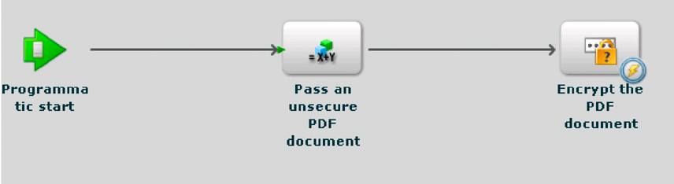

# Anropa AEM-formulär med fjärrstyrning {#invoking-aem-forms-using-remoting}

Processer som skapas i Workbench kan anropas med Remoting. Det innebär att du kan anropa en AEM Forms-process från en klientapplikation som skapats med Flex. Den här funktionen är baserad på datatjänster.

>[!NOTE]
>
>När du använder Remoting bör du anropa processer som har skapats i Workbench i stället för AEM Forms-tjänster. Det går dock att anropa AEM Forms-tjänster direkt. (Se Kryptera PDF-dokument med Remoting på AEM Forms Developer Center.)

>[!NOTE]
>
>Om en AEM Forms-tjänst inte är konfigurerad för att tillåta anonym åtkomst resulterar förfrågningar från en Flex-klient i en webbläsarutmaning. Användaren måste ange användarnamn och lösenord.

Följande korta AEM Forms-process med namnet `MyApplication/EncryptDocument`kan anropas med Remoting. (Mer information om den här processen, till exempel in- och utdatavärden, finns i Exempel på [kortlivade processer](/help/forms/developing/aem-forms-processes.md).)



>[!NOTE]
>
>Om du vill anropa en AEM Forms-process med ett Flex-program kontrollerar du att en fjärrslutpunkt är aktiverad. Som standard är en fjärrslutpunkt aktiverad när du distribuerar en process.

När den här processen anropas utför den följande åtgärder:

1. Hämtar det oskyddade PDF-dokumentet som skickas som ett indatavärde. Den här åtgärden baseras på `SetValue` åtgärden. Indataparameterns namn är `inDoc` och datatypen är `document`. (Datatypen är `document` en tillgänglig datatyp inifrån Workbench.)
1. Krypterar PDF-dokumentet med ett lösenord. Den här åtgärden baseras på `PasswordEncryptPDF` åtgärden. Namnet på utdatavärdet för den här processen är `outDoc` och representerar det lösenordskrypterade PDF-dokumentet. Datatypen för outDoc är `document`.
1. Sparar det lösenordskrypterade PDF-dokumentet som en PDF-fil i det lokala filsystemet. Den här åtgärden baseras på `WriteDocument` åtgärden.

>[!NOTE]
>
>Processen bygger inte på någon befintlig AEM Forms-process. `MyApplication/EncryptDocument` Om du vill följa med i kodexemplen skapar du en process med namnet `MyApplication/EncryptDocument` med Workbench.

>[!NOTE]
>
>Mer information om hur du använder Remoting för att anropa en långvarig process finns i [Anropa humancentrerade, långvariga processer](/help/forms/developing/invoking-human-centric-long-lived.md#invoking-human-centric-long-lived-processes).

**Se även**

[Inkludera AEM Forms Flex-biblioteksfilen](invoking-aem-forms-using-remoting.md#including-the-aem-forms-flex-library-file)

[Hantera dokument med (borttaget för AEM-formulär) AEM Forms Remoting](invoking-aem-forms-using-remoting.md#handling-documents-with-remoting)

[Anropa en kort process genom att skicka ett osäkert dokument med hjälp av (borttaget för AEM-formulär) AEM Forms Remoting](invoking-aem-forms-using-remoting.md#invoking-a-short-lived-process-by-passing-an-unsecure-document-using-remoting)

[Autentisera klientapplikationer som byggts med Flex](invoking-aem-forms-using-remoting.md#authenticating-client-applications-built-with-flex)

[Skicka säkra dokument för att starta processer med Remoting](invoking-aem-forms-using-remoting.md#passing-secure-documents-to-invoke-processes-using-remoting)

[Anropa anpassade komponenttjänster med Remoting](invoking-aem-forms-using-remoting.md#invoking-custom-component-services-using-remoting)

[Skapa en klientapplikation som byggts med Flex och som anropar en människocentrerad, långvarig process](/help/forms/developing/invoking-human-centric-long-lived.md#creating-a-client-application-built-with-flex-that-invokes-a-human-centric-long-lived-process)

[Skapa Flash Builder-program som utför SSO-autentisering med HTTP-tokens](/help/forms/developing/creating-flash-builder-applications-perform.md#creating-flash-builder-applications-that-perform-sso-authentication-using-http-tokens)

Mer information om hur du visar processdata i en Flex-diagramkontroll finns i [Visa AEM Forms-processdata i Flex-diagram](https://www.adobe.com/devnet/livecycle/articles/populating_flexcontrols.html).

>[!NOTE]
>
>*Gå till rätt plats för filen crossdomain.xml. Om du till exempel har distribuerat AEM Forms på JBoss placerar du den här filen på följande plats: &lt;install_directory>\Adobe_Experience_Manager_forms\jboss\server\lc_turnkey\deploy\jboss-web.deployer\ROOT.war.*

## Inkludera AEM Forms Flex-biblioteksfilen {#including-the-aem-forms-flex-library-file}

Om du vill anropa AEM Forms-processer med Remoting programmatiskt lägger du till filen adobe-remoting-provider.swc i klassökvägen för ditt Flex-projekt. Den här SWC-filen finns på följande plats:

* *&lt;install_directory>\Adobe_Experience_Manager_forms\sdk\misc\DataServices\Client-Libraries*

   där &lt;*install_directory*> är den katalog där AEM Forms är installerat.

**Se även**

[Anropa AEM Forms med (borttaget för AEM-formulär) AEM Forms Remoting](invoking-aem-forms-using-remoting.md#invoking-aem-forms-using-remoting)

[Hantera dokument med (borttaget för AEM-formulär) AEM Forms Remoting](invoking-aem-forms-using-remoting.md#handling-documents-with-remoting)

[Anropa en kort process genom att skicka ett osäkert dokument med hjälp av (borttaget för AEM-formulär) AEM Forms Remoting](invoking-aem-forms-using-remoting.md#invoking-a-short-lived-process-by-passing-an-unsecure-document-using-remoting)

[Autentisera klientapplikationer som byggts med Flex](invoking-aem-forms-using-remoting.md#authenticating-client-applications-built-with-flex)

## Hantera dokument med fjärrstyrning {#handling-documents-with-remoting}

En av de viktigaste icke-primitiva Java-typerna som används i AEM Forms är `com.adobe.idp.Document` klassen. Ett dokument krävs vanligtvis för att anropa en AEM Forms-åtgärd. Det är i första hand ett PDF-dokument, men kan innehålla andra dokumenttyper som SWF, HTML, XML eller en DOC-fil. (Se [Skicka data till AEM Forms-tjänster med Java API](/help/forms/developing/invoking-aem-forms-using-java.md#passing-data-to-aem-forms-services-using-the-java-api).)

En klientapplikation som byggts med Flex kan inte begära ett dokument direkt. Du kan till exempel inte starta Adobe Reader för att begära en URL som skapar en PDF-fil. Begäranden för dokumenttyper som PDF- och Microsoft Word-dokument returnerar ett resultat som är en URL. Det är kundens ansvar att visa innehållet i URL:en. Tjänsten Document Management hjälper till att generera information om URL och innehållstyp. Begäran om XML-dokument returnerar det fullständiga XML-dokumentet i resultatet.

### Skicka ett dokument som en indataparameter {#passing-a-document-as-an-input-parameter}

En klientapplikation som byggts med Flex kan inte skicka ett dokument direkt till en AEM Forms-process. I stället använder klientprogrammet en instans av `mx.rpc.livecycle.DocumentReference` ActionScript-klassen för att skicka indataparametrar till en åtgärd som förväntar sig en `com.adobe.idp.Document` instans. Ett Flex-klientprogram har flera alternativ för att konfigurera ett `DocumentReference` objekt:

* När dokumentet finns på servern och dess filplats är känd anger du egenskapen referenceType för DocumentReference-objektet till REF_TYPE_FILE. Ställ in egenskapen fileRef på filens plats, vilket visas i följande exempel:

```java
 ... var docRef: DocumentReference = new DocumentReference(); 
 docRef.referenceType = DocumentReference.REF_TYPE_FILE; 
 docRef.fileRef = "C:/install/adobe/cs2/How to Uninstall.pdf"; ...
```

* När dokumentet finns på servern och du känner till dess URL anger du egenskapen referenceType för DocumentReference-objektet till REF_TYPE_URL. Ställ in egenskapen url på URL:en enligt följande exempel:

```java
... var docRef: DocumentReference = new DocumentReference(); 
docRef.referenceType = DocumentReference.REF_TYPE_URL; 
docRef.url = "https://companyserver:8080/DocumentManager/116/7855"; ...
```

* Om du vill skapa ett DocumentReference-objekt från en textsträng i klientprogrammet anger du egenskapen referenceType för DocumentReference-objektet till REF_TYPE_INLINE. Ange egenskapen text till den text som ska inkluderas i objektet, vilket visas i följande exempel:

```java
... var docRef: DocumentReference = new DocumentReference(); 
docRef.referenceType = DocumentReference.REF_TYPE_INLINE; 
docRef.text = "Text for my document";  // Optionally, you can override the server’s default character set  // if necessary:  // docRef.charsetName=CharacterSetName  ...
```

* När dokumentet inte finns på servern kan du använda servern Remoting Upload för att överföra ett dokument till AEM Forms. Nytt i AEM Forms är möjligheten att överföra säkra dokument. När du överför ett säkert dokument måste du använda en användare som har rollen *Document Upload Application User* . Utan den här rollen kan användaren inte överföra ett säkert dokument. Vi rekommenderar att du använder enkel inloggning för att överföra ett säkert dokument. (Se [Skicka säkra dokument för att anropa processer med Remoting](invoking-aem-forms-using-remoting.md#passing-secure-documents-to-invoke-processes-using-remoting).)

   **Obs**: Om AEM Forms är konfigurerat att tillåta osäkra dokument att överföras kan du använda en användare som inte har användarrollen för dokumentöverföring för att överföra ett dokument. En användare kan också ha behörigheten Dokumentöverföring. Om AEM Forms är konfigurerat att endast tillåta säkra dokument måste användaren ha användarrollen Dokumentöverföring eller behörigheten Dokumentöverföring. (Se [Konfigurera AEM-formulär för att acceptera säkra och osäkra dokument](invoking-aem-forms-using-remoting.md#configuring-aem-forms-to-accept-secure-and-unsecure-documents).)

   Du använder Flash standardfunktioner för överföring av den angivna URL-adressen: `https://SERVER:PORT/remoting/lcfileupload`. Du kan sedan använda `DocumentReference` objektet där en indataparameter av typen `Document` förväntas
   ` private function startUpload():void  {  fileRef.addEventListener(Event.SELECT, selectHandler);  fileRef.addEventListener("uploadCompleteData", completeHandler);  try  {   var success:Boolean = fileRef.browse();  }    catch (error:Error)  {   trace("Unable to browse for files.");  }  }      private function selectHandler(event:Event):void {  var request:URLRequest = new  URLRequest("https://SERVER:PORT/remoting/lcfileupload")  try   {   fileRef.upload(request);   }    catch (error:Error)   {   trace("Unable to upload file.");   }  }    private function completeHandler(event:DataEvent):void  {   var params:Object = new Object();   var docRef:DocumentReference = new DocumentReference();   docRef.url = event.data as String;   docRef.referenceType = DocumentReference.REF_TYPE_URL;  }`Snabbstart för fjärrkommunikation använder serverkommandot för fjärröverföring för att skicka en PDF-fil till `MyApplication/EncryptDocument`processen. (Se [Anropa en kort process genom att skicka ett osäkert dokument med (borttaget för AEM-formulär) AEM Forms Remoting](invoking-aem-forms-using-remoting.md#invoking-a-short-lived-process-by-passing-an-unsecure-document-using-remoting).)

```java
 
private
function startUpload(): void  { 
 fileRef.addEventListener(Event.SELECT, selectHandler); 
 fileRef.addEventListener("uploadCompleteData", completeHandler); 
 try  { 
  var success: Boolean = fileRef.browse(); 
 }  
 catch (error: Error)  { 
  trace("Unable to browse for files."); 
 } 
}   
private
function selectHandler(event: Event): void { 
 var request: URLRequest = new  URLRequest("https://SERVER:PORT/remoting/lcfileupload")  try  { 
  fileRef.upload(request); 
 }  
 catch (error: Error)  { 
  trace("Unable to upload file."); 
 } 
}  
private
function completeHandler(event: DataEvent): void  { 
 var params: Object = new Object(); 
 var docRef: DocumentReference = new DocumentReference(); 
 docRef.url = event.data as String; 
 docRef.referenceType = DocumentReference.REF_TYPE_URL; 
}
```

Snabbstart för fjärrkommunikation använder serverkommandot för fjärröverföring för att skicka en PDF-fil till `MyApplication/EncryptDocument`processen. (Se [Anropa en kort process genom att skicka ett osäkert dokument med (borttaget för AEM-formulär) AEM Forms Remoting](invoking-aem-forms-using-remoting.md#invoking-a-short-lived-process-by-passing-an-unsecure-document-using-remoting).)

### Skicka tillbaka ett dokument till ett klientprogram {#passing-a-document-back-to-a-client-application}

Ett klientprogram tar emot ett objekt av typen `mx.rpc.livecycle.DocumentReference` för en tjänståtgärd som returnerar en `com.adobe.idp.Document` instans som en utdataparameter. Eftersom ett klientprogram hanterar ActionScript-objekt och inte Java, kan du inte skicka tillbaka ett Java-baserat Document-objekt till en Flex-klient. I stället skapar servern en URL för dokumentet och skickar tillbaka URL:en till klienten. Objektets `DocumentReference` egenskap anger om innehållet finns i `referenceType` objektet eller måste hämtas från en URL i `DocumentReference` `DocumentReference.url` egenskapen. Egenskapen anger `DocumentReference.contentType` dokumenttypen.

**Se även**

[Anropa AEM Forms med (borttaget för AEM-formulär) AEM Forms Remoting](invoking-aem-forms-using-remoting.md#invoking-aem-forms-using-remoting)

[Inkludera AEM Forms Flex-biblioteksfilen](invoking-aem-forms-using-remoting.md#including-the-aem-forms-flex-library-file)

[Anropa en kort process genom att skicka ett osäkert dokument med hjälp av (borttaget för AEM-formulär) AEM Forms Remoting](invoking-aem-forms-using-remoting.md#invoking-a-short-lived-process-by-passing-an-unsecure-document-using-remoting)

[Autentisera klientapplikationer som byggts med Flex](invoking-aem-forms-using-remoting.md#authenticating-client-applications-built-with-flex)

[Skicka säkra dokument för att starta processer med Remoting](invoking-aem-forms-using-remoting.md#passing-secure-documents-to-invoke-processes-using-remoting)

## Anropa en kort process genom att skicka ett osäkert dokument med Remoting {#invoking-a-short-lived-process-by-passing-an-unsecure-document-using-remoting}

Så här anropar du en AEM Forms-process från ett program som skapats med Flex:

1. Skapa en `mx:RemoteObject` instans.
1. Skapa en `ChannelSet` instans.
1. Godkänn obligatoriska indatavärden.
1. Hantera returvärden.

>[!NOTE]
I det här avsnittet beskrivs hur du anropar en AEM Forms-process och överför ett dokument när AEM Forms har konfigurerats för att överföra osäkra dokument. Mer information om hur du anropar AEM Forms-processer och överför säkra dokument och hur du konfigurerar AEM Forms att acceptera säkra och osäkra dokument finns i [Skicka säkra dokument för att anropa processer med Remoting](invoking-aem-forms-using-remoting.md#passing-secure-documents-to-invoke-processes-using-remoting).

**Skapa en mx:RemoteObject-instans**

Du skapar en `mx:RemoteObject` instans för att anropa en AEM Forms-process som har skapats i Workbench. Om du vill skapa en `mx:RemoteObject` instans anger du följande värden:

* **** id: Namnet på den `mx:RemoteObject` instans som representerar processen som ska anropas.
* **** mål: Namnet på den AEM Forms-process som ska anropas. Om du till exempel vill anropa `MyApplication/EncryptDocument` processen anger du `MyApplication/EncryptDocument`.
* **** resultat: Namnet på den Flex-metod som hanterar resultatet.

I - `mx:RemoteObject` taggen anger du en `<mx:method>` -tagg som anger namnet på processens anropsmetod. Vanligtvis är namnet på en anropsmetod för Forms `invoke`.

I följande kodexempel skapas en `mx:RemoteObject` instans som anropar `MyApplication/EncryptDocument` processen.

```as3
 <mx:RemoteObject id="EncryptDocument" destination="MyApplication/EncryptDocument" result="resultHandler(event);">
          <mx:method name="invoke" result="handleExecuteInvoke(event)"/>
      </mx:RemoteObject>
```

**Skapa en kanal till AEM-formulär**

Ett klientprogram kan anropa AEM Forms genom att ange en kanal i MXML eller ActionScript, vilket visas i följande ActionScript-exempel. Kanalen måste vara en `AMFChannel`, `SecureAMFChannel`, `HTTPChannel`eller `SecureHTTPChannel`.

```as3
     ...
     private function refresh():void{
         var cs:ChannelSet= new ChannelSet();
         cs.addChannel(new AMFChannel("my-amf",
             "https://yourlcserver:8080/remoting/messagebroker/amf"));
         EncryptDocument.setCredentials("administrator", "password");
         EncryptDocument.channelSet = cs;
     }
     ...
```

Tilldela `ChannelSet` instansen till `mx:RemoteObject` instansens `channelSet` fält (som i föregående kodexempel). Vanligtvis importerar du kanalklassen i en import-sats i stället för att ange det fullständiga kvalificerade namnet när du anropar `ChannelSet.addChannel` metoden.

**Skicka indatavärden**

En process som skapas i Workbench kan ta noll eller flera indataparametrar och returnera ett utdatavärde. Ett klientprogram skickar indataparametrar inom ett `ActionScript` objekt med fält som motsvarar parametrar som tillhör AEM Forms-processen. Den kortlivade processen med namnet `MyApplication/EncryptDocument`kräver en indataparameter med namnet `inDoc`. Namnet på åtgärden som exponeras av processen är `invoke` (standardnamnet för en kortlivad process). (Se [Anropa AEM-formulär med (borttaget för AEM-formulär) AEM Forms Remoting](invoking-aem-forms-using-remoting.md#invoking-aem-forms-using-remoting).)

I följande kodexempel skickas ett PDF-dokument till `MyApplication/EncryptDocument` processen:

```as3
     ...
     var params:Object = new Object();
 
     //Document is an instance of DocumentReference
     //that store an unsecured PDF document
     params["inDoc"] = pdfDocument;
 
     // Invoke an operation synchronously:
     EncryptDocument.invoke(params);
     ...
```

I det här kodexemplet `pdfDocument` är en `DocumentReference` instans som innehåller ett oskyddat PDF-dokument. Mer information om ett `DocumentReference`program finns i [Hantera dokument med (borttaget för AEM-formulär) AEM Forms Remoting](invoking-aem-forms-using-remoting.md#handling-documents-with-remoting).

**Anropa en specifik version av en tjänst**

Du kan anropa en specifik version av en Forms-tjänst genom att använda en `_version` parameter i anropets parametermappning. Så här anropar du till exempel version 1.2 av `MyApplication/EncryptDocument` tjänsten:

```as3
 var params:Object = new Object();
 params["inDoc"] = pdfDocument;
 params["_version"] = "1.2"
 var token:AsyncToken = echoService.echoString(params);
```

Parametern måste vara en sträng som innehåller en enda punkt. `version` Värdena till vänster, huvudversionen och till höger, delversion av punkten måste vara heltal. Om den här parametern inte anges anropas den aktiva huvudversionen.

**Hantera returvärden**

AEM Forms processutdataparametrar deserialiseras till ActionScript-objekt från vilka klientprogrammet extraherar specifika parametrar efter namn, vilket visas i följande exempel. (Utdatavärdet för `MyApplication/EncryptDocument` processen heter `outDoc`.)

```as3
     ...
     var res:Object = event.result;
     var docRef:DocumentReference = res["outDoc"] as DocumentReference;
     ...
```

**Anropa processen MyApplication/EncryptDocument**

Du kan anropa `MyApplication/EncryptDocument` processen genom att utföra följande steg:

1. Skapa en `mx:RemoteObject` instans med antingen ActionScript eller MXML. Se Skapa en mx:RemoteObject-instans.
1. Konfigurera en `ChannelSet` instans för kommunikation med AEM Forms och koppla den till `mx:RemoteObject` instansen. Se Skapa en kanal till AEM-formulär.
1. Anropa ChannelSet- `login` metoden eller tjänstens `setCredentials` metod för att ange användaridentifierarvärdet och lösenordet. (Se [Använda enkel inloggning](invoking-aem-forms-using-remoting.md#using-single-sign-on).)
1. Fyll i en `mx.rpc.livecycle.DocumentReference` instans med ett oskyddat PDF-dokument som ska skickas till `MyApplication/EncryptDocument` processen. (Se [Skicka ett dokument som en indataparameter](invoking-aem-forms-using-remoting.md#passing-a-document-as-an-input-parameter).)
1. Kryptera PDF-dokumentet genom att anropa `mx:RemoteObject` instansens `invoke` metod. Skicka `Object` som innehåller indataparametern (som är det oskyddade PDF-dokumentet). Se Skicka indatavärden.
1. Hämta det lösenordskrypterade PDF-dokumentet som returneras från processen. Se Hantera returvärden.

[Snabbstart:Anropa en kort process genom att skicka ett osäkert dokument med hjälp av (borttaget för AEM-formulär) AEM Forms Remoting](/help/forms/developing/invocation-api-quick-starts.md#quick-start-invoking-a-short-lived-process-by-passing-an-unsecure-document-using-deprecated-for-aem-forms-aem-forms-remoting)

## Autentisera klientapplikationer som byggts med Flex {#authenticating-client-applications-built-with-flex}

Det finns flera sätt att autentisera en fjärrbegäran från ett Flex-program med hjälp av användarhanteraren för AEM-formulär, bland annat enkel inloggning med AEM Forms via den centrala inloggningstjänsten, grundläggande autentisering och anpassad autentisering. När varken enkel inloggning eller anonym åtkomst är aktiverat resulterar en fjärrbegäran i antingen grundläggande autentisering (standard) eller anpassad autentisering.

Grundläggande autentisering är beroende av standardbaserad J2EE-autentisering från webbprogrambehållaren. För grundläggande autentisering orsakar ett HTTP 401-fel en webbläsarutmaning. Det innebär att när du försöker ansluta till ett Forms-program med hjälp av RemoteObject och ännu inte har loggat in från Flex-programmet, uppmanas du att ange användarnamn och lösenord i webbläsaren.

För anpassad autentisering skickar servern ett fel till klienten som anger att autentisering krävs.

>[!NOTE]
Mer information om hur du utför autentisering med HTTP-token finns i [Skapa Flash Builder-program som utför SSO-autentisering med HTTP-tokens](/help/forms/developing/creating-flash-builder-applications-perform.md#creating-flash-builder-applications-that-perform-sso-authentication-using-http-tokens).

### Använda anpassad autentisering {#using-custom-authentication}

Du aktiverar anpassad autentisering i administrationskonsolen genom att ändra autentiseringsmetoden från Grundläggande till Anpassad på fjärrslutpunkten. Om du använder anpassad autentisering anropar klientprogrammet metoden för att logga in och metoden för att logga ut, `ChannelSet.login` och metoden för att logga `ChannelSet.logout` ut.

>[!NOTE]
I den tidigare versionen av AEM Forms skickade du autentiseringsuppgifter till ett mål genom att anropa `RemoteObject.setCredentials` metoden. Metoden överförde inte autentiseringsuppgifterna till servern förrän komponenten försökte ansluta till servern för första gången. `setCredentials` Om komponenten har utfärdat en felhändelse kan du därför inte vara säker på om felet har inträffat på grund av ett autentiseringsfel eller av en annan anledning. Metoden ansluts till servern när du anropar den så att du kan hantera ett autentiseringsproblem direkt. `ChannelSet.login` Även om du kan fortsätta att använda `setCredentials` metoden rekommenderar vi att du använder `ChannelSet.login` metoden.

Eftersom flera destinationer kan använda samma kanaler och motsvarande ChannelSet-objekt, loggas in på ett mål och användaren loggas in på ett annat mål som använder samma kanal eller kanaler. Om två komponenter använder olika inloggningsuppgifter för samma ChannelSet-objekt används de senaste inloggningsuppgifterna. Om flera komponenter använder samma autentiserade ChannelSet-objekt, loggas alla komponenter ut från destinationen när metoden anropas `logout` .

I följande exempel används metoderna `ChannelSet.login` och `ChannelSet.logout` med en RemoteObject-kontroll. Programmet utför följande åtgärder:

* Skapar ett `ChannelSet` objekt i `creationComplete` hanteraren som representerar de kanaler som används av `RemoteObject` komponenten
* Skickar autentiseringsuppgifter till servern genom att anropa funktionen som svar på en klickningshändelse för en knapp `ROLogin`
* Använder RemoteObject-komponenten för att skicka en sträng till servern som svar på en Button-klickningshändelse. Servern returnerar samma sträng till RemoteObject-komponenten
* Använder result-händelsen för RemoteObject-komponenten för att visa strängen i en TextArea-kontroll
* Loggar ut från servern genom att anropa funktionen som svar på en klickningshändelse för en knapp `ROLogout`

```as3
 <?xml version=”1.0”?>
 <!-- security/SecurityConstraintCustom.mxml -->
 <mx:Application xmlns:mx=”https://www.adobe.com/2006/mxml” width=”100%”
     height=”100%” creationComplete=”creationCompleteHandler();”>
 
     <mx:Script>
         <![CDATA[
             import mx.controls.Alert;
             import mx.messaging.config.ServerConfig;
             import mx.rpc.AsyncToken;
             import mx.rpc.AsyncResponder;
             import mx.rpc.events.FaultEvent;
             import mx.rpc.events.ResultEvent;
             import mx.messaging.ChannelSet;
 
             // Define a ChannelSet object.
             public var cs:ChannelSet;
 
             // Define an AsyncToken object.
             public var token:AsyncToken;
 
             // Initialize ChannelSet object based on the
             // destination of the RemoteObject component.
             private function creationCompleteHandler():void {
                 if (cs == null)
                 cs = ServerConfig.getChannelSet(remoteObject.destination);
             }
 
             // Login and handle authentication success or failure.
             private function ROLogin():void {
                 // Make sure that the user is not already logged in.
                 if (cs.authenticated == false) {
                     token = cs.login(“sampleuser”, “samplepassword”);
                     // Add result and fault handlers.
                     token.addResponder(new AsyncResponder(LoginResultEvent,
                     LoginFaultEvent));
                 }
             }
 
             // Handle successful login.
             private function LoginResultEvent(event:ResultEvent,
                 token:Object=null):void  {
                     switch(event.result) {
                         case “success”:
                             authenticatedCB.selected = true;
                             break;
                             default:
                     }
                 }
 
                 // Handle login failure.
                 private function LoginFaultEvent(event:FaultEvent,
                     token:Object=null):void {
                         switch(event.fault.faultCode) {
                             case “Client.Authentication”:
                                 default:
                                 authenticatedCB.selected = false;
                                 Alert.show(“Login failure: “ + event.fault.faultString);
                     }
                 }
 
                 // Logout and handle success or failure.
                 private function ROLogout():void {
                     // Add result and fault handlers.
                     token = cs.logout();
                     token.addResponder(new
                         AsyncResponder(LogoutResultEvent,LogoutFaultEvent));
                 }
 
                 // Handle successful logout.
                 private function LogoutResultEvent(event:ResultEvent,
                     token:Object=null):void {
                         switch (event.result) {
                             case “success”:
                                 authenticatedCB.selected = false;
                                 break;
                                 default:
                     }
                 }
 
                 // Handle logout failure.
                 private function LogoutFaultEvent(event:FaultEvent,
                     token:Object=null):void {
                         Alert.show(“Logout failure: “ + event.fault.faultString);
                 }
                 // Handle message recevied by RemoteObject component.
                 private function resultHandler(event:ResultEvent):void {
                     ta.text += “Server responded: “+ event.result + “\n”;
                 }
 
                 // Handle fault from RemoteObject component.
                 private function faultHandler(event:FaultEvent):void {
                     ta.text += “Received fault: “ + event.fault + “\n”;
                 }
             ]]>
     </mx:Script>
     <mx:HBox>
         <mx:Label text=”Enter a text for the server to echo”/>
         <mx:TextInput id=”ti” text=”Hello World!”/>
         <mx:Button label=”Login”
             click=”ROLogin();”/>
         <mx:Button label=”Echo”
             enabled=”{authenticatedCB.selected}”
             click=”remoteObject.echo(ti.text);”/>
         <mx:Button label=”Logout”
             click=”ROLogout();”/>
         <mx:CheckBox id=”authenticatedCB”
             label=”Authenticated?”
             enabled=”false”/>
     </mx:HBox>
     <mx:TextArea id=”ta” width=”100%” height=”100%”/>
 
     <mx:RemoteObject id=”remoteObject”
         destination=”myDest”
         result=”resultHandler(event);”
         fault=”faultHandler(event);”/>
 </mx:Application>
```

Metoderna `login` och `logout` returnerar ett AsyncToken-objekt. Tilldela händelsehanterare till AsyncToken-objektet för result-händelsen för att hantera ett lyckat anrop och för att error-händelsen ska hantera ett fel.

### Använda enkel inloggning {#using-single-sign-on}

AEM-formuläranvändare kan ansluta till flera AEM Forms-webbprogram för att utföra en uppgift. När användare flyttar från ett webbprogram till ett annat är det inte effektivt att kräva att de loggar in separat till varje webbprogram. Med AEM Forms mekanism för enkel inloggning kan användarna logga in en gång och sedan komma åt alla AEM Forms-webbprogram. Eftersom AEM Forms-utvecklare kan skapa klientapplikationer som kan användas med AEM Forms måste de också kunna utnyttja den enkla inloggningsfunktionen.

Varje AEM Forms-webbprogram paketeras i en egen WAR-fil (Web Archive) som sedan paketeras som en del av en EAR-fil (Enterprise Archive). Eftersom en programserver inte tillåter delning av sessionsdata mellan olika webbprogram använder AEM Forms HTTP-cookies för att lagra autentiseringsinformation. Med autentiseringscookies kan användaren logga in i ett Forms-program och sedan ansluta till andra AEM Forms-webbprogram. Den här tekniken kallas för enkel inloggning.

AEM Forms-utvecklare skriver klientapplikationer för att utöka funktionaliteten i formulärguiderna (borttagna) och för att anpassa arbetsytan. Ett Workspace-program kan till exempel starta en process. Klientprogrammet använder sedan en fjärrslutpunkt för att hämta data från Forms-tjänsten.

När en AEM Forms-tjänst anropas med (borttaget för AEM-formulär) AEM Forms Remoting, skickas autentiseringscookien som en del av begäran. Eftersom användaren redan har autentiserats krävs ingen ytterligare inloggning för att ansluta klientprogrammet till AEM Forms-tjänsten.

>[!NOTE]
Om en cookie är ogiltig eller saknas finns ingen implicit omdirigering till en inloggningssida. Därför kan du fortfarande ringa en anonym tjänst.

Du kan kringgå AEM Forms-mekanismen för enkel inloggning genom att skriva ett klientprogram som loggar in och ut separat. Om du kringgår inloggningsfunktionen kan du använda grundläggande eller anpassad autentisering med programmet.

Eftersom den här funktionen inte använder AEM Forms-mekanismen för enkel inloggning skrivs ingen cookie för autentisering till klienten. Inloggningsuppgifter lagras i `ChannelSet` objektet för fjärrkanalen. Därför `RemoteObject` `ChannelSet` sker alla anrop som du gör över samma sak i samband med dessa autentiseringsuppgifter.

### Konfigurera enkel inloggning i AEM-formulär {#setting-up-single-sign-on-in-aem-forms}

Om du vill använda enkel inloggning i AEM Forms installerar du arbetsflödeskomponenten för formulär, som innehåller den centraliserade inloggningstjänsten. När en användare har loggat in returnerar den centraliserade inloggningstjänsten en autentiseringscookie till användaren. Varje efterföljande begäran till ett Forms-webbprogram innehåller cookien. Om cookien är giltig betraktas användaren som autentiserad och behöver inte logga in igen.

### Skriva ett klientprogram som använder enkel inloggning {#writing-a-client-application-that-uses-single-sign-on}

När du utnyttjar den enkla inloggningsfunktionen förväntar du dig att användarna loggar in med den centraliserade inloggningstjänsten innan de startar ett klientprogram. Det innebär att ett klientprogram inte loggar in via webbläsaren eller genom att anropa `ChannelSet.login` metoden.

Om du använder AEM Forms-mekanismen för enkel inloggning konfigurerar du slutpunkten för fjärrkommunikation så att den använder anpassad autentisering, inte grundläggande. Om du använder grundläggande autentisering orsakar ett autentiseringsfel i webbläsaren ett problem som du inte vill att användaren ska se. Programmet identifierar i stället autentiseringsfelet och visar sedan ett meddelande som instruerar användaren att logga in med den centraliserade inloggningstjänsten.

Ett klientprogram får åtkomst till AEM Forms via en fjärrslutpunkt genom att använda `RemoteObject` -komponenten, vilket visas i följande exempel.

```as3
 <?xml version="1.0"?>
 <mx:Application
        backgroundColor="#FFFFFF">
 
       <mx:Script>
          <![CDATA[
 
            import mx.controls.Alert;
            import mx.rpc.events.FaultEvent;
 
            // Prompt user to login on a fault.
            private function faultHandler(event:FaultEvent):void
            {
             if(event.fault.faultCode=="Client.Authentication")
             {
                 Alert.show(
                     event.fault.faultString + "\n" +
                     event.fault.faultCode + "\n" +
                     "Please login to continue.");
             }
         }
          ]]>
       </mx:Script>
 
       <mx:RemoteObject id="srv"
           destination="product"
           fault="faultHandler(event);"/>
 
       <mx:DataGrid
           width="100%" height="100%"
           dataProvider="{srv.getProducts.lastResult}"/>
 
       <mx:Button label="Get Data"
           click="srv.getProducts();"/>
 
 </mx:Application>
```

**Logga in som en ny användare medan Flex-applikationen fortfarande körs**

En applikation som byggts med Flex innehåller autentiserings-cookie med varje begäran till en AEM Forms-tjänst. Av prestandaskäl validerar AEM Forms inte cookien vid varje begäran. AEM Forms identifierar dock när en autentiseringscookie ersätts med en annan autentiseringscookie.

Du kan till exempel starta ett klientprogram och när programmet är aktivt loggar du ut med den centraliserade inloggningstjänsten. Sedan kan du logga in som en annan användare. När du loggar in som en annan användare ersätts den befintliga autentiseringscookien med en autentiseringscookie för den nya användaren.

På nästa begäran från klientprogrammet upptäcker AEM Forms att cookien har ändrats och loggar ut användaren. Därför misslyckas den första begäran efter en cookie-ändring. Alla efterföljande förfrågningar görs i samband med den nya cookien och genomförs.

**Loggar ut**

Om du vill logga ut från AEM Forms och ogiltigförklara en session måste autentiseringscookien tas bort från klientens dator. Eftersom syftet med enkel inloggning är att tillåta en användare att logga in en gång, vill du inte att något klientprogram ska ta bort cookien. Den här åtgärden loggar ut användaren på ett effektivt sätt.

Därför genereras ett felmeddelande på klienten som anger att sessionen inte är utloggad när metoden anropas i ett klientprogram `RemoteObject.logout` . I stället kan användaren använda den centraliserade inloggningstjänsten för att logga ut och ta bort autentiseringscookien.

**Logga ut medan Flex-applikationen fortfarande körs**

Du kan starta en klientapplikation som byggts med Flex och använda den centraliserade inloggningstjänsten för att logga ut. Som en del av utloggningsprocessen tas autentiserings-cookien bort. Om en fjärrbegäran görs utan en cookie, eller med en ogiltig cookie, blir användarsessionen ogiltig. Den här åtgärden är i själva verket en utloggning. Nästa gång klientprogrammet försöker ansluta till en AEM Forms-tjänst blir användaren ombedd att logga in.

**Se även**

[Anropa AEM Forms med (borttaget för AEM-formulär) AEM Forms Remoting](invoking-aem-forms-using-remoting.md#invoking-aem-forms-using-remoting)

[Hantera dokument med (borttaget för AEM-formulär) AEM Forms Remoting](invoking-aem-forms-using-remoting.md#handling-documents-with-remoting)

[Inkludera AEM Forms Flex-biblioteksfilen](invoking-aem-forms-using-remoting.md#including-the-aem-forms-flex-library-file)

[Anropa en kort process genom att skicka ett osäkert dokument med hjälp av (borttaget för AEM-formulär) AEM Forms Remoting](invoking-aem-forms-using-remoting.md#invoking-a-short-lived-process-by-passing-an-unsecure-document-using-remoting)

[Skicka säkra dokument för att starta processer med Remoting](invoking-aem-forms-using-remoting.md#passing-secure-documents-to-invoke-processes-using-remoting)

## Skicka säkra dokument för att starta processer med Remoting {#passing-secure-documents-to-invoke-processes-using-remoting}

Du kan skicka säkra dokument till AEM Forms när du anropar en process som kräver ett eller flera dokument. Genom att skicka ett säkert dokument skyddar du affärsinformation och konfidentiella dokument. I det här fallet kan ett dokument referera till ett PDF-dokument, ett XML-dokument, ett Word-dokument och så vidare. Det krävs att ett säkert dokument skickas till AEM Forms från ett klientprogram som är skrivet i Flex när AEM Forms har konfigurerats för att tillåta säkra dokument. (Se [Konfigurera AEM-formulär för att acceptera säkra och osäkra dokument](invoking-aem-forms-using-remoting.md#configuring-aem-forms-to-accept-secure-and-unsecure-documents).)

När du skickar ett säkert dokument ska du använda enkel inloggning och ange en AEM-formuläranvändare som har rollen *Dokumentöverföringsprogram, användare* . Utan den här rollen kan användaren inte överföra ett säkert dokument. Du kan tilldela en roll programmatiskt till en användare. (Se [Hantera roller och behörigheter](/help/forms/developing/users.md#managing-roles-and-permissions).)

>[!NOTE]
När du skapar en ny roll och vill att medlemmar med den rollen ska överföra säkra dokument måste du ange behörigheten Dokumentöverföring.

AEM Forms stöder en åtgärd med namnet `getFileUploadToken` som returnerar en token som skickas till överföringsservern. Metoden kräver en URL till AEM Forms tillsammans med den token som returneras av `DocumentReference.constructRequestForUpload` `LC.FileUploadAuthenticator.getFileUploadToken` metoden. Den här metoden returnerar ett `URLRequest` objekt som används i anropet till överföringsservern. I följande kod visas programlogiken.

```as3
     ...
         private function startUpload():void
         {
             fileRef.addEventListener(Event.SELECT, selectHandler);
             fileRef.addEventListener("uploadCompleteData", completeHandler);
             try
             {
         var success:Boolean = fileRef.browse();
             }
             catch (error:Error)
             {
                 trace("Unable to browse for files.");
             }
 
         }
 
          private function selectHandler(event:Event):void
             {
             var authTokenService:RemoteObject = new RemoteObject("LC.FileUploadAuthenticator");
             authTokenService.addEventListener("result", authTokenReceived);
             authTokenService.channelSet = cs;
             authTokenService.getFileUploadToken();
             }
 
         private function authTokenReceived(event:ResultEvent):void
             {
             var token:String = event.result as String;
             var request:URLRequest = DocumentReference.constructRequestForUpload("http://localhost:8080", token);
 
             try
             {
           fileRef.upload(request);
             }
             catch (error:Error)
             {
             trace("Unable to upload file.");
             }
             }
 
         private function completeHandler(event:DataEvent):void
         {
 
             var params:Object = new Object();
             var docRef:DocumentReference = new DocumentReference();
             docRef.url = event.data as String;
             docRef.referenceType = DocumentReference.REF_TYPE_URL;
         }
         ...
```

)

### Konfigurera AEM-formulär för att godkänna säkra och osäkra dokument {#configuring-aem-forms-to-accept-secure-and-unsecure-documents}

Du kan använda administrationskonsolen för att ange om dokument är säkra när du skickar ett dokument från en Flex-klientapplikation till en AEM Forms-process. Som standard är AEM Forms konfigurerat att ta emot säkra dokument. Du kan konfigurera AEM Forms att acceptera säkra dokument genom att utföra följande steg:

1. Logga in på administrationskonsolen.
1. Klicka på **Inställningar**.
1. Klicka på **Core System Settings.**
1. Klicka på Konfigurationer.
1. Kontrollera att alternativet Tillåt oskyddad dokumentöverföring från Flex-program är avmarkerat.

>[!NOTE]
Om du vill konfigurera AEM-formulär så att osäkra dokument accepteras markerar du alternativet Tillåt oskyddad dokumentöverföring från Flex-program. Starta sedan om ett program eller en tjänst för att se till att inställningen börjar gälla.

### Snabbstart: Anropa en kort process genom att skicka ett säkert dokument med Remoting {#quick-start-invoking-a-short-lived-process-by-passing-a-secure-document-using-remoting}

I följande kodexempel anropas `MyApplication/EncryptDocument.`A-användaren måste logga in för att klicka på knappen Välj fil som används för att överföra en PDF-fil och starta processen. Det vill säga, när användaren har autentiserats aktiveras knappen Välj fil. Följande bild visar Flex-klientprogrammet när en användare har autentiserats. Observera att den autentiserade CheckBox är aktiverad.


Om AEM Forms är konfigurerat att endast tillåta att säkra dokument överförs och användaren inte har rollen *Document Upload Application User* , genereras ett undantag. Om användaren har den här rollen överförs filen och processen anropas.

```as3
 <?xml version="1.0" encoding="utf-8"?>
 <mx:Application  xmlns="*"
      creationComplete="initializeChannelSet();">
        <mx:Script>
        <![CDATA[
      import mx.rpc.livecycle.DocumentReference;
      import flash.net.FileReference;
      import flash.net.URLRequest;
      import flash.events.Event;
      import flash.events.DataEvent;
      import mx.messaging.ChannelSet;
      import mx.messaging.channels.AMFChannel;
      import mx.rpc.events.ResultEvent;
      import mx.collections.ArrayCollection;
      import mx.rpc.AsyncToken;
      import mx.controls.Alert;
      import mx.rpc.events.FaultEvent;
      import mx.rpc.AsyncResponder;
 
      // Classes used in file retrieval
      private var fileRef:FileReference = new FileReference();
      private var docRef:DocumentReference = new DocumentReference();
      private var parentResourcePath:String = "/";
      private var now1:Date;
      private var serverPort:String = "hiro-xp:8080";
 
      // Define a ChannelSet object.
      public var cs:ChannelSet;
 
      // Define an AsyncToken object.
      public var token:AsyncToken;
 
       // Holds information returned from AEM Forms
      [Bindable]
      public var progressList:ArrayCollection = new ArrayCollection();
 
 
      // Handles a successful login
     private function LoginResultEvent(event:ResultEvent,
         token:Object=null):void  {
             switch(event.result) {
                 case "success":
                     authenticatedCB.selected = true;
                     btnFile.enabled = true;
                     btnLogout.enabled = true;
                     btnLogin.enabled = false;
                         break;
                     default:
                 }
             }
 
 
 // Handle login failure.
 private function LoginFaultEvent(event:FaultEvent,
     token:Object=null):void {
     switch(event.fault.faultCode) {
                 case "Client.Authentication":
                         default:
                         authenticatedCB.selected = false;
                         Alert.show("Login failure: " + event.fault.faultString);
                 }
             }
 
 
      // Set up channel set to invoke AEM Forms
      private function initializeChannelSet():void {
        cs = new ChannelSet();
        cs.addChannel(new AMFChannel("remoting-amf", "https://" + serverPort + "/remoting/messagebroker/amf"));
        EncryptDocument2.channelSet = cs;
      }
 
     // Call this method to upload the file.
      // This creates a file picker and lets the user select a PDF file to pass to the EncryptDocument process.
      private function uploadFile():void {
        fileRef.addEventListener(Event.SELECT, selectHandler);
        fileRef.addEventListener(DataEvent.UPLOAD_COMPLETE_DATA,completeHandler);
        fileRef.browse();
      }
 
      // Gets called for selected file. Does the actual upload via the file upload servlet.
      private function selectHandler(event:Event):void {
              var authTokenService:RemoteObject = new RemoteObject("LC.FileUploadAuthenticator");
         authTokenService.addEventListener("result", authTokenReceived);
         authTokenService.channelSet = cs;
         authTokenService.getFileUploadToken();
      }
 
     private function authTokenReceived(event:ResultEvent):void
     {
     var token:String = event.result as String;
     var request:URLRequest = DocumentReference.constructRequestForUpload("https://hiro-xp:8080", token);
 
     try
     {
           fileRef.upload(request);
     }
     catch (error:Error)
     {
         trace("Unable to upload file.");
     }
 }
 
      // Called once the file is completely uploaded.
      private function completeHandler(event:DataEvent):void {
 
        // Set the docRef’s url and referenceType parameters
        docRef.url = event.data as String;
        docRef.referenceType=DocumentReference.REF_TYPE_URL;
        executeInvokeProcess();
      }
 
     //This method invokes the EncryptDocument process
      public function executeInvokeProcess():void {
         //Create an Object to store the input value for the EncryptDocument process
           now1 = new Date();
 
         var params:Object = new Object();
         params["inDoc"]=docRef;
 
         // Invoke the EncryptDocument process
         var token:AsyncToken;
         token = EncryptDocument2.invoke(params);
         token.name = name;
      }
 
      // AEM Forms  login method
      private function ROLogin():void {
         // Make sure that the user is not already logged in.
 
         //Get the User and Password
         var userName:String = txtUser.text;
         var pass:String = txtPassword.text;
 
        if (cs.authenticated == false) {
             token = cs.login(userName, pass);
 
         // Add result and fault handlers.
         token.addResponder(new AsyncResponder(LoginResultEvent,    LoginFaultEvent));
                 }
             }
 
      // This method handles a successful process invocation
      public function handleResult(event:ResultEvent):void
      {
            //Retrieve information returned from the service invocation
          var token:AsyncToken = event.token;
          var res:Object = event.result;
          var dr:DocumentReference = res["outDoc"] as DocumentReference;
          var now2:Date = new Date();
 
           // These fields map to columns in the DataGrid
          var progObject:Object = new Object();
          progObject.filename = token.name;
          progObject.timing = (now2.time - now1.time).toString();
          progObject.state = "Success";
          progObject.link = "<a href='" + dr.url + "'> open </a>";
          progressList.addItem(progObject);
      }
 
      // Prompt user to login on a fault.
       private function faultHandler(event:FaultEvent):void
            {
             if(event.fault.faultCode=="Client.Authentication")
             {
                 Alert.show(
                     event.fault.faultString + "\n" +
                     event.fault.faultCode + "\n" +
                     "Please login to continue.");
             }
            }
 
       // AEM Forms  logout method
     private function ROLogout():void {
         // Add result and fault handlers.
         token = cs.logout();
         token.addResponder(new AsyncResponder(LogoutResultEvent,LogoutFaultEvent));
     }
 
     // Handle successful logout.
     private function LogoutResultEvent(event:ResultEvent,
         token:Object=null):void {
         switch (event.result) {
         case "success":
                 authenticatedCB.selected = false;
                 btnFile.enabled = false;
                 btnLogout.enabled = false;
                 btnLogin.enabled = true;
                 break;
                 default:
             }
     }
 
     // Handle logout failure.
     private function LogoutFaultEvent(event:FaultEvent,
             token:Object=null):void {
             Alert.show("Logout failure: " + event.fault.faultString);
     }
 
          private function resultHandler(event:ResultEvent):void {
          // Do anything else here.
          }
        ]]>
 
      </mx:Script>
      <mx:RemoteObject id="EncryptDocument" destination="MyApplication/EncryptDocument" result="resultHandler(event);">
          <mx:method name="invoke" result="handleResult(event)"/>
      </mx:RemoteObject>
 
       <!--//This consists of what is displayed on the webpage-->
      <mx:Panel id="lcPanel" title="EncryptDocument  (Deprecated for AEM forms) AEM Forms Remoting Example"
           height="25%" width="25%" paddingTop="10" paddingLeft="10" paddingRight="10"
           paddingBottom="10">
         <mx:Label width="100%" color="blue"
                text="Select a PDF file to pass to the EncryptDocument process"/>
        <mx:DataGrid x="10" y="0" width="500" id="idProgress" editable="false"
           dataProvider="{progressList}" height="231" selectable="false" >
          <mx:columns>
            <mx:DataGridColumn headerText="Filename" width="200" dataField="filename" editable="false"/>
            <mx:DataGridColumn headerText="State" width="75" dataField="state" editable="false"/>
            <mx:DataGridColumn headerText="Timing" width="75" dataField="timing" editable="false"/>
            <mx:DataGridColumn headerText="Click to Open" dataField="link" editable="false" >
             <mx:itemRenderer>
                <mx:Component>
                   <mx:Text x="0" y="0" width="100%" htmlText="{data.link}"/>
                </mx:Component>
             </mx:itemRenderer>
            </mx:DataGridColumn>
          </mx:columns>
        </mx:DataGrid>
        <mx:Button label="Select File" click="uploadFile()"  id="btnFile" enabled="false"/>
        <mx:Button label="Login" click="ROLogin();" id="btnLogin"/>
        <mx:Button label="LogOut" click="ROLogout();" enabled="false" id="btnLogout"/>
        <mx:HBox>
         <mx:Label text="User:"/>
         <mx:TextInput id="txtUser" text=""/>
         <mx:Label text="Password:"/>
         <mx:TextInput id="txtPassword" text="" displayAsPassword="true"/>
         <mx:CheckBox id="authenticatedCB"
             label="Authenticated?"
             enabled="false"/>
     </mx:HBox>
      </mx:Panel>
 </mx:Application>
```

**Se även**

[Anropa AEM Forms med (borttaget för AEM-formulär) AEM Forms Remoting](invoking-aem-forms-using-remoting.md#invoking-aem-forms-using-remoting)

[Hantera dokument med (borttaget för AEM-formulär) AEM Forms Remoting](invoking-aem-forms-using-remoting.md#handling-documents-with-remoting)

[Inkludera AEM Forms Flex-biblioteksfilen](invoking-aem-forms-using-remoting.md#including-the-aem-forms-flex-library-file)

[Anropa en kort process genom att skicka ett osäkert dokument med hjälp av (borttaget för AEM-formulär) AEM Forms Remoting](invoking-aem-forms-using-remoting.md#invoking-a-short-lived-process-by-passing-an-unsecure-document-using-remoting)

[Autentisera klientapplikationer som byggts med Flex](invoking-aem-forms-using-remoting.md#authenticating-client-applications-built-with-flex)

## Anropa anpassade komponenttjänster med Remoting {#invoking-custom-component-services-using-remoting}

Du kan anropa tjänster som finns i en anpassad komponent med Remoting. Ta till exempel komponenten Bank som innehåller kundtjänsten. Du kan anropa åtgärder som tillhör kundtjänsten med ett klientprogram som är skrivet i Flex. Innan du kan utföra snabbstarten som är kopplad till det här avsnittet måste du skapa den anpassade komponenten Bank.

Kundtjänsten visar en åtgärd med namnet `createCustomer`. Här beskrivs hur du skapar en Flex-klientapplikation som anropar kundtjänsten och skapar en kund. Den här åtgärden kräver ett komplext objekt av typen `com.adobe.livecycle.sample.customer.Customer` som representerar den nya kunden. Följande bild visar klientprogrammet som anropar kundtjänsten och skapar en ny kund. Åtgärden `createCustomer` returnerar ett kundidentifierarvärde. Identifierarvärdet visas i textrutan Kundidentifierare.


I följande tabell visas de kontroller som är en del av det här klientprogrammet.

<table>
 <thead>
  <tr>
   <th><p>Kontrollnamn</p></th>
   <th><p>Beskrivning</p></th>
  </tr>
 </thead>
 <tbody>
  <tr>
   <td><p>txtFirst</p></td>
   <td><p>Anger kundens förnamn. </p></td>
  </tr>
  <tr>
   <td><p>txtLast</p></td>
   <td><p>Anger kundens efternamn. </p></td>
  </tr>
  <tr>
   <td><p>txtPhone</p></td>
   <td><p>Anger kundens telefonnummer.</p></td>
  </tr>
  <tr>
   <td><p>txtStreet</p></td>
   <td><p>Anger kundens gatunamn.</p></td>
  </tr>
  <tr>
   <td><p>txtState</p></td>
   <td><p>Anger kundens tillstånd. </p></td>
  </tr>
  <tr>
   <td><p>txtZIP</p></td>
   <td><p>Anger kundens postnummer. </p></td>
  </tr>
  <tr>
   <td><p>txtCity</p></td>
   <td><p>Anger kundens ort.</p></td>
  </tr>
  <tr>
   <td><p>txtCustId</p></td>
   <td><p>Anger det kundidentifieringsvärde som det nya kontot tillhör. Den här textrutan fylls i med returvärdet för kundtjänstens <code>createCustomer</code> åtgärd. </p></td>
  </tr>
 </tbody>
</table>

### Mappa avancerade datatyper för AEM-formulär {#mapping-aem-forms-complex-data-types}

Vissa AEM Forms-åtgärder kräver komplexa datatyper som indatavärden. Dessa komplexa datatyper definierar körtidsvärden som används av åtgärden. Kundtjänstens `createCustomer` åtgärd kräver till exempel en `Customer` instans som innehåller körningsvärden som krävs för tjänsten. Utan den komplexa typen genererar kundtjänsten ett undantag och utför inte åtgärden.

När du anropar en AEM Forms-tjänst skapar du ActionScript-objekt som mappar till komplexa typer i obligatoriska AEM Forms. Skapa ett separat ActionScript-objekt för varje komplex datatyp som en åtgärd kräver.

Använd metadatataggen i ActionScript-klassen för att mappa till den komplexa typen AEM Forms `RemoteClass` . När du till exempel anropar kundtjänstens `createCustomer` åtgärd skapar du en ActionScript-klass som mappar till `com.adobe.livecycle.sample.customer.Customer` datatypen.

Följande ActionScript-klass med namnet Customer visar hur du mappar till datatypen AEM Forms `com.adobe.livecycle.sample.customer.Customer`.

```as3
 package customer
 
 {
     [RemoteClass(alias="com.adobe.livecycle.sample.customer.Customer")]
     public class Customer
     {
            public var name:String;
            public var street:String;
            public var city:String;
            public var state:String;
            public var phone:String;
            public var zip:int;
        }
 }
```

Den fullständigt kvalificerade datatypen för den komplexa typen AEM Forms tilldelas till aliastaggen.

ActionScript-klassens fält matchar fälten som tillhör den komplexa typen AEM Forms. De sex fälten i ActionScript-klassen Customer matchar fälten som tillhör `com.adobe.livecycle.sample.customer.Customer`.

>[!NOTE]
Ett bra sätt att avgöra vilka fältnamn som tillhör en komplex formulärtyp är att visa tjänstens WSDL i en webbläsare. En WSDL anger en tjänsts komplexa typer och motsvarande datamedlemmar. Följande WSDL används för kundtjänsten: `https://[yourServer]:[yourPort]/soap/services/CustomerService?wsdl.`

Klassen Customer ActionScript tillhör ett paket som heter customer. Du bör placera alla ActionScript-klasser som mappar till komplexa AEM Forms-datatyper i sina egna paket. Skapa en mapp i src-mappen för Flex-projektet och placera ActionScript-filen i mappen, vilket visas på följande bild.


### Snabbstart: Anropa kundens anpassade tjänst med Fjärrkommunikation {#quick-start-invoking-the-customer-custom-service-using-remoting}

I följande kodexempel anropas kundtjänsten och en ny kund skapas. När du kör det här kodexemplet måste du fylla i alla textrutor. Se även till att du skapar filen Customer.as som mappar till `com.adobe.livecycle.sample.customer.Customer`.

>[!NOTE]
Innan du kan utföra den här snabbstarten måste du skapa och distribuera den anpassade komponenten Bank.

```as3
 <?xml version="1.0" encoding="utf-8"?>
 <mx:Application  layout="absolute" backgroundColor="#B1ABAB">
 
 <mx:Script>
            <![CDATA[
 
      import flash.net.FileReference;
      import flash.net.URLRequest;
      import flash.events.Event;
      import flash.events.DataEvent;
      import mx.messaging.ChannelSet;
      import mx.messaging.channels.AMFChannel;
      import mx.rpc.events.ResultEvent;
      import mx.collections.ArrayCollection;
      import mx.rpc.AsyncToken;
      import mx.managers.CursorManager;
      import mx.rpc.remoting.mxml.RemoteObject;
 
 
      // Custom class that corresponds to an input to the
      // AEM Forms encryption method
      import customer.Customer;
 
      // Classes used in file retrieval
      private var fileRef:FileReference = new FileReference();
      private var parentResourcePath:String = "/";
      private var serverPort:String = "hiro-xp:8080";
      private var now1:Date;
      private var fileName:String;
 
      // Prepares parameters for encryptPDFUsingPassword method call
      public function executeCreateCustomer():void
      {
 
        var cs:ChannelSet= new ChannelSet();
     cs.addChannel(new AMFChannel("remoting-amf", "https://" + serverPort + "/remoting/messagebroker/amf"));
 
     customerService.setCredentials("administrator", "password");
     customerService.channelSet = cs;
 
     //Create a Customer object required to invoke the Customer service's
     //createCustomer operation
     var myCust:Customer = new Customer();
 
     //Get values from the user of the Flex application
     var fullName:String = txtFirst.text +" "+txtLast.text ;
     var Phone:String = txtPhone.text;
     var Street:String = txtStreet.text;
     var State:String = txtState.text;
     var Zip:int = parseInt(txtZIP.text);
     var City:String = txtCity.text;
 
     //Populate Customer fields
     myCust.name = fullName;
     myCust.phone = Phone;
     myCust.street= Street;
     myCust.state= State;
     myCust.zip = Zip;
     myCust.city = City;
 
     //Invoke the Customer service's createCustomer operation
     var params:Object = new Object();
        params["inCustomer"]=myCust;
     var token:AsyncToken;
        token = customerService.createCustomer(params);
        token.name = name;
      }
 
      private function handleResult(event:ResultEvent):void
      {
          // Retrieve the information returned from the service invocation
          var token:AsyncToken = event.token;
          var res:Object = event.result;
          var custId:String = res["CustomerId"] as String;
 
          //Assign to the custId to the text box
          txtCustId.text = custId;
      }
 
 
      private function resultHandler(event:ResultEvent):void
      {
 
      }
            ]]>
 </mx:Script>
 <mx:RemoteObject id="customerService" destination="CustomerService" result="resultHandler(event);">
 <mx:method name="createCustomer" result="handleResult(event)"/>
 </mx:RemoteObject>
 
 
 <mx:Style source="../bank.css"/>
     <mx:Grid>
                     <mx:GridRow width="100%" height="100%">
                         <mx:GridItem width="100%" height="100%">
                             <mx:Label text="New Customer" fontSize="16" fontWeight="bold"/>
                         </mx:GridItem>
                         <mx:GridItem width="100%" height="100%">
                         </mx:GridItem>
                         <mx:GridItem width="100%" height="100%">
                         </mx:GridItem>
                     </mx:GridRow>
                     <mx:GridRow width="100%" height="100%">
                         <mx:GridItem width="100%" height="100%">
                             <mx:Label text="First Name:" fontSize="12" fontWeight="bold"/>
                         </mx:GridItem>
                         <mx:GridItem width="100%" height="100%">
                             <mx:TextInput styleName="textField" id="txtFirst"/>
                         </mx:GridItem>
                         <mx:GridItem width="100%" height="100%">
                             <mx:Button label="Create Customer" id="btnCreateCustomer" click="executeCreateCustomer()"/>
                         </mx:GridItem>
                     </mx:GridRow>
                     <mx:GridRow width="100%" height="100%">
                         <mx:GridItem width="100%" height="100%">
                             <mx:Label text="Last Name" fontSize="12" fontWeight="bold"/>
                         </mx:GridItem>
                         <mx:GridItem width="100%" height="100%">
                             <mx:TextInput styleName="textField" id="txtLast"/>
                         </mx:GridItem>
                         <mx:GridItem width="100%" height="100%">
                         </mx:GridItem>
                     </mx:GridRow>
                     <mx:GridRow width="100%" height="100%">
                         <mx:GridItem width="100%" height="100%">
                             <mx:Label text="Phone" fontSize="12" fontWeight="bold"/>
                         </mx:GridItem>
                         <mx:GridItem width="100%" height="100%">
                             <mx:TextInput styleName="textField" id="txtPhone"/>
                         </mx:GridItem>
                         <mx:GridItem width="100%" height="100%">
                         </mx:GridItem>
                     </mx:GridRow>
                     <mx:GridRow width="100%" height="100%">
                         <mx:GridItem width="100%" height="100%">
                             <mx:Label text="Street" fontSize="12" fontWeight="bold"/>
                         </mx:GridItem>
                         <mx:GridItem width="100%" height="100%">
                             <mx:TextInput styleName="textField" id="txtStreet"/>
                         </mx:GridItem>
                         <mx:GridItem width="100%" height="100%">
                         </mx:GridItem>
                     </mx:GridRow>
                     <mx:GridRow width="100%" height="100%">
                         <mx:GridItem width="100%" height="100%">
                             <mx:Label text="State" fontSize="12" fontWeight="bold"/>
                         </mx:GridItem>
                         <mx:GridItem width="100%" height="100%">
                             <mx:TextInput styleName="textField" id="txtState"/>
                         </mx:GridItem>
                         <mx:GridItem width="100%" height="100%">
                         </mx:GridItem>
                     </mx:GridRow>
                     <mx:GridRow width="100%" height="100%">
                         <mx:GridItem width="100%" height="100%">
                             <mx:Label text="ZIP" fontSize="12" fontWeight="bold"/>
                         </mx:GridItem>
                         <mx:GridItem width="100%" height="100%">
                             <mx:TextInput styleName="textField" id="txtZIP"/>
                         </mx:GridItem>
                         <mx:GridItem width="100%" height="100%">
                         </mx:GridItem>
                     </mx:GridRow>
                     <mx:GridRow width="100%" height="100%">
                         <mx:GridItem width="100%" height="100%">
                             <mx:Label text="City" fontSize="12" fontWeight="bold"/>
                         </mx:GridItem>
                         <mx:GridItem width="100%" height="100%">
                             <mx:TextInput styleName="textField" id="txtCity"/>
                         </mx:GridItem>
                         <mx:GridItem width="100%" height="100%">
                         </mx:GridItem>
                     </mx:GridRow>
                             <mx:GridRow width="100%" height="100%">
                         <mx:GridItem width="100%" height="100%">
                             <mx:Label text="Customer Identifier" fontSize="12" fontWeight="bold"/>
                         </mx:GridItem>
                         <mx:GridItem width="100%" height="100%">
                             <mx:TextInput styleName="textField" id="txtCustId" editable="false"/>
                         </mx:GridItem>
                         <mx:GridItem width="100%" height="100%">
                         </mx:GridItem>
                     </mx:GridRow>
                 </mx:Grid>
 </mx:Application>
 
```

**Formatmall**

Den här snabbstarten innehåller en formatmall med namnet *bank.css*. Följande kod representerar den formatmall som används.

```as3
 /* CSS file */
 global
 {
          backgroundGradientAlphas: 1.0, 1.0;
          backgroundGradientColors: #525152,#525152;
          borderColor: #424444;
          verticalAlign: middle;
          color: #FFFFFF;
          font-size:12;
          font-weight:normal;
 }
 
 ApplicationControlBar
 {
          fillAlphas: 1.0, 1.0;
          fillColors: #393839, #393839;
 }
 
 .textField
 {
          backgroundColor: #393839;
          background-disabled-color: #636563;
 }
 
 
 .button
 {
          fillColors: #636563, #424242;
 }
 
 .dropdownMenu
 {
          backgroundColor: #DDDDDD;
          fillColors: #636563, #393839;
          alternatingItemColors: #888888, #999999;
 }
 
 .questionLabel
 {
 
 }
 
 ToolTip
 {
        backgroundColor: black;
        backgroundAlpha: 1.0;
        cornerRadius: 0;
        color: white;
 }
 
 DateChooser
 {
        cornerRadius: 0; /* pixels */
        headerColors: black, black;
        borderColor: black;
        themeColor: black;
        todayColor: red;
        todayStyleName: myTodayStyleName;
        headerStyleName: myHeaderStyleName;
        weekDayStyleName: myWeekDayStyleName;
        dropShadowEnabled: true;
 }
 
 .myTodayStyleName
 {
        color: white;
 }
 
 .myWeekDayStyleName
 {
        fontWeight: normal;
 }
 
 .myHeaderStyleName
 {
        color: red;
        fontSize: 16;
        fontWeight: bold;
 }
```

**Se även**

[Anropa AEM Forms med (borttaget för AEM-formulär) AEM Forms Remoting](invoking-aem-forms-using-remoting.md#invoking-aem-forms-using-remoting)

[Hantera dokument med (borttaget för AEM-formulär) AEM Forms Remoting](invoking-aem-forms-using-remoting.md#handling-documents-with-remoting)

[Inkludera AEM Forms Flex-biblioteksfilen](invoking-aem-forms-using-remoting.md#including-the-aem-forms-flex-library-file)

[Anropa en kort process genom att skicka ett osäkert dokument med hjälp av (borttaget för AEM-formulär) AEM Forms Remoting](invoking-aem-forms-using-remoting.md#invoking-a-short-lived-process-by-passing-an-unsecure-document-using-remoting)

[Autentisera klientapplikationer som byggts med Flex](invoking-aem-forms-using-remoting.md#authenticating-client-applications-built-with-flex)

[Skicka säkra dokument för att starta processer med Remoting](invoking-aem-forms-using-remoting.md#passing-secure-documents-to-invoke-processes-using-remoting)
