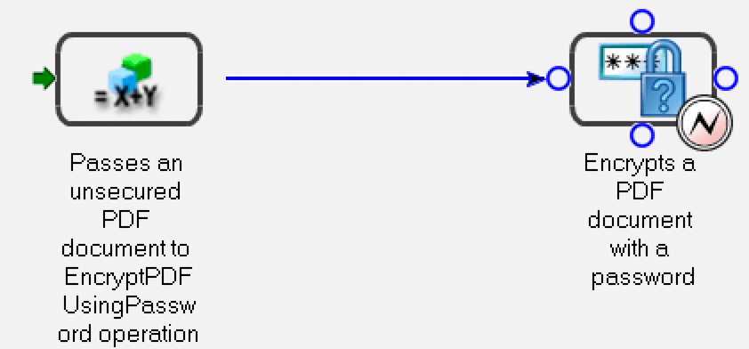

# Hantera slutpunkter programmatiskt {#programmatically-managing-endpoints}

**Om registertjänsten för slutpunkter**

Tjänsten Endpoint Registry ger möjlighet att programmässigt hantera slutpunkter. Du kan till exempel lägga till följande typer av slutpunkter i en tjänst:

* EJB
* SOAP
* Bevakad mapp
* E-post
* (Borttaget för AEM-formulär) Remoting
* Aktivitetshanteraren

   ***Obs **: SOAP, EJB och (Borttaget för AEM-formulär i JEE) Slutpunkter för fjärrstyrning skapas automatiskt för varje aktiverad tjänst. SOAP- och EJB-slutpunkterna aktiverar SOAP och EJB för alla serviceåtgärder.*

   En fjärrslutpunkt gör att Flex-klienter kan anropa åtgärder på den AEM Forms-tjänst som slutpunkten läggs till i. Ett Flex-mål med samma namn som slutpunkten skapas och Flex-klienter kan skapa RemoteObjects som pekar på det här målet för att anropa åtgärder på den relevanta tjänsten.

   Slutpunkterna för e-post, Aktivitetshanteraren och Bevakade mappar visar bara en viss åtgärd för tjänsten. För att lägga till dessa slutpunkter krävs ett andra konfigurationssteg för att välja en metod att anropa, ange konfigurationsparametrar och ange in- och utdataparametermappningar.

   Du kan ordna TaskManager-slutpunkter i grupper som kallas *kategorier*. Dessa kategorier visas sedan för Workspace via TaskManager, där slutanvändarna ser slutpunkterna för TaskManager när de kategoriseras. I Workspace ser slutanvändarna dessa kategorier i navigeringsrutan. Slutpunkterna i varje kategori visas som processkort på sidan Starta processer i Workspace.

   Du kan utföra följande uppgifter med hjälp av tjänsten för slutpunktsregister:

* Lägg till EJB-slutpunkter. (Se [Lägga till EJB-slutpunkter](programmatically-endpoints.md#adding-ejb-endpoints).)
* Lägg till SOAP-slutpunkter. (Se [Lägga till SOAP-slutpunkter](programmatically-endpoints.md#adding-soap-endpoints).)
* Lägg till övervakade mappslutpunkter (Se [Lägga till övervakade mappslutpunkter](programmatically-endpoints.md#adding-watched-folder-endpoints).)
* Lägg till e-postslutpunkter. (Se [Lägga till e-postslutpunkter](programmatically-endpoints.md#adding-email-endpoints).)
* Lägg till fjärrslutpunkter. (Se [Lägga till fjärrslutpunkter](programmatically-endpoints.md#adding-remoting-endpoints).)
* Lägg till TaskManager-slutpunkter (Se [Lägga till TaskManager-slutpunkter](programmatically-endpoints.md#adding-taskmanager-endpoints).)
* Ändra slutpunkter (Se [Ändra slutpunkter](programmatically-endpoints.md#modifying-endpoints).)
* Ta bort slutpunkter (Se [Ta bort slutpunkter](programmatically-endpoints.md#removing-endpoints).)
* Hämta information om slutpunktsanslutning (se [Hämta information](programmatically-endpoints.md#retrieving-endpoint-connector-information)om slutpunktsanslutning.)

## Lägga till EJB-slutpunkter {#adding-ejb-endpoints}

Du kan programmässigt lägga till en EJB-slutpunkt till en tjänst med hjälp av Java-API:t för AEM Forms. Genom att lägga till en EJB-slutpunkt till en tjänst aktiverar du ett klientprogram att anropa tjänsten i EJB-läge. Det innebär att du kan välja EJB-läge när du anger anslutningsegenskaper som krävs för att anropa AEM Forms. (Se [Ange anslutningsegenskaper](/help/forms/developing/invoking-aem-forms-using-java.md#setting-connection-properties).)

>[!NOTE]
>
>Du kan inte lägga till en EJB-slutpunkt med hjälp av webbtjänster.

>[!NOTE]
>
>Vanligtvis läggs en EJB-slutpunkt till i en tjänst som standard, men en EJB-slutpunkt kan läggas till i en process som distribueras programmatiskt eller när en EJB-slutpunkt har tagits bort och måste läggas till igen.

### Sammanfattning av steg {#summary-of-steps}

Utför följande åtgärder om du vill lägga till en EJB-slutpunkt i en tjänst:

1. Inkludera projektfiler.
1. Skapa ett `EndpointRegistry Client` objekt.
1. Ange EJB-slutpunktsattribut.
1. Skapa en EJB-slutpunkt.
1. Aktivera slutpunkten.

**Inkludera projektfiler**

Inkludera nödvändiga filer i utvecklingsprojektet. Följande JAR-filer måste läggas till i projektets klasssökväg:

* adobe-livecycle-client.jar
* adobe-usermanager-client.jar
* adobe-utilities.jar (krävs om AEM Forms distribueras på JBoss Application Server)
* jbossall-client.jar (krävs om AEM Forms distribueras på JBoss Application Server)

Mer information om var dessa JAR-filer finns i [Inkludera Java-biblioteksfiler](/help/forms/developing/invoking-aem-forms-using-java.md#including-aem-forms-java-library-files)för AEM Forms.

**Skapa ett EndpointRegistry-klientobjekt**

Innan du programmässigt kan lägga till en EJB-slutpunkt måste du skapa ett `EndpointRegistryClient` objekt.

**Ange EJB-slutpunktsattribut**

Om du vill skapa en EJB-slutpunkt för en tjänst anger du följande värden:

* **Kopplingsidentifierare**: Anger vilken typ av slutpunkt som ska skapas. Om du vill skapa en EJB-slutpunkt anger du `EJB`.
* **Beskrivning**: Anger slutpunktsbeskrivningen.
* **Namn**: Anger slutpunktens namn.
* **Tjänstidentifierare**: Anger den tjänst som slutpunkten tillhör.
* **Åtgärdsnamn**: Anger namnet på åtgärden som anropas med slutpunkten. När du skapar en EJB-slutpunkt anger du ett jokertecken ( `*`). Om du vill ange en viss åtgärd i stället för att anropa alla tjänståtgärder, anger du åtgärdens namn i stället för att använda jokertecknet ( `*`).

**Skapa en EJB-slutpunkt**

När du har angett EJB-slutpunktsattribut kan du skapa en EJB-slutpunkt för en tjänst.

**Aktivera slutpunkten**

När du har skapat en ny slutpunkt måste du aktivera den. När du har aktiverat slutpunkten kan den användas för att anropa tjänsten. När du har aktiverat slutpunkten kan du visa den i administrationskonsolen.

**Se även**

[Lägga till en EJB-slutpunkt med Java API](programmatically-endpoints.md#adding-an-ejb-endpoint-using-the-java-api)

[Inkludera AEM Forms Java-biblioteksfiler](/help/forms/developing/invoking-aem-forms-using-java.md#including-aem-forms-java-library-files)

[Ange anslutningsegenskaper](/help/forms/developing/invoking-aem-forms-using-java.md#setting-connection-properties)

### Lägga till en EJB-slutpunkt med Java API {#adding-an-ejb-endpoint-using-the-java-api}

Lägg till en EJB-slutpunkt med Java API:

1. Inkludera projektfiler.

   Inkludera JAR-klientfiler, t.ex. adobe-livecycle-client.jar, i Java-projektets klassökväg. (

1. Skapa ett EndpointRegistry-klientobjekt.

   * Skapa ett `ServiceClientFactory` objekt som innehåller anslutningsegenskaper.
   * Skapa ett `EndpointRegistryClient` objekt med hjälp av dess konstruktor och skicka `ServiceClientFactory` objektet.

1. Ange EJB-slutpunktsattribut.

   * Skapa ett `CreateEndpointInfo` objekt med hjälp av dess konstruktor.
   * Ange värdet för anslutaridentifieraren genom att anropa `CreateEndpointInfo` objektets `setConnectorId` metod och skicka strängvärdet `EJB`.
   * Ange beskrivningen av slutpunkten genom att anropa `CreateEndpointInfo` objektets `setDescription` metod och skicka ett strängvärde som beskriver slutpunkten.
   * Ange slutpunktens namn genom att anropa `CreateEndpointInfo` objektets `setName` metod och skicka ett strängvärde som anger namnet.
   * Ange den tjänst som slutpunkten tillhör genom att anropa `CreateEndpointInfo` objektets `setServiceId` metod och skicka ett strängvärde som anger tjänstnamnet.
   * Ange den åtgärd som anropas genom att anropa `CreateEndpointInfo` objektets `setOperationName` metod och skicka ett strängvärde som anger åtgärdens namn. För SOAP- och EJB-slutpunkter anger du ett jokertecken ( `*`), vilket betyder alla åtgärder.

1. Skapa en EJB-slutpunkt.

   Skapa slutpunkten genom att anropa `EndpointRegistryClient` objektets `createEndpoint` metod och skicka `CreateEndpointInfo` objektet. Den här metoden returnerar ett `Endpoint` objekt som representerar den nya EJB-slutpunkten.

1. Aktivera slutpunkten.

   Aktivera slutpunkten genom att anropa `EndpointRegistryClient` objektets enable-metod och skicka det `Endpoint` objekt som returnerades av `createEndpoint` metoden.

**Se även**

[Sammanfattning av steg](programmatically-endpoints.md#summary-of-steps)

[QuickStart: Lägga till en EJB-slutpunkt med Java API](/help/forms/developing/endpoint-registry-java-api-quick.md#quickstart-adding-an-ejb-endpoint-using-the-java-api)

[Inkludera AEM Forms Java-biblioteksfiler](/help/forms/developing/invoking-aem-forms-using-java.md#including-aem-forms-java-library-files)

[Ange anslutningsegenskaper](/help/forms/developing/invoking-aem-forms-using-java.md#setting-connection-properties)

## Lägga till SOAP-slutpunkter {#adding-soap-endpoints}

Du kan programmässigt lägga till en SOAP-slutpunkt till en tjänst med hjälp av Java-API:t för AEM Forms. Genom att lägga till en SOAP-slutpunkt aktiverar du ett klientprogram att anropa tjänsten i SOAP-läge. Det innebär att när du anger de anslutningsegenskaper som krävs för att anropa AEM Forms kan du välja SOAP-läge.

>[!NOTE]
>
>Du kan inte lägga till en SOAP-slutpunkt med hjälp av webbtjänster.

>[!NOTE]
>
>Vanligtvis läggs en SOAP-slutpunkt till i en tjänst som standard, men en SOAP-slutpunkt kan läggas till i en process som distribueras programmatiskt eller när en SOAP-slutpunkt togs bort och måste läggas till igen.

### Sammanfattning av steg {#summary_of_steps-1}

Utför följande åtgärder om du vill lägga till en SOAP-slutpunkt till en tjänst:

1. Inkludera projektfiler.
1. Skapa ett `EndpointRegistryClient` objekt.
1. Ange SOAP-slutpunktsattribut.
1. Skapa en SOAP-slutpunkt.
1. Aktivera slutpunkten.

**Inkludera projektfiler**

Inkludera nödvändiga filer i utvecklingsprojektet. Om du skapar ett klientprogram med Java, inkluderar du de JAR-filer som behövs. Om du använder webbtjänster måste du ta med proxyfilerna.

Följande JAR-filer måste läggas till i projektets klasssökväg:

* adobe-livecycle-client.jar
* adobe-usermanager-client.jar
* adobe-utilities.jar (krävs om AEM Forms distribueras på JBoss Application Server)
* jbossall-client.jar (krävs om AEM Forms distribueras på JBoss Application Server)

Dessa JAR-filer krävs för att skapa en SOAP-slutpunkt. Du behöver emellertid ytterligare JAR-filer om du använder SOAP-slutpunkten för att anropa tjänsten. Mer information om AEM Forms JAR-filer finns i [Inkludera AEM Forms Java-biblioteksfiler](/help/forms/developing/invoking-aem-forms-using-java.md#including-aem-forms-java-library-files).

**Skapa ett EndpointRegistry-klientobjekt**

Om du vill lägga till en SOAP-slutpunkt i en tjänst med programkod måste du skapa ett `EndpointRegistryClient` objekt.

**Ange SOAP-slutpunktsattribut**

Om du vill lägga till en SOAP-slutpunkt till en tjänst anger du följande värden:

* **Kopplingsidentifierarvärde**: Anger vilken typ av slutpunkt som ska skapas. Om du vill skapa en SOAP-slutpunkt anger du `SOAP`.
* **Beskrivning**: Anger slutpunktsbeskrivningen.
* **Namn**: Anger slutpunktens namn.
* **Tjänstidentifierarvärde**: Anger den tjänst som slutpunkten tillhör.
* **Åtgärdsnamn**: Anger namnet på åtgärden som anropas med slutpunkten. När du skapar en SOAP-slutpunkt anger du ett jokertecken ( `*`). Om du vill ange en viss åtgärd i stället för att anropa alla tjänståtgärder, anger du åtgärdens namn i stället för att använda jokertecknet ( `*`).

**Skapa en SOAP-slutpunkt**

När du har angett SOAP-slutpunktsattribut kan du skapa en SOAP-slutpunkt.

**Aktivera slutpunkten**

När du har skapat en ny slutpunkt måste du aktivera den. När slutpunkten är aktiverad kan den användas för att anropa tjänsten. När du har aktiverat slutpunkten kan du visa den i administrationskonsolen.

**Se även**

[Lägga till en SOAP-slutpunkt med Java API](programmatically-endpoints.md#add-a-soap-endpoint-using-the-java-api)

[Inkludera AEM Forms Java-biblioteksfiler](/help/forms/developing/invoking-aem-forms-using-java.md#including-aem-forms-java-library-files)

[Ange anslutningsegenskaper](/help/forms/developing/invoking-aem-forms-using-java.md#setting-connection-properties)

### Lägga till en SOAP-slutpunkt med Java API {#add-a-soap-endpoint-using-the-java-api}

Lägg till en SOAP-slutpunkt till en tjänst med hjälp av Java API:

1. Inkludera projektfiler.

   Inkludera JAR-klientfiler, t.ex. adobe-livecycle-client.jar, i Java-projektets klassökväg.

1. Skapa ett EndpointRegistry-klientobjekt.

   * Skapa ett `ServiceClientFactory` objekt som innehåller anslutningsegenskaper.
   * Skapa ett `EndpointRegistryClient` objekt med hjälp av dess konstruktor och skicka `ServiceClientFactory` objektet.

1. Ange SOAP-slutpunktsattribut.

   * Skapa ett `CreateEndpointInfo` objekt med hjälp av dess konstruktor.
   * Ange värdet för anslutaridentifieraren genom att anropa `CreateEndpointInfo` objektets `setConnectorId` metod och skicka strängvärdet `SOAP`.
   * Ange beskrivningen av slutpunkten genom att anropa `CreateEndpointInfo` objektets `setDescription` metod och skicka ett strängvärde som beskriver slutpunkten.
   * Ange slutpunktens namn genom att anropa `CreateEndpointInfo` objektets `setName` metod och skicka ett strängvärde som anger namnet.
   * Ange den tjänst som slutpunkten tillhör genom att anropa `CreateEndpointInfo` objektets `setServiceId` metod och skicka ett strängvärde som anger tjänstnamnet.
   * Ange åtgärden som anropas genom att `CreateEndpointInfo` objektets `setOperationName` metod anropas och skicka ett strängvärde som anger åtgärdens namn. För SOAP- och EJB-slutpunkter anger du ett jokertecken ( `*`), vilket betyder alla åtgärder.

1. Skapa en SOAP-slutpunkt.

   Skapa slutpunkten genom att anropa `EndpointRegistryClient` objektets `createEndpoint` metod och skicka `CreateEndpointInfo` objektet. Den här metoden returnerar ett `Endpoint` objekt som representerar den nya SOAP-slutpunkten.

1. Aktivera slutpunkten.

   Aktivera slutpunkten genom att anropa `EndpointRegistryClient` objektets enable-metod och skicka det `Endpoint` objekt som returnerades av `createEndpoint` metoden.

**Se även**

[Sammanfattning av steg](programmatically-endpoints.md#summary-of-steps)

[QuickStart: Lägga till en SOAP-slutpunkt med Java API](/help/forms/developing/endpoint-registry-java-api-quick.md#quickstart-adding-a-soap-endpoint-using-the-java-api)

[Inkludera AEM Forms Java-biblioteksfiler](/help/forms/developing/invoking-aem-forms-using-java.md#including-aem-forms-java-library-files)

[Ange anslutningsegenskaper](/help/forms/developing/invoking-aem-forms-using-java.md#setting-connection-properties)

## Lägga till bevakade mappslutpunkter {#adding-watched-folder-endpoints}

Du kan programmässigt lägga till en bevakad mappslutpunkt till en tjänst med hjälp av Java-API:t för AEM Forms. Genom att lägga till en bevakad mappslutpunkt kan användarna placera en fil (t.ex. en PDF-fil) i en mapp. När filen placeras i mappen anropas den konfigurerade tjänsten och filen ändras. När tjänsten har utfört den angivna åtgärden sparas den ändrade filen i en angiven utdatamapp. En bevakad mapp är konfigurerad för att skannas med ett fast intervall eller med ett cron-schema, till exempel varje måndag, onsdag och fredag kl. 12.00.

Om du vill lägga till en övervakad mappslutpunkt i en tjänst programmatiskt bör du överväga följande kortlivade process med namnet *EncryptDocument*. (Se [Förstå AEM-formulärprocesser](/help/forms/developing/aem-forms-processes.md#understanding-aem-forms-processes).)


I den här processen accepteras ett oskyddat PDF-dokument som ett indatavärde och sedan skickas det oskyddade PDF-dokumentet till krypteringstjänstens `EncryptPDFUsingPassword` åtgärd. PDF-dokumentet krypteras med ett lösenord och det lösenordskrypterade PDF-dokumentet är utdatavärdet för den här processen. Namnet på indatavärdet (det oskyddade PDF-dokumentet) är `InDoc` och datatypen är `com.adobe.idp.Document`. Namnet på utdatavärdet (det lösenordskrypterade PDF-dokumentet) är `SecuredDoc` och datatypen är `com.adobe.idp.Document`.

>[!NOTE]
>
>Du kan inte lägga till en bevakad mappslutpunkt med hjälp av webbtjänster.

### Sammanfattning av steg {#summary_of_steps-2}

Utför följande åtgärder om du vill lägga till en bevakad mappslutpunkt i en tjänst:

1. Inkludera projektfiler.
1. Skapa ett `EndpointRegistryClient` objekt.
1. Ange slutpunktsattribut för bevakad mapp.
1. Ange konfigurationsvärden.
1. Definiera indataparametervärden.
1. Definiera ett utdataparametervärde.
1. Skapa en bevakad mappslutpunkt.
1. Aktivera slutpunkten.

**Inkludera projektfiler**

Inkludera nödvändiga filer i utvecklingsprojektet. Om du skapar ett klientprogram med Java, inkluderar du de JAR-filer som behövs. Om du använder webbtjänster måste du ta med proxyfilerna.

Följande JAR-filer måste läggas till i projektets klasssökväg:

* adobe-livecycle-client.jar
* adobe-usermanager-client.jar
* adobe-utilities.jar (krävs om AEM Forms distribueras på JBoss Application Server)
* jbossall-client.jar (krävs om AEM Forms distribueras på JBoss Application Server)

Mer information om var dessa JAR-filer finns i [Inkludera Java-biblioteksfiler](/help/forms/developing/invoking-aem-forms-using-java.md#including-aem-forms-java-library-files)för AEM Forms.

**Skapa ett EndpointRegistry-klientobjekt**

Om du vill lägga till en bevakad mappslutpunkt med programkod måste du skapa ett `EndpointRegistryClient` objekt.

**Ange slutpunktsattribut för bevakad mapp**

Om du vill skapa en bevakad mappslutpunkt för en tjänst anger du följande värden:

* **Kopplingsidentifierare**: Anger den typ av slutpunkt som skapas. Om du vill skapa en bevakad mappslutpunkt anger du `WatchedFolder`.
* **Beskrivning**: Anger beskrivningen av slutpunkten.
* **Namn**: Anger slutpunktens namn.
* **Tjänstidentifierare**: Anger den tjänst som slutpunkten tillhör. Om du till exempel vill lägga till en bevakad mappslutpunkt i processen som introduceras i det här avsnittet (en process blir en tjänst när den aktiveras med Workbench) anger du `EncryptDocument`.
* **Åtgärdsnamn**: Anger namnet på åtgärden som anropas med slutpunkten. När du skapar en bevakad mappslutpunkt för en tjänst som kommer från en process som har skapats i Workbench, används vanligtvis åtgärdens namn `invoke`.

**Ange konfigurationsvärden**

Du måste ange konfigurationsvärden för en bevakad mappslutpunkt när du programmässigt lägger till en bevakad mappslutpunkt till en tjänst. Dessa konfigurationsvärden anges av en administratör om en bevakad mappslutpunkt läggs till med administrationskonsolen.

Följande lista anger konfigurationsvärden som anges när en bevakad mappslutpunkt läggs till i en tjänst via programmering:

* **url**: Anger platsen för bevakad mapp. I en klustrad miljö måste det här värdet peka på en delad nätverksmapp som är tillgänglig från alla datorer i klustret.
* **asynkron**: Identifierar anropstypen som asynkron eller synkron. Övergående och synkrona processer kan bara anropas synkront. Standardvärdet är true. Asynkron rekommenderas.
* **cronExpression**: Används av kvarts för att schemalägga avsökningen av indatakatalogen. Mer information om hur du konfigurerar cron-uttrycket finns i [https://quartz.sourceforge.net/javadoc/org/quartz/CronTrigger.html](https://quartz.sourceforge.net/javadoc/org/quartz/CronTrigger.html).
* **purgeDuration**: Detta är ett obligatoriskt attribut. Filer och mappar i resultatmappen tas bort när de är äldre än det här värdet. Detta värde mäts i dagar. Det här attributet är användbart för att säkerställa att resultatmappen inte blir full. Värdet -1 dagar anger att resultatmappen aldrig ska tas bort. Standardvärdet är -1.
* **repeatInterval**: Intervallet, i sekunder, för inläsning av den bevakade mappen. Om inte strypning är aktiverat ska det här värdet vara längre än tiden för att bearbeta ett genomsnittligt jobb. annars kan systemet bli överbelastat. Standardvärdet är 5.
* **repeatCount**: Antalet gånger som en bevakad mapp genomsöker mappen eller katalogen. Värdet -1 anger obestämd skanning. Standardvärdet är -1.
* **throttleOn**: Begränsar antalet övervakade mappjobb som kan bearbetas vid en given tidpunkt. Det maximala antalet jobb bestäms av batchSize-värdet.
* **userName**: Användarnamnet som används när en måltjänst anropas från den bevakade mappen. Detta värde är obligatoriskt. Standardvärdet är SuperAdmin.
* **domainName**: Användarens domän. Detta värde är obligatoriskt. Standardvärdet är DefaultDom.
* **batchSize**: Antalet filer eller mappar som ska hämtas per skanning. Använd det här värdet för att förhindra överbelastning på systemet. Om du skannar in för många filer samtidigt kan det resultera i en krasch. Standardvärdet är 2.
* **waitTime**: Tiden, i millisekunder, att vänta innan en mapp eller fil skannas efter att den har skapats. Om väntetiden t.ex. är 36 000 000 millisekunder (en timme) och filen skapades för en minut sedan, hämtas den här filen när 59 eller fler minuter har gått. Det här attributet är användbart för att säkerställa att en fil eller mapp kopieras helt till indatamappen. Om du till exempel har en stor fil att bearbeta och det tar tio minuter att hämta filen, ställer du in väntetiden på 10&amp;ast;60 &amp;ast;1000 millisekunder. Den här inställningen förhindrar att den bevakade mappen skannar filen om den inte har väntat i tio minuter. Standardvärdet är 0.
* **excludeFilePattern**: Mönstret som en bevakad mapp använder för att avgöra vilka filer och mappar som ska sökas igenom och hämtas. Filer eller mappar med det här mönstret skannas inte för bearbetning. Den här inställningen är användbar när indata är en mapp som innehåller flera filer. Innehållet i mappen kan kopieras till en mapp som har ett namn som kommer att hämtas av den bevakade mappen. Det här steget förhindrar att den bevakade mappen hämtar en mapp för bearbetning innan mappen kopieras helt till indatamappen. Om värdet excludeFilePattern till exempel är `data*`hämtas inte alla filer och mappar som matchar `data*` . Detta inkluderar filer och mappar med namnen `data1`, `data2`och så vidare. Dessutom kan mönstret kompletteras med jokertecken för att ange filmönster. Den bevakade mappen ändrar det reguljära uttrycket så att det stöder jokerteckenmönster som `*.*` och `*.pdf`. Dessa mönster med jokertecken stöds inte av reguljära uttryck.
* **includeFilePattern**: Det mönster som den bevakade mappen använder för att avgöra vilka mappar och filer som ska sökas igenom och hämtas. Om det här värdet till exempel är `*`hämtas alla filer och mappar som matchar `input*` . Detta inkluderar filer och mappar med namnen `input1`, `input2`och så vidare. Standardvärdet är `*`. Detta värde anger alla filer och mappar. Dessutom kan mönstret kompletteras med jokertecken för att ange filmönster. Den bevakade mappen ändrar det reguljära uttrycket så att det stöder jokerteckenmönster som `*.*` och `*.pdf`. Dessa mönster med jokertecken stöds inte av reguljära uttryck. Detta värde är obligatoriskt.
* **resultFolderName**: Mappen där de sparade resultaten lagras. Platsen kan vara en absolut eller relativ katalogsökväg. Om resultaten inte visas i den här mappen kontrollerar du felmappen. Skrivskyddade filer bearbetas inte och sparas i felmappen. Standardvärdet är `result/%Y/%M/%D/`. Det här är resultatmappen i den bevakade mappen.
* **preserveFolderName**: Den plats där filerna lagras efter att sökningen och hämtningen har slutförts. Platsen kan vara en absolut, relativ eller null-katalogsökväg. Standardvärdet är `preserve/%Y/%M/%D/`.
* **errorFolderName**: Mappen där felfiler sparas. Den här platsen är alltid relativ till den bevakade mappen. Skrivskyddade filer bearbetas inte och sparas i felmappen. Standardvärdet är `failure/%Y/%M/%D/`.
* **preserveOnFailure**: Bevara indatafiler om det inte går att utföra åtgärden på en tjänst. Standardvärdet är true.
* **overwriteDuplicateFilename**: Om värdet är true skrivs filerna i resultatmappen och i den bevarade mappen över. Om värdet är false används filer och mappar med ett numeriskt indexsuffix som namn. Standardvärdet är false.

**Definiera indataparametervärden**

När du skapar en bevakad mappslutpunkt måste du definiera indataparametervärden. Du måste alltså beskriva indatavärdena som skickas till åtgärden som anropas av den bevakade mappen. Ta till exempel en titt på processen som introducerades i det här avsnittet. Den har ett indatavärde med namnet `InDoc` och datatypen är `com.adobe.idp.Document`. När du skapar en bevakad mappslutpunkt för den här processen (när en process har aktiverats blir den en tjänst) måste du definiera värdet för indataparametern.

Ange följande värden om du vill definiera indataparametervärden som krävs för en bevakad mappslutpunkt:

**Namn på** indataparameter: Namnet på indataparametern. Namnet på ett indatavärde anges i Workbench för en process. Om indatavärdet tillhör en tjänståtgärd (en tjänst som inte är en process som har skapats i Workbench) anges indatanamnet i filen component.xml. Namnet på indataparametern för processen som introduceras i det här avsnittet är till exempel `InDoc`.

**Mappningstyp**: Används för att konfigurera de indatavärden som krävs för att anropa tjänståtgärden. Det finns två typer av mappningar:

* `Literal`: Slutpunkten Bevakade mappar använder det värde som anges i fältet när det visas. Alla grundläggande Java-typer stöds. Om ett API till exempel använder indata som String, long, int och Boolean, konverteras strängen till rätt typ och tjänsten anropas.
* `Variable`: Det angivna värdet är ett filmönster som används av den bevakade mappen för att välja indata. Om du t.ex. väljer Variabel som mappningstyp och indatadokumentet måste vara en PDF-fil, kan du ange `*.pdf`som mappningsvärde.

**Mappningsvärde**: Anger värdet för mappningstypen. Om du till exempel väljer en `Variable` mappningstyp kan du ange `*.pdf` som filmönster.

**Datatyp**: Anger datatypen för indatavärdena. Datatypen för indatavärdet för processen som introduceras i det här avsnittet är till exempel `com.adobe.idp.Document`.

**Definiera ett utdataparametervärde**

När du skapar en bevakad mappslutpunkt måste du definiera ett utdataparametervärde. Det innebär att du måste beskriva utdatavärdet som returneras av tjänsten som anropas av slutpunkten för bevakad mapp. Ta till exempel en titt på processen som introducerades i det här avsnittet. Den har ett utdatavärde med namnet `SecuredDoc` och datatypen är `com.adobe.idp.Document`. När du skapar en bevakad mappslutpunkt för den här processen (när en process har aktiverats blir den en tjänst) måste du definiera parametervärdet för utdata.

Om du vill definiera ett utdataparametervärde som krävs för en bevakad mappslutpunkt anger du följande värden:

**Namn på** utdataparameter: Namnet på utdataparametern. Namnet på ett processutdatavärde anges i Workbench. Om utdatavärdet tillhör en tjänståtgärd (en tjänst som inte är en process som har skapats i Workbench) anges utdatanamnet i filen component.xml. Namnet på utdataparametern för processen som introduceras i det här avsnittet är till exempel `SecuredDoc`.

**Mappningstyp**: Används för att konfigurera tjänstens och åtgärdens utdata. Följande alternativ är tillgängliga:

* Om tjänsten returnerar ett enda objekt (ett enstaka dokument) är mönstret `%F.pdf` och källmålet är sourceFilename.pdf. Processen som introducerades i det här avsnittet returnerar till exempel ett enstaka dokument. Det innebär att mappningstypen kan definieras som `%F.pdf` ( använder `%F` det angivna filnamnet). Mönstret `%E` anger tillägget för indatadokumentet.
* Om tjänsten returnerar en lista är mönstret `Result\%F\`och källmålet Result\sourcefilename\source1 (output 1) och Result\sourcefilename\source2 (output 2).
* Om tjänsten returnerar en karta är mönstret `Result\%F\`och källmålet är Result\sourcefilename\file1 and Result\sourcefilename\file2. Om kartan innehåller mer än ett objekt är mönstret `Result\%F.pdf` och källmålet är Result\sourcefilename1.pdf (output 1), Result\sourcefilenam2.pdf (output 2) osv.

**Datatyp**: Anger datatypen för returvärdet. Datatypen för returvärdet för processen som introducerades i det här avsnittet är till exempel `com.adobe.idp.Document`.

**Skapa en bevakad mappslutpunkt**

När du har angett slutpunktens attribut, konfigurationsvärden och definierat in- och utdataparametervärden måste du skapa slutpunkten för den bevakade mappen.

**Aktivera slutpunkten**

När du har skapat en bevakad mappslutpunkt måste du aktivera den. När slutpunkten är aktiverad kan den användas för att anropa tjänsten. När du har aktiverat slutpunkten kan du visa den i administrationskonsolen.

**Se även**

[Lägga till en bevakad mappslutpunkt med Java API](programmatically-endpoints.md#add-a-watched-folder-endpoint-using-the-java-api)

[Inkludera AEM Forms Java-biblioteksfiler](/help/forms/developing/invoking-aem-forms-using-java.md#including-aem-forms-java-library-files)

[Ange anslutningsegenskaper](/help/forms/developing/invoking-aem-forms-using-java.md#setting-connection-properties)

### Lägga till en bevakad mappslutpunkt med Java API {#add-a-watched-folder-endpoint-using-the-java-api}

Lägg till en bevakad mappslutpunkt med AEM Forms Java API:

1. Inkludera projektfiler.

   Inkludera JAR-klientfiler, t.ex. adobe-livecycle-client.jar, i Java-projektets klassökväg.

1. Skapa ett EndpointRegistry-klientobjekt.

   * Skapa ett `ServiceClientFactory` objekt som innehåller anslutningsegenskaper.
   * Skapa ett `EndpointRegistryClient` objekt med hjälp av dess konstruktor och skicka `ServiceClientFactory` objektet.

1. Ange slutpunktsattribut för bevakad mapp.

   * Skapa ett `CreateEndpointInfo` objekt med hjälp av dess konstruktor.
   * Ange värdet för anslutaridentifieraren genom att anropa `CreateEndpointInfo` objektets `setConnectorId` metod och skicka strängvärdet `WatchedFolder`.
   * Ange beskrivningen av slutpunkten genom att anropa `CreateEndpointInfo` objektets `setDescription` metod och skicka ett strängvärde som beskriver slutpunkten.
   * Ange slutpunktens namn genom att anropa `CreateEndpointInfo` objektets `setName` metod och skicka ett strängvärde som anger namnet.
   * Ange den tjänst som slutpunkten tillhör genom att anropa `CreateEndpointInfo` objektets `setServiceId` metod och skicka ett strängvärde som anger tjänstnamnet.
   * Ange åtgärden som anropas genom att `CreateEndpointInfo` objektets `setOperationName` metod anropas och skicka ett strängvärde som anger åtgärdens namn. När du skapar en bevakad mappslutpunkt för en tjänst som kommer från en process som skapats i Workbench anropas vanligtvis åtgärdens namn.

1. Ange konfigurationsvärden.

   För varje konfigurationsvärde som ska anges för slutpunkten för bevakad mapp måste du anropa `CreateEndpointInfo` objektets `setConfigParameterAsText` metod. Om du till exempel vill ange `url` konfigurationsvärdet anropar du `CreateEndpointInfo` objektets `setConfigParameterAsText` -metod och skickar följande strängvärden:

   * Ett strängvärde som anger namnet på konfigurationsvärdet. När du anger `url` konfigurationsvärdet anger du `url`.
   * Ett strängvärde som anger värdet för konfigurationsvärdet. När du anger `url` konfigurationsvärdet anger du platsen för bevakad mapp.
   >[!NOTE]
   >
   >Om du vill se alla konfigurationsvärden som angetts för EncryptDocument-tjänsten läser du Java-kodexemplet som finns på [QuickStart: Lägga till en bevakad mappslutpunkt med Java API](/help/forms/developing/endpoint-registry-java-api-quick.md#quickstart-adding-a-watched-folder-endpoint-using-the-java-api).

1. Definiera indataparametervärden.

   Definiera ett indataparametervärde genom att anropa `CreateEndpointInfo` objektets `setInputParameterMapping` metod och skicka följande värden:

   * Ett strängvärde som anger namnet på indataparametern. Namnet på indataparametern för EncryptDocument-tjänsten är till exempel `InDoc`.
   * Ett strängvärde som anger datatypen för indataparametern. Datatypen för parametern `InDoc` input är till exempel `com.adobe.idp.Document`.
   * Ett strängvärde som anger mappningstypen. Du kan till exempel ange `variable`.
   * Ett strängvärde som anger mappningstypsvärdet. Du kan till exempel ange &amp;ast;.pdf som filmönster.
   >[!NOTE]
   >
   >Anropa metoden `setInputParameterMapping` för varje indataparametervärde som ska definieras. Eftersom EncryptDocument-processen bara har en indataparameter, måste du anropa den här metoden en gång.

1. Definiera ett utdataparametervärde.

   Definiera ett utdataparametervärde genom att anropa `CreateEndpointInfo` objektets `setOutputParameterMapping` metod och skicka följande värden:

   * Ett strängvärde som anger namnet på utdataparametern. Namnet på utdataparametern för EncryptDocument-tjänsten är till exempel `SecuredDoc`.
   * Ett strängvärde som anger datatypen för utdataparametern. Datatypen för parametern `SecuredDoc` output är till exempel `com.adobe.idp.Document`.
   * Ett strängvärde som anger mappningstypen. Du kan till exempel ange `%F.pdf`.

1. Skapa en bevakad mappslutpunkt.

   Skapa slutpunkten genom att anropa `EndpointRegistryClient` objektets `createEndpoint` metod och skicka `CreateEndpointInfo` objektet. Den här metoden returnerar ett `Endpoint` objekt som representerar den bevakade mappens slutpunkt.

1. Aktivera slutpunkten.

   Aktivera slutpunkten genom att anropa `EndpointRegistryClient` objektets `enable` metod och skicka det `Endpoint` objekt som returnerades av `createEndpoint` metoden.

**Se även**

[Sammanfattning av steg](programmatically-endpoints.md#summary-of-steps)

[QuickStart: Lägga till en bevakad mappslutpunkt med Java API](/help/forms/developing/endpoint-registry-java-api-quick.md#quickstart-adding-a-watched-folder-endpoint-using-the-java-api)

[Inkludera AEM Forms Java-biblioteksfiler](/help/forms/developing/invoking-aem-forms-using-java.md#including-aem-forms-java-library-files)

[Ange anslutningsegenskaper](/help/forms/developing/invoking-aem-forms-using-java.md#setting-connection-properties)

### Konstanta filer för mappkonfigurationsvärden som bevakas {#watched-folder-configuration-values-constant-file}

Snabbstart [: När du lägger till en bevakad mappslutpunkt med Java API](/help/forms/developing/endpoint-registry-java-api-quick.md#quickstart-adding-a-watched-folder-endpoint-using-the-java-api) används en konstant fil som måste ingå i Java-projektet för att snabbstarten ska kunna kompileras. Den här konstanta filen representerar konfigurationsvärden som måste anges när du lägger till en bevakad mappslutpunkt. Följande Java-kod representerar den konstanta filen.

```as3
 /**
     * This class contains constants that can be used when setting Watched Folder
     * configuration values
     */

 public final class WatchedFolderEndpointConfigConstants {

         public static final String PROPERTY_FILEPROVIDER_URL = "url";
         public static final String PROPERTY_PROPERTY_ASYNCHRONOUS = "asynchronous";
         public static final String PROPERTY_CRON_EXPRESSION = "cronExpression";
         public static final String PROPERTY_PURGE_DURATION = "purgeDuration";
         public static final String PROPERTY_REPEAT_INTERVAL = "repeatInterval";
         public static final String PROPERTY_REPEAT_COUNT = "repeatCount";
         public static final String PROPERTY_THROTTLE = "throttleOn";
         public static final String PROPERTY_USERNAMER = "userName";
         public static final String PROPERTY_DOMAINNAME = "domainName";
         public static final String PROPERTY_FILEPROVIDER_BATCH_SIZE = "batchSize";
         public static final String PROPERTY_FILEPROVIDER_WAIT_TIME = "waitTime";
         public static final String PROPERTY_EXCLUDE_FILE_PATTERN = "excludeFilePattern";
         public static final String PROPERTY_INCLUDE_FILE_PATTERN = "excludeFilePattern";
         public static final String PROPERTY_FILEPROVIDER_RESULT_FOLDER_NAME =  "resultFolderName";
         public static final String PROPERTY_FILEPROVIDER_PRESERVE_FOLDER_NAME = "preserveFolderName";
         public static final String PROPERTY_FILEPROVIDER_FAILURE_FOLDER_NAME = "failureFolderName";
         public static final String PROPERTY_FILEPROVIDER_PRESERVE_ON_FAILURE = "preserveOnFailure";
         public static final String PROPERTY_FILEPROVIDER_OVERWRITE_DUPLICATE_FILENAME = "overwriteDuplicateFilename";
        }
```

## Lägga till e-postslutpunkter {#adding-email-endpoints}

Du kan programmässigt lägga till en e-postslutpunkt till en tjänst med hjälp av Java-API:t för AEM Forms. Genom att lägga till en e-postslutpunkt kan du göra det möjligt för användare att skicka ett e-postmeddelande med en eller flera bifogade filer till ett angivet e-postkonto. Sedan anropas åtgärden för konfigurationstjänsten och filerna ändras. När tjänsten har utfört den angivna åtgärden skickas ett e-postmeddelande till avsändaren med de ändrade filerna som bifogade filer.

Om du vill lägga till en e-postslutpunkt i en tjänst programmatiskt bör du överväga följande kortlivade process med namnet *MyApplication\EncryptDocument*. Mer information om kortvariga processer finns i [Förstå AEM-formulärprocesser](/help/forms/developing/aem-forms-processes.md#understanding-aem-forms-processes).


I den här processen accepteras ett oskyddat PDF-dokument som ett indatavärde och sedan skickas det oskyddade PDF-dokumentet till krypteringstjänstens `EncryptPDFUsingPassword` åtgärd. Den här processen krypterar PDF-dokumentet med ett lösenord och returnerar det lösenordskrypterade PDF-dokumentet som utdatavärde. Namnet på indatavärdet (det oskyddade PDF-dokumentet) är `InDoc` och datatypen är `com.adobe.idp.Document`. Namnet på utdatavärdet (det lösenordskrypterade PDF-dokumentet) är `SecuredDoc` och datatypen är `com.adobe.idp.Document`.

>[!NOTE]
>
>Du kan inte lägga till en e-postslutpunkt med hjälp av webbtjänster.

### Sammanfattning av steg {#summary_of_steps-3}

Gör så här om du vill lägga till en e-postslutpunkt till en tjänst:

1. Inkludera projektfiler.
1. Skapa ett `EndpointRegistryClient` objekt.
1. Ange slutpunktsattribut för e-post.
1. Ange konfigurationsvärden.
1. Definiera indataparametervärden.
1. Definiera ett utdataparametervärde.
1. Skapa e-postslutpunkten.
1. Aktivera slutpunkten.

**Inkludera projektfiler**

Inkludera nödvändiga filer i utvecklingsprojektet. Om du skapar ett klientprogram med Java, inkluderar du de JAR-filer som behövs. Om du använder webbtjänster måste du ta med proxyfilerna.

Följande JAR-filer måste läggas till i projektets klasssökväg:

* adobe-livecycle-client.jar
* adobe-usermanager-client.jar
* adobe-utilities.jar (krävs om AEM Forms distribueras på JBoss Application Server)
* jbossall-client.jar (krävs om AEM Forms distribueras på JBoss Application Server)

Mer information om var dessa JAR-filer finns i [Inkludera Java-biblioteksfiler](/help/forms/developing/invoking-aem-forms-using-java.md#including-aem-forms-java-library-files)för AEM Forms.

**Skapa ett EndpointRegistry-klientobjekt**

Innan du programmässigt kan lägga till en e-postslutpunkt måste du skapa ett `EndpointRegistryClient` objekt.

**Ange slutpunktsattribut för e-post**

Om du vill skapa en e-postslutpunkt för en tjänst anger du följande värden:

* **Kopplingsidentifierarvärde**: Anger den typ av slutpunkt som skapas. Om du vill skapa en e-postslutpunkt anger du `Email`.
* **Beskrivning**: Anger en beskrivning för slutpunkten.
* **Namn**: Anger slutpunktens namn.
* **Tjänstidentifierarvärde**: Anger den tjänst som slutpunkten tillhör. Om du till exempel vill lägga till en e-postslutpunkt i processen som introduceras i det här avsnittet (en process blir en tjänst när den aktiveras med Workbench) anger du `EncryptDocument`.
* **Åtgärdsnamn**: Anger namnet på åtgärden som anropas med slutpunkten. När du skapar en e-postslutpunkt för en tjänst som kommer från en process som har skapats i Workbench, är namnet på åtgärden vanligtvis `invoke`.

**Ange konfigurationsvärden**

Du måste ange konfigurationsvärden för en e-postslutpunkt när du programmässigt lägger till en e-postslutpunkt till en tjänst. Dessa konfigurationsvärden anges av en administratör om en e-postslutpunkt läggs till med administrationskonsolen.

>[!NOTE]
>
>Det e-postkonto som övervakas är ett specialkonto som endast används för e-postslutpunkten. Det här kontot är inte en vanlig användares e-postkonto. En vanlig användares e-postkonto får inte konfigureras som det konto som e-postprovidern använder eftersom e-postprovidern tar bort e-postmeddelanden från inkorgen när den är klar med meddelandena.

Följande konfigurationsvärden anges när en e-postslutpunkt läggs till i en tjänst via programmering:

* **cronExpression**: Ett cron-uttryck om e-postmeddelandet måste schemaläggas med ett cron-uttryck.
* **repeatCount**: Antal gånger som e-postslutpunkten skannar mappen eller katalogen. Värdet -1 anger obestämd skanning. Standardvärdet är -1.
* **repeatInterval**: Skanningsfrekvensen i sekunder som mottagaren använder för att kontrollera inkommande e-post. Standardvärdet är 10.
* **startDelay**: Den tid det tar att vänta på genomsökningen efter att schemaläggaren har startats. Standardtiden är 0.
* **batchSize**: Antalet e-postmeddelanden som mottagaren bearbetar per sökning för optimala prestanda. Värdet -1 anger alla e-postmeddelanden. Standardvärdet är 2.
* **userName**: Användarnamnet som används när en måltjänst anropas från e-post. Standardvärdet är `SuperAdmin`.
* **domainName**: Ett obligatoriskt konfigurationsvärde. Standardvärdet är `DefaultDom`.
* **domainPattern**: Anger domänmönster för inkommande e-post som accepteras av providern. Om `adobe.com` det används kommer till exempel endast e-post från adobe.com att bearbetas och e-post från andra domäner ignoreras.
* **filePattern**: Anger mönster för inkommande bifogade filer som accepteras av providern. Detta inkluderar filer som har specifika filnamnstillägg (&amp;ast;.dat, &amp;ast;.xml), filer som har specifika namn (data) och filer som har sammansatta uttryck i namnet och filnamnstillägget (&amp;ast;.[d][aA]&#39;port&#39;). Standardvärdet är `*`.
* **receiveSuccessfulJob**: En e-postadress dit meddelanden skickas för att ange slutförda jobb. Som standard skickas alltid ett meddelande om att jobbet lyckades till avsändaren. Om du skriver `sender`skickas e-postresultaten till avsändaren. Stöd för upp till 100 mottagare. Ange ytterligare mottagare med e-postadresser, där var och en avgränsas med kommatecken. Om du vill inaktivera det här alternativet lämnar du det här värdet tomt. I vissa fall kanske du vill utlösa en process och inte skicka ett e-postmeddelande om resultatet. Standardvärdet är `sender`.
* **receiveFailedJob**: En e-postadress dit meddelanden skickas för att ange misslyckade jobb. Som standard skickas alltid ett meddelande om misslyckat jobb till avsändaren. Om du skriver `sender`skickas e-postresultaten till avsändaren. Stöd för upp till 100 mottagare. Ange ytterligare mottagare med e-postadresser, där var och en avgränsas med kommatecken. Om du vill inaktivera det här alternativet lämnar du det här värdet tomt. Standardvärdet är `sender`.
* **inboxHost**: Inkorgens värdnamn eller IP-adress som e-postprovidern ska skanna.
* **inboxPort**: Den port som e-postservern använder. Standardvärdet för POP3 är 110 och standardvärdet för IMAP är 143. Om SSL är aktiverat är standardvärdet för POP3 995 och standardvärdet för IMAP är 993.
* **inboxProtocol**: E-postprotokollet för e-postslutpunkten som ska användas för att skanna inkorgen. Alternativen är `IMAP` eller `POP3`. Inkorgens värdserver för e-post måste ha stöd för dessa protokoll.
* **inboxTimeOut**: Tidsgräns i sekunder för att e-postleverantören ska vänta på inkorgssvar. Standardvärdet är 60.
* **inboxUser**: Användarnamnet som krävs för att logga in på e-postkontot. Beroende på e-postservern och konfigurationen kan det här endast vara användarnamnsdelen i e-postmeddelandet eller den fullständiga e-postadressen.
* **inboxPassword**: Lösenordet för inkorgsanvändaren.
* **inboxSSLEnabled**: Ange det här värdet för att tvinga e-postleverantören att använda SSL när meddelanden om resultat eller fel skickas. Kontrollera att IMAP- eller POP3-värden har stöd för SSL.
* **smtpHost**: Värdnamnet för den e-postserver som e-postleverantören skickar resultat och felmeddelanden till.
* **smtpPort**: Standardvärdet för SMTP-porten är 25.
* **smtpUser**: Användarkontot som e-postleverantören ska använda när den skickar e-postmeddelanden om resultat och fel.
* **smtpPassword**: Lösenordet för SMTP-kontot. Vissa e-postservrar kräver inget SMTP-lösenord.
* **charSet**: Den teckenuppsättning som används av e-postleverantören. Standardvärdet är `UTF-8`.
* **smtpSSLEnabled**: Ange det här värdet för att tvinga e-postleverantören att använda SSL när meddelanden om resultat eller fel skickas. Kontrollera att SMTP-värden har stöd för SSL.
* **failedJobFolder**: Anger en katalog där resultat ska lagras när SMTP-e-postservern inte är i drift.
* **asynkron**: När det är synkront bearbetas alla indatadokument och ett enda svar returneras. När inställningen är asynkron skickas ett svar för varje indatadokument som bearbetas. En e-postslutpunkt skapas till exempel för den process som introduceras i det här avsnittet, och ett e-postmeddelande skickas till slutpunktens inkorg som innehåller flera oskyddade PDF-dokument. När alla PDF-dokument har krypterats med ett lösenord, och om slutpunkten har konfigurerats som synkron, skickas ett enda e-postmeddelande med alla skyddade PDF-dokument bifogade. Om slutpunkten är konfigurerad som asynkron skickas ett separat e-postmeddelande för varje skyddat PDF-dokument. Varje e-postmeddelande innehåller ett enda PDF-dokument som en bifogad fil. Standardvärdet är asynkront.

**Definiera indataparametervärden**

När du skapar en e-postslutpunkt måste du definiera indataparametervärden. Det innebär att du måste beskriva indatavärdena som skickas till åtgärden som anropas av e-postslutpunkten. Ta till exempel en titt på processen som introducerades i det här avsnittet. Den har ett indatavärde med namnet `InDoc` och datatypen är `com.adobe.idp.Document`. När du skapar en e-postslutpunkt för den här processen (när en process har aktiverats blir den en tjänst) måste du definiera indataparametervärdet.

Om du vill definiera indataparametervärden som krävs för en e-postslutpunkt anger du följande värden:

**Namn på** indataparameter: Namnet på indataparametern. Namnet på ett indatavärde anges i Workbench för en process. Om indatavärdet tillhör en tjänståtgärd (en Forms-tjänst som inte är en process som har skapats i Workbench) anges indatanamnet i filen component.xml. Namnet på indataparametern för processen som introduceras i det här avsnittet är till exempel `InDoc`.

**Mappningstyp**: Används för att konfigurera de indatavärden som krävs för att anropa tjänståtgärden. Två typer av mappningar är:

* `Literal`: Slutpunkten för e-post använder det värde som anges i fältet när det visas. Alla grundläggande Java-typer stöds. Om ett API till exempel använder indata som String, long, int och Boolean, konverteras strängen till rätt typ och tjänsten anropas.
* `Variable`: Det angivna värdet är ett filmönster som e-postslutpunkten använder för att välja indata. Om du t.ex. väljer Variabel som mappningstyp och indatadokumentet måste vara en PDF-fil, kan du ange `*.pdf` som mappningsvärde.

**Mappningsvärde**: Anger värdet för mappningstypen. Om du till exempel väljer en typ av variabelmappning kan du ange `*.pdf` som filmönster.

**Datatyp**: Anger datatypen för indatavärdena. Datatypen för indatavärdet för processen som introduceras i det här avsnittet är till exempel com.adobe.idp.Document.

**Definiera ett utdataparametervärde**

När du skapar en e-postslutpunkt måste du definiera ett utdataparametervärde. Det innebär att du måste beskriva det utdatavärde som returneras av tjänsten som anropas av e-postslutpunkten. Ta till exempel en titt på processen som introducerades i det här avsnittet. Den har ett utdatavärde med namnet `SecuredDoc` och datatypen är `com.adobe.idp.Document`. När du skapar en e-postslutpunkt för den här processen (när en process har aktiverats blir den en tjänst) måste du definiera parametervärdet för utdata.

Om du vill definiera ett utdataparametervärde som krävs för en e-postslutpunkt anger du följande värden:

**Namn på** utdataparameter: Namnet på utdataparametern. Namnet på ett processutdatavärde anges i Workbench. Om utdatavärdet tillhör en tjänståtgärd (en tjänst som inte är en process som har skapats i Workbench) anges utdatanamnet i filen component.xml. Namnet på utdataparametern för processen som introduceras i det här avsnittet är till exempel `SecuredDoc`.

**Mappningstyp**: Används för att konfigurera tjänstens och åtgärdens utdata. Följande alternativ är tillgängliga:

* Om tjänsten returnerar ett enda objekt (ett enstaka dokument) är mönstret `%F.pdf` och källmålet är sourceFilename.pdf. Processen som introducerades i det här avsnittet returnerar till exempel ett enstaka dokument. Det innebär att mappningstypen kan definieras som `%F.pdf` ( använder `%F` det angivna filnamnet). Mönstret `%E` anger tillägget för indatadokumentet.
* Om tjänsten returnerar en lista är mönstret `Result\%F\`och källmålet Result\sourcefilename\source1 (output 1) och Result\sourcefilename\source2 (output 2).
* Om tjänsten returnerar en karta är mönstret `Result\%F\`och källmålet är Result\sourcefilename\file1 and Result\sourcefilename\file2. Om kartan innehåller mer än ett objekt är mönstret `Result\%F.pdf` och källmålet är Result\sourcefilename1.pdf (output 1), Result\sourcefilenam2.pdf (output 2) osv.

**Datatyp**: Anger datatypen för returvärdet. Datatypen för returvärdet för processen som introducerades i det här avsnittet är till exempel `com.adobe.idp.Document`.

**Skapa e-postslutpunkten**

När du har angett attribut och konfigurationsvärden för e-postslutpunkten och angett in- och utdataparametervärden måste du skapa e-postslutpunkten.

**Aktivera slutpunkten**

När du har skapat en e-postslutpunkt måste du aktivera den. När slutpunkten är aktiverad kan den användas för att anropa tjänsten. När du har aktiverat slutpunkten kan du visa den i administrationskonsolen.

**Se även**

[Lägga till en e-postslutpunkt med Java API](programmatically-endpoints.md#add-an-email-endpoint-using-the-java-api)

[Inkludera AEM Forms Java-biblioteksfiler](/help/forms/developing/invoking-aem-forms-using-java.md#including-aem-forms-java-library-files)

[Ange anslutningsegenskaper](/help/forms/developing/invoking-aem-forms-using-java.md#setting-connection-properties)

### Lägga till en e-postslutpunkt med Java API {#add-an-email-endpoint-using-the-java-api}

Lägg till en e-postslutpunkt med Java API:

1. Inkludera projektfiler.

   Inkludera JAR-klientfiler, t.ex. adobe-livecycle-client.jar, i Java-projektets klassökväg.

1. Skapa ett EndpointRegistry-klientobjekt.

   * Skapa ett `ServiceClientFactory` objekt som innehåller anslutningsegenskaper.
   * Skapa ett `EndpointRegistryClient` objekt med hjälp av dess konstruktor och skicka `ServiceClientFactory` objektet.

1. Ange slutpunktsattribut för e-post.

   * Skapa ett `CreateEndpointInfo` objekt med hjälp av dess konstruktor.
   * Ange värdet för anslutaridentifieraren genom att anropa `CreateEndpointInfo` objektets `setConnectorId` metod och skicka strängvärdet `Email`.
   * Ange beskrivningen av slutpunkten genom att anropa `CreateEndpointInfo` objektets `setDescription` metod och skicka ett strängvärde som beskriver slutpunkten.
   * Ange slutpunktens namn genom att anropa `CreateEndpointInfo` objektets `setName` metod och skicka ett strängvärde som anger namnet.
   * Ange den tjänst som slutpunkten tillhör genom att anropa `CreateEndpointInfo` objektets `setServiceId` metod och skicka ett strängvärde som anger tjänstnamnet.
   * Ange åtgärden som anropas genom att `CreateEndpointInfo` objektets `setOperationName` metod anropas och skicka ett strängvärde som anger åtgärdens namn. När du skapar en e-postslutpunkt för en tjänst som kommer från en process som skapats i Workbench anropas vanligtvis åtgärdens namn.

1. Ange konfigurationsvärden.

   För varje konfigurationsvärde som ska anges för e-postslutpunkten måste du anropa `CreateEndpointInfo` objektets `setConfigParameterAsText` metod. Om du till exempel vill ange `smtpHost` konfigurationsvärdet anropar du `CreateEndpointInfo` objektets `setConfigParameterAsText` -metod och skickar följande värden:

   * Ett strängvärde som anger namnet på konfigurationsvärdet. När du anger `smtpHost` konfigurationsvärdet anger du `smtpHost`.
   * Ett strängvärde som anger värdet för konfigurationsvärdet. När du ställer in `smtpHost` konfigurationsvärdet anger du ett strängvärde som anger namnet på SMTP-servern.
   >[!NOTE]
   >
   >Om du vill se alla konfigurationsvärden som angetts för EncryptDocument-tjänsten som introducerades i det här avsnittet, ska du läsa Java-kodexemplet som finns på [QuickStart: Lägga till en e-postslutpunkt med Java API](/help/forms/developing/endpoint-registry-java-api-quick.md#quickstart-adding-an-email-endpoint-using-the-java-api).

1. Definiera indataparametervärden.

   Definiera ett indataparametervärde genom att anropa `CreateEndpointInfo` objektets `setInputParameterMapping` metod och skicka följande värden:

   * Ett strängvärde som anger namnet på indataparametern. Namnet på indataparametern för EncryptDocument-tjänsten är till exempel `InDoc`.
   * Ett strängvärde som anger datatypen för indataparametern. Datatypen för parametern `InDoc` input är till exempel `com.adobe.idp.Document`.
   * Ett strängvärde som anger mappningstypen. Du kan till exempel ange `variable`.
   * Ett strängvärde som anger mappningstypsvärdet. Du kan till exempel ange &amp;ast;.pdf som filmönster.
   >[!NOTE]
   >
   >Anropa metoden `setInputParameterMapping` för varje indataparametervärde som ska definieras. Eftersom EncryptDocument-processen bara har en indataparameter, måste du anropa den här metoden en gång.

1. Definiera ett utdataparametervärde.

   Definiera ett utdataparametervärde genom att anropa `CreateEndpointInfo` objektets `setOutputParameterMapping` metod och skicka följande värden:

   * Ett strängvärde som anger namnet på utdataparametern. Namnet på utdataparametern för EncryptDocument-tjänsten är till exempel `SecuredDoc`.
   * Ett strängvärde som anger datatypen för utdataparametern. Datatypen för parametern `SecuredDoc` output är till exempel `com.adobe.idp.Document`.
   * Ett strängvärde som anger mappningstypen. Du kan till exempel ange `%F.pdf`.

1. Skapa e-postslutpunkten.

   Skapa slutpunkten genom att anropa `EndpointRegistryClient` objektets `createEndpoint` metod och skicka `CreateEndpointInfo` objektet. Den här metoden returnerar ett `Endpoint` objekt som representerar e-postslutpunkten.

1. Aktivera slutpunkten.

   Aktivera slutpunkten genom att anropa `EndpointRegistryClient` objektets `enable` metod och skicka det `Endpoint` objekt som returnerades av `createEndpoint` metoden.

**Se även**

[Sammanfattning av steg](programmatically-endpoints.md#summary-of-steps)

[QuickStart: Lägga till en bevakad mappslutpunkt med Java API](/help/forms/developing/endpoint-registry-java-api-quick.md#quickstart-adding-a-watched-folder-endpoint-using-the-java-api)

[Inkludera AEM Forms Java-biblioteksfiler](/help/forms/developing/invoking-aem-forms-using-java.md#including-aem-forms-java-library-files)

[Ange anslutningsegenskaper](/help/forms/developing/invoking-aem-forms-using-java.md#setting-connection-properties)

### Konstantfil för e-postkonfigurationsvärden {#email-configuration-values-constant-file}

Snabbstart [: När du lägger till en e-postslutpunkt med Java API](/help/forms/developing/endpoint-registry-java-api-quick.md#quickstart-adding-an-email-endpoint-using-the-java-api) används en konstant fil som måste ingå i Java-projektet för att snabbstarten ska kunna kompileras. Den här konstanta filen representerar konfigurationsvärden som måste anges när du lägger till en e-postslutpunkt. Följande Java-kod representerar den konstanta filen.

```as3
 /**
     * This class contains constants that can be used when setting email endpoint
     * configuration values
     */
 public class EmailEndpointConfigConstants {

     public static final String PROPERTY_EMAILPROVIDER_CRON_EXPRESSION = "cronExpression";
     public static final String PROPERTY_EMAILPROVIDER_REPREAT_COUNT = "repeatCount";
     public static final String PROPERTY_EMAILPROVIDER_REPREAT_INTERVAL = "repeatInterval";
     public static final String PROPERTY_EMAILPROVIDER_START_DELAY = "startDelay";
     public static final String PROPERTY_EMAILPROVIDER_BATCH_SIZE = "batchSize";
     public static final String PROPERTY_EMAILPROVIDER_USERNAME = "userName";
     public static final String PROPERTY_EMAILPROVIDER_DOMAINNAME = "domainName";
     public static final String PROPERTY_EMAILPROVIDER_DOMAINPATTERN = "domainPattern";
     public static final String PROPERTY_EMAILPROVIDER_FILEPATTERN = "filePattern";
     public static final String PROPERTY_EMAILPROVIDER_RECIPIENT_SUCCESSFUL_JOB = "recipientSuccessfulJob";
     public static final String PROPERTY_EMAILPROVIDER_RECIPIENT_FAILED_JOB = "recipientFailedJob";
     public static final String PROPERTY_EMAILPROVIDER_INBOX_HOST = "inboxHost";
     public static final String PROPERTY_EMAILPROVIDER_INBOX_PORT = "inboxPort";
     public static final String PROPERTY_EMAILPROVIDER_PROTOCOL = "inboxProtocol";
     public static final String PROPERTY_EMAILPROVIDER_INBOX_TIMEOUT = "inboxTimeOut";
     public static final String PROPERTY_EMAILPROVIDER_INBOX_USER = "inboxUser";
     public static final String PROPERTY_EMAILPROVIDER_INBOX_PASSWORD = "inboxPassword";
     public static final String PROPERTY_EMAILPROVIDER_INBOX_SSL = "inboxSSLEnabled";
     public static final String PROPERTY_EMAILPROVIDER_SMTP_HOST = "smtpHost";
     public static final String PROPERTY_EMAILPROVIDER_SMTP_PORT = "smtpPort";
     public static final String PROPERTY_EMAILPROVIDER_SMTP_USER = "smtpUser";
     public static final String PROPERTY_EMAILPROVIDER_SMTP_PASSWORD = "smtpPassword";
     public static final String PROPERTY_EMAILPROVIDER_CHARSET = "charSet";
     public static final String PROPERTY_EMAILPROVIDER_SMTP_SSL = "smtpSSLEnabled";
     public static final String PROPERTY_EMAILPROVIDER_FAILED_FOLDER = "failedJobFolder";
     public static final String PROPERTY_EMAILPROVIDER_ASYNCHRONOUS = "asynchronous";
 }
```

## Lägga till fjärrslutpunkter {#adding-remoting-endpoints}

>[!NOTE]
>
>LiveCycle Remoting-API:er har tagits bort för AEM-formulär på JEE.

Du kan programmatiskt lägga till en fjärrslutpunkt till en tjänst med hjälp av Java-API:t för AEM Forms. Genom att lägga till en fjärrslutpunkt aktiverar du ett Flex-program att anropa tjänsten med hjälp av fjärrkommunikation. (Se [Anropa AEM-formulär med (borttaget för AEM-formulär) AEM Forms Remoting](/help/forms/developing/invoking-aem-forms-using-remoting.md#invoking-aem-forms-using-remoting).)

Om du vill lägga till en fjärrslutpunkt till en tjänst programmatiskt bör du överväga följande kortlivade process med namnet *EncryptDocument*.



I den här processen accepteras ett oskyddat PDF-dokument som ett indatavärde och sedan skickas det oskyddade PDF-dokumentet till krypteringstjänstens `EncryptPDFUsingPassword` åtgärd. PDF-dokumentet krypteras med ett lösenord och det lösenordskrypterade PDF-dokumentet är utdatavärdet för den här processen. Namnet på indatavärdet (det oskyddade PDF-dokumentet) är `InDoc` och datatypen är `com.adobe.idp.Document`. Namnet på utdatavärdet (det lösenordskrypterade PDF-dokumentet) är `SecuredDoc` och datatypen är `com.adobe.idp.Document`.

För att visa hur du lägger till en fjärrslutpunkt till en tjänst lägger det här avsnittet till en fjärrslutpunkt till en tjänst med namnet EncryptDocument.

>[!NOTE]
>
>Du kan inte lägga till en fjärrslutpunkt med hjälp av webbtjänster.

### Sammanfattning av steg {#summary_of_steps-4}

Så här tar du bort en slutpunkt från en tjänst:

1. Inkludera projektfiler.
1. Skapa ett `EndpointRegistryClient` objekt.
1. Ange slutpunktsattribut för fjärrstyrning.
1. Skapa en fjärrslutpunkt.
1. Aktivera slutpunkten.

**Inkludera projektfiler**

Inkludera nödvändiga filer i utvecklingsprojektet. Om du skapar ett klientprogram med Java, inkluderar du de JAR-filer som behövs. Om du använder webbtjänster måste du ta med proxyfilerna.

Följande JAR-filer måste läggas till i projektets klasssökväg:

* adobe-livecycle-client.jar
* adobe-usermanager-client.jar
* adobe-utilities.jar (krävs om AEM Forms distribueras på JBoss Application Server)
* jbossall-client.jar (krävs om AEM Forms distribueras på JBoss Application Server)

Mer information om var dessa JAR-filer finns i [Inkludera Java-biblioteksfiler](/help/forms/developing/invoking-aem-forms-using-java.md#including-aem-forms-java-library-files)för AEM Forms.

**Skapa ett EndpointRegistry-klientobjekt**

Om du vill lägga till en fjärrslutpunkt programmatiskt måste du skapa ett `EndpointRegistryClient` objekt.

**Ange slutpunktsattribut för fjärrstyrning**

Om du vill skapa en fjärrslutpunkt för en tjänst anger du följande värden:

* **Kopplingsidentifierarvärde**: Anger den typ av slutpunkt som skapas. Om du vill skapa en fjärrslutpunkt anger du `Remoting`.
* **Beskrivning**: Anger beskrivningen av slutpunkten.
* **Namn**: Anger slutpunktens namn.
* **Tjänstidentifierarvärde**: Anger den tjänst som slutpunkten tillhör. Om du till exempel vill lägga till en fjärrslutpunkt i processen som introduceras i det här avsnittet (en process blir en tjänst när den aktiveras i Workbench) anger du `EncryptDocument`.
* **Åtgärdsnamn**: Anger namnet på åtgärden som anropas med slutpunkten. När du skapar en fjärrslutpunkt anger du ett jokertecken (&amp;ast;).

**Skapa en fjärrslutpunkt**

När du har angett slutpunktsattribut för Remoting kan du skapa en slutpunkt för Remoting för en tjänst.

**Aktivera slutpunkten**

När du har skapat en ny slutpunkt måste du aktivera den. När en fjärrslutpunkt är aktiverad aktiveras Flex-klienten för att anropa tjänsten.

**Se även**

[Lägga till en fjärrslutpunkt med Java API](programmatically-endpoints.md#add-a-remoting-endpoint-using-the-java-api)

[Inkludera AEM Forms Java-biblioteksfiler](/help/forms/developing/invoking-aem-forms-using-java.md#including-aem-forms-java-library-files)

[Ange anslutningsegenskaper](/help/forms/developing/invoking-aem-forms-using-java.md#setting-connection-properties)

### Lägga till en fjärrslutpunkt med Java API {#add-a-remoting-endpoint-using-the-java-api}

Lägg till en fjärrslutpunkt med Java API:

1. Inkludera projektfiler.

   Inkludera JAR-klientfiler, t.ex. adobe-livecycle-client.jar, i Java-projektets klassökväg.

1. Skapa ett EndpointRegistry-klientobjekt.

   * Skapa ett `ServiceClientFactory` objekt som innehåller anslutningsegenskaper.
   * Skapa ett `EndpointRegistryClient` objekt med hjälp av dess konstruktor och skicka `ServiceClientFactory` objektet.

1. Ange slutpunktsattribut för fjärrstyrning.

   * Skapa ett `CreateEndpointInfo` objekt med hjälp av dess konstruktor.
   * Ange värdet för anslutaridentifieraren genom att anropa `CreateEndpointInfo` objektets `setConnectorId` metod och skicka strängvärdet `Remoting`.
   * Ange beskrivningen av slutpunkten genom att anropa `CreateEndpointInfo` objektets `setDescription` metod och skicka ett strängvärde som beskriver slutpunkten.
   * Ange slutpunktens namn genom att anropa `CreateEndpointInfo` objektets `setName` metod och skicka ett strängvärde som anger namnet.
   * Ange den tjänst som slutpunkten tillhör genom att anropa `CreateEndpointInfo` objektets `setServiceId` metod och skicka ett strängvärde som anger tjänstnamnet.
   * Ange den åtgärd som anropas av `CreateEndpointInfo` objektets `setOperationName` metod och skicka ett strängvärde som anger åtgärdens namn. Ange ett jokertecken (&amp;ast;) för en fjärrslutpunkt.

1. Skapa en fjärrslutpunkt.

   Skapa slutpunkten genom att anropa `EndpointRegistryClient` objektets `createEndpoint` metod och skicka `CreateEndpointInfo` objektet. Den här metoden returnerar ett `Endpoint` objekt som representerar den nya fjärrslutpunkten.

1. Aktivera slutpunkten.

   Aktivera slutpunkten genom att anropa `EndpointRegistryClient` objektets `enable` metod och skicka det `Endpoint` objekt som returnerades av `createEndpoint` metoden.

**Se även**

[Sammanfattning av steg](programmatically-endpoints.md#summary-of-steps)

[QuickStart: Lägga till en fjärrslutpunkt med Java API](/help/forms/developing/endpoint-registry-java-api-quick.md#quickstart-adding-a-remoting-endpoint-using-the-java-api)

[Inkludera AEM Forms Java-biblioteksfiler](/help/forms/developing/invoking-aem-forms-using-java.md#including-aem-forms-java-library-files)

[Ange anslutningsegenskaper](/help/forms/developing/invoking-aem-forms-using-java.md#setting-connection-properties)

## Lägger till TaskManager-slutpunkter {#adding-taskmanager-endpoints}

Du kan programmässigt lägga till en TaskManager-slutpunkt till en tjänst med hjälp av Java-API:t för AEM Forms. Genom att lägga till en TaskManager-slutpunkt till en tjänst kan du aktivera tjänsten för en Workspace-användare. Det innebär att en användare som arbetar i Workspace kan anropa en process som har en motsvarande TaskManager-slutpunkt.

>[!NOTE]
>
>Du kan inte lägga till en TaskManager-slutpunkt med hjälp av webbtjänster.

### Sammanfattning av steg {#summary_of_steps-5}

Så här lägger du till en TaskManager-slutpunkt till en tjänst:

1. Inkludera projektfiler.
1. Skapa ett `EndpointRegistryClient` objekt.
1. Skapa en kategori för slutpunkten.
1. Ange slutpunktsattribut för TaskManager.
1. Skapa en TaskManager-slutpunkt.
1. Aktivera slutpunkten.

**Inkludera projektfiler**

Inkludera nödvändiga filer i utvecklingsprojektet. Om du skapar ett klientprogram med Java, inkluderar du de JAR-filer som behövs. Om du använder webbtjänster måste du ta med proxyfilerna.

Följande JAR-filer måste läggas till i projektets klasssökväg:

* adobe-livecycle-client.jar
* adobe-usermanager-client.jar
* adobe-utilities.jar (krävs om AEM Forms distribueras på JBoss Application Server)
* jbossall-client.jar (krävs om AEM Forms distribueras på JBoss Application Server)

Mer information om var dessa JAR-filer finns i [Inkludera Java-biblioteksfiler](/help/forms/developing/invoking-aem-forms-using-java.md#including-aem-forms-java-library-files)för AEM Forms.

**Skapa ett EndpointRegistry-klientobjekt**

Innan du programmässigt kan lägga till en TaskManager-slutpunkt måste du skapa ett `EndpointRegistryClient` objekt.

**Skapa en kategori för slutpunkten**

Kategorier används för att ordna tjänster i Workspace. Det innebär att en Workspace-användare kan anropa en tjänst som har en TaskManager-slutpunkt genom att välja en kategori i Workspace. När du skapar en TaskManager-slutpunkt kan du antingen referera till en befintlig kategori eller skapa en ny kategori programmatiskt.

>[!NOTE]
>
>I det här avsnittet skapas en ny kategori när en TaskManager-slutpunkt läggs till i en tjänst.

**Ange slutpunktsattribut för TaskManager**

Om du vill skapa en TaskManager-slutpunkt för en tjänst anger du följande värden:

* **Kopplingsidentifierare**: Anger den typ av slutpunkt som skapas. Om du vill skapa en TaskManager-slutpunkt anger du `TaskManagerConnector`.
* **Beskrivning**: Anger beskrivningen av slutpunkten.
* **Namn**: Anger slutpunktens namn.
* **Tjänstidentifierare**: Anger den tjänst som slutpunkten tillhör.
* **Kategori**: Anger ett kategoriidentifierarvärde som är associerat med TaskManager-slutpunkten.
* **Åtgärdsnamn**: När du skapar en TaskManager-slutpunkt för en tjänst som har sitt ursprung i en process som har skapats i Workbench, brukar namnet på åtgärden vara `invoke`.

**Skapa en TaskManager-slutpunkt**

När du har angett slutpunktsattribut för TaskManager kan du skapa en TaskManager-slutpunkt för en tjänst.

**Aktivera slutpunkten**

När du har skapat en ny slutpunkt måste du aktivera den. När slutpunkten är aktiverad kan den användas för att anropa tjänsten inifrån Workspace. När du har aktiverat slutpunkten kan du visa den i administrationskonsolen.

**Se även**

[Lägga till en TaskManager-slutpunkt med Java API](programmatically-endpoints.md#add-a-taskmanager-endpoint-using-the-java-api)

[Inkludera AEM Forms Java-biblioteksfiler](/help/forms/developing/invoking-aem-forms-using-java.md#including-aem-forms-java-library-files)

[Ange anslutningsegenskaper](/help/forms/developing/invoking-aem-forms-using-java.md#setting-connection-properties)

### Lägga till en TaskManager-slutpunkt med Java API {#add-a-taskmanager-endpoint-using-the-java-api}

Lägg till en TaskManager-slutpunkt med Java API:

1. Inkludera projektfiler.

   Inkludera JAR-klientfiler, t.ex. adobe-livecycle-client.jar, i Java-projektets klassökväg.

1. Skapa ett EndpointRegistry-klientobjekt.

   * Skapa ett `ServiceClientFactory` objekt som innehåller anslutningsegenskaper.
   * Skapa ett `EndpointRegistryClient` objekt med hjälp av dess konstruktor och skicka `ServiceClientFactory` objektet.

1. Skapa en kategori för slutpunkten.

   * Skapa ett `CreateEndpointCategoryInfo` objekt med hjälp av dess konstruktor och skicka följande värden:

      * Ett strängvärde som anger kategoriens identifierarvärde
      * Ett strängvärde som anger beskrivningen av kategorin
   * Skapa kategorin genom att anropa `EndpointRegistryClient` objektets `createEndpointCategory` metod och skicka `CreateEndpointCategoryInfo` objektet. Den här metoden returnerar ett `EndpointCategory` objekt som representerar den nya kategorin.


1. Ange slutpunktsattribut för TaskManager.

   * Skapa ett `CreateEndpointInfo` objekt med hjälp av dess konstruktor.
   * Ange värdet för anslutaridentifieraren genom att anropa `CreateEndpointInfo` objektets `setConnectorId` metod och skicka strängvärdet `TaskManagerConnector`.
   * Ange beskrivningen av slutpunkten genom att anropa `CreateEndpointInfo` objektets `setDescription` metod och skicka ett strängvärde som beskriver slutpunkten.
   * Ange slutpunktens namn genom att anropa `CreateEndpointInfo` objektets `setName` metod och skicka ett strängvärde som anger namnet.
   * Ange den tjänst som slutpunkten tillhör genom att anropa `CreateEndpointInfo` objektets `setServiceId` metod och skicka ett strängvärde som anger tjänstnamnet.
   * Ange den kategori som slutpunkten tillhör genom att anropa `CreateEndpointInfo` objektets `setCategoryId` metod och skicka ett strängvärde som anger kategorins identifierarvärde. Du kan anropa `EndpointCategory` objektets `getId` metod för att hämta identifierarvärdet för den här kategorin.
   * Ange åtgärden som anropas genom att `CreateEndpointInfo` objektets `setOperationName` metod anropas och skicka ett strängvärde som anger åtgärdens namn. När du skapar en `TaskManager` slutpunkt för en tjänst som har sitt ursprung i en process som har skapats i Workbench, är namnet på åtgärden vanligtvis `invoke`.

1. Skapa en TaskManager-slutpunkt.

   Skapa slutpunkten genom att anropa `EndpointRegistryClient` objektets `createEndpoint` metod och skicka `CreateEndpointInfo` objektet. Den här metoden returnerar ett `Endpoint` objekt som representerar den nya TaskManager-slutpunkten.

1. Aktivera slutpunkten.

   Aktivera slutpunkten genom att anropa `EndpointRegistryClient` objektets `enable` metod och skicka det `Endpoint` objekt som returnerades av `createEndpoint` metoden.

**Se även**

[Sammanfattning av steg](programmatically-endpoints.md#summary-of-steps)

[QuickStart: Lägga till en TaskManager-slutpunkt med Java API](/help/forms/developing/endpoint-registry-java-api-quick.md#quickstart-adding-a-taskmanager-endpoint-using-the-java-api)

[Inkludera AEM Forms Java-biblioteksfiler](/help/forms/developing/invoking-aem-forms-using-java.md#including-aem-forms-java-library-files)

[Ange anslutningsegenskaper](/help/forms/developing/invoking-aem-forms-using-java.md#setting-connection-properties)

## Ändra slutpunkter {#modifying-endpoints}

Du kan programmässigt ändra en befintlig slutpunkt med hjälp av Java-API:t för AEM Forms. Genom att ändra en slutpunkt kan du ändra beteendet för slutpunkten. Tänk dig till exempel en bevakad mappslutpunkt som anger en mapp som används som bevakad mapp. Du kan programmässigt ändra konfigurationsvärden som tillhör slutpunkten Bevakade mappar, vilket resulterar i att en annan mapp fungerar som bevakade mappar. Mer information om konfigurationsvärden som tillhör en bevakad mappslutpunkt finns i [Lägga till bevakade mappslutpunkter](programmatically-endpoints.md#adding-watched-folder-endpoints).

För att visa hur du ändrar en slutpunkt ändrar det här avsnittet en bevakad mappslutpunkt genom att ändra mappen som fungerar som bevakad mapp.

>[!NOTE]
>
>Du kan inte ändra en slutpunkt med hjälp av webbtjänster.

### Sammanfattning av steg {#summary_of_steps-6}

Så här ändrar du en slutpunkt:

1. Inkludera projektfiler.
1. Skapa ett `EndpointRegistryClient` objekt.
1. Hämta slutpunkten.
1. Ange nya konfigurationsvärden.

**Inkludera projektfiler**

Inkludera nödvändiga filer i utvecklingsprojektet. Om du skapar ett klientprogram med Java, inkluderar du de JAR-filer som behövs. Om du använder webbtjänster måste du ta med proxyfilerna.

Följande JAR-filer måste läggas till i projektets klasssökväg:

* adobe-livecycle-client.jar
* adobe-usermanager-client.jar
* adobe-utilities.jar (krävs om AEM Forms distribueras på JBoss Application Server)
* jbossall-client.jar (krävs om AEM Forms distribueras på JBoss Application Server)

Mer information om var dessa JAR-filer finns i [Inkludera Java-biblioteksfiler](/help/forms/developing/invoking-aem-forms-using-java.md#including-aem-forms-java-library-files)för AEM Forms.

**Skapa ett EndpointRegistry-klientobjekt**

Om du vill ändra en slutpunkt programmatiskt måste du skapa ett `EndpointRegistryClient` objekt.

**Hämta slutpunkten som ska ändras**

Innan du kan ändra en slutpunkt måste du hämta den. Om du vill hämta en slutpunkt måste du ansluta som en användare som har åtkomst till en slutpunkt. Vi rekommenderar att du ansluter som administratör. (Se [Ange anslutningsegenskaper](/help/forms/developing/invoking-aem-forms-using-java.md#setting-connection-properties).)

Du kan hämta en slutpunkt genom att hämta en lista med slutpunkter. Du kan sedan iterera igenom listan och söka efter den specifika slutpunkt som ska tas bort. Du kan till exempel hitta en slutpunkt genom att fastställa vilken tjänst som motsvarar slutpunkten och typen av slutpunkt. När du hittar slutpunkten kan du ändra den.

**Ange nya konfigurationsvärden**

Ange nya konfigurationsvärden när du ändrar en slutpunkt. Om du till exempel vill ändra slutpunkten för en bevakad mapp återställer du alla konfigurationsvärden för bevakad mapp, inte bara de som du vill ändra. Mer information om konfigurationsvärden som tillhör en bevakad mappslutpunkt finns i [Lägga till bevakade mappslutpunkter](programmatically-endpoints.md#adding-watched-folder-endpoints).

>[!NOTE]
>
>Mer information om konfigurationsvärden som tillhör en e-postslutpunkt finns i [Lägga till e-postslutpunkter](programmatically-endpoints.md#adding-email-endpoints).

>[!NOTE]
>
>Du kan inte ändra tjänsten som anropas av slutpunkten. Om du försöker ändra tjänsten genereras ett undantag. Om du vill ändra tjänsten som är kopplad till en viss slutpunkt tar du bort slutpunkten och skapar en ny. (Se [Ta bort slutpunkter](programmatically-endpoints.md#removing-endpoints).)

**Se även**

[Ändra en slutpunkt med Java API](programmatically-endpoints.md#modifying-an-endpoint-using-the-java-api)

[Inkludera AEM Forms Java-biblioteksfiler](/help/forms/developing/invoking-aem-forms-using-java.md#including-aem-forms-java-library-files)

[Ange anslutningsegenskaper](/help/forms/developing/invoking-aem-forms-using-java.md#setting-connection-properties)

### Ändra en slutpunkt med Java API {#modifying-an-endpoint-using-the-java-api}

Ändra en slutpunkt med Java API:

1. Inkludera projektfiler.

   Inkludera JAR-klientfiler, t.ex. adobe-livecycle-client.jar, i Java-projektets klassökväg.

1. Skapa ett EndpointRegistry-klientobjekt.

   * Skapa ett `ServiceClientFactory` objekt som innehåller anslutningsegenskaper.
   * Skapa ett `EndpointRegistryClient` objekt med hjälp av dess konstruktor och skicka `ServiceClientFactory` objektet.

1. Hämta slutpunkten som ska ändras.

   * Hämta en lista över alla slutpunkter som den aktuella användaren (som anges i anslutningsegenskaperna) kan komma åt genom att anropa `EndpointRegistryClient` objektets `getEndpoints` metod och skicka ett `PagingFilter` objekt som fungerar som ett filter. Du kan skicka ett `(PagingFilter)null` värde för att returnera alla slutpunkter. Den här metoden returnerar ett `java.util.List` objekt där varje element är ett `Endpoint` objekt. Mer information om ett `PagingFilter` objekt finns i API-referens för [AEM Forms](https://www.adobe.com/go/learn_aemforms_javadocs_63_en).
   * Iterera genom objektet för `java.util.List` att avgöra om det har slutpunkter. Om det finns slutpunkter är varje element en `EndPoint` instans.
   * Fastställ den tjänst som motsvarar en slutpunkt genom att anropa `EndPoint` objektets `getServiceId` metod. Den här metoden returnerar ett strängvärde som anger tjänstnamnet.
   * Bestäm typen av slutpunkt genom att anropa `EndPoint` objektets `getConnectorId` metod. Den här metoden returnerar ett strängvärde som anger typen av slutpunkt. Om slutpunkten till exempel är en bevakad mappslutpunkt returnerar metoden `WatchedFolder`.

1. Ange nya konfigurationsvärden.

   * Skapa ett `ModifyEndpointInfo` objekt genom att anropa dess konstruktor.
   * För varje konfigurationsvärde som ska anges anropar du `ModifyEndpointInfo` objektets `setConfigParameterAsText` metod. Om du till exempel vill ange ett URL-konfigurationsvärde anropar du `ModifyEndpointInfo` objektets `setConfigParameterAsText` -metod och skickar följande värden:

      * Ett strängvärde som anger namnet på konfigurationsvärdet. Om du till exempel vill ange `url` konfigurationsvärdet anger du `url`.
      * Ett strängvärde som anger värdet för konfigurationsvärdet. Om du vill definiera ett värde för `url` konfigurationsvärdet anger du platsen för den bevakade mappen.
   * Anropa `EndpointRegistryClient` objektets `modifyEndpoint` metod och skicka `ModifyEndpointInfo` objektet.


**Se även**

[Sammanfattning av steg](programmatically-endpoints.md#summary-of-steps)

[QuickStart: Ändra en slutpunkt med Java API](/help/forms/developing/endpoint-registry-java-api-quick.md#quickstart-modifying-an-endpoint-using-the-java-api)

[Inkludera AEM Forms Java-biblioteksfiler](/help/forms/developing/invoking-aem-forms-using-java.md#including-aem-forms-java-library-files)

[Ange anslutningsegenskaper](/help/forms/developing/invoking-aem-forms-using-java.md#setting-connection-properties)

## Tar bort slutpunkter {#removing-endpoints}

Du kan ta bort en slutpunkt programmatiskt från en tjänst med hjälp av Java-API:t för AEM Forms. När du har tagit bort en slutpunkt kan tjänsten inte anropas med den anropsmetod som slutpunkten aktiverade. Om du till exempel tar bort en SOAP-slutpunkt från en tjänst kan du inte anropa tjänsten i SOAP-läge.

För att visa hur du tar bort en slutpunkt från en tjänst tar det här avsnittet bort en EJB-slutpunkt från en tjänst med namnet *EncryptDocument*.

>[!NOTE]
>
>Du kan inte ta bort en slutpunkt med hjälp av webbtjänster.

### Sammanfattning av steg {#summary_of_steps-7}

Så här tar du bort en slutpunkt från en tjänst:

1. Inkludera projektfiler.
1. Skapa ett `EndpointRegistryClient` objekt.
1. Hämta slutpunkten.
1. Ta bort slutpunkten.

**Inkludera projektfiler**

Inkludera nödvändiga filer i utvecklingsprojektet. Om du skapar ett klientprogram med Java, inkluderar du de JAR-filer som behövs. Om du använder webbtjänster måste du ta med proxyfilerna.

Följande JAR-filer måste läggas till i projektets klasssökväg:

* adobe-livecycle-client.jar
* adobe-usermanager-client.jar
* adobe-utilities.jar (krävs om AEM Forms distribueras på JBoss Application Server)
* jbossall-client.jar (krävs om AEM Forms distribueras på JBoss Application Server)

Mer information om var dessa JAR-filer finns i [Inkludera Java-biblioteksfiler](/help/forms/developing/invoking-aem-forms-using-java.md#including-aem-forms-java-library-files)för AEM Forms.

**Skapa ett EndpointRegistry-klientobjekt**

Om du vill ta bort en slutpunkt programmatiskt måste du skapa ett `EndpointRegistryClient` objekt.

**Hämta slutpunkten som ska tas bort**

Innan du kan ta bort en slutpunkt måste du hämta den. Om du vill hämta en slutpunkt måste du ansluta som en användare som har åtkomst till en slutpunkt. Vi rekommenderar att du ansluter som administratör. (Se [Ange anslutningsegenskaper](/help/forms/developing/invoking-aem-forms-using-java.md#setting-connection-properties).)

Du kan hämta en slutpunkt genom att hämta en lista med slutpunkter. Du kan sedan iterera igenom listan och söka efter den specifika slutpunkt som ska tas bort. Du kan till exempel hitta en slutpunkt genom att fastställa vilken tjänst som motsvarar slutpunkten och typen av slutpunkt. När du hittar slutpunkten kan du ta bort den.

**Ta bort slutpunkten**

När du har skapat en ny slutpunkt måste du aktivera den. När slutpunkten är aktiverad kan den användas för att anropa tjänsten. När du har aktiverat slutpunkten kan du visa den i administrationskonsolen.

**Se även**

[Ta bort en slutpunkt med Java API](programmatically-endpoints.md#removing-an-endpoint-using-the-java-api)

[Inkludera AEM Forms Java-biblioteksfiler](/help/forms/developing/invoking-aem-forms-using-java.md#including-aem-forms-java-library-files)

[Ange anslutningsegenskaper](/help/forms/developing/invoking-aem-forms-using-java.md#setting-connection-properties)

### Ta bort en slutpunkt med Java API {#removing-an-endpoint-using-the-java-api}

Ta bort en slutpunkt med Java API:

1. Inkludera projektfiler.

   Inkludera JAR-klientfiler, t.ex. adobe-livecycle-client.jar, i Java-projektets klassökväg.

1. Skapa ett EndpointRegistry-klientobjekt.

   * Skapa ett `ServiceClientFactory` objekt som innehåller anslutningsegenskaper.
   * Skapa ett `EndpointRegistryClient` objekt med hjälp av dess konstruktor och skicka `ServiceClientFactory` objektet.

1. Hämta slutpunkten som ska tas bort.

   * Hämta en lista över alla slutpunkter som den aktuella användaren (som anges i anslutningsegenskaperna) har åtkomst till genom att anropa `EndpointRegistryClient` objektets `getEndpoints` metod och skicka ett `PagingFilter` objekt som fungerar som ett filter. Du kan skicka `(PagingFilter)null` för att returnera alla slutpunkter. Den här metoden returnerar ett `java.util.List` objekt där varje element är ett `Endpoint` objekt.
   * Iterera genom objektet för `java.util.List` att avgöra om det har slutpunkter. Om det finns slutpunkter är varje element en `EndPoint` instans.
   * Fastställ den tjänst som motsvarar en slutpunkt genom att anropa `EndPoint` objektets `getServiceId` metod. Den här metoden returnerar ett strängvärde som anger tjänstnamnet.
   * Bestäm typen av slutpunkt genom att anropa `EndPoint` objektets `getConnectorId` metod. Den här metoden returnerar ett strängvärde som anger typen av slutpunkt. Om slutpunkten till exempel är en EJB-slutpunkt returnerar den här metoden `EJB`.

1. Ta bort slutpunkten.

   Ta bort slutpunkten genom att anropa `EndpointRegistryClient` objektets `remove` metod och skicka det `EndPoint` objekt som representerar slutpunkten som ska tas bort.

**Se även**

[Sammanfattning av steg](programmatically-endpoints.md#summary-of-steps)

[QuickStart: Ta bort en slutpunkt med Java API](/help/forms/developing/endpoint-registry-java-api-quick.md#quickstart-removing-an-endpoint-using-the-java-api)

[Inkludera AEM Forms Java-biblioteksfiler](/help/forms/developing/invoking-aem-forms-using-java.md#including-aem-forms-java-library-files)

[Ange anslutningsegenskaper](/help/forms/developing/invoking-aem-forms-using-java.md#setting-connection-properties)

## Hämtar information om slutpunktsanslutning {#retrieving-endpoint-connector-information}

Med API:t för AEM Forms kan du programmässigt hämta information om slutpunktsanslutningar. En koppling gör att en slutpunkt kan anropa en tjänst med hjälp av olika anropsmetoder. En övervakad mappkoppling gör det till exempel möjligt för en slutpunkt att anropa en tjänst med bevakade mappar. Genom att hämta information om slutpunktskopplingar programmatiskt kan du hämta konfigurationsvärden som är kopplade till en koppling, t.ex. vilka konfigurationsvärden som krävs och vilka som är valfria.

Det här avsnittet visar hur du hämtar information om slutpunktsanslutningar genom att hämta information om en övervakad mappkoppling. (Se [Lägga till bevakade mappslutpunkter](programmatically-endpoints.md#adding-watched-folder-endpoints).)

>[!NOTE]
>
>Du kan inte hämta information om slutpunkter med hjälp av webbtjänster.

>[!NOTE]
>
>I det här avsnittet används API:t för att hämta information om slutpunktsanslutningar `ConnectorRegistryClient` . (Se API-referens för [AEM-formulär](https://www.adobe.com/go/learn_aemforms_javadocs_63_en).)

### Sammanfattning av steg {#summary_of_steps-8}

Utför följande uppgifter för att hämta information om slutpunktsanslutning:

1. Inkludera projektfiler.
1. Skapa ett `ConnectorRegistryClient` objekt.
1. Ange anslutningstypen.
1. Hämta konfigurationsvärden.

**Inkludera projektfiler**

Inkludera nödvändiga filer i utvecklingsprojektet. Om du skapar ett klientprogram med Java, inkluderar du de JAR-filer som behövs. Om du använder webbtjänster måste du ta med proxyfilerna.

Följande JAR-filer måste läggas till i projektets klasssökväg:

* adobe-livecycle-client.jar
* adobe-usermanager-client.jar
* adobe-utilities.jar (krävs om AEM Forms distribueras på JBoss Application Server)
* jbossall-client.jar (krävs om AEM Forms distribueras på JBoss Application Server)

Om AEM Forms används på en J2EE-programserver som inte är JBoss ersätter du adobe-utilities.jar och jbossall-client.jar med JAR-filer som är specifika för J2EE-programservern där AEM Forms används. Information om platsen för alla AEM Forms JAR-filer finns i [Inkludera Java-biblioteksfiler](/help/forms/developing/invoking-aem-forms-using-java.md#including-aem-forms-java-library-files)för AEM Forms.

**Skapa ett klientobjekt för ConnectorRegistry**

Skapa ett `ConnectorRegistryClient` objekt om du vill hämta slutpunktsanslutningsinformation programmatiskt.

**Ange anslutningstyp**

Ange den typ av koppling som informationen ska hämtas från. Följande typer av anslutningar finns:

* **EJB**: Gör att ett klientprogram kan anropa en tjänst i EJB-läge.
* **SOAP**: Gör att ett klientprogram kan anropa en tjänst i SOAP-läge.
* **Bevakad mapp**: Gör att bevakade mappar kan anropa en tjänst.
* **E-post**: Gör att e-postmeddelanden kan anropa en tjänst.
* **Remoting**: Gör att ett Flex-klientprogram kan anropa en tjänst.
* **TaskManagerConnector**: Gör att en Workspace-användare kan anropa en tjänst från Workspace.

**Hämta konfigurationsvärden**

När du har angett anslutningstypen kan du hämta information om kopplingen, t.ex. ett konfigurationsvärde som stöds. För alla anslutningar kan du till exempel bestämma vilka konfigurationsvärden som krävs och vilka som är valfria.

**Se även**

[Hämta slutpunktsanslutningsinformation med Java API](programmatically-endpoints.md#retrieve-endpoint-connector-information-using-the-java-api)

[Inkludera AEM Forms Java-biblioteksfiler](/help/forms/developing/invoking-aem-forms-using-java.md#including-aem-forms-java-library-files)

[Ange anslutningsegenskaper](/help/forms/developing/invoking-aem-forms-using-java.md#setting-connection-properties)

### Hämta slutpunktsanslutningsinformation med Java API {#retrieve-endpoint-connector-information-using-the-java-api}

Hämta information om slutpunktsanslutning med Java API:

1. Inkludera projektfiler. .

   Inkludera JAR-klientfiler, t.ex. adobe-livecycle-client.jar, i Java-projektets klassökväg.

1. Skapa ett klientobjekt för ConnectorRegistry.

   * Skapa ett `ServiceClientFactory` objekt som innehåller anslutningsegenskaper.
   * Skapa ett `ConnectorRegistryClient` objekt med hjälp av dess konstruktor och skicka `ServiceClientFactory` objektet.

1. Ange anslutningstypen.

   Ange anslutningstypen genom att anropa `ConnectorRegistryClient` objektets `getEndpointDefinition` metod och skicka ett strängvärde som anger anslutningstypen. Om du till exempel vill ange anslutningstypen Bevakad mapp skickar du strängvärdet `WatchedFolder`. Den här metoden returnerar ett `Endpoint` objekt som motsvarar anslutningstypen.

1. Hämta konfigurationsvärden.

   * Hämta konfigurationsvärden som är kopplade till den här slutpunkten genom att anropa `Endpoint` objektets `getConfigParameters` metod. Den här metoden returnerar en array med `ConfigParameter` objekt.
   * Hämta information om varje konfigurationsvärde genom att hämta varje element i arrayen. Varje element är ett `ConfigParameter` objekt. Du kan till exempel avgöra om konfigurationsvärdet är obligatoriskt eller valfritt genom att anropa `ConfigParameter` objektets `isRequired` metod. Om konfigurationsvärdet krävs returnerar den här metoden `true`.

**Se även**

[Sammanfattning av steg](programmatically-endpoints.md#summary-of-steps)

[QuickStart: Hämta slutpunktsanslutningsinformation med Java API](/help/forms/developing/endpoint-registry-java-api-quick.md#quickstart-retrieving-endpoint-connector-information-using-the-java-api)

[Inkludera AEM Forms Java-biblioteksfiler](/help/forms/developing/invoking-aem-forms-using-java.md#including-aem-forms-java-library-files)

[Ange anslutningsegenskaper](/help/forms/developing/invoking-aem-forms-using-java.md#setting-connection-properties)
