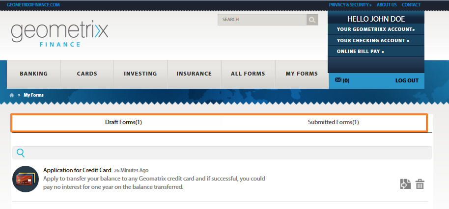

# Åtkomst och ifyllande av publicerade formulär{#accessing-and-filling-published-forms}

I en formulärcentrerad portalinstallation är formulärutveckling och portalutveckling två skilda aktiviteter. När formulärdesigners designar och lagrar formulär i en databas skapar webbutvecklare ett webbprogram som följer den listan och hanterar inskickade formulär. Formulären kopieras sedan över till webbnivån eftersom det inte finns någon kommunikation mellan formulärdatabasen och webbprogrammet.

Detta leder ofta till problem med att hantera installations- och produktionsförseningar. Om till exempel en nyare version av ett formulär är tillgänglig i databasen ersätter formulärdesignern formuläret på webbnivån, ändrar webbprogrammet och distribuerar om formuläret på den offentliga webbplatsen. Omdistribuering av webbprogrammet kan orsaka serverdriftavbrott. Eftersom serverns driftstopp är en planerad aktivitet kan ändringarna inte skickas direkt till den offentliga webbplatsen.

Forms Portal minskar administrationskostnaderna och försenar produktionen. Den förser webbutvecklare med komponenter för att skapa och anpassa en formulärportal på webbplatser som skapats med Adobe Experience Manager (AEM).

Mer information om formulärportalen och dess funktioner finns i [Introduktion till att publicera formulär på en portal](/help/forms/using/introduction-publishing-forms.md).

## Komma igång med formulärportalen {#getting-started-with-forms-portal}

Navigera till den publicerade formulärportalen. Mer information om hur du skapar en formulärportalsida finns i [Skapa en formulärportalsida](../../forms/using/creating-form-portal-page.md).

Komponenten Search och Lister i formulärportalen visar de formulär som är tillgängliga i publiceringsinstansen på AEM-servern. Den här listan innehåller alla formulär eller de formulär som definieras i filtret när formulärportalsidan redigeras. En formulärportalsida ser ut ungefär som i följande bild:

En exempelformulärportalsida

### Sök och visa {#search-and-lister}

Med komponenten Sök och Lister kan du lägga till följande funktioner i formulärportalen:

* Visa en lista över formulär som är tillgängliga direkt i panelen, kortet eller stödrastervyn. Det har även stöd för anpassade templatesList-formulär från särskilda mappar i Forms Manager.
* Ange hur formulär ska återges - HTML5, PDF eller båda.
* Ange hur PDF- och XFA-formulär återges - HTML5, PDF eller båda. Icke-XFA-formulär som HTML5.
* Möjliggör sökning av formulär baserat på kriterier som formuläregenskaper, metadata och taggar.
* Skicka formulärdata till en server.
* Använd anpassade formatmallar (CSS) för att anpassa portalens utseende och känsla.
* Skapa länkar till formulär.

Du kan söka efter formulär på sidan Formulärportal genom att använda följande alternativ:

* Fullständig textsökning
* Avancerad sökning

Med fulltextsökning kan du söka efter och lista formulär baserat på de angivna nyckelorden.

En avancerad sökdialog

Med avancerad sökning kan du söka efter formulär baserat på angivna formuläregenskaper. Detta ger ett mer specifikt resultat än fulltextsökning. I avancerad sökning ingår sökning baserat på taggar, egenskaper (till exempel Författare, Beskrivning och Titel), ändringsdatum och fullständig text.

Lister visar formulär baserade på sökparametrar. Varje formulär i sökresultatet visas med en ikon, som är hyperlänkad till det associerade formuläret. Du kan klicka på ikonen för att öppna och arbeta med det associerade formuläret.

### Fylla i ett formulär {#filling-a-form}

Ett adaptivt exempelformulär

Formulären kan nås via länken som medföljer formuläret i sid- och listkomponenten.

Varje formulär innehåller hjälpinformation som gör att användaren kan fylla i formuläret.

#### Utkast och inlämning {#drafts-and-submission}

En användare kan spara ett utkast av ett formulär genom att klicka på knappen Spara. Detta gör att användaren kan arbeta med ett formulär under en tidsperiod innan formuläret skickas.

De data som fylls i formuläret (inklusive bilagor) sparas som ett utkast på servern. Utkastet kan sparas hur många gånger som helst. Det sparade formuläret visas på fliken Utkast i komponenten Utkast och överföring på sidan.

När formuläret har fyllts i skickar användaren formulären genom att klicka på knappen Skicka i formuläret. De skickade formulären visas på fliken Skicka in i delen Utkast &amp; överföring på sidan.

>[!NOTE]
>
>Skickade formulär visas bara på fliken Skickade formulär om skicka-åtgärden för det adaptiva formuläret har konfigurerats som Forms Portal Submit-åtgärd. Mer information om Skicka-åtgärder finns i [Konfigurera Skicka-åtgärden](../../forms/using/configuring-submit-actions.md).

Komponenten Utkast och inskickat material

## Starta ett nytt formulär med skickade formulärdata {#start-a-new-form-using-submitted-form-data}

Det finns vissa formulär som du behöver fylla i och skicka in ganska ofta. Formuläret för att skicka in individuell skattedeklaration skickas till exempel varje år. I sådana fall ändras en del av informationen varje gång du fyller i formuläret, men de flesta av dem, som personuppgifter och familjeuppgifter, ändras inte. Du måste dock ändå fylla i hela formuläret från grunden.

AEM Forms kan hjälpa till att optimera formulärifyllningen och avsevärt minska tiden för att fylla i och skicka in ett formulär igen. Slutanvändare kan påbörja ett nytt formulär med data från ett skickat formulär. Den här funktionen är inbyggd i komponenten Utkast och överföringar. När du lägger till utkast och skicka-komponent på din formulärportalsida och publicerar den, hittar slutanvändarna ett alternativ på flikarna Skickade formulär och Utkastformulär för att starta ett nytt formulär med data från ett skickat formulär. Följande bild markerar det alternativet.

När du klickar på knappen för att initiera ett nytt formulär öppnas ett nytt formulär med data från motsvarande skickade formulär. Nu kan du granska och uppdatera informationen efter behov och skicka in formuläret.
