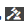

# Adaptiva formulärdiagram {#af-charts}


Ett diagram eller diagram är en visuell representation av data. Det gör att ni kan komprimera stora mängder information till ett lättbegripligt visuellt format, vilket gör att ni bättre kan visualisera, tolka och analysera komplexa data.
AEM Forms tilläggspaket innehåller en färdig diagramkomponent. Du kan använda i dina adaptiva formulär och dokument för visuell representation av tvådimensionella data i **upprepningsbara paneler** och **tabeller**. Med diagramkomponenten kan du lägga till och konfigurera följande typer av diagram:

1. Cirkel
1. Kolumn
1. Munk
1. Liggande
1. Linje
1. Linje och punkt
1. Punkt
1. Område

Diagramkomponenten stöder och tillhandahåller inbyggda statistiska funktioner - summa, medel, maximum, minimum, mode, media, intervall och frekvens - för att beräkna och rita värden i ett diagram. Förutom de funktioner som finns färdiga kan du skriva egna funktioner och göra dem tillgängliga för användning i diagram.

Nu ska vi titta på hur du lägger till och konfigurerar diagramkomponenten:

## Lägg till diagram {#add-chart}

Diagramkomponenten är som standard tillgänglig AEM sidofältet. Du kan dra och släppa diagramkomponenten från AEM sidofältet till det anpassade formuläret eller dokumentet i redigeringsläget. När du släpper komponenten skapas en platshållare för ett diagram.

## Konfigurera diagram {#configure-chart}

>[!NOTE]
> 
> Innan du konfigurerar diagrammet kontrollerar du att panelen eller tabellraden som du konfigurerar diagrammet för är repeterbar. Du kan ange minsta och högsta antal för repeterbara paneler eller tabellrader på fliken Upprepa inställningar i dialogrutan Redigera komponent.

Om du vill konfigurera diagrammet klickar du på diagramkomponenten och sedan på  för att öppna dialogrutan Redigera diagram. Dialogrutan innehåller flikarna Rubrik och text, Konfiguration, Avancerade alternativ och Format som du kan använda för att konfigurera diagrammet.

### Grundläggande {#basic}

På fliken Grundläggande kan du konfigurera följande egenskaper:


* **Elementnamn**: En identifierare för diagramelementet i JCR-innehållsstrukturen. Den är inte synlig i diagrammet men hjälper när du refererar till elementet från andra komponenter, skript och SOM-uttryck.
* **Diagramtyp**: Anger vilken typ av diagram du vill generera. De tillgängliga alternativen är Cirkel, Ring, Stapel, Kolumn, Linje, Punkt, Punkt och Yta. I exemplet är diagramtypen Kolumn.
* **Upprepande radnamn eller panelnamn för Data Source**: Anger elementnamnet för tabellraden eller den repeterbara panel som data kommer att hämtas från. I exemplet är statementDetails elementnamnet på den repeterbara raden i tabellen Statement Details.
* **X-axel > Titel**: Anger X-axelns rubrik. I exemplet är rubriken för X-axeln Kategori.
* **X-axel > Fält**: Anger elementnamnet för fältet (eller en cell i en tabell) som ska ritas på X-axeln. I exemplet är kategorier konfigurerade på X-axeln. Elementnamnet för tabellcellen i kategorikolumnen i exempeltabellen är kategori.
* **X-axel > Använd funktion**: Anger den statistiska funktion som ska användas för att beräkna värdena på X-axeln. I exemplet är det valda alternativet Ingen. Mer information om funktioner finns i Använda funktioner i diagram.
* **Y-axel > Titel**: Anger rubriken för Y-axeln. I exemplet är rubriken för Y-axeln Utgift.
* **Y-axel > Fält**: Anger elementnamnet för fältet (eller cellen i en tabell) som ska ritas på Y-axeln. I exemplet ska du konfigurera mängd på Y-axeln. Elementnamnet för tabellcellen i kolumnen Belopp i exempeltabellen är amount.
* **Y-axel > Använd funktion**: Anger den statistiska funktion som ska användas för att beräkna värdena på Y-axeln. I exemplet läggs den mängd som används i varje kategori till och det beräknade värdet ritas på Y-axeln. Välj därför Summa i listrutan Använd funktion. Mer information om funktioner finns i Använda funktioner i diagram.
* **Förklaringens position**: Anger förklaringens position i förhållande till diagrammet. De tillgängliga alternativen är Höger, Vänster, Upptill och Nedtill.
* **Visa förklaring**: Visa en förklaring för diagrammet när det är aktiverat.
* **Verktygstips**: Anger i vilket format verktygstipset ska visas när användaren för musen över en datapunkt i diagrammet. Standardvärdet är **\${x}(\${y})**. Beroende på diagramtyp ersätts variablerna **\${x}** och **\${y}** dynamiskt med motsvarande värden på X-axeln och Y-axeln när du pekar med musen på en punkt, stapel eller segment i diagrammet, och visas i verktygstipset. Så som visas i exemplet nedan visas verktygstipset som **Detaljhandel(5870)** när du pekar med musen på kolumnen Detaljhandel butiker. Om du vill inaktivera verktygstipset lämnar du fältet Verktygstips tomt. Det här alternativet gäller inte för linjediagram och ytdiagram.
* **Diagramspecifika konfigurationer**: Förutom vanliga konfigurationer finns följande diagramspecifika konfiguration tillgänglig:
* **Innerradie**: tillgänglig för Donut-diagram för att ange radien (i pixlar) för den inre cirkeln i diagrammet.
* **Linjefärg**: tillgänglig för linje-, linje- och punktdiagram samt ytdiagram för att ange det hexadecimala värdet för linjens färg i diagrammet.
* **Punktfärg**: tillgänglig för Point- och Line-diagram samt punktdiagram för att ange det hexadecimala värdet på färgen för punkterna i diagrammet.
* **Områdesfärg**: tillgängligt för ytdiagram för att ange det hexadecimala värdet för färgen för området under raden i diagrammet.
* **CSS-klass**: Ange namnet på en CSS-klass i CSS-klassfältet för att använda anpassad formatering i diagrammet.

### Konfiguration {#configuration}

På fliken Grundläggande definierar du vilken typ av diagram, källpanel eller tabellrad som innehåller data, vilka värden som ska ritas på X- och Y-axeln i diagrammet och eventuellt den statistiska funktionen för att beräkna värdena för att rita i diagrammet.

Låt oss i detalj förstå informationen som visas på den här fliken, med hjälp av ett exempel på en repeterbar tabell i en kreditkortssats. Tänk på att du vill generera ett diagram som avbildar och korrelerar den totala kostnaden i olika kategorier i avsnittet med kontoutdrag i en kreditkortsutdrag, vilket visas nedan.

För att uppnå detta måste du rita upp kategorier på X-axeln och på Y-axeln rita upp de totala utgifterna i varje kategori.


Kreditkortsutdraget som används i det här exemplet är ett adaptivt formulärdokument och avsnittet med utdragsinformation är en tabell som ser ut så här i redigeringsläget.


Låt oss titta på följande krav och villkor för att generera diagrammet:

* Diagrammet visar den totala kostnaden i varje kategori i tabellen Utdragsdetaljer.
* Diagramtypen är Kolumn, men du kan välja vilken annan diagramtyp som helst.
* Tabellraden i satsen Details-tabellen är upprepningsbar. Du kan konfigurera det i fältet Upprepa inställningar för tabellradegenskaperna.
* Elementnamnet för raden är Satsinformation. Du kan konfigurera det i tabellradegenskaperna.
* Elementnamnet för tabellcellen i kategorikolumnen är kategori. Du kan ange den textbundet. Markera cellen och tryck på redigeringsknappen.
* Elementnamnet för tabellcellen i kolumnen Belopp är amount. Tabellcellen i kolumnen Belopp är också en numerisk ruta.
* Med den angivna konfigurationen visas kolumndiagrammet i exemplet enligt följande. Varje färg motsvarar en kategori och enskilda radposter eller belopp för en kategori läggs till i diagrammet.

  

Förklaringen och verktygstipset visas så här.


### Stilar {#styling}

I formateringsläget kan du ange diagrammets bredd i procent av den totala bredden i formuläret eller dokumentet och dess höjd i pixlar. Andra alternativ är text, bakgrund, kant, effekter och CSS-åsidosättningar.

Gå till verktygsfältet för sidan och **tryck>>Format** om du vill växla till formateringsläge.


## Använda funktioner i diagram {#use-functions}

Du kan konfigurera ett diagram så att statistiska funktioner används för att beräkna värden från källdata för plottning i diagrammet. Även om diagramkomponenten har vissa inbyggda funktioner kan du skriva egna funktioner och göra dem tillgängliga för användning i diagramkonfigurationen.

>[!NOTE]
>
> Du kan använda funktioner för att beräkna värden för antingen X-axeln eller Y-axeln i ett diagram.

### Standardfunktioner {#default-functions}

Följande funktioner är tillgängliga som standard med komponenten Chart:

* **Medel (medel)**: Returnerar medelvärdet av värdena på X- eller Y-axeln för ett givet värde på den andra axeln.
* **Summa**: Returnerar summan av alla värden på X- eller Y-axeln för ett givet värde på den andra axeln.
* **Maximum**: Returnerar det maximala värdet på X- eller Y-axeln för ett givet värde på den andra axeln.
* **Frekvens**: Returnerar antalet värden på X- eller Y-axeln för ett givet värde på den andra axeln.
* **Intervall**: Returnerar skillnaden mellan det högsta och det lägsta värdet på X- eller Y-axeln för ett givet värde på den andra axeln.
* **Median**: Returnerar det värde som skiljer högre och lägre värden i halva X- eller Y-axeln från ett givet värde på den andra axeln.
* **Minimum**: Returnerar det minsta värdet på X- eller Y-axeln för ett givet värde på den andra axeln.
* **Läge**: Returnerar värdet med de flesta förekomster på X- eller Y-axeln för ett givet värde på den andra axeln

### Anpassade funktioner {#custom-functions}

Förutom att använda standardfunktionerna i diagram kan du skriva [anpassade funktioner](/help/forms/using/rule-editor.md#custom-functions-in-rule-editor-custom-functions) i JavaScript och göra dem tillgängliga i listan med funktioner i diagramkomponenten.

En funktion tar en eller flera matriser och ett kategorinamn som indata och returnerar ett värde. Till exempel:

```
Multiply(valueArray, category) {
    var val = 1;
    _.each(valueArray, function(value) {
        val = val * value;
    });
    return val;
}
```

När du har skrivit en anpassad funktion gör du följande för att göra den tillgänglig för användning i diagramkonfigurationen:

1. Lägg till den anpassade funktionen i klientbiblioteket som är kopplad till det adaptiva formuläret eller dokumentet.
1. I CRXDE Lite skapar du en nt:unsigned-nod i mappen apps med följande egenskaper:
   * Ange guideComponentType som fd/af/reduer. (obligatoriskt)
   * Ange ett fullständigt namn på den anpassade JavaScript-funktionen. (obligatoriskt)
   * Ställ in jcr:description på ett beskrivande namn. Den visas i listrutan **Använd funktion** . Till exempel **Multiplicera**.
   * Ange qtip som en kort beskrivning av funktionen. Det visas som ett verktygstips när du håller pekaren över funktionsnamnet i listrutan Använd funktion.
   * Klicka på **Spara alla** för att spara konfigurationen.
   * Funktionen kan nu användas i diagrammet.


## Uppdatera diagram automatiskt {#auto-refresh-chart}

Ett diagram uppdateras automatiskt när användare gör något av följande:
* Lägg till eller ta bort en instans av datakällpanelen eller tabellraden.
* Ändra ett värde som ritats på X- eller Y-axeln på datakällpanelen eller tabellraden.
* Ändra diagramtyp.

## Använd diagramtyp i anpassade formulärregler {#chart-in-rules}

Egenskapen chartType anger diagramtypen. Möjliga värden är tårta, munstycke, streck, linje, linjepunkt, punkt och område. Det är en skriptbar egenskap, vilket betyder att du kan använda den i [adaptiva formulärregler](/help/forms/using/rule-editor.md) för att ändra diagramkonfigurationer. Låt oss förstå det med hjälp av ett exempel.

Tänk på att du har konfigurerat ett stapeldiagram. Men du vill också att användarna ska kunna välja en annan diagramtyp i listrutan och rita om diagrammet. Du kan göra detta med egenskapen chartType i en regel enligt följande:

1. Dra och släpp en komponent för nedrullningsbar lista från AEM sidofält i det adaptiva formuläret.
1. Markera komponenten och tryck på .
1. Ange en titel för listrutan. Välj till exempel diagramtyp.
1. Lägg till diagramtyper som stöds i avsnittet Objekt för att fylla i den nedrullningsbara listan. Klicka på **Klar**.
   

1. Markera den nedrullningsbara komponenten och tryck på . I regelredigeraren skriver du en regel i den visuella regelredigeraren enligt nedan.
   

   I det här exemplet är diagramkomponentens elementnamn **myChart**.

   Du kan även skriva följande regler i kodredigeraren.

   

   Mer information om hur du skriver regler finns i [Regelredigeraren](/help/forms/using/rule-editor.md)

1. Spara regeln genom att klicka på Klar.

Nu kan du välja en diagramtyp i listrutan och klicka på Uppdatera för att rita om diagrammet.
