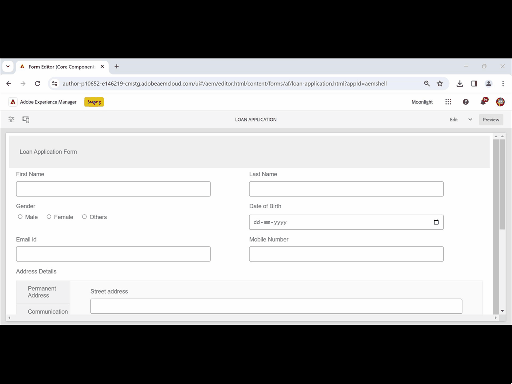

# Skapa och använda adaptiva Forms-fragment i ett adaptivt formulär baserat på kärnkomponenter {#adaptive-form-fragments}

| Version | Länk till artikel |
| -------- | ---------------------------- |
| AEM 6.5 | Den här artikeln |
| AEM as a Cloud Service | [Klicka här](https://experienceleague.adobe.com/docs/experience-manager-cloud-service/content/forms/adaptive-forms-authoring/authoring-adaptive-forms-core-components/create-an-adaptive-form-on-forms-cs/adaptive-form-fragments-core-components.html?lang=sv-SE) |

Alla formulär har utformats för ett specifikt ändamål, men det finns några vanliga segment i de flesta formulär, till exempel för att ge personliga uppgifter som namn och adress, familjeinformation och inkomstinformation. Formulärutvecklare måste skapa dessa gemensamma segment varje gång ett nytt formulär skapas.

Adaptiv Forms är en praktisk mekanism för att skapa formulärsegment som en panel eller en grupp fält endast en gång och återanvända dem i adaptiv Forms. Dessa återanvändbara och fristående segment kallas adaptiva formulärfragment.

Blankettfragment kan smidigt integreras i flera olika blanketter vilket gör det enkelt att skapa enhetliga och proffsiga blanketter. Form Fragments säkerställer återanvändbarhet, standardisering och enhetlig varumärkesexponering genom funktionen&quot;change once and mirror everywhere&quot;. Upplev bättre underhålls- och effektivitetsvinster i takt med att uppdateringar som görs på ett och samma ställe sprids automatiskt i alla formulär som använder dessa fragment.

Du kan lägga till ett fragment flera gånger i ett dokument och använda databindningsegenskaper för dess komponenter för att koppla det till olika datakällor eller scheman. Du kan till exempel använda samma adressfragment för permanent adress, kommunikations- och faktureringsadress och ansluta det till olika fält i en datakälla eller ett schema.

>[!NOTE]
>
> Du kan enkelt anpassa fragmentupplevelsen för användare med dialogrutan [Konfigurera och dialogrutan Design för komponenten Form Fragment](https://experienceleague.adobe.com/docs/experience-manager-core-components/using/adaptive-forms/adaptive-forms-components/form-fragment.html).

## Skapa ett formulärfragment {#create-a-fragment}

Du kan skapa ett adaptivt formulärfragment från grunden eller spara en panel i ett befintligt adaptivt formulär som fragment. Skapa ett formulärfragment:

1. Logga in på din AEM Forms-instans på https://[*värdnamn*]:[*port*]/aem/forms.html.
1. Klicka på **Skapa > Adaptivt formulärfragment**.
1. Ange rubrik, namn, beskrivning och taggar för fragmentet. Se till att du anger ett unikt namn för fragmentet. Om det finns ett annat fragment med samma namn kan fragmentet inte skapas.
1. Välj en formulärmall. Du kan skapa ett formulärfragment för Core Components-baserade Adaptive Forms- eller Foundation Components-baserade Adaptive Forms.
   * Om du vill skapa formulärfragment för kärnkomponentbaserade formulär väljer du en mall baserad på kärnkomponenter.
   * Om du vill skapa formulärfragment för Foundation Components-baserade formulär väljer du en Foundation Components-mall. Exempel: /libs/fd/af/templateForFragment/defaultFragmentTemplate.

   När du skapar formulärfragment för kärnkomponentbaserade formulär använder du alternativet Välj formulärtema för att välja ett kärnkomponentbaserat tema.

1. Klicka för att öppna fliken **Formulärmodell** och välj en av följande modeller för fragmentet på den nedrullningsbara menyn **Välj från**:

   

   * **Ingen**: Anger att fragmentet ska skapas från grunden utan att använda någon formulärmodell.

     >[!NOTE]
     >
     > I Adaptiv Forms kan du använda ett enda formulärfragment (baserat på kärnkomponenter) flera gånger. Den har stöd för både icke-baserade och schemabaserade formulärfragment.

   * **Schema**: Anger att fragmentet ska skapas med ett XML- eller JSON-schema som överförts till AEM Forms. Du kan överföra eller välja mellan tillgängliga XML- eller JSON-scheman som formulärmodell för fragmentet. När du väljer ett XML-schema kan du också skapa ett adaptivt formulärfragment genom att välja en complexType som finns i det valda schemat i listrutan **[!UICONTROL XML Schema Complex Type]**. När du väljer ett JSON-schema kan du också skapa ett adaptivt formulärfragment genom att välja en schemadefinition som finns i det valda schemat i listrutan **[!UICONTROL JSON Schema Definitions]**.
   * **Formulärdatamodell**: Anger att fragmentet ska skapas med en formulärdatamodell. Du kan skapa ett adaptivt formulärfragment baserat på endast ett datamodellsobjekt i en formulärdatamodell. Expandera listrutan Definitioner för formulärdatamodell. Den visar alla datamodellsobjekt i den angivna formulärdatamodellen. Markera ett datamodellsobjekt i listan.

   

1. Klicka på **Skapa** och klicka sedan på **Öppna** för att öppna fragmentet, med en standardmall, i redigeringsläge. I redigeringsläget kan du lägga till alla adaptiva formulärkomponenter i fragmentet.

<!-- For information about Adaptive Form components, see [Introduction to authoring Adaptive Forms](../../forms/using/introduction-forms-authoring.md). --> Om du dessutom har valt ett XML-schema eller en XDP-formulärmall som formulärmodell för fragmentet visas en ny flik som visar formulärmodellhierarkin i innehållssökaren. Du kan dra och släppa formulärmodellelement till fragmentet. De tillagda elementen för formulärmodell konverteras till formulärkomponenter samtidigt som de ursprungliga egenskaperna från den associerade XDP- eller XSD-filen behålls.

När det adaptiva formulärfragmentet som baseras på ett schema eller en formulärdatamodell har skapats, visas formulärdatamodellen eller schemaelementen på fliken Datakällor i innehållsläsaren i den adaptiva formulärredigeraren. Du kan dra och släppa formulärmodellelement till fragmentet. De tillagda elementen för formulärmodellen konverteras till formulärkomponenter samtidigt som de ursprungliga egenskaperna behålls från det associerade schemat.

## Lägga till ett fragment i ett anpassat formulär {#insert-a-fragment-in-an-adaptive-form}

Så här lägger du till ett adaptivt formulärfragment i ett adaptivt formulär:

1. Öppna det adaptiva formuläret i redigeringsläge.
1. Lägg till komponenten **Adaptivt formulärfragment** i formuläret.
1. Klicka på **Assets**-innehållsläsaren i sidlisten. I resursläsaren, under sökvägarna, väljer du **alternativet Adaptive Form Fragments** . Alla adaptiva Forms-fragment som är tillgängliga för ditt formulär, beroende på formulärmodellen, visas.

   

1. Dra och släpp ett adaptivt formulärfragment på komponenten **Adaptivt formulärfragment** i det adaptiva formuläret.

   >[!NOTE]
   >
   >Det adaptiva formulärfragmentet är inte aktiverat för redigering i det adaptiva formuläret. Dessutom kan du inte använda ett XSD-baserat fragment i en JSON-baserad adaptiv form och tvärtom.

Det adaptiva formulärfragmentet läggs till med referens till det adaptiva formuläret och förblir synkroniserat med det fristående adaptiva formulärfragmentet. Det innebär att alla ändringar som görs i det adaptiva formulärfragmentet speglas i alla instanser där fragmentet ingår i Adaptiv Forms.

### Bädda in ett fragment i adaptivt formulär {#embed-a-fragment-in-adaptive-form}

Du kan välja att bädda in ett adaptivt formulärfragment i ett adaptivt formulär genom att klicka på ikonen  i panelverktygsfältet för det tillagda fragmentet

Det inbäddade fragmentet är inte längre länkat till det fristående fragmentet. Du kan redigera komponenterna i det inbäddade fragmentet i det adaptiva formuläret.

<!-- 
## Configure fragment appearance {#configure-fragment-appearance}

Any fragment you insert in Adaptive Forms appears as a placeholder image. The placeholder displays titles of up to a maximum of ten child panels in the fragment. You can configure AEM Forms to show the complete fragment instead of the placeholder image.

Perform the following steps to show complete fragments in forms:

1. Go to AEM web console configuration page at https:[*host*]:[*port*]/system/console/configMgr.

1. Search and click **[!UICONTROL Adaptive Form and Interactive Communication Web Channel Configuration]** to open it in edit mode.
1. Disable **[!UICONTROL Enable Placeholder in place of Fragment]** checkbox to show complete fragments rather than the placeholder image.

-->

### Använda fragment inom fragment {#using-fragments-within-fragments}

Du kan skapa kapslade adaptiva formulärfragment, vilket betyder att du kan dra och släppa ett fragment i ett annat fragment och ha en kapslad fragmentstruktur.

### Använda ett formulärfragment flera gånger i ett adaptivt formulär {#using-form-fragment-mutiple-times-in-af}

Du kan använda ett icke-baserat och schemabaserat formulärfragment flera gånger i ett adaptivt formulär för att spara data unikt för varje formulärfragmentfält. Du kan till exempel använda ett adressformulärfragment för att samla in adressinformation för permanenta, kommunikations- och nuvarande levande adresser i ett låneansökningsformulär.

## Automatisk mappning av fragment för databindning {#auto-mapping-of-fragments-for-data-binding}

När du skapar ett adaptivt formulärfragment med en XFA-formulärmall eller XSD-komplex typ och drar och släpper fragmentet till ett adaptivt formulär, ersätts XFA-fragmentet eller XSD-komplextypen automatiskt av motsvarande adaptiva formulärfragment vars fragmentmodellrot mappas till XFA-fragmentet eller XSD-komplextypen.

Du kan ändra fragmentresursen och dess bindningar i dialogrutan Redigera komponent.

Du kan också dra och släppa ett bundet adaptivt formulärfragment från biblioteket för adaptiva formulärfragment i AEM innehållssökaren och ange rätt bindningsreferens från dialogrutan Redigera komponent i fragmentpanelen för adaptiva formulär.

## Hantera fragment {#manage-fragments}

Du kan utföra flera åtgärder på adaptiva formulärfragment med hjälp av AEM Forms-gränssnittet.

1. Gå till `https://[hostname]/aem/forms.html`.

1. Klicka på **Markera** i AEM Forms-verktygsfältet och välj ett adaptivt formulärfragment. I verktygsfältet visas följande åtgärder som du kan utföra på det valda adaptiva formulärfragmentet.

<table>
 <tbody>
  <tr>
   <td>
<strong>Åtgärd</strong>
 </td>
   <td>
<strong>Beskrivning</strong>
 </td>
  </tr>
  <tr>
   <td>
Redigera
 </td>
   <td>
Öppnar det markerade adaptiva formulärfragmentet i redigeringsläge.    
 </td>
  </tr>
  <tr>
   <td>
Egenskaper
 </td>
   <td>
Öppnar egenskapspanelen. På panelen Egenskaper kan du visa och redigera egenskaper, generera en förhandsvisning och överföra en miniatyrbild för det valda fragmentet. Mer information finns i <a>Hantera metadata</a>.    
 </td>
  </tr>
  <tr>
   <td>
Kopiera
 </td>
   <td>
Kopierar det markerade fragmentet. Knappen Klistra in visas i verktygsfältet.    
 </td>
  </tr>
  <tr>
   <td>
Ladda ned
 </td>
   <td>
Hämtar det markerade fragmentet.    
 </td>
  </tr>
  <tr>
   <td>
Förhandsgranska
 </td>
   <td>
Tillhandahåller alternativ för att förhandsgranska fragmentet som HTML eller som en anpassad förhandsgranskning genom att sammanfoga data från en XML-fil med fragmentet. Mer information finns i <a>Förhandsgranska ett formulär</a>.    
 </td>
  </tr>
  <tr>
   <td>
Starta granskning/hantera granskning
 </td>
   <td>
Gör att du kan initiera och hantera en granskning av det valda fragmentet. Mer information finns i <a>Skapa och hantera granskningar</a>.    
 </td>
  </tr>
  <tr>
   <td>
Lägg till ordlista
 </td>
   <td>
Genererar en ordlista för att lokalisera det markerade fragmentet. Mer information finns i <a>Lokalisera adaptiv Forms</a>.    
 </td>
  </tr>
  <tr>
   <td>
Publicera/avpublicera
 </td>
   <td>
Publicerar/avpublicerar det markerade fragmentet.    
 </td>
  </tr>
  <tr>
   <td>
Ta bort
 </td>
   <td>
Tar bort det markerade fragmentet.    
 </td>
  </tr>
 </tbody>
</table>

## Viktiga punkter att komma ihåg när du arbetar med fragment {#key-points-to-remember-when-working-with-fragments}

* Kontrollera att fragmentnamnet är unikt. Fragmentet kan inte skapas om det finns ett befintligt fragment med samma namn.
* Om du sparar en panel som ett fragment som innehåller ett annat XDP-fragment i ett XDP-baserat adaptivt formulär, binds det resulterande fragmentet automatiskt till det underordnade XDP-fragmentet. Om ett XSD-baserat anpassat formulär är det resulterande fragmentet bundet till schemaroten.
* När du skapar ett adaptivt formulärfragment skapas en fragmentnod, som liknar noden guideContainer för ett adaptivt formulär i CRXDE Lite.
* Ett fragment i ett adaptivt formulär som använder en annan formulärdatamodell stöds inte. Ett XDP-baserat fragment stöds till exempel inte i en XSD-baserad adaptiv form och omvänt.
* Anpassade formulärfragment kan användas via fliken Adaptiva formulärfragment i AEM innehållssökaren.
* Alla uttryck, skript och format i ett fristående adaptivt formulärfragment behålls när de infogas som referens eller bäddas in i ett adaptivt formulär.
* Du kan inte redigera ett adaptivt formulärfragment, som infogas med referens, i ett adaptivt formulär. Om du vill redigera kan du antingen redigera det fristående adaptiva formulärfragmentet eller bädda in fragmentet i det adaptiva formuläret.
* När du publicerar ett adaptivt formulär måste du publicera de fristående adaptiva formulärfragmenten som infogats med referens i det adaptiva formuläret.
* När du publicerar om ett uppdaterat adaptivt formulärfragment återspeglas ändringarna i de publicerade instanserna av det adaptiva formulär som fragmentet används i.
* Adaptiv form som innehåller Verifiera-komponenten stöder inte anonyma användare. Du bör inte heller använda komponenten Verify i ett adaptivt formulärfragment.
* (**Endast Mac) Om du vill** vara säker på att funktionen för formulärfragment fungerar perfekt i alla scenarier lägger du till följande post i filen /private/etc/hosts:
  `127.0.0.1 <Host machine>` **Värddator**: Den Apple Mac-dator som AEM Forms distribueras på.

## Referensfragment {#reference-fragments}

Referera till adaptiva formulärfragment som du kan använda för att skapa formuläret.
<!-- For more information, see [Reference Fragments](../../forms/using/reference-adaptive-form-fragments.md). -->

## Se även {#see-also}

* [Skapa en grundkomponentbaserad adaptiv form](create-an-adaptive-form-core-components.md)
* [Använd regelredigeraren för att lägga till dynamiskt beteende i formulär](rule-editor.md)
* [Skapa eller anpassa teman för grundkomponentbaserade adaptiva Forms](create-or-customize-themes-for-adaptive-forms-core-components.md)
* [Skapa en mall för Core Components-baserade Adaptive Forms](template-editor.md)
* [Skapa eller lägga till ett anpassat formulär på en AEM Sites-sida eller ett Experience Fragment](create-or-add-an-adaptive-form-to-aem-sites-page.md)
* [Exempelmallar för teman och formulärdatamodeller](https://experienceleague.adobe.com/docs/experience-manager-core-components/using/adaptive-forms/sample-themes-templates-form-data-models-core-components.html?lang=sv-SE)
