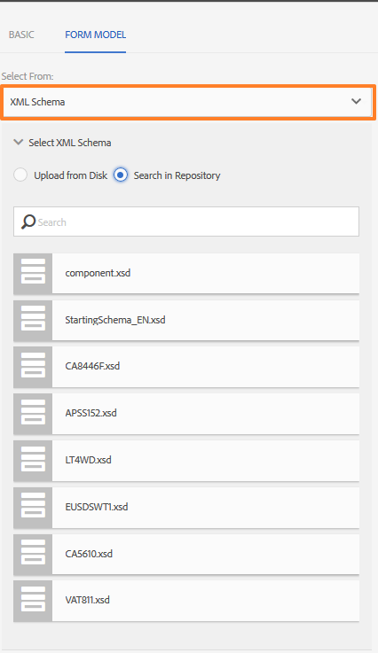

# Anpassningsbara formulärfragment{#adaptive-form-fragments}

| Version | Artikellänk |
| -------- | ---------------------------- |
| AEM as a Cloud Service | [Klicka här](https://experienceleague.adobe.com/docs/experience-manager-cloud-service/content/forms/adaptive-forms-authoring/authoring-adaptive-forms-core-components/create-an-adaptive-form-on-forms-cs/adaptive-form-fragments-core-components.html) |
| AEM 6.5 | Den här artikeln |

Adobe rekommenderar att du använder de moderna och utökningsbara kärnkomponenterna[&#128279;](https://experienceleague.adobe.com/docs/experience-manager-core-components/using/adaptive-forms/introduction.html) för datainhämtning för att [skapa nya adaptiva Forms](/help/forms/using/create-an-adaptive-form-core-components.md) eller [lägga till adaptiv Forms på AEM Sites-sidor](/help/forms/using/create-or-add-an-adaptive-form-to-aem-sites-page.md). De här komponenterna utgör ett betydande framsteg när det gäller att skapa adaptiva Forms-filer, vilket ger imponerande användarupplevelser. I den här artikeln beskrivs äldre metoder för att skapa adaptiv Forms med hjälp av grundläggande komponenter. 

Alla formulär har utformats för ett specifikt ändamål, men det finns några vanliga segment i de flesta formulär, till exempel för att ge personliga uppgifter som namn och adress, familjeinformation och inkomstinformation. Formulärutvecklare måste skapa dessa gemensamma segment varje gång ett nytt formulär skapas.

Med adaptiva formulär kan du enkelt skapa formulärsegment som en panel eller en grupp fält endast en gång och återanvända dem i anpassade formulär. Dessa återanvändbara och fristående segment kallas adaptiva formulärfragment.

>[!NOTE]
>
> Du kan enkelt anpassa fragmentupplevelsen för användare med dialogrutan [Konfigurera och dialogrutan Design för komponenten Form Fragment](https://experienceleague.adobe.com/docs/experience-manager-core-components/using/adaptive-forms/adaptive-forms-components/form-fragment.html).

## Skapa ett fragment {#create-a-fragment}

Du kan skapa ett adaptivt formulärfragment från grunden eller spara en panel i ett befintligt adaptivt formulär som ett fragment.

### Skapa fragment från grunden {#create-fragment-from-scratch}

1. Logga in på AEM Forms författarinstans på https://[*värdnamn*]:[*port*]/aem/forms.html.
1. Klicka på **Skapa > Adaptivt formulärfragment**.
1. Ange rubrik, namn, beskrivning och taggar för fragmentet.

   >[!NOTE]
   >
   >Se till att du anger ett unikt namn för fragmentet. Om det finns ett annat fragment med samma namn kan fragmentet inte skapas.

1. Klicka för att öppna fliken **Formulärmodell** och välj en av följande modeller för fragmentet på den nedrullningsbara menyn **Välj från**:

   * **Inget**: Anger att fragmentet ska skapas från grunden utan att någon formulärmodell används.

     >[!NOTE]
     >
     > I Adaptiv Forms baserat på kärnkomponenter kan du använda ett enda formulärfragment flera gånger i ett formulär. Det stöder både icke-baserade och schemabaserade formulärfragment.

   * **Formulärmall**: Anger att fragmentet ska skapas med en XDP-mall som har överförts till AEM Forms. Välj lämplig XDP-mall som formulärmodell för fragmentet.

   

   Delformulären som är markerade som fragment i den valda formulärmallen visas också. Du kan välja ett delformulär för anpassat formulärfragment i listrutan.

   

   Dessutom kan du skapa ett adaptivt formulärfragment med hjälp av delformulär som inte är markerade som fragment i formulärmallen genom att ange SOM-uttrycket för delformuläret i listrutan.

   * **XML-schema**: Anger att fragmentet ska skapas med ett XML-schema som har överförts till AEM Forms. Du kan överföra eller välja bland tillgängliga XML-scheman som formulärmodell för fragmentet.

   

   Du kan också skapa ett adaptivt formulärfragment genom att välja en complexType som finns i det valda schemat i listrutan.

   

1. Klicka på **Skapa** och sedan på **Öppna** för att öppna fragmentet med en standardmall i redigeringsläge.

I redigeringsläge kan du dra och släppa alla adaptiva formulärkomponenter från AEM sidosparken till fragmentet. Mer information om adaptiva formulärkomponenter finns i [Introduktion till utveckling av adaptiva formulär](../../forms/using/introduction-forms-authoring.md).

Om du dessutom har valt ett XML-schema eller en XDP-formulärmall som formulärmodell för fragmentet visas en ny flik som visar formulärmodellhierarkin i innehållssökaren. Du kan dra och släppa formulärmodellelement till fragmentet. De tillagda elementen för formulärmodell konverteras till formulärkomponenter samtidigt som de ursprungliga egenskaperna från den associerade XDP- eller XSD-filen behålls.

### Spara panelen som ett fragment {#save-panel-as-a-fragment}

1. Öppna ett adaptivt formulär som innehåller den panel som du vill spara som ett adaptivt formulärfragment.
1. Klicka på **[!UICONTROL Save as Fragment]** i panelens verktygsfält. Dialogrutan Spara som fragment öppnas.

   >[!NOTE]
   >
   >Om panelen som du sparar som fragment innehåller en underordnad panel, inkluderas de i det resulterande fragmentet.

1. Ange följande information i dialogrutan Skapa fragment:

   * **Namn**: Namnet på fragmentet. Standardvärdet är panelens elementnamn. Det är ett obligatoriskt fält.

     >[!NOTE]
     >
     >Se till att du anger ett unikt namn för fragmentet. Om det finns ett annat fragment med samma namn kan fragmentet inte skapas.

   * **Titel**: Fragmentets namn. Standardvärdet är panelens namn.

   * **Beskrivning**: Beskrivning av fragmentet.

   * **Taggar**: Taggar metadata för fragmentet.

   * **Målsökväg**: Databassökväg där fragmentet sparas. Om du inte anger en sökväg skapas en nod med samma namn som fragmentet bredvid noden som innehåller det adaptiva formuläret. Fragmentet sparas i den här noden.

   * **Formulärmodell**: Beroende på formulärmodellen för det adaptiva formuläret visas **XML-schemat**, **Formulärmallen** eller **Inget** i det här fältet. Det är ett icke-redigerbart fält.

   * **Fragmentmodellrot**: Visas endast i XSD-baserade adaptiva formulär. Den anger fragmentmodellens rot. Du kan välja **/** eller den komplexa XSD-typen i listrutan. Du kan bara återanvända fragmentet i ett annat anpassat formulär om du väljer den komplexa typen som fragmentmodellroten.
Om du väljer **/** som fragmentmodellrot visas hela XSD-trädet från roten på fliken för adaptiv formulärdatamodell. För en fragmentmodellrot av en komplex typ visas bara de underordnade för den valda komplexa typen på fliken för adaptiv formulärdatamodell. Om du skapar ett fragment och väljer en komplex typ som **fragmentmodellrot** kan du använda den var den komplexa typen används, antingen i samma formulär eller i flera formulär.

   * **XSD-referens**: Visas endast i XSD-baserade adaptiva formulär. Den visar platsen för XML-schemat.

   * **XDP-referens**: Visas endast i XDP-baserade adaptiva formulär. Här visas platsen för XDP-formulärmallen.

   

   Dialogrutan Spara som fragment

1. Klicka på **OK**.

   Panelen sparas på den angivna platsen eller standardplatsen i databasen. I det adaptiva formuläret ersätts panelen av en ögonblicksbild av fragmentet. Som du ser nedan sparas panelen Allmän information och dess underordnade paneler, Personlig information och Adress, som ett fragment.

   Om du vill redigera fragmentet klickar du på **[!UICONTROL Edit Asset]** i panelens verktygsfält. Fragmentet öppnas på en ny flik eller i ett nytt fönster i redigeringsläge.

   

## Arbeta med fragment {#working-with-fragments}

### Konfigurera fragmentutseende {#configure-fragment-appearance}

Alla fragment som du infogar i anpassningsbara formulär visas som en platshållarbild. Platshållaren visar titlar på upp till högst tio underordnade paneler i fragmentet. Du kan konfigurera AEM Forms så att hela avsnittet visas i stället för platshållarbilden.

Utför följande steg så att du kan visa fullständiga fragment i formulär:

1. Gå till konfigurationssidan för AEM webbkonsol på https:[*host*]:[*port*]/system/console/configMgr.

1. Sök och välj **[!UICONTROL Adaptive Form and Interactive Communication Web Channel Configuration]** för att öppna den i redigeringsläge.
1. Inaktivera kryssrutan **[!UICONTROL Enable Placeholder in place of Fragment]** så att du kan visa hela fragment i stället för platshållarbilden.

### Infoga ett fragment i ett anpassat formulär {#insert-a-fragment-in-an-adaptive-form}

De anpassade formulärfragmenten som du skapar visas på fliken Adaptiva formulärfragment i AEM innehållssökning. Så här infogar du ett adaptivt formulärfragment i en adaptiv form:

1. Öppna det adaptiva formuläret, i redigeringsläge, där du vill infoga ett adaptivt formulärfragment.
1. Klicka på **Assets**  i sidlisten. Välj **Adaptiva formulärfragment** i listrutan i resursläsaren.

   Du kan också välja att visa alla adaptiva formulärfragment eller filter baserat på formulärmodellen - Formulärmall, XML-schema eller Grundläggande.

1. Dra och släpp ett adaptivt formulärfragment på det adaptiva formuläret.

   >[!NOTE]
   >
   >Det adaptiva formulärfragmentet är inte aktiverat för redigering inifrån det adaptiva formuläret. Dessutom kan du inte använda ett XSD-baserat fragment i en JSON-baserad adaptiv form och tvärtom.

Det adaptiva formulärfragmentet infogas som referens i det adaptiva formuläret och synkroniseras med det fristående adaptiva formulärfragmentet. Det innebär att när du uppdaterar det adaptiva formulärfragmentet återspeglas ändringarna i alla adaptiva formulär där fragmentet används.

### Bädda in ett fragment i anpassad form {#embed-a-fragment-in-adaptive-form}

Du kan välja att bädda in ett adaptivt formulärfragment i ett adaptivt formulär genom att klicka på knappen **Bädda in resurs: &lt;*fragmentName*>** i panelverktygsfältet för det tillagda fragmentet, vilket visas i följande exempelbild.

>[!NOTE]
>
>Det inbäddade fragmentet är inte längre länkat till det fristående fragmentet. Du kan redigera komponenterna i det inbäddade fragmentet inifrån det adaptiva formuläret.

### Använda fragment inom fragment {#using-fragments-within-fragments}

Du kan skapa kapslade adaptiva formulärfragment, vilket betyder att du kan dra och släppa ett fragment i ett annat fragment och ha en kapslad fragmentstruktur.

### Ändra fragment {#change-fragments}

Du kan ersätta eller ändra ett adaptivt formulärfragment med ett annat fragment genom att använda egenskapen **Välj fragmentresurs** i dialogrutan Redigera komponent för en adaptiv formulärfragmentpanel.

### Generera arkivdokument för adaptivt formulärfragment {#generate-DOR-for-fragments}

Med hjälp av DOR (Document of Record) kan du lagra information om formulären i utskrifts- eller dokumentformat. Det hjälper er att spåra kundinformation när som helst senare, och ni kan också använda arkiveringsdokumentet för att arkivera formulär och innehåll tillsammans i PDF-format. [Lär dig att generera ett postdokument för adaptiva formulärfragment](/help/forms/using/generate-document-of-record-for-non-xfa-based-adaptive-forms.md).

### Använda ett formulärfragment flera gånger i ett adaptivt formulär {#using-form-fragment-mutiple-times-in-af}

Du kan använda ett schemabaserat formulärfragment flera gånger i ett adaptivt formulär för att spara data unikt för varje formulärfragmentfält. Du kan t.ex. använda ett adressformulärfragment för att samla in adressinformation för permanenta adresser, kommunikationer och för att presentera levande adresser i ett låneansökningsformulär.

>[!NOTE]
>
> * Om du använder icke-baserade formulärfragment flera gånger i ett adaptivt formulär sker datasynkronisering mellan fragmentfälten. Datasynkroniseringsproblemet uppstår inte i kärnkomponentbaserade formulärfragment, där du kan använda ett fragment som antingen är schemabaserat eller som inte är baserat flera gånger i ett formulär.

## Automatisk mappning av fragment för databindning {#auto-mapping-of-fragments-for-data-binding}

När du skapar ett adaptivt formulärfragment med en XFA-formulärmall eller en XSD-komplex typ och drar och släpper fragmentet till ett adaptivt formulär, ersätts XFA-fragmentet eller XSD-komplex typ automatiskt med motsvarande adaptiva formulärfragment vars fragmentmodellrot är mappad till XFA-fragmentet eller XSD-komplex typ.

Du kan ändra fragmentresursen och dess bindningar i dialogrutan Redigera komponent.

>[!NOTE]
>
>Du kan också dra och släppa ett bundet adaptivt formulärfragment från biblioteket för adaptiva formulärfragment i AEM innehållssökaren och ange rätt bindningsreferens från dialogrutan Redigera komponent i panelen för adaptiva formulärfragment.

## Hantera fragment {#manage-fragments}

Du kan utföra flera åtgärder på anpassningsbara formulärfragment med hjälp av AEM Forms-gränssnittet.

1. Gå till `https://[hostname]:'port'/aem/forms.html`.

1. Klicka på **Markera** i AEM Forms användargränssnittsverktygsfält och välj ett adaptivt formulärfragment. Verktygsfältet innehåller följande åtgärder som du kan utföra på det valda adaptiva formulärfragmentet.

<table>
 <tbody>
  <tr>
   <td>
<strong>Åtgärd</strong>
 </td>
   <td>
<strong>Beskrivning</strong>
 </td>
  </tr>
  <tr>
   <td>
Öppna
 </td>
   <td>
Öppnar det markerade adaptiva formulärfragmentet i redigeringsläge.    
 </td>
  </tr>
  <tr>
   <td>
Visa egenskaper
 </td>
   <td>
Öppnar egenskapspanelen. På panelen Egenskaper kan du visa och redigera egenskaper, generera en förhandsvisning och överföra en miniatyrbild för det valda fragmentet. Mer information finns i <a href="../../forms/using/manage-form-metadata.md" target="_blank">Hantera metadata</a>.    
 </td>
  </tr>
  <tr>
   <td>
Kopiera
 </td>
   <td>
Kopierar det markerade fragmentet. Knappen Klistra in visas i verktygsfältet.    
 </td>
  </tr>
  <tr>
   <td>
Ladda ned
 </td>
   <td>
Hämtar det markerade fragmentet.    
 </td>
  </tr>
  <tr>
   <td>
Förhandsgranska
 </td>
   <td>
Tillhandahåller alternativ för att förhandsgranska fragmentet som HTML eller som en anpassad förhandsgranskning genom att sammanfoga data från en XML-fil med fragmentet. Mer information finns i <a href="/help/forms/using/previewing-forms.md" target="_blank">Förhandsgranska ett formulär</a>.    
 </td>
  </tr>
  <tr>
   <td>
Starta granskning/Hantera granskning
 </td>
   <td>
Gör det möjligt att initiera och hantera en granskning av det valda fragmentet. Mer information finns i <a href="../../forms/using/create-reviews-forms.md" target="_blank">Skapa och hantera granskningar</a>.    
 </td>
  </tr>
  <tr>
   <td>
Skapa ordlista
 </td>
   <td>
Skapar en ordlista för lokalisering av det valda fragmentet. Mer information finns i <a href="/help/forms/using/lazy-loading-adaptive-forms.md" target="_blank">Lokalisera anpassningsbara formulär</a>.    
 </td>
  </tr>
  <tr>
   <td>
Publish / Avpublicera
 </td>
   <td>
Publicerar/återpublicerar det valda fragmentet.    
 </td>
  </tr>
  <tr>
   <td>
Ta bort
 </td>
   <td>
Tar bort det markerade fragmentet.    
 </td>
  </tr>
 </tbody>
</table>

## Lokalisera adaptiva formulär som innehåller fragment {#localizing-adaptive-form-containing-fragments}

Om du vill lokalisera ett adaptivt formulär som innehåller adaptiva formulärfragment måste du lokalisera fragmentet och formuläret separat. Tanken är att lokalisera ett fragment en gång och återanvända det i flera adaptiva former.

>[!NOTE]
>
>Lokaliseringstangenterna i fragmentet visas inte i XLIFF-filen för ett adaptivt formulär.

## Viktiga punkter att komma ihåg när du arbetar med fragment {#key-points-to-remember-when-working-with-fragments}

* Kontrollera att fragmentnamnet är unikt. Fragmentet kan inte skapas om det finns ett befintligt fragment med samma namn.
* Om du sparar en panel som ett fragment som innehåller ett annat XDP-fragment i ett XDP-baserat adaptivt formulär, binds det resulterande fragmentet automatiskt till det underordnade XDP-fragmentet. Om det finns ett XSD-baserat adaptivt formulär binds det resulterande fragmentet till schemaroten.
* När du skapar ett adaptivt formulärfragment skapas en fragmentnod, som liknar noden guideContainer för ett adaptivt formulär i CRXDE Lite.
* Ett fragment i ett adaptivt formulär som använder en annan formulärdatamodell stöds inte. Ett XDP-baserat fragment stöds till exempel inte i ett XSD-baserat adaptivt formulär och omvänt.
* Adaptiva formulärfragment kan användas via fliken Adaptiva formulärfragment i AEM innehållssökare.
* Alla uttryck, skript och format i ett fristående adaptivt formulärfragment behålls när de infogas som referens eller bäddas in i ett adaptivt formulär.
* Du kan inte redigera ett adaptivt formulärfragment, som infogas med referens, inifrån ett adaptivt formulär. Om du vill redigera kan du antingen redigera det fristående adaptiva formulärfragmentet eller bädda in fragmentet i det adaptiva formuläret.
* När du publicerar ett adaptivt formulär måste du publicera de fristående adaptiva formulärfragmenten som infogats som referens i det adaptiva formuläret.
* När du publicerar om ett uppdaterat adaptivt formulärfragment återspeglas ändringarna i de publicerade instanserna av det adaptiva formulär som fragmentet används i.
* Adaptiv form som innehåller Verifiera-komponenten stöder inte anonyma användare. Du bör inte heller använda komponenten Verify i ett adaptivt formulärfragment.
* (**Endast Mac) Om du vill** vara säker på att funktionen för formulärfragment fungerar perfekt i alla scenarier lägger du till följande post i filen /private/etc/hosts:
  `127.0.0.1 <Host machine>` **Värddator**: Den Apple Mac-dator som AEM Forms distribueras på.

## Referensfragment {#reference-fragments}

Referensadaptiva formulärfragment som du kan använda för att skapa formuläret finns tillgängliga. Mer information finns i [Referensfragment](../../forms/using/reference-adaptive-form-fragments.md).
