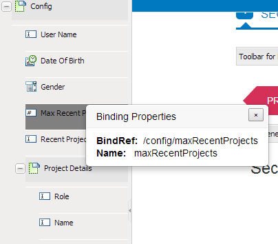

# Skapa anpassningsbara formulär med XML-schema{#creating-adaptive-forms-using-xml-schema}

## Förutsättningar {#prerequisites}

Att skapa ett anpassat formulär med ett XML-schema som formulärmodell kräver grundläggande kunskaper i XML-scheman. Du bör även läsa igenom följande innehåll före den här artikeln.

* [Skapa ett anpassat formulär](../../forms/using/creating-adaptive-form.md)
* [XML-schema](https://www.w3.org/TR/xmlschema-2/)

## Använda ett XML-schema som formulärmodell {#using-an-xml-schema-as-form-model}

AEM Forms har stöd för att skapa ett anpassningsbart formulär genom att använda ett befintligt XML-schema som formulärmodell. Det här XML-schemat representerar strukturen i vilken data produceras eller förbrukas av det bakomliggande systemet i organisationen.

De viktigaste funktionerna i ett XML-schema är:

* Strukturen för XSD visas som ett träd på fliken Innehållssökning i redigeringsläget för ett anpassat formulär. Du kan dra och lägga till element från XSD-hierarkin i det adaptiva formuläret.
* Du kan fylla i formuläret i förväg med XML som är kompatibelt med det associerade schemat.
* När data skickas skickas skickas de som användaren anger som XML som överensstämmer med det associerade schemat.

Ett XML-schema består av enkla och komplexa elementtyper. Elementen har attribut som lägger till regler i elementet. När dessa element och attribut dras till ett adaptivt formulär mappas de automatiskt till motsvarande adaptiv formulärkomponent.

Den här mappningen av XML-element med adaptiva formulärkomponenter är följande:

<table>
 <tbody>
  <tr>
   <th><strong>XML-element eller -attribut </strong></th>
   <th><strong>Adaptiv formkomponent</strong></th>
  </tr>
  <tr>
   <td><code>xs:string</code></td>
   <td>Textruta</td>
  </tr>
  <tr>
   <td><code>xs:boolean</code></td>
   <td>Kryssruta</td>
  </tr>
  <tr>
   <td>
    <ul>
     <li><code>xs:unsignedInt</code></li>
     <li><code>xs:xs:int</code></li>
     <li><code class="code">xs:decimal
        </code></li>
     <li>Alla typer av numeriska värden</li>
    </ul> </td>
   <td>Numerisk ruta</td>
  </tr>
  <tr>
   <td><code>xs:date</code></td>
   <td>Datumväljaren</td>
  </tr>
  <tr>
   <td><code class="code">xs:enumeration
      </code></td>
   <td>Nedrullningsbar listruta</td>
  </tr>
  <tr>
   <td>Alla komplexa element</td>
   <td>Panel</td>
  </tr>
 </tbody>
</table>

## XML-schema - exempel {#sample-xml-schema}

Här är ett exempel på ett XML-schema.

```xml
<?xml version="1.0" encoding="utf-8" ?>
    <xs:schema targetNamespace="https://adobe.com/sample.xsd"
                    xmlns="https://adobe.com/sample.xsd"
                    xmlns:xs="https://www.w3.org/2001/XMLSchema"
                >

        <xs:element name="sample" type="SampleType"/>

        <xs:complexType name="SampleType">
            <xs:sequence>
                <xs:element name="leaderName" type="xs:string" default="Enter Name"/>
                <xs:element name="assignmentStartBirth" type="xs:date"/>
                <xs:element name="gender" type="GenderEnum"/>
                <xs:element name="noOfProjectsAssigned" type="IntType"/>
                <xs:element name="assignmentDetails" type="AssignmentDetails"
                                            minOccurs="0" maxOccurs="10"/>
            </xs:sequence>
        </xs:complexType>

        <xs:complexType name="AssignmentDetails">
            <xs:attribute name="name" type="xs:string" use="required"/>
            <xs:attribute name="durationOfAssignment" type="xs:unsignedInt" use="required"/>
            <xs:attribute name="numberOfMentees" type="xs:unsignedInt" use="required"/>
             <xs:attribute name="descriptionOfAssignment" type="xs:string" use="required"/>
             <xs:attribute name="financeRelatedProject" type="xs:boolean"/>
       </xs:complexType>
  <xs:simpleType name="IntType">
            <xs:restriction base="xs:int">
            </xs:restriction>
        </xs:simpleType>
  <xs:simpleType name="GenderEnum">
            <xs:restriction base="xs:string">
                <xs:enumeration value="Female"/>
                <xs:enumeration value="Male"/>
            </xs:restriction>
        </xs:simpleType>
    </xs:schema>
```

>[!NOTE]
>
>Kontrollera att XML-schemat bara har ett rotelement. Ett XML-schema med mer än ett rotelement stöds inte.

## Lägga till specialegenskaper i fält med XML-schema {#adding-special-properties-to-fields-using-xml-schema}

Du kan lägga till följande attribut i XML-schemaelement om du vill lägga till specialegenskaper i fälten i det tillhörande adaptiva formuläret.

<table>
 <tbody>
  <tr>
   <th><strong>Schemaegenskap</strong></th>
   <th><strong>Användning i anpassningsbar form</strong></th>
   <th><strong>Stöds i </strong></th>
  </tr>
  <tr>
   <td><code>use=required </code></td>
   <td>Markerar ett fält obligatoriskt<br /> </td>
   <td>Attribut</td>
  </tr>
  <tr>
   <td><code>default="default value"</code></td>
   <td>Lägger till ett standardvärde</td>
   <td>Element och attribut</td>
  </tr>
  <tr>
   <td><code>minOccurs="3"</code></td>
   <td><p>Anger minsta antal förekomster</p> <p>(För repeterbara delformulär (komplexa typer))</p> </td>
   <td>Element (komplex text)</td>
  </tr>
  <tr>
   <td><code class="code">maxOccurs="10"
      </code></td>
   <td><p>Anger högsta antal förekomster</p> <p>(För repeterbara delformulär (komplexa typer))</p> </td>
   <td>Element (komplex text)</td>
  </tr>
 </tbody>
</table>

>[!NOTE]
>
>När du drar ett schemaelement till ett anpassat formulär skapas en standardbildtext av:
>
>* Inled det första tecknet i elementnamnet med versal
>* Infoga tomt utrymme vid gränserna för Camera Case.
>
>
Om du till exempel lägger till `userFirstName` schemaelementet, kommer den bildtext som genereras i det adaptiva formuläret att vara `User First Name`.

## Begränsa tillåtna värden för en adaptiv formulärkomponent {#limit-acceptable-values-for-an-adaptive-form-component}

Du kan lägga till följande begränsningar i XML-schemaelement för att begränsa vilka värden som tillåts för en adaptiv formulärkomponent:

<table>
 <tbody>
  <tr>
   <td><p><strong> Schemaegenskap</strong></p> </td>
   <td><p><strong>Datatyp</strong></p> </td>
   <td><p><strong>Beskrivning</strong></p> </td>
   <td><p><strong>Komponent</strong></p> </td>
  </tr>
  <tr>
   <td><p><code>totalDigits</code></p> </td>
   <td><p>Sträng</p> </td>
   <td><p>Anger maximalt antal siffror som tillåts i en komponent. Det angivna antalet siffror måste vara större än noll.</p> </td>
   <td>
    <ul>
     <li>Numerisk ruta</li>
     <li>Numerisk stege</li>
    </ul> </td>
  </tr>
  <tr>
   <td><p><code>maximum</code></p> </td>
   <td><p>Sträng</p> </td>
   <td><p>Anger den övre gränsen för numeriska värden och datum. Som standard inkluderas maxvärdet.</p> </td>
   <td>
    <ul>
     <li>Numerisk ruta</li>
     <li>Numerisk stege<br /> </li>
     <li>Datumväljaren</li>
    </ul> </td>
  </tr>
  <tr>
   <td><p><code>minimum</code></p> </td>
   <td><p>Sträng</p> </td>
   <td><p>Anger den nedre gränsen för numeriska värden och datum. Som standard inkluderas minimivärdet.</p> </td>
   <td>
    <ul>
     <li>Numerisk ruta</li>
     <li>Numerisk stege</li>
     <li>Datumväljaren</li>
    </ul> </td>
  </tr>
  <tr>
   <td><p><code>exclusiveMaximum</code></p> </td>
   <td><p>Boolesk</p> </td>
   <td><p>Om true måste det numeriska värdet eller datumet som anges i formulärets komponent vara mindre än det numeriska värdet eller datumet som anges för egenskapen maximum.</p> <p>Om värdet är false måste det numeriska värdet eller datumet som anges i formulärets komponent vara mindre än eller lika med det numeriska värdet eller datumet som anges för egenskapen maximum.</p> </td>
   <td>
    <ul>
     <li>Numerisk ruta</li>
     <li>Numerisk stege</li>
     <li>Datumväljaren</li>
    </ul> </td>
  </tr>
  <tr>
   <td><p><code>exclusiveMinimum</code></p> </td>
   <td><p>Boolesk</p> </td>
   <td><p>Om true måste det numeriska värdet eller datumet som anges i formulärets komponent vara större än det numeriska värdet eller datumet som anges för egenskapen minimum.</p> <p>Om värdet är false måste det numeriska värdet eller datumet som anges i formulärets komponent vara större än eller lika med det numeriska värdet eller datumet som anges för egenskapen minimum.</p> </td>
   <td>
    <ul>
     <li>Numerisk ruta</li>
     <li>Numerisk stege</li>
     <li>Datumväljaren</li>
    </ul> </td>
  </tr>
  <tr>
   <td><p><code>minLength</code></p> </td>
   <td><p>Sträng</p> </td>
   <td><p>Anger det minsta antalet tecken som tillåts i en komponent. Minimilängden måste vara lika med eller större än noll.</p> </td>
   <td>
    <ul>
     <li>Textruta</li>
    </ul> </td>
  </tr>
  <tr>
   <td><p><code>maxLength</code></p> </td>
   <td><p>Sträng</p> </td>
   <td><p>Anger maximalt antal tecken som tillåts i en komponent. Maxlängden måste vara större än noll.</p> </td>
   <td>
    <ul>
     <li>Textruta</li>
    </ul> </td>
  </tr>
  <tr>
   <td><p><code>length</code></p> </td>
   <td><p>Sträng</p> </td>
   <td><p>Anger det exakta antalet tecken som tillåts i en komponent. Längden måste vara lika med eller större än noll.</p> </td>
   <td>
    <ul>
     <li>Textruta</li>
    </ul> </td>
  </tr>
  <tr>
   <td><p><code>fractionDigits</code></p> </td>
   <td><p>Sträng</p> </td>
   <td><p>Anger maximalt antal decimaler som tillåts i en komponent. fractionDigits måste vara lika med eller större än noll.</p> </td>
   <td>
    <ul>
     <li> Numerisk ruta med datatypen flyttal eller decimal</li>
    </ul> </td>
  </tr>
  <tr>
   <td><p><code>pattern</code></p> </td>
   <td><p>Sträng</p> </td>
   <td><p>Anger teckensekvensen. En komponent accepterar tecknen om tecknen överensstämmer med det angivna mönstret.</p> <p>Egenskapen pattern mappar till valideringsmönstret för motsvarande adaptiva formulärkomponent.</p> </td>
   <td>
    <ul>
     <li>Alla adaptiva formulärkomponenter som är mappade till ett XSD-schema </li>
    </ul> </td>
  </tr>
 </tbody>
</table>

## Frågor och svar {#frequently-asked-questions}

**Hur vet jag vilket element i trädet som är associerat med vilket XML-element?**

När du dubbelklickar på ett element i Innehållssökning visas ett fältnamn och en egenskap med namnet `bindRef`. Den här egenskapen mappar trädelementet till elementet eller attributet i schemat.



I fältet bindRef</code> visas associationen mellan ett trädelement och ett element eller attribut i ett schema.

>[!NOTE]
>
>Attribut har en `@` symbol i `bindRef`värdet för att skilja dem från element. Exempel, `/config/projectDetails/@duration`.

**Varför kan jag inte dra enskilda element i ett delformulär (struktur som genereras från en komplex typ) för repeterbara delformulär (värdena minOcCours och maxOccurs är större än 1)?**

I ett upprepningsbart delformulär måste du använda hela delformuläret. Om du bara vill ha selektiva fält använder du hela strukturen och tar bort de oönskade.

**Jag har en lång komplex struktur i Content Finder. Hur hittar jag ett specifikt element?**

Du har två alternativ:

* Bläddra genom trädstrukturen
* Använd sökrutan för att hitta ett element

**Vad är en bindRef?**

A `bindRef` är anslutningen mellan en adaptiv formulärkomponent och ett schemaelement eller attribut. Det anger `XPath` var värdet som hämtas från den här komponenten eller det här fältet är tillgängligt i XML-utdata. A `bindRef`används också när ett fältvärde fylls i i förväg från förfylld (förifylld) XML.
