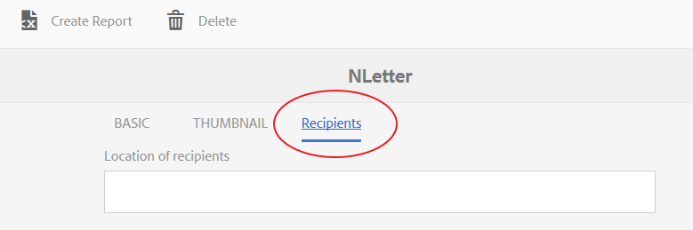
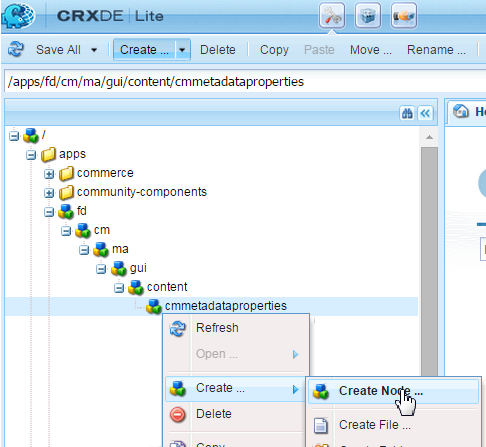
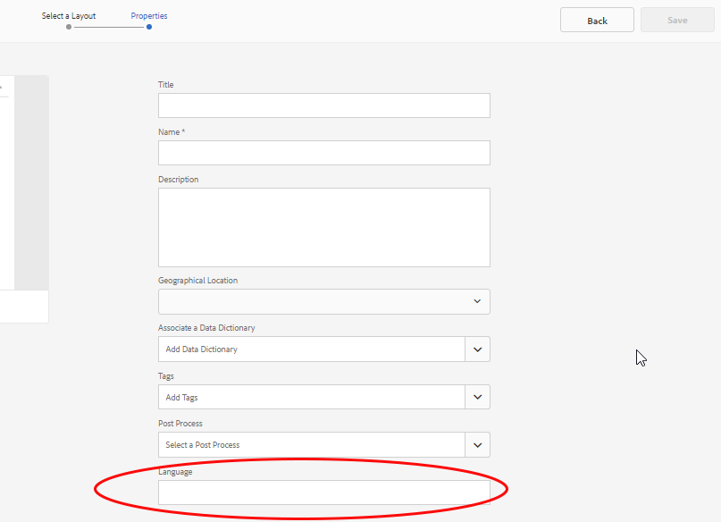

# Lägg till anpassade egenskaper i Correspondence Management-resurser{#add-custom-properties-to-correspondence-management-assets}

## Översikt {#overview}

Du kan anpassa gränssnittet för Correspondence Management och ge användarna en anpassad uppsättning egenskaper och flikar. Anpassningen innefattar att lägga till anpassade fält/egenskaper och flikar till specifika tillgångstyper/bokstäver eller alla resurstyper och bokstäver.

## Lägga till anpassade egenskaper i Correspondence Management-resurser {#adding-custom-properties-to-correspondence-management-assets}

I följande scenarier visas hur du kan lägga till egenskaper/flikar i resurser och bokstäver i Correspondence Management:

* Lägga till en gemensam egenskap för alla tillgångstyper
* Lägga till en gemensam flik till alla resurstyper
* Lägga till anpassade egenskaper till specifika resurstyper

Genom att ändra egenskaperna, banorna och värdena i dessa scenarier kan du lägga till anpassade egenskaper och flikar i en annan uppsättning resurser enligt dina önskemål.

### Scenario: Lägga till ett gemensamt fält (egenskap) till alla resurstyper {#scenario-adding-a-common-field-property-to-all-the-asset-types}

I det här scenariot visas hur du kan lägga till en anpassad egenskap för alla resurstyper (text, lista, villkor och layoutfragment) och bokstäverna. I det här scenariot kan du lägga till en egenskap, Plats för mottagare, i alla resurser och bokstäver. Egenskapen Plats för mottagare hjälper till att identifiera vilket geografiskt område för leverans en tillgång eller ett brev är relevant för.

>[!NOTE]
>
>Om du redan har lagt till en anpassad egenskap börjar egenskapen visas på sidan där resursen skapas. Om du vill dölja en sådan egenskap läser du Visa/dölj sidor för anpassade egenskaper när resurser skapas och egenskaper.


Följ de här stegen för att lägga till en anpassad egenskap för alla resurstyper och bokstäver:

1. Gå till `https://[server]:[port]/[ContextPath]/crx/de` och logga in som administratör.
1. I appen skapar du en mapp med namnet css med en sökväg/struktur som liknar css-mappen (finns i ccrui-mappen) enligt följande:

   1. Högerklicka på objektmappen i följande sökväg och välj **Overlay Node**:

      `/libs/fd/cm/ma/gui/content/cmmetadataproperties/commonproperties/col1/items`

      

   1. Kontrollera att dialogrutan Overlay Node har följande värden:

      **** Sökväg: /libs/fd/cm/ma/gui/content/cmmetadataproperties/commonproperties/col1/items

      **** Plats: /apps/

      **** Matcha nodtyper:Markerad

      

   1. Click **OK**. Mappstrukturen skapas i programmappen.

   1. Klicka på **Spara alla**.

1. Lägg till en nod för den anpassade egenskapen i alla resurser under den nyligen skapade objektmappen (Exempel: GeoLocation) med följande steg:

   1. Högerklicka på objektmappen och välj **Skapa** > **Skapa nod**.

      

   1. Se till att dialogrutan Skapa nod har följande värden och klicka på **OK**:

      **** Namn: GeoLocation (eller det namn du vill ge till den här egenskapen)

      **** Typ:nt:ostrukturerad

      

   1. Klicka på den nya noden som du har skapat (här GeoLocation). CRX visar nodens egenskaper.
   1. Lägg till följande egenskaper i noden (här GeoLocation):

      | **Namn** | **Typ** | **Värde** |
      |---|---|---|
      | fieldLabel | Sträng | Namnet som du vill ge fältet/egenskapen. (Här: Mottagarnas plats) |
      | name | Sträng | `./extendedproperties/GeoLocation` (Behåll värdet som det fältnamn du skapade under noden Objekt) |
      | renderReadOnly | Boolesk | true |
      | sling:resourceType | Sträng | `granite/ui/components/coral/foundation/form/textfield` |

   1. Klicka på **Spara alla**.

1. Om du vill visa din anpassning håller du pekaren över en resurs (text, lista, villkor eller layoutfragment) eller bokstav, klickar på **Visa egenskaper** och klickar på **Redigera**. Det nya fältet (mottagarplats) visas på fliken Grundläggande i egenskaperna för resursen/bokstaven.

   >[!NOTE]
   >
   >Du kan behöva rensa webbläsarens cache innan din anpassning visas i användargränssnittet.

   

   >[!NOTE]
   >
   >De gemensamma egenskaperna för alla resurser som du lägger till visas på fliken Grundläggande i resursegenskaperna. Som standard visas de gemensamma egenskaper som lagts till för alla resurser på egenskapssidan samt på sidan för att skapa resurser. Om du vill dölja de gemensamma egenskaperna måste du <!--link to show / hide properties]-->.

### Scenario: Lägga till anpassad listruta och värden till en anpassad egenskap/ett anpassat fält {#scenario-add-custom-drop-down-and-values-to-a-custom-property-field}

I det här scenariot visas hur du kan lägga till en anpassad egenskap för alla resurstyper och lägga till nedrullningsbara värden i den.

1. Högerklicka på objektmappen i följande sökväg och välj **Overlay Node**:

   `/libs/fd/cm/ma/gui/content/cmmetadataproperties/commonproperties/col1/items`

1. Under den nyligen skapade överläggsnoden (/apps/fd/cm/ma/gui/content/cmmetadataproperties/common_properties/col1/items) skapar du en nod för varje egenskap (fält) som du behöver skapa en nedrullningsbar (här `geographicallocation`) av typen nt:undefined.
1. Lägg till följande egenskaper i noden (här geografiska platsen) och klicka på **Spara alla**:

   <table>
   <tbody>
   <tr>
      <td><strong>Namn</strong></td>
      <td><strong>Typ</strong></td>
      <td><strong>Värde</strong></td>
   </tr>
   <tr>
      <td>fieldLabel</td>
      <td>Sträng</td>
      <td>Namnet som du vill ge fältet/egenskapen. (Här: geografisk placering)</td>
   </tr>
   <tr>
      <td>name</td>
      <td>Sträng</td>
      <td>./extendedproperties/geogracalllocation (Behåll värdet som det fältnamn du skapade under noden items)</td>
   </tr>
   <tr>
      <td>renderReadOnly</td>
      <td>Boolesk</td>
      <td>true</td>
   </tr>
   <tr>
      <td>sling:resourceType</td>
      <td>Sträng</td>
      <td>granite/ui/components/coral/foundation/form/select<br /> </td>
   </tr>
   </tbody>
   </table>

1. Lägg till en ny nod med namnet under egenskapsnoden (här geografisk placering) `items`. Under noden items lägger du till en nod för varje värde i listrutan. Som en god vana lägger du till den första noden så tom att den fungerar som standardvärde för listrutan och ett alternativ för användaren att inte ange något värde för fältet. Om du vill lägga till flera alternativ/nedrullningsbara värden upprepar du följande steg:

   1. Högerklicka på egenskapsnoden (här geografisk plats) och välj **Skapa** > **Skapa nod**.
   1. Ange namnet på fältet med bibehållen typ som inte:ostrukturerad och klicka på `item1,` OK ****.
   1. Lägg till följande egenskaper i den nya noden (här post1) och klicka sedan på **Spara alla**:

      <table>
         <tbody>
         <tr>
          <td><strong>Namn</strong></td>
          <td><strong>Typ</strong></td>
          <td><strong>Värde</strong></td>
         </tr>
         <tr>
          <td>text</td>
          <td>Sträng</td>
          <td>Det här är värdet på det nedrullningsbara alternativet som är synligt för användaren. Behåll det tomt för det tomma (standardvärdet) eller ange värdet, till exempel <strong>International</strong> eller <strong>Within US</strong>.<br /> </td>
         </tr>
         <tr>
          <td>value</td>
          <td>Sträng</td>
          <td>Värdet som lagras i CRXDE för texten. Ange ett unikt nyckelord. <br /> </td>
         </tr>
         </tbody>
   </table>

   

Den anpassade listrutan visas enligt följande i resursegenskaper:


### Scenario: Fliken Gemensamt för alla resurstyper {#scenario-common-tab-for-all-asset-types}

I det här scenariot visas hur du kan lägga till en anpassad flik, Mottagare, i alla resurstyper (text, lista, villkor och layoutfragment) och bokstäverna. På fliken Mottagare kan du planera för att alla anpassade egenskaper ska vara relevanta för mottagarna.



Med följande procedur kan du lägga till en flik med ett fält i alla resurser:

1. Gå till `https://[server]:[port]/[ContextPath]/crx/de` och logga in som administratör.
1. I mappen apps skapar du en mapp med namnet cmmetadataProperties med en sökväg/struktur som liknar mappen för metadataegenskaper (som finns i innehållsmappen) enligt följande:

   1. Högerklicka på mappen för metadataegenskaper på följande sökväg och välj **Överläggsnod**:

      `/libs/fd/cm/ma/gui/content/cmmetadataproperties`

      

   1. Kontrollera att dialogrutan Overlay Node har följande värden:

      **** Sökväg: /libs/fd/cm/ma/gui/content/cmmetadataproperties

      **** Plats: /apps/

      **** Matcha nodtyper:Markerad

   1. Click **OK**. Mappstrukturen skapas i programmappen.

      

      Klicka på **Spara alla**.

1. Lägg till en nod för att skapa en anpassad flik för alla resurser i mappen cmmetadata-properties (Exempel: vanliga) med följande steg:

   1. Högerklicka på mappen för metadataegenskaper och välj **Skapa** > **Skapa nod**.

      

   1. Se till att dialogrutan Skapa nod har följande värden och klicka på **OK**:

      **** Namn: commontab (eller det namn du vill ge den här egenskapen)

      **** Typ:nt:ostrukturerad

   1. Klicka på den nya noden som du har skapat (här vanlig flik). CRX visar nodens egenskaper.
   1. Lägg till följande egenskaper i noden (här vanlig flik):

      <table>
         <tbody>
         <tr>
          <td><strong>Namn</strong></td>
          <td><strong>Typ</strong></td>
          <td><strong>Värde</strong></td>
         </tr>
         <tr>
          <td>jcr:title</td>
          <td>Sträng</td>
          <td>Namnet som du vill ge kolumnen. (Här: Mottagare)</td>
         </tr>
         <tr>
          <td>sling:resourceType</td>
          <td>Sträng</td>
          <td>granite/ui/components/coral/foundation/container<br /> </td>
   </tr>
         </tbody>
       </table>

   1. Klicka på **Spara alla**.

1. För den tabbnod som skapades i det senaste steget (här på vanlig flik) skapar du en nod med namnet item med följande steg:

   1. Högerklicka på den relevanta noden (här vanlig flik) och välj **Skapa** > **Skapa nod**.
   1. Se till att dialogrutan Skapa nod har följande värden och klicka på **OK**:

      **** Namn: objekt

      **** Typ:nt:ostrukturerad

   1. Klicka på **Spara alla:**

1. I noden items som du skapade i föregående steg (under fliken Common) lägger du till en nod för att skapa en kolumn (här Column1) på den anpassade fliken (vanlig flik) med följande steg (om du vill lägga till fler kolumner upprepar du det här steget):

   1. Högerklicka på objektnoden och välj **Skapa** > **Skapa nod**.
   1. Se till att dialogrutan Skapa nod har följande värden och klicka på **OK**:

      **** Namn: Kolumn1 (eller namnet som du vill ge noden - det här namnet visas inte i användargränssnittet.)

      **** Typ:nt:ostrukturerad

   1. Lägg till följande egenskap i noden (här Kolumn1) och klicka sedan på **Spara alla**:

      <table>
         <tbody>
         <tr>
           <td><strong>Namn</strong></td>
           <td><strong>Typ</strong></td>
           <td><strong>Värde</strong></td>
         </tr>
         <tr>
           <td>sling:resourceType</td>
           <td>Sträng</td>
           <td>granite/ui/components/coral/foundation/container<br /> </td>
         </tr>
         </tbody>
       </table>

1. I noden som du skapade i föregående steg (här Column1) lägger du till en nod som kallas för objekt enligt följande:

   1. Högerklicka på noden (här Kolumn1) och välj **Skapa** > **Skapa nod**.
   1. Se till att dialogrutan Skapa nod har följande värden och klicka på **OK**:

      **** Namn: objekt

      **** Typ:nt:ostrukturerad

   1. Klicka på **Spara alla**.

1. Om du vill skapa ett fält på den anpassade fliken (här Mottagare) lägger du till en nod (här GeographicalLocation). Den här egenskapen motsvarar kolumnen som du skapade. Följ de här stegen för att skapa fältet (om du vill skapa fler fält/noder upprepar du de här stegen).:

   1. Högerklicka på objektnoden och välj **Skapa** > **Skapa nod**.
   1. Se till att dialogrutan Skapa nod har följande värden och klicka på **OK**:

      **** Namn: GeographicalLocation (eller ett annat namn för fältegenskapen)

      **** Typ:nt:ostrukturerad

   1. Lägg till följande egenskaper i fältnoden (här GeographicalLocation) och klicka på **Spara alla**.

      | **Namn** | **Typ** | **Värde** |
      |---|---|---|
      | fieldLabel | Sträng | Mottagarnas plats (eller namnet som du vill ge fältet). |
      | name | Sträng | ./extendedproperties/GeographicalLocation |
      | renderReadOnly | Boolesk | true |
      | sling:resourceType | Sträng | `/libs/granite/ui/components/coral/foundation/form/textfield` |

1. Om du vill lägga till den här fliken för Bokstäver skapar du en övertäckningsmapp med en sökväg/struktur som liknar följande objektmapp i följande sökväg:

   `/libs/fd/cm/ma/gui/content/cmmetadataproperties/properties/letter/items/tabs/items`

   Om du vill skapa en övertäckning för en bokstav eller en annan resurs använder du följande sökväg genom att ersätta [resurstypen] med text, villkor, lista, ordlista eller fragment:

   `/libs/fd/cm/ma/gui/content/cmmetadataproperties/properties/[assettype]/items/tabs/items`

   1. Högerklicka på objektmappen i följande sökväg och välj **Overlay Node**:

      `/libs/fd/cm/ma/gui/content/cmmetadataproperties/properties/letter/items/tabs/items`

   1. Kontrollera att dialogrutan Overlay Node har följande värden:

      **** Sökväg: `/libs/fd/cm/ma/gui/content/cmmetadataproperties/properties/letter/items/tabs/items`

      **** Plats: /apps/

      **** Matcha nodtyper:Markerad

   1. Click **OK**. Mappen skapas. Klicka på **Spara alla**.

1. I den nyligen skapade objektmappen lägger du till en nod för den anpassade fliken i resursen (här kan du klicka på fliken - det här namnet visas inte i användargränssnittet) enligt följande steg:

   1. Högerklicka på objektmappen och välj **Skapa** > **Skapa nod**.
   1. Se till att dialogrutan Skapa nod har följande värden och klicka på **OK**:

      **** Namn: mytab (eller det namn du vill ge den här egenskapen)

      **** Typ:nt:ostrukturerad

   1. Klicka på den nya noden som du har skapat (här minfliken). CRX visar nodens egenskaper.
   1. Lägg till följande två egenskaper i noden (här fliken Custom):

      <table>
         <tbody>
         <tr>
           <td><strong>Namn</strong></td>
           <td><strong>Typ</strong></td>
           <td><strong>Värde</strong></td>
         </tr>
         <tr>
           <td>path<br /> </td>
           <td>Sträng</td>
           <td>fd/cm/ma/gui/content/cmmetadataproperties/commontab<br /> </td>
         </tr>
         <tr>
           <td>sling:resourceType</td>
           <td>Sträng</td>
           <td>granite/ui/components/coral/Foundation/include<br /> </td>
         </tr>
         </tbody>
       </table>

   1. Klicka på **Spara alla**.

1. Om du vill visa din anpassning för du muspekaren över den aktuella resursen (här ett brev), klickar på Visa egenskaper och sedan på **Redigera**. Den nya fliken (Mottagare) och det nya fältet (Mottagarens plats) visas i användargränssnittet.

   >[!NOTE]
   >
   >Du kan behöva rensa webbläsarens cache innan din anpassning visas i användargränssnittet.

   

### Scenario: Lägga till anpassade egenskaper för specifika resurstyper {#scenario-adding-custom-properties-for-specific-asset-types}

I det här scenariot visas hur du kan lägga till en egenskap för en viss resurstyp, till exempel ett fält i alla textresurser. Med den här processen kan du lägga till egenskaper i något av följande:

* Text
* Villkor
* Lista
* Layoutfragment
* Dataordlista
* Bokstaven

Om du till exempel bara vill lägga till en egenskap, Plats för mottagare, för att identifiera vilket geografiskt område en resurs är relevant för.  

Så här lägger du till en egenskap till en resurstyp:

1. Gå till `https://[server]:[port]/[ContextPath]/crx/de` och logga in som administratör.
1. Om du vill skapa en flik i en resurstyp (till exempel Text) skapar du följande mappstruktur i mappen Apps:

   `/libs/fd/cm/ma/gui/content/cmmetadataproperties/properties/[AssetType]/items/tabs/items`

   [AssetType] = text, villkor, lista, bokstav, dataordlista eller fragment

   Så här skapar du den här mappstrukturen:

   1. Högerklicka på objektmappen i följande sökväg och välj **Overlay Node**:

      `/libs/fd/cm/ma/gui/content/cmmetadataproperties/properties/[AssetType]/items/tabs/items`

      Om du till exempel vill skapa en egenskap för textresurser väljer du följande mapp:

      `/libs/fd/cm/ma/gui/content/cmmetadataproperties/properties/text/items/tabs/items`

      

   1. Kontrollera att dialogrutan Overlay Node har följande värden:

      **** Sökväg: /libs/fd/cm/ma/gui/content/cmmetadataproperties/properties/[AssetType]/items/tabs/items

      **** Plats: /apps/

      **** Matcha nodtyper:Markerad

   1. Click **OK**. Mappstrukturen skapas i programmappen.

      Klicka på **Spara alla**.

1. Lägg till en nod för den anpassade fliken i resursen i mappen för nyligen skapade objekt (Exempel: anpassad (flik) med följande steg:

   1. Högerklicka på objektmappen och välj **Skapa** > **Skapa nod**.
   1. Se till att dialogrutan Skapa nod har följande värden och klicka på **OK**:

      **** Namn: egen flik (eller namnet som du vill ge den här egenskapen)

      **** Typ:nt:ostrukturerad

   1. Klicka på den nya noden som du har skapat (här fliken Egen). CRX visar nodens egenskaper.
   1. Lägg till följande två egenskaper i noden (här fliken Custom):

      | **Namn** | **Typ** | **Värde** |
      |---|---|---|
      | sling:resourceType | Sträng | granite/ui/components/coral/foundation/container |
      | jcr:title | Sträng | Fältets namn i användargränssnittet (här fliken Min) |

   1. Klicka på **Spara alla**.

1. I noden som du skapade i föregående steg (här på den egna fliken) lägger du till en nod med namnet items med följande steg:

   1. Högerklicka på noden (här fliken) och välj **Skapa** > **Skapa nod**.
   1. Se till att dialogrutan Skapa nod har följande värden och klicka på **OK**:

      **** Namn: objekt

      **** Typ:nt:ostrukturerad

   1. Klicka på **Spara alla**.

1. I noden items som du skapade i föregående steg (under fliken Custom) lägger du till en nod för att skapa en kolumn (här Column1) på den anpassade fliken med följande steg (om du vill lägga till fler kolumner upprepar du det här steget):

   1. Högerklicka på objektnoden och välj **Skapa** > **Skapa nod**.
   1. Se till att dialogrutan Skapa nod har följande värden och klicka på **OK**:

      **** Namn: Column1 (eller det namn du vill ge noden)

      **** Typ:nt:ostrukturerad

   1. Lägg till följande egenskap i noden (här Kolumn1) och klicka sedan på **Spara alla**.

      <table>
         <tbody>
         <tr>
           <td><strong>Namn</strong></td>
           <td><strong>Typ</strong></td>
           <td><strong>Värde</strong></td>
         </tr>
         <tr>
           <td>sling:resourceType</td>
           <td>Sträng</td>
           <td>granite/ui/components/coral/foundation/container<br /> </td>
         </tr>
         </tbody>
       </table>

1. För varje kolumn som du skapar (enligt föregående steg - här Kolumn1) skapar du en nod med namnet item med följande steg:

   1. Högerklicka på den relevanta kolumnnoden (här Kolumn1) och välj **Skapa** > **Skapa nod**.
   1. Se till att dialogrutan Skapa nod har följande värden och klicka på **OK**:

      **** Namn: objekt

      **** Typ:nt:ostrukturerad

   1. Klicka på **Spara alla:**

1. För var och en av de kolumner som skapas skapar du en nod under noden items som du kan använda för att skapa ett fält på den nya fliken i användargränssnittet. Upprepa det här steget om du vill skapa fler fält i kolumnen:

   1. Högerklicka på den relevanta noden (här objekten under Kolumn1) och välj **Skapa** > **Skapa nod**.
   1. Se till att dialogrutan Skapa nod har följande värden och klicka på **OK**:

      **** Namn: Välj ett namn (här GeoLocation)

      **** Typ:nt:ostrukturerad

   1. Lägg till följande egenskaper i noden och klicka sedan på **Spara alla**.

      | **Namn** | **Typ** | **Värde** |
      |---|---|---|
      | fieldLabel | Sträng | Mottagarnas plats (eller namnet som du vill ge fältet). |
      | name | Sträng | `./extendedproperties/GeoLocation` |
      | renderReadOnly | Boolesk | true |
      | sling:resourceType | Sträng | granite/ui/components/coral/foundation/form/textfield |

1. Om du vill visa din anpassning för du muspekaren över den aktuella resursen (här finns en text), klickar på Visa egenskaper och sedan på **Redigera**. Den nya fliken och det nya fältet (mottagarplats) visas i användargränssnittet.

   >[!NOTE]
   >
   >Du kan behöva rensa webbläsarens cache innan din anpassning visas i användargränssnittet.

   

### Visa anpassade egenskaper på sidan Skapa resurs {#display-custom-properties-on-the-asset-creation-page}

Som standard visas anpassade egenskaper som lagts till på nya flikar bara på egenskapssidan och inte på sidan där resursen skapas, eftersom sidan där resursen skapas inte har någon fliklayout. Om du vill visa anpassade egenskaper på sidan där resurser skapas tillsammans med andra egenskaper måste du göra följande:

1. Högerklicka på objektmappen i följande sökväg och välj **Overlay Node**:

   `/libs/fd/cm/ma/gui/content/createasset/createletter/jcr:content/body/items/form/items/letterWizard/items/properties/items/properties/items/letterproperties/items`

1. Kontrollera att dialogrutan Overlay Node har följande värden för letter. För andra tillgångstyper anges sökväg i följande tabell:

   **** Sökväg: /libs/fd/cm/ma/gui/content/create/asset/createletter/jcr:content/body/items/form/items/letterWizard/items/properties/items/items/items/letterproperties/items

   **** Plats: /apps/

   **** Matcha nodtyper:Markerad

   Beroende på resurstypen måste följande vara sökvägen:

   | **Tillgång/dokumenttyp** | **Sökväg som ska läggas till** |
   |---|---|
   | Text | /libs/fd/cm/ma/gui/content/create/asset/createtext/jcr:content/body/items/form/items/textwizard/items/editproperties/items/properties/items/tabs/items/tab1/items |
   | Lista | /libs/fd/cm/ma/gui/content/create/asset/create/list/jcr:content/body/items/form/items/list/wizard/items/editproperties/items/items/items/tabs/items/tab1/items |
   | Villkor | /libs/fd/cm/ma/gui/content/create/asset/createcondition/jcr:content/body/items/form/items/Conditionwizard/items/editproperties/items/properties/items/tabs/items/tab1/items |
   | Fragment | /libs/fd/cm/ma/gui/content/create/asset/createfragment/jcr:content/body/items/form/items/splittwizard/items/properties/items/items/items/items/tabs2/items/tab1/items |
   | Bokstaven |  /libs/fd/cm/ma/gui/content/create/asset/createletter/jcr:content/body/items/form/items/letterWizard/items/properties/items/items/items/letterproperties/items |

1. Click **OK**. Mappstrukturen skapas i programmappen.

1. Skapa en nod med namnet col4 (eller något annat namn) under noden för överläggsobjekt som du skapade och klicka på **Spara alla**.

   Här följer till exempel den överläggsnod som skapas för bokstäver.

   `/apps/fd/cm/ma/gui/content/createasset/createletter/jcr:content/body/items/form/items/letterWizard/items/properties/items/properties/items/letterproperties/items`

1. Lägg till följande egenskaper i den nyligen skapade noden (här kolumn 4) och klicka på **Spara alla**:

<table>
 <tbody>
  <tr>
   <td><strong>Namn</strong></td>
   <td><strong>Typ</strong></td>
   <td><strong>Värde</strong></td>
  </tr>
  <tr>
   <td>path</td>
   <td>Sträng</td>
   <td><p>Den här sökvägen är pekaren till kolumnen som skapas i:</p>
    <ul>
     <li>För vanliga flikar för alla resurstyper: /apps/fd/cm/ma/gui/content/cmmetadataproperties/commontab/items/col1</li>
     <li>För olika egenskaper för olika resurstyper: /apps/fd/cm/ma/gui/content/cmmetadataproperties/properties/items/tabs/items/customtab/items/col1</li>
    </ul> </td>
  </tr>
  <tr>
   <td>sling:resourceType</td>
   <td>Sträng</td>
   <td> granite/ui/components/coral/Foundation/include<br /> </td>
  </tr>
 </tbody>
</table>



Anpassad egenskap, Språk, som visas i användargränssnittet för att skapa ett brev

## Anpassa listvyn för att visa anpassade egenskaper {#customize-the-list-view-to-show-custom-properties}

När du har lagt till en anpassad egenskap i Correspondence Management-resurser måste du göra ytterligare ändringar i CRX/DE för att se till att den anpassade egenskapen visas i Correspondence Management-gränssnittet.

Följ de här stegen för att visa den anpassade egenskapen i resurslistan för Correspondence Management-gränssnittet:

1. Gå till `https://[server]:[port]/[ContextPath]/crx/de` och logga in som administratör.
1. Skapa följande mappstruktur i mappen apps:

   `/libs/fd/cm/ma/gui/content/cmassets/jcr:content/views/lists/columns`

   Så här skapar du den här mappstrukturen:

   1. Högerklicka på kolumnmappen vid följande sökväg och välj **Överläggsnod**:

      `/libs/fd/cm/ma/gui/content/cmassets/jcr:content/views/lists/columns`

   1. Kontrollera att dialogrutan Overlay Node har följande värden:

      **** Sökväg: /libs/fd/cm/ma/gui/content/cmassets/jcr:content/views/lists/columns

      **** Plats: /apps/

      **** Matcha nodtyper:Markerad

   1. Click **OK**. Mappstrukturen skapas i programmappen.

      Klicka på **Spara alla**.

1. Skapa en nod under kolumnnoden för att skapa en kolumn i användargränssnittet för varje egenskap som skapas. Upprepa det här steget om du vill skapa fler kolumner i användargränssnittet:

   1. Högerklicka på den relevanta noden (kolumnerna) och välj **Skapa** > **Skapa nod**.
   1. Se till att dialogrutan Skapa nod har följande värden och klicka på **OK**:

      **** Namn: Ett namn som du väljer (här GeographicalLocation)

      **** Typ:nt:ostrukturerad

   1. Lägg till följande egenskaper i noden och klicka sedan på **Spara alla**.

      <table>
         <tbody>
         <tr>
           <td><strong>Namn</strong></td>
           <td><strong>Typ</strong></td>
           <td><strong>Värde</strong></td>
         </tr>
         <tr>
           <td>jcr:primärType</td>
           <td>Namn</td>
           <td><p>nt:ostrukturerad</p> </td>
         </tr>
         <tr>
           <td>jcr:title</td>
           <td>Sträng</td>
           <td><p>GeographicalLocation</p> <p>Det här värdet visas som kolumnrubrik i användargränssnittet. </p> </td>
         </tr>
         <tr>
           <td>sorterbar</td>
           <td>Boolesk</td>
           <td><p>true</p> <p>Värdet true innebär att användaren kan sortera värdena i den här kolumnen. </p> </td>
         </tr>
         </tbody>
       </table>

1. Skapa följande mappstruktur i mappen apps:

   `/libs/fd/cm/ma/gui/components/admin/childpagerenderer/childlistpage`

   Så här skapar du den här mappstrukturen:

   1. Högerklicka på kolumnmappen vid följande sökväg och välj **Överläggsnod**:

      `/libs/fd/cm/ma/gui/components/admin/childpagerenderer/childlistpage`

   1. Kontrollera att dialogrutan Overlay Node har följande värden:

      **** Sökväg: /libs/fd/cm/ma/gui/components/admin/childpagerenderer/childlistpage

      **** Plats: /apps/

      **** Matcha nodtyper:Markerad

   1. Click **OK**. Mappstrukturen skapas i programmappen.

      Klicka på **Spara alla**.

1. Kopiera filen childlistpage.jsp från följande plats:

   /libs/fd/cm/ma/gui/components/admin/childpagerenderer/childlistpage/childlistpage.jsp

   Klistra in filen på följande plats:

   /apps/fd/cm/ma/gui/components/admin/childpagerenderer/childlistpage/.

1. Öppna filen childlistpage.jsp (/apps/fd/cm/ma/gui/components/admin/childpagerenderer/childlistpage/childlistpage.jsp) och gör följande ändringar:

   1. Lägg till följande på rad 19 i filen (efter copyright-programsatsen).

      ```
      <%@page import="java.util.Map"%>
      ```

   1. Lägg till följande kod för en funktion som hämtar värde för varje anpassad egenskap i slutet av filen:

      ```
      <%!
          private String getCustomPropertyValue(Map<String, Object> extendedProperties, String propertyName) {
      
              String propertyValue = "";
              if (extendedProperties.containsKey(propertyName)) {
                  propertyValue = (String) extendedProperties.get(propertyName);
              }
      
              return propertyValue;
          }
      %>
      ```

   1. Lägg till följande innan &lt;tr>-taggen börjar (&lt;tr &lt;%= attributes.build() %>>):

      ```
      <%
          String GeoLocation = "";
          if (asset != null) {
                  Map<String, Object> extendedProperties = asset.getExtendedProperties();
                  if (extendedProperties != null) {
                      GeoLocation = getCustomPropertyValue(extendedProperties,"GeoLocation");
                  }
          }
      %>
      ```

      I koden är GeoLocation det värde som du anger i namnegenskapen när du skapar den anpassade noden/fältet. När du skapade en anpassad nod/fält angav du namnet på egenskapen med ./extendedproperties/ prefix: ./extendedproperties/GeoLocation. I koden är prefixet inte obligatoriskt.

   1. Om du vill visa den nya egenskapen i gränssnittet lägger du till en TD-tagg enligt följande före den avslutande tr-taggen (&lt;/tr>):

      ```
      <td is="coral-td" value="<%= xssAPI.encodeForHTMLAttr(geographicalLocation) %>"><%= xssAPI.encodeForHTML(geographicalLocation) %></td>
      ```

      Om du vill lägga till fler kolumner upprepar du steg 6.3 och 6.4.

   1. Klicka på **Spara alla**.

1. Om du vill visa din anpassning öppnar du en listvy över dokumentfragment eller bokstäver som du har lagt till den anpassade egenskapen i.

   Den användargränssnittskolumn och egenskap som läggs till i den här proceduren visas för alla resurstyper. Värdena i dessa egenskaper kan dock bara anges och visas för de resurstyper som du ursprungligen lade till den anpassade egenskapen för.

   Använd till exempel Scenario: Om du lägger till anpassade egenskaper för specifika resurstyper som du lägger till en anpassad egenskap i textresurser kan du bara ange anpassade egenskaper i textresurser. Om du däremot visar den anpassade egenskapen i användargränssnittet visas kolumnen för alla resurstyper.

   

1. (Valfritt) Som standard visas den nya kolumnen som den sista kolumnen i användargränssnittet. Om du vill att kolumnen ska visas på en viss plats lägger du till följande egenskap i kolumnnoden:

<table>
 <tbody>
  <tr>
   <td><strong>Namn</strong></td>
   <td><strong>Typ</strong></td>
   <td><strong>Värde</strong></td>
  </tr>
  <tr>
   <td>sling:orderBefore</td>
   <td>Sträng</td>
   <td><p>Namnet på kolumnnoden vid sökvägen "/libs/fd/cm/ma/gui/content/comassets/jcr:content/views/list/columns" före vilket en anpassad kolumn måste visas i användargränssnittet.</p> <p>Här, om du vill att kolumnen Geografisk plats ska visas före (till vänster om) kolumnen Version, lägger du till egenskapen sling:orderBefore i noden GeoLocation på sökvägen ""/apps/fd/cm/ma/gui/content/cmassets/jcr:content/views/list/columns/GeoLocation" och anger värdet för egenskapen till version.</p> </td>
  </tr>
 </tbody>
</table>

När du lägger till egenskapen sling:orderBefore för att ange kolumnplatsen måste du också uppdatera ordningen för motsvarande &lt;td>-tagg som anges i steg 6.4 i den här proceduren. I det här fallet måste du till exempel se till att taggen &lt;td> för Geografisk plats placeras före taggen &lt;td> för kolumnen Version:

```xml
<td is="coral-td" value="<%= xssAPI.encodeForHTMLAttr(geographicalLocation) %>"><%= xssAPI.encodeForHTML(geographicalLocation) %></td>
<td is="coral-td" value="<%= xssAPI.encodeForHTMLAttr(version) %>"><%= xssAPI.encodeForHTML(version) %></td>
```

## Aktivera sökning efter anpassade egenskaper {#enable-search-for-custom-properties}

Som standard innehåller inte fulltextsökning anpassade egenskaper som du lägger till i användargränssnittet med CRX/DE.

Om du vill inkludera anpassade egenskaper i sökningen måste du tillåta indexering av anpassade egenskaper.

Så här tillåter du indexering av anpassade egenskaper:

1. Gå till `https://[server]:[port]/[ContextPath]/crx/de` och logga in som administratör.
1. Gå till `/oak:index/cmLucene`och lägg till en nod med namnet **aggregates** under den.

   1. Högerklicka på mappen cmLucene och välj **Skapa** > **Skapa nod**.
   1. Se till att dialogrutan Skapa nod har följande värden och klicka på **OK**:

      **** Namn: aggregat

      **** Typ:nt:ostrukturerad

   1. Klicka på **Spara alla**.

1. Lägg till noden cm:resource under den nyligen skapade aggregatmappen. Under cm:resource lägger du till en nod med namnet include0.

   1. Högerklicka på aggregatmappen och välj **Skapa** > **Skapa nod**. Se till att dialogrutan Skapa nod har följande värden och klicka på **OK**:

      **** Namn: cm:resource

      **** Typ:nt:ostrukturerad

   1. Högerklicka på mappen cm:resource och välj **Skapa** > **Skapa nod**. Se till att dialogrutan Skapa nod har följande värden och klicka på **OK**:

      **** Namn: include0

      **** Typ:nt:ostrukturerad

   1. Klicka på den nya noden som du har skapat (här är include0). CRX visar nodens egenskaper.
   1. Lägg till följande egenskap i noden (här include0):

      <table>
         <tbody>
         <tr>
           <td><strong>Namn</strong></td>
           <td><strong>Typ</strong></td>
           <td><strong>Värde</strong></td>
         </tr>
         <tr>
           <td>path</td>
           <td>Sträng</td>
           <td>extendedProperties<br /> </td>
         </tr>
         </tbody>
       </table>

   1. Klicka på **Spara alla**.

1. Gå till egenskaperna på följande plats och lägg till en nodplats under den: `/oak:index/cmLucene/indexRules/cm:resource/properties`

   Upprepa det här steget för alla anpassade egenskaper som du vill lägga till i sökningen.

   1. Högerklicka på egenskapsmappen och välj **Skapa** > **Skapa nod**.
   1. Se till att dialogrutan Skapa nod har följande värden och klicka på **OK**:

      **** Namn: plats (eller namnet på den anpassade egenskap som du vill lägga till i sökningen)

      **** Typ:nt:ostrukturerad

   1. Klicka på den nya noden som du har skapat (här). CRX visar nodens egenskaper.
   1. Lägg till följande egenskaper i noden (här):

      | **Namn** | **Typ** | **Värde** |
      |---|---|---|
      | analyserad | Sträng | true |
      | name | Sträng | extendedProperties/location (eller namnet på egenskapen som du vill lägga till i sökningen) |
      | propertyIndex | Boolesk | true |
      | useInSuggest | Boolesk | true |

   1. Klicka på **Spara alla**.

1. Nu kan du använda anpassade egenskapsvärden i fulltextsökning för att hitta relevanta resurser.

>[!NOTE]
>
>Om du fortfarande inte kan söka kan det bero på ett indexeringsproblem. Om du vill indexera om går du till följande nod och ändrar värdet för egenskapen &quot;re-index&quot; till true:
>
>/oak:index/cmLucene&quot; och ändra egenskapens värde

## Ändra standardvy för söksidan {#change-default-view-of-the-search-page}

1. Gå till `https://[server]:[port]/[ContextPath]/crx/de` och logga in som administratör.
1. I mappen apps skapar du en mapp med namnet list med en sökväg/struktur som liknar listmappen i /libs/granite/ui/content/shell/omnissearch/searchresults/singleresults/views:

   1. Högerklicka på objektmappen i följande sökväg och välj **Overlay Node**:

      `/libs/granite/ui/content/shell/omnisearch/searchresults/singleresults/views/list`

   1. Kontrollera att dialogrutan Overlay Node har följande värden:

      **** Sökväg: /libs/granite/ui/content/shell/omnisearch/searchresults/singleresults/views/list

      **** Plats: /apps/

      **** Matcha nodtyper:Markerad

   1. Click **OK**. Mappstrukturen skapas i programmappen.

   1. Klicka på **Spara alla**.

1. Lägg till följande egenskap i listan över nyligen skapade noder och klicka på **Spara alla**:

   <table>
   <tbody>
   <tr>
      <td><strong>Namn</strong></td>
      <td><strong>Typ</strong></td>
      <td><strong>Värde</strong></td>
   </tr>
   <tr>
      <td>sling:orderBefore<br /> </td>
      <td>Sträng</td>
      <td>kort</td>
   </tr>
   </tbody>
   </table>

1. Anpassningen visar sökresultaten i listvyn för alla konsoler, inklusive formulär och dokument, resurser och platser.

## Ändra standardvy för resurssidan {#change-default-view-of-the-assets-page}

>[!NOTE]
>
>Dessa steg ändrar standardvyn för alla konsoler, t.ex. formulär och dokument, resurser och platser.

1. Gå till `https://[server]:[port]/[ContextPath]/crx/de` och logga in som administratör.
1. I mappen apps skapar du en mapp med namnet list med sökväg/struktur som liknar listmappen i:

   /libs/fd/cm/ma/gui/content/cmassets/jcr:content/views/

   1. Högerklicka på objektmappen i följande sökväg och välj **Overlay Node**:

      `/libs/fd/cm/ma/gui/content/cmassets/jcr:content/views/list`

   1. Kontrollera att dialogrutan Overlay Node har följande värden:

      **** Sökväg: /libs/fd/cm/ma/gui/content/cmassets/jcr:content/views/list

      **** Plats: /apps/

      **** Matcha nodtyper:Markerad

   1. Click **OK**. Mappstrukturen skapas i programmappen.

   1. Klicka på **Spara alla**.

1. Lägg till följande egenskap i listan över nyligen skapade noder och klicka på **Spara alla**:

   <table>
   <tbody>
   <tr>
      <td><strong>Namn</strong></td>
      <td><strong>Typ</strong></td>
      <td><strong>Värde</strong></td>
   </tr>
   <tr>
      <td>sling:orderBefore<br /> </td>
      <td>Sträng</td>
      <td>kort</td>
   </tr>
   </tbody>
   </table>

1. Rensa cookies i webbläsaren eller använd inkognitoläget i webbläsaren för att visa resurserna. Resurssidan visas som standard i kortlayouten.

## Visa/dölj anpassade egenskaper på sidorna Resursuppsättning och Egenskaper {#show-hide-custom-properties-on-asset-creation-and-properties-pages}

Om du vill visa eller dölja de anpassade egenskaperna utför du följande steg:

1. Under den anpassade egenskapsnoden, till exempel geografisk placering, skapar du en ny nod med namnet &quot;granite:rendercondition&quot; av typen &quot;nt:undefined&quot;.
1. Lägg till följande egenskap i noden och klicka på **Spara alla**:

   <table>
   <tbody>
   <tr>
      <td><strong>Namn</strong></td>
      <td><strong>Typ</strong></td>
      <td><strong>Värde</strong></td>
   </tr>
   <tr>
      <td>sling:resourceType<br /> </td>
      <td>Sträng</td>
      <td>fd/cm/ma/gui/components/admin/assetsproperties/custom propertyconfig<br /> </td>
   </tr>
   </tbody>
   </table>

1. Om du vill dölja den här egenskapen på sidan där resursen skapas lägger du till följande egenskap och klickar på **Spara alla**:

   <table>
   <tbody>
   <tr>
      <td><strong>Namn</strong></td>
      <td><strong>Typ</strong></td>
      <td><strong>Värde</strong></td>
   </tr>
   <tr>
      <td>hideOnCreate<br /> </td>
      <td>Boolesk</td>
      <td>true<br /> </td>
   </tr>
   </tbody>
   </table>

1. Om du vill dölja den anpassade egenskapen på egenskapssidan för resurserna lägger du till följande egenskap och klickar på **Spara alla**:

   <table>
   <tbody>
   <tr>
      <td><strong>Namn</strong></td>
      <td><strong>Typ</strong></td>
      <td><strong>Värde</strong></td>
   </tr>
   <tr>
      <td>hideOnEdit<br /> </td>
      <td>Boolesk</td>
      <td>true<br /> </td>
   </tr>
   </tbody>
   </table>

   Om du vill visa värdena igen återställer du egenskapsvärdena till `false` eller tar bort egenskapsposterna.
