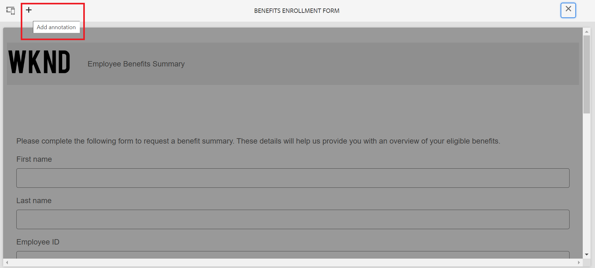

# Versionshantering, granskning och kommentering i ett adaptivt formulär

<!--
 This feature is under the early adopter program. If you're interested in joining our early access program for this feature, send an email from your official address to aem-forms-ea@adobe.com to request access 
-->

Den här funktionen är inte aktiverad som standard. Du kan skriva från din officiella adress till aem-forms-ea@adobe.com för att begära åtkomst till funktionen.

Med de adaptiva kärnkomponenterna kan formulärförfattare lägga till versionshantering, kommentarer och anteckningar i formulär. Dessa funktioner förenklar formulärutvecklingen genom att man kan skapa och hantera flera versioner, samarbeta genom kommentarer och lägga in kommentarer i specifika formuläravsnitt, vilket förbättrar formulärbyggandet.

I den här stegvideon får du information om versionshantering, kommentarer och anteckningsfunktioner i ett adaptivt formulär.

>[!VIDEO](https://video.tv.adobe.com/v/3463265)

## Förutsättning {#prerequisite-versioning}

Om du vill använda funktioner för versionshantering, kommentarer och anteckningar i ett adaptivt formulär kontrollerar du att [kärnkomponenterna för det adaptiva formuläret](https://experienceleague.adobe.com/sv/docs/experience-manager-65/content/forms/adaptive-forms-core-components/enable-adaptive-forms-core-components) är aktiverade i din AEM 6.5 Forms-miljö.

## Versionshantering av anpassningsbara formulär {#adaptive-form-versioning}

Med anpassad formulärversionshantering kan du lägga till versioner i ett formulär. Formulärförfattare kan enkelt skapa flera versioner av ett formulär och till slut använda den som passar affärsmålen. Dessutom kan formuläranvändare även återställa formuläret till tidigare versioner. Man kan också jämföra två versioner av ett formulär genom att förhandsgranska dem så att de kan analysera dem bättre ur gränssnittsperspektiv. Låt oss gå in i detalj på varje funktion för anpassad versionshantering av formulär:

### Skapa en formulärversion {#create-a-form-version}

Följ stegen nedan när du vill skapa en version av ett formulär:

1. I din AEM Forms-miljö går du till **[!UICONTROL Form]**>>**[!UICONTROL Forms & Documents]** och väljer ditt **formulär**.
1. Välj **[!UICONTROL Versions]** i listrutan över den vänstra panelen.
   
1. Klicka på de **tre punkterna** som finns på den nedre panelen till vänster och klicka på **[!UICONTROL Save as Version]**.
1. Ange en etikett för formulärversionen, du kan också lägga till information om formuläret via en kommentar.
   

### Uppdatera en formulärversion {#update-a-form-version}

När du har redigerat och uppdaterat formuläret lägger du till en ny version i formuläret. Följ stegen i det sista avsnittet för att namnge en ny version av formuläret så som det visas i bilden:

### Återställa en formulärversion {#revert-a-form-version}

Om du vill återställa en formulärversion till föregående väljer du en formulärversion och klickar på **[!UICONTROL Revert to this Version]**.

### Jämför formulärversioner {#compare-form-versions}

Formulärförfattare kan jämföra två olika versioner av ett formulär för förhandsgranskning. Om du vill jämföra versioner väljer du en formulärversion och klickar på **[!UICONTROL Compare to Current]**. Den visar två olika formulärversioner i förhandsgranskningsläge.

## Lägg till kommentarer {#add-comments}

En granskning är en mekanism som gör att en eller flera granskare kan kommentera i formulär. Alla formuläranvändare kan kommentera i ett formulär eller granska ett formulär med hjälp av kommentarer. Om du vill kommentera ett formulär markerar du **[!UICONTROL Form]** och lägger till en **[!UICONTROL Comment]** i formuläret.

>[!NOTE]
> När du använder kommentarer i adaptiva formulärkärnkomponenter enligt beskrivningen ovan, inaktiveras formulärfunktionen [att lägga till granskare i formulär](/help/forms/using/create-reviews-forms.md).

## Lägg till anteckningar {#adaptive-form-annotations}

I många fall måste formulärgruppsanvändare lägga till kommentarer i ett formulär för granskning, t.ex. på en viss flik eller komponenter i ett formulär. I sådana fall kan författare använda anteckningar.
Gör så här om du vill lägga till anteckningar i ett formulär:

1. Öppna ett formulär i läget **[!UICONTROL Edit]**.

1. Klicka på ikonen **lägg till** som finns i bildens övre högra hörn.
   

1. Klicka nu på ikonen **lägg till** i det övre vänstra fältet enligt bilden för att lägga till anteckningen.
   

1. Nu kan du lägga till kommentarer, rita skisser med flera färger i formulärkomponenterna.

1. Om du vill se alla dina tillagda anteckningar i ett formulär markerar du formuläret och ser att de tillagda anteckningarna på den vänstra panelen, som visas i bilden.

   

## Se även

* [Jämför adaptiva Forms Core-komponenter](/help/forms/using/compare-forms-core-components.md)
