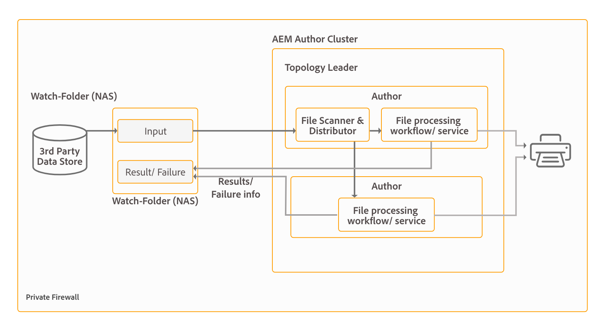

# Arkitektur och driftsättningstopologier för AEM Forms {#architecture-and-deployment-topologies-for-aem-forms}

## Arkitektur {#architecture}

AEM Forms är ett program som distribueras till AEM som ett AEM-paket. Paketet kallas AEM Forms-tilläggspaket. Tilläggspaketet för AEM Forms innehåller båda tjänsterna (API-providers) som distribueras i AEM OSGi-behållaren och servlets eller JSP (som tillhandahåller både front-end- och REST API-funktioner) som hanteras av AEM Sling-ramverket. I följande diagram visas den här konfigurationen:

Arkitekturen för AEM Forms innehåller följande komponenter:

* **** Bastjänster från AEM: Grundläggande tjänster som AEM tillhandahåller ett distribuerat program. Dessa tjänster omfattar en JCR-kompatibel innehållsdatabas, en OSGI-tjänstbehållare, en arbetsflödesmotor, ett förtroendearkiv, en nyckelbehållare osv. Dessa tjänster är tillgängliga för AEM Forms-programmet men tillhandahålls inte av AEM Forms-paket. Dessa tjänster är en integrerad del av den övergripande AEM-stacken och olika AEM Forms-komponenter använder dessa tjänster.
* **** Formulärtjänster: Tillhandahåll formulärrelaterade funktioner som att skapa, sammanställa, distribuera och arkivera PDF-dokument, lägga till digitala signaturer för att begränsa tillgången till dokument samt avkoda streckkodsformulär. Dessa tjänster är allmänt tillgängliga för användning av anpassad kod som distribueras samtidigt i AEM.
* **** Webblager: JSP eller serverlets, som bygger på vanliga tjänster och blanketttjänster och som har följande funktioner:

   * **Författare**: Ett användargränssnitt för att skapa och hantera formulär.
   * **Formuläråtergivning och inskickning**: Ett användargränssnitt som används av slutanvändarna av AEM Forms (t.ex. medborgare som besöker en myndighets webbplats). Detta ger formuläråtergivning (visa formulär i en webbläsare) och funktioner för att skicka in formulär.
   * **REST API**: JSP:er och serverlets exporterar en delmängd av formulärtjänster för fjärranvändning av HTTP-baserade klienter, t.ex. formulärets mobila SDK.

**** AEM Forms on OSGi: En AEM Forms i OSGi-miljö är standard-AEM Author eller AEM Publish med AEM Forms-paket som används på det. Du kan köra AEM Forms på OSGi i en [enda servermiljö, servergrupp och grupperade inställningar](/help/sites-deploying/recommended-deploys.md). Klusterinställningar är bara tillgängliga för AEM Author-instanser.

**** AEM Forms on JEE: AEM Forms på JEE är en AEM Forms-server som körs på JEE-stacken. Den har AEM Author med AEM Forms-tilläggspaket och ytterligare AEM Forms JEE-funktioner som kan användas tillsammans på en enda JEE-stack som körs på en programserver. Du kan köra AEM Forms på JEE i enserver- och gruppkonfigurationer. AEM Forms on JEE krävs endast för dokumentsäkerhet, processhantering och för LiveCycle-kunder som uppgraderar till AEM Forms. Här följer några ytterligare scenarier för att använda AEM Forms på JEE:

* **** Stöd för HTML-arbetsyta (för kunder som använder HTML-arbetsytan): AEM Forms på JEE möjliggör enkel inloggning med bearbetningsinstanser, visar vissa resurser som återges i bearbetningsinstanser och hanterar överföringen av formulär som återges i HTML-arbetsytan.
* **Avancerad bearbetning** av ytterligare blanketter/interaktiva kommunikationsdata: AEM Forms on JEE kan användas för att ytterligare bearbeta formulär-/interaktiva kommunikationsdata (och spara resultaten i ett lämpligt datalager) i komplexa fall där avancerade processhanteringsfunktioner krävs.

AEM Forms on JEE innehåller även följande stödtjänster till AEM-komponenterna:

* **** Integrerad användarhantering: Tillåter användare av AEM Forms på JEE att identifieras som AEM-formulär på OSGi-användare och möjliggör enkel inloggning för både OSGi- och JEE-användare. Detta krävs för scenarier där enkel inloggning mellan AEM-formulär på OSGi och AEM Forms på JEE krävs (till exempel HTML-arbetsyta).
* **** Värdtjänst: AEM Forms på JEE kan hantera resurser (till exempel HTML5-formulär) som återges i AEM Forms på OSGi.

Användargränssnittet för AEM Forms-redigering stöder inte skapande av DOR (Document of Record), PDF-formulär och HTML5-formulär. Sådana resurser är utformade med det fristående Forms Designer-programmet och överförs individuellt till AEM Forms Manager. För AEM Forms på JEE kan formulär även utformas som programresurser (i AEM Forms Workbench) och distribueras i AEM Forms på JEE-server.

AEM Forms på OSGi och AEM Forms på JEE har båda arbetsflödesfunktioner. Du kan snabbt skapa och distribuera grundläggande arbetsflöden för olika uppgifter i AEM-formulären på OSGi, utan att behöva installera den fullständiga funktionen för processhantering i AEM Forms på JEE. Det finns en viss skillnad i [funktionerna för formulärcentrerat arbetsflöde i AEM Forms på OSGi och processhantering i AEM Forms på JEE](/help/forms/using/capabilities-osgi-jee-workflows.md). Utvecklingen och hanteringen av formulärbaserade arbetsflöden i AEM Forms on OSGi använder det välbekanta arbetsflödet i AEM Workflow och AEM Inbox.

## Terminologies {#terminologies}

Följande bild visar olika AEM Form-serverkonfigurationer och deras komponenter som används i en vanlig AEM Forms-distribution:

**** Författare: En författarinstans är en AEM Forms-server som körs i standardkörningsläget för författare. Det kan vara AEM Forms på JEE- eller AEM Forms i OSGi-miljö. Det är avsett för interna användare, formulärutvecklare och designers av interaktiv kommunikation. Det aktiverar följande funktioner:

* **** Ta fram och hantera blanketter och interaktiv kommunikation: Designers och utvecklare kan skapa och redigera adaptiva formulär och interaktiv kommunikation, överföra andra typer av formulär som skapats externt, till exempel formulär som skapats i Adobe Forms Designer, och hantera dessa resurser med Forms Manager-konsolen.
* **** Publicering av blanketter och interaktivt material: Resurser som lagras på en författarinstans kan publiceras till en publiceringsinstans för körningsåtgärder. Resurspublicering använder AEM:s replikeringsfunktioner. Adobe rekommenderar att en replikeringsagent konfigureras på alla författarinstanser för att manuellt skicka publicerade formulär till bearbetningsinstanser, och att en annan replikeringsagent konfigureras för att bearbeta instanser med *Vid mottagande* -utlösaren aktiverad för att automatiskt replikera mottagna formulär till publiceringsinstanser.

**** Publicera: En publiceringsinstans är en AEM Forms-server som körs i det vanliga publiceringskörningsläget. Publiceringsinstanser är avsedda för slutanvändare av formulärbaserade program, t.ex. användare som öppnar en offentlig webbplats och som skickar formulär. Det aktiverar följande funktioner:

* Återge och skicka formulär för slutanvändare.
* Transport av obearbetade inlämnade formulärdata till bearbetningsinstanser för vidare bearbetning och lagring i det slutliga databassystemet. Standardimplementeringen i AEM Forms uppnår detta med AEM:s funktioner för omvänd replikering. Det finns också en alternativ implementering för att skicka formulärdata direkt till bearbetningsservrar i stället för att spara dem lokalt först (det senare är en förutsättning för att omvänd replikering ska aktiveras). Kunder som oroar sig för lagring av potentiellt känsliga data i publiceringsinstanser kan gå in för den här [alternativa implementeringen](/help/forms/using/configuring-draft-submission-storage.md), eftersom bearbetningsinstanser vanligtvis ligger i en säkrare zon.
* Återge och skicka interaktiv kommunikation och interaktiva brev: En interaktiv kommunikation och ett interaktivt brev återges på publiceringsinstanser och motsvarande data skickas till bearbetningsinstanser för lagring och efterbearbetning. Data kan antingen sparas lokalt på en publiceringsinstans och återreplikeras till en bearbetningsinstans (standardalternativet) senare, eller skickas direkt till bearbetningsinstansen utan att sparas i publiceringsinstansen. Den senare implementeringen är användbar för säkerhetsmedvetna kunder.

**** Bearbetar: En instans av AEM Forms som körs i redigeringsläge utan användare tilldelade till formulärhanteringsgruppen. Du kan distribuera AEM Forms på JEE- eller AEM Forms på OSGi som en bearbetningsinstans. Användarna är inte tilldelade att säkerställa att formulärredigerings- och hanteringsaktiviteter inte utförs på Bearbetning-instansen och bara inträffar på Author-instansen. En bearbetningsinstans aktiverar följande funktioner:

* **** Bearbetning av råformulärdata som kommer från en Publish-instans: Detta uppnås främst med en Bearbetningsinstans via AEM-arbetsflöden som aktiveras när data kommer. I arbetsflödena kan du använda steget Formulärdatamodell som du får när du vill arkivera data eller dokument i ett lämpligt datalager.
* **Säker lagring av formulärdata**: Bearbetningen utgör en databas bakom brandväggen för rådata som är isolerade från användarna. Varken formulärdesigners på författarinstansen eller slutanvändare på publiceringsinstansen har åtkomst till den här databasen.

   >[!NOTE]
   >
   > Adobe rekommenderar att du använder ett datalager från tredje part för att spara slutliga bearbetade data i stället för att använda AEM-databasen.

* **** Lagring och efterbehandling av korrespondensdata som kommer från en Publish-instans: AEM-arbetsflöden utför den valfria efterbearbetningen av motsvarande bokstavsdefinitioner. Dessa arbetsflöden kan spara de slutliga bearbetade data i lämpliga externa datalager.

* **Värdtjänst** för HTML-arbetsyta: En bearbetningsinstans är värd för frontend för HTML Workspace. HTML-arbetsytan innehåller användargränssnittet för associerade uppgifter/grupptilldelningar för gransknings- och godkännandeprocesser.

En bearbetningsinstans har konfigurerats att köras i redigeringskörningsläget på grund av:

* Det möjliggör omvänd replikering av rådata från en Publish-instans. Standardhanteraren för datalagring kräver funktionen för omvänd replikering.
* AEM-arbetsflöden, som är det primära sättet att bearbeta råformulärsdata som kommer från en publiceringsinstans, rekommenderas för körning i ett system av utvecklartyp.

## Exempel på fysiska topologier för AEM Forms på JEE {#sample-physical-topologies-for-aem-forms-on-jee}

De AEM Forms på JEE-topologier som rekommenderas nedan gäller främst kunder som uppgraderar från LiveCycle eller en tidigare version av AEM Forms på JEE. Adobe rekommenderar att du använder AEM Forms på OSGi för att installera nya versioner. En ny installation av AEM Forms på JEE rekommenderas endast för dokumentsäkerhet och processhantering.

### Topologi för dokumenttjänster eller dokumentsäkerhet {#topology-for-using-document-services-or-document-security-capabilities}

AEM Forms-kunder som planerar att endast använda dokumenttjänster eller funktioner för dokumentsäkerhet kan ha en topologi som liknar den som visas nedan. Den här topologin rekommenderar att du använder en enda instans av AEM Forms. Du kan också skapa ett kluster eller en grupp med AEM Forms-servrar om det behövs. Den här topologin rekommenderas när de flesta användare programmässigt får tillgång till funktionerna i AEM Forms-servern och det krävs minimalt med ingripande via användargränssnittet. Topologin är användbar vid gruppbearbetning av dokumenttjänster. Du kan till exempel använda utdatatjänsten för att skapa hundratals icke-redigerbara PDF-dokument dagligen.

Med AEM Forms kan du visserligen konfigurera och köra alla funktioner från en enda server, men ändå bör du göra kapacitetsplanering, lastbalansering och konfigurera dedikerade servrar för specifika funktioner i en produktionsmiljö. Om du till exempel använder tjänsten PDF Generator för att konvertera tusentals sidor om dagen och lägga till digitala signaturer för att begränsa åtkomsten till dokument, kan du skapa separata AEM Forms-servrar för tjänsten PDF Generator och funktioner för digitala signaturer. Det ger optimala prestanda och skalar servrarna oberoende av varandra.

### Topologi för AEM Forms processhantering {#topology-for-using-aem-forms-process-management}

Kunder med AEM Forms som planerar att använda AEM Forms processhanteringsfunktioner, till exempel kan HTML Workspace ha en topologi som liknar den som visas nedan. AEM Forms på JEE-servern kan vara i en enda server- eller klusterkonfiguration.

Om du uppgraderar från LiveCycle ES4 speglar denna topologi noga det du redan har i LiveCycle, förutom att AEM Author har lagts till i AEM Forms på JEE. Dessutom ändras inte kraven på klustring för kunder som utför en uppgradering. Om du använde AEM Forms i en klustermiljö kan du fortsätta med det i AEM 6.5 Forms. För en ny installation av AEM Forms of JEE för HTML Workspace är körning av AEM author instance built-in to the JEE environment ett extra krav.

Formulärdatalagret är ett datalager från tredje part som används för att lagra slutliga bearbetade data av formulär och interaktiv kommunikation. Detta är ett valfritt element i topologin. Du kan också välja att konfigurera en bearbetningsinstans och använda dess databas som det slutliga systemet för post, om det behövs.

Topologin rekommenderas för kunder som planerar att använda AEM Forms på JEE-servern för processhanteringsfunktioner (HTML Workspace) utan att behöva använda någon efterbearbetning, adaptiva formulär, HTML5-formulär eller interaktiv kommunikationskapacitet.

### Topologi för användning av adaptiva formulär, HTML5-formulär, interaktiva kommunikationsfunktioner {#topology-for-using-adaptive-forms-html-forms-interactive-communication-capabilities}

Kunder med AEM Forms som planerar att använda funktioner för datainhämtning från AEM Forms, till exempel adaptiva formulär, HTML5-formulär, PDF-formulär, kan ha en topologi som liknar den som visas nedan. Denna topologi rekommenderas också för användning av interaktiva kommunikationsfunktioner i AEM Forms.

Du kan göra följande ändringar/anpassningar av ovanstående föreslagna topologi:

* Om du vill använda HTML Workspace och AEM Forms-appen måste du ha en AEM-författare eller bearbetningsinstans. Du kan använda den inbyggda AEM-författarinstansen i AEM Forms på JEE-servern i stället för att konfigurera en extern AEM-författarserver.
* En AEM Author- eller Processing-instans krävs bara för formulärbaserade arbetsflöden i OSGi, adaptiva formulär, formulärportalen och interaktiv kommunikation.
* gränssnitt för interaktiv kommunikationsagent körs vanligtvis inom organisationen. Du kan därför behålla en publiceringsserver för agentanvändargränssnittet i det privata nätverket.
* AEM-formulär på OSGi-instanser som är inbyggda i AEM Forms på JEE-server kan även köra formulärorienterade arbetsflöden på OSGi och Bevakade mappar.

## Exempel på fysiska topologier för användning av AEM Forms i OSGi {#sample-physical-topologies-for-using-aem-forms-on-osgi}

### Topology for data capture, interactive communication, Form-Centric Workflow on OSGi capabilities {#topology-for-data-capture-interactive-communication-form-centric-workflow-on-osgi-capabilities}

Kunder med AEM Forms som planerar att använda funktioner för datainhämtning från AEM Forms, till exempel adaptiva formulär, HTML5-formulär, PDF-formulär, kan ha en topologi som liknar den som visas nedan. Den här topologin rekommenderas också för interaktiv kommunikation och formulärcentrerade arbetsflöden för OSGi-funktioner, t.ex. för användning av AEM Inbox och AEM Forms App för arbetsflöden för affärsprocesser.

### Topologi för att använda bevakade mappfunktioner för batchbearbetning offline {#topology-for-using-watched-folder-capabilities-for-offline-batch-processing}

AEM Forms-kunder som planerar att använda bevakade mappar för batchbearbetning kan ha en topologi som liknar den som visas nedan. Topologin visar en klustrad miljö, men du bestämmer dig för att använda en enda instans eller en servergrupp med AEM Forms-servrar beroende på inläsningen. Tredjepartsdatakällan är ditt eget postsystem. Den fungerar som indatakälla för bevakade mappar. Topologin visar också utdata i form av en utskriven fil. Du kan också lagra utdatainnehållet i ett filsystem, skicka via e-post och använda andra anpassade metoder för att förbruka utdata.

### Topologi för dokumenttjänster för offlinebaserad API-baserad bearbetning {#topology-for-using-document-services-capabilities-for-offline-api-based-processing}

Kunder med AEM Forms som planerar att endast använda dokumenttjänster kan ha en topologi som liknar den som visas nedan. Den här topologin rekommenderar att du använder ett kluster med AEM Forms på OSGi-servrar. Den här topologin rekommenderas när de flesta användare använder API:er via programmering och AEM Forms-serverns åtkomstfunktioner, och det krävs minimala åtgärder via användargränssnittet. Topologin är mycket användbar i olika kundscenarier. Till exempel kan flera klienter använda PDF Generator-tjänsten för att skapa PDF-dokument på begäran.

Även om du kan använda AEM Forms för att konfigurera och köra alla funktioner från en enda server, bör du göra kapacitetsplanering, lastbalansering och konfigurera dedikerade servrar för specifika funktioner i en produktionsmiljö. Om du till exempel använder tjänsten PDF Generator för att konvertera tusentals sidor om dagen och flera adaptiva formulär för att hämta in data, kan du skapa separata AEM Forms-servrar för tjänsten PDF Generator och funktioner för adaptiva formulär. Det ger optimala prestanda och skalar servrarna oberoende av varandra.

