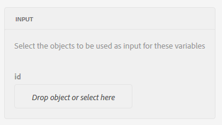
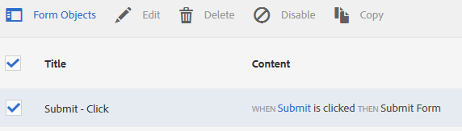
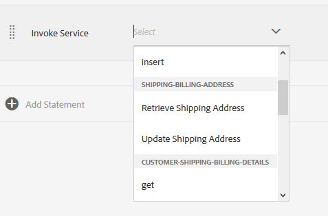

# Självstudiekurs: Tillämpa regler på anpassningsbara formulärfält {#tutorial-apply-rules-to-adaptive-form-fields}


Den här självstudiekursen är ett steg i serien [Create Your First Adaptive Form](/help/forms/using/create-your-first-adaptive-form.md) . Adobe rekommenderar att du följer serien i kronologisk ordning för att förstå, utföra och demonstrera det fullständiga exemplet med självstudiekurser.

## Om självstudiekursen {#about-the-tutorial}

Du kan använda regler för att lägga till interaktivitet, affärslogik och smarta valideringar i ett anpassat formulär. Anpassningsbara formulär har en inbyggd regelredigerare. Regelredigeraren har en dra och släpp-funktion som liknar guidade rundturer. Metoden dra och släpp är den snabbaste och enklaste metoden att skapa regler. Regelredigeraren innehåller också ett kodfönster för användare som vill testa sina kodningskunskaper eller ta reglerna till nästa nivå.

Du kan läsa mer om regelredigeraren i [regelredigeraren](/help/forms/using/rule-editor.md)Adaptive Forms.

I slutet av självstudiekursen kommer du att lära dig att skapa regler för att:

* Anropa en formulärdatamodelltjänst för att hämta data från databasen
* Anropa en tjänst för formulärdatamodell för att lägga till data i databasen
* Kör en valideringskontroll och visa felmeddelanden

Med interaktiva GIF-bilder i slutet av varje avsnitt i självstudiekursen lär du dig och validerar snabbt funktionaliteten i det formulär du bygger.

## Steg 1: Hämta en kundpost från databasen {#retrieve-customer-record}

Du skapade en formulärdatamodell genom att följa artikeln [Skapa formulärdatamodell](/help/forms/using/create-form-data-model.md) . Nu kan du använda regelredigeraren för att anropa Forms Data Model-tjänster för att hämta och lägga till information i databasen.

Varje kund tilldelas ett unikt Kund-ID-nummer som hjälper till att identifiera relevanta kunddata i en databas. I proceduren nedan används Kund-ID för att hämta information från databasen:

1. Öppna det adaptiva formuläret för redigering.

   [http://localhost:4502/editor.html/content/forms/af/change-billing-shipping-address.html](http://localhost:4502/editor.html/content/forms/af/change-billing-shipping-address.html)

1. Tryck på fältet **[!UICONTROL Kund-ID]** och tryck på ikonen **[!UICONTROL Redigera regler]** . Regelredigeraren öppnas.
1. Tryck på ikonen **[!UICONTROL + Skapa]** för att lägga till en regel. Den öppnar Visual Editor.

   I Visual Editor är programsatsen **[!UICONTROL WHEN]** markerad som standard. Formulärobjektet (i det här fallet **[!UICONTROL Kund-ID]**) från vilket du startade regelredigeraren specificeras i **[!UICONTROL WHEN]** -satsen.

1. Tryck på listrutan **[!UICONTROL Välj läge]** och markera **[!UICONTROL ändras]**.

   

1. Välj **[!UICONTROL Anropa tjänst]** i listrutan **[!UICONTROL Välj åtgärd]** i satsen **[!UICONTROL THEN]** .
1. Välj **[!UICONTROL tjänsten Hämta leveransadress]** i listrutan **[!UICONTROL Välj]** .
1. Dra och släpp fältet **[!UICONTROL Kund-ID]** från fliken Formulärobjekt till objektet **[!UICONTROL Släpp eller välj här]** i rutan **[!UICONTROL INPUT]** .

   

1. Dra och släpp fältet **[!UICONTROL Kund-ID, Namn, Leveransadress, Tillstånd och Postnummer]** från fliken Formulärobjekt till **[!UICONTROL Släpp-objektet eller välj här]** i rutan **[!UICONTROL UTPUT]** .

   

   Tryck på **[!UICONTROL Klar]** för att spara regeln. Tryck på **[!UICONTROL Stäng]** i regelredigeringsfönstret.

1. Förhandsgranska det adaptiva formuläret. Ange ett ID i fältet **[!UICONTROL Kund-ID]** . Formuläret kan nu hämta kundinformation från databasen.

   

## Steg 2: Lägg till den uppdaterade kundadressen i databasen {#updated-customer-address}

När kundinformationen har hämtats från databasen kan du uppdatera leveransadress, leveransstatus och postnummer. Proceduren nedan anropar en Form Data Model-tjänst för att uppdatera kundinformationen till databasen:

1. Markera fältet **[!UICONTROL Skicka]** och tryck på ikonen **[!UICONTROL Redigera regler]** . Regelredigeraren öppnas.
1. Markera **[!UICONTROL Skicka - klicka på]** regeln och tryck på ikonen **[!UICONTROL Redigera]** . Alternativen för att redigera regeln Skicka visas.

   

   I alternativet WHEN är alternativen **[!UICONTROL Skicka]** och **[!UICONTROL klickas]** redan markerade.

   

1. Tryck på alternativet **[!UICONTROL + Add Statement (Lägg till sats]** ) i alternativet **[!UICONTROL THEN]** (SEDAN). Välj **[!UICONTROL Anropa tjänst]** i listrutan **[!UICONTROL Välj åtgärd]** .
1. Välj tjänsten **[!UICONTROL Uppdatera leveransadress]** i listrutan **[!UICONTROL Välj]** .

   

1. 

   Dra och släpp fältet **[!UICONTROL Leveransadress, Delstat och Postnummer]** från fliken Formulärobjekt till motsvarande tabellnamnsegenskap (t.ex. kundinformation, leveransadress) för **[!UICONTROL Drop-objektet eller välj här]** i rutan **[!UICONTROL INPUT]** . Alla fält med tabellnamn som prefix (t.ex. kundinformation i det här fallet) fungerar som indata för uppdateringstjänsten. Allt innehåll i dessa fält uppdateras i datakällan.

   >[!NOTE]
   >
   >Dra och släpp inte fälten **[!UICONTROL Namn]** och **[!UICONTROL Kund-ID]** till motsvarande tabellnamn.property (till exempel kundinformation.namn). Det hjälper till att undvika att uppdatera kundens namn och ID av misstag.

1. Dra och släpp fältet **[!UICONTROL Kund-ID]** från fliken Formulärobjekt till ID-fältet i rutan **[!UICONTROL INPUT]** . Fält utan ett prefix-tabellnamn (t.ex. kundinformation i det här fallet) fungerar som sökparametrar för uppdateringstjänsten. Fältet **[!UICONTROL id]** i det här användningsfallet identifierar en post unikt i registret för kundinformation.
1. Tryck på **[!UICONTROL Klar]** för att spara regeln. Tryck på **[!UICONTROL Stäng]** i regelredigeringsfönstret.
1. Förhandsgranska det adaptiva formuläret. Hämta information om en kund, uppdatera leveransadressen och skicka in formuläret. När du hämtar information om samma kund igen visas den uppdaterade leveransadressen.

## Steg 3: (Bonusavsnitt) Använd kodredigeraren för att köra valideringar och visa felmeddelanden {#step-bonus-section-use-the-code-editor-to-run-validations-and-display-error-messages}

Du bör köra valideringen i formuläret för att säkerställa att de data som anges i formuläret är korrekta och att ett felmeddelande visas om felaktiga data saknas. Om t.ex. ett icke-befintligt kund-ID anges i formuläret, ska ett felmeddelande visas.

Adaptiva formulär innehåller flera komponenter med inbyggda valideringar, till exempel e-post och numeriska fält som du kan använda för vanliga användningsområden. Använd regelredigeraren för avancerad användning, till exempel för att visa ett felmeddelande när databasen returnerar noll (0) poster (inga poster).

Följande procedur visar hur du skapar en regel som visar ett felmeddelande om det kund-ID som anges i formuläret inte finns i databasen. Regeln ger också fokus till och återställer fältet Kund-ID. Regeln använder API:t dataIntegrationUtils [för formulärdatamodelltjänsten](/help/forms/using/invoke-form-data-model-services.md) för att kontrollera om det finns ett kund-ID i databasen.

1. Tryck på fältet **[!UICONTROL Kund-ID]** och tryck på `Edit Rules` ikonen. Regelredigeraren öppnas.
1. Tryck på ikonen **[!UICONTROL + Skapa]** för att lägga till en regel. Den öppnar Visual Editor.

   I Visual Editor är programsatsen **[!UICONTROL WHEN]** markerad som standard. Formulärobjektet (i det här fallet **[!UICONTROL Kund-ID]**) från vilket du startade regelredigeraren specificeras i **[!UICONTROL WHEN]** -satsen.

1. Tryck på listrutan **[!UICONTROL Välj läge]** och markera **[!UICONTROL ändras]**.

   

   Välj **[!UICONTROL Anropa tjänst]** i listrutan **[!UICONTROL Välj åtgärd]** i satsen **[!UICONTROL THEN]** .

1. Växla från **[!UICONTROL Visual Editor]** till **[!UICONTROL Code Editor]**. Växelkontrollen finns till höger i fönstret. Kodredigeraren öppnas och visar kod som liknar följande:

   

1. Ersätt indatavariabelavsnittet med följande kod:

   ```
   var inputs = {
       "id" : this
   };
   ```

1. Ersätt sektionen guide.dataIntegrationUtils.executeOperation (operationInfo, input, outputs) med följande kod:

   ```
   guidelib.dataIntegrationUtils.executeOperation(operationInfo, inputs, outputs, function (result) {
     if (result) {
         result = JSON.parse(result);
       customer_Name.value = result.name;
       customer_Shipping_Address = result.shippingAddress;
     } else {
       if(window.confirm("Invalid Customer ID. Provide a valid customer ID")) {
             customer_Name.value = " ";
            guideBridge.setFocus(customer_ID);
       }
     }
   });
   ```

1. Förhandsgranska det adaptiva formuläret. Ange ett felaktigt kund-ID. Ett felmeddelande visas.

   

