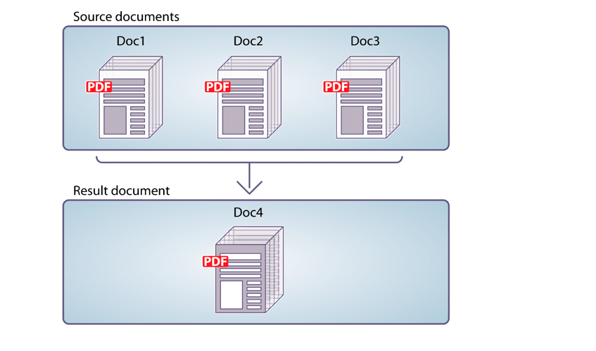

# Använda Assembler Service{#using-assembler-service}

Med Assembler-tjänsten kan du kombinera, ordna om och förstärka PDF- och XDP-dokument och få information om PDF-dokument. Varje jobb som skickas till Assembler-tjänsten innehåller ett DX-dokument (Document Description XML), källdokument och externa resurser (strängar och grafik). Mer information om sammansättningstjänsten finns i [Översikt över Assembler Service](../../forms/using/overview-aem-document-services.md#p-assembler-service-p).

Du kan använda sammansättningstjänsten för följande åtgärder:

## Sammanställa PDF-dokument {#assemble-pdf-documents}

Du kan använda Assembler-tjänsten för att samla ihop två eller flera PDF-dokument till ett enda PDF-dokument eller PDF-portfölj. Du kan även använda funktioner i PDF-dokumentet som underlättar navigering eller förbättrar säkerheten. Här är några sätt att sammanställa PDF-dokument:

### Sammanställa ett enkelt PDF-dokument {#assemble-a-simple-pdf-document}

Följande bild visar tre källdokument som sammanfogas till ett enda resulterande dokument.



Sammanställa ett enkelt PDF-dokument från flera PDF-dokument

Följande exempel är ett enkelt DDX-dokument som används för att montera dokumentet. Här anges namnen på källdokumenten som används för att skapa det resulterande dokumentet samt namnet på det resulterande dokumentet:

```xml
<PDF result="Doc4">
<PDF source="Doc1"/>
<PDF source="Doc2"/>
<PDF source="Doc3"/>
</PDF>
```

Dokumentsammansättningen skapar ett resulterande dokument som innehåller följande innehåll och\
egenskaper:

* Hela eller en del av varje källdokument
* Alla eller delar av bokmärken från varje källdokument, normaliserade för det sammansatta resulterande dokumentet
* Andra egenskaper som används från basdokumentet (Doc1), inklusive metadata, sidetiketter och sidstorlek
* Det resulterande dokumentet innehåller en innehållsförteckning som är konstruerad av bokmärkena i källdokumenten

### Skapa en PDF-portfölj {#create-a-pdf-portfolio}

Med Assembler-tjänsten kan du skapa PDF-portföljer som innehåller en samling dokument och ett valfritt användargränssnitt. Gränssnittet kallas för en PDF-portföljlayout eller en PDF-portföljnavigator (navigator). PDF-portföljer utökar funktionerna för PDF-paket genom att lägga till en navigator, mappar och välkomstsidor. Gränssnittet kan förbättra användarupplevelsen genom att utnyttja lokaliserade textsträngar, anpassade färgscheman och grafiska resurser. PDF-portföljen kan även innehålla mappar för att ordna filerna i portföljen.

När Assembler-tjänsten tolkar följande DDX-dokument sammanställs en PDF-portfölj som innehåller en PDF-portföljnavigator och ett paket med två filer. Tjänsten hämtar navigatorn från den plats som anges av myNavigator-källan. Det ändrar navigatorns standardfärgschema till färgschemat pinkScheme.

```xml
<DDX xmlns="https://ns.adobe.com/DDX/1.0/">
<PDF result="Untitled 1">
<Portfolio>
<Navigator source="myNavigator"/>
<ColorScheme scheme="pinkScheme"/>
</Portfolio>
<PackageFiles>
<PDF source="sourcePDF1"/>
<PDF source="sourcePDF2"/>
</PackageFiles>
</PDF>
</DDX>
```

### Sammanställa krypterade dokument {#assemble-encrypted-documents}

När du sammanställer ett dokument kan du även kryptera PDF-dokumentet med ett lösenord. När ett PDF-dokument har krypterats med ett lösenord måste användaren ange lösenordet för att kunna visa PDF-dokumentet i Adobe Reader eller Acrobat. Om du vill kryptera ett PDF-dokument med ett lösenord måste DDX-dokumentet innehålla krypteringselementvärden som krävs för att kryptera ett PDF-dokument.

Krypteringstjänsten behöver inte vara en del av LiveCycle-installationen för att kunna kryptera ett PDF-dokument med ett lösenord.

Om ett eller flera av indatadokumenten är krypterade anger du ett lösenord för att öppna dokumentet som en del av DDX-filen.

### Sammanställa dokument med Bates-numrering {#assemble-documents-using-bates-numbering}

När du sammanställer ett dokument kan du använda Bates-numrering för att tillämpa en unik sididentifierare på varje sida. När du använder Bates-numrering tilldelas varje sida i dokumentet (eller dokumentuppsättningen) ett nummer som unikt identifierar sidan. Till exempel kan tillverkningsdokument som innehåller produktstruktur och som är kopplade till produktionen av en sammansättning innehålla en identifierare. Ett Bates-nummer innehåller ett numeriskt värde i följd samt ett valfritt prefix och suffix. Prefixet + det numeriska värdet + suffixet kallas för ett bates-mönster.

Följande bild visar ett PDF-dokument som innehåller en unik identifierare som finns i dokumentets sidhuvud.


Ett PDF-dokument som innehåller en unik identifierare som finns i dokumentets rubrik

### Förenkla och sammanställ dokument {#flatten-and-assemble-documents}

Du kan använda tjänsten Assembler för att omvandla ett interaktivt PDF-dokument (till exempel ett formulär) till ett icke-interaktivt PDF-dokument. Med ett interaktivt PDF-dokument kan användare ange eller ändra data som finns i PDF-dokumentfälten. Processen att omvandla ett interaktivt PDF-dokument till ett icke-interaktivt PDF-dokument kallas för förenkling. När ett PDF-dokument förenklas bevaras det grafiska utseendet i formulärfälten, men de är inte längre interaktiva. Ett skäl till att förenkla ett PDF-dokument är att se till att data inte kan ändras. Dessutom fungerar inte längre skript som är kopplade till fälten.

När du skapar ett PDF-dokument som har sammanställts från interaktiva PDF-dokument, förenklar Assembler-tjänsten dessa formulär innan de sammanställs i det resulterande dokumentet.

>[!NOTE]
>
>Assembler-tjänsten använder Output-tjänsten för att förenkla dynamiska XFA-formulär. Om Assembler-tjänsten bearbetar en DX som kräver att den förenklar ett dynamiskt XFA-formulär och Output-tjänsten inte är tillgänglig genereras ett undantag. Med Assembler-tjänsten kan du förenkla ett Acrobat-formulär eller ett statiskt XFA-formulär utan att använda Output-tjänsten.

## Sammanställa XDP-dokument {#assemble-xdp-documents}

Du kan använda Assembler-tjänsten för att samla ihop flera XDP-dokument till ett enda XDP-dokument eller till ett PDF-dokument. För XDP-källfiler som innehåller insättningspunkter kan du ange vilka fragment som ska infogas.

Här är några sätt att sammanställa XDP-dokument:

### Sammanställa ett enkelt XDP-dokument {#assemble-a-simple-xdp-document}

Följande bild visar tre XDP-källdokument som sammanfogas till ett enda resulterande XDP-dokument. Det resulterande XDP-dokumentet innehåller de tre XDP-källdokumenten inklusive tillhörande data. Det resulterande dokumentet hämtar grundläggande attribut från basdokumentet, som är det första XDP-källdokumentet.


Sammanställa ett enkelt XDP-dokument från flera XDP-dokument

Här är ett DDX-dokument som ger det resultat som visas ovan.

```xml
<DDX xmlns="https://ns.adobe.com/DDX/1.0/">
<XDP result="MyXDPResult">
<XDP source="sourceXDP1"/>
<XDP source="sourceXDP2"/>
<XDP source="sourceXDP3"/>
</XDP>
</DDX>
```

### Korrigera referenser under sammansättning {#resolving-references-during-assembly}

Vanligtvis kan XDP-dokument innehålla bilder som refereras antingen via absoluta eller relativa referenser. Sammansättningstjänsten behåller som standard referenserna till bilderna i det resulterande XDP-dokumentet.

Du kan ange hur Assembler-tjänsten ska hantera de bilder som refereras i XDP-källdokumenten antingen genom absoluta eller relativa referenser i XDP-filerna när du sammanställer. Du kan välja att bädda in alla bilder i resultatet så att det inte innehåller några relativa eller absoluta referenser. Du definierar detta genom att ange värdet för taggen resolveAssets, som kan ha något av följande alternativ. Som standard löses inga referenser i resultatdokumentet.

<table>
 <tbody> 
  <tr> 
   <th>Värde</th> 
   <th>Beskrivning</th> 
  </tr> 
  <tr> 
   <td>inga</td> 
   <td>Lös inte några referenser.</td> 
  </tr> 
  <tr> 
   <td>all</td> 
   <td>Bäddar in alla refererade bilder i XDP-källdokumentet.</td> 
  </tr> 
  <tr> 
   <td>relativ</td> 
   <td>Bäddar in alla bilder som refereras via relativa referenser i XDP<br /> -källdokumentet.</td> 
  </tr> 
  <tr> 
   <td>absolut</td> 
   <td>Bäddar in alla bilder som refereras via absoluta referenser i XDP-källdokumentet<br /> .</td> 
  </tr> 
 </tbody> 
</table>

Du kan ange värdet för attributet resolveAssets antingen i XDP-källtaggen eller i den överordnade XDP-resultattaggen. Om attributet anges för XDP-resultattaggen ärvs det av alla XDP-källelement som är underordnade XDP-resultatet. Om du däremot uttryckligen anger attributet för ett källelement åsidosätts inställningen för resultatelementet enbart för det källdokumentet.

#### Lösa alla källreferenser i ett XDP-dokument {#resolve-all-source-references-in-an-xdp-document}

Om du vill lösa alla referenser i XDP-källdokumenten anger du attributet resolveAssets för\
resulterande dokument till alla, som i exemplet nedan:

```xml
<DDX xmlns="https://ns.adobe.com/DDX/1.0/">
<XDP result="result.xdp" resolveAssets="all">
<XDP source="input1.xdp" />
<XDP source="input2.xdp" />
<XDP source="input3.xdp" />
</XDP>
</DDX
```

Du kan också ange attributet för alla XDP-källdokument oberoende av varandra för att få samma\
resultat.

```xml
<DDX xmlns="https://ns.adobe.com/DDX/1.0/">
<XDP result="result.xdp">
<XDP source="input1.xdp" resolveAssets="all"/>
<XDP source="input2.xdp" resolveAssets="all"/>
<XDP source="input3.xdp" resolveAssets="all"/>
</XDP>
</DDX>
```

#### Lösa markerade källreferenser i ett XDP-dokument {#resolve-selected-source-references-in-an-xdp-document}

Du kan selektivt ange de källreferenser som du vill matcha genom att ange attributet resolveAssets för dem. Attributen för enskilda källdokument åsidosätter det resulterande XDP-dokumentets inställning. I det här exemplet löses även de inkluderade fragmenten.

```xml
<DDX xmlns="https://ns.adobe.com/DDX/1.0/">
<XDP result="result.xdp" resolveAssets="all">
<XDP source="input1.xdp" >
<XDPContent source="fragment.xdp" insertionPoint="MyInsertionPoint"
fragment="myFragment"/>
</XDP>
<XDP source="input2.xdp" />
</XDP>
</DDX>
```

#### Lös selektivt absoluta eller relativa referenser {#selectively-resolve-absolute-or-relative-references}

Du kan selektivt lösa absoluta eller relativa referenser i alla eller några av källdokumenten, vilket visas i exemplet nedan:

```xml
<DDX xmlns="https://ns.adobe.com/DDX/1.0/">
<XDP result="result.xdp" resolveAssets="absolute">
<XDP source="input1.xdp" />
<XDP source="input2.xdp" />
</XDP>
</DDX
```

### Infoga formulärfragment dynamiskt i ett XFA-formulär {#dynamically-insert-form-fragments-into-an-xfa-form}

Du kan använda Assembler-tjänsten för att skapa ett XFA-formulär som skapas från ett annat XFA-formulär som fragment infogas i. Med den här funktionen kan du använda fragment för att skapa flera formulär.

Stöd för dynamisk infogning av formulärfragment har stöd för kontroll med en enda källa. Du har en enda källa med vanliga komponenter. Du kan t.ex. skapa ett fragment för företagets banderoll. Om banderollen ändras behöver du bara ändra fragmentet. De andra formerna som innehåller fragmentet ändras inte.

Formulärdesigners använder LiveCycle Designer för att skapa formulärfragment. Dessa fragment är unika namngivna delformulär i ett XFA-formulär. Formulärdesignern använder också Designer för att skapa XFA-formulär med unika insättningspunkter. Du (programmeraren) skriver DDX-dokument som anger hur fragment infogas i XFA-formuläret.

Följande bild visar två XML-formulär (XFA-mallar). Formuläret till vänster innehåller en insättningspunkt med namnet myInsertionPoint. Formuläret till höger innehåller ett fragment med namnet myFragment.


Infoga formulärfragment i ett XFA-formulär

När Assembler-tjänsten tolkar följande DDX-dokument skapas ett XML-formulär som innehåller ett annat XML-formulär. Delformuläret myFragment från dokumentet myFragmentSource infogas vid myInsertionPoint i dokumentet myFormSource.

```xml
<DDX xmlns="https://ns.adobe.com/DDX/1.0/">
<XDP result="myFormResult">
<XDP source="myFormSource">
<XDPContent fragment="myFragment" insertionPoint="myInsertionPoint"
source="myFragmentSource"/>
</XDP>
</XDP>
</DDX
```

### Paketera ett XDP-dokument som PDF {#package-an-xdp-document-as-pdf}

Du kan använda tjänsten Assembler för att paketera ett XDP-dokument som ett PDF-dokument, vilket visas i det här DDX-dokumentet.

```xml
<DDX xmlns="https://ns.adobe.com/DDX/1.0/">
<PDF result="Untitled 1" encryption="passEncProfile1">
<XDP>
<XDP source="sourceXDP3"/>
<XDP source="sourceXDP4"/>
</XDP>
</PDF>
</DDX>
```

## Dela upp PDF-dokument {#disassemble-pdf-documents}

Du kan använda Assembler-tjänsten för att demontera ett PDF-dokument. Tjänsten kan extrahera sidor från källdokumentet eller dela upp ett källdokument baserat på bokmärken. Vanligtvis är den här uppgiften användbar om PDF-dokumentet ursprungligen skapades från många enskilda dokument, till exempel en samling programsatser.

### Extrahera sidor från ett källdokument {#extract-pages-from-a-source-document}

På följande bild extraheras sidorna 1-3 från källdokumentet och placeras i ett nytt resulterande dokument.


Extrahera specifika sidor från ett källdokument

Följande exempel är ett DDX-dokument som används för att demontera dokumentet.

```xml
<PDF result="Doc4">
<PDF source="Doc2" pages="1-3"/>
</PDF>
```

### Dela upp ett källdokument baserat på bokmärken {#divide-a-source-document-based-on-bookmarks}

På följande bild delas DocA in i flera resulterande dokument. Bokmärket på första nivån 1 på en sida identifierar början på ett nytt resulterande dokument.


Dela upp ett källdokument baserat på bokmärken i flera dokument

Följande exempel är ett DX-dokument som använder bokmärken för att demontera ett källdokument.

```xml
<PDFsFromBookmarks prefix="A">
<PDF source="DocA"/>
</PDFsFromBookmarks>
```

## Bestäm om dokumenten överensstämmer med PDF/A {#determine-whether-documents-are-pdf-a-compliant}

Du kan använda Assembler-tjänsten för att avgöra om ett PDF-dokument är PDF/A-kompatibelt. PDF/A är ett arkiveringsformat som är avsett för långvarig lagring av dokumentets innehåll. Teckensnitten bäddas in i dokumentet och filen är okomprimerad. Därför är ett PDF/A-dokument vanligtvis större än ett vanligt PDF-dokument. Ett PDF/A-dokument innehåller inte heller ljud- och videoinnehåll.

## Hämta information om ett PDF-dokument {#obtain-information-about-a-pdf-document}

Du kan använda Assembler-tjänsten för att få följande information om ett PDF-dokument:

* Textinformation.

   * Ord på varje sida i dokumentet
   * Placering av varje ord på varje sida i dokumentet
   * Meningar i varje stycke på varje sida i dokumentet

* Bokmärken, inklusive sidnummer, rubrik, mål och utseende. Du kan exportera den här\
   data från ett PDF-dokument och importera dem till ett PDF-dokument.

* Bifogade filer, inklusive filinformation. För bilagor på sidnivå innehåller den även\
   platsen för anteckningen om den bifogade filen. Du kan exportera dessa data från ett PDF-dokument och\
   importera det till ett PDF-dokument.

* Paketfiler, inklusive filinformation, mappar, paket, schema och fältdata. Du kan exportera dessa data från ett PDF-dokument och importera dem till ett PDF-dokument.

## Validera DDX-dokument {#validate-ddx-documents}

Du kan använda Assembler-tjänsten för att avgöra om ett DDX-dokument är giltigt. Om du till exempel uppgraderar från en tidigare LiveCycle-version säkerställer valideringen att ditt DDX-dokument är giltigt.

## Ring andra tjänster {#call-other-services}

Du kan använda DDX-dokument som gör att Assembler-tjänsten anropar följande LiveC-cykeltjänster. Assembler-tjänsten kan bara anropa de tjänster som har installerats med LiveCycle.

**Tjänsten** Reader Extensions: Användare av Adobe Reader kan signera det resulterande PDF-dokumentet digitalt.

**Formulärtjänst**: Sammanfogar en XDP-fil och en XML-datafil för att skapa ett PDF-dokument som innehåller det ifyllda interaktiva formuläret.

**Utdatatjänst**: Konverterar ett dynamiskt XML-formulär till ett PDF-dokument som innehåller ett icke-interaktivt formulär (förenklar formuläret). Med Assembler-tjänsten förenklas statiska XML-formulär och Acrobat-formulär utan att Output-tjänsten anropas.

```xml
<?xml version="1.0" encoding="UTF-8"?>
<DDX xmlns="https://ns.adobe.com/DDX/1.0/">
<PDF result="outDoc">
<PDF source="doc1"/>
<PDF source="doc2"/>
<ReaderRights
credentialAlias="LCESCred"
digitalSignatures="true"/>
</PDF>
</DDX>
```

Om du använder DDX och Assembler-tjänsten för att ringa andra LiveC Cycle-tjänster kan det förenkla ditt processdiagram. Det kan till och med minska arbetet med att anpassa arbetsflödena. (Se även
