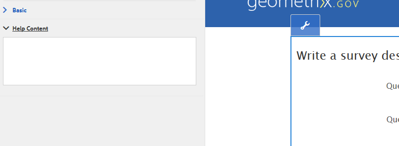

# Sammanhangsberoende hjälp för formulärfält{#authoring-in-context-help-for-form-fields}

 Adobe rekommenderar att du använder den moderna och utbyggbara datainhämtningen [Core Components](https://experienceleague.adobe.com/docs/experience-manager-core-components/using/adaptive-forms/introduction.html) för [att skapa nya adaptiva Forms](/help/forms/using/create-an-adaptive-form-core-components.md) eller [att lägga till adaptiva Forms på AEM Sites-sidor](/help/forms/using/create-or-add-an-adaptive-form-to-aem-sites-page.md). De här komponenterna utgör ett betydande framsteg när det gäller att skapa adaptiva Forms-filer, vilket ger imponerande användarupplevelser. I den här artikeln beskrivs det äldre sättet att skapa Adaptiv Forms med baskomponenter. 

## Introduktion {#introduction}

Det finns situationer när slutanvändare som fyller i ett formulär inte vet hur de ska fylla i information i ett visst formulärfält. För att åtgärda sådana problem har adaptiva formulär stöd för att lägga till text eller sammanhangsberoende hjälp i ett formulärfält. Det underlättar ifyllandet av formulär och undviker eventuella tvetydigheter för slutanvändarna.

I den här artikeln beskrivs hur formulärförfattare kan lägga till sammanhangsberoende hjälp när de skriver Adaptiv Forms.

## Lägg till sammanhangsberoende hjälp {#add-in-context-help}

Du kan ange sammanhangsberoende hjälp med följande alternativ i hjälpavsnittet på egenskapsfliken i sidofältet.

* [Kort beskrivning](../../forms/using/authoring-in-field-help.md#p-short-description-p)
* [Lång beskrivning](../../forms/using/authoring-in-field-help.md#p-long-description-p)

>[!NOTE]
>
>Long description åsidosätter Short description. Om du har angett båda visas bara Lång beskrivning.

### Kort beskrivning {#short-description}

Fältet Kort beskrivning ger snabba och korta tips om hur du fyller i ett formulärfält. Texten som anges i fältet Kort beskrivning visas som ett verktygstips när du håller muspekaren över fältet.

>[!NOTE]
>
>Välj **Visa alltid kort beskrivning** om du vill visa hjälptexten under fältet permanent.

### Lång beskrivning {#long-description}

Du kan använda fältet Lång beskrivning för att ange lång text eller bädda in multimedieinnehåll, inklusive videor, som sammanhangsberoende hjälp. I följande bild visas hur du kan bädda in en video som sammanhangsberoende hjälp.

Om du lägger till lång beskrivning visas en **?**-ikon bredvid fältet. När du klickar på ikonen visas det innehåll som lagts till i avsnittet med lång beskrivning.

### Hjälp på panelnivå {#panel-level-help}

Utöver sammanhangsberoende hjälp för formulärfält kan du ange hjälp på panelnivå på fliken Hjälpinnehåll i dialogrutan Redigera i panelen.

Om du lägger till hjälp för panelen visas en **?Ikonen** bredvid panelbeskrivningen. När du klickar på ikonen visas det innehåll som lagts till i hjälpdelen i dialogrutan Redigera i panelen.

