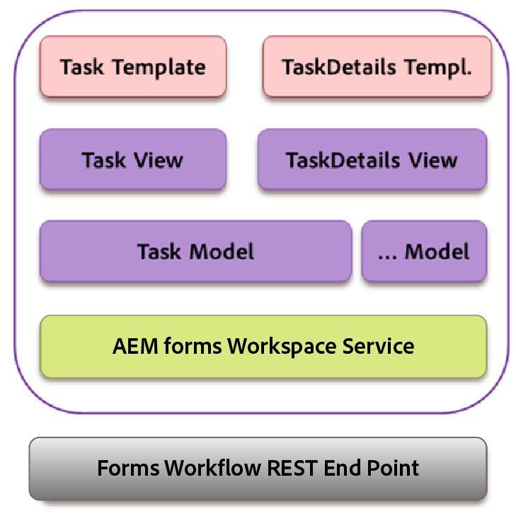

# Interaktion med ryggraden{#backbone-interaction}

Backbone är ett bibliotek som hjälper till att skapa och följa MVC-arkitektur i webbprogram. Grundtanken med Backbone är att ordna gränssnittet i logiska vyer, som backas upp av modeller, som kan uppdateras oberoende av varandra när modellen ändras, utan att du behöver rita om sidan. Mer information om Backbone finns i [https://backbonejs.org](https://backbonejs.org/).

Några viktiga begrepp är följande:

**Backbone-modellen** innehåller data och de flesta logik som är relaterade till dessa data.

**Backbone-vy** Används för att representera läget för motsvarande modell. En ryggradsvy fungerar som en kontrollenhet, lyssnar på användargränssnittshändelser som användarklickningar eller modellhändelser (som ändrade data) och ändrar användargränssnittet efter behov.

**HTML-mall** En omslutningsmall med platshållare ifyllda av modellen.

**AEM Forms-arbetsytan** innehåller flera enskilda komponenter. Varje komponent:

* Representerar ett enskilt element i det logiska användargränssnittet.
* Kan vara en samling med liknande komponenter.
* Skapad av Backbone-modellen, Backbone-vyn och HTML-mallen.
* Innehåller referens till en tjänst.
* Innehåller referens till nödvändiga verktyg.

När en komponent initieras skapas följande objekt:

* En ny instans av Backbone-modellen för komponenten skapas. Tjänsten injiceras i modellen.
* En ny instans av Backbone-vyn skapas.
* Förekomst av motsvarande modell, HTML-mall och verktyg matas in i vyn.

I Backbone-vyn finns det en händelsekarta som mappar de olika händelser som kan uppstå på grund av användargränssnittets interaktioner med en motsvarande hanterare. Den här mappningen initieras när en komponent initieras.

När en vy initieras anropar vyn sin motsvarande modell för att hämta data från servern. När alla data som krävs för en vy är tillgängliga återges data i det format som anges av mallen HTML. Flera vyer kan ha samma kommunikationsmodell.

Ett exempel:

1. Användaren klickar på en uppgiftsmall i uppgiftslistan.
1. Aktivitetsvyn lyssnar på klickljudet och anropar återgivningsfunktionen i aktivitetsmodellen.
1. Uppgiftsmodellen anropar sedan tjänsten som är en vanlig punkt för all kommunikation med AEM Forms-servern.
1. Tjänstklassen anropar AEM Forms REST-slutpunkten för återgivningsmetod via ajax.
1. Återanropet för det här Ajax-anropet har definierats i aktivitetsmodellen.
1. Uppgiftsmodellen genererar en ryggbenshändelse som ett meddelande om att återgivningsanropet är slutfört.
1. En annan vy, aktivitetsinformationsvyn lyssnar på den här händelsen från aktivitetsmodellen.
1. Vyn Uppgiftsinformation ändrar sedan mallen för uppgiftsinformation så att den återgivna uppgiften (formulär, detaljer, bilagor, anteckningar och så vidare) visas för användaren.
