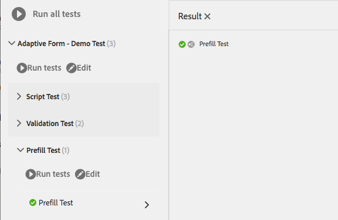

# Automatisera testning av anpassningsbara formulär{#automate-testing-of-adaptive-forms}

## Översikt {#overview}

Anpassningsbara formulär är en väsentlig del av kundinteraktionen. Det är viktigt att testa dina anpassningsbara formulär med varje ändring du gör i dem, till exempel när du distribuerar ett nytt korrigeringspaket eller ändrar en regel i formuläret. Funktionstestning av adaptiva formulär och alla fält i dem kan dock vara långsamma.

Med Calvin kan du automatisera testningen av dina anpassade formulär i webbläsaren. Calvin använder [Hobbes](/help/sites-developing/hobbes.md)användargränssnitt för att köra testerna och har följande verktyg:

* Ett JavaScript-API för att skapa tester.
* Ett användargränssnitt för att köra tester.

Med Calvin kan du skapa testfall i CRXDE och köra gränssnittstester direkt i webbläsaren för att testa följande aspekter av de adaptiva formulären:

<table>
 <tbody>
  <tr>
   <td><strong>Adaptiv formulärproportion för test</strong></td>
   <td><strong>Beskrivning</strong></td>
  </tr>
  <tr>
   <td>Förifyll upplevelsen av ett adaptivt formulär</td>
   <td>
    <ul>
     <li>Är formuläret förifyllt som förväntat baserat på datamodellens typ?</li>
     <li>Är standardvärdena för formulärobjekten förifyllda som förväntat?</li>
    </ul> </td>
  </tr>
  <tr>
   <td>Skicka in ett anpassat formulär</td>
   <td>
    <ul>
     <li>Genereras korrekta data vid sändning?</li>
     <li>Valideras formuläret på nytt på servern under sändning?</li>
     <li>Har åtgärden Skicka konfigurerats för formuläret som körs?</li>
    </ul> </td>
  </tr>
  <tr>
   <td><p>Uttrycksregler</p> <p> </p> </td>
   <td>
    <ul>
     <li>Är uttrycken som är kopplade till formulärobjekt, t.ex. calculate, visible, köra skript efter att ett fält har avslutats, körts efter att de relevanta UI-åtgärderna har utförts?<br /> </li>
    </ul> </td>
  </tr>
  <tr>
   <td>Valideringar</td>
   <td>
    <ul>
     <li>Körs fältvalideringar som förväntat efter att åtgärderna har utförts?</li>
    </ul> </td>
  </tr>
  <tr>
   <td><p>Lazy Loading</p> <p> </p> </td>
   <td>
    <ul>
     <li>När du klickar på flikar (eller något navigeringsobjekt på en panel) hämtas HTML-koden från servern enligt konfigurationen för lazy loading?</li>
    </ul></td>
  </tr>
  <tr>
   <td><p>Gränssnittsinteraktion</p> </td>
   <td>
    <ul>
     <li><a href="https://helpx.adobe.com/aem-forms/6-3/calvin-sdk-javascript-api/calvin.html#toc2__anchor" target="_blank">Testa gränssnittets interaktion med adaptiva formulärobjekt</a></li>
    </ul> </td>
  </tr>
 </tbody>
</table>

### Förutsättningar {#prerequisites}

Innan du använder den här artikeln för att skapa testfall måste du känna till följande:

* Skapa testsviter och köra testfall med [Hobbes](https://docs.adobe.com/docs/en/aem/6-3/develop/components/hobbes.html)
* [Hobbes JavaScript API:er](https://docs.adobe.com/docs/en/aem/6-2/develop/ref/test-api/index.html)
* [Calvin JavaScript API:er](https://helpx.adobe.com/aem-forms/6-3/calvin-sdk-javascript-api/calvin.html)

## Exempel: Skapa en testsvit för ett adaptivt formulär med Hobbes som testramverk {#example-create-a-test-suite-for-an-adaptive-form-using-hobbes-as-testing-framework}

Följande exempel visar hur du skapar en testsvit för att testa flera adaptiva formulär. Du måste skapa ett separat testfall för varje formulär som du behöver testa. Genom att följa de här stegen och ändra JavaScript-koden i steg 11 kan du skapa en egen testsvit för att testa dina adaptiva formulär.

1. Gå till CRXDE Lite i webbläsaren: `https://'[server]:[port]'/crx/de`.
1. Högerklicka på undermappen /etc/clientlibs och klicka på **Skapa** > **Skapa nod**. Ange ett namn (här afTestRegistration), ange typen av nod som cq:ClientLibraryFolder och klicka på **OK.**

   Mappen clientlibs innehåller registreringsaspekten för programmet (JS och Init). Vi rekommenderar att du registrerar alla Hobbes testsvitsobjekt som är specifika för ett formulär i mappen clientlibs.

1. Ange följande egenskapsvärden i den nyligen skapade noden (här afTestRegistration) och klicka sedan på **Spara alla**. Dessa egenskaper hjälper Hobbes att identifiera mappen som ett test. Om du vill återanvända det här klientbiblioteket som ett beroende i andra klientbibliotek ger du det namnet granite.testing.calvin.tests.

<table>
 <tbody>
  <tr>
   <td>Egenskap</td>
   <td>Typ</td>
   <td>Värde</td>
  </tr>
  <tr>
   <td><p>kategorier</p> </td>
   <td><p>Sträng[]</p> </td>
   <td><p>granite.testing.hobbes.tests, granite.testing.calvin.tests</p> </td>
  </tr>
  <tr>
   <td><p>beroenden</p> </td>
   <td><p>Sträng[]</p> </td>
   <td><p>granite.testing.hobbes.teberg, granite.testing.calvin, apps.testframework.all</p> </td>
  </tr>
 </tbody>
</table>

>[!NOTE]
>
>Klientlib-filen granite.testing.calvin.af innehåller alla API:er för adaptiva formulär. Dessa API:er ingår i calvin-namnutrymmet.


1. Högerklicka på testnoden (här **afTestRegistration)** och klicka sedan på **Skapa** > **Skapa fil**. Ge filen namnet js.txt och klicka på **OK**.
1. Lägg till följande text i filen js.txt:

   ```
   #base=.
   js.txt
   ```

1. Klicka på **Spara alla** och stäng sedan filen js.txt.
1. Högerklicka på testnoden (här **afTestRegistration)** och klicka på **Skapa** > **Skapa fil**. Ge filen namnet init.js och klicka på **OK**.
1. Kopiera följande kod till filen init.js och klicka på **Spara alla**:

   ```
   (function(window, hobs) {
       'use strict';
       window.testsuites = window.testsuites || {};
     // Registering the test form suite to the sytem
     // If there are other forms, all registration should be done here
       window.testsuites.testForm = new hobs.TestSuite("Adaptive Form - Demo Test", {
           path: '/etc/clientlibs/afTestRegistration/init.js',
           register: true
       });
    // window.testsuites.testForm1 = new hobs.TestSuite("testForm1");
   }(window, window.hobs));
   ```

   Ovanstående kod skapar en testsvit med namnet **Adaptiv form - Demo Test**. Om du vill skapa en testsvit med ett annat namn ändrar du namnet.

1. Klicka på **Skapa** > **Skapa nod** för att skapa en nod under mappen clientlib för varje formulär som du vill testa. I det här exemplet används en nod med namnet **testForm** för att testa ett adaptivt formulär med namnet **testForm**. Ange följande egenskaper och klicka på **OK**:

   * Namn: testForm (ditt formulärnamn)
   * Typ: cq:ClientLibraryFolder

1. Lägg till följande egenskaper i den nya noden (här testForm) för att testa ett adaptivt formulär:

   | **Egenskap** | **Typ** | **Värde** |
   |---|---|---|
   | kategorier | Sträng[] | granite.testing.hobbes.tests, granite.testing.hobbes.tests.testForm |
   | beroenden | Sträng[] | granite.testing.calvin.tests |

   >[!NOTE]
   >
   >I det här exemplet används ett beroende av klientens lib granite.testing.calvin.tests för bättre hantering. I det här exemplet läggs även en klientbibliotekskategori, granite.testing.hobbes.tests.testForm, till för att återanvända det här klientbiblioteket, om det behövs.

   

1. Högerklicka på mappen som du har skapat för testformuläret (här testformulär) och välj **Skapa** > **Skapa fil**. Ge filen namnet scriptingTest.js och lägg till följande kod i filen och klicka på **Spara alla.**

   Om du vill använda följande kod för att testa ett annat adaptivt formulär ändrar du sökvägen och namnet på formuläret i **navigateTo** (raderna 11, 36 och 62) och respektive testfall. Mer information om API:er för att testa olika aspekter av formulär och formulärobjekt finns i [Calvin-API:er](https://helpx.adobe.com/aem-forms/6-3/calvin-sdk-javascript-api/calvin.html).

   ```
   (function(window, hobs) {
       'use strict';
   
    var ts = new hobs.TestSuite("Script Test", {
           path: '/etc/clientlibs/testForm/scriptingTest.js',
     register: false
    })
   
       .addTestCase(new hobs.TestCase("Checking execution of calculate script")
           // navigate to the testForm which is to be tested
           .navigateTo("/content/forms/af/testForm.html?wcmmode=disabled")
           // check if adaptive form is loaded
           .asserts.isTrue(function () {
               return calvin.isFormLoaded()
           })
           .execSyncFct(function () {
               // create a spy before checking for the expression
               calvin.spyOnExpression("panel1.textbox1");
               // setValue would trigger enter, set the value and exit from the field
               calvin.setValueInDOM("panel1.textbox", "5");
           })
           // if the calculate expression was setting "textbox1" value to "5", let's also check that
           .asserts.isTrue(function () {
               return calvin.isExpressionExecuted("panel1.textbox1", "Calculate");
           })
           .execSyncFct(function () {
               calvin.destroySpyOnExpression("panel1.textbox1");
           })
           .asserts.isTrue(function () {
               return calvin.model("panel1.textbox1").value == "5"
           })
       )
   
       .addTestCase(new hobs.TestCase("Calculate script Test")
           // navigate to the testForm which is to be tested
           .navigateTo("/content/forms/af/cal/demoform.html?wcmmode=disabled&dataRef=crx:///content/forms/af/cal/prefill.xml")
           // check if adaptive form is loaded
           .asserts.isTrue(function () {
               return calvin.isFormLoaded()
           })
   
           .execSyncFct(function () {
               // create a spy before checking for the expression
               calvin.spyOnExpression("panel2.panel1488218690733.downPayment");
               // setValue would trigger enter, set the value and exit from the field
               calvin.setValueInDOM("panel2.panel1488218690733.priceProperty", "1000000");
           })
           .asserts.isTrue(function () {
               return calvin.isExpressionExecuted("panel2.panel1488218690733.downPayment", "Calculate");
           })
           .execSyncFct(function () {
               calvin.destroySpyOnExpression("panel2.panel1488218690733.downPayment");
           })
           .asserts.isTrue(function () {
               // if the calculate expression was setting "downPayment" value to "10000", let's also check that
      return calvin.model("panel2.panel1488218690733.downPayment").value == 10000
           })
       )
   
       .addTestCase(new hobs.TestCase("Checking execution of Value commit script")
           // navigate to the testForm which is to be tested
           .navigateTo("/content/forms/af/cal/demoform.html?wcmmode=disabled&dataRef=crx:///content/forms/af/cal/prefill.xml")
           // check if adaptive form is loaded
           .asserts.isTrue(function () {
               return calvin.isFormLoaded()
           })
   
           .execSyncFct(function () {
               // create a spy before checking for the expression
               calvin.spyOnExpression("panel2.panel1488218690733.priceProperty");
               // setValue would trigger enter, set the value and exit from the field
               calvin.setValueInDOM("panel2.panel1488218690733.priceProperty", "100");
           })
           .asserts.isTrue(function () {
               return calvin.isExpressionExecuted("panel2.panel1488218690733.priceProperty", "Value Commit");
           })
           .execSyncFct(function () {
               calvin.destroySpyOnExpression("panel2.panel1488218690733.priceProperty");
           })
           .asserts.isTrue(function () {
            // if the value commit expression was setting "textbox1488215618594" value to "0", let's also check that
               return calvin.model("panel2.panel1488218690733.textbox1488215618594").value == 0
           })
       );
   
    // register the test suite with testForm
     window.testsuites.testForm.add(ts);
   
    }(window, window.hobs));
   ```

   Testfallet skapas. Fortsätt att köra testfallet för att testa adaptiva formulär via Hobbes. Anvisningar om hur du kör testfall finns i [Utföra tester i Testa användargränssnittet med automatiserade tester](/help/sites-developing/hobbes.md).

Du kan också installera paketet i den bifogade filen SampleTestPackage.zip för att få samma resultat som i stegen som förklaras i exemplet: Skapa en testsvit för ett adaptivt formulär med Hobbes som testramverk.

[Hämta fil](assets/sampletestpackage.zip)

## Testa användargränssnittet med automatiserade tester {#testing-your-ui-using-automated-tests}

### Köra en testsvit {#running-a-single-test-suite}

Testsviter kan köras individuellt. När du kör en testsvit ändras sidan allt eftersom testärenden och deras åtgärder körs och resultaten visas när testet har slutförts. Ikoner anger resultatet.

En bockmarkeringsikon anger att testet har slutförts: 

En X-ikon anger att testet misslyckades: 

Så här kör du en testsvit:

1. Klicka på eller tryck på namnet på det testfall som du vill köra för att utöka detaljerna för åtgärderna.

   

1. Klicka eller tryck på knappen Kör test. 

   

1. Platshållaren ersätts med sidinnehåll när testet utförs.

   

1. Granska resultatet av testfallet genom att trycka på eller klicka på beskrivningen för att öppna panelen Resultat. Om du trycker eller klickar på namnet på testfallet på resultatpanelen visas all information.

   

Stegen för att testa dina AEM adaptiva formulär liknar stegen för att testa ditt AEM-användargränssnitt. Mer information om hur du testar adaptiva formulär finns i följande avsnitt i [Testa användargränssnittet](https://helpx.adobe.com//experience-manager/6-3/help/sites-developing/hobbes.html):

* Visa testsviter
* Köra flera tester

## Ordlista {#glossary}

<table>
 <tbody>
  <tr>
   <td><strong>Term</strong></td>
   <td><strong>Beskrivning</strong></td>
  </tr>
  <tr>
   <td><p>Testsvit</p> </td>
   <td><p>En testsvit är en samling relaterade testfall.</p> </td>
  </tr>
  <tr>
   <td><p>Testfall</p> </td>
   <td><p>Ett testfall representerar en åtgärd som en användare utför med ditt användargränssnitt. Lägg till testfall i testsviten för att testa de aktiviteter som användarna utför.</p> </td>
  </tr>
  <tr>
   <td><p>Åtgärder</p> </td>
   <td><p>Åtgärder är metoder som utför en gest i användargränssnittet, till exempel klickar på en knapp eller fyller i en inmatningsruta med ett värde.</p> <p>Metoderna för klasserna hobs.actions.Asserts, hobs.actions.Core och hobs.utils.af är åtgärder som du kan använda i dina tester. Alla åtgärder körs synkront.</p> </td>
  </tr>
  <tr>
   <td><p>Skapar- eller publiceringsmiljö</p> </td>
   <td><p>I allmänhet kan formulär antingen testas i författar- eller publiceringsmiljö. I publiceringsmiljö är som standard åtkomsten att köra testet begränsad. Detta beror på att alla klientbibliotek som är relaterade till testköraren finns inuti /libs i JCR-strukturen.</p> </td>
  </tr>
 </tbody>
</table>

