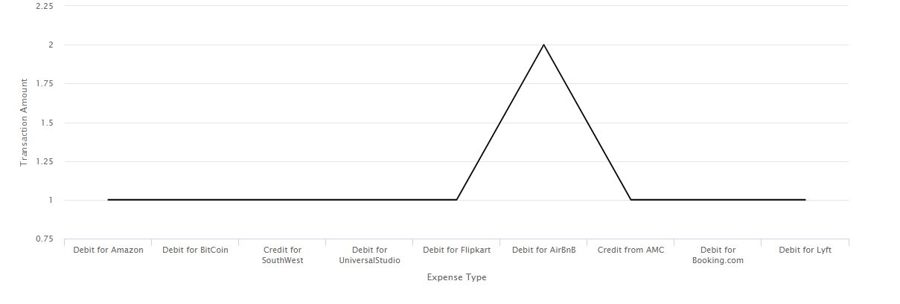

# Använda diagram i interaktiv kommunikation{#using-charts-in-interactive-communications}

Ett diagram eller diagram är en visuell representation av data. Det komprimerar stora mängder information till ett lättbegripligt visuellt format, vilket gör det möjligt för mottagarna av interaktiv kommunikation att bättre visualisera, tolka och analysera komplexa data.

När du skapar en interaktiv kommunikation kan du lägga till diagram som visuellt representerar tvådimensionella data från datamodellen i den interaktiva kommunikationen. Med diagramkomponenten kan du lägga till och konfigurera följande typer av diagram: Cirkel, Kolumn, Ring, Stapel, Linje, Punkt, Punkt, Yta och Kvadrant.

## Lägga till och konfigurera diagram i en interaktiv kommunikation {#add-and-configure-chart-in-an-interactive-communication}

Utför följande steg för att lägga till och konfigurera ett diagram i en interaktiv kommunikation:

1. Välj **Komponenter** i sidosparken i den interaktiva kommunikationen.
1. Dra och släpp komponenten **Diagram** till någon av följande komponenter:

   * Utskriftskanal: Målområde eller bildfält
   * Webbkanal: Panel- eller målområde

1. Markera diagramkomponenten i redigeraren för interaktiv kommunikation och välj **[!UICONTROL Configure (]** ) i verktygsfältet Komponent.

   Diagramegenskaperna visas i den vänstra rutan.

   

   Grundläggande egenskaper för ett linjediagram i en utskriftskanal

   

   Grundläggande egenskaper för ett linjediagram i en webbkanal

1. Konfigurera [diagramegenskaperna](../../forms/using/chart-component-interactive-communications.md#configure-chart-properties) baserat på kanaltypen.
1. (Endast skrivarkanal) Ange om det är obligatoriskt för agenten att använda det här diagrammet i **[!UICONTROL Agent Settings]**. Om alternativet i **[!UICONTROL t Is Mandatory For the Agent To Use This Chart]** inte är markerat kan agenten markera ögonikonen för diagrammet på fliken **[!UICONTROL Content]** i agentanvändargränssnittet för att visa eller dölja diagrammet.

   

1. Välj  om du vill spara diagramegenskaperna.

   Välj **[!UICONTROL Preview]** om du vill visa utseendet och data som är associerade med diagrammet. Välj **[!UICONTROL Edit]** om du vill konfigurera om diagrammets egenskaper.

## Konfigurera diagramegenskaper {#configure-chart-properties}

Konfigurera följande egenskaper när du skapar diagram för tryck- och webbkanaler:

<table>
 <tbody>
  <tr>
   <td>Fält</td>
   <td>Beskrivning</td>
   <td>Kanaltyp</td>
  </tr>
  <tr>
   <td>Namn</td>
   <td>Identifierare för diagramelementet. Namnet på diagrammet som anges i det här fältet visas inte i diagrammet. Den används när den refererar till elementet från andra komponenter, skript och SOM-uttryck.</td>
   <td>Tryck och webb</td>
  </tr>
  <tr>
   <td>Diagramtyp</td>
   <td>Typ av diagram som du vill generera. De tillgängliga alternativen är Cirkel, Kolumn, Donut, Stapel, Linje, Punkt, Punkter och Yta.</td>
   <td>Tryck och webb</td>
  </tr>
  <tr>
   <td>Serier &gt; Flera serier</td>
   <td>Välj det här alternativet om du vill lägga till flera serier för formulärdatamodellens samlingsobjekt som ritats på X- och Y-axeln.</td>
   <td>Tryck och webb</td>
  </tr>
  <tr>
   <td>Series &gt; Data Model Object</td>
   <td>Namnet på den formulärdatamodellsamling som du vill lägga till flera serier i diagrammet.<br /> Välj en objektegenskap för överordnad formulärdatamodell för egenskaperna som ritas på X-axeln och Y-axeln för att skapa en meningsfull serie. Datamodellobjektet som du binder måste vara av typen Number, String eller Date.</td>
   <td>Tryck och webb</td>
  </tr>
  <tr>
   <td>Visa staplade</td>
   <td>Markera om du vill stapla värdena för varje serie ovanpå varandra.</td>
   <td>Tryck och webb</td>
  </tr>
  <tr>
   <td>X-axel &gt; Titel</td>
   <td>X-axelns namn.</td>
   <td>Tryck och webb</td>
  </tr>
  <tr>
   <td>X-axel &gt; Datamodellsobjekt</td>
   <td><p>Namnet på det formulärdatamodellsamlingsobjekt som ska ritas på X-axeln.</p> <p>Välj två samlings-/arraytypegenskaper för samma överordnade datamodellsobjekt som är meningsfulla i förhållande till varandra för att rita på X- och Y-axeln i ett diagram. Datamodellobjektet som du binder måste vara av typen Number, String eller Date.</p> </td>
   <td>Tryck och webb</td>
  </tr>
  <tr>
   <td>Y-axel &gt; Titel</td>
   <td>Y-axelns namn. </td>
   <td>Tryck och webb</td>
  </tr>
  <tr>
   <td>Y-axel &gt; Datamodellsobjekt</td>
   <td><p>Samlingsobjekt för formulärdatamodell som ska ritas på Y-axeln. I utskriftskanalen ska datamodellobjektet för Y-axeln vara av typen Number.</p> <p>Välj två samlings-/arraytypegenskaper för samma överordnade datamodellsobjekt som är meningsfulla i förhållande till varandra för att rita på X- och Y-axeln i ett diagram. </p> </td>
   <td>Tryck och webb</td>
  </tr>
  <tr>
   <td>Y-axel &gt; Funktion</td>
   <td>Statistisk/anpassad funktion som används för att beräkna värdena på y-axeln.</td>
   <td>Tryck och webb</td>
  </tr>
  <tr>
   <td>Dölj objekt</td>
   <td>Välj det här alternativet om du vill dölja diagrammet i det slutliga resultatet.</td>
   <td>Tryck och webb</td>
  </tr>
  <tr>
   <td>Titel</td>
   <td>Diagrammets namn. </td>
   <td>Skriv ut</td>
  </tr>
  <tr>
   <td>Höjd</td>
   <td>Diagrammets höjd i pixlar.</td>
   <td>Skriv ut</td>
  </tr>
  <tr>
   <td>Bredd</td>
   <td>Diagrammets bredd i pixlar. Du kan styra diagrammets bredd i webbkanalen med hjälp av stillagret eller genom att använda ett tema.</td>
   <td>Skriv ut</td>
  </tr>
  <tr>
   <td>Obligatorisk sidbrytning före</td>
   <td>Välj det här alternativet om du vill lägga till en obligatorisk sidbrytning före diagrammet och placera diagrammet överst på en ny sida. </td>
   <td>Skriv ut</td>
  </tr>
  <tr>
   <td>Obligatorisk sidbrytning efter</td>
   <td>Välj det här alternativet om du vill lägga till en obligatorisk sidbrytning efter diagrammet och placera innehållet efter diagrammet överst på en ny sida. </td>
   <td>Skriv ut</td>
  </tr>
  <tr>
   <td>Indrag</td>
   <td>Diagrammets indrag från sidans vänstra kant. </td>
   <td>Skriv ut</td>
  </tr>
  <tr>
   <td>Verktygstips</td>
   <td><p>Det format som verktygstipset visas i när användaren för musen över en datapunkt i diagrammet i webbkanalen. Standardvärdet är ${x}(${y}). Beroende på diagramtyp ersätts variablerna ${x} och ${y} dynamiskt med motsvarande värden på X-axeln och Y-axeln när du pekar med musen på en punkt, stapel eller segment i diagrammet och visas i verktygstipset.</p> <p>Om du vill inaktivera verktygstipset lämnar du <span class="uicontrol">verktygstipset</code> fältet är tomt. Det här alternativet gäller inte för linjediagram och ytdiagram. Se t.ex. <a href="#chartoutputprintweb">Exempel 1: Diagramutdata i tryck och på webben</a>.</p> </td>
   <td>Webb</td>
  </tr>
  <tr>
   <td>Diagramspecifika konfigurationer</td>
   <td><p>Förutom vanliga konfigurationer finns följande diagramspecifika konfiguration tillgänglig:</p>
    <ul>
     <li><strong>Visa förklaring: </strong>Visar en förklaring för cirkeldiagrammet eller bottendiagrammet när det är aktiverat.</li>
     <li><strong>Förklaringens position: </strong>Anger förklaringens position i förhållande till diagrammet. De tillgängliga alternativen är Höger, Vänster, Upptill och Nedtill. Använd den högra teckenförklaringen i utskriftskanalen.</li>
     <li><strong>Innerradie</strong>: Tillgängligt för Donut-diagram för att ange radien (i pixlar) för den inre cirkeln i diagrammet.</li>
     <li><strong>Linjefärg</strong>: Finns för linje-, linje- och punktdiagram samt ytdiagram för att ange linjefärgen i diagrammet.</li>
     <li><strong>Punktfärg</strong>: Tillgängligt för punkttecken och linje- och punktdiagram för att ange färg för punkterna i diagrammet.<br /> </li>
     <li><strong>Områdesfärg</strong>: Tillgängligt för ytdiagram för att ange färgen för området under linjen i diagrammet.</li>
     <li><strong>Referenspunkt &gt; Bindningstyp: </strong>Tillgängligt för kvadrantdiagram för att <strong> </strong>ange bindningstypen för referenspunkten. Använd den statiska text- eller datamodellens objektegenskap för att definiera värdet för referenspunkten.</li>
     <li><strong>Referenspunkt &gt; X-axel: </strong>Tillgängligt för kvadrantdiagram om du väljer <span class="uicontrol">Statisk</code> i listrutan Bindningstyp för att ange X-axelvärdet för referenspunkten.</li>
     <li><strong>Referenspunkt &gt; Y-axel: </strong>Tillgängligt för kvadrantdiagram om du väljer <span class="uicontrol">Statisk</code> i listrutan Bindningstyp för att ange Y-axelvärdet för referenspunkten.</li>
     <li><strong>Referenspunkt &gt; Datamodellobjekt för serie: </strong>Tillgängligt för kvadrantdiagram för flera serier om du väljer <span class="uicontrol">Datamodellobjekt</code> i listrutan Bindningstyp. Definiera objektegenskapen för formulärdatamodellen för att identifiera serien för referenspunkten. </li>
     <li><strong>Referenspunkt &gt; Datamodellobjektvärde för serie: </strong>Tillgängligt för kvadrantdiagram för flera serier om du väljer <span class="uicontrol">Datamodellsobjekt</code> i listrutan Bindningstyp. Använd objektegenskapen för formulärdatamodellen för serie och det värde som definieras i det här fältet för att identifiera serien för referenspunkten.</li>
     <li><strong>Referenspunkt &gt; Datamodellobjekt för referenspunkt: </strong>Tillgängligt för kvadrantdiagram om du väljer <span class="uicontrol">Datamodellsobjekt</code> i listrutan Bindningstyp. Definiera en objektegenskap för formulärdatamodellen som är jämställd med egenskaperna som ritas på X- och Y-axeln. För flera serier definierar du dessutom en datamodellsobjektegenskap som är en underordnad enhet till datamodellens objektegenskap som definierats för serien.</li>
     <li><strong>Referenspunkt &gt; Datamodellobjektvärde för referenspunkt: </strong>Tillgängligt för kvadrantdiagram om du väljer <span class="uicontrol">Datamodellsobjekt</code> i listrutan Bindningstyp. Använd objektegenskapen för formulärdatamodellen som referenspunkt och det värde som definieras i det här fältet för att identifiera referenspunkten för diagrammet.<br /> <strong>Kvadrantetiketter &gt; Övre vänstra:</strong> Tillgängligt för kvadrantdiagram för att ange namnet på den övre vänstra kvadranten.</li>
     <li><strong>Kvadrantetiketter &gt; Övre högra:</strong> Tillgängligt för kvadrantdiagram för att ange namnet på den övre högra kvadranten.</li>
     <li><strong>Kvadrantetiketter &gt; Nedre höger: </strong>Tillgängligt för kvadrantdiagram för att ange namnet på den nedre högra kvadranten.</li>
     <li><strong>Kvadrantetiketter &gt; Nederst till vänster: </strong>Tillgängligt för kvadrantdiagram för att ange namnet på den nedre vänstra kvadranten.</li>
    </ul> </td>
   <td>Tryck och webb</td>
  </tr>
 </tbody>
</table>

## Använda funktioner i diagram {#use-functions-in-chart}

Du kan konfigurera ett diagram så att statistiska funktioner används för att beräkna värden från källdata för plottning i diagrammet. Genom att använda funktioner i ett diagram kan du rita data som inte tillhandahålls direkt av formulärdatamodellen.


Medan diagramkomponenten innehåller vissa inbyggda funktioner kan du skriva [anpassade funktioner](#customfunctionsweb) och göra dem tillgängliga för användning i diagramkonfigurationen i webbkanalen.

Följande funktioner är tillgängliga som standard med komponenten Chart:

**Medel (medel)** Returnerar medelvärdet av värdena på X- eller Y-axeln för ett givet värde på den andra axeln.

**Summa** Returnerar summan av alla värden på X- eller Y-axeln för ett givet värde på den andra axeln.

**Maximum** Returnerar det maximala värdet på X- eller Y-axeln för ett givet värde på den andra axeln.

**Frekvens** Returnerar antalet värden på X- eller Y-axeln för ett givet värde på den andra axeln.

**Intervall** Returnerar skillnaden mellan det högsta och det lägsta värdet på X- eller Y-axeln för ett givet värde på den andra axeln.

**Median** Returnerar det värde som skiljer högre och lägre värden i halva X- eller Y-axeln från varandra för ett givet värde på den andra axeln.

**Minimum** Returnerar det minsta värdet på X- eller Y-axeln för ett givet värde på den andra axeln.

**Läge** Returnerar värdet med de flesta förekomster på X- eller Y-axeln för ett givet värde på den andra axeln.

Mer information finns i [Exempel 2: Användning av summerings- och frekvensfunktioner i ett linjediagram](#applicationsumfrequency).

### Anpassade funktioner i webbkanalen {#customfunctionsweb}

Förutom att använda standardfunktionerna i diagram kan du skriva anpassade funktioner i JavaScript™ och göra dem tillgängliga i listan med funktioner i diagramkomponenten för webbkanalen.

En funktion tar en eller flera matriser och ett kategorinamn som indata och returnerar ett värde. Till exempel:

```javascript
Multiply(valueArray, category) {
 var val = 1;
 _.each(valueArray, function(value) {
 val = val * value;
 });
 return val;
}
```

När du har skrivit en anpassad funktion gör du följande för att göra den tillgänglig för användning i diagramkonfigurationen:

1. Lägg till den anpassade funktionen i klientbiblioteket som är kopplad till den relevanta interaktiva kommunikationen. Mer information finns i [Konfigurera åtgärden Skicka](/help/forms/using/configuring-submit-actions.md) och [Använda bibliotek på klientsidan](/help/sites-developing/clientlibs.md).

1. Om du vill visa den anpassade funktionen i listrutan Funktion skapar du i CRXDe Lite en `nt:unstructured`-nod i mappen apps med följande egenskaper:

   * Lägg till egenskapen `guideComponentType` med värdet `fd/af/reducer`. (obligatoriskt)

   * Lägg till egenskapen `value` i ett fullständigt kvalificerat namn för den anpassade JavaScript™-funktionen. (obligatoriskt) och ange dess värde till namnet på den anpassade funktionen, till exempel Multiplicera.
   * Lägg till egenskapen `jcr:description` med det värde som du vill visa som namnet på den anpassade funktionen som visas i listrutan Funktion. Till exempel **Multiplicera**.

   * Lägg till egenskapen `qtip` med ett värde som är en kort beskrivning av den anpassade funktionen. Det visas som ett verktygstips när du håller pekaren över funktionsnamnet i listrutan **Funktion** .

1. Klicka på **Spara alla** för att spara konfigurationen.

Funktionen kan nu användas i diagrammet.

## Exempel 1: Diagramutdata för tryck och webb {#chartoutputprintweb}

På fliken Grundläggande definierar du diagramtyp, egenskaper för källformulärdatamodellen som innehåller data, etiketter som ska ritas på X- och Y-axeln i diagrammet och eventuellt statistikfunktionen för att beräkna värdena för att rita i diagrammet.

Låt oss i detalj förstå vilken information som minst krävs i grundläggande egenskaper, med hjälp av en kortsats som skapats med en interaktiv kommunikation. Tänk på att du vill generera ett diagram som avbildar beloppet för olika utgifter i utdraget. Du vill använda olika typer av diagram för utskrift och webb i den interaktiva kommunikationen.

### Kolumndiagram för utskrift {#columnchartprint}

För att uppnå detta anger du följande egenskaper:

* **[!UICONTROL Name]** - Ange diagrammets namn.
* **[!UICONTROL Chart Type]** - Välj **Kolumn** i listrutan.
* **[!UICONTROL Title]** - Ange utgiftstyp för X-axeln och Transaktionsbelopp för Y-axeln.
* **[!UICONTROL Data Model Objects]** - Välj datamodellens objektegenskaper för att skapa databindningar för X-axeln (Utgiftstyp) och Y-axeln (Transaktionsmängd).


Kolumndiagram i tryckkanaler i en interaktiv kommunikation

### Ringdiagram för webben {#donutchartweb}

För att uppnå detta anger du följande egenskaper:

* **[!UICONTROL Name]** - Ange diagrammets namn.
* **[!UICONTROL Chart Type]** - Välj **[!UICONTROL Donut]** i listrutan.
* **[!UICONTROL Data Model Objects]** - Välj datamodellens objektegenskaper för att skapa databindningar för X-axeln (Utgiftstyp) och Y-axeln (Transaktionsmängd).
* **[!UICONTROL Inner Radius]** - Ange värdet för inre radie som 150 för att ange radien (i pixlar) för den inre cirkeln i diagrammet.
* **[!UICONTROL Tooltip]** - Använd standardformatet ${x}(${y}) för att visa verktygstipset. Verktygstipset visas som: Utgiftstyp (transaktionsbelopp). Exempel: Debit för Bitmynt (10000).


Ringdiagram i webbkanalen i en interaktiv kommunikation

## Exempel 2: Användning av summerings- och frekvensfunktioner i ett linjediagram {#applicationsumfrequency}

Genom att använda funktioner i ett diagram kan du rita data som inte tillhandahålls direkt av formulärdatamodellen. I det här exemplet använder vi ett kreditkortsexempel för att förstå hur summerings- och frekvensfunktioner kan användas i diagrammet.


Linjediagram utan en funktion med två&quot;Debit for AirBnB&quot;-transaktioner

### Summeringsfunktion {#sum-function}

Du kan använda summafunktionen för att lägga till värden för flera instanser av samma dataegenskap och bara visa den en gång. I följande diagram används funktionen Sum på Y-axeln för att lägga till beloppet för de två Debit för AirBnB-transaktioner (2050 och 1050) och bara visa en transaktion (3100).

Summeringsfunktionen kan göra diagrammet mer användbart när du vill sortera och visa summan för många förekomster av samma dataegenskap.


### Funktionen Frekvens {#frequency-function}

Funktionen Frequency returnerar antalet Y-axelvärden för ett givet värde på den andra axeln. När funktionen Frekvens används på Y-axeln (transaktionsbelopp) visar diagrammet att det finns två förekomster av Debit för AirBnB-transaktioner och en förekomst av de övriga transaktionstyperna.



## Exempel 3: Flerseriskvadrantdiagram i webben {#example-multi-series-quadrant-chart-in-web}

Diagrammet visar beloppet för transaktioner som utförts i ett visst datumintervall. I kvadrantdiagrammet kan du dela upp diagramområdet i fyra märkta avsnitt. Tecknet använder en statisk referenspunkt för X-axeln och Y-axeln. Använd funktionen för flera serier för att dela upp data baserat på bankens namn.

För att uppnå detta anger du följande egenskaper:

* **Namn:** Ange diagrammets namn.
* **Diagramtyp:** Välj **Kvadrant** i listrutan.

* Markera kryssrutan **Flera serier**.
* **Datamodellobjekt**: Ange datamodellens objektegenskap för serien. Datamodellens objektegenskap för banknamnet är överordnad datamodellens objektegenskaper som ritas i X-axeln och Y-axeln.
* **Datamodellsobjekt:** Markera datamodellsobjektsegenskaperna för att skapa databindningar för X-axeln (transaktionsdatum) och Y-axeln (transaktionsmängd).
* I avsnittet **Referenspunkt** väljer du **Statisk** som bindningstyp.

* Ange värdena för referenspunkterna X-axel och Y-axel.
* Ange kvadrantetiketterna för kvadranterna längst upp till vänster, uppe till höger, nere till höger och nere till vänster.
* Markera kryssrutan **Visa teckenförklaringar** om du vill visa färgkoderna för banknamnen.


