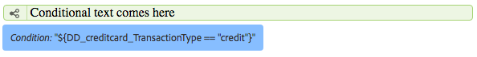

# Infogade villkor och upprepningar i interaktiv kommunikation och brev{#inline-condition-and-repeat-in-interactive-communications-and-letters}

## Textbundna villkor {#inline-conditions}

Med AEM Forms kan du använda textbundna villkor i textmoduler för att automatisera återgivning av text som är beroende av sammanhanget eller data som är kopplade till formulärdatamodellen (i Interaktiv kommunikation) eller datamordlistan (med bokstäver). Textbundna villkor visar specifikt innehåll baserat på att villkorsutvärderingen är true eller false.

Villkoren utför beräkningar på datavärden som tillhandahålls av formulärdatamodellen/datamordlistan eller av slutanvändarna. Med textbundna villkor kan du spara tid och minska antalet mänskliga fel samtidigt som du skapar sammanhangsberoende och personaliserade interaktiva kommunikationer/brev.

Mer information finns i:

* [Skapa en interaktiv kommunikation](../../forms/using/create-interactive-communication.md)
* [Översikt över korrespondenshantering](/help/forms/using/cm-overview.md)
* [Text i interaktiv kommunikation](../../forms/using/texts-interactive-communications.md)

### Exempel: Använda regler för att villkoralisera intern text i interaktiv kommunikation {#example-using-rules-to-conditionalize-inline-text-in-interactive-communication}

Om du vill villkoralisera en mening, ett stycke eller en textsträng i ett interaktivt kommunikationsavsnitt kan du skapa en regel i rätt textdokumentfragment. I följande exempel används en regel för att visa ett avgiftsfritt nummer endast för de amerikanska mottagarna av interaktiv kommunikation.

Mer information finns i Skapa regel i text i [Texter i interaktiv kommunikation](../../forms/using/texts-interactive-communications.md).

När du har inkluderat textavsnittet i ett interaktivt kommunikations- och agentgränssnitt för att förbereda en interaktiv kommunikation, utvärderas (formulärdatamodell)-data för mottagarna och texten visas endast för mottagarna i USA.

### Exempel: Använda textbundna villkor i en bokstav för att återge rätt adress {#example-using-inline-condition-in-a-letter-to-render-the-appropriate-address}

Du kan infoga ett textbundet villkor i en bokstav genom att infoga det textbundna villkoret i rätt textmodul. I följande exempel används två villkor för att utvärdera och visa lämplig adress, Sir eller Ma&#39;am, i ett brev baserat på DD-elementets kön. Om du använder liknande steg kan du skapa andra villkor.

>[!NOTE]
>
>Om dina befintliga resurser innehåller gamla villkor/repeteringsuttryck (före 6.2 SP1 CFP 4) visar resurserna gammal syntax för villkor och repetering. Det gamla villkoret/upprepningen fungerar dock. De nya och gamla villkors-/upprepningsuttrycken är kompatibla med varandra för att skapa en kapslad blandning av gamla och nya villkor-/upprepningsuttryck.

1. Markera i den relevanta textmodulen den del av texten som du vill göra villkorlig och tryck på **Villkor**.

   

   Dialogrutan Villkor visas med ett tomt villkor.

   

   >[!NOTE]
   >
   >Ett tomt eller ogiltigt villkorsuttryck kan inte sparas. Det måste finnas ett giltigt villkorsuttryck i `${}` för att du ska kunna spara uttrycket.

1. Gör följande för att skapa ett villkor för att utvärdera om den markerade/villkorade texten visas i bokstaven och tryck sedan på bockmarkeringen för att spara uttrycket:

   Dubbeltryck på ett DD-element om du vill infoga det i villkoret. Infoga lämplig operator och konstruera följande villkor i dialogrutan.

   ```java
   ${DD_creditcard_Gender=="Male"}
   ```

   Mer information om hur du skapar uttrycket finns i **Skapa uttryck och fjärrfunktioner med uttrycksverktyget** i [Expression Builder](../../forms/using/expression-builder.md). Värdet som anges i uttrycket måste ha stöd för elementet i dataordlistan. Mer information finns i [Dataordlista](../../forms/using/data-dictionary.md).

   När villkoret har infogats kan du hålla muspekaren över handtaget till vänster om villkoret för att visa det. Du kan trycka på handtaget för att visa snabbmenyn för villkoret, som du kan använda för att redigera eller ta bort villkoret.

    

1. Infoga liknande villkor genom att markera texten `Ma'am`.

   ```java
   ${DD_creditcard_Gender == "Female"}
   ```

1. Förhandsgranska den relevanta bokstaven och lägg märke till att texten återges enligt det infogade villkoret. Du kan ange värdet för D-elementet Genus med:

   * Ett exempel på en XML-datafil som skapats baserat på den relevanta dataordlistan när bokstaven förhandsgranskas med exempeldata.
   * En XML-datafil som är kopplad till den relevanta dataordlistan.
   Mer information finns i [Dataordlista](../../forms/using/data-dictionary.md).

   

## Upprepa {#repeat}

Du kan ha dynamisk information i din interaktiva kommunikation/bokstav, till exempel transaktioner i en kreditkortssats, vars förekomst eller förekomst kan ändras för varje genererat brev. Med upprepning kan du formatera och strukturera sådan dynamisk information i textdokumentfragmentet.

Du kan dessutom ange regel/villkor i den upprepade konstruktionen för att villkoralisera informationen/posterna som återges i den interaktiva kommunikationen/bokstaven.

### Exempel: Använda upprepning i en interaktiv kommunikation för att formatera, strukturera och visa en lista över kreditkortstransaktioner {#example-using-repeat-in-an-interactive-communication-to-format-structure-and-display-a-list-of-credit-card-transactions}

I följande exempel visas hur du använder upprepning för att strukturera och återge kreditkortstransaktionerna i en interaktiv kommunikation.

1. I ett formulärdatamodellbaserat textdokumentfragment infogar du relevanta datamodellsobjekt (och inbäddad text som krävs för etiketterna, som i det här exemplet):

   

   >[!NOTE]
   >
   >Det repeterbara innehållet måste innehålla minst en egenskap av typen Samling.

1. Välj det innehåll som ska upprepas.

   

1. Tryck på Upprepa.

   Dialogrutan Upprepa visas.

   

1. Välj Radbrytning som avgränsare och tryck, om det behövs, på Lägg till villkor för att skapa en regel. Du kan också använda text som avgränsare och ange vilka tecken som ska användas som avgränsare.

   Dialogrutan Skapa regel visas.

1. Skapa en regel för att visa transaktioner som är daterade efter 28 februari 2018 för att inkludera transaktionerna bara för mars i det interaktiva meddelandet.

   >[!NOTE]
   >
   >I det här exemplet antas att agenten kommer att skapa programsatsen i slutet av mars 2018. Annars kan du skapa en annan regel som inkluderar transaktioner före 2018-04-01 för att exkludera transaktioner efter mars 2018.

   

1. Spara villkoret/regeln och spara sedan upprepningen. Villkorlig upprepning används för det markerade innehållet.

   

   Vid muspekaren över visar textdokumentfragmentet villkoret och avgränsaren som används i den upprepning som används för innehållet.

1. Spara textdokumentfragmentet och förhandsgranska relevant interaktiv kommunikation. Beroende på data i formulärdatamodellen återger den upprepning som används på elementen transaktionsinformationen som liknar följande i förhandsgranskningen:

   

### Exempel: Använda upprepa i en bokstav för att formatera, strukturera och visa en lista över kreditkortstransaktioner {#example-using-repeat-in-a-letter-to-format-structure-and-display-a-list-of-credit-card-transactions}

I följande exempel visas hur du använder upprepning för att strukturera och återge kreditkortstransaktionerna i en bokstav. Om du använder liknande steg kan du använda upprepning i ett annat scenario.

1. Öppna (när du redigerar eller skapar) en textmodul som innehåller DD-element som återger upprepade/dynamiska data och bäddar in den text som behövs runt DD-elementen. En textmodul har till exempel följande D-element för att skapa en transaktionsdeklaration på ett kreditkort:

   ```
   {^DD_creditcard_TransactionDate^} {^DD_creditcard_TransactionAmount^}
   {^DD_creditcard_TransactionType^}
   ```

   Dessa DD-element återger en lista över de transaktioner som gjorts på kreditkortet med följande information:

   Transaktionsdatum, Transaktionsbelopp och Transaktionstyp (Debit eller Credit)

1. Bädda in texten i DD-elementen för att göra satsen mer läsbar, till exempel:

   

   ```
   Date: {^DD_creditcard_TransactionDate^} Amount (USD): {^DD_creditcard_TransactionAmount^} Transaction Type: {^DD_creditcard_TransactionType^}
   ```

   Jobbet att återge en välformaterad programsats är dock inte klart än. Om du återger en bokstav baserat på det arbete du har gjort hittills visas den som följande:

   

   Om du vill upprepa den statiska texten tillsammans med DD-elementen måste du upprepa enligt anvisningarna i de följande stegen.

1. Markera den statiska texten samt de DD-element som du vill upprepa enligt nedan:

   

1. Tryck på **Upprepa**. Dialogrutan Upprepa visas med ett tomt infogat villkor.

   

1. Om det behövs infogar du ett villkor för att selektivt återge transaktionerna, t.ex. för att återge transaktionsbelopp som är större än 50 cent:

   ```
   ${DD_creditcard_TransactionAmount > 0.5}
   ```

   Om du inte behöver återge informationen (här transaktioner) selektivt, ska du annars låta villkoret vara tomt genom att ta bort följande i dialogrutan: `${}`. Att spara ett upprepningsuttryck aktiveras antingen när fönstret för upprepningsuttrycket är tomt (utan ${} när ingen upprepning behövs) eller när det innehåller ett giltigt villkor för upprepning.

1. Välj en avgränsare för formatering av den dynamiska texten och tryck på bockmarkeringen för att spara:

   * **Radbrytning**: Infogar radbrytning efter varje transaktionspost i utdatabokstaven.
   * **Text**: Infogar det angivna texttecknet efter varje transaktionspost i utdatabokstaven.
   När villkoret har infogats markeras den upprepade texten i rött och ett handtag visas till vänster. Du kan hålla muspekaren över handtaget till vänster om upprepningen för att visa den upprepade konstruktionen.

   

   Du kan trycka på handtaget för att visa snabbmenyn för upprepningen, som gör att du kan redigera eller ta bort den upprepade konstruktionen.

   

1. Förhandsgranska den relevanta bokstaven och lägg märke till att texten återges enligt upprepning. Du kan ange värdet för DD-element med:

   * Ett exempel på en XML-datafil som skapats baserat på den relevanta dataordlistan när bokstaven förhandsgranskas med exempeldata.
   * En XML-datafil som är kopplad till den relevanta dataordlistan.
   Mer information finns i [Dataordlista](https://helpx.adobe.com/aem-forms/6-2/data-dictionary.html).

   

   Den statiska texten upprepas med transaktionsinformationen. Upprepad statisk text underlättas av den upprepning som används för texten i den här proceduren. Villkoret ${DD_creditcard_TransactionAmount > 0.5} säkerställer att transaktioner under USD 5 inte återges i brevet.

   >[!NOTE]
   >
   >Du kan bara infoga villkor och upprepa medan du skapar eller redigerar den relevanta textmodulen. Även om du kan redigera i textmodulen när du förhandsgranskar brevet kan du inte infoga villkor eller upprepa.

## Använda internt villkor och upprepning - vissa användningsfall {#using-inline-condition-and-repeat-some-use-cases}

### Upprepa i villkor {#repeat-within-condition}

Du kan behöva upprepa detta inom ett villkor. Med Korrespondence Management kan du använda upprepning i en intern villkorskonstruktion.

Till exempel upprepas följande (med rött format) i ett villkor (med grönt format).

När upprepningen återger kreditkortstransaktionerna säkerställer villkoret ${DD_creditcard_nooftransaction > 0} att den upprepade konstruktionen endast återges om det finns minst en transaktion.


På samma sätt kan du skapa:

* Ett eller flera villkor inom ett villkor
* Ett eller flera villkor i en upprepning
* En kombination av villkor och upprepning inom ett villkor eller upprepning

### Tomt infogat villkor {#empty-inline-condition}

Du kan behöva infoga tomma textbundna villkor och bädda in text och DD-element senare. Med Correspondence Management kan ni göra det.



Vi rekommenderar dock att du, om det är möjligt, infogar text- och DD-elementen först i textmodulen med avsedd formatering, t.ex. punkter, och därefter infogar ett textbundet villkor.
