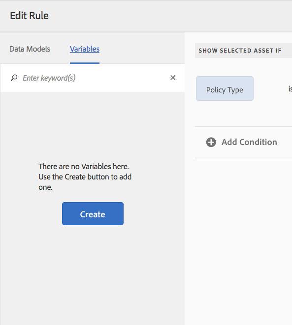

# Villkor i interaktiv kommunikation{#conditions-in-interactive-communications}

Att skapa och redigera villkorsfragment som ska användas i interaktiv kommunikation - villkoret är en av de fyra typer av dokumentfragment som används för att skapa interaktiv kommunikation. De andra tre är texter, listor och layoutfragment.

## Ökning {#overview}

Villkor är ett dokumentfragment som du kan inkludera i en interaktiv kommunikation. De andra dokumentfragmenten är [text](../../forms/using/texts-interactive-communications.md), lista och layoutfragment. Med villkor kan du definiera en eller flera sammanhangsberoende resurser som tas med i ett interaktivt meddelande baserat på angivna data och regler.

Exempel:

* I kreditkortsbeskedet visar du kreditkortets årsavgift och kreditkortsbilden baserat på typen av kundens kreditkort.
* I en påminnelse om försäkringspremier visar du beräkningar av skatt baserat på kundens skatter.

Resurserna i de villkor som återges baserat på de regler som tillämpas och de värden som skickas till regeln. Reglerna i villkoren kan kontrollera värden i följande typer av data:

* Egenskapen för associerad formulärdatamodell
* Alla variabler som du skapar i villkoret
* Strängar
* Nummer
* Matematiska uttryck
* Datum

## Skapa villkor {#createcondition}

1. Välj **[!UICONTROL Forms]** > **[!UICONTROL Document Fragments]**.
1. Välj **[!UICONTROL Create]** > **[!UICONTROL Condition]**.
1. Ange följande information:

   * **[!UICONTROL Title]**: (Valfritt) Ange villkorets titel. Titlar behöver inte vara unika och kan innehålla specialtecken och tecken som inte är engelska. Villkoren refereras till av deras titlar (om de är tillgängliga), t.ex. i miniatyrbilder och egenskaper.
   * **[!UICONTROL Name]**: Villkorets unika namn i en mapp. Det får inte finnas två dokumentfragment (text, villkor eller lista) i något läge med samma namn i en mapp. I fältet Namn kan du bara ange engelska tecken, siffror och bindestreck. Fältet Namn fylls i automatiskt baserat på fältet Titel. De specialtecken, blanksteg, siffror och icke-engelska tecken som anges i fältet Titel ersätts med bindestreck i fältet Namn. Även om värdet i fältet Titel automatiskt kopieras till namnet kan du redigera värdet.

   * **[!UICONTROL Description]**: Ange en beskrivning av dokumentfragmentet.
   * **[!UICONTROL Form Data Model]**: Om du vill kan du välja alternativknappen Formulärdatamodell för att skapa villkoret baserat på en formulärdatamodell. När du väljer alternativknappen Formulärdatamodell visas fältet **[!UICONTROL Form Data Model]**. Bläddra och välj en formulärdatamodell. När du skapar villkor för en interaktiv kommunikation måste du se till att du använder samma datamodell som du tänker använda i den interaktiva kommunikationen. Mer information om formulärdatamodell finns i [Dataintegrering](../../forms/using/data-integration.md).

   * **[!UICONTROL Tags]**: Om du vill skapa en egen tagg anger du ett värde i textfältet och väljer Retur. När du sparar det här villkoret skapas de nya taggarna.

1. Välj **[!UICONTROL Next]**.

   Sidan Skapa villkor visas.

   

1. Välj **[!UICONTROL Add Assets]**.

   En Assets-sida visas och visar tillgängliga texter, listor, villkor och bilder som kan läggas till i villkoret.

   >[!NOTE]
   >
   >Endast icke-baserade, nyskapade resurser och FDM-baserade resurser (som skapats med samma FDM som det villkor som skapas) visas på sidan Välj Assets.

1. Välj de resurser som ska inkluderas i villkoret och välj sedan **[!UICONTROL Done]**.

   Sidan Skapa villkor visas och de tillagda resurserna visas.

   

   Du kan använda följande alternativ för att hantera resurser i ett villkor:

   

   **[A] Ignorera ändring.** Välj den här ikonen om du vill ignorera de ändringar du kan ha gjort i resursen och regeln i villkoret.
   **[B] Acceptera ändring.** Välj den här ikonen om du vill acceptera ändringarna som du har gjort i resursen och regeln i villkoret.
   **[C] Duplicera resurs.** Välj den här ikonen om du vill skapa en kopia av resursen tillsammans med den tillämpade regeln, om någon, i villkoret. Sedan kan du fortsätta redigera regeln och resursen för duplicerad resurs. Att duplicera en resurs är användbart när du vill skapa liknande regler för att visa alternativa resurser baserat på en viss kontext.
   **[D] Visa förhandsgranskning.** Välj den här ikonen om du vill visa en förhandsvisning av resursen på sidan Skapa\Redigera villkor.
   **&#39;server&#39; Ändra ordning.** Markera och håll ned den här ikonen om du vill dra och släppa resurser för att ordna om dem i ett villkor.

   Du kan välja följande alternativ för att ange hur villkoret fungerar under körning:

   * **Utvärdering av flera resultat har inaktiverats\Utvärdering av flera resultat har aktiverats**: När det här alternativet är aktiverat (visas som &quot;Utvärdering av flera resultat har aktiverats&quot;) utvärderas alla regler och resultatet är summan av alla sanna regler. Om det här alternativet är inaktiverat (visas som&quot;Flera resultatutvärderingar är inaktiverade&quot;) utvärderas endast den första regeln som är true och blir villkorets utdata.

   * **Sidbrytning**: Välj det här alternativet ( ) om du vill lägga till en sidbrytning mellan villkorens resurser. Om det här alternativet inte är markerat ( ) och ett villkor flödar över till nästa sida i utskriftsresultatet, flyttas hela villkoret till nästa sida i stället för att brytas i sidan mellan resurserna i villkoret.

1. Välj **[!UICONTROL Create Rule]** om du vill lägga till regler för att visa eller dölja resurserna efter behov. Mer information om hur du använder variabler i reglerna finns i [skapa variabler](#variables). Mer information finns i [Lägga till regler i villkoret](#ruleeditor).

   De regler som skapas visas i kolumnen RULE på skärmen Skapa villkor.

   

   >[!NOTE]
   >
   >Du kan infoga resurser i villkoret som redan har regler eller upprepningar.

1. Välj **[!UICONTROL Save]**.

   Villkoret skapas. Nu kan du fortsätta använda villkoret som byggsten när du skapar en interaktiv kommunikation.

   >[!NOTE]
   >
   >Om du vill spara ett nytt eller redigerat villkor måste du ha minst en regel för varje resurs som läggs till i villkoret.

## Redigera ett villkor {#edit-a-condition}

Du kan redigera ett villkor med följande steg. Du kan också välja att redigera ett villkor i en interaktiv kommunikation genom att välja Redigera fragment på snabbmenyn.

1. Välj **[!UICONTROL Forms]** > **[!UICONTROL Document Fragments]**.
1. Navigera till villkoret och markera det.
1. Välj **[!UICONTROL Edit]**.
1. Gör de ändringar som krävs i villkoret. Mer information om hur du kan ändra ett villkor finns i [Skapa villkor](#createcondition).
1. Välj **[!UICONTROL Save]** och sedan **[!UICONTROL Close]**.

## Skapa regler i villkor {#ruleeditor}

Med regelredigeraren i ett villkor kan du skapa regler för att visa eller dölja resurser baserat på **förinställda villkor**. Dessa villkor kan utformas utifrån:

* Strängar
* Nummer
* Matematiska uttryck
* Datum
* Egenskaper för associerad formulärdatamodell
* Alla [variabler](#variables) som du har skapat

### Skapa regel i villkor {#create-rule-in-condition}

1. När du skapar eller redigerar ett villkor väljer du ikonen  (regelredigeraren) för den aktuella resursen.

   Dialogrutan Skapa regel visas. Förutom sträng, tal, matematiskt uttryck och datum finns följande även i regelredigeraren för att skapa satser för reglerna:

   * Egenskaper för associerad formulärdatamodell
   * Alla [variabler](#variables) som du har skapat.

   

   Välj lämpligt alternativ som ska utvärderas.

   >[!NOTE]
   >
   >Samlingsegenskapen stöds inte för att skapa regler för att visa resurser.

1. Välj lämplig operator för att utvärdera regeln, till exempel Är lika med, Innehåller och Börjar med.
1. Infoga det utvärderande uttrycket, strängen, datamodellens egenskap, variabel eller datum.

   

   Regel som visar en resurs när policytypen är standard

   * När du skapar eller redigerar en regel kan du även välja  (Ändra storlek) för att utöka dialogrutan Skapa regel/Redigera regel. I den utökade dialogrutan i helskärmsläge kan du skapa [variabler](#variables) för att skapa regler. Välj Ändra storlek igen om du vill gå tillbaka till den vanliga dialogrutan Skapa regel.

   * Du kan också skapa flera villkor i en regel.

1. Välj **[!UICONTROL Done]**.

   Regeln tillämpas på resursen.

## Skapa och använda variabler i ett villkor {#variables}

När du skapar eller redigerar en regel i ett villkor kan du välja  (Ändra storlek) för att utöka dialogrutan Skapa regel\Redigera regel. I den utökade fullfönsterdialogen kan du:

* Skapa och använda variabler i regeln
* Dra och släpp egenskaper och variabler för formulärdatamodellen i regeln

Välj Ändra storlek igen om du vill gå tillbaka till dialogrutan Skapa regel\Redigera regel.

### Skapa variabler {#create-variables}

1. När du skapar eller redigerar en regel i ett villkor kan du välja  (Ändra storlek) för att utöka dialogrutan Skapa regel\Redigera regel.

   Dialogrutan för det utökade fullfönstret visas.

   

1. Välj **[!UICONTROL Variables]** i den vänstra rutan.

   Rutan Variabler visas.

   

1. Välj **[!UICONTROL Create]**.

   Rutan Skapa variabler visas.

1. Ange följande information och välj **[!UICONTROL Create]**:

   * **[!UICONTROL Name]**: Variabelns namn.
   * **[!UICONTROL Description]**: Om du vill kan du ange en beskrivning av variabeln.
   * **[!UICONTROL Type]**: Välj en typ av variabel: String, Number, Boolean eller Date.
   * **[!UICONTROL Allow Specific Values Only]**: För String- och Number-variabler kan du se till att agenten väljer från en viss uppsättning värden för en platshållare i agentens användargränssnitt. Om du vill ange värdeuppsättningen väljer du det här alternativet och anger sedan kommaavgränsade värden som tillåts i fältet **[!UICONTROL Values]**.

1. Välj **[!UICONTROL Create]**.

   Variabeln skapas och visas i variabelrutan.

1. Om du vill infoga en variabel i regeln drar och släpper du variabeln i en platshållare för ett alternativ i regeln.
1. När du har skapat en giltig regel väljer du **[!UICONTROL Done]**.

   Fortsätt att göra ytterligare ändringar, om det behövs, i villkoret och spara det.
