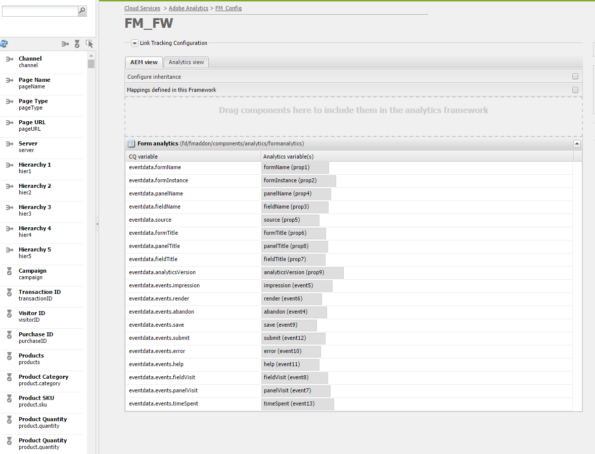

# Konfigurera analyser och rapporter{#configuring-analytics-and-reports}

AEM Forms kan integreras med Adobe Analytics så att ni kan hämta in och spåra prestandamått för era publicerade formulär och dokument. Syftet med att analysera dessa värden är att fatta välgrundade beslut baserat på uppgifter om de ändringar som krävs för att göra formulär eller dokument mer användbara.

>[!NOTE]
>
>Analysfunktionen i AEM Forms är tillgänglig som en del av AEM Forms-tilläggspaketet. Mer information om hur du installerar tilläggspaketet finns i [Installera och konfigurera AEM-formulär](../../forms/using/installing-configuring-aem-forms-osgi.md).
>
>Förutom tilläggspaketet behöver du ett Adobe Analytics-konto och administratörsbehörighet för AEM-instansen. Information om lösningen finns i [Adobe Analytics](https://www.adobe.com/solutions/digital-analytics.html).

## Översikt {#overview}

Du kan använda Adobe Analytics för att identifiera interaktionsmönster och problem som användare ställs inför när de använder adaptiva formulär, HTML5-formulär och interaktiv kommunikation. Adobe analytics håller reda på och lagrar information om följande parametrar:

* **Genomsnittlig fyllningstid**: Genomsnittlig tid för att fylla i formuläret.
* **Återgivningar**: Antal gånger ett formulär öppnas.
* **Utkast**: Antal gånger ett formulär sparas i utkastläget.
* **Sändningar**: Antal gånger ett formulär skickas.
* **Avbryt**: Antal gånger som användarna lämnar utan att fylla i formuläret.

Du kan anpassa Adobe Analytics för att lägga till/ta bort fler parametrar. Tillsammans med ovanstående information innehåller rapporten följande information om alla paneler i HTML5 och adaptiv form:

* **Tid**: Tid som har ägnats åt panelen och panelens fält.
* **Fel**: Antal fel som påträffats på panelen och i panelens fält.
* **Hjälp**: Antal gånger en användare öppnar hjälpen för en panel och fälten på panelen.

## Skapar rapportsvit {#creating-report-suite}

Analysdata lagras i kundspecifika databaser som kallas rapportsviter. Om du vill skapa en rapportserie och använda Adobe Analytics måste du ha ett giltigt Adobe Marketing Cloud-konto. Kontrollera att du har ett giltigt Adobe Marketing Cloud-konto innan du utför följande steg.

Utför följande steg för att skapa en rapportserie.

1. Logga in på [https://sc.omniture.com/login/](https://sc.omniture.com/login/)
1. I Marketing Cloud väljer du **Admin** > **Admin Console** > **Rapportsviter**.
1. Välj **Skapa nytt** > **Rapportsvit** i Report Suite Manager.

   

   Skapa ny rapportsvit

1. Kontrollera att den första listrutan är inställd på **Skapa från en mall** och välj sedan **Handel**.
1. Leta reda på fältet **Report Suite ID** och lägg till ett nytt Report Suite ID. Till exempel JEsquire. Ett rapportsvit-ID visas under fältet för rapportsvitens-ID. Det innehåller ett automatiskt prefix, som ofta är företagsnamnet.
1. Lägg till ny **webbplatstitel**. JJEsquire Getting Started Suite. Den här titeln används i analysgränssnittet. Använd rapportsvitens ID i koden.
1. Välj en **tidszon** i listrutan. Alla data som ingår i den här rapportsviten registreras baserat på den definierade tidszonen.
1. Lämna fälten **Bas-URL** och **Standardsida** tomma. Dessa två värden används bara från Adobe Marketing Cloud-gränssnittet för att länka till din webbplats.
1. Låt **Go Live Date** vara inställt på idag. Startdatumet avgör vilken dag rapportsviten aktiveras.
1. I fältet **Uppskattad sidvisning per dag** skriver du 100. Använd det här fältet för att uppskatta antalet sidvisningar som du förväntar dig för din webbplats per dag. Tack vare denna uppskattning kan Adobe installera lämplig mängd maskinvara för att bearbeta de data som ska samlas in.
1. Välj en **basvaluta** i listrutan. Alla valutadata som ingår i den här rapportsviten konverteras och lagras i det här valutaformatet.
1. Klicka på **Skapa** rapportserie. Du bör se uppdateringen av sidan med ett meddelande om att rapportsviten har skapats.
1. Välj den nya rapportsviten. Navigera till **Redigera inställningar** > **Allmänt** > **Allmänna kontoinställningar**.

   

   Allmänna kontoinställningar

1. Aktivera **Geografisk rapportering** på skärmen för allmänna kontoinställningar och klicka på **Spara.**
1. Navigera till **Redigera inställningar** > **Trafik** > **Trafikvariabler**.
1. Konfigurera och aktivera följande trafikvariabler i rapportsviten.

   * **formName**: Identifierare för ett adaptivt formulär.
   * **formInstance**: Identifierare för en instans av ett adaptivt formulär. Aktivera sökvägsrapporter för den här variabeln.
   * **fieldName**: Identifierare för ett adaptivt formulärfält. Aktivera sökvägsrapporter för den här variabeln.
   * **panelName**: Identifierare för en adaptiv formulärpanel. Aktivera sökvägsrapporter för den här variabeln.
   * **formTitle**: Formulärets namn.
   * **fieldTitle**: Formulärfältets titel.
   * **panelTitle**: Formulärpanelens namn.
   * **analyticsVersion**: Version av formuläranalys.

1. Navigera till **Redigera inställningar** > **Konvertering** > **Slutförda händelser**. Definiera och aktivera följande lyckade händelser:

   | Händelsen Slutfört | Typ |
   |---|---|
   | överge | Räknare |
   | återge | Räknare |
   | panelBesök | Räknare |
   | fieldVisit | Räknare |
   | save | Räknare |
   | fel | Räknare |
   | help | Räknare |
   | submit | Räknare |
   | timeSpent | Numeriskt |

   >[!NOTE]
   >
   >Ett händelsenummer och ett prop-nummer som används för att konfigurera AEM Forms-analys måste skilja sig från det händelsenummer och det prop-nummer som används i konfigurationen för [AEM-analys](/help/sites-administering/adobeanalytics.md) .

1. Logga ut från Adobe Marketing Cloud-kontot.

## Skapar molntjänstkonfiguration {#creating-cloud-service-configuration}

Konfigurationen av molntjänsten är information om ditt Adobe Analytics-konto. Tack vare konfigurationen kan Adobe Experience Manager (AEM) ansluta till Adobe Analytics. Skapa en separat konfiguration för varje Analytics-konto som du använder.

1. Logga in på din AEM-författarinstans som administratör.
1. Klicka på **Adobe Experience Manager** > **Verktyg**  > **Distribution** > **Cloud-tjänster** i det övre vänstra hörnet.
1. Hitta **Adobe Analytics** -ikonen. Klicka på **Visa konfigurationer** och fortsätt sedan att klicka **[+]** för att lägga till en ny konfiguration.

   Om du är förstagångsanvändare klickar du på **Konfigurera nu**.

1. Lägg till en titel i den nya konfigurationen (det är valfritt att fylla i fältet Namn). Till exempel Min analyskonfiguration. Klicka på **Skapa**.

1. När panelen Redigera öppnas på konfigurationssidan fyller du i fälten:

   * **Företag**: Ditt företags namn visas i Adobe Analytics.
   * **Användarnamn**: Namnet som används för att logga in på Adobe Analytics.
   * **Lösenord**: Adobe Analytics-lösenordet för ovanstående konto.
   * **Datacenter**: Datacentret för ditt Adobe Analytics-konto.

1. Klicka på **Anslut till analys**. En dialogruta visas med ett meddelande om att anslutningen lyckades. Click **OK**.

## Skapar ramverk för molntjänster {#creating-cloud-service-framework}

Ett Adobe Analytics-ramverk är en uppsättning mappningar mellan Adobe Analytics-variabler och AEM-variabler. Använd ett ramverk för att konfigurera hur formulären fyller i data till Adobe Analytics-rapporter. Ramverk är kopplade till en Adobe Analytics-konfiguration. Du kan skapa flera ramverk för varje konfiguration.

1. På AEM Cloud Services-konsolen klickar du på **Visa konfigurationer** under Adobe Analytics.
1. Klicka på **[+]** -länken bredvid Analytics-konfigurationen.

   

   Adobe Analytics-konfiguration

1. Ange en **titel** och ett **namn** för ramverket, välj **Adobe Analytics** Framework och klicka på **Skapa**. Ramverket öppnas för redigering.
1. Klicka på **Lägg till objekt** i delen Rapportsviter och använd listrutan för att välja det Report Suite-ID (till exempel JEsquire) som ramverket ska interagera med.
1. Bredvid Report Suite-ID markerar du de serverinstanser som du vill skicka information till Report Suite.

   

1. Dra en **Form Analytics-komponent** från den **andra** kategorin från SideSpark till ramverket.
1. Om du vill mappa Analytics-variabler med variabler som är definierade i komponenten drar du en variabel från AEM Content Finder till ett fält i spårningskomponenten.

   

1. Aktivera ramverket med hjälp av **sidfliken** i sidosparken och klicka på **Aktivera ramverk**.

## Konfigurationstjänsten för AEM Forms Analytics {#configuring-aem-forms-analytics-configuration-service}

1. Öppna konfigurationshanteraren för AEM Web Console på författarinstansen `https://<server>:<port>;/system/console/configMgr`.
1. Hitta och öppna konfigurationen för AEM Forms Analytics

   

   Konfigurationstjänst för AEM Forms Analytics

1. Ange lämpliga värden för följande fält och klicka på **Spara**.

   * **SiteCatalyst Framework**: Välj ramverket/konfigurationen som du definierade i avsnittet Konfigurera ett ramverk för spårning.
   * **Baslinje** för spårning av fälttid: Ange efter hur lång tid (i sekunder) som fältbesöket ska spåras. Standardvärdet är 0. När värdet är större än 0 (noll) skickas två separata spårningshändelser till Adobe Analytics-servern. Den första händelsen instruerar analysservern att sluta spåra det avslutade fältet. Den andra händelsen skickas efter att den angivna längden har gått. Den andra händelsen instruerar analysservern att börja spåra det besökta fältet. Genom att använda två olika händelser kan du mäta tiden som läggs på ett fält på ett korrekt sätt. När värdet är 0 (noll) skickas en enda spårningshändelse till Adobe Analytics-servern.

   * **Synkkron** för analysrapport: Ange cron-uttryck för att hämta rapporter från Adobe Analytics. Standardvärdet är 0 0 2 ? * *.

   * **Tidsgräns för hämtning av rapport:** Ange hur länge (i sekunder) som servern ska svara på analysrapporten. Standardtiden är 120 sekunder.
   >[!NOTE]
   >
   >Det kan ta upp till 10 sekunder till att tidsgränsen för hämtning av rapporter överskrids och det angivna antalet sekunder.

1. Upprepa steg 1-3 på publiceringsinstansen för att konfigurera analyser.

Nu kan ni aktivera analyser för formulär och generera en analysrapport.

## Aktivera analys för ett formulär eller dokument {#enabling-analytics-for-a-form-or-document}

1. Logga in på AEM-portalen på `https://[hostname]:'port'`.
1. Klicka på **Formulär > Formulär och dokument**, markera ett formulär eller dokument och klicka på **Aktivera analys**. Analysen är aktiverad.

   

   Aktivera analys för ett formulär

   **S.** Aktivera knappen Analytics (Analyser) **B.** Markerat formulär

   Mer information om hur du visar analysrapporter för formulär finns i [Visa och förstå analysrapporter för AEM Forms](../../forms/using/view-understand-aem-forms-analytics-reports.md)

