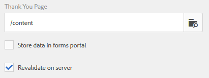

# Konfigurera åtgärden Skicka{#configuring-the-submit-action}

## Introduktion till att skicka åtgärder {#introduction-to-submit-actions}

En sändningsåtgärd utlöses när en användare klickar på knappen Skicka i ett anpassat formulär. Du kan konfigurera åtgärden skicka i anpassningsbara formulär. Med adaptiva formulär kan du skicka in ett antal åtgärder direkt. Du kan kopiera och utöka standardåtgärderna för att skicka och skapa en egen sändningsåtgärd. Baserat på dina krav kan du dock skriva och registrera din egen skicka-åtgärd för att bearbeta data i det skickade formuläret. Överföringsåtgärden kan använda [synkron eller asynkron sändning](../../forms/using/asynchronous-submissions-adaptive-forms.md).

Du kan konfigurera en skicka-åtgärd i delen **Skicka** i egenskaperna för den adaptiva formulärbehållaren i sidlisten.

Konfigurera Skicka-åtgärd

Standardåtgärderna för att skicka in anpassningsbara formulär är:

* Skicka till REST-slutpunkt
* Skicka e-post
* Skicka PDF via e-post
* Anropa ett formulärarbetsflöde
* Skicka med formulärdatamodell
* Skicka-åtgärd för formulärportal
* Anropa ett AEM-arbetsflöde

>[!NOTE]
>
>Åtgärden Skicka PDF via e-post gäller endast för adaptiva formulär som använder XFA-mall som formulärmodell.

>[!NOTE]
>
>Kontrollera att [AEM_Installation_Directory]\crx-quickstart\temp\datamanager\ASM folder
>finns. Katalogen krävs för att temporärt lagra bilagor. Om katalogen inte finns skapar du den.

>[!CAUTION]
>
>Om du [förifyller](../../forms/using/prepopulate-adaptive-form-fields.md) en formulärmall, formulärdatamodell eller schemabaserad adaptiv blankett med XML- eller JSON-data i ett schema (XML-schema, JSON-schema, formulärmall eller formulärdatamodell) som är data innehåller inte &lt;afData>-, &lt;afBoundData>- och &lt;/afUnboundData>-taggar, är data för obegränsade fält (obegränsade fält) formulärfält utan [bindref](../../forms/using/prepopulate-adaptive-form-fields.md) -egenskap) för det adaptiva formuläret förloras.

Du kan skriva en anpassad skicka-åtgärd för anpassade formulär för att uppfylla ditt användningssätt. Mer information finns i [Skriva anpassad skickaåtgärd för anpassningsbara formulär](../../forms/using/custom-submit-action-form.md).

## Skicka till REST-slutpunkt {#submit-to-rest-endpoint}

Alternativet **Skicka till REST-slutpunkt** skickar data som är ifyllda i formuläret till en konfigurerad bekräftelsesida som en del av HTTP GET-begäran. Du kan lägga till namnet på fälten som ska begäras. Begäran har följande format:

`{fieldName}={request parameter name}`

Som visas i bilden nedan `param1` och `param2` skickas som parametrar med värden som kopieras från fälten för **textruta** och **sifferruta** för nästa åtgärd.

Du kan också **aktivera POST-begäran** och ange en URL för att skicka begäran. Om du vill skicka data till AEM-servern som är värd för formuläret använder du en relativ sökväg som motsvarar rotsökvägen för AEM-servern. Exempel: /content/forms/af/SampleForm.html. Om du vill skicka data till en annan server använder du den absoluta sökvägen.

Konfigurerar åtgärden Skicka för resterande slutpunkt

>[!NOTE]
Om du vill skicka fälten som parametrar i en REST-URL måste alla fält ha olika elementnamn, även om fälten placeras på olika paneler.

### Bokför skickade data till en resurs eller extern slutpunkt för vila {#post-submitted-data-to-a-resource-or-external-rest-end-point-nbsp}

Använd åtgärden **Skicka till REST-slutpunkt** för att skicka skickade data till en rest-URL. URL:en kan vara en intern (servern som formuläret återges på) eller en extern server.

Om du vill skicka data till en intern server anger du sökvägen till resursen. Data bokförs som resurssökväg. Till exempel /content/restEndPoint. För sådana efterfrågningar används autentiseringsinformationen i förfrågan.

Ange en URL om du vill skicka data till en extern server. URL-adressen har formatet https://host:port/path_to_rest_end_point. Se till att du konfigurerar sökvägen så att den hanterar POST-begäran anonymt.

I exemplet ovan `textbox` hämtas användarinformationen i med parametern `param1`. Syntaxen för att bokföra data som samlats in med `param1` är:

`String data=request.getParameter("param1");`

På samma sätt används parametrar som du använder för att skicka XML-data och bifogade filer `dataXml` och `attachments`.

Du kan till exempel använda de här två parametrarna i skriptet för att tolka data till en slutpunkt. Du använder följande syntax för att lagra och analysera data:

`String data=request.getParameter("dataXml");`
`String att=request.getParameter("attachments");`

I det här exemplet `data` lagrar XML-data och `att` lagrar data för bilagor.

## Skicka e-post {#send-email}

När formuläret har skickats skickar åtgärden **Skicka e-post** ett e-postmeddelande till en eller flera mottagare. E-postmeddelandet som genereras kan innehålla formulärdata i ett fördefinierat format.

>[!NOTE]
Alla formulärfält måste ha olika elementnamn, även om de finns på olika paneler), för att kunna inkludera formulärdata i ett e-postmeddelande.

## Skicka PDF via e-post {#send-pdf-via-email}

När du skickar ett e-postmeddelande med en PDF-fil som innehåller formulärdata skickas ett e-postmeddelande med åtgärden **Skicka PDF via e-post** till en eller flera mottagare när formuläret har skickats.

**** Obs! Den här överföringsåtgärden är tillgänglig för XFA-baserade adaptiva formulär och XSD-baserade adaptionsformulär som har dokumentmallen.

## Anropa ett formulärarbetsflöde {#invoke-a-forms-workflow}

Alternativet Skicka **till formulär-arbetsflödet** skickar en XML-datafil och eventuella bifogade filer till en befintlig Adobe LiveCycle- eller AEM Forms on JEE-process.

Mer information om hur du konfigurerar Skicka till formulär-arbetsflödet finns i [Skicka och bearbeta formulärdata med hjälp av formulärarbetsflöden](../../forms/using/submit-form-data-livecycle-process.md).

## Skicka med formulärdatamodell {#submit-using-form-data-model}

Åtgärden **Skicka med formulärdatamodell** skriver skickade adaptiva formulärdata för det angivna datamodellobjektet i en formulärdatamodell till datakällan. När du konfigurerar skicka-åtgärden kan du välja ett datamodellsobjekt vars skickade data du vill skriva tillbaka till dess datakälla.

Dessutom kan du skicka en bifogad fil med hjälp av en formulärdatamodell och en DoR-fil (Document of Record) till datakällan.

Mer information om formulärdatamodell finns i [AEM Forms-dataintegrering](../../forms/using/data-integration.md).

## Skicka-åtgärd för formulärportal {#forms-portal-submit-action}

Alternativet **Skicka åtgärd** för formulärportalen gör att formulärdata blir tillgängliga via en AEM Forms-portal.

Mer information om Forms Portal och skicka-åtgärden finns i Komponenten Utkast och inskickning.

## Anropa ett AEM-arbetsflöde {#invoke-an-aem-workflow}

Åtgärden **Anropa ett AEM-arbetsflöde** kopplar ett anpassat formulär till ett AEM-arbetsflöde. När ett formulär skickas startar det associerade arbetsflödet automatiskt på bearbetningsnoden. Dessutom placeras datafilen, bilagorna och, om tillämpligt, arkivdokumentet vid arbetsflödets nyttolastplats.

Innan du använder åtgärden **Anropa ett AEM-arbetsflöde** ska du [konfigurera AEM DS-inställningarna](../../forms/using/configuring-the-processing-server-url-.md). Mer information om hur du skapar ett AEM-arbetsflöde finns i [Formulärbaserade arbetsflöden i OSGi](../../forms/using/aem-forms-workflow.md).

## Förtroende på serversidan i adaptiv form {#server-side-revalidation-in-adaptive-form}

I alla onlinesystem för datainhämtning lägger utvecklare vanligtvis in javascript-valideringar på klientsidan för att tillämpa några få affärsregler. Men i moderna webbläsare kan slutanvändarna kringgå valideringarna och skicka in dokument manuellt med hjälp av olika tekniker, till exempel DevTools Console för webbläsare. Sådana tekniker kan också användas för anpassningsbara formulär. En formulärutvecklare kan skapa olika valideringslogik, men tekniskt sett kan slutanvändarna kringgå dessa valideringslogik och skicka ogiltiga data till servern. Ogiltiga data skulle bryta mot de affärsregler som en formulärförfattare har infört.

Med funktionen för omvalidering på serversidan kan du även köra de valideringar som en författare av adaptiva formulär har tillhandahållit när de utformar ett adaptivt formulär på servern. Det förhindrar att inskickade data äventyras och affärsregelöverträdelser som representeras i form av formulärvalidering.

### Vad ska valideras på servern? {#what-to-validate-on-server-br}

Alla valideringar av ett anpassningsbart formulär som körs på servern är:

* Krävs
* Valideringsbildsats
* Valideringsuttryck

### Aktivera validering på serversidan {#enabling-server-side-validation-br}

Använd alternativet **Verifiera på servern** under Adaptiv formulärbehållare i sidlisten för att aktivera eller inaktivera validering på serversidan för det aktuella formuläret.

Aktivera validering på serversidan

Om slutanvändaren åsidosätter dessa valideringar och skickar formulären utför servern valideringen igen. Om valideringen misslyckas vid serverslutet stoppas skicka-transaktionen. Slutanvändaren får det ursprungliga formuläret igen. Insamlade data och skickade data visas för användaren som ett fel.

### Stöd för anpassade funktioner i valideringsuttryck {#supporting-custom-functions-in-validation-expressions-br}

När det gäller **komplexa valideringsregler** finns ibland det exakta valideringsskriptet i anpassade funktioner och författaren anropar dessa anpassade funktioner från fältvalideringsuttryck. För att göra det här anpassade funktionsbiblioteket tillgängligt när du utför validering på serversidan kan formulärförfattaren konfigurera namnet på AEM-klientbiblioteket på fliken **Grundläggande** i egenskaper för adaptiv formulärbehållare enligt nedan.

Stöd för anpassade funktioner i valideringsuttryck

Författaren kan konfigurera ett anpassat javascript-bibliotek per anpassat formulär. I biblioteket behåller du bara återanvändbara funktioner som är beroende av jQuery och underscore.js från tredje part.

## Felhantering vid sändning {#error-handling-on-submit-action}

Konfigurera anpassade felsidor som 404.jsp och 500.jsp som en del av riktlinjerna för AEM-säkerhet och härdning. Dessa hanterare anropas när ett formulär 404- eller 500-fel skickas. Hanterarna anropas också när dessa felkoder aktiveras på noden Publicera.

Mer information finns i [Anpassa sidor som visas av felhanteraren](/help/sites-developing/customizing-errorhandler-pages.md).
