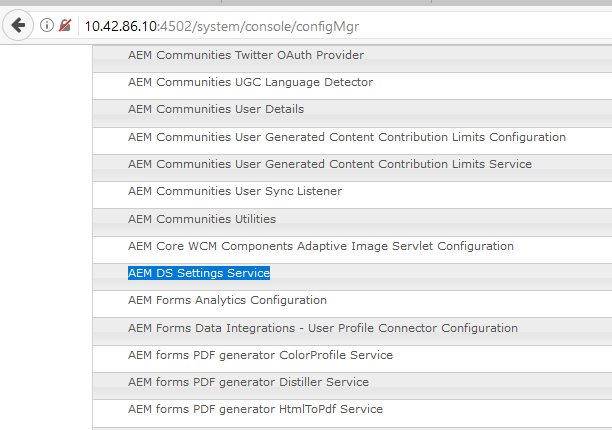
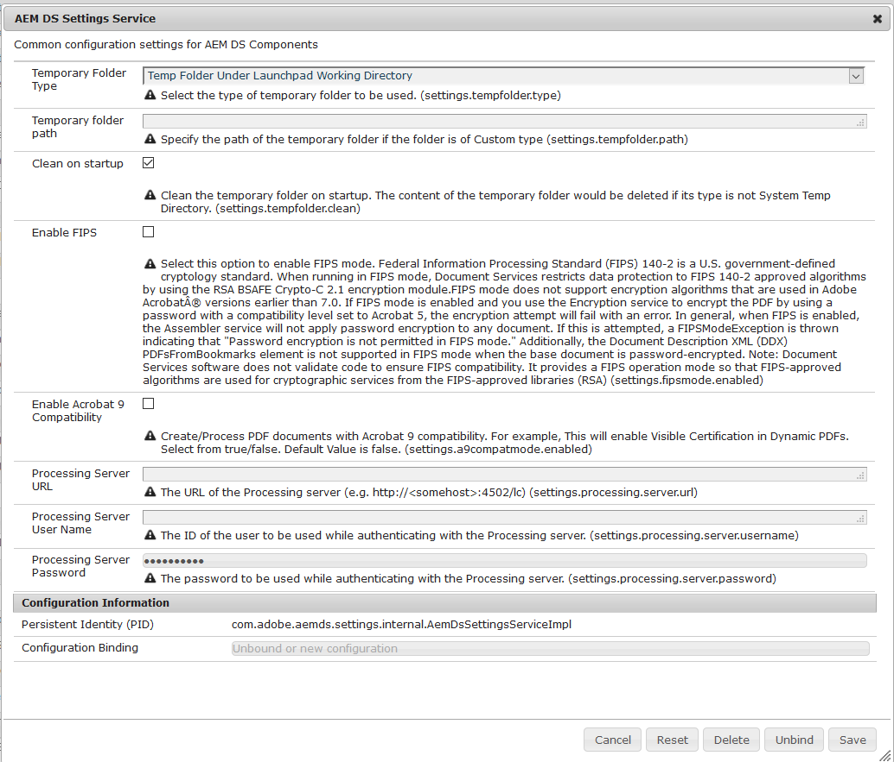

# Konfigurera AEM DS-inställningar{#configuring-aem-ds-settings}

I den här artikeln beskrivs hur du konfigurerar **AEM DS Settings Service**. Den här inställningen kan användas i flera scenarier, till exempel:

* I korrespondenshantering

   * För konfigurering av AEM Forms Workflow
   * När du använder formulärportalen för att spara utkast/inskickning på fjärrbasis

* I adaptiva formulär för fall när adaptiv form skickas från publiceringsinstansen

Så här konfigurerar du **[!UICONTROL AEM DS Settings]**:

1. Öppna Configuration Manager på publiceringsinstansen med URL:en:\
   *https://localhost:port/system/console/configMgr*.

   

1. I fönstret **[!UICONTROL Adobe Experience Manager Web Console Configuration]** letar du reda på och klickar på alternativet **[!UICONTROL AEM DS Settings]**.

   

1. Fönstret **[!UICONTROL AEM DS Settings Service]** visar de vanliga konfigurationsinställningarna för AEM DS-komponenter.

   

1. Lägg till följande information i respektive fält:

   **[!UICONTROL Processing Server URL]**: Bearbetningsservern är den server där Forms- eller AEM-arbetsflödet måste aktiveras. Detta kan vara samma som URL:en för den AEM författarinstansen eller den andra server-URL:en (d.v.s. https://localhost:port/).

   **[!UICONTROL Processing Server User Name]**: Användarnamn för arbetsflöde  [baserat på den server-URL som används]

   **[!UICONTROL Processing Server Password]**: Lösenord för arbetsflödesanvändare

   >[!NOTE]
   >
   >
   >    
   >    
   >    * När du använder arbetsflödena Forms eller AEM måste du konfigurera tjänsten DS-inställningar innan du skickar något från publiceringsservern. I annat fall ska inlämningen av formuläret misslyckas.

