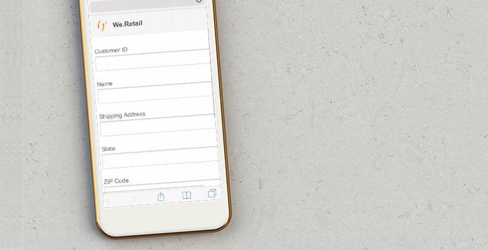

# Självstudiekurs: Skapa ett anpassat formulär {#do-not-publish-tutorial-create-an-adaptive-form}

Den här självstudiekursen är ett steg i serien [Create Your First Adaptive Form](/help/forms/using/create-your-first-adaptive-form.md) . Vi rekommenderar att du följer serien i kronologisk ordning för att förstå, utföra och demonstrera det fullständiga exemplet på självstudiekurser.

## Om självstudiekursen {#about-the-tutorial}

Adaptiva formulär är nya generationer som är dynamiska och responsiva. Ni kan använda adaptiva formulär för att leverera personaliserade upplevelser. Ni kan också integrera adaptiva formulär med Adobe Analytics för användningsstatistik och Adobe Campaign för kampanjhantering. Mer information om funktioner för adaptiva formulär finns i [Introduktion till utveckling av adaptiva formulär](/help/forms/using/introduction-forms-authoring.md).

Det är enklare att skapa och hantera formulär när man följer en lämplig process. I den här artikeln får du lära dig att:

* [Skapa ett anpassningsbart formulär där kunden kan lägga till en leveransadress](/help/forms/using/create-adaptive-form.md#step-create-the-adaptive-form)

* [Layoutfält i ett anpassat formulär som visar och accepterar information från en kund](/help/forms/using/create-adaptive-form.md#step-add-header-and-footer)

* [Skapa en Skicka-åtgärd för att skicka ett e-postmeddelande med formulärinnehåll](/help/forms/using/create-adaptive-form.md#step-add-components-to-capture-and-display-information)
* [Förhandsgranska och skicka ett anpassat formulär](/help/forms/using/create-adaptive-form.md)

Du kommer att ha ett formulär som liknar följande i slutet av artikeln:\

## Steg 1: Skapa det anpassade formuläret {#step-create-the-adaptive-form}

1. Logga in på AEM-författarinstansen och gå till **Adobe Experience Manager** > **Formulär** > **Formulär och dokument**. Standardwebbadressen är [http://localhost:4502/aem/forms.html/content/dam/formsanddocuments](http://localhost:4502/aem/forms.html/content/dam/formsanddocuments).
1. Tryck på **Skapa** och välj **Adaptivt formulär**. Ett alternativ för att välja en mall visas. Tryck på mallen **Tom** för att markera den och tryck sedan på **Nästa**.

1. Ett alternativ för att **lägga till egenskaper** visas. Fälten **Titel** och **Namn** är obligatoriska:

   * **** Titel: Ange `Add new or update shipping address` i fältet Titel. Titelfältet anger formulärets visningsnamn. Titeln hjälper dig att identifiera formuläret i användargränssnittet för AEM Forms.
   * **** Namn: Ange `shipping-address-add-update-form` i fältet Namn. Fältet Namn anger formulärets namn.  En nod med det angivna namnet skapas i databasen. När du börjar skriva en titel genereras värdet för namnfältet automatiskt. Du kan ändra det föreslagna värdet. Namnfältet får endast innehålla alfanumeriska tecken, bindestreck och understreck. Alla ogiltiga indata ersätts med ett bindestreck.

1. Tryck på **Skapa**. Ett anpassat formulär skapas och en dialogruta öppnas där du kan öppna formuläret för redigering. Tryck på **Öppna** för att öppna det nya formuläret på en ny flik. Formuläret öppnas för redigering. Här visas också sidlisten där du kan anpassa det nya formuläret efter behov.

   Information om gränssnittet för att skapa adaptiva formulär och tillgängliga komponenter finns i Introduktion [till att skapa adaptiva formulär](/help/forms/using/creating-adaptive-form.md).

   

## Steg 2: Lägg till sidhuvud och sidfot {#step-add-header-and-footer}

AEM Forms innehåller många komponenter som används för att visa information i ett adaptivt formulär. Komponenterna för sidhuvud och sidfot ger formuläret ett enhetligt utseende och en enhetlig känsla. En rubrik innehåller vanligtvis ett företags logotyp, formulärets rubrik och sammanfattning. En sidfot innehåller vanligtvis copyrightinformation och länkar till andra sidor.

1. Tryck på  > . Komponentwebbläsaren öppnas. Dra **huvudkomponenten** från komponentwebbläsaren till det adaptiva formuläret.
1. Tryck på **Logo**. Verktygsfältet visas. Tryck på  i verktygsfältet, skriv **We.Retail** och tryck på .

1. Tryck på Bild. Verktygsfältet visas. Tryck på . Egenskapsläsaren öppnas till vänster på skärmen. **Bläddra** och ladda upp logotypbilden. Tryck på . Bilden visas i sidhuvudet.

   Du kan trycka på Hämta fil för att hämta logotypen som används i den här artikeln om du inte har någon.

   [Hämta fil](assets/logo.png)

1. Dra **sidfotskomponenten** från  till det adaptiva formuläret. I det här skedet ser formuläret ut så här:

   

## Steg 3: Lägga till komponenter för att hämta och visa information {#step-add-components-to-capture-and-display-information}

Komponenter är byggstenar i en adaptiv form. AEM Forms innehåller många komponenter för att hämta in och visa information i en adaptiv form. Du kan dra komponenterna från  till ett formulär. Mer information om tillgängliga komponenter och motsvarande funktioner finns i Introduktion [till utveckling av adaptiva formulär](/help/forms/using/introduction-forms-authoring.md).

1. Dra Numeric Box-komponenten till det adaptiva formuläret. Placera den före sidfotskomponenten. Öppna komponentens egenskaper, ändra komponentens **titel** till **`Customer ID`**, ändra **elementnamnet** till **`customer_ID`**, aktivera alternativet **Obligatoriskt fält** , aktivera alternativet **Använd HTML5-nummerindatatyp** och tryck på¥aem_6_3_forms_save¥.
1. Dra tre textrutekomponenter till det adaptiva formuläret. Placera dessa före sidfotskomponenten. Ange följande egenskaper för dessa textrutor.:

<table> 
 <tbody> 
  <tr> 
   <td>Egenskap</td> 
   <td>Textruta 1  </td> 
   <td>Textruta 2  </td> 
   <td>Textruta 3</td> 
  </tr> 
  <tr> 
   <td>Titel</td> 
   <td>Namn  </td> 
   <td>Leveransadress</td> 
   <td>Läge</td> 
  </tr> 
  <tr> 
   <td>Elementnamn</td> 
   <td>customer_Name  </td> 
   <td>customer_Shipping_Address</td> 
   <td>customer_State</td> 
  </tr> 
  <tr> 
   <td>Obligatoriskt fält</td> 
   <td>Aktiverad</td> 
   <td>Aktiverad</td> 
   <td>Aktiverad</td> 
  </tr> 
  <tr> 
   <td>Allow multiple lines  </td> 
   <td>Handikappade</td> 
   <td>Aktiverad</td> 
   <td>Handikappade</td> 
  </tr> 
 </tbody> 
</table>

1. Dra en **Numeric Box** -komponent före sidfotskomponenten. Öppna komponentens egenskaper, ange värden i tabellen nedan, tryck på .

   | Egenskap | Värde |
   |---|---|
   | Titel | Postnummer |
   | Elementnamn | customer_ZIPCode |
   | Maximalt antal siffror | 6 |
   | Obligatoriskt fält | Aktiverad |
   | Visa mönstertyp | Inget mönster |

1. Dra en **e-postkomponent** före sidfotskomponenten. Öppna komponentens egenskaper, ange värden i tabellen nedan och tryck på .

   | Egenskap | Värde |
   |---|---|
   | Titel | E-post |
   | Elementnamn | customer_Email |
   | Obligatoriskt fält | Aktiverad |

1. Dra en **bifogad** fil före sidfotskomponenten. Öppna komponentens egenskaper, ange värden i tabellen nedan och tryck på .

<table> 
 <tbody> 
  <tr> 
   <td>Egenskap</td> 
   <td>Värde</td> 
  </tr> 
  <tr> 
   <td>Titel</td> 
   <td>Myndighetens adressbevis har godkänts  </td> 
  </tr> 
  <tr> 
   <td>Elementnamn</td> 
   <td>customer_Address_Proof</td> 
  </tr> 
  <tr> 
   <td>Obligatoriskt fält</td> 
   <td>Aktiverad</td> 
  </tr> 
 </tbody> 
</table>

1. Dra en **Skicka-knapp** -komponent till det anpassade formuläret. Placera den före sidfotskomponenten. Öppna komponentens egenskaper, ändra elementnamn till **address_addition_update_submit**, tryck på . Formulärets layout är fullständig och formuläret ser ut så här:

   

## Steg 4: Konfigurera skicka-åtgärd för anpassat formulär {#step-configure-submit-action-for-the-adaptive-form}

En skicka-åtgärd aktiveras när en användare trycker på Skicka-knappen på ett anpassat formulär. Du kan använda en skicka-åtgärd för att spara formulärdata i den lokala databasen, skicka formulärdata till en REST-slutpunkt, skicka formulärdata som e-post med mera. Adaptiva formulär innehåller några fler färdiga åtgärder för att skicka. Mer information finns i [Konfigurera åtgärden](/help/forms/using/configuring-submit-actions.md)Skicka.

Med hjälp av följande steg kan du konfigurera e-poståtgärd för att skicka och demo för formuläret:

1. Konfigurera e-postservern. Mer information finns i [Konfigurera e-postmeddelande](/help/sites-administering/notification.md).

1. Tryck på **Formulärbehållare** i innehållsläsaren och tryck på . Egenskapsläsaren öppnas till vänster.
1. Gå till **Skicka** > **Skicka åtgärd**. Välj **Skicka e-post**. Ange följande värden och tryck på .

   | Egenskap | Värde |
   |--- |--- |
   | Från | `donotreply@weretail.com` |
   | Till | `${customer_Email}` |
   | Ämne | Bekräftelse: Du har lagt till leveransadress på webbplatsen We.Retail. |
   | E-postmall | Hej `${customer_Name}`! Följande adress läggs till som leveransadress för ditt konto:  `${customer_Name}`, `${customer_Shipping_Address}`, `${customer_State}`, `${customer_ZIPCode}`  Med vänlig hälsning |
   | Inkludera bilagor | Aktiverad |

   Formuläret är klart. Nu kan du förhandsgranska formuläret och testa funktionen. Om du har använt namnet som nämns i självstudiekursen och har åtkomst till formuläret på datorn som kör AEM Forms-servern, finns formuläret på [http://localhost:4502/editor.html/content/forms/af/shipping-address-add-update-form.html](http://localhost:4502/editor.html/content/forms/af/shipping-address-add-update-form.html).

## Steg 5: Förhandsgranska och skicka det anpassade formuläret {#step-preview-and-submit-the-adaptive-form}

Du kan använda alternativet **** Förhandsgranska för att utvärdera ett formulärs utseende och beteende. Du kan skicka ett formulär i förhandsgranskningsläge och även kontrollera valideringar som används i ett formulär. Om till exempel ett fel visas när ett obligatoriskt fält lämnas tomt.

Med adaptiva formulär kan du också emulera upplevelsen av ett formulär för olika enheter. Exempel: iPhone, iPad och Desktop. Du kan använda alternativen **Förhandsgranska** och **Emulator** -  tillsammans för att förhandsgranska ett formulär för enheter med olika skärmstorlekar.

1. Tryck på alternativet **Förhandsgranska** till höger i formulärredigeraren. Formuläret öppnas i förhandsgranskningsläget. Om du har använt namnet som anges i självstudiekursen är URL:en för förhandsgranskning av formuläret [http://localhost:4502/content/dam/formsanddocuments/shipping-address-add-update-form/jcr:content?wcmmode=disabled](http://localhost:4502/content/dam/formsanddocuments/shipping-address-addition-updation-form/jcr:content?wcmmode=disabled)
1. Använd  för att visa hur formuläret ser ut på olika enheter.
1. Fyll i formulärfälten och tryck på **Skicka**. Formuläret skickas och du omdirigeras till standardsidan **Tack** . Du kan också ange en anpassad tacksida. Mer information finns i [Konfigurera omdirigeringssidan](/help/forms/using/configuring-redirect-page.md).

Det adaptiva formuläret för att lägga till en adress är klart. Om du har använt namnet som nämns i självstudiekursen och har åtkomst till formuläret på datorn som kör AEM Forms-servern, finns formuläret på [http://localhost:4502/editor.html/content/forms/af/shipping-address-add-update-form.html](http://localhost:4502/editor.html/content/forms/af/shipping-address-add-update-form.html).
