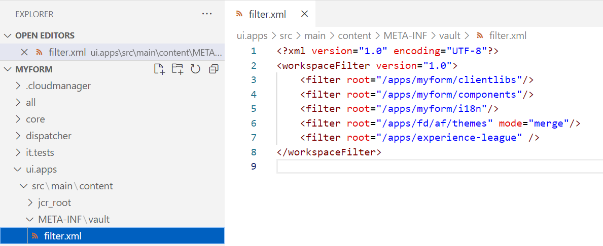

# Anpassade funktioner i adaptiva Forms Core-komponenter

I den här artikeln beskrivs hur du skapar anpassade funktioner med den senaste adaptiva Form Core-komponenten som har de senaste funktionerna, som:

* Cachelagringsfunktion för anpassade funktioner
* Globala omfångsobjekt och fältobjekt har stöd för anpassade funktioner
* Stöd för moderna JavaScript-funktioner som låt- och pilfunktioner (ES10-stöd)

Ange [senaste formulärversionen](https://github.com/adobe/aem-core-forms-components/tree/release/650) i AEM Forms Core Component-miljön så att du kan använda de senaste funktionerna i Anpassade funktioner. </span>


| Version | Artikellänk |
| -------- | ---------------------------- |
| AEM 6.5 | Denna artikel |
| AEM as a Cloud Service | [Klicka här](https://experienceleague.adobe.com/en/docs/experience-manager-cloud-service/content/forms/adaptive-forms-authoring/authoring-adaptive-forms-core-components/create-an-adaptive-form-on-forms-cs/create-and-use-custom-functions) |

## Introduktion

AEM Forms 6.5 innehåller JavaScript-funktioner som gör att du kan definiera komplexa affärsregler med regelredigeraren. AEM Forms har en mängd färdiga anpassade funktioner, men många användningsområden kräver att man definierar egna funktioner för flera formulär. Dessa anpassade funktioner förbättrar formulärens funktioner genom att möjliggöra hantering och bearbetning av inmatade data för att uppfylla specifika krav. Dessutom kan de dynamiskt ändra formulärbeteende baserat på de fördefinierade villkoren.

### Användning av anpassade funktioner {#uses-of-custom-function}

Fördelarna med att använda anpassade funktioner i adaptiva Forms Core-komponenter är:


* **Hantera data**: Anpassade funktioner hanterar och bearbetar data som anges i formulärfälten.
* **Databehandling**: Anpassade funktioner hjälper till att bearbeta data som anges i formulärfälten.
* **Validering av data**: Med anpassade funktioner kan du utföra anpassade kontroller av formulärindata och tillhandahålla angivna felmeddelanden.
* **Dynamiskt beteende**: Med anpassade funktioner kan du styra formulärens dynamiska beteende baserat på specifika villkor. Du kan till exempel visa/dölja fält, ändra fältvärden eller justera formulärlogiken dynamiskt.
* **Integrering**: Du kan använda anpassade funktioner för att integrera med externa API:er eller tjänster. Det hjälper till att hämta data från externa källor, skicka data till externa Rest-slutpunkter eller utföra anpassade åtgärder baserade på externa händelser.

Anpassade funktioner är i huvudsak klientbibliotek som läggs till i JavaScript-filen. När du har skapat en anpassad funktion blir den tillgänglig i regelredigeraren så att användaren kan välja den i ett anpassat formulär. De anpassade funktionerna identifieras av JavaScript-anteckningarna i regelredigeraren.

### JavaScript-anteckningar som stöds för anpassade funktioner {#js-annotations}

**JavaScript-anteckningar innehåller metadata för JavaScript-kod**. Den innehåller kommentarer som börjar med specifika symboler, till exempel `/**` och `@`. Anteckningarna innehåller viktig information om funktioner, variabler och andra element i koden. Adaptiv form stöder följande JavaScript-anteckningar för anpassade funktioner:

#### Namn

The **Namn** används för att identifiera den anpassade funktionen i regelredigeraren för ett adaptivt formulär. Följande syntaxer används för att namnge en anpassad funktion:

* `@name [functionName] <Function Name>`
* `@function [functionName] <Function Name>`
* `@func [functionName] <Function Name>`

>[!NOTE]
>`[functionName]` är funktionens namn. Blanksteg är inte tillåtna.
>`<Function Name>` är visningsnamnet för funktionen i regelredigeraren för Adaptiv Forms.
>Om funktionsnamnet är identiskt med namnet på själva funktionen kan du utelämna det `[functionName]` från syntaxen.

#### Parameter

The **Parameter** är en lista med argument som används av anpassade funktioner. En funktion kan ha stöd för flera parametrar. Följande syntaxer används för att definiera en parameter i en anpassad funktion:

* `@param {type} name <Parameter Description>`
* `@argument` `{type} name <Parameter Description>`
* `@arg` `{type}` `name <Parameter Description>`

  `{type}` representerar parametertypen. Tillåtna parametertyper är:

   * string: Representerar ett enda strängvärde.
   * number: Representerar ett numeriskt värde.
   * booleskt: Representerar ett enskilt booleskt värde (true eller false).
   * string[]: Representerar en array med strängvärden.
   * tal[]: Representerar en array med numeriska värden.
   * boolesk[]: Representerar en array med booleska värden.
   * date: Representerar ett enda datumvärde.
   * datum[]: Representerar en array med datumvärden.
   * array: Representerar en generisk array som innehåller värden av olika typer.
   * object: Representerar formulärobjektet som skickas till en anpassad funktion i stället för att skicka dess värde direkt.
   * omfång: Representerar det globala objektet, som innehåller skrivskyddade variabler som formulärinstanser, målfältsinstanser och metoder för att utföra formulärändringar i de anpassade funktionerna. Den deklareras som den sista parametern i JavaScript-anteckningarna och är inte synlig för regelredigeraren i ett adaptivt formulär. Omfångsparametern har åtkomst till formulärets eller komponentens objekt för att utlösa den regel eller händelse som krävs för formulärbearbetning. Mer information om Global-objektet och hur du använder det finns i [klicka här](/help/forms/using/create-and-use-custom-functions-core-components.md#field-and-global-scope-objects-in-custom-functions-support-field-and-global-objects)

Parametertypen är **inte skiftlägeskänslig** och mellanslag tillåts inte i parameternamnet.

`<Parameter Description>` innehåller information om parameterns syfte. Det kan innehålla flera ord.

<!--

**Optional Parameters**
By default, all parameters are mandatory. You can define a parameter as optional by either adding `=` after the parameter type or enclosing the parameter name in `[]`. Parameters defined as optional in JavaScript annotations are displayed as optional in the rule editor.
To define a variable as an optional parameter, you can use the any of the following syntaxes:
  
* `@param {type=} Input1`

In the above line of code, `Input1` is an optional parameter without any default value. To declare optional parameter with default value:

`@param {string=<value>} input1`
        
`input1` as an optional parameter with the default value set to `value`. 

* `@param {type} [Input1]`

In the above line of code, `Input1` is an optional parameter without any default value. To declare optional parameter with default value:

`@param {array} [input1=<value>]`

    `input1` is an optional parameter of array type with the default value set to `value`. 
    Ensure that the parameter type is enclosed in curly brackets {} and the parameter name is enclosed in square brackets []. 

Consider the following code snippet, where input2 is defined as an optional parameter:

```javascript

        /**
         * optional parameter function
         * @name OptionalParameterFunction
         * @param {string} input1 
         * @param {string=} input2 
         * @return {string}
        */
        function OptionalParameterFunction(input1, input2) {
        let result = "Result: ";
        result += input1;
        if (input2 !== null) {
            result += " " + input2;
        }
        return result;
        }
```

The following illustration displays using the `OptionalParameterFunction` csutom function in the rule editor:


You can save the rule without specifying a value for required parameters, but the rule is not executed and displays a warning message as:


When user leaves the optional parameter empty, then the "Undefined" value is passed to the custom function for the optional parameter.

To learn more about how to define optional parameters in JSDocs, [click here](https://jsdoc.app/tags-param).

-->

#### Returtyp

Returtypen anger vilken typ av värde som den anpassade funktionen returnerar efter körningen. Följande syntaxer används för att definiera en returtyp i en anpassad funktion:

* `@return {type}`
* `@returns {type}`
  `{type}` representerar funktionens returtyp. Följande returtyper tillåts:
* string: Representerar ett enda strängvärde.
* number: Representerar ett numeriskt värde.
* booleskt: Representerar ett enskilt booleskt värde (true eller false).
* string[]: Representerar en array med strängvärden.
* tal[]: Representerar en array med numeriska värden.
* boolesk[]: Representerar en array med booleska värden.
* date: Representerar ett enda datumvärde.
* datum[]: Representerar en array med datumvärden.
* array: Representerar en generisk array som innehåller värden av olika typer.
* objekt: Representerar formulärobjektet i stället för dess värde direkt.

Returtypen är inte skiftlägeskänslig.

#### Privat

Den anpassade funktionen, som deklarerats som private, visas inte i listan över anpassade funktioner i regelredigeraren för ett adaptivt formulär. Som standard är anpassade funktioner public. Syntaxen för att deklarera den anpassade funktionen som private är `@private`.

<!--
#### Member

  Syntax: `@memberof namespace`
  Attaches a namespace to the function.
-->

<!--

#### This

   Syntax: `@this currentComponent`

   Use @this to refer to the Adaptive Form component on which the rule is written. 
  
   The following example is based on the field value. In the following example, the rule hides a field in the form. The `this` portion of `this.value` refers to underlying Adaptive Form component, on which the rule is written.

   ```
      /**
      * @function myTestFunction
      * @this currentComponent
      * @param {scope} scope in which code inside function will be executed.
      */
      myTestFunction = function (scope) {
         if(this.value == "O"){
               scope.age.visible = true;
         } else {
            scope.age.visible = false;
         }
      }

   ```

    >[!NOTE]
    >
    >Comments before custom function are used for summary. Summary can extend to multiple lines until a tag is encountered. Limit the size to a single for a concise description in the rule builder.

-->

<!--

## Function declaration supported types {#function-declaration-supported-types}

**Function Statement**

```javascript
function area(len) {
    return len*len;
}
```

This function is included without `jsdoc` comments.

**Function Expression**

```javascript
var area;
//Some codes later
/** */
area = function(len) {
    return len*len;
};
```

**Function Expression and Statement**

```javascript
var b={};
/** */
b.area = function(len) {
    return len*len;
}
```

**Function Declaration as Variable**

```javascript
/** */
var x1,
    area = function(len) {
        return len*len;
    },
    x2 =5, x3 =true;
```

Limitation: custom function picks only the first function declaration from the variable list, if together. You can use function expression for every function declared.

**Function Declaration as Object**

```javascript
var c = {
    b : {
        /** */
        area : function(len) {
            return len*len;
        }
    }
};
```
-->

## Riktlinjer när du skapar anpassade funktioner {#considerations}

Om du vill visa en lista över anpassade funktioner i regelredigeraren kan du använda något av följande format:

### Funktionssats med eller utan jsdoc-kommentarer

Du kan skapa en anpassad funktion med eller utan jsdoc-kommentarer.

```javascript
    function functionName(parameters) 
        {
            // code to be executed
        }
```

Om användaren inte lägger till några JavaScript-anteckningar i den anpassade funktionen visas den i regelredigeraren med sitt funktionsnamn. Vi rekommenderar dock att du inkluderar JavaScript-anteckningar för förbättrad läsbarhet av anpassade funktioner.


### Pilfunktion med obligatoriska JavaScript-anteckningar eller -kommentarer

Du kan skapa en anpassad funktion med en pilfunktionssyntax:

```javascript
    /**
    * test function
    * @name testFunction 
    * @param {string} a parameter description
    * @param {string=} b parameter description
    * @return {string}
    */
    testFunction = (a, b) => {
    return a + b;
    };
    /** */
    testFunction1=(a) => (return a)
    /** */
    testFunction2 = a => a + 100;
    
```

Om användaren inte lägger till några JavaScript-anteckningar i den anpassade funktionen visas inte den anpassade funktionen i regelredigeraren för ett anpassat formulär.

### Funktionsuttryck med obligatoriska JavaScript-anteckningar eller -kommentarer

Om du vill visa anpassade funktioner i regelredigeraren för ett adaptivt formulär skapar du anpassade funktioner i följande format:

```javascript
    /**
    * test function
    * @name testFunction 
    * @param {string} input1 parameter description
    * @param {string=} input2 parameter description
    * @return {string}
    */
    testFunction = function(input1,input2)
        {
            // code to be executed
        }
```

Om användaren inte lägger till några JavaScript-anteckningar i den anpassade funktionen visas inte den anpassade funktionen i regelredigeraren för ett anpassat formulär.

### Krav för att skapa en anpassad funktion

Innan du börjar lägga till en anpassad funktion i din adaptiva Forms måste du se till att följande programvara är installerad på datorn:

* **Oformaterad textredigerare (IDE)**: En integrerad utvecklingsmiljö (IDE), som Microsoft Visual Studio Code, fungerar som en vanlig textredigerare men har avancerade funktioner för enklare redigering.

* **Git:** Det här versionskontrollsystemet krävs för att hantera kodändringar. Om du inte har det installerat hämtar du det från https://git-scm.com.


## Skapa en anpassad funktion {#create-custom-function}

Steg för att skapa anpassade funktioner är:
1. [Skapa ett klientbibliotek med hjälp av AEM Project Archetype och lägg till en anpassad funktion](#create-client-library-archetype)
ELLER
   [Skapa anpassade funktioner med CRXDE](#create-add-custom-function)
1. [Lägga till klientbibliotek i ett adaptivt formulär](#add-client-library)
1. [Använda en anpassad funktion i ett adaptivt formulär](#use-custom-functions)


### Skapa ett klientbibliotek med hjälp av AEM Project Archetype{#create-client-library-archetype}

Du kan lägga till anpassade funktioner genom att lägga till ett klientbibliotek i projektet som skapas [med AEM Project Archetype](https://experienceleague.adobe.com/en/docs/experience-manager-core-components/using/developing/archetype/using#getting-started).
Om du har ett befintligt projekt <!--and have already the project structure as shown in the image below,--> du kan lägga till direkt [anpassade funktioner](#create-add-custom-function) till ditt lokala projekt.

<!---->

Skapa ett klientbibliotek när du har skapat ett Arketype-projekt eller använt ett befintligt projekt. Så här skapar du ett klientbibliotek:

**Lägg till en biblioteksmapp för klient**

Så här lägger du till en ny biblioteksmapp i din [AEM]följer du de här stegen:

1. Öppna [AEM] i en redigerare.

   

1. Sök `ui.apps`.
1. Lägg till ny mapp. Lägg till exempel till en mapp med namnet som `experience-league`.
1. Navigera till `/experience-league/` mapp och lägga till en `ClientLibraryFolder`. Skapa till exempel en biblioteksmapp för klienten med namnet `customclientlibs`.

   Platsen är: `[AEM project directory]/ui.apps/src/main/content/jcr_root/apps/`

**Lägga till filer och mappar i mappen Klientbibliotek**

Lägg till följande i den tillagda klientbiblioteksmappen:

* `.content.xml` fil
* `js.txt` fil
* `js` mapp

`Location is: [AEMaaCS project directory]/ui.apps/src/main/content/jcr_root/apps/experience-league/customclientlibs/`

1. I `.content.xml` lägga till följande kodrader:

   ```javascript
   <?xml version="1.0" encoding="UTF-8"?>
   <jcr:root xmlns:cq="http://www.day.com/jcr/cq/1.0" xmlns:jcr="http://www.jcp.org/jcr/1.0"
   jcr:primaryType="cq:ClientLibraryFolder"
   categories="[customfunctionscategory]"/>
   ```

   >[!NOTE]
   >
   > Du kan välja valfritt namn för `client library folder` och `categories` -egenskap.

1. I `js.txt` lägga till följande kodrader:

   ```javascript
         #base=js
       function.js
   ```

1. I `js` lägger du till javascript-filen som `function.js` som innehåller de anpassade funktionerna:

   ```javascript
   /**
       * Calculates Age
       * @name calculateAge
       * @param {object} field
       * @return {string} 
   */
   
   function calculateAge(field) {
   var dob = new Date(field);
   var now = new Date();
   
   var age = now.getFullYear() - dob.getFullYear();
   var monthDiff = now.getMonth() - dob.getMonth();
   
   if (monthDiff < 0 || (monthDiff === 0 && now.getDate() < dob.getDate())) {
   age--;
   }
   
   return age;
   }
   ```

1. Spara filerna.


**Inkludera den nya mappen i filter.xml**:

1. Navigera till `/ui.apps/src/main/content/META-INF/vault/filter.xml` i [AEMaaCS-projektkatalog].

1. Öppna filen och lägg till följande rad i slutet:

   `<filter root="/apps/experience-league" />`
1. Spara filen.

   

1. Bygg den nya biblioteksmappen för klienter i AEM genom att följa stegen i [Så här skapar du avsnitt](https://github.com/adobe/aem-project-archetype/tree/develop/src/main/archetype#how-to-build).

## Skapa och driftsätt anpassade funktioner via CRXDE{#create-add-custom-function}

Om du använder det senaste AEM Forms- och Forms-tillägget kan du skapa en anpassad funktion via CRXDE för att använda de senaste uppdateringarna av anpassade funktioner. Gör så här:

<!---->


1. Logga in `http://server:port/crx/de/index.jsp#`.
1. Skapa en mapp under `/apps` mapp. Skapa till exempel en mapp med namnet som `experience-league`.
1. Spara ändringarna.
1. Navigera till den skapade mappen och skapa en nod av typen `cq:ClientLibraryFolder` as `clientlibs`.
1. Navigera till den nyskapade `clientlibs` mapp och lägg till `allowProxy` och `categories` egenskaper:

   

   >[!NOTE]
   >
   > Du kan ange valfritt namn i stället för `customfunctionsdemo`.

1. Spara ändringarna.

1. Skapa en mapp med namnet `js` under `clientlibs` mapp.
1. Skapa en JavaScript-fil med namnet `functions.js` under `js` mapp.
1. Skapa en fil med namnet `js.txt` under `clientlibs` mapp.
1. Spara ändringarna.
Den skapade mappstrukturen ser ut så här:

   
1. Dubbelklicka på `functions.js` för att öppna redigeraren. Filen innehåller koden för den anpassade funktionen.
Låt oss lägga till följande kod i JavaScript-filen för att beräkna ålder baserat på födelsedatum (ÅÅÅÅ-MM-DD).

   ```javascript
       /**
            * Calculates Age
            * @name calculateAge 
            * @return {string} 
       */
   
       function calculateAge(dateOfBirthString) {
       var dob = new Date(dateOfBirthString);
       var now = new Date();
   
       var age = now.getFullYear() - dob.getFullYear();
       var monthDiff = now.getMonth() - dob.getMonth();
   
       if (monthDiff < 0 || (monthDiff === 0 && now.getDate() < dob.getDate())) {
       age--;
       }
   
       return age;
       }
   ```

1. Spara `function.js`.
1. Navigera till `js.txt` och lägg till följande kod:

   ```javascript
       #base=js
       functions.js
   ```

1. Spara `js.txt` -fil.

Du kan se följande [anpassad funktion](/help/forms/using/assets/customfunction.zip) mapp. Hämta och installera den här mappen på din AEM.

Nu kan du använda den anpassade funktionen i ditt adaptiva formulär genom att lägga till klientbiblioteket.

## Lägga till klientbibliotek i ett adaptivt formulär{#add-client-library}

När du har distribuerat klientbiblioteket till din AEM Forms-miljö kan du använda dess funktioner i ditt adaptiva formulär. Lägga till klientbiblioteket i ditt adaptiva formulär

1. Öppna formuläret i redigeringsläge. Om du vill öppna ett formulär i redigeringsläget markerar du ett formulär och väljer **[!UICONTROL Edit]**.
1. Öppna innehållsläsaren och välj **[!UICONTROL Guide Container]** som ingår i det adaptiva formuläret.
1. Klicka på egenskapsikonen för Guide Container. Dialogrutan Adaptiv formulärbehållare öppnas.
1. Öppna **[!UICONTROL Basic]** och välj namnet på **[!UICONTROL client library category]** från listrutan (i det här fallet väljer `customfunctionscategory`).

   

1. Klicka på **[!UICONTROL Done]**.

Nu kan du skapa en regel som använder anpassade funktioner i regelredigeraren:


Nu ska vi förstå hur man konfigurerar och använder en anpassad funktion med [Regelredigerarens anropstjänst i AEM Forms 6.5](/help/forms/using/rule-editor-core-components.md#invoke-form-data-model-service-invoke)

## Använda anpassad funktion i ett anpassat formulär {#use-custom-functions}

I ett adaptivt formulär kan du använda [Anpassade funktioner i regelredigeraren](/help/forms/using/rule-editor-core-components.md).
Låt oss lägga till följande kod i JavaScript-filen (`Function.js` för att beräkna ålder baserat på födelsedatum (ÅÅÅÅ-MM-DD). Skapa en anpassad funktion som `calculateAge()` som tar födelsedatumet som indata och återgår till ålder:

```javascript
    /**
        * Calculates Age
        * @name calculateAge
        * @param {object} field
        * @return {string} 
    */

    function calculateAge(field) {
    var dob = new Date(field);
    var now = new Date();

    var age = now.getFullYear() - dob.getFullYear();
    var monthDiff = now.getMonth() - dob.getMonth();

    if (monthDiff < 0 || (monthDiff === 0 && now.getDate() < dob.getDate())) {
    age--;
    }

    return age;
    }
```

I exemplet ovan, när användaren anger födelsedatumet i formatet (ÅÅÅÅ-MM-DD), är den anpassade funktionen `calculateAge` anropas och returnerar åldern.


Låt oss förhandsgranska formuläret för att se hur de anpassade funktionerna implementeras via regelredigeraren:


>[!NOTE]
>
> Du kan se följande [anpassade funktioner](/help/forms/using/assets/customfunctions.zip) mapp. Hämta och installera den här mappen i AEM med [Pakethanteraren](https://experienceleague.adobe.com/en/docs/experience-manager-65/content/sites/administering/contentmanagement/package-manager).

### Stöd för asynkrona funktioner i anpassade funktioner {#support-of-async-functions}

Asynkrona anpassade funktioner visas inte i regelredigeringslistan. Det går dock att anropa asynkrona funktioner i anpassade funktioner som skapats med synkrona funktionsuttryck.


>[!NOTE]
>
> Fördelen med att anropa asynkrona funktioner i anpassade funktioner är att asynkrona funktioner tillåter samtidig körning av flera åtgärder, med resultatet av varje funktion som används i de anpassade funktionerna.

Titta på koden nedan för att se hur vi kan anropa asynkrona funktioner med anpassade funktioner:

```javascript
    
    async function asyncFunction() {
    const response = await fetch('https://petstore.swagger.io/v2/store/inventory');
    const data = await response.json();
    return data;
    }

    /**
    * callAsyncFunction
    * @name callAsyncFunction callAsyncFunction
    */
    function callAsyncFunction() {
    asyncFunction()
        .then(responseData => {
        console.log('Response data:', responseData);
        })
        .catch(error => {
         console.error('Error:', error);
    });
}
```

I ovanstående exempel är funktionen asyncFunction en `asynchronous function`. Den utför en asynkron åtgärd genom att göra en `GET` begäran till `https://petstore.swagger.io/v2/store/inventory`. Det väntar på svar med `await`, tolkar svarsbrödtexten som JSON med `response.json()`och returnerar sedan data. The `callAsyncFunction` funktionen är en synkron anpassad funktion som anropar `asyncFunction` och visar svarsdata i konsolen. Även om `callAsyncFunction` funktionen är synkron, anropar den asynkrona asynkrona funktionen asyncFunction och hanterar resultatet med `then` och `catch` -programsatser.

För att se hur den fungerar kan vi lägga till en knapp och skapa en regel för knappen som anropar den asynkrona funktionen när en knapp klickas.


Se bilden på konsolfönstret nedan för att visa att när användaren klickar på `Fetch` knapp, den anpassade funktionen `callAsyncFunction` anropas, vilket i sin tur anropar en asynkron funktion `asyncFunction`. Inspect i konsolfönstret för att visa svaret när knappen klickar:


Låt oss dyka upp i funktionerna för anpassade funktioner.

## Olika funktioner för anpassade funktioner

Du kan använda anpassade funktioner för att lägga till anpassade funktioner i formulär. Dessa funktioner har stöd för olika funktioner, som att arbeta med specifika fält, använda globala fält eller cachelagring. Tack vare denna flexibilitet kan ni anpassa formulären efter organisationens behov.

### Fält- och globala omfångsobjekt i anpassade funktioner {#support-field-and-global-objects}

Fältobjekt refererar till enskilda komponenter eller element i ett formulär, t.ex. textfält och kryssrutor. Globals-objektet innehåller skrivskyddade variabler som formulärinstans, målfältsinstans och metoder för att göra formulärändringar i anpassade funktioner.

>[!NOTE]
>
> The `param {scope} globals` måste vara den sista parametern och den visas inte i regelredigeraren för ett adaptivt formulär.

<!-- Let us look at the following code snippet:

```JavaScript
   
    /**
    * updateDateTime
    * @name updateDateTime
    * @param {object} field
    * @param {scope} globals
    */
    function updateDateTime(field, globals) {
    // Accessing the Date object from the global scope
    var currentDate = new Date();
    // Formatting the date and time
    var formattedDateTime = currentDate.toLocaleString();
    // Updating the field value with the formatted date and time using setProperty.
    globals.functions.setProperty(field, {value: formattedDateTime});
    }
```

In the above code snippet, a custom function named `updateDateTime` takes parameters such as a field object and a global object. The field represents the textbox object where the formatted date and time value is displayed within the form. -->

Låt oss lära oss hur anpassade funktioner använder fält och globala objekt med hjälp av en `Contact Us` formulär med olika användningsområden.


#### **Användningsfall**: Visa en panel med `SetProperty` regel

Lägg till följande kod i den anpassade funktionen enligt anvisningarna i [create-custom-function](#create-custom-function) för att ange formulärfältet som `Required`.

```javascript
    
    /**
    * enablePanel
    * @name enablePanel
    * @param {object} field1
    * @param {object} field2
    * @param {scope} globals 
    */

    function enablePanel(field1,field2, globals)
    {
       if(globals.functions.validate(field1).length === 0)
       {
       globals.functions.setProperty(field2, {visible: true});
       }
    }
```

>[!NOTE]
>
> * Du kan konfigurera fältegenskaperna med hjälp av de tillgängliga egenskaperna i `[form-path]/jcr:content/guideContainer.model.json`.
> * Ändringar som gjorts i formuläret med `setProperty` metoden för Globals-objektet är asynkron till sin natur och återspeglas inte under körningen av den anpassade funktionen.

I det här exemplet valideras `personaldetails` när du klickar på knappen. Om inga fel upptäcks på panelen visas en annan panel, `feedback` visas när du klickar på knappen.

Låt oss skapa en regel för `Next` som validerar `personaldetails` panelen och skapar `feedback`  visas när användaren klickar på `Next` -knappen.


Se bilden nedan för att visa var `personaldetails` panelen valideras när du klickar på `Next` -knappen. Om alla fält i `personaldetails` valideras, `feedback` visas.


Om det finns fel i fälten i `personaldetails` visas de på fältnivå när du klickar på `Next` och `feedback` panelen förblir osynlig.


#### **Användningsfall**: Verifiera fältet.

Lägg till följande kod i den anpassade funktionen enligt anvisningarna i [create-custom-function](#create-custom-function) för att validera fältet.

```javascript
    /**
    * validateField
    * @name validateField
    * @param {object} field
    * @param {scope} globals
    */
    function validateField(field,globals)
    {
    
        globals.functions.validate(field);
    
    }   
```

>[!NOTE]
>
> Om inget argument skickas i `validate()` validerar den formuläret.

I det här exemplet används ett anpassat valideringsmönster för `contact` fält. Användare måste ange ett telefonnummer som börjar med `10` följt av `8` siffror. Om användaren anger ett telefonnummer som inte börjar med `10` eller innehåller mer eller mindre än `8` siffror visas ett valideringsfelmeddelande när knappen klickar:


Nästa steg är att skapa en regel för `Next` som validerar `contact` klickar du på knappen.


Se bilden nedan för att visa att om användaren anger ett telefonnummer som inte börjar med `10`visas ett felmeddelande på fältnivå:


Om användaren anger ett giltigt telefonnummer och alla fält i dialogrutan `personaldetails` panelen valideras, `feedback` visas på skärmen:


#### **Användningsfall**: Återställ en panel

Lägg till följande kod i den anpassade funktionen enligt anvisningarna i [create-custom-function](#create-custom-function) för att återställa panelen.

```javascript
    /**
    * resetField
    * @name  resetField
    * @param {string} input1
    * @param {object} field
    * @param {scope} globals 
    */
    function  resetField(field,globals)
    {
    
        globals.functions.reset(field);
    
    }
```

>[!NOTE]
>
> Om inget argument skickas i `reset()` validerar den formuläret.

I det här exemplet `personaldetails` panelen återställs när du klickar på `Clear` -knappen. Nästa steg är att skapa en regel för `Clear` som återställer panelen när knappen klickas.


Se bilden nedan för att visa att om användaren klickar på `clear` -knappen `personaldetails` panelåterställningar:


#### **Användningsfall**: Om du vill visa ett anpassat meddelande på fältnivå och markera fältet som ogiltigt

Du kan använda `markFieldAsInvalid()` för att definiera ett fält som ogiltigt och ange ett anpassat felmeddelande på fältnivå. The `fieldIdentifier` värdet kan `fieldId`, eller `field qualifiedName`, eller `field dataRef`. Värdet för objektet med namnet `option` kan `{useId: true}`, `{useQualifiedName: true}`, eller `{useDataRef: true}`.
Syntaxerna som används för att markera fält som ogiltiga och ange anpassade meddelanden är:

* `globals.functions.markFieldAsInvalid(field.$id,"[custom message]",{useId: true});`
* `globals.functions.markFieldAsInvalid(field.$qualifiedName, "[custom message]", {useQualifiedName: true});`
* `globals.functions.markFieldAsInvalid(field.$dataRef, "[custom message]", {useDataRef: true});`

Lägg till följande kod i den anpassade funktionen enligt anvisningarna i [create-custom-function](#create-custom-function) för att aktivera anpassade meddelanden på fältnivå.

```javascript
    /**
    * customMessage
    * @name customMessage
    * @param {object} field
    * @param {scope} globals 
    */
    function customMessage(field, globals) {
    const minLength = 15;
    const comments = field.$value.trim();
    if (comments.length < minLength) {
        globals.functions.markFieldAsInvalid(field.$id, "Comments must be at least 15 characters long.", { useId: true });
    }
}
```

I det här exemplet visas ett anpassat meddelande på fältnivå om användaren skriver färre än 15 tecken i textrutan för kommentarer.

Nästa steg är att skapa en regel för `comments` fält:


Se demonstrationen nedan för att visa att du anger negativ feedback i `comments` fältet utlöser visning av ett anpassat meddelande på fältnivå:


Om användaren skriver in mer än 15 tecken i textrutan för kommentarer valideras fältet och formuläret skickas:


#### **Användningsfall**: Skicka ändrade data till servern

Följande kodrad:
`globals.functions.submitForm(globals.functions.exportData(), false);` används för att skicka formulärdata efter manipulering.
* Det första argumentet är de data som ska skickas.
* Det andra argumentet anger om formuläret ska valideras innan det skickas in. Det är `optional` och ange som `true` som standard.
* Det tredje argumentet är `contentType` av inlämningen, som också är valfri med standardvärdet som `multipart/form-data`. De andra värdena kan `application/json` och `application/x-www-form-urlencoded`.

Lägg till följande kod i den anpassade funktionen enligt anvisningarna i [create-custom-function](#create-custom-function) för att skicka manipulerade data till servern:

```javascript
    /**
    * submitData
    * @name submitData
    * @param {object} field
    * @param {scope} globals 
    */
    function submitData(globals)
    {
    
    var data = globals.functions.exportData();
    if(!data.comments) {
    data.comments = 'NA';
    }
    console.log('After update:{}',data);
    globals.functions.submitForm(data, false);
    }
```

Om användaren i det här exemplet lämnar `comments` textrutan är tom, `NA` skickas till servern när formuläret skickas in.

Skapa nu en regel för `Submit` knapp som skickar data:


Se bilden på `console window` nedan för att visa att om användaren lämnar `comments` textrutan är tom, sedan värdet som `NA` skickas till servern:


Du kan även kontrollera konsolfönstret för att visa data som skickats till servern:


<!--

#### **Use Case**: Display form submission and failure messages for custom submit action 

Add the following line of code as explained in the [create-custom-function ](#create-custom-function) section, to customize the submission or failure message for form submissions and display the form submission messages in a modal box:

```javascript
/**
 * Handles the success response after a form submission.
 *
 * @param {scope} globals - This object contains a read-only form instance, target field instance, triggered event, and methods for performing form modifications within custom functions.
 * @returns {void}
 */
function customSubmitSuccessHandler(globals) {
    var event = globals.event;
    var submitSuccessResponse = event.payload.body;
    var form = globals.form;

    if (submitSuccessResponse) {
        if (submitSuccessResponse.redirectUrl) {
            window.location.href = encodeURI(submitSuccessResponse.redirectUrl);
        } else if (submitSuccessResponse.thankYouMessage) {
            showModal("success", submitSuccessResponse.thankYouMessage);
        }
    }
}

/**
 * Handles the error response after a form submission.
 *
 * @param {string} customSubmitErrorMessage - The custom error message.
 * @param {scope} globals - This object contains a read-only form instance, target field instance, triggered event, and methods for performing form modifications within custom functions.
 * @returns {void}
 */
function customSubmitErrorHandler(customSubmitErrorMessage, globals) {
    showModal("error", customSubmitErrorMessage);
}
function showModal(type, message) {
    // Remove any existing modals
    var existingModal = document.getElementById("modal");
    if (existingModal) {
        existingModal.remove();
    }

    // Create the modal dialog
    var modal = document.createElement("div");
    modal.setAttribute("id", "modal");
    modal.setAttribute("class", "modal");

    // Create the modal content
    var modalContent = document.createElement("div");
    modalContent.setAttribute("class", "modal-content");

    // Create the modal header
    var modalHeader = document.createElement("div");
    modalHeader.setAttribute("class", "modal-header");
    modalHeader.innerHTML = "<h2>" + (type === "success" ? "Thank You" : "Error") + "</h2>";

    // Create the modal body
    var modalBody = document.createElement("div");
    modalBody.setAttribute("class", "modal-body");
    modalBody.innerHTML = "<p class='" + type + "-message'>" + message + "</p>";

    // Create the modal footer
    var modalFooter = document.createElement("div");
    modalFooter.setAttribute("class", "modal-footer");

    // Create the close button
    var closeButton = document.createElement("button");
    closeButton.setAttribute("class", "close-button");
    closeButton.innerHTML = "Close";
    closeButton.onclick = function() {
        modal.remove();
    };

    // Append the elements to the modal content
    modalFooter.appendChild(closeButton);
    modalContent.appendChild(modalHeader);
    modalContent.appendChild(modalBody);
    modalContent.appendChild(modalFooter);

    // Append the modal content to the modal
    modal.appendChild(modalContent);

    // Append the modal to the document body
    document.body.appendChild(modal);
}
```

In this example, when the user uses the `customSubmitSuccessHandler` and `customSubmitErrorHandler` custom functions, the success and failure messages are displayed in a modal. The JavaScript function `showModal(type, message)` is used to dynamically create and display a modal dialog box on a screen.

Now, create a rule for successful form submission:


Refer to the illustration below to demonstrate that when the form is submitted successfully, the success message is displayed in a modal:


 
Similarly, let us create a rule for failed form submissions:


Refer to the illustration below to demonstrate that when the form submission fails, the error message is displayed in a modal:


To display form submission success and failure in a default manner, the `Default submit Form Success Handler` and `Default submit Form Error Handler` functions are available out of the box.

In case, the custom submit action fails to perform as expected in existing AEM projects or forms, refer to the [troubleshooting](#troubleshooting) section.

-->

## Cachelagringsstöd för anpassad funktion

Adaptiv Forms implementerar cachning för anpassade funktioner för att förbättra svarstiden samtidigt som den anpassade funktionslistan hämtas i regelredigeraren. Ett meddelande som `Fetched following custom functions list from cache` visas i `error.log` -fil.


Om de anpassade funktionerna ändras blir cachningen ogiltig och den tolkas.

## Felsökning {#troubleshooting}

* Användaren måste se till att [huvudkomponent och specifikationsversion är inställd på den senaste versionen](https://github.com/adobe/aem-core-forms-components/tree/release/650). För befintliga AEM och formulär finns det dock ytterligare steg att utföra:

   * För AEM ska användaren ersätta alla instanser av `submitForm('custom:submitSuccess', 'custom:submitError')` med `submitForm()` och driftsätta projektet.

   * Om de anpassade överföringshanterarna inte fungerar som de ska i befintliga formulär måste användaren öppna och spara formuläret `submitForm` regel på **Skicka** med Regelredigeraren. Den här åtgärden ersätter den befintliga regeln från `submitForm('custom:submitSuccess', 'custom:submitError')` med `submitForm()` i formuläret.


* Om JavaScript-filen som innehåller kod för anpassade funktioner har ett fel, visas inte de anpassade funktionerna i regelredigeraren i ett anpassat formulär. Om du vill kontrollera listan med anpassade funktioner kan du navigera till `error.log` fil för felet. Om ett fel uppstår visas listan med anpassade funktioner tom:

  

  Om inget fel uppstår hämtas den anpassade funktionen och visas i `error.log` -fil. Ett meddelande som `Fetched following custom functions list` visas i `error.log` fil:

  

## Överväganden

* The `parameter type` och `return type` stöder inte `None`.

* De funktioner som inte stöds i den anpassade funktionslistan är:
   * Generatorfunktioner
   * Async-/Await-funktioner
   * Metoddefinitioner
   * Klassmetoder
   * Standardparametrar
   * Restparametrar
