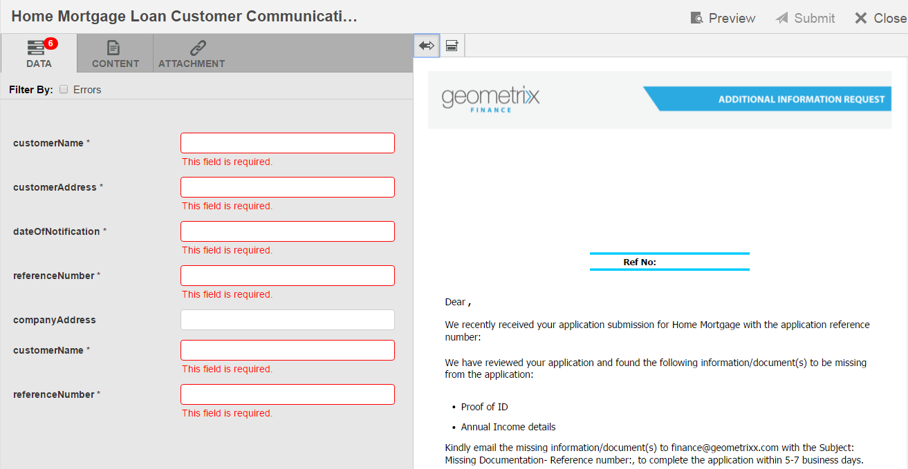
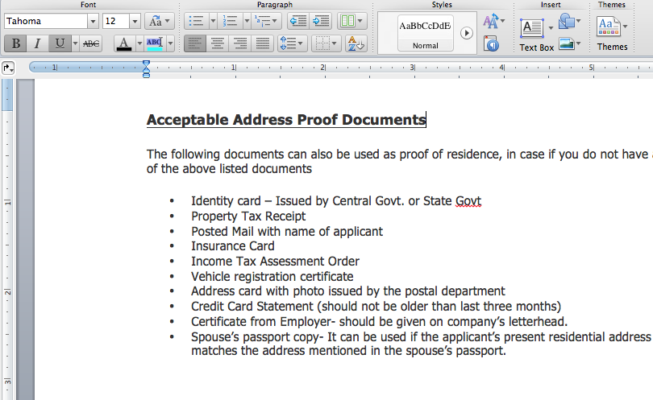

# Skapa korrespondens{#create-correspondence}

## Skapa korrespondens i användargränssnittet Skapa korrespondens {#create-correspondence-in-the-create-correspondence-user-interface}

Efter [brevmall skapad i korrespondenshantering](../../forms/using/create-letter.md)kan slutanvändaren/agenten/anspråksjusteraren öppna brevet i användargränssnittet Skapa korrespondens och skapa en korrespondens genom att ange data, konfigurera innehåll och hantera bilagor. Slutligen kan anspråksjusteraren eller agenten hantera innehållet i förhandsgranskningsläget och skicka brevet.

### Förhandsgranska korrespondens {#preview-a-correspondence}

Markera den bokstav du vill förhandsgranska genom att följa följande steg:

1. Tryck på **Välj**.
1. Välj lämplig bokstav genom att trycka på den.

   

   Markera brev

1. För en ordlistebaserad bokstav väljer du **Förhandsgranska** > **Förhandsgranska**. Om du vill använda en annan bokstav än en ordlista väljer du **Förhandsgranska**. Du kan också hålla pekaren över en bokstav (utan att markera den) och förhandsgranska den genom att trycka på ikonen Förhandsgranska brev.

   >[!NOTE]
   >
   >Om ett datalexikon inte är associerat med bokstaven visas förhandsgranskningen av bokstaven. Om bokstaven är dataordlistebaserad visar Korrespondenshantering alternativen Förhandsvisa och Anpassad på menyn Förhandsvisa och du kan välja ett av de två alternativen. Du kan också koppla testdata till en datamordlista. När [Data Dictionary har associerade testdata](../../forms/using/data-dictionary.md#p-working-with-test-data-p)När du sedan väljer förhandsvisningsalternativet öppnas den normala förhandsvisningen med testdata ifyllda.

1. Om du vill kunna återge en korrespondens medan du förhandsgranskar den, bör du antingen vara administratör eller en del av någon av följande grupper:

   * formulär-användare (för förhandsgranskning på författarinstans)
   * cm-agent-users (för återgivning vid publicering)

   Om du inte har de behörigheter som krävs ber du administratören om rätt åtkomst. Mer information om hur du skapar och lägger till användare i grupper finns i [Lägga till användare eller grupper i en grupp](/help/sites-administering/security.md). Om du försöker återge en korrespondens utan att ha rätt behörighet visas felsidan 404.

1. Om du har valt **Förhandsgranska** > **Egen**&#x200B;öppnas en dialogruta. I dialogrutan markerar du en datafil, som motsvarar dataordlistan, som du vill förhandsgranska bokstaven med och väljer sedan **Förhandsgranska**. En datafil skapas baserat på ett datalexikon för en viss bokstav. Mer information om datafilen finns i [Dataordlista](../../forms/using/data-dictionary.md#p-working-with-test-data-p).

   

1. Bokstaven HTML (förhandsgranskning av mobilformulär) öppnas som standard med fliken Data i fokus.

   Mer information om mobilformulär och vilka funktioner de har stöd för finns i [Skillnaden mellan Mobile Forms och PDF forms](https://helpx.adobe.com/livecycle/help/mobile-forms/feature-differentiation-mobile-forms-pdf.html).

   Det finns tre flikar: data, innehåll och bilagor. Om det inte finns några dataelement (platshållarvariabler och layoutfält) öppnas bokstaven direkt i med fliken Innehåll. Fliken Bifogade filer är bara tillgänglig när det finns bifogade filer eller när biblioteksåtkomst är aktiverat.

   >[!NOTE]
   >
   >Mer information om hur du växlar mellan återgivningsläget HTML eller PDF i förhandsgranskningen av brevet finns i [Ändra återgivningsläge för bokstav](#changerenditionmode). Mer information om stöd för PDF i Correspondence Management och AEM finns i [Avbrutna insticksprogram för NPAPI-webbläsare och deras inverkan](https://helpx.adobe.com/aem-forms/kb/discontinuation-of-npapi-plugins-impact-on-aem-forms.html) och [PDF forms till HTML5 Forms](https://helpx.adobe.com/aem-forms/kb/pdf-forms-to-html5-forms.html).

### Ange data {#enterdata}

Fyll i de tillgängliga layoutfälten och platshållarna på fliken Data.

1. Ange data- och innehållsvariablerna i fälten efter behov. Fyll i alla obligatoriska fält markerade med en asterisk (&#42;) för att aktivera **Skicka** -knappen.

   Tryck på ett datafältvärde i förhandsvisningen av HTML för att markera motsvarande datafält på fliken Data.

    

### Hantera innehåll {#managecontent}

På fliken Innehåll hanterar du innehåll som dokumentfragment och innehållsvariabler i brevet.

1. Välj **Innehåll**. Korrespondenshanteringen visar fliken Innehåll i brevet.

   

1. Redigera innehållsmodulerna efter behov på fliken Innehåll. Om du vill fokusera på den relevanta innehållsmodulen i innehållshierarkin kan du antingen trycka på den relevanta raden eller det relevanta stycket i förhandsgranskningen av bokstaven eller trycka på innehållsmodulen direkt i innehållshierarkin.

   Till exempel raden&quot;Vi har granskat.. &quot; är markerat i bilden nedan och den relevanta innehållsmodulen är markerad på fliken Innehåll.

   

   Genom att trycka på Markera valda moduler på fliken Innehåll eller Data ( ) längst upp till vänster i förhandsgranskningen av HTML kan du inaktivera eller aktivera funktioner för att gå till innehålls-/datamodulen när relevant text, stycke eller datafält är markerat i förhandsgranskningen av bokstaven.

   Mer information om åtgärder som är tillgängliga för olika moduler i användargränssnittet Skapa korrespondens finns i [Åtgärder och information som finns i användargränssnittet Create Correspondence](#actions-and-info-available-in-the-create-correspondence-content-tab).

1. Om du vill söka efter innehållsmoduler använder du fältet Sök. Ange det fullständiga eller delvisa namnet eller titeln på innehållsmodulen för att söka efter den i korrespondensen.
1. Tryck på ikonen Visa ( ) framför en lista, text, villkor eller målområde för att visa eller dölja den i bokstaven.
1. Om du vill redigera en textbunden eller redigerbar textmodul trycker du på motsvarande **Redigera** ikon ( ) eller dubbelklicka på den relevanta textmodulen i förhandsgranskningen av bokstaven.

   Systemet visar en textredigerare för att redigera och formatera texten.

   Standardstavningskontrollen i webbläsaren kontrollerar stavningen i textredigeraren. Om du vill hantera stavnings- och grammatikkontrollen kan du redigera stavningskontrollinställningarna i webbläsaren eller installera plugin-program/tillägg för webbläsaren för att kontrollera stavning och grammatik.

   Du kan också använda de olika kortkommandona i textredigeraren för att hantera, redigera och formatera text. Mer information om [Textredigerare](/help/forms/using/keyboard-shortcuts.md#correspondence-management) kortkommandon i Kortkommandon för korrespondenshantering.

   

   Du kanske vill återanvända ett av flera textstycken som finns i ett annat dokumentprogram. Du kan kopiera och klistra in text direkt, t.ex. från MS Word, HTML eller något annat program.

   Du kan kopiera och klistra in ett eller flera textstycken i en redigerbar textmodul. Du kan t.ex. ha ett MS Word-dokument med en punktlista över godkända bevis för uppehälle, som följande:

   

   Du kan kopiera och klistra in texten direkt från MS Word-dokumentet i en redigerbar textmodul. Formateringen som punktlistor, teckensnitt och textfärger behålls i textmodulen.

   

   >[!NOTE]
   >
   >Formateringen av inklistrad text har dock vissa [begränsningar](https://helpx.adobe.com/aem-forms/kb/cm-copy-paste-text-limitations.html).

   Du kan dra in text och siffror i brevet med tabbtangenten. Du kan till exempel använda tabbtangenten för att justera flera textkolumner i en lista till ett tabellformat.

   

   Exempel: Använda tabbtangenten för att justera flera textkolumner i ett tabellformat

   >[!NOTE]
   >
   >Mer information om hur du ställer in tabbavstånd för textmoduler och bokstäver finns i [Mer information om hur du använder tabbavstånd för att ordna text](https://helpx.adobe.com/aem-forms/kb/cm-tab-spacing-limitations.html).

1. Infoga vid behov specialtecken i korrespondensen. Du kan till exempel använda paletten Specialtecken för att infoga:

   * Valutasymboler som €,¥ och £
   * Matematiska symboler som t.ex.¥, Ð och ^
   * Interpunktionssymboler som ‟ och &quot;

   

   Correspondence Management har inbyggt stöd för 210 specialtecken. Administratören kan [lägg till stöd för fler/anpassade specialtecken genom anpassning](../../forms/using/custom-special-characters.md).

1. Markera texten och tryck på Markera färg om du vill framhäva delar av texten i en redigerbar textbunden modul.

   

   Du kan antingen trycka direkt på en grundfärg `**[A]**` finns på paletten Grundläggande färger eller trycker **Välj** efter användning av skjutreglaget `**[B]**` för att välja lämplig ton för färgen.

   Du kan också gå till fliken Avancerat och välja lämplig nyans, ljushet och mättnad `**[C]**` för att skapa en exakt färg och sedan trycka på Välj `**[D]**` om du vill använda färgen för att markera texten.

   

1. Ändra innehåll och format och tryck **Spara**. Tryck på ( ) för att gå mellan redigerbara textmoduler eller trycka **Spara och nästa** om du vill spara ändringarna och gå till nästa redigerbara textmodul.
1. Systemet visar också de ofyllda variablerna för var och en av grenarna. Om det inte finns några ofyllda variabler visas ofyllda variabler som 0. Om det finns en ofylld variabel kan du trycka på en gren för att expandera den och leta reda på den ofyllda variabeln. Använd verktygsfältet Innehåll för att ta bort innehåll, öka/minska indrag för innehållet och infoga sidbrytningar före/efter innehållet.

   Du kan infoga sidbrytningar ovanför och under datamoduler även när de ingår i listor och villkor.

1. Tryck på Öppna/Stäng innehållsvariabel ( ) för att öppna innehållsvariablerna och fylla i dem korrekt.
1. När du har fyllt i den ofyllda variabeln korrekt anges antalet ofyllda variabler till 0.

   I användargränssnittet Skapa korrespondens visas det ofyllda variabelantalet på varje nivå i hierarkin för en modul som innehåller minst en variabel. Om en modul innehåller ofyllda variabler visas antalet på variabel-, modul-, målområdes- och brevmallsnivå.

   Antal ofyllda variabler inkluderar:

   * Endast oskyddade dataordliste- och platshållarvariabler. Variabelantalet innehåller inte layoutvariabler eller variabler för skyddade dataordlistor.
   * Obligatoriska fält.
   * Layoutfält om de är obligatoriska och bundna till användaren.
   * Endast unika variabelinstanser. Om en modul, målområde eller brevmall innehåller två eller flera instanser av samma variabel, visas antalet som 1 (en). För var och en av förekomsterna visas dock antalet som 1.

   Antal ofyllda variabler inkluderar inte avmarkerade moduler. Om en modul ingår i en brevmall men inte i bokstaven visas inte antalet ofyllda variabler i den här modulen.

   För målområdet, modulen och variabeln visas antalet till höger om varje objekt i bokstavsmallen. För den fullständiga mallen visas dock antalet i statusfältet Skapa korrespondens.

   Modulerna i en brevmall visar det ofyllda variabelantalet enligt beskrivningen nedan:

   * **Text** Visar summan av de unika ofyllda platshållarvariablerna och dataordlisteelementen i textmodulen.
   * **Villkor** Visar summan av de unika ofyllda villkorsvariablerna i villkoret och variablerna i de resulterande modulerna.
   * **Lista** Visar summan av alla unika ofyllda variabler som finns i modulerna som är tilldelade till listan.
   * **Målområde** Visar summan av alla unika ofyllda variabler som finns i modulerna som tilldelats målområdet.

   Observera följande när det gäller variabler med standardvärden:

   * Ett booleskt variabelfält får som standard värdet *false*. Variabeln anses dock vara ofylld. Det innebär att variabelantalet innehåller alla booleska variabelfält med värde *false*.

   * Ett numeriskt variabelfält blir som standard *0 (noll)*. Variabeln anses dock vara ofylld. Det innebär att variabelantalet innehåller alla numeriska variabelfält med värde *0 (noll)*.

#### Åtgärder och information som är tillgängliga på fliken Skapa korrespondensinnehåll {#actions-and-info-available-in-the-create-correspondence-content-tab}

**Målområde**

* Infoga tom rad: Infogar en ny tom rad.
* Infoga textbunden text: Infogar ny textmodul.
* Orderlås (info): Anger att ordningen för innehållet inte kan ändras.
* Ofyllda värden (info): Anger antalet ofyllda variabler i målområdet.

**Modul**

* Markering (ögonikon): Inkluderar\exkluderar modul från brevet.
* Hoppa över punkter (gäller för listmoduler och deras underordnade moduler): Hoppar över punkter i en viss modul.
* Sidbrytning före (gäller för underordnade moduler i målområdet): Infogar sidbrytning före modulen.
* Sidbrytning efter (gäller för underordnade moduler i målområdet): Infogar sidbrytning före modulen.
* Ofyllda värden (info): Anger antalet ofyllda variabler i målområdet.
* Redigera (endast textmoduler): Öppna RTF-redigeraren för att redigera textmodulen.
* Datapanelen (text- och villkorsmoduler): Öppna alla variabler i modulen.

**Listmodul**

* Infoga tom rad: Infogar en ny tom rad.
* Innehållsbibliotek: Öppnar innehållsbiblioteket för att lägga till moduler i listan.
* Listinställning (endast kapslad lista):
* Orderlås (info): Anger att ordningen för listobjekten inte kan ändras.

### Hantera bilagor {#manage-attachments}

1. Välj **Bifogade filer**. Korrespondenshanteringen visar de tillgängliga bifogade filerna, enligt inställningarna när brevmallen skapas.
1. Du kan välja att inte skicka en bifogad fil tillsammans med bokstaven genom att trycka på visningsikonen och du kan trycka på krysset i den bifogade filen för att ta bort den från bokstaven. För de bifogade filer som anges inaktiveras ikonerna Visa och Ta bort när du skapar en brevmall som Obligatorisk.
1. Tryck på Library Access ( ) för att komma åt innehållsbiblioteket och infoga DAM-resurser som bilagor.

   >[!NOTE]
   >
   >Ikonen Biblioteksåtkomst är bara tillgänglig när biblioteksåtkomst aktiverades när brevet redigerades.

1. Om ordningen på de bifogade filerna inte var låst när du skapade korrespondensen kan du ändra ordningen på de bifogade filerna genom att markera en bifogad fil och trycka på upp- och nedpilarna.

   Mer information finns i [Leverans av bifogade filer](#attachmentdelivery).

### Hantera innehåll i förhandsgranskning och skicka brevet {#manage-content-in-preview-and-submit-the-letter}

Du kan göra layout- och innehållsrelaterade ändringar för att se till att brevet ser ut som du tänkt dig och skicka det till olika postprocesser.

1. Om du vill markera allt redigerbart innehåll i brevet trycker du **Markera redigerbara avsnitt**.

   Det redigerbara innehållet i bokstaven markeras med grå bakgrund.

   

1. Redigera innehållsmodulerna efter behov på fliken Innehåll. Om du vill fokusera på den relevanta innehållsmodulen i innehållshierarkin kan du antingen trycka på den relevanta raden eller det relevanta stycket i förhandsgranskningen av bokstaven eller trycka på innehållsmodulen direkt i innehållshierarkin.

   Till exempel raden &quot;Att ge oss åtkomst..&quot; är markerat i bilden nedan och motsvarande innehållsmodul är markerad på fliken Innehåll.

   Genom att trycka på Markera valda moduler i innehållet ( ) kan du inaktivera eller aktivera funktioner för att markera innehållsmodulen på fliken Innehåll när användaren knackar på den relevanta texten, stycket eller datafältet i förhandsgranskningen av bokstaven.

   Mer information om åtgärder som är tillgängliga för olika moduler i användargränssnittet Skapa korrespondens finns i [Åtgärder och information som finns i användargränssnittet Create Correspondence](#actions-and-info-available-in-the-create-correspondence-content-tab).

1. Om du vill lägga till en sidbrytning i brevet trycker du där du vill infoga en sidbrytning och väljer Sidbrytning före eller Sidbrytning efter ( ).

   En explicit sidbrytningsplatshållare infogas i brevet. Om du vill se hur en explicit sidbrytning påverkar bokstaven läser du i den förenklade PDF-förhandsvisningen.

   >[!NOTE]
   >
   >Eftersom mobilformulär inte stöder sidbrytningar visas bara sidhuvuden och sidfötter en gång. Du kan dock uttryckligen ange att sidhuvuden och sidfötter i layouten (per sida) ska visas i förhandsvisningen av mobilformulär. Eventuella tomma sidor i brevet visas inte heller i förhandsgranskningen av mobilformulär.

   

1. Om du vill spara brevet som ett utkast, som du kan fortsätta att arbeta med senare, trycker du på Spara som utkast. Om du vill använda det här alternativet måste ditt brev vara [publicerad](../../forms/using/publishing-unpublishing-forms.md#publishanasset). Mer information finns i Utkastinstans under [Spara utkast och skicka brev](#savingdrafts).

   

   Dialogrutan Utkastbokstavsnamn visas med bokstavskod-ID. Du kan också redigera detta ID. Anteckna brev-ID:t och tryck sedan på **Klar**. Du kan senare använda detta ID för att [läsa in utkastet igen](submit-letter-topostprocess.md#reloaddraft).

1. Om du vill förhandsgranska bokstaven som ett förenklat PDF med exakt layout och sidbrytningar när den skickas trycker du på ( ) Förhandsgranska.

   Bokstaven visas som ett förenklat PDF. Det förenklade PDF är den exakta representationen av brevet så som det kommer att skickas med rätt teckensnitt, brytningar och layout för brevet.

   >[!NOTE]
   >
   >Om du använder återgivningstypen Mozilla Firefox och HTML måste du använda insticksprogrammet för webbläsaren och inte Acrobat för att förhandsgranska bokstaven som separerad PDF. Om du vill välja insticksprogrammet för webbläsaren går du till Mozilla Firefox-inställningarna och för innehållstypen PDF väljer du Förhandsgranska i Firefox.

1. Om du tycker att den förenklade förhandsvisningen av PDF är tillfredsställande trycker du **Skicka** för att skicka brevet. Du kan också ändra brevet genom att trycka **Avsluta förhandsgranskning** om du vill gå tillbaka till förhandsgranskningen av gränssnittet Skapa korrespondens för brevet för att göra ändringar i brevet. När du trycker på Submit (Skicka), om konfigurationen Hantera bokstavsinstans är aktiverad på Publish-instansen, genereras instansen för att skicka brev.

   Mer information finns i Utkastinstans under Spara utkast och skicka brevinstanser.

   Du kan också spara brevet som ett utkast om du vill ändra det senare.

   När du har gjort de ändringar du vill kan du antingen skicka brevet från HTML5-förhandsvisningen eller trycka på Förhandsgranska igen för att granska den förenklade utskriften för PDF.

   Mer information om skillnaderna mellan HTML5-formulär och PDF forms finns i [Skillnaden mellan HTML5-formulär och PDF forms](../../forms/using/feature-differentiation-html5-forms-pdf-forms.md).

## Spara utkast och skicka brev {#savingdrafts}

När ett brev återges i användargränssnittet Skapa korrespondens kan du spara brevet som om det visas.

Det finns två typer av bokstavsinstanser som kan sparas: Utkastinstans och Skicka-instans.

* **Utkastinstans**: Utkastinstansen fångar det aktuella läget för den bokstav du förhandsgranskar. Om du vill spara en utkastinstans måste du först kontrollera att bokstaven och alla resurser som den refererar till är i publicerat läge. Mer information om hur du publicerar brev finns i [Publicera en resurs](../../forms/using/publishing-unpublishing-forms.md#publishanasset). Du måste publicera ett brev innan du kan spara det som ett utkast, eftersom du när du publicerar ett brev skapar en version av brevet, dess beroende resurser och data vid den tidpunkten. Den publicerade versionen av ett brev kan inte redigeras av dig eller en annan användare och kan återställas senare utan oväntade avvikelser från den publicerade versionen. Du kan gå tillbaka till den här instansen senare och fortsätta därifrån du gick.

* **Skicka instans**: Submit-förekomster används för att hämta status för brevet när det skickas. Instansen Submit lagrar PDF-läget för bokstavsinstansen efter att den har efterbearbetats tillsammans med de data som anges av användaren i användargränssnittet Create Correspondence.

Sådana instanser kan bara sparas när brevet visas på en publiceringsinstans. Som standard är sparandet av instanser inaktiverat. Gör så här om du vill att instanser av bokstäver ska kunna sparas:

1. I AEM öppnar du Adobe Experience Manager Web Console Configuration för servern med följande URL: https://&lt;server>:&lt;port>/&lt;contextpath>/system/console/configMgr
1. Sök **[!UICONTROL Correspondence Management Configurations]** och klicka på den.
1. Kontrollera **[!UICONTROL Manage Letter Instances on Publish]** konfiguration och klicka sedan på **[!UICONTROL Save]**.

### Aktivera funktionen Spara utkast {#enable-save-draft-feature}

Innan du publicerar brev eller sparar utkast på publiceringsinstansen utför du följande steg på författaren och publiceringsinstansen för att aktivera funktionen Spara som utkast:

The *cq:lastReplicationAction*, *cq:lastreplikerad* och *cq:lastReplicatedBy* egenskaperna överförs inte som standard till publiceringsinstansen. För att föra över *cq:lastReplicationAction*, *cq:lastreplikerad* och *cq:lastReplicatedBy* egenskaper för publiceringsinstans, inaktivera [!UICONTROL com.day.cq.replication.impl.ReplicationPropertiesFilterFactory] -komponenten. Så här inaktiverar du komponenten:

1. Öppna Adobe Experience Manager Web Console Components-konsolen på författarinstansen. Standardwebbadressen är `http://author-server:port/system/console/components`

1. Sök efter **[!UICONTROL com.day.cq.replication.impl.ReplicationPropertiesFilterFactory]** -komponenten.

1. Klicka  ikonen för att inaktivera [!UICONTROL com.day.cq.replication.impl.ReplicationPropertiesFilterFactory] -komponenten.

Om du vill aktivera Spara som utkast-funktionen ersätter du den befintliga URL:en på [!UICONTROL VersionRestoreManager Author URL] med URL:en till din författarinstans. Så här ersätter du URL-adressen:

1. Öppna i publiceringsinstansen [!UICONTROL Aode Manager Web Console Configuration]. Standardwebbadressen är `https://publish-server:port/system/console/configMgr`

1. Sök och öppna **[!UICONTROL Correspondence Management - Author instance Version Restore configurations]** -komponenten.

1. Leta reda på **[!UICONTROL VersionRestoreManager Author URL]** och ange URL:en för författarinstansen.

1. Klicka på Spara.

När du har aktiverat funktionen för att spara bokstäver kan du välja var du vill spara bokstavsinstanserna. Det finns två alternativ för att spara bokstavsinstanser: Spara lokalt eller Fjärrspara.

### Spara lokalt {#local-save}

Bokstavsinstanser sparas på publiceringsinstansen och replikeras omvänt på författarinstansen.

### Fjärrspara {#remote-save}

Det här alternativet finns för personer som har problem med att spara användardata vid publiceringsinstanser, vilket vanligtvis är utanför företagets brandvägg. När fjärrsparning är aktiverat sparas inte bokstavsinstanserna i publiceringsinstansen, men de sparas på fjärrbasis på den bearbetningsförfattare som har angetts via SDK-konfigurationerna för LiveCycle-klienten.

#### Aktivera fjärrsparande {#enable-remote-save}

1. I AEM öppnar du Adobe Experience Manager Web Console Configuration för servern med följande URL: `https://<server>:<port>/<contextpath>/system/console/configMgr`
1. Sök efter **[!UICONTROL Correspondence Management Configurations]** och klicka på den.
1. Leta reda på **[!UICONTROL Remote Save]** konfiguration, kontrollera och klicka **[!UICONTROL Save]**.

#### Ange inställningar för bearbetningsförfattare {#specify-processing-author-settings}

1. I AEM öppnar du Adobe Experience Manager Web Console Configuration för servern med följande URL: `https://<server>:<port>/system/console/configMgr`

   

1. På den här sidan letar du upp SDK-konfigurationen för LiveCycle-klienten och expanderar den genom att klicka på den.

1. Ange namnet på LiveCycle-servern i URL-adressen till bearbetningsservern, ange inloggningsinformationen och klicka sedan på **Spara**.

   

1. Ange vid behov användarnamnet och lösenordet som du vill använda för att få åtkomst till servern.

#### Leverans av bifogade filer {#attachmentdelivery}

* Brevbilagorna är tillgängliga efter postprocessen i PDF, som skapas efter att brevet skickats in.
* När bokstaven återges med hjälp av API:er på serversidan som en interaktiv eller icke-interaktiv PDF, innehåller det återgivna PDF bilagor som bilagor i PDF.
* När en inläggsprocess som är kopplad till en brevmall läses in som en del av åtgärderna Skicka eller Fullständig korrespondens med användargränssnittet Skapa korrespondens, skickas bilagor som List&lt;com.adobe.idp.document> i parametern AttachmentDocs.
* Färdiga leveransmekanismer som e-post och utskrift, levererar också bilagor tillsammans med PDF i den genererade korrespondensen.

## Återgivningslägen för förhandsgranskning av brev: Förhandsgranskning av mobilformulär och förhandsgranskning av PDF {#rendition-modes-of-letter-preview-mobile-forms-preview-and-pdf-preview}

AEM Forms Correspondence Management visar ett brev som HTML i användargränssnittet Create Correspondence. Korrespondenshanteringen har dock fortfarande stöd för att återgå till förhandsvisningen i PDF i stället för till förhandsvisningen i HTML. Mer information om hur du växlar mellan förhandsvisningsläget HTML och PDF finns i [Ändra återgivningsläge för bokstav](#changerenditionmode).

Nedan följer de fördelar och funktioner som finns i HTML och PDF Preview.

**Fördelar med mobilformulär/förhandsgranskning i HTML**

* **Tryck på ett datafältvärde för att markera motsvarande datafält**: I användargränssnittet Skapa korrespondens kan du trycka på ett datafältvärde i brevet för att markera motsvarande datafält på fliken Data. Mer information finns i [Ange data](#enterdata).

* **Stöd för webbläsare**: Webbläsare: stöd för att dra tillbaka NPAPI gradvis, vilket påverkar förhandsgranskningen av brevet i PDF. Förhandsgranskning av brev i HTML/mobilformulär påverkas inte av detta.
* **Markera redigerbart innehåll i en bokstav**: I användargränssnittet Skapa korrespondens kan du trycka på Markera redigerbart innehåll för att markera allt redigerbart innehåll i brevet i grått. Mer information finns i [Hantera innehåll](#managecontent).

`<li>` `<li>Benefits of HTML preview  <ul>   <li>Right to left</li>   <li>NPAPI</li>   <li>Highlight Editable Content</li>  </ul> </li>` `<li>Benefits of PDF preview  <ul>   <li>Page Break</li>   <li>Final Preview</li>  </ul> </li>`
`<li>` `<li>Benefits of HTML preview  <ul>   <li>Right to left</li>   <li>NPAPI</li>   <li>Highlight Editable Content</li>  </ul> </li>` `<li>Benefits of PDF preview  <ul>   <li>Page Break</li>   <li>Final Preview</li>  </ul> </li>`  **Fördelar med PDF Preview**

* **Sidbrytning**: I förhandsgranskningen av PDF kan du se exakt hur sidbrytningarna i brevet påverkar utdata.
* **Slutlig förhandsgranskning**: I förhandsgranskningen av PDF kan du se den exakta formateringen och utseendet på brevet så som det kommer att se ut i utskriften.

Mer information om skriptstöd i PDF forms finns i [Skriptstöd](https://help.adobe.com/en_US/livecycle/11.0/ScriptingSupport/index.html).

Mer information om skriptstöd i HTML5-formulär finns i [Skriptstöd för HTML5-formulär](/help/forms/using/scripting-support.md).

### Ändra återgivningsläge för bokstav {#changerenditionmode}

Som standard använder gränssnittet Skapa korrespondens HTML eller mobilformulär för att återge förhandsgranskningen av brevet. Förhandsgranskningen av mobilformulär har inga problem med återgivningen i någon webbläsare, eftersom webbläsarens inbyggda plugin-program används och inga ytterligare plugin-program krävs. Du kan ändra förhandsgranskningsläget för brev till PDF. Webbläsarbegränsningar kan dock skapa problem för olika funktioner i den interaktiva PDF-förhandsgranskningen av brevet.

Mer information om webbläsarkompatibilitet med förhandsgranskning av brev finns i [Avbrutna insticksprogram för NPAPI-webbläsare och deras inverkan](https://helpx.adobe.com/aem-forms/kb/discontinuation-of-npapi-plugins-impact-on-aem-forms.html).

Om du vill ändra förhandsgranskningsläget för brevet utför du följande steg:

1. Gå till `https://[system]:'port'/system/console/configMgr` och logga in som administratör om det behövs.
1. Gå till **[!UICONTROL Correspondence Management Configurations]** > **[!UICONTROL Rendition Type]** och markera **HTML Rendition** (Standard) eller **PDF Rendition**.
1. Klicka på **[!UICONTROL Save]**.
