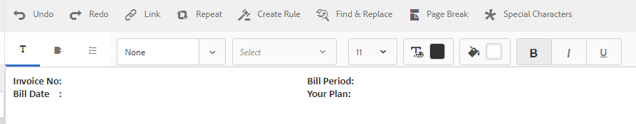

# Självstudie: Skapa dokumentfragment{#tutorial-create-document-fragments}

Den här självstudiekursen är ett steg i [Skapa din första interaktiva kommunikationsserie](/help/forms/using/create-your-first-interactive-communication.md). Adobe rekommenderar att du följer serien i kronologisk ordning för att förstå, utföra och demonstrera det fullständiga självstudiekursen.

Dokumentfragment är återanvändbara komponenter i en korrespondens som används för att skapa en interaktiv kommunikation. Dokumentfragmenten är av följande typer:

* Text - En textresurs är en del av innehållet som består av ett eller flera textstycken. Ett stycke kan vara statiskt eller dynamiskt.
* List - List är en grupp med dokumentfragment, inklusive text, listor, villkor och bilder.
* Villkor - Med villkor kan du definiera vilket innehåll som ska inkluderas i den interaktiva kommunikationen baserat på data som tas emot från formulärdatamodellen.

I den här självstudiekursen får du hjälp med att skapa flera textdokumentfragment baserat på den anatomi som finns i avsnittet [Planera interaktiv kommunikation](/help/forms/using/planning-interactive-communications.md). I slutet av den här självstudiekursen kan du göra följande:

* Skapa dokumentfragment
* Skapa variabler
* Skapa och tillämpa regler

Här följer en lista över dokumentfragment som har skapats i den här självstudiekursen:

* [Fakturainformation](../../forms/using/create-document-fragments.md#step-create-bill-details-text-document-fragment)
* [Kundinformation](../../forms/using/create-document-fragments.md#step-create-customer-details-text-document-fragment)
* [Sammanfattning av faktura](../../forms/using/create-document-fragments.md#step-create-bill-summary-text-document-fragment)
* [Sammanfattning av avgifter](../../forms/using/create-document-fragments.md#step-create-summary-of-charges-text-document-fragment)

Varje dokumentfragment innehåller fält med statisk text, data som tagits emot från formulärdatamodellen och data som matats in med agentens användargränssnitt. Alla dessa fält har beskrivits i avsnittet [Planera interaktiv kommunikation](/help/forms/using/planning-interactive-communications.md).

När du skapar dokumentfragment i den här självstudiekursen skapas variabler för fält som tar emot data med hjälp av agentens användargränssnitt.

Använd **FDM_Create_First_IC**, som beskrivs i avsnittet [Skapa formulärdatamodell](../../forms/using/create-form-data-model0.md), som formulärdatamodell för att skapa dokumentfragment i den här självstudien.

## Steg 1: Skapa dokumentfragment för fakturainformation {#step-create-bill-details-text-document-fragment}

Dokumentfragmentet för faktureringsinformation innehåller följande fält:

| Fält | Data Source |
|---|---|
| Fakturanummer | Agentgränssnitt |
| Faktureringsperiod | Agentgränssnitt |
| Faktureringsdatum | Agentgränssnitt |
| Din plan | Formulärdatamodell |

Så här skapar du variabler för fält med agentanvändargränssnittet som datakälla, skapar statisk text och använder formulärdatamodellelement i dokumentfragmentet:

1. Välj **[!UICONTROL Forms]** > **[!UICONTROL Document Fragments]**.

1. Välj **Skapa** > **Text**.
1. Ange följande information:

   1. Ange **Bill_details_first_ic** som namn i fältet **Title**. Titeln fylls i automatiskt i fältet **Namn**.

   1. Välj **Formulärdatamodell** i avsnittet **Datamodell**.

   1. Välj **FDM_Create_First_IC** som formulärdatamodell och välj **Välj**.

   1. Välj **Nästa**.

1. Markera fliken **Variabler** i den vänstra rutan och välj **Skapa**.
1. I avsnittet **Skapa variabel**:

   1. Ange **fakturanummer** som namn på variabeln.
   1. Välj **String** som typ.
   1. Välj **Skapa**.

   

   Upprepa steg 4 och 5 för att skapa följande variabler:

   * Faktureringsperiod: Strängtyp
   * Faktureringsdatum: Datumtyp

   

1. Skapa statisk text för följande fält med den högra rutan:

   * Fakturanummer
   * Faktureringsperiod
   * Faktureringsdatum
   * Din plan

   

1. Placera markören bredvid fältet **Fakturanr** och dubbelklicka på variabeln **InvoiceNumber** från fliken **Variables** i den vänstra rutan.
1. Placera markören bredvid fältet **Faktureringsperiod** och dubbelklicka på variabeln **Faktureringsperiod**.
1. Placera markören bredvid fältet **Faktureringsdatum** och dubbelklicka på variabeln **Faktureringsdatum** .
1. Markera fliken **Datamodellsobjekt** i den vänstra rutan.
1. Placera markören bredvid fältet **Din plan** och dubbelklicka på egenskapen **customer** > **customerplan** .

   

1. Klicka på **Spara** för att skapa dokumentfragmentet för faktureringsinformation.

## Steg 2: Skapa textfragment för kundinformation {#step-create-customer-details-text-document-fragment}

Dokumentfragmentet Kundinformation innehåller följande fält:

| Fält | Data Source |
|---|---|
| Kundnamn | Formulärdatamodell |
| Adress | Formulärdatamodell |
| Leveransort | Agentgränssnitt |
| Statuskod | Agentgränssnitt |
| Mobilnummer | Formulärdatamodell |
| Alternativt kontaktnummer | Formulärdatamodell |
| Relationsnummer | Formulärdatamodell |
| Antal anslutningar | Agentgränssnitt |

Så här skapar du variabler för fält med agentanvändargränssnittet som datakälla, skapar statisk text och använder formulärdatamodellelement i dokumentfragmentet:

1. Välj **[!UICONTROL Forms]** > **[!UICONTROL Document Fragments]**.
1. Välj **Skapa** > **Text**.
1. Ange följande information:

   1. Ange **customer_details_first_ic** som namn i fältet **Title**. Titeln fylls i automatiskt i fältet **Namn**.

   1. Välj **Formulärdatamodell** i avsnittet **Datamodell**.

   1. Välj **FDM_Create_First_IC** som formulärdatamodell och välj **Välj**.

   1. Välj **Nästa**.

1. Markera fliken **Variabler** i den vänstra rutan och välj **Skapa**.
1. I avsnittet **Skapa variabel**:

   1. Ange **Placesupply** som namn på variabeln.
   1. Välj **String** som typ.
   1. Välj **Skapa**.

   Upprepa steg 4 och 5 för att skapa följande variabler:

   * Statcode: Number-typ
   * Nummeranslutningar: Number-typ

1. Markera fliken **Datamodellsobjekt**, placera markören i den högra rutan och dubbelklicka på egenskapen **customer** > **name**.
1. Tryck på Retur för att flytta markören till nästa rad och dubbelklicka på egenskapen **customer** > **address** .
1. Skapa statisk text för följande fält med den högra rutan:

   * Mobilnummer
   * Alternativt kontaktnummer
   * Leveransort
   * Relationsnummer
   * Statuskod
   * Antal anslutningar

   

1. Placera markören bredvid fältet **Mobilnummer** och dubbelklicka på egenskapen **customer** > **mobilenum** .
1. Placera markören bredvid fältet **Alternativt kontaktnummer** och dubbelklicka på egenskapen** kund** > **alternateNumber** .
1. Placera markören bredvid fältet **Relationsnummer** och dubbelklicka på egenskapen **customer** > **relationsnummer** .
1. Markera fliken **Variabler**, placera markören bredvid fältet **Leveransställe** och dubbelklicka på variabeln **Placesupply** .
1. Placera markören bredvid fältet **Statuskod** och dubbelklicka på variabeln **Statskod** .
1. Placera markören bredvid fältet **Antal anslutningar** och dubbelklicka på variabeln **Numberconnections** .

   

1. Klicka på **Spara** för att skapa textavsnittet Kundinformation.

## Steg 3: Skapa dokumentfragment för faktureringssammanfattning {#step-create-bill-summary-text-document-fragment}

Dokumentfragmentet för faktureringssammanfattning innehåller följande fält:

| Fält | Data Source |
|---|---|
| Föregående saldo | Agentgränssnitt |
| Betalningar | Agentgränssnitt |
| Justeringar | Agentgränssnitt |
| Aktuell faktureringsperiod för avgifter | Formulärdatamodell |
| Belopp att betala | Agentgränssnitt |
| Förfallodatum | Agentgränssnitt |

Så här skapar du variabler för fält med agentanvändargränssnittet som datakälla, skapar statisk text och använder formulärdatamodellelement i dokumentfragmentet:

1. Välj **[!UICONTROL Forms]** > **[!UICONTROL Document Fragments]**.
1. Välj **Skapa** > **Text**.
1. Ange följande information:

   1. Ange **Bill_summary_first_ic** som namn i fältet **Title**. Titeln fylls i automatiskt i fältet **Namn**.

   1. Välj **Formulärdatamodell** i avsnittet **Datamodell**.

   1. Välj **FDM_Create_First_IC** som formulärdatamodell och välj **Välj**.

   1. Välj **Nästa**.

1. Markera fliken **Variabler** i den vänstra rutan och välj **Skapa**.
1. I avsnittet **Skapa variabel**:

   1. Ange **Previousbalance** som namn på variabeln.
   1. Välj **Number** som typ.
   1. Välj **Skapa**.

   Upprepa steg 4 och 5 för att skapa följande variabler:

   * Betalningar: Number-typ
   * Justeringar: Number-typ
   * Belopp: Number-typ
   * Duedate: Datumtyp

1. Skapa statisk text för följande fält med den högra rutan:

   * Föregående saldo
   * Betalningar
   * Justeringar
   * Aktuell faktureringsperiod för avgifter
   * Belopp att betala
   * Förfallodatum
   * Sena betalningsavgifter efter förfallodatumet är $ 20

   

1. Placera markören bredvid fältet **Föregående balans** och dubbelklicka på variabeln **Föregående balans** .
1. Placera markören bredvid fältet **Betalningar** och dubbelklicka på variabeln **Betalningar** .
1. Placera markören bredvid fältet **Justeringar** och dubbelklicka på variabeln **Justeringar** .
1. Placera markören bredvid fältet **Belopp förfaller** och dubbelklicka på variabeln **Belopp** .
1. Placera markören bredvid fältet **Förfallodatum** och dubbelklicka på variabeln **Förfallodatum** .
1. Markera fliken **Datamodellsobjekt**, placera markören bredvid fältet **Avgifter aktuell faktureringsperiod** i den högra rutan och dubbelklicka på egenskapen **Deklarationer** > **debiteringar**.

   

1. Klicka på **Spara** för att skapa textavsnittet Kundinformation.

## Steg 4: Skapa sammanfattning av avgiftstext Dokumentfragment {#step-create-summary-of-charges-text-document-fragment}

Sammanfattning av avgifter Dokumentfragment innehåller följande fält:

| Fält | Data Source |
|---|---|
| samtalsavgifter | Formulärdatamodell |
| Konferenssamtalskostnader | Formulärdatamodell |
| SMS-avgifter | Formulärdatamodell |
| Mobila internetavgifter | Formulärdatamodell |
| National Roaming Charts | Formulärdatamodell |
| Internationella roamingavgifter | Formulärdatamodell |
| Avgifter för värdeökade tjänster | Formulärdatamodell |
| Totala avgifter | Formulärdatamodell |
| TOTALT BETALNINGSBART | Formulärdatamodell |

Så här skapar du statisk text och använder formulärdatamodellelement i dokumentfragmentet:

1. Välj **[!UICONTROL Forms]** > **[!UICONTROL Document Fragments]**.
1. Välj **Skapa** > **Text**.
1. Ange följande information:

   1. Ange **summary_addas_first_ic** som namn i fältet **Title**. Titeln fylls i automatiskt i namnfältet.

   1. Välj **Formulärdatamodell** i avsnittet **Datamodell**.

   1. Välj **FDM_Create_First_IC** som formulärdatamodell och välj **Välj**.

   1. Välj **Nästa**.

1. Skapa statisk text för följande fält med den högra rutan:

   * samtalsavgifter
   * Konferenssamtalskostnader
   * SMS-avgifter
   * Mobila internetavgifter
   * National Roaming Charts
   * Internationella roamingavgifter
   * Avgifter för värdeökade tjänster
   * Totala avgifter
   * TOTALT BETALNINGSBART

   

1. Välj fliken **Datamodellsobjekt**.
1. Placera markören bredvid fältet **Anrop** och dubbelklicka på egenskapen **Bill** > **callCharges** .
1. Placera markören bredvid fältet **Konferenssamtalsavgifter** och dubbelklicka på egenskapen **Bill** > **concallCharges** .
1. Placera markören bredvid fältet **SMS Charges** och dubbelklicka på egenskapen **Bill** > **smscharges** .
1. Placera markören bredvid fältet **Mobile Internet Charges** och dubbelklicka på egenskapen **Bill** > **internetCharges** .
1. Placera markören intill fältet **National Roaming Charges** och dubbelklicka på egenskapen **Bill** > **Roaming National** .
1. Placera markören bredvid fältet **Internationella roaming Charges** och dubbelklicka på egenskapen **Bill** > **RoamingInl** .
1. Placera markören bredvid fältet **Värdetillägg** och dubbelklicka på egenskapen **Bill** > **vas** .
1. Placera markören bredvid fältet **Totalavgifter** och dubbelklicka på egenskapen **Bill** > **usagecharges** .
1. Placera markören bredvid fältet **TOTAL PAYABLE** och dubbelklicka på egenskapen **Bill** > **usagecharges** .

   

1. Markera texten i raden **Värdetillägg** och välj **Skapa regel** för att skapa ett villkor som baseras på raden som visas i den interaktiva kommunikationen:
1. I popup-fönstret **Skapa regel**:

   1. Välj **Datamodeller och variabler** och sedan **räkningar** > **callCharts**.

   1. Välj **är mindre än** som operator.
   1. Välj **Number** och ange värdet som **60**.

   Baserat på det här villkoret visas raden Värdetillägg för avgifter endast om värdet för fältet Anropsavgifter är mindre än 60.

   

1. Klicka på **Spara** för att skapa en sammanfattning av avgiftstexten Dokumentfragment.
