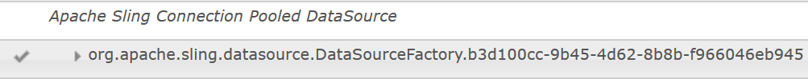
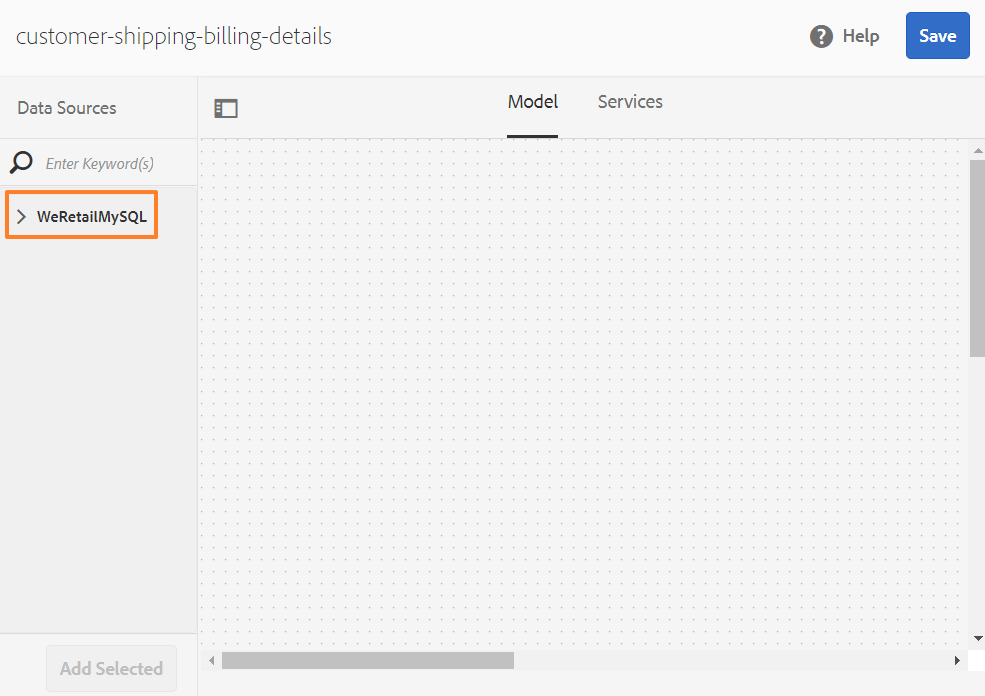
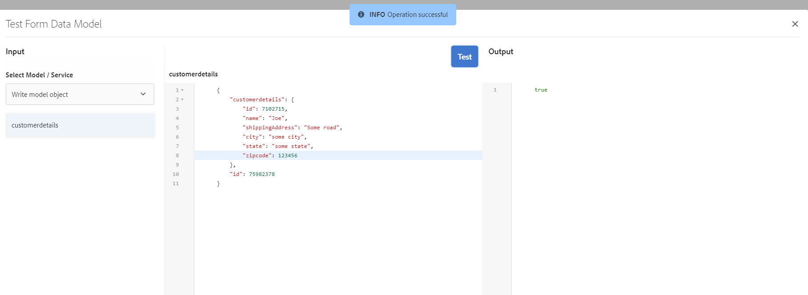

# Självstudiekurs:Skapa formulärdatamodell {#tutorial-create-form-data-model}

Den här självstudiekursen är ett steg i serien [Create Your First Adaptive Form](../../forms/using/create-your-first-adaptive-form.md) . Vi rekommenderar att du följer serien i kronologisk ordning för att förstå, utföra och demonstrera det fullständiga exemplet på självstudiekurser.

## Om självstudiekursen {#about-the-tutorial}

Med dataintegreringsmodulen för AEM Forms kan du skapa en formulärdatamodell från olika backend-datakällor, till exempel AEM-användarprofil, RESTful web services, SOAP-baserade webbtjänster, OData services och relationsdatabaser. Du kan konfigurera datamodellsobjekt och datatjänster i en formulärdatamodell och koppla den till ett anpassat formulär. Anpassningsbara formulärfält är bundna till objektegenskaper för datamodell. Med tjänsterna kan du förifylla det anpassningsbara formuläret och skriva skickade formulärdata tillbaka till datamodellobjektet.

Mer information om integrering av formulärdata och formulärdatamodell finns i [AEM Forms-dataintegrering](../../forms/using/data-integration.md).

I den här självstudiekursen får du hjälp med att förbereda, skapa, konfigurera och associera en formulärdatamodell med ett adaptivt formulär. I slutet av den här självstudiekursen kan du:

* [Konfigurera MySQL-databasen som datakälla](#config-database)
* [Skapa formulärdatamodell med MySQL-databas](#create-fdm)
* [Konfigurera formulärdatamodell](#config-fdm)
* [Testa formulärdatamodell](#test-fdm)

Formulärdatamodellen ser ut ungefär så här:

**********S. Konfigurerade datakällor** B. Datakällscheman **C.** Tillgängliga tjänster **D. Datamodellsobjekt** E. Konfigurerade tjänster

## Förutsättningar {#prerequisites}

Kontrollera att du har följande innan du börjar:

* MySQL-databas med exempeldata enligt avsnittet Krav i [Skapa ditt första adaptiva formulär](../../forms/using/create-your-first-adaptive-form.md)
* OSGi-paket för MySQL JDBC-drivrutin enligt beskrivningen i [Paketera JDBC-databasdrivrutinen](/help/sites-developing/jdbc.md#bundling-the-jdbc-database-driver)
* Adaptiv form enligt den första självstudiekursen [Skapa ett adaptivt formulär](/help/forms/using/create-adaptive-form.md)

## Steg 1: Konfigurera MySQL-databasen som datakälla {#config-database}

Du kan konfigurera olika typer av datakällor för att skapa en formulärdatamodell. I den här självstudiekursen konfigurerar vi MySQL-databasen som du har konfigurerat och fyllt i med exempeldata. Information om andra datakällor som stöds och hur du konfigurerar dem finns i [AEM Forms-dataintegrering](../../forms/using/data-integration.md).

Gör följande för att konfigurera MySQL-databasen:

1. Installera JDBC-drivrutin för MySQL-databas som ett OSGi-paket:

   1. Logga in på AEM Forms Author Instance som administratör och gå till AEM-webbkonsolpaket. Standardwebbadressen är [https://localhost:4502/system/console/bundles](https://localhost:4502/system/console/bundles).

   1. Tryck på **Installera/Uppdatera**. Dialogrutan **Överför/Installera programpaket** visas.

   1. Tryck på **Välj fil** för att bläddra och välja OSGi-paketet för MySQL JDBC-drivrutinen. Välj **Starta paket** och **uppdatera paket** och tryck sedan på **Installera eller Uppdatera**. Kontrollera att Oracle Corporations JDBC-drivrutin för MySQL är aktiv. Drivrutinen är installerad.

1. Konfigurera MySQL-databasen som en datakälla:

   1. Gå till AEM-webbkonsolen på [https://localhost:4502/system/console/configMgr](https://localhost:4502/system/console/configMgr).
   1. Leta reda på konfigurationen **för poolad DataSource** för Apache Sling-anslutningen. Tryck för att öppna konfigurationen i redigeringsläge.
   1. Ange följande information i konfigurationsdialogrutan:

      * **** Datakällans namn: Du kan ange vilket namn som helst. Ange till exempel **WeRetailMySQL**.
      * **Egenskapsnamn** för DataSource-tjänst: Ange namnet på den tjänsteegenskap som innehåller DataSource-namnet. Den anges när datakällinstansen registreras som OSGi-tjänst. Exempel: **datasource.name**.
      * **JDBC-drivrutinsklass**: Ange Java-klassnamnet för JDBC-drivrutinen. För MySQL-databasen anger du **com.mysql.jdbc.Driver**.
      * **JDBC-anslutnings-URI**: Ange anslutnings-URL för databasen. För MySQL-databaser som körs på port 3306 och schema werail är URL:en: `jdbc:mysql://[server]:3306/weretail?autoReconnect=true&useUnicode=true&characterEncoding=utf-8`
      * **** Användarnamn: Användarnamn för databasen. Det krävs för att JDBC-drivrutinen ska kunna upprätta en anslutning till databasen.
      * **** Lösenord: Lösenord för databasen. Det krävs för att JDBC-drivrutinen ska kunna upprätta en anslutning till databasen.
      * **** Test on Borgo: Aktivera alternativet **Testa vid köp** .
      * **** Test vid retur: Aktivera alternativet **Test on Return** .
      * **** Valideringsfråga: Ange en SELECT-fråga (SQL) för att validera anslutningar från poolen. Frågan måste returnera minst en rad. Du kan till exempel **välja * från kundinformation**.
      * **Transaktionsisolering**: Ange värdet **READ_COMMTED**.
      Lämna övriga egenskaper med standard [värden](https://tomcat.apache.org/tomcat-7.0-doc/jdbc-pool.html) och tryck på **Spara**.
   En konfiguration som liknar följande skapas.

   

## Steg 2:Skapa formulärdatamodell {#create-fdm}

AEM Forms har ett intuitivt användargränssnitt för att [skapa en](../../forms/using/data-integration.md#main-pars-header-1524967585)formulärdatamodell från konfigurerade datakällor. Du kan använda flera datakällor i en formulärdatamodell. I det här fallet använder vi den konfigurerade MySQL-datakällan.

Gör följande för att skapa formulärdatamodell:

1. I AEM-författarinstansen går du till **Formulär** > **Dataintegreringar**.
1. Tryck på **Skapa** > **Formulärdatamodell**.
1. I dialogrutan Skapa formulärdatamodell anger du ett **namn** för formulärdatamodellen. Exempel: **kundleveransfaktureringsuppgifter**. Tryck på **Nästa**.
1. På skärmen Välj datakälla visas alla konfigurerade datakällor. Välj **Datakällan WeRetailMySQL** och tryck på **Create**.

   

Formulärdatamodellen för **kundleveransfaktureringsinformation** skapas.

## Steg 3: Konfigurera formulärdatamodell {#config-fdm}

I konfigurationen av formulärdatamodellen ingår:

* lägga till datamodellobjekt och datatjänster
* konfigurera läs- och skrivtjänster för datamodellobjekt

Gör följande för att konfigurera formulärdatamodellen:

1. På AEM-författarinstansen går du till **Formulär** > **Dataintegreringar**. Standardwebbadressen är [https://localhost:4502/aem/forms.html/content/dam/formsanddocuments-fdm](https://localhost:4502/aem/forms.html/content/dam/formsanddocuments-fdm).
1. Den **formulärdatamodell som du skapade för kundleveransfakturering** listas här. Öppna den i redigeringsläge.

   Den valda datakällan **WeRetailMySQL** har konfigurerats i formulärdatamodellen.

   

1. Expandera trädet för datakällan WeRailMySQL. Välj följande datamodellsobjekt och datatjänster från **Nere** > **schema med kundinformation** till formulärdatamodell:

   * **Datamodellsobjekt**:

      * id
      * name
      * shippingAddress
      * stad
      * läge
      * zipcode
   * **Tjänster:**

      * get
      * update
   Tryck på **Lägg till markerade** för att lägga till markerade datamodellsobjekt och tjänster i formulärdatamodellen.

   

   >[!NOTE]
   >
   >Standardtjänsterna för hämtning, uppdatering och infogning av JDBC-datakällor levereras med formulärdatamodell direkt.

1. Konfigurera läs- och skrivtjänster för datamodellobjektet.

   1. Markera datamodellobjektet **kundinformation** och tryck på **Redigera egenskaper**.
   1. Välj **Hämta** i listrutan Lästjänst. Argumentet **id** , som är primärnyckeln i datamodellobjektet för kundinformation, läggs till automatiskt. Tryck på  och konfigurera argumentet enligt följande.

      

   1. På samma sätt väljer du **uppdatering** som skrivtjänst. Objektet **kundinformation** läggs automatiskt till som argument. Argumentet är konfigurerat enligt följande.

      

      Lägg till och konfigurera argumentet **id** enligt följande.

      

   1. Tryck på **Klar** för att spara datamodellens objektegenskaper. Tryck sedan på **Spara** för att spara formulärdatamodellen.

      Tjänsterna **get** och **update** läggs till som standardtjänster för datamodellobjektet.

      

1. Gå till fliken **Tjänster** och konfigurera **hämta** och **uppdatera** tjänster.

   1. Välj **tjänsten get** och tryck på **Redigera egenskaper**. Dialogrutan Egenskaper öppnas.
   1. Ange följande i dialogrutan Redigera egenskaper:

      * **Titel**: Ange tjänstens titel. Till exempel: Hämta leveransadress.
      * **Beskrivning**: Ange en beskrivning som innehåller detaljerad funktionalitet för tjänsten. Exempel:

         Den här tjänsten hämtar leveransadress och annan kundinformation från MySQL-databasen

      * **Objekt** för utdatamodell: Välj schema som innehåller kunddata. Exempel:

         kundinformationsschema

      * **Returmatris**: Inaktivera alternativet **Retur-array** .
      * **Argument**: Välj argument med namnet **ID**.
      Tryck på **Klar**. Tjänsten för att hämta kundinformation från MySQL-databasen har konfigurerats.

      

   1. Välj **uppdateringstjänsten** och tryck på **Redigera egenskaper**. Dialogrutan Egenskaper öppnas.

   1. Ange följande i dialogrutan Redigera egenskaper:

      * **Titel**: Ange tjänstens titel. Exempel: Uppdatera leveransadress.
      * **Beskrivning**: Ange en beskrivning som innehåller detaljerad funktionalitet för tjänsten. Exempel:

         Den här tjänsten uppdaterar leveransadress och relaterade fält i MySQL-databasen

      * **Indatamodellsobjekt**: Välj schema som innehåller kunddata. Exempel:

         kundinformationsschema

      * **Utdatatyp**: Välj **BOOLEAN**.

      * **Argument**: Välj argument med namnet **ID** och **kundinformation**.
      Tryck på **Klar**. Uppdateringstjänsten **för att** uppdatera kundinformation i MySQL-databasen har konfigurerats.

      

Datamodellsobjektet och -tjänsterna i formulärdatamodellen har konfigurerats. Nu kan du testa formulärdatamodellen.

## Steg 4: Testa formulärdatamodell {#test-fdm}

Du kan testa datamodellsobjektet och datatjänsterna för att verifiera att formulärdatamodellen är korrekt konfigurerad.

Gör följande för att köra testet:

1. Gå till fliken **Modell** , markera datamodellobjektet **kundinformation** och tryck på **Testmodellobjekt**.
1. I fönstret **Testmodell/tjänst** väljer du **Läs modellobjekt** i listrutan **Välj modell/tjänst** .
1. I avsnittet **kundinformation** anger du ett värde för argumentet **id** som finns i den konfigurerade MySQL-databasen och trycker på **Test**.

   Kundinformationen som är associerad med det angivna ID:t hämtas och visas i **utdataavsnittet** enligt nedan.

   

1. På samma sätt kan du testa Write-modellobjektet och tjänsterna.

   I följande exempel uppdaterar uppdateringstjänsten adressinformationen för ID 7102715 i databasen.

   

   Om du testar läsmodelltjänsten igen för ID 7107215 hämtas och visas den uppdaterade kundinformationen enligt nedan.

   
