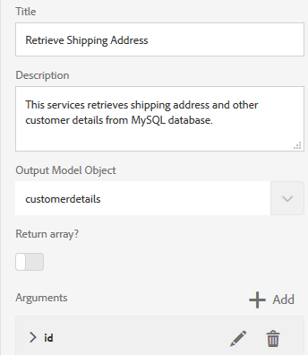

# Självstudiekurs: Skapa formulärdatamodell {#tutorial-create-form-data-model}

Den här självstudiekursen är ett steg i [Skapa ditt första adaptiva formulär](../../forms/using/create-your-first-adaptive-form.md) serie. Adobe rekommenderar att du följer serien i kronologisk ordning för att förstå, utföra och demonstrera det fullständiga självstudiekursen.

## Om självstudiekursen {#about-the-tutorial}

AEM [!DNL Forms] Med dataintegreringsmodulen kan du skapa en formulärdatamodell från olika backend-datakällor som AEM användarprofil, RESTful web services, SOAP-baserade webbtjänster, OData services och relationsdatabaser. Du kan konfigurera datamodellsobjekt och datatjänster i en formulärdatamodell och koppla den till ett anpassat formulär. Anpassningsbara formulärfält är bundna till objektegenskaper för datamodell. Med tjänsterna kan du förifylla det adaptiva formuläret och skriva skickade formulärdata tillbaka till datamodellobjektet.

Mer information om integration av formulärdata och formulärdatamodell finns i [AEM Forms dataintegrering](../../forms/using/data-integration.md).

I den här självstudiekursen får du hjälp med att förbereda, skapa, konfigurera och associera en formulärdatamodell med ett adaptivt formulär. I slutet av den här självstudiekursen kan du:

* [Konfigurera MySQL-databasen som datakälla](#config-database)
* [Skapa formulärdatamodell med MySQL-databas](#create-fdm)
* [Konfigurera formulärdatamodell](#config-fdm)
* [Testa formulärdatamodell](#test-fdm)

Formulärdatamodellen ser ut ungefär så här:

**S.** Konfigurerade datakällor **B.** Datakällscheman **C.** Tillgängliga tjänster **D.** Datamodellsobjekt **E.** Konfigurerade tjänster

## Förutsättningar {#prerequisites}

Kontrollera att du har följande innan du börjar:

* [!DNL MySQL] databas med exempeldata enligt vad som anges i avsnittet Krav i [Skapa ditt första anpassningsbara formulär](../../forms/using/create-your-first-adaptive-form.md)
* OSGi-paket för [!DNL MySQL] JDBC-drivrutin enligt [Paketera JDBC-databasdrivrutinen](/help/sites-developing/jdbc.md#bundling-the-jdbc-database-driver)
* Adaptiv form enligt den första självstudiekursen [Skapa ett anpassat formulär](/help/forms/using/create-adaptive-form.md)

## Steg 1: Konfigurera MySQL-databasen som datakälla {#config-database}

Du kan konfigurera olika typer av datakällor för att skapa en formulärdatamodell. I den här självstudiekursen konfigurerar du MySQL-databasen som du har konfigurerat och fyllt i med exempeldata. Mer information om andra datakällor som stöds och hur du konfigurerar dem finns i [AEM Forms dataintegrering](../../forms/using/data-integration.md).

Gör följande för att konfigurera [!DNL MySQL] databas:

1. Installera JDBC-drivrutin för [!DNL MySQL] databas som ett OSGi-paket:

   1. Ladda ned [!DNL MySQL] JDBC Driver OSGi Bundle från `http://www.java2s.com/ref/jar/download-orgosgiservicejdbc100jar-file.html`. <!-- This URL is an insecure link but using https is not possible -->
   1. Logga in på AEM Author-instansen som administratör och gå till AEM [!DNL Forms] webbkonsolpaket. Standard-URL:en är [https://localhost:4502/system/console/bundles](https://localhost:4502/system/console/bundles).

   1. Välj **[!UICONTROL Install/Update]**. En [!UICONTROL Upload / Install Bundles] dialogruta visas.

   1. Välj **[!UICONTROL Choose File]** för att bläddra och välja [!DNL MySQL] JDBC driver OSGi bundle. Välj **[!UICONTROL Start Bundle]** och **[!UICONTROL Refresh Packages]** och markera **[!UICONTROL Install or Update]**. Se till att [!DNL Oracle Corporation's] JDBC Driver för [!DNL MySQL] är aktivt. Drivrutinen är installerad.

1. Konfigurera [!DNL MySQL] databas som en datakälla:

   1. Gå till AEM webbkonsol på [https://localhost:4502/system/console/configMgr](https://localhost:4502/system/console/configMgr).
   1. Sök **Poolad datakälla för Apache Sling-anslutning** konfiguration. Välj det här alternativet om du vill öppna konfigurationen i redigeringsläge.
   1. Ange följande information i konfigurationsdialogrutan:

      * **Datakällans namn:** Du kan ange vilket namn som helst. Ange till exempel **WeRetailMySQL**.
      * **Egenskapsnamn för DataSource-tjänst**: Ange namnet på den tjänsteegenskap som innehåller namnet på datakällan. Den anges när datakällinstansen registreras som OSGi-tjänst. Till exempel: **datakälla.namn**.
      * **JDBC-drivrutinsklass**: Ange Java™-klassnamn för JDBC-drivrutinen. För [!DNL MySQL] databas anger du **com.mysql.jdbc.Driver**.
      * **URI för JDBC-anslutning**: Ange anslutnings-URL för databasen. För [!DNL MySQL] databas som körs på port 3306 och schema `weretail`är URL:en: `jdbc:mysql://'server':3306/weretail?autoReconnect=true&useUnicode=true&characterEncoding=utf-8`

      >[!NOTE]
      >
      > När [!DNL MySQL] databasen ligger bakom en brandvägg och databasens värdnamn är inte en publik DNS. IP-adressen för databasen måste läggas till i *filen /etc/hosts* på AEM.

      * **Användarnamn:** Databasens användarnamn. Det krävs för att JDBC-drivrutinen ska kunna upprätta en anslutning till databasen.
      * **Lösenord:** Lösenord för databasen. Det krävs för att JDBC-drivrutinen ska kunna upprätta en anslutning till databasen.

      >[!NOTE]
      >
      >AEM Forms stöder inte NT Authentication för [!DNL MySQL]. Gå till AEM webbkonsol på [https://localhost:4502/system/console/configMgr](https://localhost:4502/system/console/configMgr) och söka efter &quot;Apache Sling Connection Pooled Datasource&quot;. Ange värdet för IntegratedSecurity som False för egenskapen JDBC-anslutningsadress (URI) och använd det användarnamn och lösenord som skapas för att ansluta med [!DNL MySQL] databas.

      * **Test on Borgo:** Aktivera **[!UICONTROL Test on Borrow]** alternativ.
      * **Test vid retur:** Aktivera **[!UICONTROL Test on Return]** alternativ.
      * **Valideringsfråga:** Ange en SELECT-fråga (SQL) för att validera anslutningar från poolen. Frågan måste returnera minst en rad. Till exempel: **välj &#42; från kundinformation**.
      * **Transaktionsisolering**: Ange värdet till **READ_COMMTED**.

        Lämna övriga egenskaper som standard [values](https://tomcat.apache.org/tomcat-7.0-doc/jdbc-pool.html) och markera **[!UICONTROL Save]**.

        En konfiguration som liknar följande skapas.

        

## Steg 2: Skapa formulärdatamodell {#create-fdm}

AEM [!DNL Forms] har ett intuitivt användargränssnitt för att [skapa en formulärdatamodell](data-integration.md) från konfigurerade datakällor. Du kan använda flera datakällor i en formulärdatamodell. I det här användningsfallet kan du använda den konfigurerade [!DNL MySQL] datakällan.

Gör så här för att skapa en formulärdatamodell:

1. I AEM författarinstans går du till **[!UICONTROL Forms]** > **[!UICONTROL Data Integrations]**.
1. Välj **[!UICONTROL Create]** > **[!UICONTROL Form Data Model]**.
1. I dialogrutan Skapa formulärdatamodell anger du **name** för formulärdatamodellen. Till exempel: **kundleveransfaktureringsinformation**. Välj **[!UICONTROL Next]**.
1. På skärmen Välj datakälla visas alla konfigurerade datakällor. Välj **WeRetailMySQL** datakälla och markera **[!UICONTROL Create]**.

   

The **kundleveransfaktureringsinformation** formulärdatamodellen skapas.

## Steg 3: Konfigurera formulärdatamodell {#config-fdm}

I konfigurationen av formulärdatamodellen ingår:

* lägga till datamodellobjekt och datatjänster
* konfigurera läs- och skrivtjänster för datamodellobjekt

Gör följande för att konfigurera formulärdatamodellen:

1. Navigera AEM författarinstansen till **[!UICONTROL Forms]** > **[!UICONTROL Data Integrations]**. Standardwebbadressen är [https://localhost:4502/aem/forms.html/content/dam/formsanddocuments-fdm](https://localhost:4502/aem/forms.html/content/dam/formsanddocuments-fdm).
1. The **kundleveransfaktureringsinformation** formulärdatamodellen som du skapade tidigare visas här. Öppna den i redigeringsläge.

   Den valda datakällan **WeRetailMySQL** har konfigurerats i formulärdatamodellen.

   

1. Expandera trädet för datakällan WeRailMySQL. Välj följande datamodellsobjekt och -tjänster från **weretail** > **kundinformation** schema så att du kan skapa datamodell:

   * **Datamodellsobjekt**:

      * id
      * name
      * shippingAddress
      * stad
      * läge
      * Postnummer

   * **Tjänster:**

      * få
      * uppdatera

   Välj **Lägg till markerade** om du vill lägga till markerade datamodellsobjekt och tjänster i formulärdatamodellen.

   

   >[!NOTE]
   >
   >Standardtjänsterna för hämtning, uppdatering och infogning av JDBC-datakällor levereras med formulärdatamodell direkt.

1. Konfigurera läs- och skrivtjänster för datamodellobjektet.

   1. Välj **kundinformation** datamodellsobjekt och markera **[!UICONTROL Edit Properties]**.
   1. Välj **[!UICONTROL get]** från listrutan Lästjänst. The **id** -argument, som är primärnyckeln i datamodellobjektet för kundinformation, läggs till automatiskt. Välj  och konfigurera argumentet enligt följande.

      

   1. På samma sätt kan du markera **[!UICONTROL update]** som skrivtjänst. The **kundinformation** -objektet läggs automatiskt till som ett argument. Argumentet är konfigurerat enligt följande.

      

      Lägg till och konfigurera **id** argumentet enligt följande.

      

   1. Välj **[!UICONTROL Done]** om du vill spara datamodellens objektegenskaper. Välj **[!UICONTROL Save]** sedan för att spara formulärdatamodellen.

      Tjänsterna **[!UICONTROL get]** och **[!UICONTROL update]** läggs till som standardtjänster för datamodellsobjektet.

      

1. Gå till **[!UICONTROL Services]** och konfigurera **[!UICONTROL get]** och **[!UICONTROL update]** tjänster.

   1. Välj **[!UICONTROL get]** service och välj **[!UICONTROL Edit Properties]**. Dialogrutan Egenskaper öppnas.
   1. Ange följande i dialogrutan Redigera egenskaper:

      * **Titel**: Ange tjänstens titel. Exempel: Hämta leveransadress.
      * **Beskrivning**: Ange en beskrivning som innehåller detaljerad funktionalitet för tjänsten. Till exempel:

        Den här tjänsten hämtar leveransadressen och annan kundinformation från [!DNL MySQL] databas

      * **Objekt för utdatamodell**: Välj schema som innehåller kunddata. Till exempel:

        kundinformationsschema

      * **Returnera matris**: Inaktivera **Returnera matris** alternativ.
      * **Argument:** Välj argument med namnet **ID.**

      Välj **[!UICONTROL Done]**. Tjänsten för att hämta kundinformation från MySQL-databasen har konfigurerats.

      

   1. Välj **[!UICONTROL update]** service och välj **[!UICONTROL Edit Properties]**. Dialogrutan Egenskaper öppnas.

   1. Ange följande i dialogrutan [!UICONTROL Edit Properties] dialog:

      * **Titel**: Ange tjänstens titel. Exempel: Uppdatera leveransadress.
      * **Beskrivning**: Ange en beskrivning som innehåller detaljerad funktionalitet för tjänsten. Till exempel:

        Den här tjänsten uppdaterar leveransadress och relaterade fält i MySQL-databasen

      * **Indatamodellsobjekt**: Välj schema som innehåller kunddata. Till exempel:

        kundinformationsschema

      * **Utdatatyp**: Välj **BOOLEAN**.

      * **Argument**: Välj argumentnamn **ID** och **kundinformation**.

      Välj **[!UICONTROL Done]**. The **[!UICONTROL update]** tjänst för att uppdatera kundinformation i [!DNL MySQL] databasen är konfigurerad.

      

Datamodellsobjektet och -tjänsterna i formulärdatamodellen har konfigurerats. Nu kan du testa formulärdatamodellen.

## Steg 4: Testa formulärdatamodell {#test-fdm}

Du kan testa datamodellsobjektet och datatjänsterna för att verifiera att formulärdatamodellen är korrekt konfigurerad.

Gör följande för att köra testet:

1. Gå till **[!UICONTROL Model]** väljer du **kundinformation** datamodellsobjekt, och markera **[!UICONTROL Test Model Object]**.
1. I [!UICONTROL Test Model/Service] fönster, markera **[!UICONTROL Read model object]** från **[!UICONTROL Select Model/Service]** nedrullningsbar meny.
1. I **kundinformation** anger du ett värde för **id** argument i den konfigurerade [!DNL MySQL] databas och markera **[!UICONTROL Test]**.

   Kundinformationen som är kopplad till det angivna ID:t hämtas och visas i **[!UICONTROL Output]** som visas nedan.

   

1. På samma sätt kan du testa Write-modellobjektet och tjänsterna.

   I följande exempel uppdaterar uppdateringstjänsten adressinformationen för ID 7102715 i databasen.

   

   Om du testar läsmodelltjänsten igen för ID 7107215 hämtas och visas den uppdaterade kundinformationen enligt nedan.

   
