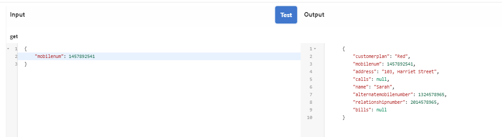

# Självstudiekurs:Skapa formulärdatamodell{#tutorial-create-form-data-model}

Den här självstudiekursen är ett steg i [Skapa din första interaktiva kommunikationsserie](/help/forms/using/create-your-first-interactive-communication.md) . Vi rekommenderar att du följer serien i kronologisk ordning för att förstå, utföra och demonstrera det fullständiga exemplet på självstudiekurser.

## Om självstudiekursen {#about-the-tutorial}

Med dataintegreringsmodulen för AEM Forms kan du skapa en formulärdatamodell från olika backend-datakällor, till exempel AEM-användarprofil, RESTful web services, SOAP-baserade webbtjänster, OData services och relationsdatabaser. Du kan konfigurera datamodellsobjekt och datatjänster i en formulärdatamodell och koppla den till ett anpassat formulär. Anpassningsbara formulärfält är bundna till objektegenskaper för datamodell. Med tjänsterna kan du förifylla det anpassningsbara formuläret och skriva skickade formulärdata tillbaka till datamodellobjektet.

Mer information om integrering av formulärdata och formulärdatamodell finns i [AEM Forms-dataintegrering](https://helpx.adobe.com/experience-manager/6-3/forms/using/data-integration.html).

I den här självstudiekursen får du hjälp med att förbereda, skapa, konfigurera och koppla en formulärdatamodell till en interaktiv kommunikation. I slutet av den här självstudiekursen kan du:

* [Konfigurera databasen](../../forms/using/create-form-data-model0.md#step-set-up-the-database)
* [Konfigurera MySQL-databasen som datakälla](../../forms/using/create-form-data-model0.md#step-configure-mysql-database-as-data-source)
* [Skapa formulärdatamodell](../../forms/using/create-form-data-model0.md#step-create-form-data-model)
* [Konfigurera formulärdatamodell](../../forms/using/create-form-data-model0.md#step-configure-form-data-model)
* [Testa formulärdatamodell](../../forms/using/create-form-data-model0.md#step-test-form-data-model-and-services)

Formulärdatamodellen ser ut ungefär så här:

**********S. Konfigurerade datakällor** B. Datakällscheman **C.** Tillgängliga tjänster **D. Datamodellsobjekt** E. Konfigurerade tjänster

## Förutsättningar {#prerequisites}

Kontrollera att du har följande innan du börjar:

* MySQL-databas med exempeldata enligt avsnittet [Konfigurera databasen](../../forms/using/create-form-data-model0.md#step-set-up-the-database) .
* OSGi-paket för MySQL JDBC-drivrutin enligt beskrivningen i [Paketera JDBC-databasdrivrutinen](https://helpx.adobe.com/experience-manager/6-3/help/sites-developing/jdbc.html#bundling-the-jdbc-database-driver)

## Steg 1: Konfigurera databasen {#step-set-up-the-database}

En databas är nödvändig för att skapa en interaktiv kommunikation. I den här självstudiekursen används en databas för att visa formulärdatamodellens och beständighetsfunktionerna i interaktiv kommunikation. Konfigurera en databas som innehåller kundregister, räkningar och samtalstabeller.
Följande bild visar exempeldata för kundtabellen:

Samtalstabellen innehåller samtalsinformation som samtalsdatum, samtalstid, samtalsnummer, samtalslängd och samtalsavgifter. Kundregistret är länkat till samtalstabellen med hjälp av fältet Mobilnummer (mobiltelefoni). För varje mobilnummer i kundregistret finns det flera poster i samtalstabellen. Du kan till exempel hämta samtalsinformationen för **mobilnumret 1457892541** genom att referera till samtalstabellen.

Fakturaregistret innehåller fakturainformation som faktureringsdatum, faktureringsperiod, månadsavgifter och samtalsavgifter. Kundregistret är länkat till räkningstabellen med hjälp av fältet Faktureringsplan. Det finns en plan som är associerad med varje kund i kundregistret. Fakturaregistret innehåller prisinformation för alla befintliga planer. Du kan till exempel hämta avtalsinformationen för **Sarah** från kundregistret och använda dessa detaljer för att hämta prisinformation från fakturatabellen.

## Steg 2: Konfigurera MySQL-databasen som datakälla {#step-configure-mysql-database-as-data-source}

Du kan konfigurera olika typer av datakällor för att skapa en formulärdatamodell. I den här självstudiekursen konfigurerar du MySQL-databasen som är konfigurerad och ifylld med exempeldata. Information om andra datakällor som stöds och hur du konfigurerar dem finns i [AEM Forms-dataintegrering](https://helpx.adobe.com/experience-manager/6-3/forms/using/data-integration.html).

Gör följande för att konfigurera MySQL-databasen:

1. Installera JDBC-drivrutin för MySQL-databas som ett OSGi-paket:

   1. Logga in på AEM Forms Author Instance som administratör och gå till AEM-webbkonsolpaket. Standardwebbadressen är [https://localhost:4502/system/console/bundles](https://localhost:4502/system/console/bundles).
   1. Tryck på **Installera/Uppdatera**. Dialogrutan **Överför/Installera programpaket** visas.

   1. Tryck på **Välj fil** för att bläddra och välja OSGi-paketet för MySQL JDBC-drivrutinen. Välj **Starta paket** och **uppdatera paket** och tryck sedan på **Installera** eller **Uppdatera**. Kontrollera att Oracle Corporations JDBC-drivrutin för MySQL är aktiv. Drivrutinen är installerad.

1. Konfigurera MySQL-databasen som en datakälla:

   1. Gå till AEM-webbkonsolen på [https://localhost:4502/system/console/configMgr](https://localhost:4502/system/console/configMgr).
   1. Leta reda på konfigurationen **för poolad DataSource** för Apache Sling-anslutningen. Tryck för att öppna konfigurationen i redigeringsläge.
   1. Ange följande information i konfigurationsdialogrutan:

      * **** Datakällans namn: Du kan ange vilket namn som helst. Ange till exempel **MySQL**.

      * **Egenskapsnamn** för DataSource-tjänst: Ange namnet på den tjänsteegenskap som innehåller DataSource-namnet. Den anges när datakällinstansen registreras som OSGi-tjänst. Exempel: **datasource.name**.

      * **JDBC-drivrutinsklass**: Ange Java-klassnamnet för JDBC-drivrutinen. För MySQL-databasen anger du **com.mysql.jdbc.Driver**.

      * **JDBC-anslutnings-URI**: Ange anslutnings-URL för databasen. För MySQL-databaser som körs på port 3306 och schematabell är URL:en: `jdbc:mysql://[server]:3306/teleca?autoReconnect=true&useUnicode=true&characterEncoding=utf-8`
      * **** Användarnamn: Användarnamn för databasen. Det krävs för att JDBC-drivrutinen ska kunna upprätta en anslutning till databasen.
      * **** Lösenord: Lösenord för databasen. Det krävs för att JDBC-drivrutinen ska kunna upprätta en anslutning till databasen.
      * **** Test on Borgo: Aktivera alternativet **Testa vid köp** .

      * **** Test vid retur: Aktivera alternativet **Test on Return** .

      * **** Valideringsfråga: Ange en SELECT-fråga (SQL) för att validera anslutningar från poolen. Frågan måste returnera minst en rad. Välj till exempel *** från kund**.

      * **Transaktionsisolering**: Ange värdet **READ_COMMTED**.
   Lämna övriga egenskaper med standard [värden](https://tomcat.apache.org/tomcat-7.0-doc/jdbc-pool.html) och tryck på **Spara**.

   En konfiguration som liknar följande skapas.

   

## Steg 3:Skapa formulärdatamodell {#step-create-form-data-model}

AEM Forms ger ett intuitivt användargränssnitt för att [skapa en](https://helpx.adobe.com/experience-manager/6-3/forms/using/data-integration.html#main-pars_header_1524967585)formulärdatamodell från konfigurerade datakällor. Du kan använda flera datakällor i en formulärdatamodell. I den här självstudiekursen använder du MySQL som datakälla.

Gör följande för att skapa formulärdatamodell:

1. I AEM-författarinstansen går du till **Formulär** > **Dataintegreringar**.
1. Tryck på **Skapa** > **Formulärdatamodell**.
1. I guiden Skapa formulärdatamodell anger du ett **namn** för formulärdatamodellen. Till exempel **FDM_Create_First_IC**. Tryck på **Nästa**.
1. På skärmen Välj datakälla visas alla konfigurerade datakällor. Välj **MySQL** -datakälla och tryck på **Skapa**.

   

1. Klicka på **Klar**. Formulärdatamodellen **FDM_Create_First_IC** skapas.

## Steg 4: Konfigurera formulärdatamodell {#step-configure-form-data-model}

I konfigurationen av formulärdatamodellen ingår:

* [lägga till datamodellsobjekt och -tjänster](#add-data-model-objects-and-services)
* [skapa beräknade underordnade egenskaper för datamodellobjekt](#create-computed-child-properties-for-data-model-object)
* [lägga till associationer mellan datamodellobjekt](#add-associations-between-data-model-objects)
* [redigera objektegenskaper för datamodell](#edit-data-model-object-properties)
* [konfigurera tjänster för datamodellobjekt](#configure-services)

### Lägga till datamodellsobjekt och -tjänster {#add-data-model-objects-and-services}

1. På AEM-författarinstansen går du till **Formulär** > **Dataintegreringar**. Standardwebbadressen är [https://localhost:4502/aem/forms.html/content/dam/formsanddocuments-fdm](https://localhost:4502/aem/forms.html/content/dam/formsanddocuments-fdm).
1. Den **formulärdatamodell för FDM_Create_First_IC** som du skapade tidigare listas här. Markera den och tryck på **Redigera**.

   Den valda datakällan **MySQL** visas i rutan **Datakällor** .

   

1. Expandera **datakällträdet för MySQL** . Välj följande datamodellsobjekt och -tjänster från **telecaschemat** :

   * **Datamodellsobjekt**:

      * växlar
      * samtal
      * kund
   * **Tjänster:**

      * get
      * update
   Tryck på **Lägg till markerade** för att lägga till markerade datamodellsobjekt och tjänster i formulärdatamodellen.

   

   De räkningar, anrop och kunddatamodellsobjekt visas i den högra rutan på fliken **Modell** . Hämtnings- och uppdateringstjänsterna visas på fliken **Tjänster** .

   

### Skapa beräknade underordnade egenskaper för datamodellobjekt {#create-computed-child-properties-for-data-model-object}

En beräknad egenskap är den vars värde beräknas baserat på en regel eller ett uttryck. Med hjälp av en regel kan du ange värdet för en beräknad egenskap till en litteral sträng, ett tal, resultatet av ett matematiskt uttryck eller värdet för en annan egenskap i formulärdatamodellen.

Baserat på användningsfallet skapar du den underordnade beräknade egenskapen **usagecharges** i datamodellobjektet för **räkningar** med följande matematiska uttryck:

* Användningsavgifter = samtalsavgifter + konferenssamtalsavgifter + SMS-avgifter + mobilinternetavgifter + roaming nationellt + roaming internationellt + VAS (alla dessa egenskaper finns i räkningens datamodellsobjekt)Mer information om **nyttaavgifter** för underordnad beräknad egenskap finns i [Planera interaktiv kommunikation](/help/forms/using/planning-interactive-communications.md).

Utför följande steg för att skapa beräknade underordnade egenskaper för datamodellobjektet för räkningar:

1. Markera kryssrutan högst upp i datamodellsobjektet för **räkningar** för att markera den och tryck sedan på **Skapa underordnad egenskap**.
1. I rutan **Skapa underordnad egenskap** :

   1. Ange **användningskartor** som namn på den underordnade egenskapen.
   1. Aktivera **beräknat**.
   1. Välj **Float** som typ och tryck på **Done** för att lägga till egenskapen child i **datamodellsobjektet** .
   

1. Tryck på **Redigera regel** för att öppna regelredigeraren.
1. Tryck på **Skapa**. Regelfönstret **Ange värde** öppnas.
1. I listrutan Välj alternativ väljer du **Matematiskt uttryck**.

   

1. I det matematiska uttrycket väljer du **callCharts** och **sammandragningar** som första respektive andra objekt. Välj **plus** som operator. Tryck i det matematiska uttrycket och tryck på **Extend Expression** om du vill lägga till **smscharges**, **internetCharts**, **roaming national**, **roamingInl****** och¥vas¥-objekt i uttrycket.

   Följande bild visar det matematiska uttrycket i regelredigeraren:

   

1. Tryck på **Klar**. Regeln skapas i regelredigeraren.
1. Tryck på **Stäng** för att stänga regelredigeringsfönstret.

### Lägga till associationer mellan datamodellsobjekt {#add-associations-between-data-model-objects}

När datamodellsobjekten har definierats kan du skapa associationer mellan dem. Associationen kan vara en-till-en eller en-till-många. Det kan till exempel finnas flera beroenden som är kopplade till en medarbetare. Den kallas en-till-många-association och avbildas med 1:n på linjen som förbinder associerade datamodellsobjekt. Om en association returnerar ett unikt medarbetarnamn för ett givet medarbetar-ID kallas den en-till-en-association.

När du lägger till associerade datamodellobjekt i en datakälla i en formulärdatamodell behålls deras associationer och visas som kopplade med pilrader.

Baserat på användningsfallet skapar du följande associationer mellan datamodellsobjekten:

| Association | Datamodellsobjekt |
|---|---|
| 1:n | kund:samtal (flera samtal kan kopplas till en kund i en månadsfaktura) |
| 1:1 | kund:växlar (en faktura är kopplad till en kund för en viss månad) |

Utför följande steg för att skapa associationer mellan datamodellsobjekt:

1. Markera kryssrutan högst upp i **kundens** datamodellobjekt för att markera den och tryck sedan på **Lägg till association**. Egenskapspanelen **Lägg till association** öppnas.
1. I rutan **Lägg till association** :

   * Ange en titel för associationen. Det är ett valfritt fält.
   * Välj **Ett till många** i listrutan **Typ** .

   * Välj **anrop** i listrutan **Modellobjekt** .

   * Välj **Hämta** i listrutan **Tjänst** .

   * Tryck på **Lägg** till för att länka **kundens** datamodellobjekt till **anropa** datamodellsobjekt med hjälp av en egenskap. Baserat på användningsfallet måste anropsdatamodellsobjektet länkas till mobilnummeregenskapen i kunddatamodellsobjektet. Dialogrutan **Lägg till argument** öppnas.
   

1. I dialogrutan **Lägg till argument** :

   * Välj **mobiltelefon** i listrutan **Namn** . Egenskapen för mobilnummer är en vanlig egenskap som är tillgänglig i kunden och anropar datamodellsobjekt. Det innebär att det används för att skapa en association mellan kund- och anropsdatamodellsobjekt.
För varje mobilnummer som är tillgängligt i kunddatamodellobjektet finns det flera samtalsposter tillgängliga i samtalstabellen.

   * Ange en valfri titel och beskrivning för argumentet.
   * Välj **kund** i listrutan **Bindning till** .

   * Välj **mobilenum** i listrutan **Bindningsvärde** .

   * Tryck på **Lägg till**.
   

   Egenskapen mobilenum visas i avsnittet **Arguments** .

   

1. Tryck på **Klar** för att skapa en 1:n-association mellan kund- och anropsdatamodellsobjekt.

   När du har skapat en association mellan kund- och anropsdatamodellsobjekt skapar du en 1:1-association mellan kunden och faktureringsdatamodellsobjekten.

1. Markera kryssrutan högst upp i **kundens** datamodellobjekt för att markera den och tryck sedan på **Lägg till association**. Egenskapspanelen **Lägg till association** öppnas.
1. I rutan **Lägg till association** :

   * Ange en titel för associationen. Det är ett valfritt fält.
   * Välj **Ett till ett** i listrutan **Typ** .

   * Välj **räkningar** i listrutan **Modellobjekt** .

   * Välj **Hämta** i listrutan **Tjänst** . Egenskapen **faktureringsplan** , som är den primära nyckeln för räkningstabellen, är redan tillgänglig i avsnittet **Argument** .
Fakturorna och modellobjekten för kunddata länkas med egenskaperna för faktureringsplanen (räkningarna) respektive kundplanen (kunden). Skapa en bindning mellan de här egenskaperna för att hämta avtalsinformationen för alla kunder som är tillgängliga i MySQL-databasen.

   * Välj **kund** i listrutan **Bindning till** .

   * Välj **kundplan** i listrutan **Bindningsvärde** .

   * Tryck på **Klar** för att skapa en bindning mellan egenskaperna för faktureringsplanen och kundplanen.
   

   I följande bild visas associationerna mellan datamodellsobjekten och egenskaperna som används för att skapa associationer mellan dem:

   

### Redigera objektegenskaper för datamodell {#edit-data-model-object-properties}

När du har skapat associationer mellan kunden och andra datamodellsobjekt kan du redigera kundegenskaperna för att definiera den egenskap som data hämtas från datamodellsobjektet. Baserat på användningsfallet används mobilnummer som egenskap för att hämta data från kunddatamodellobjektet.

1. Markera kryssrutan högst upp i **kundens** datamodellobjekt för att markera den och tryck sedan på **Redigera egenskaper**. Panelen **Redigera egenskaper** öppnas.
1. Ange **kund** som **modellobjekt** på översta nivån.
1. Välj **Hämta** i listrutan **Lästjänst** .
1. I avsnittet **Argument** :

   * Välj **Begär attribut** i listrutan **Bindning till** .

   * Ange **mobilenum** som bindningsvärde.

1. Välj **uppdatering** i listrutan **Skriva** tjänst.
1. I avsnittet **Argument** :

   * För **mobil** egenskap väljer du **kund** i listrutan **Bindning till** .

   * Välj **mobilenum** i listrutan **Bindningsvärde** .

1. Tryck på **Klar** för att spara egenskaperna.

   

1. Markera kryssrutan högst upp i **anropet** av datamodellobjektet för att markera det och tryck sedan på **Redigera egenskaper**. Panelen **Redigera egenskaper** öppnas.
1. Inaktivera objektet **för** översta nivåmodellen för **anrop** av datamodellobjekt.
1. Tryck på **Klar**.

   Upprepa steg 8-10 för att konfigurera egenskaperna för datamodellobjektet **för räkningar** .

### Konfigurera tjänster {#configure-services}

1. Gå till fliken **Tjänster** .
1. Välj **tjänsten get** och tryck på **Redigera egenskaper**. Panelen **Redigera egenskaper** öppnas.
1. I rutan **Redigera egenskaper** :

   * Ange en valfri titel och beskrivning.
   * Välj **kund** i listrutan **Utdatamodellsobjekt** .

   * Tryck på **Klar** för att spara egenskaperna.
   

1. Välj **uppdateringstjänsten** och tryck på **Redigera egenskaper**. Panelen **Redigera egenskaper** öppnas.
1. I rutan **Redigera egenskaper** :

   * Ange en valfri titel och beskrivning.
   * Välj **kund** i listrutan **Indatamodellsobjekt** .

   * Tryck på **Klar**.
   * Tryck på **Spara** för att spara formulärdatamodellen.
   

## Steg 5: Testa formulärdatamodell och -tjänster {#step-test-form-data-model-and-services}

Du kan testa datamodellsobjektet och datatjänsterna för att verifiera att formulärdatamodellen är korrekt konfigurerad.

Gör följande för att köra testet:

1. Gå till fliken **Modell** , markera **kunddatamodellsobjektet** och tryck på **Testmodellobjekt**.
1. I fönstret **Testa formulärdatamodell** väljer du **Läs modellobjekt** i listrutan **Välj modell/tjänst** .
1. I avsnittet **Indata** anger du ett värde för egenskapen **mobilenum** som finns i den konfigurerade MySQL-databasen och trycker på **Test**.

   Kundinformationen som är associerad med den angivna mobilegenskapen hämtas och visas i utdataavsnittet enligt nedan. Stäng dialogrutan.

   

1. Gå till fliken **Tjänster** .
1. Välj tjänsten **get** och tryck på **Test Service.**
1. I avsnittet **Indata** anger du ett värde för egenskapen **mobilenum** som finns i den konfigurerade MySQL-databasen och trycker på **Test**.

   Kundinformationen som är associerad med den angivna mobilegenskapen hämtas och visas i utdataavsnittet enligt nedan. Stäng dialogrutan.

   

### Redigera och spara exempeldata {#edit-and-save-sample-data}

Med formulärdatamodellredigeraren kan du generera exempeldata för alla datamodellsobjektsegenskaper, inklusive beräknade egenskaper, i en formulärdatamodell. Det är en uppsättning slumpmässiga värden som överensstämmer med den datatyp som konfigurerats för varje egenskap. Du kan också redigera och spara data, som behålls även om du genererar om exempeldata.

Gör följande för att generera, redigera och spara exempeldata:

1. Tryck på **Redigera exempeldata** på formulärdatamodellsidan. Den genererar och visar exempeldata i fönstret Redigera exempeldata.

   

1. I fönstret **Redigera exempeldata** redigerar du data efter behov och trycker på **Spara**. Stäng fönstret.

