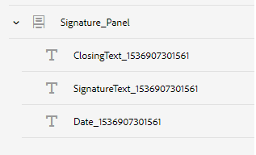

# Skapa en interaktiv kommunikation{#create-an-interactive-communication}

## Översikt {#overview}

Interactive Communications centraliserar och hanterar framtagning, sammanställning och leverans av personaliserade och interaktiva korrespondenser. Använd utskrift som huvudkanal för webben och minimera arbetet med att duplicera webbutdata i den interaktiva kommunikationen.

### Förutsättningar {#prerequisites}

Nedan följer några förutsättningar för att skapa en interaktiv kommunikation:

* Skapa en [formulärdatamodell](/help/forms/using/data-integration.md) som innehåller testdata eller med en faktisk datakälla, till exempel en instans av Microsoft® Dynamics.
* Kontrollera att du har [dokumentfragmenten](/help/forms/using/document-fragments.md).
* Kontrollera att du har [mallar för utskrift och webbkanal](/help/forms/using/web-channel-print-channel.md).
* Kontrollera att du har rätt [tema](/help/forms/using/themes.md) för webbkanalen.

## Skapa interaktiv kommunikation {#createic}

1. Logga in på AEM-författarinstansen och gå till **[!UICONTROL Adobe Experience Manager]** > **[!UICONTROL Formulär]** > **[!UICONTROL Formulär och dokument]**.
1. Tryck på **[!UICONTROL Skapa]** och välj **[!UICONTROL Interaktiv kommunikation]**. Sidan Skapa interaktiv kommunikation visas.

   

1. Ange följande information. :

   * **[!UICONTROL Titel]**: Ange titeln på den interaktiva kommunikationen.
   * **[!UICONTROL Namn]**: Namnet på den interaktiva kommunikationen hämtas från den titel du anger. Redigera den om det behövs.
   * **[!UICONTROL Beskrivning]**: Ange en beskrivning av den interaktiva kommunikationen.
   * **[!UICONTROL Formulärdatamodell]**: Bläddra och välj formulärdatamodellen. Mer information om formulärdatamodell finns i [AEM Forms-dataintegrering](/help/forms/using/data-integration.md).

   * **[!UICONTROL Förifyllningstjänst]**: Välj förifyllningstjänsten för att hämta data och fylla i interaktiv kommunikation i förväg.
   * **[!UICONTROL Typ]** av efterbearbetning: Du kan välja arbetsflöde för AEM eller Forms som ska utlösas när den interaktiva kommunikationen skickas. Välj vilken typ av arbetsflöde som ska utlösas.

   * **[!UICONTROL Bokför process]**: Välj namnet på arbetsflödet som ska utlösas. När du väljer AEM-arbetsflöde anger du sökväg till bifogad fil, layoutsökväg, PDF-sökväg, sökväg till utskriftsdata och webbdatasökväg.
   * **[!UICONTROL Taggar]**: Markera taggarna som ska användas i den interaktiva kommunikationen. Du kan också skriva in ett nytt/anpassat taggnamn och trycka på Retur för att skapa det.
   * **[!UICONTROL Författare]**: Författarnamnet hämtas automatiskt från den inloggade användarens användarnamn.
   * **** Publiceringsdatum: Ange det datum då den interaktiva kommunikationen ska publiceras.
   * **[!UICONTROL Avpubliceringsdatum]**: Ange det datum då den interaktiva kommunikationen ska avpubliceras.

1. Tryck på **[!UICONTROL Nästa]**. Skärmen där du anger utskrifts- och webbkanalsinformation visas.
1. Ange följande:

   * **[!UICONTROL Skriv ut]**: Välj det här alternativet om du vill generera tryckkanalen för interaktiv kommunikation.
   * **[!UICONTROL Utskriftsmall]**: Bläddra och välj en XDP-fil som utskriftsmall.
   * **[!UICONTROL Webb]**: Välj det här alternativet om du vill generera webbkanalen eller responsiva utdata för interaktiv kommunikation.
   * **[!UICONTROL Webbmall]** för interaktiv kommunikation: Bläddra och välj webbmallen.
   * **[!UICONTROL Tema]** och **[!UICONTROL välj tema]**: Bläddra och välj temat för att utforma webbkanalen för den interaktiva kommunikationen. Mer information finns i [Teman i AEM-formulär](/help/forms/using/themes.md).

   * **[!UICONTROL Använd Skriv ut som mallsida för webbkanal]**: Välj det här alternativet om du vill skapa webbkanalen synkroniserad med utskriftskanalen. Om du använder utskriftskanalen som huvudkanal för webbkanalen kan du säkerställa att innehållet och databindningen för webbkanalen hämtas från utskriftskanalen och att ändringarna som görs i utskriftskanalen återspeglas i webbkanalen när du trycker på Synkronisera. Författarna kan dock bryta arvet för specifika komponenter i webbkanalen efter behov. Mer information finns i [Synkronisera webbkanal med skrivarkanal](../../forms/using/create-interactive-communication.md#synchronize).
Om du markerar alternativet **[!UICONTROL Använd Skriv ut som mall för webbkanal]** kan du välja något av följande lägen för att generera webbkanalen:

      * **[!UICONTROL Automatisk layout]**: Välj det här läget om du automatiskt vill generera platshållare, innehåll och databindning för webbkanalen från utskriftskanalen.
      * **[!UICONTROL Ordna** manuellt: Välj det här läget om du manuellt vill markera och lägga till Print channel-element i webbkanalen med huvudinnehållet som finns på fliken **[!UICONTROL Datakällor]** . Mer information finns i [Markera Skriv ut kanalelement för att skapa webbkanalsinnehåll](#selectprintchannelelements).
   Mer information om utskriftskanaler och webbkanaler finns i [Skriva ut kanal och webbkanal](/help/forms/using/web-channel-print-channel.md).

1. Tryck på **[!UICONTROL Skapa]**. Interaktiv kommunikation skapas och en varningsruta visas. Tryck på **[!UICONTROL Redigera]** för att börja skapa innehållet i den interaktiva kommunikationen enligt [Lägg till innehåll med hjälp av användargränssnittet](#step2)för utveckling av interaktiv kommunikation. Du kan också trycka på **[!UICONTROL Klar]** och välja att redigera den interaktiva kommunikationen senare.

## Lägga till innehåll i interaktiv kommunikation {#step2}

När du har skapat en interaktiv kommunikation kan du använda redigeringsgränssnittet för interaktiv kommunikation för att skapa dess innehåll.

Mer information om gränssnittet för utveckling av interaktiv kommunikation finns i Introduktion [till redigering](/help/forms/using/introduction-interactive-communication-authoring.md)av interaktiv kommunikation.

1. Utvecklingsgränssnittet för interaktiv kommunikation startas när du trycker på Redigera enligt [Skapa interaktiv kommunikation](#createic). Du kan också navigera till en befintlig Interactive Communication-resurs på AEM, markera den och trycka på **[!UICONTROL Redigera]** för att starta redigeringsgränssnittet för interaktiv kommunikation.

   Som standard visas den tryckta kanalen i den interaktiva kommunikationen, om inte den interaktiva kommunikationen bara är för webbkanaler. I utskriftskanalen i den interaktiva kommunikationen visas målområdena, som de är tillgängliga i den valda XDP/utskriftskanalmallen. I dessa målområden och fält kan du lägga till komponenter eller resurser.

1. Markera kanalen Skriv ut och välj fliken **[!UICONTROL Komponenter]** . Följande komponenter är tillgängliga i utskriftskanalen:

   | **Komponent** | **Funktionalitet** |
   |---|---|
   | Diagram | Lägger till ett diagram som du kan använda i interaktiv kommunikation för visuell representation av tvådimensionella data som hämtats från en formulärdatamodellsamling. Mer information finns i [Använda diagram i interaktiv kommunikation](/help/forms/using/chart-component-interactive-communications.md). |
   | Dokumentfragment | Gör att du kan lägga till en återanvändbar komponent, som text, lista eller villkor, i en interaktiv kommunikation. Komponenten som läggs till kan antingen vara modellbaserad för formulärdata eller utan en formulärdatamodell. |
   | Bild | Gör att du kan infoga en bild. |

   Dra och släpp komponenterna i din interaktiva kommunikation och konfigurera dem efter behov.

   Du kan också använda åtgärderna ångra och gör om när du skapar en interaktiv kommunikation för både utskrifts- och webbkanaler.

   Använd ångra-åtgärden för att ta bort den senast utförda åtgärden och gör om-åtgärden för att ta med den borttagna åtgärden igen. Om du t.ex. har infogat en bild eller skapat en databindning i ett interaktivt meddelande och behöver ta bort den ska du använda åtgärden ångra.

   

   Alternativen Ångra och Gör om visas i verktygsfältet för redigeringsgränssnittets sida. Alternativet Ångra visas bara efter att en åtgärd har utförts. Alternativet gör om visas bara i verktygsfältet på sidan när du har utfört en ångra-åtgärd. Dessa åtgärder återställs när sidan uppdateras.

1. När utskriftskanalen är markerad går du till fliken **[!UICONTROL Resurser]** och använder filtret för att visa endast de resurser som du vill se.

   Med hjälp av Assets-webbläsaren kan du även dra och släppa resurser direkt till målområdena för interaktiv kommunikation.

   

1. Dra och släpp dokumentfragmenten i den interaktiva kommunikationen. Här följer de typer av dokumentfragment som du kan använda i tryckkanalen i den interaktiva kommunikationen.

<table>
 <tbody>
  <tr>
   <td><strong>Dokumentfragmenttyp</strong></td>
   <td><strong>Exempelsyfte</strong></td>
  </tr>
  <tr>
   <td><a href="/help/forms/using/texts-interactive-communications.md" target="_blank">Text</a></td>
   <td>Text för att lägga till adress, mottagarens e-postadress och brödtext i brevet </td>
  </tr>
  <tr>
   <td><a href="/help/forms/using/conditions-interactive-communications.md" target="_blank">Villkor</a></td>
   <td>Villkor för att lägga till lämplig rubrikbild i kommunikationen baserat på typen av princip: Standard eller Premium.   </td>
  </tr>
  <tr>
   <td>Lista</td>
   <td>Grupp med dokumentfragment, inklusive text, villkor, andra listor och bilder.   </td>
  </tr>
 </tbody>
</table>

Du kan också ersätta bindningen mellan ett målområde och ett dokumentfragment genom att släppa det nya fragmentet i målområdet med hjälp av fliken **Resurser** . Målområdets blå färgskuggning när fragmentet dras anger att dokumentfragmentet kan släppas till målområdet.

Mer information om dokumentfragment finns i [Dokumentfragment](/help/forms/using/document-fragments.md).

Med hjälp av redigeringsgränssnittet kan du skilja mellan obundna och bundna fält och variabler i en interaktiv kommunikation. Gränssnittet markerar de obundna fälten och variablerna med en orange ram.

När du håller muspekaren över dessa element visas dessutom ett verktygstips med meddelandet Fält (obundet) eller Variabel (obundet).

En obunden variabel som används i ett dokumentfragment kanske inte visas i redigeringsgränssnittet. Det kan inträffa på grund av en textbunden regel i ett dokumentfragment eller om ett villkorsfragment används. I sådana fall visas ett verktygstips, som är markerat med blått, som en del av dokumentfragmentet. Verktygstipset visar antalet obundna variabler som används i ett dokumentfragment.

Tryck på dokumentfragmentet, tryck på  (Configure) och sedan på **[!UICONTROL Properties]** från sidan för Interactive Communication. I avsnittet **[!UICONTROL Variabler och Datamodellobjekt]** listas variablerna, inklusive de dolda variablerna och datamodellsobjekten som används i dokumentfragmenten. Använd  (Redigera) bredvid varje datamodellsobjekt eller variabel för att redigera egenskaperna.

1. Om du vill ställa in bindning för variabler trycker du på en variabel och väljer  (Configure). Sedan ställer du in bindningsegenskaperna på egenskapspanelen i sidlisten.

   * **Ingen**: Agenten fyller i variabelns värde.
   * **Textfragment**: Om du väljer det här alternativet kan du bläddra och markera ett textdokumentfragment vars innehåll återges i fältet. Endast textdokumentfragment kan bindas till variabler som inte har några variabler inuti.
   * **Datamodellobjekt**: Välj en formulärdatamodellsegenskap vars värde är ifyllt i fältet.
   * **** Standardvärde: I det här fältet kan du definiera ett standardvärde för variabeln. Värdet visas när du förhandsgranskar den interaktiva kommunikationen eller i agentgränssnittet.
   * **** Visningsmönster: Du kan också definiera ett visningsformat för en variabel. Välj något av de fördefinierade alternativen i listrutan **Typ** om du vill använda ett visningsformat för en variabel. Välj **Egen** om du vill definiera ett visningsmönster som inte är tillgängligt i listan. Mer information finns i [Datavisningsmönster](../../forms/using/create-interactive-communication.md#datadisplaypatterns).
   Navigera till [Variabler och Datamodellobjekt](../../forms/using/create-interactive-communication.md#hiddenvariables) för att ställa in bindning för dolda variabler i dokumentfragmentet.

   Du kan också dra och släppa datakällelement eller textdokumentfragment för att ställa in bindning av variabler.  Om du vill skapa en bindning med något av datakällelementen väljer du fliken **Datakällor** och drar och släpper elementet till variabelnamnet. Datakällelementet och variabeln måste vara av samma typ för att bindningen ska kunna konfigureras korrekt. Om du drar och släpper ett datakällelement till en redan bunden variabel, ersätter det nya elementet det föregående och skapar en ny bindning med variabeln. På samma sätt väljer du fliken **Resurser** och drar och släpper textdokumentfragmentet till variabelnamnet för att ange bindningen mellan dem. Textdokumentfragmentet får inte innehålla några variabler.

1. Om du vill lägga till en tabell med utskriftskanalen markerad använder du filtret på fliken **[!UICONTROL Resurser]** och bara visar Layoutfragment. Dra och släpp önskat layoutfragment till Interactive Communication. Ett layoutfragment är baserat på en XDP och kan användas för att skapa grafiska layouter eller statiska och dynamiska tabeller i interaktiv kommunikation som fylls i med dynamiska data.

   Exempel: En layouttabell med information om bruttopremie, lojalitetsrabatt % och tillgänglighet för assistans vid nödsituationer för gamla och nya policyer.

   Mer information om layoutfragment finns i [Dokumentfragment](/help/forms/using/document-fragments.md).

1. När utskriftskanalen är markerad använder du filtret på fliken **[!UICONTROL Resurser]** för att visa bilder. Dra-och-släpp de bilder som behövs till Interactive Communication, t.ex. företagslogotyp.

   Hantera dessutom följande i den interaktiva kommunikationen:

   * [Lägga till och konfigurera diagram](/help/forms/using/chart-component-interactive-communications.md)
   * [Synkronisera webbkanalen med utskriftskanalen](../../forms/using/create-interactive-communication.md#synchronize)

      * Automatisk synkronisering
      * Avbryt arv
      * Återaktivera arv
      * Synkronisera
   * [Bifogade filer och biblioteksåtkomst](../../forms/using/create-interactive-communication.md#attachmentslibrary)
   * [Egenskaper för XDP-/layoutfält](../../forms/using/create-interactive-communication.md#xdplayoutfieldproperties)
   * [Lägga till regler i komponenter](../../forms/using/create-interactive-communication.md#rules)

1. Växla till **[!UICONTROL webbkanal]**. Webbkanalen visas i redigeraren för interaktiv kommunikation. När du byter från Print-kanalen till Web channel för första gången sker den automatiska synkroniseringen. Mer information finns i [Synkronisera webbkanal från utskriftskanalen](../../forms/using/create-interactive-communication.md#synchronize).

   Eftersom vi använder Skriv ut som master för webben i det här exemplet synkroniseras platshållarna för utskriftskanalen, innehållet och databindningen till webbkanalen. Du kan dock ändra och anpassa det specifika innehållet i webbkanalen. [Avbryt arv](../../forms/using/create-interactive-communication.md#main-pars-header-103384010) för målområdena och variabler som har genererats med utskriftskanalen för att kunna anpassa innehållet.

   

   Tryck på dokumentfragmentet, tryck på  (Configure) och sedan på **[!UICONTROL Properties]** från sidan för Interactive Communication. I avsnittet **[!UICONTROL Variabler och Datamodellobjekt]** listas variablerna, inklusive de dolda variablerna och datamodellsobjekten som används i dokumentfragmenten. Använd  (Redigera) bredvid varje datamodellsobjekt eller variabel för att redigera egenskaperna. För dokumentfragment som har genererats  automatiskt i en webbkanal med hjälp av kanalen Skriv ut använder du ikonen  (avbryt arv) bredvid varje datamodellsobjekt och variabel för att [avbryta arv](../../forms/using/create-interactive-communication.md#main-pars-header-103384010) och för att kunna redigera dem.

1. Om du vill lägga till fler komponenter i webbkanalen när webbkanalen är vald trycker du på **[!UICONTROL Komponenter]**. Dra och släpp komponenter i webbkanalen i din interaktiva kommunikation efter behov och fortsätt att konfigurera dem.

   | Komponenter | Funktionalitet |
   |---|---|
   | Diagram | Lägger till ett diagram som du kan använda i interaktiv kommunikation för visuell representation av tvådimensionella data som hämtats från en formulärdatamodellsamling. Mer information finns i [Använda diagramkomponent](../../forms/using/chart-component-interactive-communications.md). |
   | Dokumentfragment | Gör att du kan lägga till en återanvändbar komponent, text, lista eller villkor i en interaktiv kommunikation. Den återanvändbara komponenten som du lägger till i en interaktiv kommunikation kan antingen vara modellbaserad i form av formulärdata eller utan någon formulärdatamodell. |
   | Bild | Gör att du kan infoga en bild. |
   | Panel | Gör att du kan lägga till en [panel](../../forms/using/create-interactive-communication.md#add-panel-component-to-the-web-channel) i den interaktiva kommunikationen. |
   | Tabell | Lägger till en tabell där du kan ordna data i rader och kolumner. |
   | Målområde | Infogar ett målområde i en webbkanal för att ordna de webbkanalsspecifika komponenterna. Målområdet är en ren behållare som gör att du kan gruppera webbkanalsspecifika komponenter. |
   | Text | Lägger till RTF i webbkanalen i en interaktiv kommunikation. Text kan också använda formulärdatamodellsobjekt för att göra innehållet dynamiskt. |
   | Knapp | Gör att du kan lägga till en [knapp](../../forms/using/create-interactive-communication.md#add-button-component-to-the-web-channel) i den interaktiva kommunikationen. Du kan använda komponenten Button för att navigera till annan interaktiv kommunikation, adaptiva formulär, andra resurser som bilder eller dokumentfragment eller en extern URL. |
   | Avgränsare | Gör att du kan infoga en vågrät linje i en interaktiv kommunikation. Använd den här komponenten för att skilja mellan avsnitt i en korrespondens. Du kan till exempel använda avgränsningskomponenten för att skilja mellan kundinformation och kreditkortsinformation i en kreditkortsutdrag. |

1. Infoga resurser i webbkanalen efter behov.

   Du kan [förhandsgranska din interaktiva kommunikation](#previewic) för att se hur utskrifts- och webbutdata för den interaktiva kommunikationen ser ut och fortsätta att göra de ändringar som behövs.

## Förhandsgranska interaktiv kommunikation {#previewic}

Du kan använda alternativet **** Förhandsgranska för att utvärdera utseendet på den interaktiva kommunikationen. Webbkanalen i Interactive Communication erbjuder också ett alternativ för att emulera upplevelsen av en interaktiv kommunikation för olika enheter. Exempel: iPhone, iPad och Desktop. Du kan använda alternativen **Förhandsgranska** och **Emulator** -  tillsammans för att förhandsgranska webbutdata för enheter med olika skärmstorlekar. Exempeldata i förhandsgranskningen fylls i från den angivna formulärdatamodellen.

1. Markera kanalen (tryck eller webb) om du vill förhandsgranska och trycka på Förhandsgranska. Interaktiv kommunikation visas.

   >[!NOTE]
   >
   >Förhandsgranskningen fylls i med den angivna formulärdatamodellens exempeldata. Mer information om hur du förhandsgranskar interaktiv kommunikation med vissa andra data eller använder förifyllningstjänsten finns i [Använda formulärdatamodell](/help/forms/using/using-form-data-model.md) och [Arbeta med formulärdatamodell](/help/forms/using/work-with-form-data-model.md).

1. För webbkanalen använder du  för att visa hur den interaktiva kommunikationen ser ut på olika enheter.

   

Dessutom kan du [förbereda och skicka interaktiv kommunikation med hjälp av agentgränssnittet](/help/forms/using/prepare-send-interactive-communication.md).

## Konfigurera egenskaper i interaktiv kommunikation {#configure-properties-in-interactive-communication}

### Bifogade filer och biblioteksåtkomst {#attachmentslibrary}

I utskriftskanalen kan du konfigurera bilagor och biblioteksåtkomst så att agenten kan hantera bilagor i agentgränssnittet för den interaktiva kommunikationen:

1. Markera dokumentbehållaren i utskriftskanalen och tryck på **Egenskaper**.

   

   Panelen Egenskaper visas i sidofältet.

   

1. Expandera **bifogade filer** och ange följande egenskaper:

   * **[!UICONTROL Tillåt biblioteksåtkomst]**: Välj det här alternativet om du vill aktivera biblioteksåtkomst för agenten i agentens användargränssnitt. Om det här alternativet är aktiverat kan agenten lägga till filer från biblioteket när den interaktiva kommunikationen förbereds.
   * **[!UICONTROL Tillåt omsortering av bilagor]**: Välj det här alternativet om du vill att agenten ska kunna ändra ordningen på de bifogade filerna med interaktiv kommunikation.
   * **[!UICONTROL Maximalt antal bifogade filer]**: Ange det maximala antalet bilagor som tillåts med den interaktiva kommunikationen.
   * **[!UICONTROL Filer som ska bifogas]**: Tryck på **[!UICONTROL Lägg till]** och bläddra till de filer som ska bifogas och ange följande:

      * **[!UICONTROL Bifoga den här filen till dokument som standard]**: Du kan ändra det här alternativet om bara bilagan inte är obligatorisk.
      * **** Obligatoriskt: Agenten kan inte ta bort den bifogade filen i agentens användargränssnitt.
   

1. Tryck på **[!UICONTROL Klar]**.

### Egenskaper för XDP-/layoutfält {#xdplayoutfieldproperties}

1. Håll muspekaren över ett fält som är inbyggt i kanalmallen för utskrift när du redigerar Print-kanalen i en interaktiv kommunikation och välj  (Konfigurera).

   Dialogrutan Egenskaper visas i sidlisten.

   

1. Ange följande:

   * **[!UICONTROL Namn]**: JCR-nodnamn.
   * **[!UICONTROL Titel]**: Ange en titel som ska visas för agenten i agentgränssnittet och i dokumentbehållarträdet.
   * **[!UICONTROL Bindningstyp]**: Välj en av följande bindningstyper för fältet.

      * Ingen: Agenten fyller i egenskapens värde.
      * Textfragment: Om du väljer det här alternativet kan du bläddra och markera ett textdokumentfragment vars innehåll återges i fältet. Du kan också dra och släppa textdokumentfragmentet till fältnamnet för att ange bindningen mellan dem. Textdokumentfragmentet får inte innehålla några variabler.
      * Datamodellobjekt: Välj en formulärdatamodellsegenskap vars värde är ifyllt i fältet. Du kan också välja fliken **Datakällor** och dra och släppa egenskapen till fältet.
   * **[!UICONTROL Standardvärden]**: Med standardvärdet säkerställs att fältet inte är tomt när det inte finns något värde från det angivna datamodellsobjektet eller textfragmentet. Om databindningstypen inte är någon fylls standardvärdet i i förväg i fältet.
   * **[!UICONTROL Visningsmönster]**: Du kan också definiera ett visningsformat för ett fält. Välj något av de fördefinierade alternativen i listrutan **Typ** om du vill använda ett visningsformat för ett fält. Välj **Egen** om du vill definiera ett visningsmönster som inte är tillgängligt i listan. Mer information finns i Mönster för [datavisning](../../forms/using/create-interactive-communication.md#datadisplaypatterns)

   * **[!UICONTROL Redigerbar av agent]**: Välj det här alternativet om agenten ska kunna redigera värdet i fältet i agentens användargränssnitt. Den här inställningen gäller inte om bindningstypen är Textfragment.
   * **[!UICONTROL Etikett]**: Ange en textsträng som visas med fältet till agenten i agentens användargränssnitt. Den här inställningen gäller inte om bindningstypen är Textfragment.
   * **[!UICONTROL Verktygstips]**: Ange en textsträng som ska visas när muspekaren förs till agenten i agentgränssnittet. Den här inställningen gäller inte om bindningstypen är Textfragment.
   * **[!UICONTROL Obligatoriskt]**: Välj att göra fältet obligatoriskt för agenten. Den här inställningen gäller inte om bindningstypen är Textfragment.
   * **[!UICONTROL Tillåt flera rader]**: Markera det här fältet om du vill tillåta flera textrader som inmatning i fältet. Den här inställningen gäller inte om bindningstypen är Textfragment.

1. Tryck på .

### Visningsmönster för data {#datadisplaypatterns}

Med hjälp av redigeringsgränssnittet kan du definiera datavisningsmönster för fält, variabler och formulärdatamodellelement som är tillgängliga när du skapar en interaktiv kommunikation för tryck- och webbkanaler.

Om du vill konfigurera datavisningsmönstret trycker du på elementet, väljer  (Configure) och ställer in visningsmönstret på panelen **[!UICONTROL Egenskaper]** i sidlisten. Välj ett fördefinierat alternativ i listrutan **[!UICONTROL Typ]** för att visa mönstret som är associerat med den valda typen. Välj **[!UICONTROL Egen]** i listrutan **[!UICONTROL Typ]** för att definiera ett mönster som inte är tillgängligt i listan. När du redigerar värden i **[!UICONTROL mönsterfältet]** ändras texten automatiskt till **[!UICONTROL Egen]**.

Om du vill använda visningsmönstret måste antalet tecken eller siffror som definieras i fältet Mönster matcha eller överskrida de tecken eller siffror som definieras i värdet för fält, variabler och formulärdatamodellelement. For more information, see [example](../../forms/using/create-interactive-communication.md#greaternumberofdigits).

Du kan omdefiniera visningsmönstret för ett fält, en variabel eller ett element i en formulärdatamodell när du har genererat webbinnehåll från utskriftskanalen. Därför kan ett element ha olika visningsmönster definierade för utskrifts- och webbkanaler. Om du inte definierar ett visningsmönster för ett element i en utskriftskanal och automatiskt genererar webbinnehåll med hjälp av en utskriftskanal, definierar databindningen som är definierad för elementet i en utskriftskanal de visningsmönsteralternativ som finns i listrutan **[!UICONTROL Typ]** . Om ingen bindning har definierats för elementet definierar elementets datatyp de tillgängliga alternativen för visningsmönster. Om du till exempel skapar en databindning av typen Number för ett element i en utskriftskanal, har visningsmönsteralternativen som finns i listrutan **[!UICONTROL Typ]** olika format typen Number.

Växla till **förhandsgranskningsläget** eller öppna användargränssnittet för agenten för att visa det visningsmönster som används för dessa element.

I följande tabell visas ett exempel på de värden som visas som ett resultat av inställningen av datavisningsmönstret för en variabel:

| Typ | Standardvärde | Visningsmönster | Visningsvärde | Beskrivning |
|---|---|---|---|---|
| SocialSecurityNumber | 123456789 | text{999-99-9999} | 123-45-6789 | Antalet siffror i standardvärdefältet matchar antalet siffror i mönsterfältet. Värdet baserat på mönstret visas. |
| SocialSecurityNumber | 1234567 | text{999-99-9999} | 1-23-4567 | Antalet siffror i standardvärdefältet är mindre än antalet siffror i mönsterfältet. Mönstret används på de 7 tillgängliga siffrorna. |
| SocialSecurityNumber | 1234567890 | text{999-99-9999} | 1234567890 | Antalet siffror i standardvärdefältet är större än antalet siffror i mönsterfältet. Därför ändras inte visningsvärdet. |

Om inget visningsmönster anges för en variabel eller ett element i en formulärdatamodell används som standard fragmentkonfigurationen [för det](https://helpx.adobe.com//experience-manager/6-5/forms/using/interactive-communication-configuration-properties.html) globala dokumentet.

Om du inte använder ett visningsmönster för en variabel med taldatatyp, visas mönstret i förhandsvisningen enligt den globala dokumentfragmentkonfigurationen. Om du tillämpar ändringar i standardkonfigurationen för globala dokumentfragment, visar agentgränssnittet fortfarande mönstret enligt standardavgränsarna som är definierade för språkområdet.

Om inget visningsmönster anges för fält används på samma sätt det mönster som definierades när utskriftsmallen (XDP) skapades för fältet. Om det inte finns något mönster när du skapar utskriftsmallen används standardmönstren som baseras på XFA-specifikationerna i fälten.

Om det angivna visningsmönstret är felaktigt eller inte kan användas, används dessutom standardmönstren som baseras på XFA-specifikationerna för fälten, variablerna eller elementen i formulärdatamodellen.

## Tillämpa regler på komponenter för interaktiv kommunikation {#rules}

Om du vill villkoralisera komponenter eller innehåll i den interaktiva kommunikationen trycker du på komponenten/delen av innehållet och väljer  (Create Rule) för att starta regelredigeraren.

Mer information finns i:

* [Regelredigeraren](/help/forms/using/rule-editor.md)
* [Introduktion till utveckling av interaktiv kommunikation](/help/forms/using/introduction-interactive-communication-authoring.md)

## Använda tabeller {#tables}

### Dynamiska tabeller i interaktiv kommunikation {#dynamic-tables-in-interactive-communication}

Du kan lägga till dynamiska tabeller i interaktiv kommunikation med hjälp av layoutfragment. I följande steg används ett exempel på en kreditkortssats för att illustrera hur ett layoutfragment används för att skapa en dynamisk tabell i ett interaktivt meddelande.

1. Kontrollera att det layoutfragment som krävs för att skapa tabellen är tillgängligt i AEM.
1. Dra och släpp ett layoutfragment (med en tabell med flera kolumner) i ett målområde från resursläsaren i utskriftskanalen i din interaktiva kommunikation.

   

   En tabell visas i layoutområdet Interaktiv kommunikation.

   

1. Ange databindning för alla celler i tabellen. Om du vill skapa en repeterbar rad infogar du egenskaper för formulärdatamodell i raden som tillhör en gemensam samlingsegenskap.

   1. Tryck på en cell i tabellen och välj  (Configure).

      Dialogrutan Egenskaper visas i sidlisten.

      

   1. Konfigurera egenskaperna:

      * **[!UICONTROL Namn]**: JCR-nodnamn.
      * **[!UICONTROL Titel]**: Ange en titel som ska visas i Interactive Communication Editor.
      * **[!UICONTROL Bindningstyp]**: Välj en av följande bindningstyper för fältet.

         * **[!UICONTROL Inget]**
         * **[!UICONTROL Datamodellsobjekt]**: Värdet för en formulärdatamodellegenskap fylls i i fältet. Du kan också välja fliken **Datakällor** och dra och släppa egenskapen till fältet.
      * **[!UICONTROL Datamodellobjekt]**: Den formulärdatamodellsegenskap vars värde är ifyllt i fältet.
      * **[!UICONTROL Standardvärde]**: Med standardvärdet säkerställs att fältet inte är tomt när det inte finns något värde från det angivna datamodellsobjektet. Standardvärdet är förifyllt i fältet.

      * **[!UICONTROL Redigerbar av agent]**: Välj det här alternativet om agenten ska kunna redigera värdet i fältet i agentens användargränssnitt.
   1. Tryck på .

1. Förhandsgranska den interaktiva kommunikationen för att se tabellen renderas med data.

   

### Enbart tabeller för webbkanaler {#webchanneltables}

Tryck på rotpanelen i webbmallen och tryck **+** för att lägga till en **tabellkomponent** i den interaktiva kommunikationen. En tabell med två rader infogas i interaktiv kommunikation. Tabellens första rad representerar tabellrubriken.

#### Lägga till rader och kolumner i tabellen {#addrowscolumnstable}

**Så här lägger du till eller tar bort kolumner:**

1. Tryck på standardtextrutan i tabellrubrikraden för att visa komponentens verktygsfält.
1. Välj **Lägg till kolumn** eller **Ta bort kolumn** om du vill lägga till eller ta bort tabellkolumner.

**Så här lägger du till eller tar bort rader:**

1. Tryck på någon av tabellraderna för att visa komponentens verktygsfält. Du kan också markera en tabellrad med hjälp av innehållsläsaren i sidokickaren i den interaktiva kommunikationen.
1. Välj **Lägg till rad** eller **Ta bort rad** om du vill lägga till eller ta bort tabellrader. Använd alternativen **Flytta uppåt** och **Flytta nedåt** i verktygsfältet för att ordna om raderna i tabellen.

******** S. Lägg till rad **B. Radera rad** C.**Flytta upp** D. Flytta nedåt

#### Lägga till eller redigera text i tabellceller {#addedittexttable}

1. Markera standardtextrutan i tabellcellen och tryck på  (Redigera).
1. Skriv texten i tabellcellen och tryck på  den för att spara den.

#### Skapa bindning mellan tabellceller och datamodellobjektselement {#createbindingtablecells}

1. Markera standardtextrutan i tabellraden och tryck på  (Redigera).
1. Tryck på listrutan Datamodellsobjekt och välj egenskapen.
1. Tryck för att spara och skapa en bindning mellan tabellcellen och datamodellens objektegenskap.

#### Skapa en hyperlänk för text i tabellcellen {#createhyperlinktable}

1. Markera standardtextrutan i tabellcellen och tryck på  (Redigera).
1. Markera texten i tabellcellen och tryck på ikonen Hyperlänk.
1. Ange URL:en i fältet **Sökväg** .
1. Tryck  för att spara hyperlänksegenskaperna.

#### Skapa dynamiska tabeller {#createdynamictables}

Du kan skapa en dynamisk tabell bara för webbkanaler i en interaktiv kommunikation med hjälp av en datamodellegenskap av typen samling. En sådan tabell är en representation av en samlingsegenskaps underordnade egenskaper. Du kan bara redigera formateringsegenskaperna för de olika cellerna i tabellen.

1. Växla till webbkanalen och välj sedan att visa webbläsaren Datakällor.
1. Dra och släpp en samlingsegenskap i ett delformulär. En tabell skapas i delformuläret.
1. Förhandsgranska tabellen i webbförhandsgranskningen av den interaktiva kommunikationen.

#### Sortera kolumner i en tabell {#sortcolumns}

Du kan sortera data baserat på valfri kolumn i en tabell i den interaktiva kommunikationen. Värdena i kolumnen kan sorteras i stigande eller fallande ordning.

Sortering kan användas för tabellkolumner som innehåller:

* Statisk text
* Egenskaper för datamodellsobjekt
* Kombination av statiska text- och datamodellsobjektsegenskaper

Så här aktiverar du sortering:

1. Markera tabellen och tryck på  (Konfigurera). Du kan också markera tabellen med hjälp av **innehållsläsaren** i sidokickaren i den interaktiva kommunikationen.
1. Välj **Aktivera sortering.**
1. Tryck  för att spara tabellegenskaperna. Sorteringsikonerna, uppåt- och nedåtpilarna, i kolumnrubriker representerar att sorteringen har aktiverats.

   

1. Växla till **förhandsvisningsläget** för att visa utdata. Tabellen sorteras automatiskt baserat på tabellens första kolumn.
1. Klicka på kolumnrubriken om du vill sortera värdena baserat på kolumnen.

   En kolumnrubrik med en uppåtpil representerar:

   * tabellen sorteras utifrån den kolumnen.
   * värden i kolumnen visas i stigande ordning.
   

   På samma sätt visas en kolumnrubrik med en nedpil som värden i kolumnen i fallande ordning.

## Redigera egenskaper för interaktiv kommunikation {#edit-interactive-communication-properties}

När du har skapat en interaktiv kommunikation kan du redigera dess egenskaper i ett senare skede.

Använd sidan **Egenskaper** för att:

* Redigera värden för de fält som anges när du skapar den interaktiva kommunikationen, till exempel Rubrik och Beskrivning.
* Lägg till eller ta bort webbkanal för en befintlig interaktiv kommunikation.
* Förhandsgranska, ladda ned eller ta bort interaktiv kommunikation
* Öppna [agentgränssnittet](/help/forms/using/prepare-send-interactive-communication.md).

Så här öppnar du sidan **Egenskaper** :

1. Logga in på AEM-författarinstansen och gå till **Adobe Experience Manager** > **Formulär** > **Formulär och dokument**.
1. Välj Interaktiv kommunikation och tryck på **Egenskaper**.
1. Klicka på fliken **Allmänt** för att redigera fälten **Titel** och **Beskrivning** .

### Lägga till eller ta bort webbkanalen {#add-or-delete-the-web-channel}

Utför följande steg för att lägga till webbkanalen för en befintlig interaktiv kommunikation:

1. På sidan **Egenskaper** väljer du fliken **Kanaler** .
1. Markera kryssrutan **Webb** och välj en mall för webbkanalen.
1. Markera **Använd Skriv ut som mallsida för webbkanal** om du vill aktivera synkronisering mellan webbkanalen och skrivarkanalen.
1. Tryck på **Spara och stäng** för att spara ändringarna.

   På samma sätt kan du trycka på kryssrutan **Webb** på fliken **Kanaler** för att ta bort webbkanalen från den interaktiva kommunikationen.

## Lägg till Button-komponent i webbkanalen {#add-button-component-to-the-web-channel}

Du kan lägga till en knapp som en komponent i webbkanalen i den interaktiva kommunikationen. Definiera regler med hjälp av [regelredigeraren](../../forms/using/rule-editor.md) för att kunna navigera till annan interaktiv kommunikation, adaptiva formulär, andra resurser som bilder eller dokumentfragment, eller en extern URL med knapptryckningen.

Så här lägger du till en knapp och definierar regler för den:

1. Tryck på rotpanelen i webbmallen och tryck **+** för att lägga till **Button** -komponenten i den interaktiva kommunikationen.
1. Tryck på knappkomponenten och tryck på  för att definiera regler vid knapptryckningen.
1. I **området När** väljer du **klickad** i läget för knapplistrutan.
1. Under **Sedan** :

   1. Välj en åtgärd i listrutan. Välj till exempel **Navigera till** som åtgärdstyp.

   1. Ange URL:en för den interaktiva kommunikationen, adaptiva formulär, en resurs eller en webbsida. Ange till exempel URL:en i följande format för att navigera till en annan interaktiv kommunikation: https://&lt;server-name>:&lt;port>/editor.html/content/forms/af/&lt;namn på interaktiv kommunikation>/channel/&lt;kanalnamn - tryck eller webb>.html
   1. Ange alternativet att öppna resursen på samma flik, på en ny flik eller i ett nytt fönster.
   1. Tryck på **Klar** och sedan på **Stäng** för att spara regeln.
   På samma sätt kan du välja andra tillgängliga alternativ i listrutan för åtgärdstyp, som Anropa tjänst och Skicka formulär. Mer information finns i [Regelredigeraren](../../forms/using/rule-editor.md).

1. Förhandsgranska interaktiv kommunikation och tryck på knappen för att visa interaktiv kommunikation, adaptiv form, en resurs eller en webbsida som anges i steg 4(b).

## Lägg till panelkomponent i webbkanalen {#add-panel-component-to-the-web-channel}

Panelkomponenten är en platshållare för att gruppera andra komponenter och styr hur en grupp komponenter, som dragspelspanel och tabbar, placeras i det interaktiva meddelandet. Med en panelkomponent kan du också göra en grupp komponenter repeterbara för slutanvändaren, t.ex. i flera poster som krävs för att fylla i inloggningsuppgifter.

Utför följande steg för att lägga till en panelkomponent i webbkanalen:

1. Infoga **panelkomponenten** i webbkanalen med något av följande alternativ:

   * Tryck på en komponent, tryck **+** och välj **panelkomponenten** .

   * I **komponentens** webbläsarpanel drar och släpper du **panelkomponenten** i den interaktiva kommunikationen.

   * Tryck på **panelen** i **innehållets** webbläsarpanel och tryck på **Lägg till underordnad panel**. Om du väljer alternativet **Lägg till underordnad panel** visas dialogrutan **Lägg till underordnad panel** . Ange panelkomponentens titel och en valfri beskrivning och namn.

1. Tryck på panelen i **innehållsläsaren** för att utföra ytterligare åtgärder på panelen, till exempel konfigurera, redigera regler, kopiera, ta bort och infoga komponent.

   Du kan också dra och släppa en panel i **innehållsläsaren** för att återspegla förändringen i strukturen för den interaktiva kommunikationen i den högra rutan.

## Synkronisera webbkanal med utskriftskanal {#synchronize}

När du väljer Skriv ut som mallsida för webbkanal när du skapar en interaktiv kommunikation skapas webbkanalen synkroniserat med utskriftskanalen och webbkanalens innehåll och databindning härleds från utskriftskanalen och ändringarna som görs i den kan återspeglas i webbkanalen när du trycker på Synkronisera.

Författarna kan dock bryta arvet för komponenter i webbkanalen efter behov.

 för 

### Automatisk synkronisering {#autosync}

Om du markerar alternativet **[!UICONTROL Använd Skriv ut som mall för webbkanal]** kan du välja något av följande lägen för att generera webbkanalen:

* **[!UICONTROL Automatisk layout]**: Välj det här läget om du automatiskt vill generera platshållare, innehåll och databindning för webbkanalen från utskriftskanalen.
* **[!UICONTROL Ordna]** manuellt: Välj det här läget om du vill välja och lägga till Print channel-element manuellt i webbkanalen med huvudinnehållet som finns på fliken Datakällor. Mer information finns i [Markera Skriv ut kanalelement för att skapa webbkanalsinnehåll](#selectprintchannelelements).

>[!NOTE]
>
>Synkronisering av kanalerna synkroniserar endast dokumentfragment, bilder, villkor, listor och layoutfragment från tryckkanalen till webbkanalen. De delformulär eller överordnade noder som innehåller sådana element synkroniseras inte.

### Välj Skriv ut kanalelement för att skapa webbkanalsinnehåll {#selectprintchannelelements}

Om du väljer Skriv ut som master när du skapar den interaktiva kommunikationen och inte väljer alternativet för automatisk synkronisering, kan du även dra och släppa Print channel-element till webbkanalens redigeringsgränssnitt.

Navigera till **Datakällor** > **Huvudinnehåll** för att visa elementen i utskriftskanalen. Dra och släpp målområdena, fälten eller tabellerna i webbkanalens redigeringsgränssnitt. En blå cirkel bredvid elementnamnet anger att elementet för utskriftskanalen redan finns i webbkanalen.

### Avbryt arv {#cancelinheritance}

I webbkanalen är komponenterna inbäddade i målområdena.

Hovra över det relevanta målområdet eller variabeln i webbkanalen och välj  (avbryt arv) och tryck sedan på **[!UICONTROL Ja]** i dialogrutan Avbryt arv.

Arvet av komponenterna i målområdet avbryts och nu kan du redigera dem efter behov.

### Återaktivera arv {#re-enable-inheritance}

Om du har avbrutit arvet av en komponent i webbkanalen kan du aktivera den igen. Om du vill återaktivera arv håller du pekaren över gränsen för det relevanta målområdet, som innehåller komponenten, och trycker på .

Dialogrutan Återställ arv visas.

Om det behövs väljer du **[!UICONTROL Synkronisera sidan när arvet]** har återställts. Välj det här alternativet om du vill synkronisera hela den interaktiva kommunikationen. Om du inte markerar det här alternativet synkroniseras bara det relevanta målområdet när arvet återställs.

Tryck på **[!UICONTROL Ja]**.

### Synkronisera {#synchronize-1}

Om du använder Skriv ut som mallsida för webbkanal och gör ändringar i utskriftskanalen kan du synkronisera innehållet för att lägga till de nya ändringarna i webbkanalen.

1. Om du vill synkronisera webbkanalen med skrivarkanalen växlar du till webbkanalen och trycker på ikonen Fler alternativ.

   

1. Tryck på något av följande:

   * **[!UICONTROL Synkronisera med utskrift]**: Synkroniserar endast innehåll för de målområden där arv inte avbryts.
   * **[!UICONTROL Återställ]**: Synkar webbkanalsinnehållet med utskriftskanalen och ignorerar alla ändringar som gjorts i webbkanalen.

### Använda komponentens verktygsfält för att utföra åtgärder på ärvda komponenter {#componenttoolbar}

När du har autogenererat innehåll i webbkanalen med alternativet Synkronisera kan du utföra fler åtgärder på komponenter utan att avbryta arv.

Tryck på komponenten för att visa följande alternativ:

* **** Copy: Kopiera en komponent och klistra in den på andra platser i den interaktiva kommunikationen.
* **** Klipp ut: Flytta en komponent från en plats till en annan i den interaktiva kommunikationen.
* **** Infoga komponent: Infoga en komponent ovanför den markerade komponenten.
* **** Klistra in: Klistra in komponenten som du klipper ut eller kopierar med alternativen som beskrivs ovan.
* **** Grupp: Markera flera komponenter om du vill klippa ut, kopiera eller klistra in mer än en komponent tillsammans.
* **** Överordnad: Markera den överordnade komponenten för en komponent.
* **** Visa SOM-uttryck: Visa [SOM-uttrycket](../../forms/using/using-som-expressions-adaptive-forms.md) för komponenten.

* **** Gruppera objekt i panelen: Gruppera komponenterna på en panel för att kunna utföra åtgärder på dessa komponenter samtidigt. Mer information finns i **[Gruppera objekt på panelen](../../forms/using/create-interactive-communication.md#main-pars-header-1815149576)**.

* **** Avbryt arv: Avbryt [arvet](../../forms/using/create-interactive-communication.md#main-pars-header-103384010) av komponenterna i målområdet för att redigera dem.

### Gruppera objekt i panelen {#groupobjectspanel}

Med webbkanalens redigeringsgränssnitt är det lättare att gruppera komponenterna på en panel för att kunna utföra åtgärder på dessa komponenter samtidigt. På fliken **Innehåll** visas de grupperade komponenterna som underordnade element för panelen i innehållsträdet.

1. Tryck på en komponent och välj grupperingsåtgärden ( ).
1. Markera flera komponenter och tryck på **Gruppera objekt på panelen**.

   

1. Ange ett namn för panelen i dialogrutan **Gruppera objekt i panelen** .
1. Ange en valfri titel och beskrivning för panelen.
1. Klicka på .

   De grupperade komponenterna visas som underordnade element till panelen i innehållsträdet.

   

