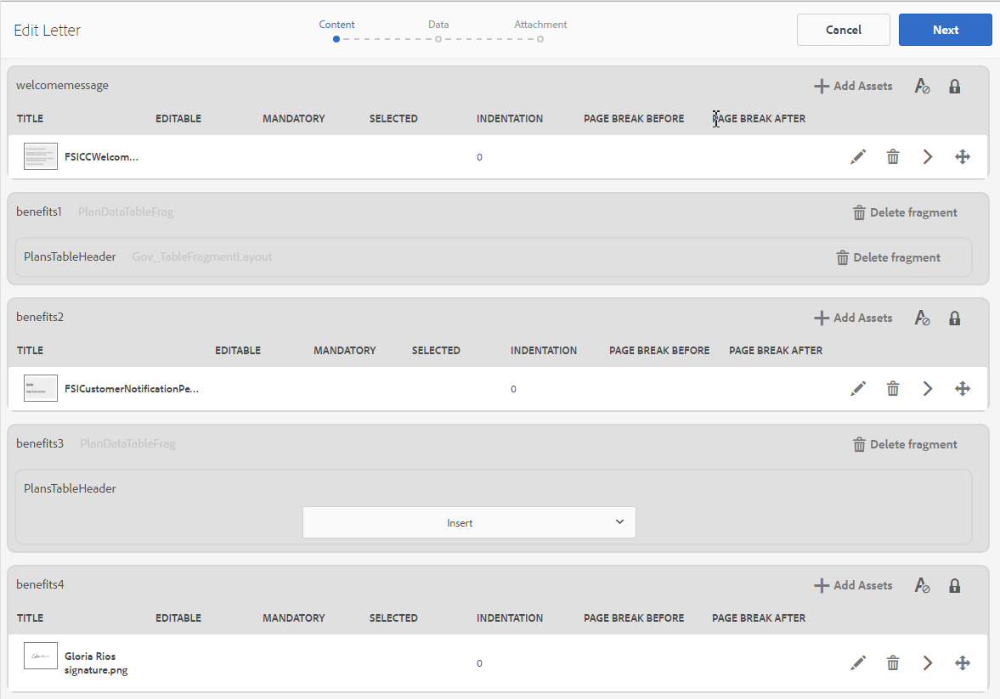

# Skapa brev {#create-letter}

## Arbetsflöde för korrespondenshantering {#correspondence-management-workflow}

Arbetsflödet för korrespondenshantering består av fyra faser:

1. Skapa mallar
1. Skapa dokumentfragment
1. Skapa brev
1. Efterbehandling

### Skapa mallar {#template-creation}

I följande bild visas ett typiskt arbetsflöde när du skapar en brevbrevmall.

I det här arbetsflödet:

1. Formulärdesigners skapar layouter och fragmentlayouter med Adobe Forms Designer och överför dem till en CRX-databas. Layouterna innehåller typiska formulärfält, layoutfunktioner som sidhuvud och sidfot och tomma&quot;målområden&quot; för innehållsplacering. Programspecialister mappar senare det innehåll som krävs för dessa målområden. Mer information om [designlayout](/help/forms/using/layout-design-details.md).
1. Subject Matter Experts från jurister-, finans- och marknadsföringsavdelningar skapar och överför innehåll som textklausuler, friskrivningar, villkor och bilder som logotyper som återanvänds i olika brevmallar.
1. Programspecialister skapar brevmallar. Ansökningsspecialisten

   * Kopplar textsatser och bilder till målområden i layoutmallarna
   * Definierar villkor/regler för inkludering av innehåll
   * Bindar layoutfält och variabler till underliggande datamodeller

1. Författaren förhandsgranskar brevet och skickar det för efterbearbetning. Mer information om [efterbearbetning](/help/forms/using/submit-letter-topostprocess.md).

#### Använda brevmallar som tillhandahålls av Correspondence Management {#using-letter-templates-provided-with-correspondence-management}

I stället för att skapa en layoutmall från grunden kan du välja att ändra och återanvända de mallar som Correspondence Management tillhandahåller. Du kan använda designern för att snabbt ändra profileringen och data- och innehållsfälten i mallarna så att de passar organisationens behov. Mer information om Correspondence Management-mallar finns i [Referensbrevmallar](/help/forms/using/reference-cm-layout-templates.md).

### Skapa dokumentfragment {#document-fragment-creation}

Dokumentfragment är återanvändbara delar\komponenter i en korrespondens som du kan använda för att skapa bokstäver\korrespondens.

Dokumentfragmenten är av följande typer:

#### Text {#text}

En textresurs är en del av innehållet som består av ett eller flera textstycken. Ett stycke kan vara statiskt eller dynamiskt. Ett dynamiskt stycke innehåller referenser till dataelement, vars värden anges vid körning.

#### Lista {#list}

List är en serie dokumentfragment, inklusive text, listor (samma lista kan inte&quot;läggas till i sig själv), villkor och bilder. Ordningen på listelementen kan vara fast eller redigerbar. När du skapar en bokstav kan du använda några eller alla listelement för att återanvända ett mönster med element.

#### Villkor {#condition}

Med villkor kan du definiera vilket innehåll som ska inkluderas när korrespondensen skapas, baserat på angivna data. Villkoret beskrivs i termer av kontrollvariabler. Variablerna kan antingen vara ett dataordlisteelement eller en platshållare. När du lägger till ett villkor kan du välja att ta med en resurs baserat på det värde som kontrollvariabeln har. Villkoren har en enda utdatafil som baseras på ett uttryck. Det första uttrycket är sant, baserat på den aktuella villkorsvariabeln. Dess värde blir villkorets utdata.

#### Layoutfragment {#layout-fragment}

Ett layoutfragment är en layout som kan användas i en eller flera bokstäver. Ett layoutfragment används för att skapa repeterbara mönster, särskilt dynamiska tabeller. Layouten kan innehålla typiska formulärfält som &quot;Adress&quot; och &quot;Referensnummer&quot;. Den innehåller också tomma delformulär som anger målområden. Layouterna (XDP) skapas i Designer och [överförs sedan till Forms and Documents](/help/forms/using/get-xdp-pdf-documents-aem.md).

### Skapa brev {#letter-creation}

Det finns två sätt att generera korrespondensen som skickas till dina kunder: användardriven och systemdriven.

#### Användardriven {#user-driven}

Kundcentrerade medarbetare som skadejusteringsföretag eller handläggare kan skapa anpassad korrespondens. Med ett enkelt och intuitivt bokstavsfyllningsgränssnitt kan man lägga in valfri text i korrespondensen, anpassa redigerbart innehåll och samtidigt förhandsgranska korrespondensen i realtid. De kan sedan skicka den anpassade korrespondensen till en back-end-process.

#### Systemstyrd {#system-driven}

Korrespondensgenereringen automatiseras och styrs av händelseutlösare. Ett påminnelsemeddelande som skickas till en medborgare som ber henne om förhandsregistrering av skatt genereras genom att den fördefinierade mallen slås samman med uppgifter om medborgare. Det sista brevet kan skickas via e-post, skrivas ut, faxas eller arkiveras.

### Efterbearbetning {#post-processing}

Den slutliga korrespondensen kan skickas till en back-end-process för efterbearbetning. Korrespondensen kan vara:

1. Bearbetas för e-post, fax eller grupputskrift, eller placeras i en mapp för utskrift eller e-post.
1. Skickat för granskning och godkännande.
1. Skyddas genom digitala signaturer, certifiering, kryptering eller behörighetshantering.
1. Konverteras till ett sökbart PDF-dokument som innehåller alla metadata som behövs för arkivering och revision.
1. Ingår i en PDF-portfölj som innehåller fler dokument, t.ex. marknadsföringsmaterial. PDF-portföljen kan sedan skickas som slutgiltig korrespondens.

### Correspondence Management-lösningsarkitektur {#correspondence-management-solution-architecture}

Följande bild ger en översikt över ett exempel på arkitektur i Letters Solution.

## Dekonstruera en bokstav {#deconstructing-a-letter}

Detta meddelande om annullering är ett exempel på en vanlig korrespondens:

<table> 
 <tbody> 
  <tr> 
   <td><strong>Bokstavselement</strong></td> 
   <td><strong>Beskrivning</strong></td> 
   <td><strong>Formad med</strong></td> 
  </tr> 
  <tr> 
   <td>Data från back-end Enterprise-system</td> 
   <td>Data som hämtas från serverbaserade företagssystem. Informationen sammanfogas dynamiskt med brevbrevmallar.</td> 
   <td>Den  datafil som skapas baserat på en datamordlista</td> 
  </tr> 
  <tr> 
   <td>Data  som angetts av frontlinjemedarbetaren</td> 
   <td>Data som kan tillhandahållas av en frontlinjeanställd som anpassar brevet innan det skickas ut.  </td> 
   <td>
Oskyddade DD-element  Redigerbara textstycken  Variabler/platshållare  
 </td> 
  </tr> 
  <tr> 
   <td>Godkända  textstycken</td> 
   <td>Förgodkänt textinnehåll. Experter inom juridik, ekonomi, eller en affärsgren som förstår brevets affärskontext skriver vanligtvis textinnehållet. Innehåll som sidhuvud, sidfot, friskrivningsklausuler och hälsningsfras är vanligt för de flesta bokstäver. Innehåll som"orsak till uppsägning" skulle dock vara specifikt för den aktuella bokstaven.</td> 
   <td>
Text\Lists\  Villkor\Layout
 
 
 </td> 
  </tr> 
  <tr> 
   <td>Data  som bygger på anpassad logik -</td> 
   <td>För vissa bokstäver, t.ex. ett brev för att begära mer information om ett anspråk, kan användare som Anspråksjustering lägga till eget textinnehåll.</td> 
   <td>Dokumentfragment  av typen Villkor </td> 
  </tr> 
  <tr> 
   <td>Lagrade  bilder från den centrala databasen</td> 
   <td>Bilder som logotyper och signaturbilder. Bilder som företagslogotyper visas i de flesta eller alla meddelanden. Signaturbilderna är specifika för brevet och för den person för vars räkning brevet skickas.</td> 
   <td>
Bilder som lagras i AEM-resurser (DAM)  
 
 
 </td> 
  </tr> 
 </tbody> 
</table>

## Analysera ett brev innan du skapar det {#analyze-a-letter-before-you-construct-it}

Analysera varje brev för att identifiera de olika delarna som brevet består av. Application Specialist analyserar de korrespondenser som genereras.

* Vilka delar av korrespondensen som är statiska och dynamiska. Variabler som fylls från backend-datakällor eller av slutanvändare.
* Den ordning i vilken de olika textstyckena visas i korrespondensen, t.ex. om en affärsanvändare kan ändra stycken när korrespondensen skapas.
* Genereras korrespondenssystemet eller kräver det att slutanvändaren redigerar korrespondensen? Hur många korrespondenser genereras av systemet och hur många kräver åtgärder från användaren?
* Hur ofta ändras korrespondensmallen? Kommer den att uppdateras varje år, varje kvartal eller endast när en viss lagstiftning ändras? Vilken typ av ändringar förväntas? Är det en ändring att åtgärda typografiska fel, layoutändringar, lägga till fler fält, lägga till fler stycken och så vidare?
* När ni planerar er korrespondenskrav ska ni sammanställa en lista över nya brevmallar. För varje brevmall krävs:

   * Textsatser, bilder och tabeller
   * Datavärden från backend-system
   * Korrespondensens layout och fragmentlayout
   * Den ordning i vilken innehållet visas i brevet och regler för att inkludera och exkludera innehåll

* De villkor under vilka affärsanvändare, t.ex. skadeståndsreglerare eller handläggare, ändrar innehåll eller delar i brevet.
* Scenarier är berättelser som beskriver användarupplevelsen, kraven och fördelarna med att använda bokstavslösningen.
* Scenarier innehåller också:De kunskaper och verktyg du behöver för ditt projekt.
* Bästa tillvägagångssätt för att planera implementeringen. &quot;Översikt över implementering på hög nivå.

## Fördelar med att utföra analysen {#benefits-of-performing-the-analysis}

**Återanvändning** av innehåll Du har en konsoliderad lista över nytt innehåll som krävs för att generera korrespondens. En stor del av innehållet, som sidhuvuden, sidfötter, friskrivningar och introduktioner, är vanligt för många bokstäver och kan återanvändas för olika bokstäver. Allt sådant gemensamt innehåll kan skapas och godkännas av experter en gång och sedan återanvändas i många meddelanden.

**Skapar dataordlistan** Det kommer att finnas datavärden som &quot;Kund-ID&quot; och &quot;Kundnamn&quot; som är gemensamma för många bokstäver. Du kan skapa en konsoliderad lista över alla sådana datavärden. Vanligtvis kontaktas någon från företagets mellanvaruteam när de planerar strukturen. Detta utgör grunden för att skapa datamordlistan.

**Källdata från serverdelssystem** . Du känner också till alla datavärden som behövs och varifrån dessa data hämtas. Sedan kan du skapa implementeringen för att extrahera data från företagssystemet och mata in till bokstavslösningen.

**Uppskattning av bokstavskomplexiteten** Det är viktigt att fastställa hur komplicerat det är att skapa en viss korrespondens. Denna analys hjälper till att fastställa hur lång tid och kompetens som krävs för att skapa brevmallarna. Detta kommer i sin tur att hjälpa till att beräkna resurser och kostnader för att implementera bokstavslösningen.

## Korrespondenskomplexitet {#correspondence-complexity}

Hur komplicerad korrespondensen är kan bestämmas genom att analysera följande parametrar:

**Komplexa** layouter Hur komplicerad är layouten? Bokstäver som Meddelande om annullering har enkla layouter. Bokstäver som anspråksskydd har en komplex layout med flera tabeller och mer än 60 formulärfält. Att skapa komplexa layouter tar längre tid och kräver avancerade kunskaper om layoutdesign.

**Antal textstycken och villkor** Ett låneavtal kan vara tio sidor långt och innehålla mer än 40 textklausuler. Många av dessa klausuler är beroende av&quot;låneparametrar&quot;. På grundval av de exakta villkoren skulle klausulerna inkluderas eller uteslutas från avtalet. För att skapa sådana brev krävs noggrann planering och noggrann definition av de komplexa förhållandena.

Tabellen innehåller några riktlinjer som du kan använda för att klassificera bokstäverna:

<table> 
 <tbody> 
  <tr> 
   <td>
<strong>Komplexitetsnivå</strong>
 </td> 
   <td>
<strong>Komplexa layouter (subjektiva)</strong>
 </td> 
   <td>
<strong>Antal textstycken</strong>
 </td> 
   <td>
<strong>Antal villkorliga texter eller bilder</strong>
 </td> 
   <td>
<strong>Nödvändig skicklighet angiven</strong>
 </td> 
  </tr> 
  <tr> 
   <td>
Låg komplexitet
 </td> 
   <td>
Låg. Layouten har få formulärfält (&lt;15).
 
Vanligtvis en sida.
 </td> 
   <td>
8
 </td> 
   <td>
1
 </td> 
   <td>
Medium Designer-kunskaper.
 </td> 
  </tr> 
  <tr> 
   <td>
Medelkomplexitet
 </td> 
   <td>
Mellankomplex layout. Inkluderar strukturer som tabeller. Vanligtvis mer än en sida lång.
 </td> 
   <td>
16
 </td> 
   <td>
2
 </td> 
   <td>
Medium Designer-kunskaper.
 
 
 
Möjlighet att skapa komplexa uttryck med användargränssnitt.
 </td> 
  </tr> 
  <tr> 
   <td>
Hög komplexitet
 </td> 
   <td>
Komplex layout. Kan vara större än tre sidor. Innehåller tabeller och mer än 60 formulärfält.
 </td> 
   <td>
40
 </td> 
   <td>
8
 </td> 
   <td>
Expert Designer-kunskaper.
 
 
 
Möjlighet att skapa komplexa uttryck med användargränssnitt.
 </td> 
  </tr> 
 </tbody> 
</table>

## Översikt över Skapa ett brev {#overview-of-creating-a-letter}

1. Välj lämplig layout som fungerar som bas för brevet och skapa en bokstav.
1. Lägg till datamoduler eller layoutfragment i brevet och konfigurera dem.
1. Välj att förhandsgranska korrespondensen.
1. Redigera och konfigurera fält, variabler, innehåll och bilagor.

### Förutsättningar {#prerequisites}

Du behöver följande innan du kan skapa en korrespondens:

* [Kompatibilitetspaket](compatibility-package.md). Installera Kompatibilitetspaketet för att visa alternativet **Bokstäver** på **formulärsidan** .
* Bokstaven XDP ([layout](/help/forms/using/document-fragments.md)).
* Andra XDP-filer ([layoutfragment](/help/forms/using/document-fragments.md#main-pars-header-13)) som utgör delar av bokstaven. XDP:er\Layouts skapas i [Designer](https://help.adobe.com/en-US/AEMForms/6.1/DesignerHelp/).
* Relevant [dataordlista](/help/forms/using/data-dictionary.md) (valfritt).
* De [datamoduler](/help/forms/using/document-fragments.md) som du vill använda i korrespondensen.
* [Testdata](/help/forms/using/data-dictionary.md#p-working-with-test-data-p) är XML-filen med testdata. Du måste testa data om du använder ett datalexikon.

## Skapa en brevmall {#create-a-letter-template}

### Markera en layout och ange bokstavsegenskaperna {#select-a-layout-and-enter-the-letter-properties}

1. Välj **Formulär** > **Bokstäver**.

1. Välj **Skapa > Bokstav**. Correspondence Management visar tillgängliga layouter (XDP). De här layouterna kommer från Designer. Layouterna innehåller också brevmallar som Correspondence Management tillhandahåller direkt. Mer information om Correspondence Management-mallar finns i [Referensbrevmallar](/help/forms/using/reference-cm-layout-templates.md). Om du vill lägga till egna layouter skapar du XDP-filer (layout) i Designer och [överför dem sedan till AEM Forms](/help/forms/using/get-xdp-pdf-documents-aem.md).

   

1. Välj en layout genom att trycka på den och trycka på **Nästa**.

   

1. Ange egenskaperna för korrespondensen och tryck på **Spara:**

   * **** Titel (valfritt): Ange brevets titel. Titeln behöver inte vara unik och kan innehålla specialtecken och tecken som inte är engelska.
   * **** Namn: Brevets unika namn. Det får inte finnas två bokstäver i något läge med samma namn. I fältet Namn kan du bara ange engelska tecken, siffror och bindestreck. Fältet Namn fylls i automatiskt baserat på fältet Titel. De specialtecken, blanksteg, siffror och icke-engelska tecken som anges i fältet Titel ersätts med bindestreck i fältet Namn. Även om värdet i fältet Titel automatiskt kopieras till namnet kan du redigera värdet.
   * **** Beskrivning (valfritt): Beskriv referensbrevet.
   * **Dataordlista (valfritt)**: Dataordlistan kan kopplas till korrespondensen. Resurserna som du senare infogar i den här korrespondensen bör antingen ha samma dataordlista som den du väljer för korrespondensen här eller ingen dataordlista.
   * **** Taggar (valfritt): Markera de taggar som ska användas för korrespondensen. Du kan också skriva in ett nytt/anpassat taggnamn och trycka på Retur för att skapa det.
   * **** Efterprocess (valfritt): Välj den bokföringsprocess som ska användas för brevmallen. Det finns fler inlämningsprocesser och de du har skapat med AEM, som e-post och utskrift.
   

1. Systemet visar ett meddelande: &quot;Bokstaven har skapats.&quot; (i varningsmeddelandet) Tryck på **Öppna** för att konfigurera datamodulerna och layoutfragmenten i det. Eller tryck på **Klar** för att gå tillbaka till föregående sida.

   

   **Nästa**: När du trycker på **Öppna** visas en representation av layouten med alla komponenter i layouten (XDP). Fortsätt med att infoga [datamoduler och layoutfragment och konfigurera dem](/help/forms/using/create-letter.md#p-insert-data-modules-and-layout-fragments-in-a-letter-and-configure-them-p).

### Infoga datamoduler och layoutfragment i en bokstav och konfigurera dem {#insert-data-modules-and-layout-fragments-in-a-letter-and-configure-them}

När du har skapat en korrespondens när du trycker på Öppna, visar Korrespondence Management en representation av layouten med alla delformulär/målområden i layouten (XDP) som visas. I vart och ett av målområdena kan du välja att infoga antingen en datamodul eller ett layoutfragment (och sedan datamoduler i layoutfragmentet).

>[!NOTE]
>
>Du kan också välja att trycka på ikonen Redigera för en bokstav på sidan Bokstäver för att infoga datamoduler och layoutfragment i en bokstav och konfigurera dem.

1. Tryck på **Infoga** för vart och ett av delformulären och välj Datamoduler eller ett Layoutfragment som ska infogas i varje delformulär.

   

1. Välj Datamodul eller Layoutfragment för dessa alternativ för vart och ett av delformulären och välj sedan de datamoduler eller de layoutfragment som ska infogas. Med ett layoutfragment kan du ytterligare infoga datamoduler eller layoutfragment i det enligt dess design (upp till fyra nivåer).

   

1. Om du infogar ett layoutfragment visas namnet på layoutfragmentet i delformuläret. Och enligt det valda fragmentet visas kapslade delformulär i delformuläret.
1. När de valda datamodulerna har infogats i layouten kan du trycka på konfigurationsläget och ange följande när du har tryckt på redigeringsikonen för var och en av modulerna:

   1. **Redigerbar**: När det här alternativet är markerat kan innehållet redigeras i användargränssnittet Skapa korrespondens. Markera innehåll som redigerbart endast om det kräver att företagsanvändaren (till exempel en anspråksjustering) ändrar det.
   1. **Obligatoriskt**: När det här alternativet är markerat krävs innehållet i användargränssnittet Skapa korrespondens.
   1. **Markerad**: När det här alternativet är markerat markeras innehållet som standard i användargränssnittet Skapa korrespondens.
   1. **Indrag**: Öka eller minska indraget för modulen/innehållet i bokstaven. Indrag anges som nivåer, med början 0. Varje nivå drar in 36pts. Mer information om hur du anpassar formulär finns i **[!UICONTROL Korrespondenshanteringskonfigurationer]** i [formulärarbetsflödet](/help/forms/using/submit-letter-topostprocess.md#main-pars-header-3).
   1. **Sidbrytning före**: Om du anger sidbrytningen före visas alltid innehållet i den här modulen på en ny sida.
   1. **Sidbrytning efter**: Om du anger att sidbrytning efter ska vara aktiverat för en viss modul visas alltid innehållet i NÄSTA-modulen på en ny sida.
   

1. Om du vill redigera en modul trycker du på ikonen Redigera bredvid den. När du har redigerat modulerna trycker du på **Spara**.

   På den här sidan kan du även göra följande för delformulären:

   1. **Tillåt fri text**: Om Tillåt fri text är aktiverat kan användaren lägga till textbunden text i CCR-vyn. I CCR-vyn är en T-åtgärd aktiverad för de målområden där Tillåt fri text är aktiverat och när användaren trycker på den efterfrågas namn och beskrivning av texten och när användaren trycker på OK öppnas texten i redigeringsläge där användaren kan lägga till text. Detta fungerar som andra textmoduler
   1. **Lås ordning**: Låser delformulärens ordning i bokstaven. Författaren får inte ändra ordning på delformulären/komponenterna när brevet skapas.
   På den här sidan kan du även göra följande för varje resurs i delformulären:

   1. **Ändra ordningen på resurserna**: dra och släpp en resurs som innehåller en sorteringsikon för en resurs ( ).
   1. **Ta bort resurser**: Tryck på ikonen Ta bort bredvid en resurs för att ta bort den.
   1. **Förhandsgranska resurser**: Tryck på förhandsvisningsikonen ( ) bredvid en resurs.

1. Tryck på **Nästa**.
1. På sidan Data visas hur datafält och variabler används i mallen. Data kan länkas till datakällor som t.ex. ett datalexikon eller användarindata. Varje fält definierar egenskaper från vilka dataordlistan mappar data eller vilken bildtext som visas för användarinmatningsfält.

   Länkning:

   * Du kan länka **fältelementen** till en litteral, ett dataordlisteelement, en resurs eller ett användarspecificerat värde. Du kan också ignorera ett fältelement genom att binda det till alternativet Ignorera.
   * **Variabelelementen** kan länkas till en litteral, ett dataordlisteelement, ett fält, en variabel, en resurs eller ett användarspecificerat värde.
   Här följer några huvudfält i länkningen:

   * **Flera rader**: Du kan ange om datainmatningen för ett fält eller en variabel är flerradig. Om du väljer det här alternativet visas inmatningsrutan för fältet eller variabeln som en inmatningsruta med flera rader i datoredigeringsvyn. Fältet eller variabeln visas också som flera rader i Data- och Content-vyerna i användargränssnittet Skapa korrespondens. Indatafältet med flera rader liknar fältet för att skriva en kommentar i en TextModule. Flerradsalternativet är bara tillgängligt för fält och variabler med länkningstypen Användare eller oskyddade element i dataordlistan.
   * **Valfritt**: Du kan ange om värdet för fältet eller variabeln är valfritt eller inte. Alternativet för valfritt fält är tillgängligt för fält och variabler med länkningstypen Användare eller oskyddade element i dataordlistan.

   * **Fält/variabelvalidering**: Om du vill ha förbättrad validering av värdet för ett fält eller en variabel kan du tilldela en validerare till fältet eller variabeln. Det här alternativet är endast tillgängligt för fält och variabler med länkningstypen Användare eller oskyddade element i datamordlistan.
   * **Bildtext** och **verktygstips**: Bildtext är etiketten för det fält som visas före fältet i CCR-användargränssnittet. Det här alternativet är tillgängligt för fält och variabler med länktypen Användare eller oskyddade element i dataordlistan.
   Följande valideringstyper kan du använda för fälten:

   * **Strängvaliderare**: Använd strängvalideraren för att ange en minsta och högsta längd för strängen som anges i fältet eller variabeln. När du skapar en strängvaliderare måste du ange giltiga valideringsparametrar. Ange en giltig längd för både min- och maxvärdena. För String-valideraren kan du ange min- och maxlängden för värdet som kan anges. Om det angivna värdet inte överensstämmer med det angivna minsta och högsta värdet markeras det relevanta fältet i CCR-användargränssnittet med röd färg.

   * **Nummervaliderare**: Använd talvalideraren för att ange det lägsta och högsta numeriska värdet som anges i ett fält eller en variabel. När du skapar en Number Validator måste du ange giltiga valideringsparametrar. Ange numeriska värden för både min- och maxvärdena.

   * **Validerare för reguljära uttryck**: Använd valideraren för reguljära uttryck för att definiera ett reguljärt uttryck som används för att validera värdet för ett fält eller en variabel. Dessutom kan du anpassa felmeddelandet. När du skapar en reguljär uttrycksvaliderare måste du ange ett giltigt reguljärt uttryck.
   >[!NOTE]
   >
   >Fältets och variabelns validerare är bara tillgängliga i fält eller variabler med länktypen Användare eller oskyddade element i dataordlistan.

   

1. Tryck på **Nästa** när du har angett länkningen. Korrespondenshanteringen visar skärmen Bifogade filer.

### Konfigurera bilagor {#set-up-the-attachments}

1. Välj **Lägg till resurs**.
1. På skärmen Välj resurs trycker du på de resurser som ska bifogas med brevet och sedan på **Klar**. Du måste först överföra resurserna till Assets. Vi rekommenderar att du bara bifogar PDF- och Microsoft Office-dokument, men du kan även bifoga bilder. Mer information om hur du överför resurser i DAM finns i [Överföra resurser](/help/assets/managing-assets-touch-ui.md).
1. Om du vill låsa ordningen för resurserna i listan så att anspråksjusteraren inte kan ändra ordningen trycker du på **Lås ordning**. Om du inte markerar det här alternativet kan du ändra ordningen på listobjekten med Anspråksjustering.
1. Om du vill ändra ordningen på resurserna drar och släpper du en resurs som har ikonen för att ändra ordning för en resurs ( ).
1. Tryck på **Redigera** framför en bifogad fil och ange en bifogad fil som obligatorisk om du inte vill att författaren ska kunna ta bort den. Ange en bifogad fil som markerad om du vill att den ska vara förmarkerad i CCR-gränssnittet.
1. Välj **Biblioteksåtkomst** för att ge åtkomst till biblioteket. Om biblioteksåtkomst är aktiverad kan anspråksjusteraren komma åt innehållsbiblioteket när ett brev skapas och bilagor infogas.
1. Välj Konfiguration **av** bifogade filer och ange maximalt antal bifogade filer.

1. Tryck på **Spara**. Din korrespondens skapas och visas på sidan Bokstäver.

När en brevmall har skapats i Correspondence Management kan slutanvändaren/agenten/anspråksjusteraren öppna brevet i användargränssnittet för CCR och skapa en korrespondens genom att ange data, konfigurera innehåll och hantera bilagor. Mer information finns i [Skapa korrespondens](/help/forms/using/create-correspondence.md).

## Tillgängliga länkningstyper för vart och ett av fälten {#types-of-linkage-available-for-each-of-the-fields}

I följande tabell beskrivs vilka typer av länkar som är tillgängliga för olika typer av fält.

Följande värden i tabellen

* **Ja**: Fälttypen i kolumnen längst till vänster har stöd för den typen av mappning
* **Nej**: Fälttypen i kolumnen längst till vänster stöder inte den typen av mappning
* **Ej tillämpligt**: Fälttypen i kolumnen längst till vänster kan inte användas

<table> 
 <tbody> 
  <tr> 
   <td> </td> 
   <td><strong>Literal</strong></td> 
   <td><strong>Tillgång</strong></td> 
   <td><strong>Dataordlista</strong></td> 
   <td><strong>Ignorera</strong></td> 
   <td><strong>Användare</strong></td> 
   <td><strong>Fält</strong></td> 
   <td><strong>Variabel</strong></td> 
  </tr> 
  <tr> 
   <td><strong>date</strong></td> 
   <td>Ja</td> 
   <td>Nej</td> 
   <td>Ja</td> 
   <td>Ja</td> 
   <td>Ja</td> 
   <td>Ej tillämpligt</td> 
   <td>Ej tillämpligt</td> 
  </tr> 
  <tr> 
   <td><strong>time</strong></td> 
   <td>Ja</td> 
   <td>Nej</td> 
   <td>Ja</td> 
   <td>Ja</td> 
   <td>Ja</td> 
   <td>Ej tillämpligt</td> 
   <td>Ej tillämpligt</td> 
  </tr> 
  <tr> 
   <td><strong>datetime</strong></td> 
   <td>Ja</td> 
   <td>Nej</td> 
   <td>Ja</td> 
   <td>Ja</td> 
   <td>Ja</td> 
   <td>Ej tillämpligt</td> 
   <td>Ej tillämpligt</td> 
  </tr> 
  <tr> 
   <td><strong>integer</strong></td> 
   <td>Ja</td> 
   <td>Nej</td> 
   <td>Ja</td> 
   <td>Ja</td> 
   <td>Ja  </td> 
   <td>Ej tillämpligt</td> 
   <td>Ej tillämpligt</td> 
  </tr> 
  <tr> 
   <td><strong>float</strong></td> 
   <td>Ja</td> 
   <td>Nej</td> 
   <td>Ja</td> 
   <td>Ja</td> 
   <td>Ja  </td> 
   <td>Ej tillämpligt</td> 
   <td>N/A  </td> 
  </tr> 
  <tr> 
   <td><strong>richtext</strong></td> 
   <td>Ja</td> 
   <td>endast text</td> 
   <td>Ja</td> 
   <td>Ja</td> 
   <td>Ja</td> 
   <td>Ej tillämpligt</td> 
   <td>Ej tillämpligt</td> 
  </tr> 
  <tr> 
   <td><strong>normal</strong> <strong>text</strong></td> 
   <td>Ja</td> 
   <td>endast text</td> 
   <td>Ja</td> 
   <td>Ja</td> 
   <td>Ja</td> 
   <td>Ej tillämpligt</td> 
   <td>Ej tillämpligt</td> 
  </tr> 
  <tr> 
   <td><strong>image</strong></td> 
   <td>Nej</td> 
   <td>endast bild</td> 
   <td>Nej</td> 
   <td>Ja</td> 
   <td>Nej</td> 
   <td>Ej tillämpligt</td> 
   <td>Ej tillämpligt</td> 
  </tr> 
  <tr> 
   <td><strong>signature</strong></td> 
   <td>Nej</td> 
   <td>Nej</td> 
   <td>Nej  </td> 
   <td>Ja</td> 
   <td>Nej</td> 
   <td>Ej tillämpligt</td> 
   <td>N/A  </td> 
  </tr> 
 </tbody> 
</table>

## Skapa en kopia av en brevmall {#createcopylettertemplate}

Du kan använda en befintlig brevmall för att snabbt skapa en brevmall med liknande egenskaper, innehåll och ärvda resurser, som dokumentfragment och dataordlista. Det gör du genom att kopiera och klistra in en bokstav.

1. Markera en eller flera bokstäver på sidan Bokstäver. Gränssnittet visar ikonen Kopiera.
1. Tryck på Kopiera. Gränssnittet visar ikonen Klistra in. Du kan också välja att gå in i en mapp innan du klistrar in. Olika mappar kan innehålla resurser med samma namn. Mer information om mappar finns i [Mappar och ordna resurser](/help/forms/using/import-export-forms-templates.md#folders-and-organizing-assets).
1. Tryck på Klistra in. Dialogrutan Klistra in visas. Om du kopierar och klistrar in bokstäverna på samma plats tilldelas namn och titlar automatiskt till de nya kopiorna av bokstäverna, men du kan redigera bokstävernas titlar och namn.
1. Om det behövs redigerar du titeln och namnet som du vill spara kopian av brevet med.
1. Tryck på Klistra in. En kopia av brevet skapas. Nu kan du göra nödvändiga ändringar i det nya brevet.

