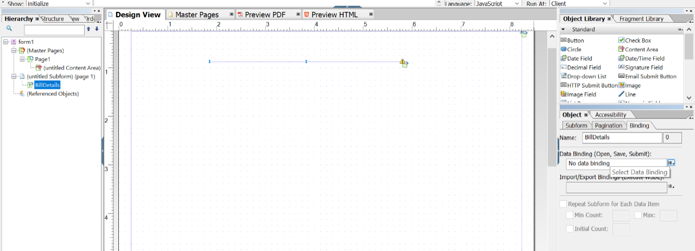
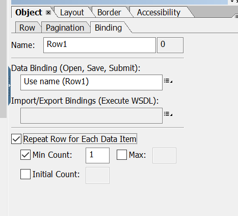
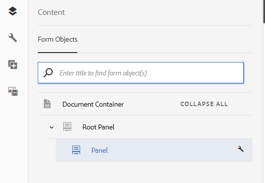

# Självstudiekurs: Skapa mallar{#tutorial-create-templates}

Den här självstudiekursen är ett steg i [Skapa din första interaktiva kommunikationsserie](/help/forms/using/create-your-first-interactive-communication.md). Vi rekommenderar att du följer serien i kronologisk ordning för att förstå, utföra och demonstrera det fullständiga exemplet med självstudiekurser.

Om du vill skapa en interaktiv kommunikation måste du ha mallar tillgängliga på AEM server för utskrifts- och webbkanaler.

Mallarna för utskriftskanalen skapas i Adobe Forms Designer och överförs till AEM. Mallarna kan sedan användas när du skapar en interaktiv kommunikation.

Mallarna för webbkanalen skapas i AEM. Mallförfattare och administratörer kan skapa, redigera och aktivera webbmallar. När mallarna har skapats och aktiverats kan de användas när du skapar en interaktiv kommunikation.

I den här självstudiekursen får du hjälp med att skapa mallar för utskrifts- och webbkanaler så att de blir tillgängliga när du skapar interaktiv kommunikation. I slutet av den här självstudiekursen kan du:

* Skapa XDP-mallar för utskriftskanalen med Adobe Forms Designer
* Överför XDP-mallarna till AEM Forms Server
* Skapa och aktivera mallar för webbkanalen

## Skapa mall för utskriftskanal {#create-template-for-print-channel}

Skapa och hantera en mall för tryckkanalen i interaktiv kommunikation med hjälp av följande uppgifter:

* [Skapa en XDP-mall med Forms Designer](../../forms/using/create-templates-print-web.md#create-xdp-template-using-forms-designer)
* [Överföra en XDP-mall till AEM Forms Server](../../forms/using/create-templates-print-web.md#upload-xdp-template-to-the-aem-forms-server)
* [Skapa en XDP-mall för layoutfragment](../../forms/using/create-templates-print-web.md#create-xdp-template-for-layout-fragments)

### Skapa en XDP-mall med Forms Designer {#create-xdp-template-using-forms-designer}

Baserat på [use case](/help/forms/using/create-your-first-interactive-communication.md) och [anatomy](/help/forms/using/planning-interactive-communications.md) skapar du följande delformulär i XDP-mallen:

* Fakturainformation: Inkluderar ett dokumentfragment
* Kundinformation: Inkluderar ett dokumentfragment
* Faktureringssammanfattning: Inkluderar ett dokumentfragment
* Sammanfattning: Inkluderar ett dokumentfragment (delformuläret Avgifter) och ett diagram (delformuläret Diagram)
* Specificerade anrop: Innehåller en tabell (layoutfragment)
* Betala nu: Innehåller en bild
* Mervärdestjänster: Innehåller en bild

Dessa delformulär visas som målområden i utskriftsmallen när XDP-filen har överförts till Forms Server. Alla entiteter som dokumentfragment, diagram, layoutfragment och bilder läggs till i målområdena när interaktiv kommunikation skapas.

Så här skapar du en XDP-mall för utskriftskanalen:

1. Öppna Forms Designer, välj **Arkiv** > **Nytt** > **Använd ett tomt formulär,** markera **Nästa** och välj sedan **Slutför** för att öppna formuläret för att skapa en mall.

   Kontrollera att alternativen **Objektbibliotek** och **Objekt** är markerade på menyn **Fönster** .

1. Dra och släpp **delformuläret** från **objektbiblioteket** till formuläret.
1. Markera delformuläret så att du kan se alternativen för delformuläret i fönstret **Objekt** i den högra rutan.
1. Välj fliken **Delformulär** och välj **Flödat** i listrutan **Innehåll**. Dra i delformulärets vänstra slutpunkt om du vill justera längden.
1. På fliken **Bindningar**:

   1. Ange **BillDetails** i fältet **Name**.

   1. Välj **Ingen databindning** i listrutan **Databindning**.

   

1. Markera på samma sätt rotdelformuläret, markera fliken **Delformulär** och välj **Flödat** i listrutan **Innehåll**. På fliken **Bindningar**:

   1. Ange **TelecaBill** i fältet **Name**.

   1. Välj **Ingen databindning** i listrutan **Databindning**.

   

1. Upprepa steg 2-5 för att skapa följande delformulär:

   * BillDetails
   * CustomerDetails
   * BillSummary
   * Sammanfattning - Välj fliken **Delformulär** och välj **Placerad** i listrutan **Innehåll** för det här delformuläret. Infoga följande delformulär i delformuläret **Sammanfattning**.

      * Avgifter
      * Diagram

   * ItemCall
   * PayNow
   * ValueAddedServices

   För att spara tid kan du även kopiera och klistra in befintliga delformulär för att skapa ytterligare delformulär.

   Om du vill flytta delformuläret **Diagram** till höger om delformuläret Charges markerar du delformuläret **Diagram** i den vänstra rutan, väljer fliken **Layout** och anger ett värde för fältet **AnchorX** . Värdet måste vara större än värdet för fältet **Width** för delformuläret **Charges**. Markera delformuläret **Avgifter** och välj fliken **Layout** så att du kan visa värdet för fältet **Bredd**.

1. Dra och släpp objektet **Text** från **objektbiblioteket** till formuläret och ange texten **Dial XXXX för att prenumerera** i rutan.
1. Högerklicka på textobjektet i den vänstra rutan, välj **Byt namn på objekt** och ange namnet på textobjektet som **Prenumerera**.

   

1. Välj **Arkiv** > **Spara som** om du vill spara filen i det lokala filsystemet:

   1. Navigera till den plats där du kan spara filen och ange namnet som **create_first_ic_print_template**.
   1. Välj **.xdp** i listrutan **Spara som typ**.

   1. Välj **Spara**.

### Överföra en XDP-mall till AEM Forms Server {#upload-xdp-template-to-the-aem-forms-server}

När du har skapat en XDP-mall med Forms Designer måste du överföra den till AEM Forms Server så att mallen kan användas när du skapar den interaktiva kommunikationen.

1. Välj **[!UICONTROL Forms]** > **[!UICONTROL Forms & Documents]**.
1. Välj **Skapa** > **Filöverföring**.

   Navigera till och markera mallen **create_first_ic_print_template** (XDP) och välj **Öppna** för att importera XDP-mallen till AEM Forms-servern.

### Skapa en XDP-mall för layoutfragment {#create-xdp-template-for-layout-fragments}

Om du vill skapa ett layoutfragment för tryckkanalen i den interaktiva kommunikationen skapar du en XDP-fil med Forms Designer och överför den till AEM Forms Server.

1. Öppna Forms Designer, välj **Arkiv** > **Nytt** > **Använd ett tomt formulär,** markera **Nästa** och välj sedan **Slutför** för att öppna formuläret för att skapa en mall.

   Kontrollera att alternativen **Objektbibliotek** och **Objekt** är markerade på menyn **Fönster** .

1. Dra och släpp komponenten **Tabell** från **objektbiblioteket** till formuläret.
1. I dialogrutan Infoga tabell:

   1. Ange antalet kolumner som **5**.
   1. Ange antalet innehållsrader som **1**.
   1. Markera kryssrutan **Inkludera rubrikrad i tabell**.
   1. Fliken **OK**.

1. Välj **+** i den vänstra rutan bredvid **Tabell** 1 och högerklicka på **Cell1** och välj **Byt namn på objekt** till **Datum**.

   Byt namn på **Cell2**, **Cell3**, **Cell4** och **Cell5** till **Time**, **Number**, **Duration** respektive **Charges**.

1. Klicka på rubriktextfälten i **Designer-vyn** och byt namn på dem till **Time**, **Number**, **Duration** och **Charges**.

   

1. Välj **Rad 1** i den vänstra rutan och välj **Objekt** > **Bindning** > **Upprepa rad för varje dataobjekt**.

   

1. Dra och släpp **textfältskomponenten** från **objektbiblioteket** till **Designer-vyn**.

   

   Dra och släpp **textfältskomponenten** till raderna **Tid**, **Tal**, **Varaktighet** och **Avgifter**.

1. Välj **Arkiv** > **Spara som** om du vill spara filen i det lokala filsystemet:

   1. Navigera till den plats där du kan spara filen och ange namnet som **table_lf**.
   1. Välj **.xdp** i listrutan **Spara som typ**.

   1. Välj **Spara**.

   När du har skapat en XDP-mall för layoutfragment med Forms Designer måste du [överföra](../../forms/using/create-templates-print-web.md#upload-xdp-template-to-the-aem-forms-server) den till AEM Forms Server så att mallen är tillgänglig för användning när du skapar layoutfragment.

## Skapa en mall för webbkanal {#create-template-for-web-channel}

Skapa och hantera en mall för webbkanalen i interaktiv kommunikation med hjälp av följande uppgifter:

* [Skapa mapp för mallar](../../forms/using/create-templates-print-web.md#create-folder-for-templates)
* [Skapa mallen](../../forms/using/create-templates-print-web.md#create-the-template)
* [Aktivera mallen](../../forms/using/create-templates-print-web.md#enable-the-template)
* [Aktivera knappar i interaktiv kommunikation](../../forms/using/create-templates-print-web.md#enabling-buttons-in-interactive-communications)

### Skapa en mapp för mallar {#create-folder-for-templates}

Om du vill skapa en webbkanalmall definierar du en mapp där du kan spara de skapade mallarna. När du har skapat en mall i den mappen aktiverar du mallen så att formuläranvändarna kan skapa en webbkanal för en interaktiv kommunikation som är baserad på mallen.

Så här skapar du en mapp för de redigerbara mallarna:

1. Välj **Verktyg**  > **Konfigurationsläsaren**.
   * Mer information finns i dokumentationen för [Configuration Browser](/help/sites-administering/configurations.md).
1. Välj **Skapa** på sidan Konfigurationsläsare.
1. I dialogrutan **Skapa konfiguration** anger du **Create_First_IC_templates** som mappens titel, markerar **Redigerbara mallar** och väljer **Skapa**.

   

   Mappen **Create_First_IC_templates** skapas och visas på sidan **Konfigurationsläsare** .

### Skapa mallen {#create-the-template}

Baserat på [användningsfallet](/help/forms/using/create-your-first-interactive-communication.md) och [anatomi](/help/forms/using/planning-interactive-communications.md) skapar du följande paneler i webbmallen:

* Fakturainformation: Inkluderar ett dokumentfragment
* Kundinformation: Inkluderar ett dokumentfragment
* Faktureringssammanfattning: Inkluderar ett dokumentfragment
* Sammanfattning av avgifter: Innehåller ett dokumentfragment och ett diagram (layout med två kolumner)
* Specificerade samtal: Innehåller ett register
* Betala nu: Innehåller en **Betala nu**-knapp och en bild
* Värdetilläggstjänster: Innehåller en bild och en **prenumerationsknapp**.

Alla entiteter som dokumentfragment, diagram, tabeller, bilder och knappar läggs till när interaktiv kommunikation skapas.

Så här skapar du en mall för webbkanalen i mappen **Create_First_IC_templates**:

1. Navigera till rätt mallmapp genom att välja mappen **Verktyg** > **Mallar** > **Create_First_IC_templates** .
1. Välj **Skapa**.
1. Välj **Interaktiv kommunikation - webbkanal** och välj **Nästa** i konfigurationsguiden **Välj en malltyp**.
1. I konfigurationsguiden **Mallinformation** anger du **Create_First_IC_Web_Template** som malltitel. Ange en valfri beskrivning och välj **Skapa**.

   Ett bekräftelsemeddelande om att **Create_First_IC_Web_Template** visas.

1. Välj **Öppna** för att öppna mallen i mallredigeraren.
1. Välj **Inledande innehåll** i listrutan bredvid alternativet **Förhandsgranska**.

   

1. Välj **Rotpanelen** och välj sedan **+** för att visa listan med komponenter som du kan lägga till i mallen.
1. Om du vill lägga till en panel ovanför **rotpanelen** väljer du **Panel** i listan.
1. Markera fliken **Innehåll** i den vänstra rutan. Den nya panelen som lagts till i steg 8 visas under **rotpanelen** i innehållsträdet.

   

1. Markera panelen och välj  (Konfigurera).
1. I rutan Egenskaper:

   1. Ange **fakturainformation** i fältet Namn.
   1. Ange **fakturainformation** i fältet Titel.
   1. Välj **1** i listrutan **Antal kolumner**.

   1. Om du vill spara egenskaperna väljer du .

   Panelens namn uppdateras till **Fakturainformation** i innehållsträdet.

1. Upprepa steg 7-11 om du vill lägga till paneler med följande egenskaper i mallen:

   | Namn | Titel | Antal kolumner |
   |---|---|---|
   | kundinformation | Kundinformation | 1 |
   | faktureringssammanfattning | Fakturasammanfattning | 1 |
   | summeringskostnader | Sammanfattning av avgifter | 2 |
   | objektanrop | Specificerade samtal | 1 |
   | nyttja | Betala nu | 2 |
   | arbetsyta | Mervärdestjänster | 1 |

   Följande bild visar innehållsträdet när alla paneler har lagts till i mallen:

   

### Aktivera mallen {#enable-the-template}

När du har skapat webbmallen måste du aktivera den för användning när du skapar den.

Så här aktiverar du webbmallen:

1. Välj **Verktyg**  > **Mallar**.
1. Navigera till mallen **Create_First_IC_Web_Template**, markera den och välj **Aktivera**.
1. Bekräfta genom att välja **Aktivera** igen.

   Mallen är aktiverad och dess status visas som Aktiverad. Du kan använda den här mallen när du skapar interaktiv kommunikation för webbkanalen.

### Aktivera knappar i interaktiv kommunikation {#enabling-buttons-in-interactive-communications}

Baserat på användningsfallet måste du inkludera knapparna **Betala nu** och **Prenumerera** (adaptiva formulärkomponenter) i Interaktiv kommunikation. Så här aktiverar du de här knapparna i den interaktiva kommunikationen:

1. Välj **Struktur** i listrutan bredvid alternativet **Förhandsvisa** .
1. Välj rotpanelen **Dokumentbehållare** med innehållsträdet och välj **Princip** för att välja vilka komponenter som får användas i den interaktiva kommunikationen.

   

1. På fliken **Tillåtna komponenter** i avsnittet **Egenskaper** väljer du **Knapp** från komponenterna i **Adaptivt formulär** .

   

1. Om du vill spara egenskaperna väljer du .
