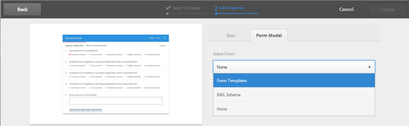

# Skapa ett anpassat formulär {#creating-an-adaptive-form}

## <strong>Skapa ett anpassat formulär</strong> {#strong-create-an-adaptive-form-strong}

Följ de här stegen för att skapa ett anpassat formulär.

1. Öppna AEM Forms Author-instansen på `https://'[server]:[port]'/<custom-context-if-any>.`

1. Ange dina inloggningsuppgifter på AEM inloggningssida.

   När du är inloggad trycker du på **[!UICONTROL Adobe Experience Manager]** > **[!UICONTROL Forms]** > i det övre vänstra hörnet **[!UICONTROL Forms & Documents]**.

   >[!NOTE]
   >
   >Vid en standardinstallation är inloggningen `admin` och lösenordet är `admin`.

1. Tryck **[!UICONTROL Create]** och välj **[!UICONTROL Adaptive Form]**.
1. Ett alternativ för att välja en mall visas. Mer information om mallar finns i [Adaptiva formulärmallar](/help/forms/using/creating-adaptive-form.md#p-adaptive-form-templates-p). Tryck på en mall för att markera den och tryck sedan på Nästa.
1. Ett alternativ för Lägg till egenskaper visas. Ange värdena för följande egenskapsfält. Fälten Titel och Namn är obligatoriska:

   * **[!UICONTROL Title:]** Anger formulärets visningsnamn. Titeln hjälper dig att identifiera formuläret i AEM Forms användargränssnitt.
   * **[!UICONTROL Name:]** Anger formulärets namn. En nod med det angivna namnet skapas i databasen. När du börjar skriva en titel genereras värdet för namnfältet automatiskt. Du kan ändra det föreslagna värdet. Namnfältet får endast innehålla alfanumeriska tecken, bindestreck och understreck. Alla ogiltiga indata ersätts med ett bindestreck.
   * **[!UICONTROL Description:]** Anger detaljerad information om formuläret.
   * **[!UICONTROL Tags:]** Anger taggar som unikt identifierar det adaptiva formuläret. Taggar hjälper dig att söka i formuläret. Om du vill skapa taggar skriver du nya taggnamn i rutan **Taggar** .

1. Du kan skapa ett anpassat formulär baserat på någon av följande formulärmodeller:

   * [Formulärdatamodell](#fdm)
   * [XFA-formulärmall](/help/forms/using/creating-adaptive-form.md#p-create-an-adaptive-form-based-on-an-xfa-form-template-p)
   * [XML- eller JSON-schema](/help/forms/using/creating-adaptive-form.md#p-create-an-adaptive-form-based-on-xml-or-json-schema-p)
   * Ingen eller utan någon formulärmodell

   Du kan konfigurera dessa på **[!UICONTROL Form Model]** fliken på **[!UICONTROL Add Properties]** sidan. Som standard är den valda formulärmodellen **[!UICONTROL None]**.

1. Tryck på **Skapa**. Ett anpassat formulär skapas och en dialogruta öppnas där du kan öppna formuläret för redigering.

   När du har angett alla egenskaper klickar du på **[!UICONTROL Create]**. Ett anpassat formulär skapas och en dialogruta öppnas där du kan öppna formuläret för redigering.

   När du har angett alla egenskaper klickar du på **[!UICONTROL Create]**. Ett anpassat formulär skapas och en dialogruta öppnas där du kan öppna formuläret för redigering.

1. Tryck för **[!UICONTROL Open]** att öppna det nya formuläret på en ny flik. Formuläret öppnas för redigering och visar det innehåll som är tillgängligt i mallen. Här visas också sidlisten där du kan anpassa det nya formuläret efter behov.

   Beroende på vilken typ av anpassningsbart formulär det är visas formulärelementen i den associerade XFA-formulärmallen, XML-schemat eller JSON-schemat på **[!UICONTROL Data Model Objects]** fliken i **[!UICONTROL Content Browser]** sidlisten. Du kan också dra och släppa dessa element för att skapa ett anpassat formulär.

   Information om gränssnittet för att skapa adaptiva formulär och tillgängliga komponenter finns i Introduktion [till att skapa adaptiva formulär](/help/forms/using/introduction-forms-authoring.md).

   >[!NOTE]
   >
   >Tillåt att popup-fönster i webbläsaren öppnar det nya formuläret på en ny flik.

## Skapa ett anpassat formulär baserat på en formulärdatamodell {#fdm}

[Med AEM Forms dataintegrering](/help/forms/using/data-integration.md) kan ni integrera flera datakällor och sammanföra deras enheter och tjänster för att skapa en formulärdatamodell. Det är ett tillägg till JSON-schemat. Du kan använda en formulärdatamodell för att skapa ett anpassat formulär. Enheterna eller datamodellsobjekten som konfigurerats i en formulärdatamodell är tillgängliga som datamodellsobjekt för formulärutveckling. De är bundna till respektive datakällor och används för att fylla i ett formulär i förväg och skriva inlämnade data tillbaka till respektive datakälla. Du kan också anropa tjänster som konfigurerats i en formulärdatamodell med hjälp av adaptiva formulärregler.

Så här använder du en formulärdatamodell för att skapa ett anpassat formulär:

1. På fliken Formulärmodell på skärmen Lägg till egenskaper väljer du **[!UICONTROL Form Data Model]** i **[!UICONTROL Select From]** listrutan.

   

1. Tryck för att expandera **[!UICONTROL Select Form Data Model]**. Alla tillgängliga formulärdatamodeller visas.

   Välj en från datamodell.

   

>[!NOTE]
>
>Du kan också ändra formulärdatamodellen för ett anpassat formulär. Detaljerade steg finns i [Redigera formulärmodellegenskaper för ett anpassat formulär](#edit-form-model).

## Skapa ett anpassat formulär baserat på en XFA-formulärmall {#create-an-adaptive-form-based-on-an-xfa-form-template}

Du kan återanvända dina XFA-formulärmallar för att skapa anpassningsbara formulär. Om du vill återanvända, överför och associerar du en XFA-formulärmall med ett anpassat formulär. Elementen i XFA-formuläret (Form Template) är tillgängliga för användning i innehållssökaren vid redigering av anpassningsbara formulär. I Innehållssökaren kan du dra och släppa formulärmallselementen i formuläret.

>[!NOTE]
>
>[Överför XFA-formulärmallen](/help/forms/using/get-xdp-pdf-documents-aem.md) till AEM Forms innan du börjar skapa ett anpassat formulär baserat på formulärmallen.

Gör följande om du vill använda en XFA-formulärmall som formulärmodell för ditt adaptiva formulär:

1. Öppna **[!UICONTROL Add Properties]** fliken på **[!UICONTROL Form Model]** sidan.
1. Välj i listrutan på fliken Formulärmodell **[!UICONTROL Form Templates]**. Alla formulärmallar som överförs till databasen via AEM Forms UI visas för val. Välj en mall i listan.

   
   **Bild:** *Välja en formulärmall*

   >[!NOTE]
   >
   >Du kan också ändra formulärmallen för ett anpassat formulär. Detaljerade steg finns i [Redigera formulärmodellegenskaper för ett anpassat formulär](#edit-form-model).

## Skapa ett anpassat formulär baserat på XML- eller JSON-schema {#create-an-adaptive-form-based-on-xml-or-json-schema}

XML- och JSON-scheman representerar den struktur i vilken data produceras eller förbrukas av organisationens serversystem. Du kan koppla ett schema till ett anpassat formulär och använda dess element för att lägga till dynamiskt innehåll i det anpassningsbara formuläret. Elementen i schemat är tillgängliga på fliken Datamodellsobjekt i innehållsläsaren för att skapa adaptiva formulär. Du kan dra och släppa schemaelementen för att skapa formuläret.

Se följande dokument för att förstå hur du utformar XML- eller JSON-schema för att skapa adaptiva formulär.

* [Skapa anpassningsbara formulär med XML-schema](/help/forms/using/adaptive-form-xml-schema-form-model.md)
* [Skapa anpassningsbara formulär med JSON-schema](/help/forms/using/adaptive-form-json-schema-form-model.md)

Gör följande om du vill använda XML- eller JSON-schema som formulärmodell för ett anpassat formulär:

1. Tryck på **[!UICONTROL Add Properties]** fliken i det **[!UICONTROL Form Model]** steg som visas på sidan för att skapa anpassade formulär.
1. På fliken Formulärmodell väljer du **[!UICONTROL Schema]** i **[!UICONTROL Select From]** listrutan.

1. Tryck **[!UICONTROL Select Schema]** och gör något av följande:

   * **[!UICONTROL Upload from disk]** - Välj det här alternativet och tryck på Överför schemadefinition för att bläddra och överföra ett XML-schema eller JSON-schema från filsystemet. Den överförda schemafilen finns i formuläret och är inte tillgänglig för andra adaptiva formulär.
   * **[!UICONTROL Search in repository]** - Välj det här alternativet om du vill välja från listan med schemadefinitionsfiler som är tillgängliga i databasen. Välj XML- eller JSON-schemafilen som formulärmodell. Det valda schemat kopplas till formuläret via referens och kan användas i andra adaptiva formulär.

   >[!CAUTION]
   >
   >Kontrollera att JSON-schemats filnamn slutar med **.schema.json**. Till exempel: mySchema.schema.json

   
   **Bild:** *Välja XML- eller JSON-schema*

1. (Endast för XML-schema) När du har valt eller överfört ett XML-schema anger du ett rotelement för den markerade XSD-filen som ska mappas med det adaptiva formuläret.

   
   **Bild:** *Välja XSD-rotelement*

>[!NOTE]
>
>Du kan också ändra schemat för ett anpassat formulär. Detaljerade steg finns i [Redigera formulärmodellegenskaper för ett anpassat formulär](#edit-form-model).

## Adaptiva formulärmallar {#adaptive-form-templates}

En mall innehåller en grundläggande struktur och definierar utseendet (layouter och format) för ett anpassat formulär. Den har förformaterade komponenter som innehåller vissa egenskaper och innehållsstruktur. AEM Forms har vissa anpassningsbara blankettmallar. Om du vill hämta hela mallpaketet med avancerade mallar måste du installera AEM Forms-tilläggspaketet. Mer information finns i [Installera AEM Forms-tilläggspaket](/help/forms/using/installing-configuring-aem-forms-osgi.md).

Dessutom kan du använda mallredigeraren för att skapa egna mallar. Mer information om hur du arbetar med mallar finns i [Adaptiva formulärmallar](/help/forms/using/template-editor.md).

>[!NOTE]
>
>När du öppnar ett adaptivt formulär som skapats med den avancerade mallen för redigering visas ett felmeddelande. Den avancerade mallen har en signaturstegskomponent och Adobe Sign är aktiverat som standard för den. Skapa och välj en molnkonfiguration [för](/help/forms/using/adobe-sign-integration-adaptive-forms.md) Adobe Sign och [konfigurera en signerare](working-with-adobe-sign.md#addsignerstoanadaptiveform) för att lösa problemet.

## Redigera formulärmodellegenskaper för ett anpassat formulär {#edit-form-model}

Anpassningsbara formulär skapas utan någon formulärmodell (med alternativet Ingen för formulärmodellen) eller med en formulärmodell som en formulärmall, XML-schema, JSON-schema eller formulärdatamodell. Du kan ändra formulärmodellen för ett anpassat formulär från Ingen till en annan formulärmodell. För anpassningsbara formulär baserade på en formulärmodell kan du välja en annan formulärmall, XML-schema, JSON-schema eller formulärdatamodell för samma formulärmodell. Du kan dock inte ändra från en formulärmodell till en annan.

1. Markera det adaptiva formuläret och tryck på ikonen **Egenskaper** .
1. Öppna **[!UICONTROL Form Model]** fliken och gör något av följande.

   * Om det adaptiva formuläret saknar en formulärmodell kan du välja en annan formulärmodell och därefter välja en formulärmall, XML- eller JSON-schema eller formulärdatamodell.
   * Om det adaptiva formuläret är baserat på en formulärmodell kan du välja en annan formulärmall, XML- eller JSON-schema eller formulärdatamodell för samma formulärmodell.

1. Tryck **[!UICONTROL Save]** för att spara egenskaperna.

## Spara ett anpassat formulär automatiskt {#auto-save-an-adaptive-form}

Som standard sparas innehållet i ett anpassat formulär vid en användaråtgärd, t.ex. när du trycker på knappen Spara. Du kan också konfigurera ett adaptivt formulär så att innehållet automatiskt börjar sparas baserat på en händelse eller ett tidsintervall. Alternativet Spara automatiskt är användbart i:

* Spara automatiskt innehållet för anonyma och inloggade användare
* Spara innehållet i ett formulär utan att användaren behöver göra något eller inte alls
* Börja spara innehåll i ett formulär baserat på en användarhändelse
* Spara innehållet i ett formulär upprepade gånger efter ett angivet tidsintervall

### Aktivera Spara automatiskt för ett anpassat formulär {#enable-auto-save-for-an-adaptive-form}

Som standard är alternativet för att spara automatiskt inte aktiverat. Du kan aktivera alternativet Spara automatiskt på fliken Spara automatiskt i ett anpassat formulär. Fliken Spara automatiskt innehåller även flera andra konfigurationsalternativ. Utför följande steg för att aktivera och konfigurera alternativet för att spara automatiskt för ett anpassat formulär:

1. Om du vill komma åt avsnittet Spara automatiskt i egenskaperna markerar du en komponent, trycker på  > **[!UICONTROL Adaptive Form Container]** och sedan på .
1. I **[!UICONTROL Auto Save]** avsnittet väljer du **[!UICONTROL Enable]** alternativet för att spara automatiskt.
1. I **[!UICONTROL Adaptive Form Event]** rutan anger du 1 eller TRUE för att automatiskt börja spara formuläret när formuläret har lästs in i webbläsaren. Du kan också ange ett villkorsuttryck för en händelse som när den aktiveras och returnerar true börjar spara formulärets innehåll.
1. Ange utlösaren. Automatiskt sparande aktiveras baserat på din konfiguration. Dina alternativ är:

   * **[!UICONTROL Time based:]** Välj alternativet för att börja spara innehållet baserat på ett visst tidsintervall.
   * **[!UICONTROL Event based:]** Välj alternativet för att börja spara innehållet baserat på när en händelse utlöses.

   När du väljer en utlösare aktiveras rutan Strategisk konfiguration. I rutan Strategisk konfiguration kan du:

   * Ange ett tidsintervall om du väljer **[!UICONTROL Time based]** utlösare.
   * Ange ett händelsenamn om du väljer **[!UICONTROL Event based]** utlösare.

   Du kan också skapa och lägga till en egen anpassad strategi i listan. Mer information finns i [Implementera en anpassad strategi för att automatiskt spara formulären](/help/forms/using/auto-save-an-adaptive-form.md#p-implement-a-custom-strategy-to-enable-autosave-for-adaptive-forms-p).

1. (Endast tidsbaserad autosparfunktion) Utför följande steg för att konfigurera alternativ för tidsbaserad autosparning.

   1. Ange tidsintervallet i sekunder i **[!UICONTROL Auto save on this interval]** rutan. Formuläret sparas upprepade gånger efter det antal sekunder som anges i intervallrutan.

1. (Endast händelsebaserad autosparning) Utför följande steg för att konfigurera alternativ för händelsebaserad autosparning.

   1. Ange en **GuideBridge** -händelse i rutan Spara [automatiskt efter den här händelsen](https://helpx.adobe.com/aem-forms/6/javascript-api/GuideBridge.html) . Formuläret sparas varje gång uttrycket utvärderas till TRUE.

1. (Valfritt) Om du vill spara innehållet automatiskt för anonyma användare väljer du alternativet **Aktivera automatiskt sparande för anonyma användare** och klickar på **[!UICONTROL OK]**.

   >[!NOTE]
   >
   >Om du vill att alternativet Spara automatiskt ska fungera för anonyma användare måste du konfigurera Forms Common Configuration Service så att alla användare kan förhandsgranska, verifiera och signera formulär.
   >
   >Om du vill konfigurera tjänsten går du till AEM Web Console-konfiguration på `https://'[server]:[port]'system/console/configMgr` och redigerar **[!UICONTROL Forms Common Configuration Service]** för att välja **[!UICONTROL All Users]** alternativet i **[!UICONTROL Allow]** fältet och sparar konfigurationen.