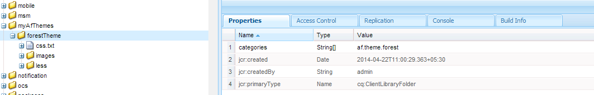
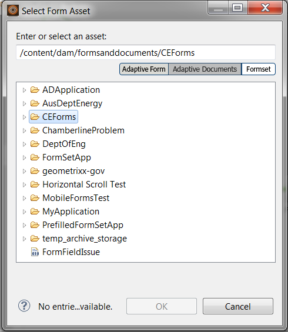

# Skapa anpassade adaptiva formulärteman {#creating-custom-adaptive-form-themes}

>[!CAUTION]
>
>Adobe Experience Manager (AEM) Forms tillhandahåller [Theme Editor](/help/forms/using/themes.md) möjlighet att skapa och ändra anpassade blanketter [teman](/help/forms/using/themes.md). Utför endast stegen som anges i den här artikeln om du har uppgraderat från en version som inte har [Theme Editor](/help/forms/using/themes.md) och du har redan investerat i teman som skapats med Less-/CSS-filer (redigeringsmetod före tema).

## Förutsättningar {#prerequisites}

* Kunskap om LESS-ramverket (Leaner CSS)
* Skapa ett klientbibliotek i Adobe Experience Manager
* [Skapa en adaptiv formulärmall](/help/forms/using/custom-adaptive-forms-templates.md) för att använda det tema du skapar

## Adaptivt formtema {#adaptive-form-theme}

An **adaptivt formulärtema** är ett AEM klientbibliotek som du använder för att definiera format (utseende och känsla) för ett anpassat formulär.

Du skapar en **adaptiv mall** och tillämpa temat på mallen. Du kan sedan använda den här anpassade mallen för att skapa en **adaptiv form**.


## Skapa ett anpassat formulärtema {#to-create-an-adaptive-form-theme}

>[!NOTE]
>
>Följande procedur beskrivs med exempelnamn för AEM objekt som noder, egenskaper och mappar.
>
>Om du följer de här stegen med hjälp av namnen bör den resulterande mallen se ut ungefär som följande ögonblicksbild:


**Bild:** *Exempel på skogtema*

1. Skapa en nod av typen `cq:ClientLibraryFolder` under `/apps`nod.

   Skapa till exempel följande nod:

   `/apps/myAfThemes/forestTheme`

1. Lägga till en flervärdessträngsegenskap `categories` till noden och ange dess värde korrekt.

   Ställ till exempel in egenskapen på: `af.theme.forest`.

   

1. Lägg till två mappar, `less` och `css`och en fil `css.txt` till noden som skapades i steg 1:

   * `less` mapp: Innehåller `less` variabelfiler där du definierar `less` variabler och `less mixins` som används för att hantera css-format.

     Mappen består av `less` variabelfiler, `less` mixin filer, `less` filer som definierar format med hjälp av blandningar och variabler. Och alla dessa `less` -filer importeras sedan i styles.less.

   * `css`mapp: Innehåller de css-filer i vilka du definierar statiska format som ska användas i temat.

   **Mindre variabelfiler**: Detta är de filer där du definierar eller åsidosätter variabler som används för att definiera CSS-format.

   Adaptiva formulär har färdiga variabler som definieras i följande `.less` filer:

   * `/apps/clientlibs/fd/af/guidetheme/common/less/globalvariables.less`
   * `/apps/clientlibs/fd/af/guidetheme/common/less/layoutvariables.less`

   Anpassningsbara formulär innehåller även variabler från tredje part som definieras i:

   `/apps/clientlibs/fd/af/third-party/less/variables.less`

   Du kan använda `less` variabler med adaptiva formulär kan du åsidosätta dessa variabler eller skapa nya `less` variabler.

   >[!NOTE]
   >
   >När du importerar filerna för den mindre processorn anger du den relativa sökvägen för filerna i importsatsen.

   Exempel på åsidosättningsvariabler:

   ```css
   @button-background-color: rgb(19, 102, 44);
   @button-border-color: rgb(19, 102, 44);
   @button-border-size: 0px;
   @button-padding: 10px 15px;
   @button-font-color: #ffffff;
   ```

   Åsidosätta `less`variabler:

   1. Importera standardvariabler för anpassningsbara formulär:

      `/apps/clientlibs/fd/af/guidetheme/common/less/globalvariables.less/apps/clientlibs/fd/af/guidetheme/common/less/layoutvariables.less`

   1. Importera sedan den mindre filen som innehåller åsidosatta variabler.

   Exempel på nya variabeldefinitioner:

   ```css
   @button-focus-bg-color: rgb(40, 208, 90);
   @button-hover-bg-color: rgb(30, 156, 67);
   ```

   **Mindre filer som blandas:** Du kan definiera de funktioner som accepterar variabler som argument. Utdata för dessa funktioner är de resulterande formaten. Använd dessa blandningar i olika format så att du slipper upprepa CSS-formaten.

   Adaptiva formulär innehåller färdiga blandningar som definieras i:

   * `/apps/clientlibs/fd/af/guidetheme/common/less/adaptiveforms-mixins.less`

   Anpassningsbara formulär innehåller även tredjepartsmixar som definieras i:

   * `/apps/clientlibs/fd/af/third-party/less/mixins.less`

   Samplingsdefinition:

   ```css
   .rounded-corners (@radius) {
     -webkit-border-radius: @radius;
     -moz-border-radius: @radius;
     -ms-border-radius: @radius;
     -o-border-radius: @radius;
     border-radius: @radius;
   }
   
   .border(@color, @type, @size) {
      border: @color @size @type;
   }
   ```

   **Styles.less File:** Använd den här filen för att inkludera alla `less` filer (variabler, blandningar, format) som du måste använda i klientbiblioteket.

   I följande exempel `styles.less` -filen kan importprogramsatsen placeras i vilken ordning som helst.

   Programsatserna som ska importera följande `.less` filer är obligatoriska:

   * `globalvariables.less`
   * `layoutvariables.less`
   * `components.less`
   * `layouts.less`

   ```css
   @import "../../../clientlibs/fd/af/guidetheme/common/less/globalvariables.less";
   @import "../../../clientlibs/fd/af/guidetheme/common/less/layoutvariables.less";
   @import "forestTheme-variables";
   @import "../../../clientlibs/fd/af/guidetheme/common/less/components.less";
   @import "../../../clientlibs/fd/af/guidetheme/common/less/layouts.less";
   
   /* custom styles */
   
   .guidetoolbar {
     input[type="button"], button, .button {
       .rounded-corners (@button-radius);
       &:hover {
         background-color: @button-hover-bg-color;
       }
       &:focus {
         background-color: @button-focus-bg-color;
       }
     }
   }
   
   form {
       background-image: url(../images/forest.png);
    background-repeat: no-repeat;
    background-size: 100%;
   }
   ```

   The `css.txt` innehåller sökvägarna till css-filer som ska hämtas för biblioteket.

   Till exempel:

   ```javascript
   #base=/apps/clientlibs/fd/af/third-party/css
   bootstrap.css
   
   #base=less
   styles.less
   
   #base=/apps/clientlibs/fd/xfaforms/xfalib/css
   datepicker.css
   listboxwidget.css
   scribble.css
   dialog.css
   ```

   >[!NOTE]
   >
   >Filen styles.less är inte obligatorisk. Det innebär att du inte behöver skapa den här filen om du inte har definierat några anpassade format, variabler eller blandningar.
   >
   >Om du inte skapar en style.less-fil måste du avkommentera följande rad i css.txt-filen:
   >
   >**`#base=less`**
   >
   >Och kommentera följande rad:
   >
   >**`styles.less`**

## Använda ett tema i ett anpassat formulär {#to-use-a-theme-in-an-adaptive-form}

När du har skapat ett adaptivt formulärtema utför du följande steg för att använda det här temat i en adaptiv form:

1. Inkludera temat som skapats i [skapa ett anpassat formulärtema](/help/forms/using/creating-custom-adaptive-form-themes.md#p-to-create-an-adaptive-form-theme-p) avsnitt, skapa en anpassad sida av typen `cq:Component`.

   Exempel: `/apps/myAfCustomizations/myAfPages/forestPage`

   1. Lägg till en `sling:resourceSuperType` egenskap och ange dess värde som `fd/af/components/page/base`.

      

   1. Om du vill använda ett tema på sidan måste du lägga till en åsidosatt fil library.jsp i noden.

      Du kan sedan importera temat som skapats i Skapa ett adaptivt formulärtemaavsnitt i den här artikeln.

      Följande exempelkodfragment importerar `af.theme.forest` tema.

      ```jsp
      <%@include file="/libs/fd/af/components/guidesglobal.jsp"%>
      <cq:includeClientLib categories="af.theme.forest"/>
      ```

   1. **Valfritt**: På den anpassade sidan åsidosätter du header.jsp, footer.jsp och body.jsp efter behov.

1. Skapa en anpassad mall (till exempel: `/apps/myAfCustomizations/myAfTemplates/forestTemplate`) vars jcr:content pekar på en anpassad sida som skapades i föregående steg (till exempel: `myAfCustomizations/myAfPages/forestPage)`.

   

1. Skapa ett adaptivt formulär med hjälp av mallen som skapades i föregående steg. Utseendet och känslan hos det adaptiva formuläret definieras av det tema som skapas i avsnittet Att skapa ett adaptivt formulärtema i den här artikeln.
