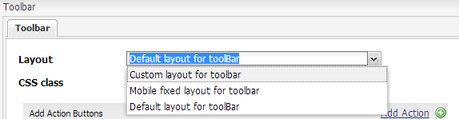

# Skapa en anpassad verktygsfältslayout{#creating-custom-toolbar-layout}

## Verktygsfältslayouter {#layout}

När du skapar ett anpassat formulär kan du ange en verktygsfältslayout för formuläret. Verktygsfältets layout definierar kommandona och layouten för verktygsfältet i formuläret.

Verktygsfältslayouten använder i hög grad klientbearbetning som styrs av komplex JavaScript- och CSS-kod. Det kan vara komplicerat att organisera och optimera serveringen av koden. För att lösa det här problemet tillhandahåller AEM biblioteksmappar på klientsidan, som gör att du kan lagra din klientkod i databasen, ordna den i kategorier och definiera när och hur varje kodkategori ska skickas till klienten. Klientsidans bibliotekssystem tar sedan hand om att skapa rätt länkar på den slutliga webbsidan för att läsa in rätt kod. Mer information finns i [Så fungerar klientbibliotek i AEM.](/help/sites-developing/clientlibs.md)


Exempellayout för verktygsfältet

Adaptiva formulär har en uppsättning färdiga layouter:


Verktygsfältslayouter som finns färdiga

Dessutom kan du skapa en anpassad verktygsfältslayout.

Följande procedur beskriver stegen för att skapa ett anpassat verktygsfält som visar tre åtgärder i verktygsfältet och de andra åtgärderna i en listruta i verktygsfältet.

Det bifogade innehållspaketet innehåller hela koden som beskrivs nedan. När du har installerat innehållspaketet kan du öppna `/content/forms/af/CustomLayoutDemo.html` den anpassade demon av verktygsfältslayouten.

CustomToolbarLayoutDemo.zip

[Hämta anpassad layout för verktygsfältet Fildemo](assets/customtoolbarlayoutdemo.zip)

## Skapa en anpassad verktygsfältslayout {#layout-1}

1. Skapa en mapp för att behålla dina anpassade verktygsfältslayouter. Exempel:

   `/apps/customlayout/toolbar`.

   Om du vill skapa en anpassad layout kan du använda (och anpassa) någon av de färdiga verktygsfältslayouterna som finns i följande mapp:

   `/libs/fd/af/layouts/toolbar`

   Kopiera till exempel `mobileFixedToolbarLayout` noden från `/libs/fd/af/layouts/toolbar` mappen till `/apps/customlayout/toolbar` mappen.

   Kopiera också toolbarCommon.jsp till `/apps/customlayout/toolbar` mappen.

   >[!NOTE]
   >
   >Mappen som du skapar för att behålla de anpassade layouterna har skapats med `apps` mappen.

1. Byt namn på den kopierade noden `mobileFixedToolbarLayout`till `customToolbarLayout.`

   Ange även en relevant beskrivning för noden. Ändra till exempel jcr:description för noden till **anpassad layout för verktygsfältet**.

   Egenskapen `guideComponentType` för noden avgör layouttypen. I det här fallet är layouttypen ett verktygsfält och visas därför i listrutan för val av verktygsfältslayout.

   

   En nod med relevant beskrivning

   Den nya anpassade verktygsfältslayouten visas i **verktygsfältets** dialogrutekonfiguration.

   

   Lista över tillgängliga verktygsfältslayouter

   >[!NOTE]
   >
   >Beskrivningen som uppdaterades i föregående steg visas i listrutan Layout.

1. Välj den här anpassade verktygsfältslayouten och klicka på OK.

   Lägg till clientlib (javascript och css) i noden och ta med referensen för clientlib i `/etc/customlayout` `customToolbarLayout.jsp`.

   

   Sökväg till filen customToolbarLayout.css

   Exempel `customToolbarLayout.jsp`:

   ```php
   <%@include file="/libs/fd/af/components/guidesglobal.jsp" %>
   <cq:includeClientLib categories="customtoolbarlayout" />
   <c:if test="${isEditMode}">
           <cq:includeClientLib categories="customtoolbarlayoutauthor" />
   </c:if>
   <div class="guidetoolbar mobileToolbar mobilecustomToolbar" data-guide-position-class="guide-element-hide">
       <div data-guide-scroll-indicator="true"></div>
       <%@include file="../toolbarCommon.jsp" %>
   </div>
   ```

   >[!NOTE]
   >
   >Lägg till guideverktygsfältsklassen för layouten. Den färdiga formateringen för verktygsfältet definieras i förhållande till klassen för guideverktygsfält.

   Exempel `toolBarCommon.jsp`:

   ```php
   <%@taglib prefix="fn" uri="https://java.sun.com/jsp/jstl/functions"%>
   <%--------------------
   This code iterates over all the tool bar items using the guideToolbar bean.
   If the number of toolbar items are more than 3, then we create a dropdown menu using bootstrap for other actions present in the toolbar.
   In both desktop and mobile devices, the layout is different.
   ---------------------------------%>
   
   <c:forEach items="${guideToolbar.items}" var="toolbarItem" varStatus="loop">
       <c:choose>
         <c:when test="${loop.index gt 2}">
      <c:choose>
       <c:when test="${loop.index eq 3}">
                     <div class="btn-group dropdown">
                       <button type="button" class="btn btn-primary dropdown-toggle label" data-toggle="dropdown">Actions <span class="caret"></code></button>
                       <button type="button" class="btn btn-primary dropdown-toggle icon" data-toggle="dropdown"><span class="glyphicon glyphicon-th-list"></code></button>
             <ul class="dropdown-menu" role="menu">
                           <li>
                               <div id="${toolbarItem.id}_guide-item">
                                 <sling:include path="${toolbarItem.path}" resourceType="${toolbarItem.resourceType}"/>
                              </div>
                           </li>
                           <c:if test="${loop.index eq (fn:length(guideToolbar.items)-1)}">
                                </ul>
                                </div>
                           </c:if>
       </c:when>
       <c:when test="${loop.index eq (fn:length(guideToolbar.items)-1)}">
                          <li>
                                     <div id="${toolbarItem.id}_guide-item">
                                         <sling:include path="${toolbarItem.path}" resourceType="${toolbarItem.resourceType}"/>
                                     </div>
                           </li>
                       </ul>
                     </div>
   
       </c:when>
       <c:otherwise>
         <li>
          <div id="${toolbarItem.id}_guide-item">
           <sling:include path="${toolbarItem.path}" resourceType="${toolbarItem.resourceType}"/>
          </div>
         </li>
       </c:otherwise>
      </c:choose>
         </c:when>
         <c:otherwise>
     <div id="${toolbarItem.id}_guide-item">
           <sling:include path="${toolbarItem.path}" resourceType="${toolbarItem.resourceType}"/>
        </div>
         </c:otherwise>
    </c:choose>
   </c:forEach>
   ```

   CSS:n som finns inuti clientlib-noden:

   ```css
   .mobilecustomToolbar .dropdown {
       display: inline-block;
   }
   
   .mobilecustomToolbar .dropdown {
       float: right;
   }
   
   .mobilecustomToolbar .dropdown > button {
      padding: 6px 12px;
   }
   
   .mobilecustomToolbar .dropdown .guideFieldWidget, .mobilecustomToolbar .dropdown .guideFieldWidget button {
       width: 100%;
   }
   
   .mobilecustomToolbar .dropdown .caret{
       border-bottom: 6px solid;
       border-right: 6px solid transparent;
       border-left: 6px solid transparent;
    border-top: transparent;
   }
   
   .mobilecustomToolbar .dropdown-menu{
    top: auto;
    bottom: 100%;
   }
   
   .mobilecustomToolbar .btn-group {
    vertical-align: super;
   }
   
   .mobilecustomToolbar .glyphicon {
    font-size: 24px;
   }
   
   @media (max-width: 767px){
   
    .mobilecustomToolbar .dropdown .guideButton .iconButton-icon {
      display: none;
       }
   
       .mobilecustomToolbar .dropdown .guideButton .iconButton-label {
      display: inline-block;
       }
   
       .mobilecustomToolbar .dropdown .guideButton button {
      background-color: #013853;
       }
   
    .mobilecustomToolbar .btn-group {
     vertical-align: top;
    }
   
   }
   ```

>[!NOTE]
>
>Beskrivningen som uppdaterades i föregående steg visas i listrutan Layout.


Vyn Skrivbord i verktygsfältet för anpassad layout

