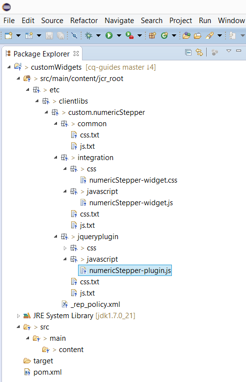

# Skapa anpassade utseenden för anpassade formulärfält{#create-custom-appearances-for-adaptive-form-fields}

## Introduktion {#introduction}

Adaptiva formulär utnyttjar [utseenderamverket](/help/forms/using/introduction-widgets.md) för att hjälpa dig att skapa anpassade utseenden för anpassningsbara formulärfält och ge en annan användarupplevelse. Ersätt till exempel alternativknappar och kryssrutor med växlingsknappar eller använd anpassade jQuery-plugin-program för att begränsa användarnas indata i fält som telefonnummer eller e-post-ID.

Det här dokumentet förklarar hur du använder ett jQuery-plugin-program för att skapa dessa alternativa upplevelser för anpassningsbara formulärfält. Dessutom visas ett exempel om du vill skapa ett anpassat utseende för att en numerisk fältkomponent ska visas som en numerisk nummerlista eller skjutreglage.

Först ska vi titta på de termer och begrepp som används i den här artikeln.

**Utseende** avser format, utseende och känsla samt hur de olika elementen i ett anpassat formulärfält är organiserade. Det innehåller vanligtvis en etikett, ett interaktivt område med indata, en hjälpikon samt korta och långa fältbeskrivningar. Den anpassning av utseendet som beskrivs i den här artikeln kan användas för utseendet på indataområdet i fältet.

**jQuery-plugin** Tillhandahåller en standardmekanism, baserad på jQuery-widgetramverket, för att implementera ett alternativt utseende.

**ClientLib** Ett bibliotekssystem på klientsidan i AEM-klientbearbetning som drivs av komplex JavaScript- och CSS-kod. Mer information finns i Använda bibliotek på klientsidan.

**Arketyp** En Maven-projektmallverktygslåda som definieras som ett ursprungligt mönster eller en modell för Maven-projekt. Mer information finns i Introduktion till arkitekturer.

**Användarkontroll** refererar till huvudelementet i en widget som innehåller fältets värde och används av utseenderamverket för att binda det anpassade widgetgränssnittet med den adaptiva formulärmodellen.

## Steg för att skapa ett anpassat utseende {#steps-to-create-a-custom-appearance}

Stegen på en hög nivå för att skapa ett anpassat utseende är följande:

1. **Skapa ett projekt**: Skapa ett Maven-projekt som genererar ett innehållspaket som ska distribueras på AEM.
1. **Utöka en befintlig widget-klass**: Utöka en befintlig widget-klass och åsidosätt de klasser som krävs.
1. **Skapa ett klientbibliotek**: Skapa ett `clientLib: af.customwidget` bibliotek och lägg till de JavaScript- och CSS-filer som behövs.

1. **Bygg och installera projektet**: Bygg Maven-projektet och installera det genererade innehållspaketet på AEM.
1. **Uppdatera det adaptiva formuläret**: Uppdatera anpassningsbara formulärfältsegenskaper så att de använder det anpassade utseendet.

### Skapa ett projekt {#create-a-project}

En maven-arkityp är en startpunkt för att skapa ett anpassat utseende. Följande detaljer gäller för den arkitetyp som ska användas:

* **Databas**: https://repo.adobe.com/nexus/content/groups/public/
* **Artefakt-ID**: custom-appearance-archietype
* **Grupp-ID**: com.adobe.aemforms
* **Version**: 1.0.4

Kör följande kommando för att skapa ett lokalt projekt baserat på typen av arkiv:

`mvn archetype:generate -DarchetypeRepository=https://repo.adobe.com/nexus/content/groups/public/ -DarchetypeGroupId=com.adobe.aemforms -DarchetypeArtifactId=custom-appearance-archetype -DarchetypeVersion=1.0.4`

Kommandot hämtar Maven-pluginer och arkivtypsinformation från databasen och genererar ett projekt baserat på följande information:

* **groupId**: Grupp-ID som används av det genererade Maven-projektet
* **artifactId**: Artefakt-ID som används av det genererade Maven-projektet.
* **version**: Version för det genererade Maven-projektet.
* **paket**: Paket som används för filstrukturen.
* **artifactName**: Artefaktnamn för det genererade AEM-paketet.
* **packageGroup**: Paketgrupp för det genererade AEM-paketet.
* **widgetName**: Utseendenamn som används som referens.

Det genererade projektet har följande struktur:

```java
─<artifactId>

 └───src

     └───main

         └───content

             └───jcr_root

                 └───etc

                     └───clientlibs

                         └───custom

                             └───<widgetName>

                                 ├───common [client library - af.customwidgets which encapsulates below clientLibs]

                                 ├───integration [client library - af.customwidgets.<widgetName>_widget which contains template files for integrating a third-party plugin with Adaptive Forms]

                                 │   ├───css

                                 │   └───javascript

                                 └───jqueryplugin [client library - af.customwidgets.<widgetName>_plugin which holds the third-party plugins and related dependencies]

                                     ├───css

                                     └───javascript
```

### Utöka en befintlig widget-klass {#extend-an-existing-widget-class}

När projektmallen har skapats gör du följande ändringar efter behov:

1. Inkludera plugin-programmets beroende från tredje part i projektet.

   1. Placera jQuery-plugin-program från tredje part eller anpassade program från jQuery i `jqueryplugin/javascript` mappen och tillhörande CSS-filer i `jqueryplugin/css` mappen. Mer information finns i JS- och CSS-filerna under `jqueryplugin/javascript and jqueryplugin/css` mappen.

   1. Ändra `js.txt` och `css.txt` filer så att de innehåller ytterligare JavaScript- och CSS-filer för jQuery-pluginprogrammet.

1. Integrera plugin-programmet från tredje part med ramverket för att möjliggöra interaktion mellan det anpassade utseenderamverket och plugin-programmet jQuery. Den nya widgeten fungerar bara när du utökar eller åsidosätter följande funktioner.

<table>
 <tbody>
  <tr>
   <td><strong>Funktion</strong></td>
   <td><strong>Beskrivning</strong></td>
  </tr>
  <tr>
   <td><code>render</code></td>
   <td>Återgivningsfunktionen returnerar jQuery-objektet för standard-HTML-elementet i widgeten. HTML-standardelementet ska vara av fokuserbar typ. Till exempel <code>&lt;a&gt;</code>, <code>&lt;input&gt;</code>och <code>&lt;li&gt;</code>. Det returnerade elementet används som <code>$userControl</code>. Om begränsningen <code>$userControl</code> anger fungerar funktionerna i <code>AbstractWidget</code> klassen som förväntat, men vissa av de gemensamma API:erna (focus, click) kräver ändringar. </td>
  </tr>
  <tr>
   <td><code>getEventMap</code></td>
   <td>Returnerar en karta som konverterar HTML-händelser till XFA-händelser. <br /> <code class="code">{
      blur: XFA_EXIT_EVENT,
      }</code><br /> Det här exemplet visar att <code>blur</code> är en HTML-händelse och <code>XFA_EXIT_EVENT</code> är motsvarande XFA-händelse. </td>
  </tr>
  <tr>
   <td><code>getOptionsMap</code></td>
   <td>Returnerar en karta som ger information om åtgärden som ska utföras vid ändring av ett alternativ. Nycklarna är de alternativ som finns för widgeten och värdena är funktioner som anropas när en ändring av alternativet upptäcks. Widgeten innehåller hanterare för alla vanliga alternativ (förutom <code>value</code> och <code>displayValue</code>).</td>
  </tr>
  <tr>
   <td><code>getCommitValue</code></td>
   <td>jQuery-widgetramverket läser in funktionen när värdet för jQuery-widgeten sparas i XFA-modellen (till exempel vid exit-händelsen för ett textfält). Implementeringen ska returnera värdet som sparats i widgeten. Hanteraren har det nya värdet för alternativet.</td>
  </tr>
  <tr>
   <td><code>showValue</code></td>
   <td>Som standard visas fältets namn i XFA vid enter-händelse <code>rawValue</code> . Den här funktionen anropas för att visa <code>rawValue</code> för användaren. </td>
  </tr>
  <tr>
   <td><code>showDisplayValue</code></td>
   <td>Som standard visas fältets namn i XFA vid exit-händelse <code>formattedValue</code> . Den här funktionen anropas för att visa <code>formattedValue</code> för användaren. </td>
  </tr>
 </tbody>
</table>

1. Uppdatera JavaScript-filen i `integration/javascript` mappen efter behov.

   * Ersätt texten `__widgetName__` med widgetens namn.
   * Utöka widgeten från en lämplig widgetklass. I de flesta fall är det widgetklassen som motsvarar den befintliga widget som ersätts. Det överordnade klassnamnet används på flera platser, så du bör söka efter alla förekomster av strängen `xfaWidget.textField` i filen och ersätta dem med den överordnade klassen som används.
   * Utöka `render` metoden för att skapa ett alternativt användargränssnitt. Det är den plats från vilken jQuery-plugin-programmet anropas för att uppdatera användargränssnittet eller interaktionsbeteendet. Metoden ska returnera ett användarkontrollelement `render` .

   * Utöka `getOptionsMap` metoden för att åsidosätta alla alternativinställningar som påverkas på grund av en ändring i widgeten. Funktionen returnerar en mappning som innehåller information om åtgärden som ska utföras vid ändring av ett alternativ. Tangenterna är alternativen som tillhandahålls widgeten och värdena är de funktioner som anropas när en ändring av alternativet upptäcks.
   * Metoden mappar händelser som utlöses av widgeten, med de händelser som krävs av den adaptiva formulärmodellen. `getEventMap` Standardvärdet mappar standard-HTML-händelser för standardwidgeten och måste uppdateras om en alternativ händelse aktiveras.
   * Använd `showDisplayValue` och `showValue` tillämpa satsen för visning och redigering av bild och kan åsidosättas om du vill ha ett alternativt beteende.

   * Metoden anropas `getCommitValue` av det adaptiva formulärramverket när `commit`händelsen inträffar. Vanligtvis är det händelsen exit (utom för elementen för listrutor, alternativknappar och kryssrutor där det sker vid ändring). Mer information finns i [Adaptiva formuläruttryck](../../forms/using/adaptive-form-expressions.md#p-value-commit-script-p).

   * Mallfilen innehåller exempelimplementering för olika metoder. Ta bort metoder som inte ska utökas.

### Skapa ett klientbibliotek {#create-a-client-library}

Exempelprojektet som skapas av Maven-arkitypen skapar automatiskt nödvändiga klientbibliotek och omsluter dem till ett klientbibliotek med en kategori `af.customwidgets`. De JavaScript- och CSS-filer som finns i `af.customwidgets` inkluderas automatiskt vid körning.

### Bygg och installera {#build-and-install}

Om du vill skapa projektet kör du följande kommando på skalet för att generera ett CRX-paket som måste installeras på AEM-servern.

`mvn clean install`

>[!NOTE]
>
>Maven-projektet refererar till en fjärrdatabas inuti POM-filen. Detta är bara för referens, och enligt Maven-standard hämtas databasinformationen i `settings.xml` filen.

### Uppdatera det adaptiva formuläret {#update-the-adaptive-form}

Så här använder du det anpassade utseendet på ett anpassat formulärfält:

1. Öppna det adaptiva formuläret i redigeringsläge.
1. Öppna dialogrutan **Egenskap** för det fält som du vill använda det anpassade utseendet på.
1. Uppdatera **egenskapen på fliken** Format `CSS class` för att lägga till utseendenamnet i `widget_<widgetName>` formatet. Till exempel: **widget_numerisk nummerlista**

## Exempel: Skapa ett anpassat utseende {#sample-create-a-custom-appearance-nbsp}

Nu ska vi titta på ett exempel för att skapa ett anpassat utseende så att ett numeriskt fält visas som en nummerlista eller ett reglage. Utför följande steg:

1. Kör följande kommando för att skapa ett lokalt projekt baserat på Maven-arkityp:

   `mvn archetype:generate -DarchetypeRepository=https://repo.adobe.com/nexus/content/groups/public/ -DarchetypeGroupId=com.adobe.aemforms -DarchetypeArtifactId=custom-appearance-archetype -DarchetypeVersion=1.0.4`

   Du uppmanas att ange värden för följande parametrar.
   *Värdena som används i det här exemplet är markerade med fet stil*.

   `Define value for property 'groupId': com.adobe.afwidgets`

   `Define value for property 'artifactId': customWidgets`

   `Define value for property 'version': 1.0.1-SNAPSHOT`

   `Define value for property 'package': com.adobe.afwidgets`

   `Define value for property 'artifactName': customWidgets`

   `Define value for property 'packageGroup': adobe/customWidgets`

   `Define value for property 'widgetName': numericStepper`

1. Navigera till katalogen `customWidgets` (angivet värde för `artifactID` egenskapen) och kör följande kommando för att generera ett Eclipse-projekt:

   `mvn eclipse:eclipse`

1. Öppna Eclipse-verktyget och gör följande för att importera Eclipse-projektet:

   1. Välj **[!UICONTROL Arkiv > Importera > Befintliga projekt till arbetsytan]**.

   1. Bläddra och välj den mapp där du utförde `archetype:generate` kommandot.

   1. Click **[!UICONTROL Finish]**.

      

1. Välj den widget som ska användas för det anpassade utseendet. I det här exemplet används följande numeriska nummerwidget:

   [https://www.jqueryscript.net/form/User-Friendly-Number-Input-Spinner-with-jQuery-Bootstrap.html](https://www.jqueryscript.net/form/User-Friendly-Number-Input-Spinner-with-jQuery-Bootstrap.html)

   Granska plugin-programkoden i filen i Eclipse-projektet för att se om den matchar kraven för utseendet. `plugin.js` I det här exemplet uppfyller utseendet följande krav:

   * Den numeriska nummerlistan ska sträcka sig från `- $.xfaWidget.numericInput`.
   * Widgetens `set value` metod ställer in värdet efter att fältet har fokus. Det är ett obligatoriskt krav för en widget för anpassningsbara formulär.
   * Metoden måste åsidosättas för att `render` metoden ska kunna anropas. `bootstrapNumber`

   * Det finns inget ytterligare beroende för plugin-programmet förutom plugin-programmets huvudkällkod.
   * Exemplet utför ingen formatering på nummerlistan, så ingen ytterligare CSS krävs.
   * Objektet ska vara tillgängligt för `$userControl` `render` metoden. Det är ett fält av den `text` typen som klonas med plugin-programkoden.

   * Knapparna **+** och **-** ska inaktiveras när fältet är inaktiverat.

1. Ersätt innehållet i `bootstrap-number-input.js` (jQuery plugin) med innehållet i `numericStepper-plugin.js` filen.
1. Lägg till följande kod i `numericStepper-widget.js` filen för att åsidosätta återgivningsmetoden för att anropa plugin-programmet och returnera `$userControl` objektet:

   ```java
   render : function() {
        var control = $.xfaWidget.numericInput.prototype.render.apply(this, arguments);
        var $control = $(control);
        var controlObject;
        try{
            if($control){
            $control.bootstrapNumber();
            var id = $control.attr("id");
            controlObject = $("#"+id);
            }
        }catch (exc){
             console.log(exc);
        }
        return controlObject;
   }
   ```

1. I `numericStepper-widget.js` filen åsidosätter du `getOptionsMap` egenskapen för att åsidosätta åtkomstalternativet och döljer knapparna + och - i inaktiverat läge.

   ```java
   getOptionsMap: function(){
       var parentOptionsMap = $.xfaWidget.numericInput.prototype.getOptionsMap.apply(this,arguments),
   
       newMap = $.extend({},parentOptionsMap,
   
        {
   
              "access": function(val) {
              switch(val) {
                 case "open" :
                   this.$userControl.removeAttr("readOnly");
                   this.$userControl.removeAttr("aria-readonly");
                   this.$userControl.removeAttr("disabled");
                   this.$userControl.removeAttr("aria-disabled");
                   this.$userControl.parent().find(".input-group-btn button").prop('disabled',false);
                   break;
                 case "nonInteractive" :
                 case "protected" :
                   this.$userControl.attr("disabled", "disabled");
                   this.$userControl.attr("aria-disabled", "true");
                   this.$userControl.parent().find(".input-group-btn button").prop('disabled',true);
                   break;
                case "readOnly" :
                   this.$userControl.attr("readOnly", "readOnly");
                   this.$userControl.attr("aria-readonly", "true");
                   this.$userControl.parent().find(".input-group-btn button").prop('disabled',true);
                   break;
               default :
                   this.$userControl.removeAttr("disabled");
                   this.$userControl.removeAttr("aria-disabled");
                   this.$userControl.parent().find(".input-group-btn button").prop('disabled',false);
                   break;
             }
          },
      });
      return newMap;
    }
   ```

1. Spara ändringarna, navigera till mappen som innehåller `pom.xml` filen och kör följande Maven-kommando för att skapa projektet:

   `mvn clean install`

1. Installera paketet med hjälp av AEM Package Manager.

1. Öppna det adaptiva formuläret i redigeringsläge som du vill använda det anpassade utseendet på och gör följande:

   1. Högerklicka på det fält som du vill använda utseendet på och klicka på **[!UICONTROL Redigera]** för att öppna dialogrutan Redigera komponent.

   1. Uppdatera **[!UICONTROL CSS-klassegenskapen]** på fliken Format för att lägga till `widget_numericStepper`.

Det nya utseendet som du nyss skapade kan nu användas.
