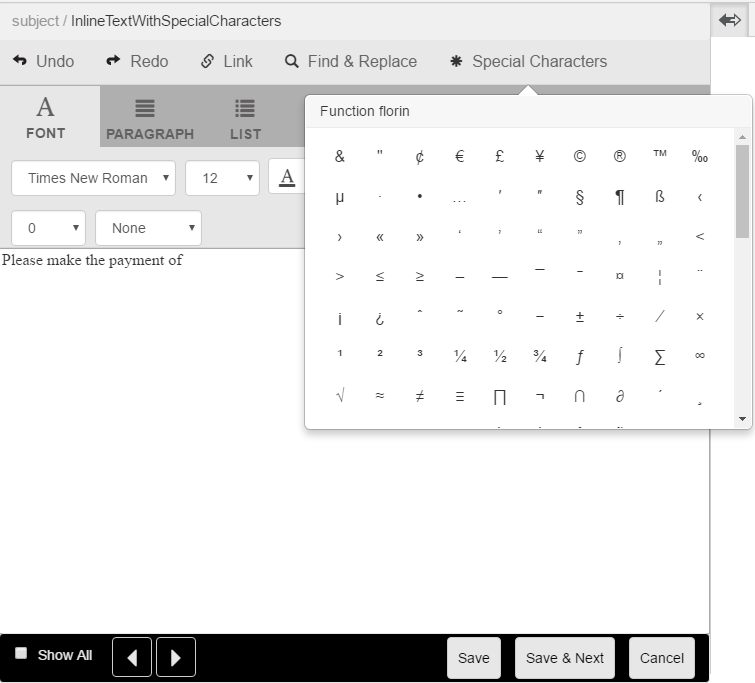

# Anpassade specialtecken i korrespondenshantering{#custom-special-characters-in-correspondence-management}

## Ökning {#overview}

Correspondence Management har inbyggt standardstöd för 210 specialtecken som du enkelt kan infoga med bokstäver.

Du kan till exempel infoga följande specialtecken:

* Valutasymboler som €,¥ och £
* Matematiska symboler som t.ex.¥, Ð och ^
* Interpunktionssymboler som ‟ och

Du kan infoga specialtecken med bokstäver:

* I [textredigeraren](/help/forms/using/document-fragments.md#createtext)
* I en [redigerbar, infogad modul i korrespondens](../../forms/using/create-correspondence.md#managecontent)

Administratören kan lägga till stöd för fler/anpassade specialtecken genom anpassning. I den här artikeln finns instruktioner om hur du kan lägga till stöd för ytterligare anpassade specialtecken.

## Lägga till eller ändra stöd för anpassade specialtecken i Correspondence Management {#creatingfolderstructure}

Följ de här stegen för att lägga till stöd för anpassade specialtecken:

1. Gå till `https://'[server]:[port]'/[ContextPath]/crx/de` och logga in som administratör.
1. I appmappen skapar du en mapp med namnet **[!UICONTROL specialcharacters]** med en sökväg/struktur som liknar specialteckenmappen (i mappen textEditorConfig under libs):

   1. Högerklicka på mappen **specialcharacters** på följande sökväg och välj **Overlay Node**:

      `/libs/fd/cm/ma/gui/configuration/textEditorConfig/specialcharacters`

   1. Kontrollera att dialogrutan Overlay Node har följande värden:

      **Sökväg:** /libs/fd/cm/ma/gui/configuration/textEditorConfig/specialtecken

      **Plats för övertäckning:** /apps/

      **Matcha nodtyper:** Markerade

      >[!NOTE]
      >
      >Ändra inte grenen /libs. Alla ändringar du gör kan gå förlorade eftersom den här grenen kan ändras när du:
      >
      >
      >
      >    * Uppgradera till din instans
      >    * Använd en snabbkorrigering
      >    * Installera ett funktionspaket
      >
      >

   1. Klicka på **OK** och sedan på **Spara alla**. Mappen med specialtecken skapas i den angivna sökvägen.

      Kontrollera nodstrukturtaggarna när du har skapat övertäckningen. Varje nod som skapas i /apps med övertäckningen ska ha samma klass och egenskaper som definieras i /libs för den noden. Om någon egenskap eller tagg saknas i nodstrukturen under /apps-platsen synkroniserar du dess taggar med motsvarande nod i /libs.

1. Kontrollera att noden **[!UICONTROL textEditorConfig]** har följande egenskaper och värden:

   | Namn | Typ | Värde |
   |---|---|---|
   | cmConfigurationType | Sträng | cmTextEditorConfiguration |
   | cssPath | Sträng | /libs/fd/cm/ma/gui/components/admin/createasset/textcontrol/clientlibs/textcontrol |

1. Högerklicka på mappen **[!UICONTROL specialcharacters]** på följande sökväg och välj **Skapa > Underordnad nod**. Klicka sedan på **Spara alla**:

   /apps/fd/cm/ma/gui/configuration/textEditorConfig/specialcharacters/&lt;YourChildNode>

1. Uppdatera sidan för textredigeraren\Skapa korrespondensgränssnitt. Noden som du har lagt till är den sista i listan med specialtecken i användargränssnittet.
1. Klicka på **Spara alla**.
1. Ändringar i specialtecknen efter behov:

<table>
 <tbody>
  <tr>
   <td><strong>Till...</strong></td>
   <td><strong>Utför följande steg</strong></td>
  </tr>
  <tr>
   <td>Lägga till ett eget specialtecken</td>
   <td>
    <ol>
     <li>Lägg till en underordnad nod under "/apps/fd/cm/ma/gui/configuration/textEditorConfig/specialcharacters" med obligatoriska egenskaper.</li>
     <li>Klicka på Spara alla</li>
     <li>Uppdatera textredigeraren\Skapa korrespondensgränssnitt så att du kan se ändringarna.</li>
    </ol> </td>
  </tr>
  <tr>
   <td>Uppdatera ett befintligt specialteckens egenskaper</td>
   <td>
    <ol>
     <li>Lägg över noden som ska uppdateras enligt ovan och verifiera taggar och klasser.</li>
     <li>Ändra alla värden, till exempel bildtext, värde, endValue och multipleCaption. </li>
     <li>Klicka på Spara alla. </li>
     <li>Uppdatera textredigeraren\Skapa korrespondensgränssnitt så att du kan se ändringarna.</li>
    </ol> </td>
  </tr>
  <tr>
   <td>Dölja ett specialtecken</td>
   <td>
    <ol>
     <li>Täck över noden som ska döljas under "/apps/fd/cm/ma/gui/configuration/textEditorConfig/specialtecken"</li>
     <li>Lägg till egenskapen sling:hideResource (Boolean) till noden (under program) som ska döljas. </li>
     <li>Klicka på Spara alla. </li>
     <li>Uppdatera textredigeraren\Skapa korrespondensgränssnitt så att du kan se ändringarna.  </li>
    </ol> </td>
  </tr>
  <tr>
   <td>Dölj flera specialtecken</td>
   <td>
    <ol>
     <li>Lägg till egenskapen "sling:hideChildren (String eller String[])" i "/apps/fd/cm/ma/gui/configuration/textEditorConfig/specialcharacters". </li>
     <li>Lägg till nodnamn (specialtecken som ska döljas) som värden för egenskapen "sling:hideChildren". </li>
     <li>Klicka på Spara alla. </li>
     <li>Uppdatera textredigeraren\Skapa korrespondensgränssnitt så att du kan se ändringarna.  </li>
    </ol> </td>
  </tr>
  <tr>
   <td>Ordna specialtecken</td>
   <td>
    <ol>
     <li>Lägg till en underordnad nod under "/apps/fd/cm/ma/gui/configuration/textEditorConfig/specialcharacters" med obligatoriska egenskaper. </li>
     <li>Lägg till egenskapen "sling:orderBefore (String)" i den nyskapade underordnade noden. </li>
     <li>Lägg till nodnamnet som det värde före vilket det nya specialtecknet ska visas. </li>
     <li>Klicka på Spara alla. </li>
     <li>Uppdatera textredigeraren\Skapa korrespondensgränssnitt så att du kan se ändringarna.  </li>
    </ol> </td>
  </tr>
 </tbody>
</table>
