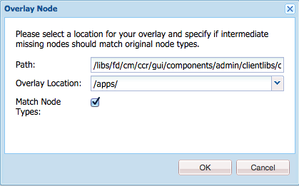

# Anpassa gränssnitt för att skapa korrespondens{#customize-create-correspondence-ui}

## Översikt {#overview}

Med Correspondence Management kan ni varumärka om sin lösningsmall för att få ett bättre varumärkesvärde och följa företagets varumärkestandarder. När du ändrar användargränssnittet innebär det att du ändrar organisationslogotypen, som visas i det övre vänstra hörnet av användargränssnittet Create Correspondence.

Du kan ändra logotypen i användargränssnittet Create Correspondence med din organisations logotyp.


Den anpassade ikonen i gränssnittet Skapa korrespondens

### Ändra logotypen i användargränssnittet för Create Correspondence {#changing-the-logo-in-the-create-correspondence-ui}

Så här ställer du in en logobild:

1. Skapa lämplig [mappstruktur i CRX](#creatingfolderstructure).
1. [Ladda upp den nya logotypfilen](#uploadlogo) i den mapp du har skapat i CRX.

1. [Konfigurera CSS](#createcss) för CRX för att hänvisa till den nya logotypen.
1. Rensa webbläsarhistoriken och [uppdatera användargränssnittet](#refreshccrui)Skapa korrespondens.

## Skapar den mappstruktur som krävs {#creatingfolderstructure}

Skapa mappstrukturen som beskrivs nedan för värdtjänster för den anpassade logotypbilden och formatmallen. Den nya mappstrukturen med rotmappen /apps liknar strukturen i mappen /libs.

Om du vill anpassa något skapar du en parallell mappstruktur, enligt beskrivningen nedan, i grenen /apps.

Avdelningen /apps (mappstruktur):

* Säkerställer att dina filer är säkra om systemet uppdateras. Om det gäller uppgradering, funktionspaket eller en snabbkorrigering uppdateras grenen /libs och om du har dina ändringar i grenen /libs skrivs de över.
* Hjälper dig att inte störa det aktuella systemet/den aktuella grenen, som du kanske kan lösa upp av misstag om du använder standardplatserna för lagring av anpassade filer.
* Hjälper dina resurser att få högre prioritet när AEM söker efter resurser. AEM är konfigurerat att söka igenom grenen /apps först och sedan grenen /libs för att hitta en resurs. Den här mekanismen innebär att systemet använder övertäckningen (och de anpassningar som definieras där).

Följ de här stegen för att skapa den nödvändiga mappstrukturen i grenen /apps:

1. Gå till `https://[server]:[port]/[ContextPath]/crx/de` och logga in som administratör.
1. I mappen apps skapar du en mapp med namnet `css` med en sökväg/struktur som liknar css-mappen (finns i ccrui-mappen).

   Steg för att skapa css-mappen:

   1. Högerklicka på **css** -mappen i följande sökväg och välj **Overlay Node**: `/libs/fd/cm/ccr/gui/components/admin/clientlibs/ccrui/css`

      

   1. Kontrollera att dialogrutan Overlay Node har följande värden:

      **** Sökväg: /libs/fd/cm/ccr/gui/components/admin/clientlibs/ccrui/css

      **** Plats för övertäckning: /apps/

      **** Matcha nodtyper:Markerad

      

      >[!NOTE]
      >
      >Gör inga ändringar i grenen /libs. Alla ändringar du gör kan gå förlorade eftersom den här grenen kan ändras när du:
      >
      >    
      >    
      >    * Uppgradera till din instans
      >    * Använd en snabbkorrigering
      >    * Installera ett funktionspaket


   1. Click **OK**. CSS-mappen skapas i den angivna sökvägen.


1. I mappen apps skapar du en mapp med namnet `imgs` med en sökväg/struktur som liknar mappen imgs (som finns i mappen ccrui).

   1. Högerklicka på mappen **imgs** på följande sökväg och välj **Overlay Node**: `/libs/fd/cm/ccr/gui/components/admin/clientlibs/ccrui/imgs`
   1. Kontrollera att dialogrutan Overlay Node har följande värden:

      **** Sökväg: /libs/fd/cm/ccr/gui/components/admin/clientlibs/ccrui/imgs

      **** Plats för övertäckning: /apps/

      **** Matcha nodtyper:Markerad

   1. Click **OK**.

      >[!NOTE]
      >
      >Du kan också skapa mappstrukturen i mappen /apps manuellt.

1. Klicka på **Spara alla** för att spara ändringarna på servern.

## Överför den nya logotypen till CRX {#uploadlogo}

Överför din anpassade logotypfil till CRX. HTML-standardregler styr återgivningen av logotypen. De bildfilformat som stöds är beroende av vilken webbläsare du använder för att få åtkomst till AEM Forms. Alla webbläsare har stöd för JPEG, GIF och PNG. Mer information finns i den webbläsarspecifika dokumentationen om de bildformat som stöds.

* Standardmåtten för logotypbilden är 48 px * 48 px. Se till att bilden liknar den här storleken eller är större än 48 px * 48 px.
* Om höjden på logotypbilden är större än 50 px, skalas bilden ned i användargränssnittet Create Correspondence till en maximal höjd på 50 px eftersom det är höjden på sidhuvudet. När du skalar ned bilden behåller användargränssnittet Skapa korrespondens bildens proportioner.
* Gränssnittet Skapa korrespondens skalar inte upp bilden om den är liten, så se till att du använder en logotypbild som är minst 48 px hög och tillräckligt bred för att bilden ska bli tydlig.

Följ de här stegen för att överföra den anpassade logotypfilen till CRX:

1. Gå till `https://[server]:[port]/[contextpath]/crx/de`. Logga in som administratör om det behövs.
1. I CRXDE högerklickar du på mappen **imgs** på följande sökväg och väljer **Skapa > Skapa fil**:

   `/apps/fd/cm/ccr/gui/components/admin/clientlibs/ccrui/imgs/`

   

1. I dialogrutan Skapa fil anger du namnet på filen som CustomLogo.png (eller namnet på logotypfilen).

   

1. Klicka på **Spara alla**.

   Under den nya filen som du har skapat (här CustomLogo.png) visas egenskapen jcr:content.

1. Klicka på jcr:innehåll i mappstrukturen.

   jcr:innehållets egenskaper visas.

   

1. Dubbelklicka på egenskapen **jcr:data** .

   Dialogrutan Redigera jcr:data visas.

   Klicka nu på mappen newlogo.png, dubbelklicka på jcr:content (dim option) och ange type nt:resource. Om det inte finns någon egenskap skapar du en egenskap med namnet jcr:content.

1. I dialogrutan Redigera jcr:data klickar du på **Bläddra** och väljer den bildfil som du vill använda som logotyp (här CustomLogo.png).

   De bildfilformat som stöds är beroende av vilken webbläsare du använder för att få åtkomst till AEM Forms. Alla webbläsare har stöd för JPEG, GIF och PNG. Mer information finns i den webbläsarspecifika dokumentationen om de bildformat som stöds.

   

   Exempel: CustomLogo.png som ska användas som egen logotyp

1. Klicka på **Spara alla**.

## Skapa CSS för att integrera logotypen med användargränssnittet {#createcss}

Den anpassade logotypbilden kräver en extra formatmall för att kunna läsas in i innehållskontexten.

Följ de här stegen för att konfigurera formatmallen för återgivning av logotypen:

1. Gå till `https://[server]:[port]/[contextpath]/crx/de`. Logga in som administratör om det behövs.
1. Skapa en fil med namnet customcss.css (du kan inte använda ett annat filnamn) på följande plats:

   `/apps/fd/cm/ccr/gui/components/admin/clientlibs/ccrui/css/`

   Steg för att skapa filen customcss.css:

   1. Högerklicka på **css** -mappen och välj **Skapa > Skapa fil**.
   1. I dialogrutan Ny fil anger du namnet på CSS som `customcss.css`(du kan inte använda ett annat filnamn) och klickar på **OK**.
   1. Lägg till följande kod i den nyligen skapade CSS-filen. I content:url i koden anger du bildnamnet som du har överfört till imgs-mappen i CRXDE.

      ```css
      .logo, .logo:after {
      content:url("../imgs/CustomLogo.png");
      }
      ```

   1. Klicka på **Spara alla**.

## Uppdatera användargränssnittet Create Correspondence för att se den anpassade logotypen {#refreshccrui}

Rensa webbläsarcachen och öppna sedan instansen Create Correspondence UI i webbläsaren. Du bör se din egen logotyp.


Den anpassade ikonen i gränssnittet Skapa korrespondens

