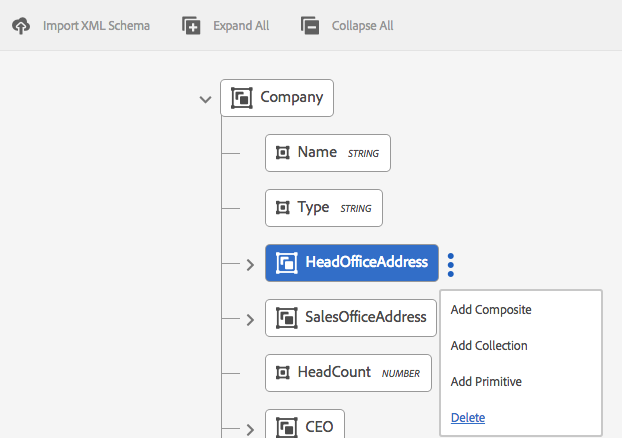

# Dataordlista{#data-dictionary}

## Introduktion {#introduction}

Med ett datalexikon kan man använda information från backend-datakällor utan att behöva känna till teknisk information om underliggande datamodeller. En dataordlista består av dataordlisteelement (DDE). Du använder dessa dataelement för att integrera backend-data till bokstäverna som indata för användning i kundkorrespondens.

En dataordlista är en oberoende representation av metadata som beskriver underliggande datastrukturer och tillhörande attribut. En dataordlista skapas med hjälp av ett företagstokabulär. Den kan mappas till en eller flera underliggande datamodeller.

Dataordlistan består av element av tre typer: Enkla element, sammansatta element och samlingselement. Enkla DDE:er är primitiva element som strängar, siffror, datum och booleska värden som innehåller information som stadsnamn. En sammansatt DDE innehåller andra DDE:er, som kan vara av typen primitiv, sammansatt eller samling. Till exempel en adress som består av en gatuadress, ort, provins, land och postnummer. En samling är en lista med liknande enkla eller sammansatta DDE:er. Exempel: en kund med flera platser eller olika fakturerings- och leveransadresser.

Correspondence Management använder backend-, kund- eller mottagarspecifika data som lagras enligt dataordbokens struktur för att skapa korrespondens avsedd för olika kunder. Ett dokument kan t.ex. skapas med egna namn, t.ex. &quot;Bästa {Förnamn}&quot;,&quot;Herr {Efternamn}&quot;.

Vanligtvis behöver företagsanvändare inte känna till metadata-representationer som XSD (XML-schema) eller Java-klasser. De kräver dock vanligtvis åtkomst till dessa datastrukturer och attribut för att kunna bygga lösningar.

### Arbetsflöde för dataordlista {#data-dictionary-workflow}

1. En författare [skapar dataordlistan](#createdatadictionary) genom att antingen överföra ett schema eller från början.
1. Skribenten skapar brev och interaktiv kommunikation baserat på dataordlistan och kopplar dataordlisteelement i brev och interaktiv kommunikation när det behövs.
1. En författare kan hämta XML-exempeldatafil, som baseras på ett dataglexikons schema. Författaren kan ändra XML-exempelfilen, som kan kopplas som testdata med dataordlistan. Samma sak används vid förhandsgranskningen av brevet.
1. När en författare [förhandsgranskar en bokstav](../../forms/using/create-letter.md#p-types-of-linkage-available-for-each-of-the-fields-p)väljer han att förhandsgranska den med data (anpassad förhandsgranskning). Bokstaven öppnas i förväg med de data som författaren har angett. Detta öppnas i gränssnittet för att skapa korrespondens. Agenten som förhandsgranskar det här brevet kan ändra innehållet, data och bilagor i det här brevet och kan skicka det slutliga brevet. Mer information om hur du skapar brev finns i [Skapa korrespondens](../../forms/using/create-letter.md).

## Förutsättning {#prerequisite}

Installera [Kompatibilitetspaketet](compatibility-package.md) för att visa alternativet **Dataordlistor** på **formulärsidan** .

## Skapa en dataordlista {#createdatadictionary}

Du använder Data Dictionary Editor för att skapa ett datalexikon eller du kan överföra en XSD-schemafil för att skapa ett datalexikon baserat på det. Du kan sedan utöka dataordlistan genom att lägga till mer obligatorisk information, inklusive fält. Oberoende av hur dataordlistan skapades behöver affärsprocessens ägare ingen kunskap om bakomliggande system. Affärsprocessens ägare behöver bara känna till domänobjekten och deras definitioner för sin process.

>[!NOTE]
>
>Om du har flera bokstäver som kräver liknande element kan du skapa en gemensam dataordlista. En stor dataordlista med ett stort antal element kan dock leda till prestandaproblem när dataordlistan används och elementen läses in, t.ex. bokstäver och dokumentfragment. Om du stöter på prestandaproblem kan du skapa separata dataordlistor för olika bokstäver.

1. Välj **Formulär** > **Dataordlistor**.
1. Tryck på **Skapa dataordlista**.
1. Lägg till följande på skärmen Egenskaper:

   * **** Titel: (Valfritt) Ange dataordlistans rubrik. Titeln behöver inte vara unik och kan innehålla specialtecken och tecken som inte är engelska. Bokstäver och andra dokumentfragment refereras till med sin titel (när de är tillgängliga), t.ex. i miniatyrbilder och resursegenskaper. Dataordlistor refereras med sina namn och inte till titlar.
   * **** Namn: Det unika namnet för dataordlistan. I fältet Namn kan du bara ange engelska tecken, siffror och bindestreck. Fältet Namn fylls i automatiskt baserat på fältet Titel och de specialtecken, blanksteg, siffror och icke-engelska tecken som anges i fältet Titel ersätts med bindestreck. Även om värdet i fältet Titel automatiskt kopieras till namnet kan du redigera värdet.

   * **Beskrivning**: (Valfritt) Beskrivning av dataordlistan.
   * **** Taggar: (Valfritt) Om du vill skapa en egen tagg anger du ett värde i textfältet och trycker på Retur. Du kan se taggen under textfältet med taggar. När du sparar den här texten skapas även de nya taggarna.
   * **Utökade egenskaper**: (Valfritt) Tryck på **Lägg till fält** för att ange metadataattribut för din dataordlista. Ange ett unikt egenskapsnamn i kolumnen Egenskapsnamn. Ange ett värde som ska associeras med egenskapen i kolumnen Värde.
   

1. (Valfritt) Om du vill överföra en XSD-schemadefinition för ditt datalexikon trycker du på **Överför XML-schema** under strukturpanelen för dataordlista. Bläddra till XSD-filen, markera den och tryck på **Öppna**. En Data Dictionary skapas baserat på det överförda XML-schemat. Du måste ändra visningsnamn och beskrivningar för elementen i dataordlistan. Om du vill göra det markerar du namnen på elementen genom att trycka på dem och redigerar deras beskrivningar, visningsnamn och annan information i fälten i den högra rutan.

   Mer information om beräknade element finns i Element i [ordlistan](#computedddelements)för beräknade data.

   >[!NOTE]
   >
   >Du kan hoppa över att överföra schemafilen och skapa din dataordlista från grunden med användargränssnittet. Om du vill göra det hoppar du över det här steget och fortsätter med nästa steg.

1. Tryck på **Nästa**.
1. Lägg till elementen i dataordlistan på skärmen Lägg till egenskaper. Du kan också lägga till/ta bort element och redigera deras information om du har överfört ett schema för att få en grundläggande struktur i dataordlistan.

   Du kan trycka på de tre punkterna till höger om ett element och lägga till ett element i dataordlistestrukturen.

   

   Välj antingen Sammansatt element, Samlingselement eller Primitivt element.

   * En sammansatt DDE innehåller andra DDE:er, som kan vara av typen primitiv, sammansatt eller samling. Till exempel en adress som består av en gatuadress, ort, provins, land och postnummer.
   * Primitiva DDE:er är element som strängar, siffror, datum och booleska värden som innehåller information som ett stadsnamn.
   * En samling är en lista med liknande enkla eller sammansatta DDE:er. Exempel: en kund med flera platser eller olika fakturerings- och leveransadresser.
   Nedan följer några regler för hur du skapar en dataordlista:

   * Endast sammansatt typ tillåts som DDE på den översta nivån i en dataordlista.
   * Namn, referensnamn och elementtyp är obligatoriska fält för en dataordlista och DDE:er.
   * Referensnamnet måste vara unikt.
   * En överordnad DDE (sammansatt) kan inte ha två underordnade med samma namn.
   * Uppräkningar innehåller bara primitiva strängtyper.
   Mer information om sammansatta element, samlingselement och primitiva element och hur du arbetar med dataordlisteelement finns i [Mappa element i dataordlistan till XML-schema](#mappingddetoschema).

   Mer information om valideringar i Data Dictionary finns i Valideringar [av](#ddvalidations)Data Dictionary Editor.

   

1. (Valfritt) När du har markerat ett element kan du lägga till egenskaper (attribut) på fliken Avancerat. Du kan också trycka på **Lägg till fält** och utöka egenskaperna för ett DD-element.

   

1. (Valfritt) Du kan ta bort ett element genom att trycka på de tre punkterna till höger om ett element och välja **Ta bort**.

   

   >[!NOTE]
   >
   >Om du tar bort ett sammansatt element/samlingselement med underordnade noder tas även dess underordnade noder bort.

1. (Valfritt) Markera ett element på strukturpanelen för datamordlistan och på panelerna Fält och Variabellista. Ändra eller lägg till nödvändiga attribut som är kopplade till elementet.
1. Tryck på **Spara**.

### Skapa kopior av en eller flera dataordlistor {#create-copies-of-one-or-more-data-dictionary}

Om du snabbt vill skapa en eller flera dataordlistor med egenskaper och element som liknar befintliga dataordlistor kan du kopiera och klistra in dem.

1. Välj lämpliga dataordlistor i listan med dataordlistor. Gränssnittet visar ikonen Kopiera.
1. Tryck på Kopiera. Gränssnittet visar ikonen Klistra in.
1. Tryck på Klistra in. Dialogrutan Klistra in visas. Systemet tilldelar automatiskt namn och titlar till de nya dataordlistorna.
1. Om det behövs kan du redigera rubriken och namnet som du vill spara kopian av dataordlistan med.
1. Tryck på Klistra in. Kopian av dataordlistan skapas. Nu kan du göra de ändringar som behövs i din nya dataordlista.

## Se de dokumentfragment eller dokument som refererar till ett Data Dictionary-element {#see-the-document-fragments-or-documents-that-refer-to-a-data-dictionary-element}

När du redigerar eller visar ett datalexikon kan du se vilka element i dataordlistan som refereras till i vilka texter, villkor, bokstäver och interaktiv kommunikation.

1. Redigera dataordlistan genom att göra något av följande:

   * Håll muspekaren över ett datalexikon och tryck på Redigera.
   * Markera ett datalexikon och tryck sedan på Redigera i sidhuvudet.
   * Håll muspekaren över ett datalexikon och tryck på Välj. Tryck sedan på Redigera i sidhuvudet.
   Eller tryck på en dataordlista för att visa den.

1. Markera ett enkelt element genom att trycka på det i dataordlistan. Sammansatta element och samlingselement har inga referenser.

   Tillsammans med elementets grundläggande och avancerade egenskaper visas även lånat innehåll.

1. Tryck på Skickat innehåll.

   Fliken Innehåll för lånat innehåll visas med följande: Texter, villkor, brev och interaktiv kommunikation. Var och en av dessa rubriker visar också antalet referenser till det markerade elementet.

1. Tryck på en rubrik för att se namnet på resurserna som refererar till elementet.

   

1. Om du vill visa utlånat innehåll för ett annat element trycker du på elementet.
1. Om du vill visa en resurs som refererar till elementet trycker du på dess namn. Webbläsaren visar resursen, bokstaven eller interaktiv kommunikation.

## Arbeta med testdata {#working-with-test-data}

1. Tryck på **Välj** på sidan Dataordlistor.
1. Tryck på en dataordlista som du vill hämta testdata för och tryck sedan på **Hämta XML-exempeldata**.
1. Tryck på **OK** i varningsmeddelandet. En XML-fil hämtas.
1. Öppna XML-filen med Anteckningar eller en annan XML-redigerare. XML-filen har samma struktur som dataordlistan och platshållarsträngarna i elementen. Ersätt platshållarsträngarna med de data som du vill testa en bokstav med.

   ```xml
   <?xml version="1.0" encoding="UTF-8" standalone="no"?>
   <Company>
   <Name>string</Name>
   <Type>string</Type>
   <HeadOfficeAddress>
   <Street>string</Street>
   <City>string</City>
   <State>string</State>
   <Zip>string</Zip>
   </HeadOfficeAddress>
   <SalesOfficeAddress>
   <Street>string</Street>
   <City>string</City>
   <State>string</State>
   <Zip>string</Zip>
   </SalesOfficeAddress>
   <HeadCount>1.0</HeadCount>
   <CEO>
   <PersonName>
   <FirstName>string</FirstName>
   <MiddleName>string</MiddleName>
   <LastName>string</LastName>
   </PersonName>
   <DOB>string</DOB>
   <CurrAddress>
   <Street>string</Street>
   <City>string</City>
   <State>string</State>
   <Zip>string</Zip>
   </CurrAddress>
   <DOJ>14-04-1973</DOJ>
   <Phone>1.0</Phone>
   </CEO>
   </Company>
   ```

   >[!NOTE]
   >
   >I det här exemplet skapar XML utrymme för tre värden till ett samlingselement, men antalet värden kan ökas/minskas enligt behovet.

1. När du har gjort dataposterna kan du använda den här XML-filen när du förhandsgranskar en bokstav med testdata.

   Du kan lägga till dessa testdata med DD (Välj DD och tryck på Överför testdata och överför den här xml-filen)Så efter det här när du förhandsgranskar normalt (inte anpassat) används dessa XML-data som en bokstav. Du kan också trycka på Anpassad och sedan överföra XML-koden.

## Exempel {#samples}

I följande kodexempel visas implementeringsinformation för Data Dictionary.

### Exempelschema som kan överföras till Data Dictionary {#sample-schema-that-can-be-uploaded-to-the-data-dictionary}

```xml
<?xml version="1.0" encoding="utf-8"?>
<xs:schema xmlns="DCT" targetNamespace="DCT" xmlns:xs="https://www.w3.org/2001/XMLSchema"
  elementFormDefault="qualified" attributeFormDefault="unqualified">
  <xs:element name="Company">
    <xs:complexType>
      <xs:sequence>
        <xs:element name="Name" type="xs:string"/>
        <xs:element name="Type" type="xs:anySimpleType"/>
        <xs:element name="HeadOfficeAddress" type="Address"/>
        <xs:element name="SalesOfficeAddress" type="Address" minOccurs="0"/>
        <xs:element name="HeadCount" type="xs:integer"/>
        <xs:element name="CEO" type="Employee"/>
        <xs:element name="Workers" type="Employee" maxOccurs="unbounded"/>
      </xs:sequence>
    </xs:complexType>
  </xs:element>
  <xs:complexType name="Employee">
    <xs:complexContent>
      <xs:extension  base="Person">
        <xs:sequence>
          <xs:element name="CurrAddress" type="Address"/>
          <xs:element name="DOJ" type="xs:date"/>
          <xs:element name="Phone" type="xs:integer"/>
        </xs:sequence>
      </xs:extension>
    </xs:complexContent>
  </xs:complexType>
  <xs:complexType name="Person">
    <xs:sequence>
      <xs:element name="PersonName" type="Name"/>
      <xs:element name="DOB" type="xs:dateTime"/>
    </xs:sequence>
  </xs:complexType>
  <xs:complexType name="Name">
    <xs:sequence>
      <xs:element name="FirstName" type="xs:string"/>
      <xs:element name="MiddleName" type="xs:string"/>
      <xs:element name="LastName" type="xs:string"/>
    </xs:sequence>
  </xs:complexType>
  <xs:complexType name="Address">
    <xs:sequence>
      <xs:element name="Street" type="xs:string"/>
      <xs:element name="City" type="xs:string"/>
      <xs:element name="State" type="xs:string"/>
      <xs:element name="Zip" type="xs:string"/>
    </xs:sequence>
  </xs:complexType>
</xs:schema>
```

## Gemensamma attribut som är kopplade till en DDE {#common-attributes-associated-with-a-dde}

Följande tabell visar de gemensamma attribut som är kopplade till en DDE:

<table>
 <tbody>
  <tr>
   <td><strong>Attribut</strong></td>
   <td><strong>Typ</strong></td>
   <td><strong>Beskrivning</strong></td>
  </tr>
  <tr>
   <td>Namn</td>
   <td>Sträng</td>
   <td>Krävs.<br /> DDE:ns namn. Den måste vara unik.</td>
  </tr>
  <tr>
   <td>Referensnamn<br /></td>
   <td>Sträng</td>
   <td>Krävs. Unikt referensnamn för DDE som tillåter referenser till DDE som är oberoende av ändringar i hierarkin eller strukturen för dataordlistan. Textmoduler mappas med det här namnet</td>
  </tr>
  <tr>
   <td>visningsnamn</td>
   <td>Sträng</td>
   <td>Ett valfritt användarvänligt namn för DDE.</td>
  </tr>
  <tr>
   <td>description</td>
   <td>Sträng</td>
   <td>Beskrivning av DDE.</td>
  </tr>
  <tr>
   <td>elementType</td>
   <td>Sträng</td>
   <td>Krävs. Typ av DDE: STRING, NUMBER, DATE, Boolean, COMPOSITE, COLLECTION.</td>
  </tr>
  <tr>
   <td>elementSubType</td>
   <td>Sträng</td>
   <td>Undertypen för DDE: ENUM. Endast tillåtet för STRING och NUMBER elementType.</td>
  </tr>
  <tr>
   <td>Nyckel</td>
   <td>Boolesk</td>
   <td>Ett booleskt fält som anger om en DDE är nyckelelement.</td>
  </tr>
  <tr>
   <td>Beräknad</td>
   <td>Boolesk</td>
   <td>Ett booleskt fält som anger om en DDE har beräknats. Ett beräknat DDE-värde är en funktion av andra DDE-värden. Som standard stöds jsp-uttryck.</td>
  </tr>
  <tr>
   <td>uttryck</td>
   <td>Sträng</td>
   <td>Uttrycket för den"beräknade" DDE:n. Uttryckets utvärderingstjänst som skickas som standard har stöd för JSP EL-uttryck. Du kan ersätta uttryckstjänsten med en anpassad implementering.</td>
  </tr>
  <tr>
   <td>valueSet</td>
   <td>Lista</td>
   <td>En uppsättning tillåtna värden för en uppräkningstyp DDE. Kontotypen kan till exempel bara ha värden (Spara, Aktuell).</td>
  </tr>
  <tr>
   <td>extendedProperties</td>
   <td>Objekt</td>
   <td>En karta över anpassade egenskaper som lagts till i DDE (användargränssnittsspecifik eller annan information).</td>
  </tr>
  <tr>
   <td>Krävs</td>
   <td>Boolesk</td>
   <td>Flaggan anger att källan för instansdata som motsvarar dataordlistan måste innehålla värdet för den aktuella DDE-filen.</td>
  </tr>
  <tr>
   <td>Bindning</td>
   <td>BindingElement</td>
   <td>Elementets XML- eller Java-bindning.</td>
  </tr>
 </tbody>
</table>

### Beräknade dataordlisteelement {#computedddelements}

En dataordlista kan även innehålla beräknade element. Ett beräknat dataordlisteelement är alltid associerat med ett uttryck. Det här uttrycket utvärderas för att hämta värdet för ett dataordlisteelement vid körning. Ett beräknat DDE-värde är en funktion av andra DDE-värden eller -litteraler. Som standard stöds EL-uttryck (JSP Expression Language). EL-uttrycken använder tecknen ${ } och giltiga uttryck kan innehålla literaler, operatorer, variabler (data dictionary element references) och funktionsanrop. När du refererar till ett dataordlisteelement i uttrycket används DDE-referensnamnet. Referensnamnet är unikt för alla dataordlisteelement i en dataordlista.

En beräknad DDE PersonFullName kan associeras med ett EL-sammanfogningsuttryck som ${PersonFirstName} ${PersonLastName}.

## Datatypsmappning mellan XSD och dataordlista {#data-type-mapping-between-xsd-and-data-dictionary-br}

För export av en XSD krävs en specifik datamappning, vilket beskrivs i följande tabell. DDI-kolumnen anger typen av DDE-värde som finns i DDI.

<table>
 <tbody>
  <tr>
   <td>XSD <br /> </td>
   <td><p>Dataordlista <br /> </p> </td>
   <td>DDI (instansvärdedatatyp)<br /> </p> </td>
  </tr>
  <tr>
   <td><p>xs:element av typen - sammansatt typ<br /> </p> </td>
   <td>DDE of type - COMPOSITE<br /> </p> </td>
   <td>java.util.Map<br /> </td>
  </tr>
  <tr>
   <td><p>xs:element där maxOccurs &gt; 1<br /> </p> </td>
   <td>DDE av typen COLLECTION-<br /> En DDE-nod skapas bredvid COLLECTION DDE som hämtar information från den överordnade COLLECTION-noden. Samma sak skapas för båda samlingarna av enkla/sammansatta datatyper. När du har en SAMLING av den sammansatta typen hämtar Data Dictionary-trädet de ingående fälten i de underordnade för DDE som har skapats för att hämta typinformation.<br /> - DDE (COLLECTION)<br /> - DDE(COMPOSITE for type info)<br /> - DDE(STRING) field1<br /> - DDE(STRING) field2<br /><br /> </p> </td>
   <td>java.util.List<br /> </td>
  </tr>
  <tr>
   <td>Attribut av typen - xs:id <br /> </p> </td>
   <td>DDE of type - STRING <br /> </td>
   <td>java.lang.String<br /> </td>
  </tr>
  <tr>
   <td>xs:attribute /xs:element of type - xs:string</p> </td>
   <td>DDE of type - STRING<br /> </td>
   <td>java.lang.String<br /> </td>
  </tr>
  <tr>
   <td>xs:attribute /xs:element of type - xs: boolesk <br /> </td>
   <td>DDE av typen Boolean <br /> </td>
   <td>java.lang.Boolean<br /> </td>
  </tr>
  <tr>
   <td>xs:attribute /xs:element of type - xs:date </td>
   <td>DDE av typen - DATE </td>
   <td>java.lang.String</td>
  </tr>
  <tr>
   <td>xs:attribute /xs:element of type - xs:integer </td>
   <td>DDE of type - NUMBER </td>
   <td>java.lang.Double</td>
  </tr>
  <tr>
   <td>xs:attribute /xs:element of type - xs:long</td>
   <td>DDE of type - NUMBER </td>
   <td>java.lang.Double</td>
  </tr>
  <tr>
   <td>xs:attribute /xs:element of type - xs:double</td>
   <td>DDE of type - NUMBER </td>
   <td>java.lang.Double</td>
  </tr>
  <tr>
   <td>Element av enum-typ och baseType - xs:string</td>
   <td>DDE av<br /> typen - STRING<br /> subtype - ENUM<br /> valueSet - de tillåtna värdena för ENUM<br /> </td>
   <td>java.lang.String</td>
  </tr>
 </tbody>
</table>

## Hämta en exempeldatafil från en dataordlista {#download-a-sample-data-file-from-a-data-dictionary}

När du har skapat ett datalexikon kan du hämta det som en XML-exempeldatafil och skriva text i den.

1. På sidan Dataordlistor trycker du på **Välj** och sedan på ett datalexikon för att markera det.
1. Välj **Hämta XML-exempeldata**.
1. Tryck på **OK** i varningsmeddelandet.

   Korrespondenshantering skapar en XML-fil baserat på den valda dataordlistestrukturen och hämtar den till datorn med namnet &lt;data-dictionary-name>-SampleData. Nu kan du redigera den här filen i en XML- eller textredigerare och skriva data när du [skapar en bokstav](../../forms/using/create-letter.md).

## Internationalisering av metadata {#internationalization-of-meta-data}

När du vill skicka samma bokstav på olika språk till dina kunder kan du lokalisera visningsnamnet, beskrivningen och uppräkningsvärdeuppsättningarna för elementen i datamordlistan och datamordlistan.

### Lokalisera dataordlista {#localize-data-dictionary}

1. På sidan Dataordlistor trycker du på **Select** (Välj) och sedan på ett datalexikon för att markera det.
1. Tryck på **Hämta lokaliseringsdata**.
1. Tryck på **OK** i varningen. Correspondence Management hämtar en zip-fil till datorn med namnet DataDictionary-&lt;DDname>.zip.
1. Zip-filen innehåller en .properties-fil. Den här filen definierar det hämtade dataordlistan. Innehållet i egenskapsfilen liknar följande:

   ```
   #Wed May 20 16:06:23 BST 2015
   DataDictionary.EmployeeDD.description=
   DataDictionary.EmployeeDD.displayName=EmployeeDataDictionary
   DataDictionaryElement.name.description=
   DataDictionaryElement.name.displayName=name
   DataDictionaryElement.person.description=
   DataDictionaryElement.person.displayName=person
   ```

   Egenskapsfilens struktur definierar en rad var för beskrivningen och visningsnamnet för dataordlistan och varje dataordlisteelement i dataordlistan. Egenskapsfilen definierar dessutom en rad för ett uppräkningsvärde som anges för varje dataordlisteelement. Precis som med en dataordlista kan motsvarande egenskapsfil ha flera definitioner för dataordlisteelement. Dessutom kan filen innehålla definitioner för en eller flera uppräkningsvärdeuppsättningar.

1. Om du vill uppdatera .properties-filen på ett annat språk uppdaterar du värdena för visningsnamn och beskrivning i filen. Skapa fler förekomster av filen för varje språk som du vill lokalisera i. Endast franska, tyska, japanska och engelska språk stöds.

1. Spara de olika uppdaterade egenskapsfilerna med följande namn:

   _fr_FR.properties French

   _de_DE.properties German

   _ja_JA.properties Japanese

   _en_EN.properties English

1. Arkivera .properties-filen (eller filer för flera språk) i en och samma ZIP-fil.

1. På sidan Data Dictionaries väljer du **Mer** > **Överför lokaliseringsdata** och sedan ZIP-filen med lokaliserade egenskapsfiler.
1. Om du vill visa lokaliseringsändringarna ändrar du språkområdet i webbläsaren.

## Valideringar av datamordlista {#ddvalidations}

Dataordlisteredigeraren verkställer följande valideringar när du skapar eller uppdaterar en dataordlista.

* Endast sammansatt typ tillåts som element på den översta nivån i en dataordlista.
* Sammansatta element och samlingselement tillåts inte på lövnivå. Endast primitiva (String, Date, Number, Boolean) element tillåts på lövnivå. Valideringen säkerställer att det inte finns något sammansatt element och samlingselement utan en underordnad DDE.
* När du överför en XSD-fil för att skapa ett datalexikon uppmanas du att skapa dataordlistan om det finns flera element på den översta nivån.
* Namnet är den enda obligatoriska parametern för en dataordlista.
* En överordnad DDE (sammansatt) får inte ha två underordnade objekt med samma namn
* Ser till att en DDE markeras som beräknad, endast om det inte är en obligatorisk parameter. Ett obligatoriskt element kan inte beräknas och ett beräknat element kan inte behövas. Samling och sammansatta element kan inte heller beräknas.
* Ser till att en DDE markeras som obligatorisk, endast när den inte beräknas. Det ser också till att det inte är &quot;collectionElement&quot; som betecknar typen av Collection (d.v.s. det enda underordnade elementet i ett samlingselement).
* Tomma nycklar eller dubblettnycklar tillåts inte i extendedProperties för ett datalexikon eller DDE.
* Använd inte kolon (:) eller lodräta streck (|) i nyckeln eller värdet för en utökad egenskap. Det finns ingen validering för användning av dessa förbjudna tecken.

Valideringar som används på datamordlistenivå

* Namnet på dataordlistan får inte vara null.
* Namnet på dataordlistan får bara innehålla alfanumeriska tecken.
* Listan med underordnade element i Data Dictionary får inte vara null eller tom.
* Dataordlistan får inte innehålla mer än ett dataordlisteelement på den översta nivån.
* Endast sammansatt typ tillåts som element på översta nivån i en datamordlista.

Valideringar som används på elementnivån i datamappen.

* Alla DDE-namn får inte vara null och får inte innehålla blanksteg.
* Alla DDE:er måste ha elementtypen &quot;inte null/icke null&quot;.
* Alla DDE-referensnamn får inte vara null.
* Alla DDE-referensnamn måste vara unika.
* Alla DDE-referenser får endast innehålla alfanumeriska tecken och&quot;_&quot;.
* Alla DDE-visningsnamn får endast innehålla alfanumeriska tecken och&quot;_&quot;.
* Sammansatta element och samlingselement tillåts inte på lövnivå. Endast primitiva (String, Date, Number, Boolean) element tillåts på lövnivå. Valideringen säkerställer att det inte finns något sammansatt element och samlingselement utan en underordnad DDE.
* En sammansatt överordnad DDE får inte ha två underordnade element med samma namn.
* ENUM-undertypen används bara för elementen String och Number.
* Det går inte att beräkna samlings- och sammansatta element.
* En DDE kan inte vara både beräknad och nödvändig.
* Beräknade DDE:er måste innehålla ett giltigt uttryck.
* Beräknade DDE:er får inte ha XML-bindning.
* En DDE som anger typen för en samling DDE kan inte beräknas eller krävas.
* DDE:er av undertypen ENUM får inte innehålla null eller tomma värdeuppsättningar.
* XML-bindningen för en mängd-DDE får inte mappas till ett attribut.
* XML-bindningssyntaxen måste vara giltig, t.ex. att bara en @ visas, att @ bara tillåts om den följs av ett attributnamn.

## Koppla element i dataordlistan till XML-schema {#mappingddetoschema}

Du kan skapa ett datalexikon från ett XML-schema eller skapa det med användargränssnittet för datamordlistan. Alla DDE:er (Data Dictionary Elements) i en dataordlista har ett XML-bindningsfält som lagrar DDE-bindningen till ett element i XML-schemat. Bindningen i varje DDE är relativ till den överordnade DDE:n.

Följande innehåller exempelmodeller och kodexempel som visar implementeringsinformation för Data Dictionary.

## Enkla mappningselement (primitiva) {#mapping-simple-primitive-elements}

En primitiv DDE representerar ett fält eller attribut som är atomisk till sin natur. Primitiva DDE:er som definieras utanför omfånget för en komplex typ (sammansatt DDE) eller ett upprepande element (samlings-DDE) kan lagras på valfri plats i XML-schemat. Platsen för data som motsvarar en primitiv DDE är inte beroende av mappningen av dess överordnade DDE. Primitiv DDE använder mappningsinformationen från fältet XML-bindning för att bestämma dess värde och mappningarna översätts till något av följande:

* ett attribut
* ett element
* ett textsammanhang
* ingenting (en ignorerad DDE)

I följande exempel visas ett enkelt schema.

```xml
<?xml version="1.0" encoding="UTF-8"?>
<xs:schema xmlns:xs="https://www.w3.org/2001/XMLSchema">
  <xs:element name='age' type='integer'/>
  <xs:element name='price' type='decimal'/>
</xs:schema>
```

| **Dataordlisteelement** | **Standardbindning för XML** |
|---|---|
| age | /age |
| pris | /price |

### Mappa sammansatta element {#mapping-composite-elements}

Bindning stöds inte för sammansatta element. Om bindning anges ignoreras den. Bindningen för alla ingående underordnade DDE av primitiv typ måste vara absolut. Genom att tillåta absolut mappning för underordnade element i en sammansatt DDE får du större flexibilitet vad gäller XPath-bindning. Genom att mappa en sammansatt DDE till ett komplext tytelement i XML-schemat begränsas omfattningen av bindningen för dess underordnade element.

I följande exempel visas schemat för en anteckning.

```xml
<xs:element name="note">
    <xs:complexType>
        <xs:sequence>
            <xs:element name="to" type="xs:string"/>
            <xs:element name="from" type="xs:string"/>
            <xs:element name="heading" type="xs:string"/>
            <xs:element name="body" type="xs:string"/>
        </xs:sequence>
    </xs:complexType>
</xs:element>
```

<table>
 <tbody>
  <tr>
   <td><strong>Dataordlisteelement</strong></td>
   <td><strong>Standardbindning för XML</strong></td>
  </tr>
  <tr>
   <td>anteckning</td>
   <td>empty(null)<br /> </td>
  </tr>
  <tr>
   <td>till</td>
   <td>/note/to</td>
  </tr>
  <tr>
   <td>from</td>
   <td>/note/from</td>
  </tr>
  <tr>
   <td>rubrik</td>
   <td>/note/heading</td>
  </tr>
  <tr>
   <td>brödtext</td>
   <td>/note/body</td>
  </tr>
 </tbody>
</table>

### Mappningssamlingselement {#mapping-collection-elements}

Ett samlingselement mappas bara till ett annat samlingselement som har kardinalitet > 1. De underordnade DDE:erna för en samlings-DDE har relativ (lokal) XML-bindning i förhållande till den överordnade gruppens XML-bindning. Eftersom de underordnade DDE:erna för ett samlingselement måste ha samma kardinalitet som det överordnade elementet, måste den relativa bindningen säkerställa kardinalitetsbegränsningen så att de underordnade DDE:erna inte pekar på ett icke-upprepande XML-schemaelement. I exemplet nedan måste kardinaliteten för TokenID vara densamma som Tokens, som är dess överordnade samlings-DDE.

När en DDE för en samling mappas till ett XML-schemaelement:

* bindningen för den DDE som motsvarar Collection-elementet måste vara den absoluta XPath

* Ange ingen bindning för DDE som representerar typen av Collection-element. Om det anges ignoreras bindningen.

* Bindningen för alla underordnade DDE:er för Collection-elementet måste vara relativ till det överordnade Collection-elementet.

XML-schemat nedan deklarerar ett element med namnet Tokens och attributet maxOccurs som är &quot;unbounded&quot;. Tokens är alltså ett samlingselement.

```xml
<?xml version="1.0" encoding="utf-8"?>
<Root>
  <Tokens>
    <TokenID>string</TokenID>
    <TokenText>
      <TextHeading>string</TextHeading>
      <TextBody>string</TextBody>
    </TokenText>
  </Tokens>
  <Tokens>
    <TokenID>string</TokenID>
    <TokenText>
      <TextHeading>string</TextHeading>
      <TextBody>string</TextBody>
    </TokenText>
  </Tokens>
  <Tokens>
    <TokenID>string</TokenID>
    <TokenText>
      <TextHeading>string</TextHeading>
      <TextBody>string</TextBody>
    </TokenText>
  </Tokens>
</Root>
```

Token.xsd som är associerad med det här exemplet är:

```xml
<xs:element name="Root">
  <xs:complexType>
    <xs:sequence>
      <xs:element name="Tokens" type="TokenType" maxOccurs="unbounded"/>
    </xs:sequence>
  </xs:complexType>
</xs:element>

<xs:complexType name="TokenType">
  <xs:sequence>
    <xs:element name="TokenID" type="xs:string"/>
    <xs:element name="TokenText">
      <xs:complexType>
        <xs:sequence>
          <xs:element name="TextHeading" type="xs:string"/>
          <xs:element name="TextBody" type="xs:string"/>
        </xs:sequence>
      </xs:complexType>
    </xs:element>
  </xs:sequence>
</xs:complexType>
```

| **Dataordlisteelement** | **Standardbindning för XML** |
|---|---|
| Rot | empty(null) |
| Tokens | /root/Tokens |
| Sammansatt | empty(null) |
| TokenID | TokenID |
| TokenText | empty(null) |
| TokenHeading | TokenText/TextHeading |
| TokenBody | TokenText/TextBody |

