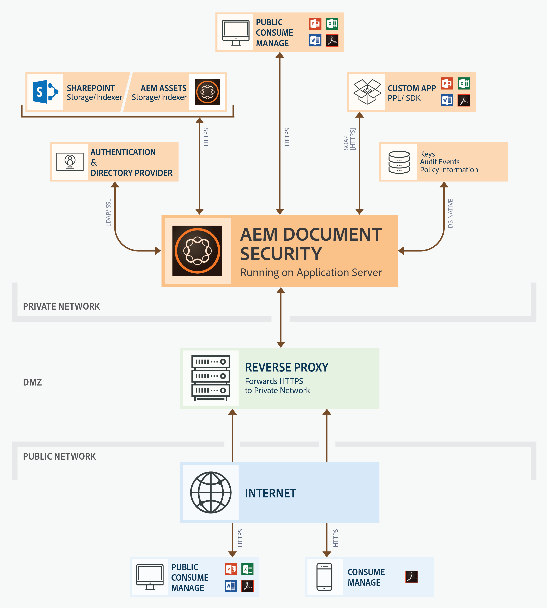

# Dokumentsäkerhet{#document-security-offerings}

Dokumentskyddet i Adobe Experience Manager Forms säkerställer att endast behöriga användare kan använda dina dokument. Med dokumentsäkerhet kan du distribuera all information som du har sparat i ett format som stöds. Filformat som stöds är Adobe PDF (Portable Document Format) samt Microsoft Word-, Excel- och PowerPoint-filer.

Du kan skydda dokument med hjälp av profiler. De sekretessinställningar du anger i en profil avgör hur en mottagare kan använda ett dokument som du tillämpar profilen på. Du kan till exempel ange om mottagarna ska kunna skriva ut eller kopiera text, redigera text eller lägga till signaturer och kommentarer i skyddade dokument.

Profilerna lagras på dokumentsäkerhetsservern. du tillämpar profilerna på dokument via ditt klientprogram. När du tillämpar en profil på ett dokument skyddar sekretessinställningarna som anges i profilen den information som dokumentet innehåller. Du kan distribuera det profilskyddade dokumentet till mottagare som har behörighet enligt profilen.

I följande diagram visas den typiska arkitekturen för AEM Forms Document Security:

## Dokumentsäkerhetsklienter {#document-security-clients}

Dokumentskydd ger olika klienter för att skydda dokument, visa och redigera skyddade dokument och indexerare för att möjliggöra fulltextsökning i skyddade dokument. Du kan välja en klient baserat på dina krav och klientens funktioner.

Document Security Server är den centrala komponenten som Document Security utför transaktioner som användarautentisering, hantering av profiler i realtid och tillämpning av sekretess. Servern har också ett centralt arkiv för policyer, granskningsposter och annan relaterad information.

På dokumentsäkerhetsservern finns ett webbaserat gränssnitt (webbsida) för att skapa profiler, hantera principskyddade dokument och övervaka händelser som är kopplade till principskyddade dokument. Administratörer kan också konfigurera globala alternativ som användarautentisering, granskning och meddelanden för inbjudna användare samt hantera inbjudna användarkonton.

Servern ingår i tillägget AEM Forms Document Security. Du kan kontakta AEM Forms [säljteam](https://www.adobe.com/products/request-consultation/marketing-cloud.html?s_osc=70114000002JNwKAAW&s_iid=70114000002JHs3AAG) för att köpa tillägget Dokumentsäkerhet.

### Skydda dokument {#protect-documents}

AEM Forms Document Security har olika verktyg för att tillämpa skyddsprofiler. Du kan välja ett verktyg enligt dina krav och specifikationer.

Du kan använda Document Security SDK, Adobe Acrobat, Document Security Extension för Microsoft Office eller Portable Protection Library för att tillämpa och spåra säkerhetsprofilerna:

* **** Document Security SDK: SDK är en funktionsrik klient. Du kan använda Document Security SDK för att få åtkomst till dokumentserverfunktioner, öppna policyskyddade dokument och utveckla anpassade tillägg, plugin-program eller program. Du kan till exempel utveckla tillägg för att skydda anpassade filformat eller integrera SDK med DLP-lösningar (Data Loss Prevention). Tillägg, program och plugin-program som utvecklats med Document Security SDK skickar dokument till en angiven AEM Forms-server och reglerna tillämpas på servern. Observera också att AEM Forms Document Security Client SDK (CSDK) inte kan ta bort skyddet för dokument som skyddas med PPL (Portable Protection Library) och vice versa.

   Dokumentsäkerhet SDK är tillgängligt för både Java och C++. Java SDK ingår i erbjudandet AEM Forms Document Security och installeras när AEM-formulär distribueras i JEE. Kontakta [AEM Support](https://helpx.adobe.com/marketing-cloud/contact-support.html) för att beställa C++ SDK. C++ SDK kan kompileras med Microsoft Visual Studio 2013. Du kan besöka dokumentationswebbplatsen för [Document Security API](https://help.adobe.com/en_US/livecycle/11.0/Services/WS92d06802c76abadb76c48dfe12dbeb3e281-7ff0.2.html) om du vill lära dig mer om och använda funktioner i SDK.

* **** Adobe Acrobat: Du kan använda Adobe Acrobat för att tillämpa skyddsprofiler på PDF-dokument som skapats med vanliga datorprogram, t.ex. Microsoft Office, webbläsare eller andra program som stöder utskrift i PDF-format.

   Du kan köpa och hämta Adobe Acrobat från [Adobes webbplats](https://acrobat.adobe.com/us/en/free-trial-download.html). Adobe Acrobat-artikeln [Konfigurera skyddsprofiler för PDF-filer](https://helpx.adobe.com/acrobat/using/setting-security-policies-pdfs.html) innehåller detaljerad information om hur du skapar och tillämpar skyddsprofiler i Adobe Acrobat.

* **Document Security Extension for Microsoft Office**: Du kan använda dokumentsäkerhetstillägget för Microsoft Office för att tillämpa fördefinierade profiler på dina Microsoft Office-filer inifrån Microsoft Office-programmen. Tillägget säkerställer att endast behöriga personer kan använda principskyddade Microsoft Word-, Excel- och PowerPoint-filer. Endast behöriga användare som har plugin-programmet installerat kan använda principskyddade filer.

   Tillägget Dokumentsäkerhet är tillgängligt som ett Microsoft Office-plugin-program. Du kan kontakta [AEM-supportteamet](https://helpx.adobe.com/ca/marketing-cloud/contact-support.html) för att köpa tillägget. Senare kan du gå till [Document Security Extension for Microsoft Office](https://helpx.adobe.com/aem-forms/aem-document-security/aem-document-security-extension-help.html) och läsa om hur du installerar, konfigurerar och använder tillägget.

* **** Portable Protection Library: PPL (Portable Protection Library) skyddar ett dokument lokalt utan att skicka dokumentet till AEM Forms-servern. Det är bara säkerhetsreferenser och principinformation som rör sig över nätverket. Med PPL kan du även begränsa åtkomst till profiler för enbart inloggade användare. Du kan hämta profiler med kontexten för den användare som är inloggad AEM-användare.

   Tillsammans med ovanstående har Portable Protection Library alla funktioner i Document Security SDK. Du kan använda Document Security SDK för att få åtkomst till dokumentserverfunktioner, öppna policyskyddade dokument och utveckla anpassade tillägg, plugin-program eller program. Observera också att PPL (Portable Protection Library) inte kan ta bort skyddet för dokument som skyddas med AEM Forms-dokumentsäkerhet, klient-SDK (CSDK) och vice versa.

   Portable Protection Library är tillgängligt för Java och C++ i 32- och 64-bitarsversioner. Det finns också som ett OSGi-paket för AEM Forms on OSGi. C++ PPL kan kompileras med Microsoft Visual Studio 2013. Om du har licensierat tillägget AEM Forms Document Security kan du kontakta [AEM Forms Document Security](https://helpx.adobe.com/marketing-cloud/contact-support.html) -supportteamet för att skaffa Portable Protection Library. Senare kan du använda hjälpen för Portable Protection Library (medföljer biblioteket) för att konfigurera och använda Portable Protection Library.

### Visa eller redigera skyddade dokument {#view-or-edit-protected-documents}

* För **PDF-dokument** kan du använda Adobe Acrobat DC, Acrobat Reader och Acrobat Reader Mobile för att visa skyddade PDF-dokument. De flesta användare har redan Acrobat Reader installerat på sina enheter, så de behöver inte skaffa eller lära sig någon extra programvara för att visa skyddade dokument. Du kan även hämta Acrobat Reader från [Acrobat Readers hämtningswebbplats](https://get.adobe.com/reader/).

* För **Microsoft Office-dokument** krävs tillägget Microsoft Office och AEM Forms Document Security för Microsoft Office. Tillägget Dokumentsäkerhet är tillgängligt som ett Microsoft Office-plugin-program. Du kan hämta tillägget från Adobes webbplats.

### Indexera skyddade dokument {#index-protected-documents}

Microsoft Windows fulltextsökmotorer (SharePoint Index-server) och Adobe Experience Manager (AEM) kan utföra fulltextsökning i vanliga dokumentformat som vanliga textfiler, Microsoft Office-dokument och PDF-dokument. Du kan använda dokumentsäkerhetsindexerare för att aktivera fulltextsökmotorer för att söka efter skyddade PDF-dokument:

* **** iFilter-indexerare: Du kan använda iFilter-indexeraren för att indexera skyddade PDF-dokument och aktivera fulltextsökmotorer för Microsoft Windows (Desktop Indexing Service och SharePoint Indexserver) för att söka i skyddade PDF-dokument. Mer information finns i [AEM SharePoint IFilter for Protected Documents](assets/sharepoint-ifilter-doc-security.pdf).

* **** AEM Forms Document Security Indexer: Du kan använda indexeraren för AEM Forms Document Security för att indexera skyddade PDF-dokument och aktivera Adobe Experience Manager för att söka i skyddade PDF-dokument. Indexerarna ingår i erbjudandet AEM Forms Document Security. Dessa ingår i AEM Forms på JEE-installationsprogram.

