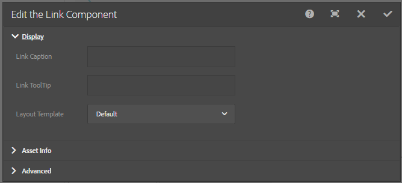

# Bädda in länkkomponent på en sida{#embedding-link-component-in-a-page}

## Förutsättningar {#prerequisites}

Länkkomponenten är medlem i kategorin Dokumenttjänster. Kontrollera att kategorin Document Services är synlig i webbläsaren för AEM-komponenter. Om kategorin inte finns med i listan följer du stegen som beskrivs i [Aktivera komponenter](/help/forms/using/enabling-forms-portal-components.md)i formulärportalen.

## Länkkomponent {#link-component}

Med länkkomponenten kan formulärportalförfattare skapa en länk till ett anpassat formulär var som helst på en sida. Komponenten Link är tillgänglig i avsnittet Document Services i komponentwebbläsaren.

Utför följande steg för att lägga till en länkkomponent på sidan:

1. Dra **länkkomponenten** på sidan. Markera komponenten och tryck på . Dialogrutan Redigera länkkomponent öppnas.

   

1. Ange följande på fliken **Visa** :

   * **Länkbeskrivning**: Länka text eller bildtext för länken.
   * **Länkverktygstips**: Verktygstips för länken.
   * **Layoutmall**: Mall för layout för länkkomponenten.

1. Öppna fliken **Resursinformation** och ange resursens typ. En resurs kan vara ett **formulär**. Beroende på vilken typ av resurs som valts visas alternativen nedan:

   * **Resurssökväg**: Databassökväg där resursen lagras.

   * **Återgivningstyp**: Återgivningsformatet - PDF, HTML eller Auto. Återgivningstypen Automatisk identifierar användarmiljön och återger formuläret som HTML eller PDF. Om formuläret till exempel nås från en mobil enhet återges formuläret i HTML av återgivningstypen Auto.
   * **** Skicka URL:  URL till den server där formulärdata skickas.
   * **HTML-profil**: Profil för återgivning av formuläret som HTML.
   * **PDF-profil**: Profil för återgivning av formuläret som PDF-dokument.

1. Öppna fliken **Avancerat** . Du kan ange ytterligare parametrar i nyckelvärdepar-formatet. När användaren klickar på länken skickas dessa ytterligare parametrar tillsammans med formuläret.

   Tryck på **Klar** för att spara konfigurationen.

## Bästa tillvägagångssätt för att använda länkkomponenten {#best-practices-for-using-link-component-br}

* Se till att du väljer PDF som återgivningstyp om den sökväg som anges i Formulärsökväg pekar på ett dokument som har PDF som tillåtet återgivningsformat.
* Skicka-URL för ett formulär kan anges på flera ställen och prioritetsordningen är följande:

   1. Skicka-URL som är inbäddad i formuläret (med Skicka-knappen) har högsta prioritet.
   1. Överförings-URL:en som nämns i Forms Manager har medelprioritet.
   1. Överförings-URL som anges i formulärportalen har lägst prioritet.
