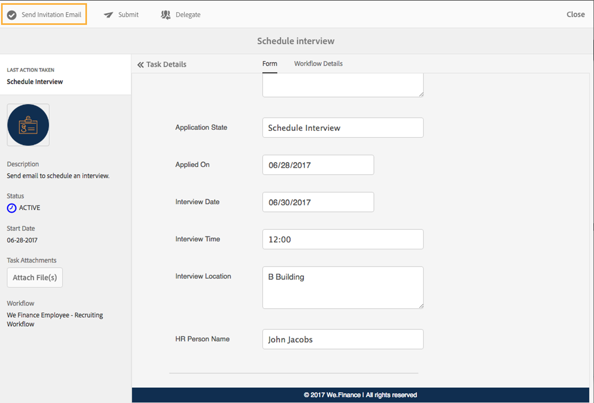
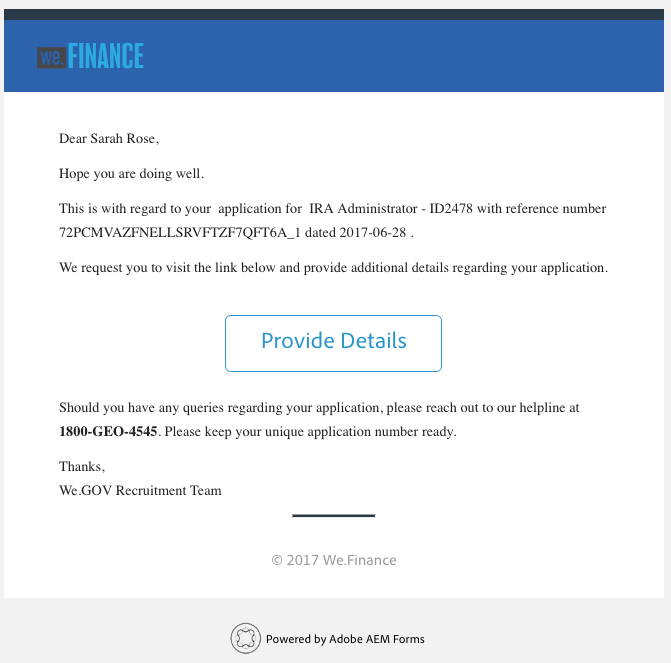
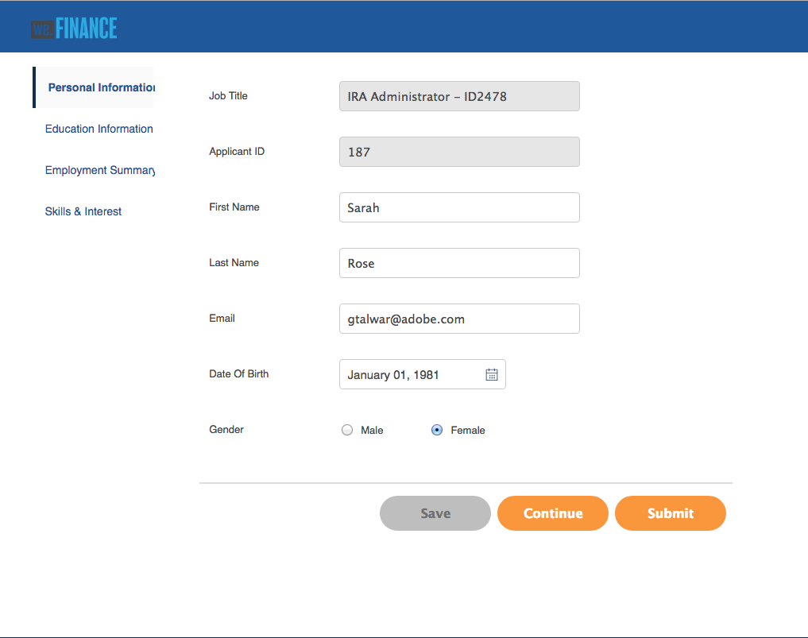
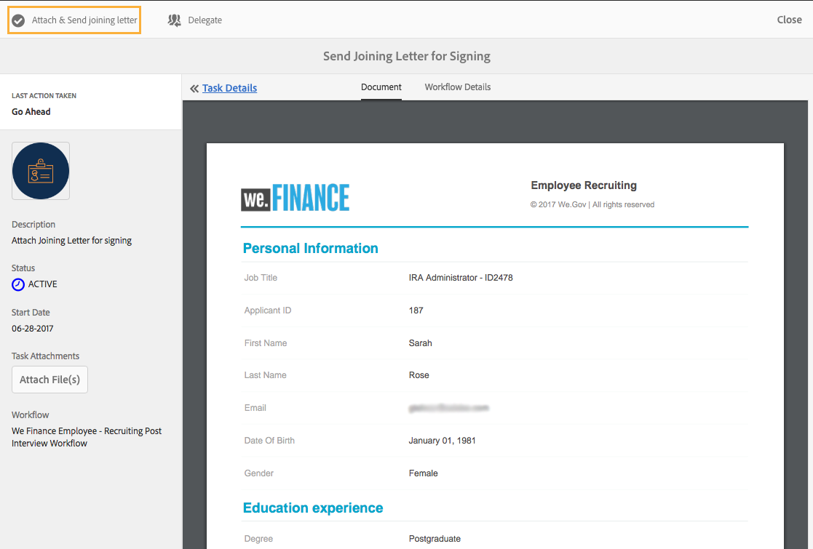

# Genomgång av referenswebbplats för rekrytering av medarbetare {#employee-recruitment-reference-site-walkthrough}

## Förutsättning {#prerequisite}

Konfigurera referenswebbplatserna enligt beskrivningen i [Konfigurera och konfigurera AEM Forms-referenswebbplatser](/help/forms/using/setup-reference-sites.md).

## Översikt {#overview}

Vi.Finance är en organisation som gör det möjligt för sökande att ansöka om anställning via referensportalen på webbplatsen. Organisationen använder även portalen för att hantera de sökandes intervjuer, schemaläggning, genvägar och intern kommunikation. Webbplatsen hanterar följande:

* Sökande och sökande som ansöker om jobb
* Screening och förkortning av anbudssökande
* Intervjuprocess
* Samling med information om kandidater
* Kandidatbakgrundskontroll
* Erbjudanden till utvalda anbudssökande rullas ut

>[!NOTE]
>
>Personalrekryteringsexempel finns både på referenswebbplatserna We.Finance och We.Gov. De exempel, bilder och beskrivningar som används i genomgången använder referenswebbplatsen We.Finance. Du kan dock köra de här användningsexemplen och granska artefakter med hjälp av We.Gov också. Om du vill göra det ersätter du **webbfinansiering** med **webbadressen** .

### Arbetsflödesmodeller {#workflow-models-involved}

Handlingen för rekrytering av personal omfattar två arbetsflöden:

* Före intervjun - Vi finansierar arbetsflödet för rekrytering av medarbetare
* Efter intervjun - Arbetsflödet för rekrytering av medarbetare efter intervjun är ekonomiskt

Dessa arbetsflöden skapas i AEM och finns på:

`https://[authorHost]:[authorPort]/libs/cq/workflow/admin/console/content/models.html/etc/workflow/models/`

#### Arbetsflöde för rekrytering av medarbetare {#we-finance-employee-recruiting-workflow}

Här följer en modell för det arbetsflöde för rekrytering av webbpersonal som följs i det här dokumentet.

#### Arbetsflöde för rekrytering av medarbetare efter intervju {#we-finance-employee-recruiting-post-interview-workflow}

Här följer en modell för det arbetsflöde för rekrytering efter intervju som följs i det här dokumentet.

### Personas {#personas}

Scenariot omfattar följande personligheter:

* Sarah Rose, den som ansöker om ett jobb på företaget
* John Jacobs, rekryteraren
* Gloria Rios, anställningschef
* John Doe, den höga representanten

## Sarah ansöker om ett jobb {#sarah-applies-for-a-job}

Sarah Rose letar efter en jobbmöjlighet i organisationen. Hon besöker sin webbportal och utforskar de lediga jobb som finns listade på Career-sidan. Hon hittar en matchande jobblista och söker efter den.

Startsida för We.Finance

We.Finance career page

Sarah klickar på Apply på ett jobbinlägg. Jobbansökningsformuläret öppnas. Hon fyller i alla uppgifter i ansökan och skickar in den.

### Så här fungerar det {#how-it-works}

Startsidan för We.Finance och karriärsidan är AEM Sites-sidor. På karriärsidan bäddas ett anpassat formulär in, som använder en upprepningsbar panel för att hämta jobböppningar med hjälp av en tjänst och visa dem på sidan. Du kan granska det adaptiva formuläret på `https://[authorHost]:[authorPort]/editor.html/content/forms/af/we-finance/employee/recruitment/jobs.html`.

### Se det själv {#see-it-yourself}

Gå till `https://[publishHost]:[publishPort]/content/we-finance/global/en.html` och klicka på **[!UICONTROL Jobb]**. Klicka på **[!UICONTROL Sök]** för att fylla i jobblistan och klicka sedan på **[!UICONTROL Tillämpa]** för ett jobb. Fyll i uppgifterna i formuläret och skicka in ansökan.

Se till att du anger ett giltigt e-post-ID i programmet eftersom all kommunikation genom genomgången skickas till det angivna e-post-ID:t.

## John Jacobs korthåller Sarah Rose profil för rekryteringschefens screening {#john-jacobs-shortlists-sarah-rose-s-profile-for-the-hiring-manager-s-screening}

Organisationen får den jobbansökan som har skickats in av Sarah. John Jacobs, en rekryterare, får i uppdrag att granska Sarah profil. Han granskar uppgiften i sin AEM Inbox, hittar profilen som matchar jobbbehovet och klickar på Kortlista. Sarah&#39;s profil vidarebefordras till Gloria Rios, anställningschef, för godkännande.

John&#39;s AEM Inbox

John Jacobs korthåller Sarah Rose profil för rekryteringschefens screening

**Så här fungerar det**

Skicka-åtgärden i jobbansökningsformuläret utlöser ett arbetsflöde som skapar en uppgift i John Jakobs inkorg för att visa programmet. När John, granskar och förkortar programmet, skapar arbetsflödet en uppgift i personalhanteraren, Glorias inkorg.

### Se det själv {#see-it-yourself-1}

Gå till `https://[publishHost]:[publishPort]/content/we-finance/global/en/login.html?resource=/aem/inbox.html`och logga in med jjacobs/password som användarnamn/lösenord för John Jacobs. Öppna Granska kandidatprofil och korta listan med den sökande.

## Gloria granskar ansökan och godkänner den som ansöker om en intervju {#gloria-reviews-the-application-and-approves-the-applicant-for-an-interview}

Gloria, anställningschef, får den genlistade profilen som en uppgift i sin AEM Inbox. Hon granskar den och godkänner kandidaten Sarah Rose för intervjun.

Gloria&#39;s AEM inbox

Gloria godkänner Sarah Rose för en intervju

**Så här fungerar det**

När Gloria godkänner kandidaten till en intervju skapar arbetsflödet en uppgift i AEM Inbox på John Doe, som är rekryterare för We.Finance.

### Se det själv {#see-it-yourself-2}

Gå till `https://[publishHost]:[publishPort]/content/we-finance/global/en/login.html?resource=/aem/inbox.html` och logga in med jjacobs/password som användarnamn/lösenord för John Jacobs. Öppna Granska kandidatprofil och korta listan med den sökande.

Gå till `https://[publishHost]:[publishPort]/content/we-finance/global/en/login.html?resource=/aem/inbox.html` och logga in med stödraster/lösenord som användarnamn/lösenord för Gloria Rios. Öppna aktiviteten Granska kandidatprofil och klicka på Schemalägg intervju.

## John Doe schemalägger en intervju {#john-doe-schedules-an-interview}

John Doe får i uppdrag att schemalägga en intervju i sin inkorg. John Doe väljer och öppnar uppgiften och korrigerar intervjudatum och -tid, plats samt den HR-person som ansvarar för intervjun som John Jacob. John Doe klickar på Skicka inbjudan via e-post. Ett mejl skickas till Sarah och en uppgift tilldelas Gloria, anställningschef, för att intervjua Sarah.

John Does AEM-inkorg

John Doe schemalägger intervjun och skickar detaljerna till Sarah Rose

## Sarah Rose får ett mejl med intervju {#sarah-rose-receives-the-email-with-interview-schedule}

Sarah Rose får e-postmeddelandet med intervju, plats och annan information. Hon klickar på Godkänn för att bekräfta att hon är okej med intervjun och platsen. Enligt den exakta informationen gör Sarah det till intervjuerna.

Sarah Rose får intervjuschemat

## När intervjuerna är klara listar rekryteringshanteraren Sarah Rose {#after-the-interviews-the-hiring-manager-shortlists-sarah-rose}

När Sarah Rose har gått igenom intervjuerna och rensat dem, öppnar Gloria Rios, rekryteringshanteraren, aktiviteten Kandidatval från sin inkorg och klickar på Välj. Gloria Rios beslut fattas av den höga representanten John Doe för vidare behandling.

Gloria&#39;s AEM inbox

Gloria Rios väljer Sarah Rose efter intervjuerna

## John Doe begär mer information {#john-doe-requests-more-information}

Innan du ber en kandidat att gå med i organisationen måste hennes bakgrund kontrolleras. John Doe öppnar och granskar den valda sökandes uppgifter och finner att en del av hennes anställnings- och utbildningsinformation ännu inte är ifylld. John Doe klickar på Behöver mer information.

 

John Doe begär mer information från Sarah Rose om hennes utbildning och arbetsupplevelse

## Sarah Rose får ett mejl med en begäran om ytterligare information {#sarah-rose-receives-an-email-requesting-further-information}

Sarah Rose får ett mejl som meddelar henne att ytterligare information krävs för att behandla hennes ansökan om anställning. E-postmeddelandet innehåller en länk till formuläret för att fylla i den information som krävs.

Sarah Rose får ett e-postmeddelande som meddelar att ytterligare information krävs för att behandla hennes ansökan om anställning

Sarah klickar på länken Ange detaljer i e-postmeddelandet. Ett formulär visas. Sarah fyller i de uppgifter om utbildning och anställning som krävs enligt John Doe och klickar på Submit.

Sarah öppnar det extra informationsformuläret genom att klicka på länken i e-postmeddelandet

Sarah fyller i ytterligare information som John Doe begärt och klickar på Skicka

## John Doe granskar den valda kandidatprofilen för ytterligare information {#john-doe-reviews-the-selected-candidate-profile-for-the-additional-information-provided}

John Doe väljer begäran om kandidatgranskning och öppnar den. John Doe hittar att Sarah har fyllt i all information som behövs. När John Doe granskat programmet klickar han på Godkänn. Efter godkännande av John Doe vidarebefordras begäran om bakgrundskontroll av Sarah Rose till John Jacobs.

John Does AEM Inbox

John Doe granskar den ytterligare information som Sarah lämnat och godkänner den

## John Jacobs får en begäran om bakgrundskontroll {#john-jacobs-receives-a-background-check-request}

John Jacobs ser begäran om bakgrundskontroll i sin inkorg. John Jacobs öppnar uppgiften och läser informationen från Sarah Rose. När John Jacobs gjort en bakgrundskontroll klickar han på Gå framåt för att ange att bakgrundskontrollen har lyckats.

John Jacobs&#39;s AEM inbox

När John Jacobs utfört bakgrundskontrollen klickar han på Gå framåt

## John Doe skickar ut brevet till Sarah Rose {#john-doe-sends-out-the-joining-letter-to-sarah-rose}

John Doe får en förfrågan i sin AEM-inkorg om att skicka det kopplade brevet. John öppnar förfrågan och ser detaljerna. John Doe bifogar PDF-dokumentet med det kopplade brevet och klickar sedan på Bifoga och skicka det kopplade brevet.

John Does AEM-inkorg

John Doe skickar ut det kopplade brevet för signering

## Sarah Rose får och signerar det kopplade brevet {#sarah-rose-receives-and-signs-the-joining-letter}

Sarah Rose får det förenande brevet för undertecknande. Sarah klickar här för att granska och signera det kopplade brevet. PDF-dokumentet med det kopplade brevet öppnas med ett fält för signering av dokumentet.

Sarah Rose får det kopplade brevet för signering

Sarah kan välja att antingen skriva in, använda draw för hand, infoga en bild av en signatur eller använda mobilens pekskärm för att rita sin signatur. Sarah skriver sitt namn, klickar på Klicka för att signera och laddar ned den signerade kopian av det kopplade brevet.

Sarah skriver i sitt namn för att underteckna det kopplade brevet

Sarah klickar på Klicka för att signera för att slutföra signeringen av det kopplade brevet

