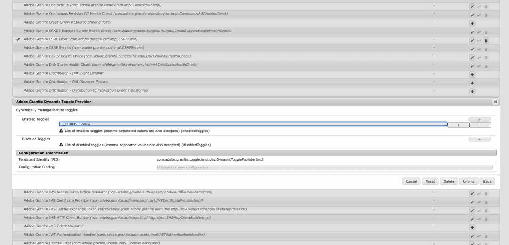

# Växla funktion i Adobe Experience Manager (AEM) 6.5{#enable-feature-toggle-aem-forms-65}

Växla funktion är en funktion i AEM som gör att administratörer kan aktivera eller inaktivera specifika funktioner dynamiskt. Den här funktionen är särskilt användbar för hantering av **funktioner för tidig Adobe** och **förhandsversion** utan att kodbasen behöver distribueras eller ändras. Programmet ger flexibilitet och kontroll över vilka funktioner som är tillgängliga i en AEM-miljö.

## Varför ska du använda Funktion? Växlar i en AEM 6.5-konfiguration?

När du arbetar i en AEM 6.5-konfiguration växlar funktionen hjälpen i:

* Testa experimentella funktioner på ett säkert sätt.

* Nya komponenter rullas ut i faser.

* En och samma kodbas i olika miljöer.

* Minska riskerna vid driftsättning och uppgraderingar.

## Övervägande

Från och med AEM 6.5 SP23 behöver du inte utföra kravstegen eftersom paketet [com.adobe.granite.toggle.impl.dev](http://com.adobe.granite.toggle.impl.dev/) redan är installerat med Forms-tillägget.

## Förutsättningar

Innan du aktiverar funktionsväxlingar i AEM 6.5 ska du kontrollera följande:

* Användaren är medlem i gruppen `forms-users`.

* Navigera till `http://<author-instance-url>:portnumber/system/console/bundles` och kontrollera om paketet **(com.adobe.granite.toggle.impl.dev-1.1.8.jar)** finns eller inte. Om det inte finns [hämtar du paketet från länken](https://experience.adobe.com/#/downloads/content/software-distribution/en/aem.html?package=%2Fcontent%2Fsoftware-distribution%2Fen%2Fdetails.html%2Fcontent%2Fdam%2Faem%2Fpublic%2Fadobe%2Fpackages%2Fcq650%2Fhotfix%2Fcom.adobe.granite.toggle.impl.dev-1.1.8.jar).

## Aktivera växling av funktioner {#enable-feature-toggle-65}

Funktionsväxlar för tidiga användare eller nya funktioner kan konfigureras via **AEM Web Console** genom att följa stegen nedan:

1. Logga in på din AEM Forms-instans.
2. Navigera till `http://<author-instance-url>:portnumber/system/console/configMgr`.
3. Sök efter **Adobe Granite Dynamic Toggle Provider** i Configuration Manager.
4. Klicka på ikonen .
5. Klicka på [!UICONTROL Enabled Toggles]pennikonen.
6. Lägg till alternativknapps-ID för funktionen enligt bilden nedan.
   

   >[!NOTE]
   >
   >Du kan hitta alternativknappen i dokumentet som är specifikt för de tidiga adopterfunktionerna.

7. Klicka på Spara.

## Inaktivera funktion, växla {#disable-feature-toggle-65}

Följ stegen nedan för att inaktivera funktionsknapparna för funktioner vars växlingsknappar är aktiverade:

1. Logga in på din AEM Forms-instans.
2. Navigera till `http://<author-instance-url>:portnumber/system/console/configMgr`.
3. Sök efter **Adobe Granite Dynamic Toggle Provider** i Configuration Manager.
4. Klicka på ikonen .
5. Klicka på [!UICONTROL Disabled Toggles]pennikonen.
6. Lägg till växlingsnumret för den funktion som ska inaktiveras.
   
7. Klicka på Spara.

## Tekniska överväganden

Funktionsväxlar är miljöspecifika och hanteras vid körning, så de kräver ingen omstart av servern. Vissa funktioner kan dock kräva att de relevanta sidorna uppdateras eller att cacheminnet rensas för att återspegla ändringarna.
Du kan komma åt listan över funktioner som aktiverats genom att växla till din miljö via `http://<author-instance-url>:4502/etc.clientlibs/toggles.json`.
